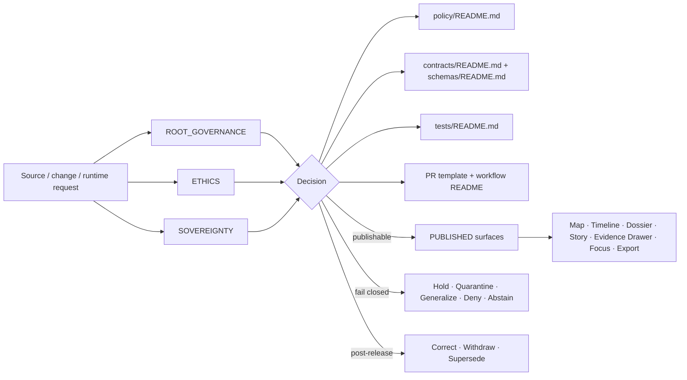

<!-- [KFM_META_BLOCK_V2]
doc_id: kfm://doc/NEEDS_VERIFICATION_UUID
title: Kansas Frontier Matrix — Governance
type: standard
version: v1
status: draft
owners: NEEDS VERIFICATION
created: YYYY-MM-DD
updated: YYYY-MM-DD
policy_label: NEEDS VERIFICATION
related: [./ROOT_GOVERNANCE.md, ./ETHICS.md, ./SOVEREIGNTY.md]
tags: [kfm, governance]
notes: [Target path, owners, dates, policy label, and linked companion-file presence still need live repo verification.]
[/KFM_META_BLOCK_V2] -->

# Kansas Frontier Matrix — Governance

*Directory index for the policy, review, sensitivity, and publication rules that keep KFM evidence-governed.*

> **Status:** experimental  
> **Owners:** NEEDS VERIFICATION  
>        
> **Quick jump:** [Scope](#scope) · [Verification posture](#verification-posture) · [Repo fit](#repo-fit) · [Inputs](#inputs) · [Exclusions](#exclusions) · [Directory tree](#directory-tree) · [Quickstart](#quickstart) · [Usage](#usage) · [Diagram](#diagram) · [Tables](#tables) · [Task list](#task-list) · [FAQ](#faq) · [Appendix](#appendix)

> [!IMPORTANT]
> This README is grounded in the March 2026 KFM doctrine corpus and an attached repo-grounded audit summary. KFM’s governance law is strong and repeated. Live repo file presence for this directory, named owners, exact dates, and active merge-gate wiring still need direct workspace verification before merge.

## Scope

This directory is the human navigation layer for KFM governance.

Use it to find the rules that decide whether a claim, layer, dossier, story, export, or runtime answer is allowed to move forward, must be generalized, needs steward review, or must fail closed. In KFM, governance is not decorative values language layered on top of implementation. It is the first architectural dependency: truth path before delivery, policy before publication, review before trust, correction before silent replacement.

This README should stay compact and directional. Governing law belongs in the companion governance documents and in machine-readable policy, contract, schema, fixture, and test surfaces elsewhere in the repo.

## Verification posture

| Label | Meaning here |
|---|---|
| **CONFIRMED** | Directly supported by the attached March 2026 KFM doctrine corpus or by the attached repo-grounded audit summary. |
| **INFERRED** | Structurally implied by repeated KFM doctrine and added only where the directory contract would otherwise stay incomplete. |
| **PROPOSED** | Repo-ready packaging or wording that fits KFM doctrine but was not proven as mounted implementation in this session. |
| **UNKNOWN** | Not supported strongly enough in the current session to present as live repo or runtime fact. |
| **NEEDS VERIFICATION** | Exact file presence, owners, dates, policy labels, and active automation that should be rechecked in the real repository before merge. |

> [!CAUTION]
> Do not smooth **INFERRED**, **PROPOSED**, **UNKNOWN**, or **NEEDS VERIFICATION** material into implementation fact. The attached corpus repeatedly warns against turning polished prose into false repo certainty.

## Repo fit

| Item | Value |
|---|---|
| Target file | `docs/governance/README.md` **(PROPOSED / NEEDS VERIFICATION)** |
| Upstream | [Repository README][repo-root] |
| Primary downstream companions | [ROOT_GOVERNANCE.md][root-governance] · [ETHICS.md][ethics] · [SOVEREIGNTY.md][sovereignty] **(paths NEEDS VERIFICATION)** |
| Role in repo | Human-facing directory index for governance law, review boundaries, sensitivity rules, publication posture, and correction guidance |
| Must stay aligned with | [policy/README.md][policy-readme] · [contracts/README.md][contracts-readme] · [schemas/README.md][schemas-readme] · [tests/README.md][tests-readme] · [tools/README.md][tools-readme] · [scripts/README.md][scripts-readme] · [PR template][pr-template] · [workflow README][workflows-readme] |
| Useful documentation neighbor | [readme-structure-reconciliation.md][readme-recon] |

## Inputs

Accepted material for this directory includes:

- governance law and directory-level navigation
- review triggers and approval boundaries
- ethics, public-consequence, and trust-visible UX obligations
- sovereignty, rights, sensitivity, and exact-location exposure rules
- publication blockers, withdrawal, supersession, and correction posture
- links to adjacent contracts, schemas, policy bundles, tests, runbooks, and review surfaces when governance changes imply machine-checkable consequences

## Exclusions

This directory should not absorb everything important.

- Machine-readable policy bundles, reason-code registries, and obligation registries belong under policy surfaces, not here.
- Schemas, valid/invalid fixtures, and validator expectations belong under contracts, schemas, fixtures, and tests.
- Subsystem runbooks belong in runbook surfaces, even when governance depends on them.
- Domain-specific source inventories, ingestion details, or analytical method notes belong in their lane docs.
- Exploratory ideas, draft experiments, or ungated pattern notes belong in research or draft areas, not here as governing law.

## Directory tree

Baseline-linked governance set for this directory:

```text
docs/governance/
├── README.md              # Directory contract and navigation (target file)
├── ROOT_GOVERNANCE.md     # Core governance law and review triggers
├── ETHICS.md              # Ethical and public-consequence guardrails
└── SOVEREIGNTY.md         # Rights, sensitivity, stewardship, and location-exposure rules
```

> [!NOTE]
> The README target path above is **PROPOSED / NEEDS VERIFICATION**. The companion filenames are treated as the working governance set because they recur in KFM materials, but their live presence in the mounted repo was not directly reverified in this session.

## Quickstart

Start here whenever a change could alter public trust, public scope, or release meaning.

```text
Open together:
1. ./ROOT_GOVERNANCE.md
2. ../../policy/README.md
3. ../../contracts/README.md and ../../schemas/README.md
4. ../../tests/README.md
5. ../../.github/PULL_REQUEST_TEMPLATE.md
6. ../../.github/workflows/README.md
```

Then use this sequence:

1. Classify the change: admission, review, promotion, delivery, runtime behavior, or correction.
2. Read [ROOT_GOVERNANCE.md][root-governance] first.
3. Add [ETHICS.md][ethics] when the change affects people, persuasion, civic consequence, or how uncertainty is shown.
4. Add [SOVEREIGNTY.md][sovereignty] when the change touches culturally sensitive material, rare-species data, oral histories, archaeology, exact locations, or any other steward-sensitive lane.
5. Check whether the change must also update [policy/README.md][policy-readme], [contracts/README.md][contracts-readme], [schemas/README.md][schemas-readme], or [tests/README.md][tests-readme].
6. Keep the allowed outcome explicit: **allow/publish**, **review-required**, **hold**, **quarantine**, **generalize**, **deny**, **abstain**, **withdraw**, **supersede**, or **correct**.
7. Update docs, examples, fixtures, tests, and runbooks in the same governed change stream.

## Usage

### Start here when…

- a map, timeline, dossier, story, export, or Focus answer could present a new public claim
- a change affects release state, review state, or freshness meaning
- a source or lane raises rights, sensitivity, or exact-location exposure questions
- a derived layer risks being mistaken for authoritative truth
- a correction, withdrawal, or supersession path needs to be defined or updated
- a contributor wants to change how public-safe failure states are shown

### Escalate immediately when…

- exact coordinates, geometry, or descriptive detail could expose sensitive places, species, sites, or people
- runtime behavior could return uncited or over-scoped prose instead of **ANSWER / ABSTAIN / DENY / ERROR**
- a convenience path bypasses the governed API, policy evaluation, review boundary, or evidence resolution path
- a public surface proposes to hide stale, partial, generalized, withdrawn, or corrected state
- a policy-significant change is documented here but not reflected in adjacent policy, contract, schema, or test surfaces

## Diagram


```mermaid
flowchart LR
    A[Source / change / runtime request] --> B[ROOT_GOVERNANCE]
    A --> C[ETHICS]
    A --> D[SOVEREIGNTY]

    B --> E{Decision}
    C --> E
    D --> E

    E --> F[policy/README.md]
    E --> G[contracts/README.md + schemas/README.md]
    E --> H[tests/README.md]
    E --> I[PR template + workflow README]

    E -->|publishable| J[PUBLISHED surfaces]
    J --> K[Map · Timeline · Dossier · Story · Evidence Drawer · Focus · Export]

    E -->|fail closed| L[Hold · Quarantine · Generalize · Deny · Abstain]
    E -->|post-release| M[Correct · Withdraw · Supersede]
```

## Tables

### Deny-by-default seams

| Seam | Governance meaning | Typical fail-closed outcome |
|---|---|---|
| **Admission** | Unresolved rights, sensitivity, or source admissibility blocks intake from becoming governed truth | hold · quarantine |
| **Promotion** | Missing review, closure, proof, or synced documentation blocks publication | review-required · hold |
| **Delivery** | Stale or unlinked derived projections must not silently appear current | stale-visible · withhold · rebuild |
| **Runtime** | Missing admissible evidence or failed citation checks must not produce confident prose | abstain · deny · error |

### Trust-visible surfaces

| Surface | Governance must make visible |
|---|---|
| **Map Explorer** | time scope, layer state, freshness, route to evidence |
| **Timeline** | valid-time framing, event grain, stale-state cues, comparison basis |
| **Dossier** | identity, dependencies, service context, hazard/water context, evidence links |
| **Story** | evidence-linked excerpts, dates, perspective labels, review/correction state |
| **Evidence Drawer** | EvidenceBundle members, transform context, release state, preview limits |
| **Focus Mode** | scoped retrieval, citation verification, audit linkage, **ANSWER / ABSTAIN / DENY / ERROR** |
| **Review / Stewardship** | diff, gate results, policy labels, review notes, receipts, no hidden approvals |
| **Export** | release scope, evidence linkage, preview policy, correction linkage |

### Cross-repo touchpoints

| Surface | Why governance should link to it | Current evidence posture |
|---|---|---|
| [policy/README.md][policy-readme] | deny-by-default posture, reasons/obligations grammar, finite outcomes | **CONFIRMED** in attached repo-grounded summary |
| [contracts/README.md][contracts-readme] + [schemas/README.md][schemas-readme] | keeps governance prose aligned with contract and schema language | **CONFIRMED** in attached repo-grounded summary |
| [tests/README.md][tests-readme] | keeps governance changes paired with fixture/test expectations | **CONFIRMED** in attached repo-grounded summary |
| [tools/README.md][tools-readme] + [scripts/README.md][scripts-readme] | relevant when governance changes imply validator or entrypoint updates | **CONFIRMED** in attached repo-grounded summary |
| [PR template][pr-template] | contributor review checklist, cite-or-abstain reminder, proof/fixtures/tests expectations | **CONFIRMED** in attached repo-grounded summary |
| [workflow README][workflows-readme] | documents CI/workflow scaffolding; do not assume active merge gates without recheck | **CONFIRMED** in attached repo-grounded summary |
| [readme-structure-reconciliation.md][readme-recon] | useful structure reference, but treat with caution because attached audit flagged staleness risk | **CONFIRMED** file reference; content needs verification |

### Decision outcomes

| Outcome | Use it when | Do not treat it as |
|---|---|---|
| **allow / publish** | evidence, policy, review, and release conditions are satisfied | default entitlement |
| **review-required** | machine checks are not enough and steward or reviewer judgment is required | optional paperwork |
| **hold** | readiness is incomplete but may become publishable | failure |
| **quarantine** | rights, sensitivity, or admissibility is unresolved | invisible backlog |
| **generalize** | precise detail would create exposure or interpretive harm | mere cartographic styling |
| **deny** | the request or change exceeds policy or allowed scope | a UX nuisance |
| **abstain** | runtime cannot support the answer safely from admissible evidence | poor assistant performance |
| **withdraw / supersede / correct** | published material later proves unsafe, wrong, over-scoped, or stale | history to hide |

## Task list

### Definition of done

A governance-directory change is ready when:

- [ ] the directory contract still matches what governance is supposed to decide
- [ ] companion governance docs are linked or intentionally flagged as **NEEDS VERIFICATION**
- [ ] governance-significant changes are reflected in adjacent policy, contract, schema, and test surfaces where applicable
- [ ] PR review language and workflow notes are updated when review or gate behavior changes
- [ ] truth posture stays explicit; no line upgrades **INFERRED**, **PROPOSED**, **UNKNOWN**, or **NEEDS VERIFICATION** text into repo fact
- [ ] rights, sensitivity, exact-location, and correction posture are visible where they change outcomes
- [ ] negative outcomes remain first-class, readable, and testable
- [ ] placeholder values for `doc_id`, owners, dates, and policy label are either retired or intentionally left visible

### Open verification items

- [ ] confirm the live repo path for this directory and whether `docs/governance/README.md` already exists
- [ ] confirm the live presence of `ROOT_GOVERNANCE.md`, `ETHICS.md`, and `SOVEREIGNTY.md`
- [ ] replace placeholder `doc_id`, owners, `created`, `updated`, and `policy_label`
- [ ] confirm whether additional governance docs or runbooks in this area should be linked here
- [ ] verify whether CI/workflow behavior has changed since the attached repo-grounded audit
- [ ] verify whether governance changes should currently update any live schema, policy bundle, or fixture inventory beyond documentation surfaces

## FAQ

### Is governance just security?

No. Security is one governed concern, but KFM governance also covers publication, admissibility, rights, sensitivity, exact-location exposure, review authority, runtime failure semantics, and correction lineage.

### Why keep ethics and sovereignty separate from root governance?

Because KFM repeatedly treats public consequence, rights, cultural sensitivity, stewardship, and exact-location exposure as decision-bearing burdens, not footnotes. Keeping them separate improves review clarity without letting them drift away from core governance law.

### Why are deny and abstain healthy outcomes?

Because KFM is designed to fail closed. A visible refusal is more trustworthy than persuasive prose with no admissible evidence path.

### Why is this README still marked experimental?

Because the governance doctrine is well supported, but the current session exposed doctrine PDFs and an attached repo-grounded audit summary rather than a live repo checkout. Exact file presence, owners, dates, and merge-gate state still need direct verification.

## Appendix

<details>
<summary><strong>Working vocabulary</strong></summary>

| Term | Working meaning in this directory |
|---|---|
| **Truth path** | `Source edge → RAW → WORK / QUARANTINE → PROCESSED → CATALOG → PUBLISHED` |
| **Trust membrane** | The governed boundary that keeps public clients and normal UI surfaces from bypassing governed APIs, policy evaluation, and evidence resolution |
| **Authoritative vs derived** | Canonical truth carries governance burden; derived tiles, graphs, indexes, scenes, caches, and summaries remain subordinate unless explicitly promoted |
| **EvidenceRef** | Stable support reference used across KFM trust surfaces |
| **EvidenceBundle** | The governed support payload used to explain a claim, feature, story, export, or runtime answer |
| **Promotion** | A governed state transition, not a file copy |
| **Correction lineage** | The visible chain linking supersession, withdrawal, narrowing, or replacement across affected surfaces |

</details>

<details>
<summary><strong>Review triggers worth keeping visible</strong></summary>

- new public claims or new public claim presentation
- changes to publication classes or release scope
- changes to rights, sensitivity, or exact-location handling
- changes to reviewer roles, steward boundaries, or no-self-approve expectations
- runtime behavior changes affecting citation checks or negative outcomes
- correction, withdrawal, or supersession behavior changes
- governance prose drifting away from policy, contracts, schemas, fixtures, or tests

</details>

<details>
<summary><strong>Authoring guardrails for this directory</strong></summary>

- Prefer precise burden language over abstract values language.
- Link to executable surfaces when governance has machine-checkable consequences.
- Keep live repo uncertainty visible instead of smoothing it away.
- Do not let derived delivery, AI output, or UI polish outrank evidence, policy, review, or correction.
- When in doubt, make the safer outcome legible.

</details>

[Back to top](#kansas-frontier-matrix--governance)

[repo-root]: ../../README.md
[root-governance]: ./ROOT_GOVERNANCE.md
[ethics]: ./ETHICS.md
[sovereignty]: ./SOVEREIGNTY.md
[policy-readme]: ../../policy/README.md
[contracts-readme]: ../../contracts/README.md
[schemas-readme]: ../../schemas/README.md
[tests-readme]: ../../tests/README.md
[tools-readme]: ../../tools/README.md
[scripts-readme]: ../../scripts/README.md
[pr-template]: ../../.github/PULL_REQUEST_TEMPLATE.md
[workflows-readme]: ../../.github/workflows/README.md
[readme-recon]: ../reports/readme-structure-reconciliation.md
