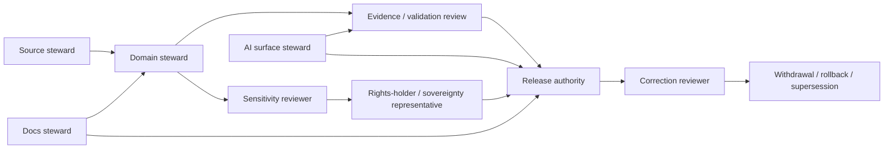

<!-- [KFM_META_BLOCK_V2]
doc_id: kfm://doc/governance/readme
title: KFM Governance — Roles, Review Burden, and Separation of Duties
type: readme
version: v2.1-draft
status: draft; repository-grounded; lane-convergence-index; non-authoritative; no-release-effect
owners: ["@bartytime4life — verified CODEOWNERS review route only"]
owner_status: "No accepted StewardshipAssignment, authenticated KFM actor, independent reviewer, release authority, quorum, or approval is implied."
created: 2026-05-06
updated: 2026-08-23
policy_label: public
owning_root: docs/
current_path: docs/governance/README.md
responsibility: "Human landing page for governance roles, review burden, separation of duties, escalation, contradiction handling, deprecation, decision logging, and their boundaries with doctrine, ADRs, contracts, schemas, policy, validation, release, correction, rollback, and platform controls."
truth_posture: "CONFIRMED repository inventory and Directory Rules placement / PROPOSED roles and separation / CONFLICTED ReviewRecord surfaces / UNKNOWN operational actors, assignments, policy, release, and public behavior / NEEDS VERIFICATION platform enforcement; cite-or-abstain"
evidence_snapshot:
  repository: bartytime4life/Kansas-Frontier-Matrix
  base_commit: f732cbd1003898dc765a7afe4b635d710e295d17
  target_prior_blob: 500f8bcad3a384160a561f1460617f0a13d42fcc
  directory_rules_blob: fd49a0b83e55cef52c1124281f093e263526898d
  adr_0029_blob: a4de0d7a96b78da59cfc499d1025e1508afd8dd9
  adr_index_blob: 8f90c75e662918f8062c4a9d139b19f268295c55
  adr_index_snapshot: "36 numbered; 3 accepted; 33 proposed; 12 unassigned scaffolds"
  adr_0024_blob: 57d46867c97a1c8d76ccdfbc12fc012bee3bd2ea
  codeowners_blob: dd2a84aa514d8ecd9208bc347f90f9a2ed37dd61
  root_registry_blob: 024f668b5f0a9239bafa4f8b09e2afd86300ff8c
inspection_boundary: >-
  GitHub reads covered main, the target, all eight governance documents, accepted
  ADR-0029 and Directory Rules, the ADR index, proposed ADR-0024, CODEOWNERS,
  the root registry, and current review-related contract/schema/profile surfaces.
  The effective ruleset was not directly retrievable. No actor, assignment, live
  policy, review, release, promotion, deployment, publication, correction, or rollback
  was exercised.
related:
  - docs/doctrine/directory-rules.md
  - docs/adr/INDEX.md
  - docs/adr/ADR-0029-adopt-directory-governance-standard-v2.md
  - docs/adr/ADR-0024-steward-separation-of-duties-for-release.md
  - docs/governance/STEWARD_CHARTERS.md
  - docs/governance/REVIEW_DUTIES.md
  - docs/governance/SEPARATION_OF_DUTIES.md
  - docs/governance/ESCALATION.md
  - docs/governance/CONTRADICTION_HANDLING.md
  - docs/governance/DEPRECATION_PROCESS.md
  - docs/governance/DECISION_LOG.md
  - contracts/governance/ReviewRecord.md
  - policy/release/README.md
  - release/reviews/README.md
  - data/receipts/generated/README.md
  - control_plane/root_registry.yaml
  - .github/CODEOWNERS
tags: [kfm, governance, roles, stewardship, review, separation-of-duties, escalation, contradiction, deprecation, decisions, release, correction, rollback]
notes:
  - "Same-path reconciliation; no new authority home."
  - "ADR-0006, ADR-0007, and ADR-0029 are accepted; ADR-0024 remains proposed."
  - "Six of eight governance documents are repository-reconciled; ESCALATION.md and STEWARD_CHARTERS.md remain separate modernization work."
  - "ReviewRecord authority, operational actors, assignments, policy, platform enforcement, and release separation remain unresolved or unverified."
  - "Release, deployment, promotion, publication, source activation, and repository settings are unaffected."
[/KFM_META_BLOCK_V2] -->

<a id="top"></a>

# 🧭 KFM Governance — Roles, Review Burden, and Separation of Duties

> **Repository-grounded governance landing page.** This lane explains stewardship, review, escalation, contradiction handling, deprecation, decision-state reporting, release-significant independence, correction, and rollback. It does not create evidence, policy, approval, release authority, or publication state.

[](../adr/ADR-0029-adopt-directory-governance-standard-v2.md)
[](#7-current-directory-layout)
[](../adr/ADR-0024-steward-separation-of-duties-for-release.md)
[](#9-separation-of-duties-matrix)
[](#10-maturity-progression)

> [!IMPORTANT]
> At `main@f732cbd1003898dc765a7afe4b635d710e295d17`, this folder contains eight Markdown files. Six are repository-reconciled drafts. `ESCALATION.md` and `STEWARD_CHARTERS.md` retain proposal-era assumptions and remain separate update work.

> [!WARNING]
> A document, fixture, workflow pass, CODEOWNERS match, PR, merge, or path under `release/` is not release approval. Promotion and publication are separate governed transitions.

| Field | Current bounded value |
|---|---|
| Path / status | `docs/governance/README.md` / draft same-path update |
| Placement authority | Accepted ADR-0029, adopted Directory Rules, `root.docs` |
| ADR snapshot | 36 numbered; 3 accepted; 33 proposed; 12 scaffolds |
| Release-SoD decision | ADR-0024 remains proposed |
| Review route | `@bartytime4life` through CODEOWNERS; routing is not approval |
| ReviewRecord authority | `CONFLICTED / HOLD` |
| Platform enforcement | `NEEDS VERIFICATION` |
| Operational governance | `UNKNOWN / HOLD` |
| Publication effect | None |

## Contents

1. [Purpose](#1-purpose) · 2. [Authority](#2-authority-level-and-status) · 3. [Repo fit](#3-scope-and-repo-fit) · 4. [Roles](#4-role-topology-diagram) · 5. [Belongs](#5-what-belongs-here) · 6. [Excludes](#6-what-does-not-belong-here) · 7. [Layout](#7-current-directory-layout) · 8. [Eight roles](#8-the-eight-roles) · 9. [SoD](#9-separation-of-duties-matrix) · 10. [Maturity](#10-maturity-progression) · 11. [Validation](#11-validation) · 12. [Review burden](#12-review-burden-and-codeowners) · 13. [Anti-patterns](#13-anti-patterns) · 14. [Related](#14-related-folders-and-docs) · 15. [Decisions](#15-governing-decisions-and-open-decision-work) · 16. [FAQ](#16-faq) · 17. [Rollback](#17-last-reviewed-and-rollback)

---

## 1. Purpose

Route each governance question to the human guide, executable or state-bearing owner, supporting evidence, unresolved uncertainty, and separate next gate.

```text
candidate -> evidence/rights/sensitivity -> accountable role/review
          -> policy/validation -> separate promotion/release
          -> public-safe interface -> correction/withdrawal/rollback
```

This page can establish inventory, placement, ADR status, document maturity, responsibility boundaries, and bounded fixture support. It cannot establish staffing, identity, reviewer independence, canonical machine authority, live policy, release, deployment, or public behavior.

[Back to top](#top)

## 2. Authority level and status

| Question | Current result |
|---|---|
| Where may this page live? | **CONFIRMED** under `docs/` by ADR-0029 and Directory Rules |
| Which ADRs exist? | **CONFIRMED** by source ADRs and `docs/adr/INDEX.md` |
| Is release separation accepted? | **PROPOSED**; ADR-0024 is not accepted |
| What do governance objects mean? | Mixed draft/proposed contracts |
| Which ReviewRecord shape is canonical? | **CONFLICTED / HOLD** |
| Who may review or release? | **UNKNOWN / HOLD** |
| What does GitHub enforce now? | **NEEDS VERIFICATION** |
| Is something published? | Not established by this folder |

`CONFIRMED`, `PROPOSED`, `UNKNOWN`, and `NEEDS VERIFICATION` are evidence labels; `HOLD` blocks a stronger transition. `CONFLICTED`, `STALE`, and `SUPERSEDED` qualify those states.

```text
ADR != implementation != validation != review != release != deployment != publication
```

[Back to top](#top)

## 3. Scope and repo fit

`docs/governance/` is human explanation, not a second doctrine, contract, schema, policy, register, proof, receipt, or release authority.

| Responsibility | Owner |
|---|---|
| Human guidance | `docs/governance/` |
| Stable law / decisions | `docs/doctrine/` / `docs/adr/` |
| Object meaning / shape | `contracts/` / `schemas/` |
| Admissibility | `policy/` |
| Checks and cases | `tools/validators/`, `fixtures/`, `tests/` |
| Platform routing | `.github/` and platform settings |
| Release/correction/rollback | `release/` |
| Receipts/proofs | `data/receipts/`, `data/proofs/` |

```text
RAW -> WORK / QUARANTINE -> PROCESSED -> CATALOG / TRIPLET -> PUBLISHED
```

Directory outcome: `PLACE` at the existing tracked path. No structural ADR is required.

[Back to top](#top)

## 4. Role topology (diagram)


```mermaid
flowchart LR
  SS[Source steward] --> DS[Domain steward]
  DS --> EV[Evidence / validation review]
  DS --> SR[Sensitivity reviewer]
  SR --> RH[Rights-holder / sovereignty representative]
  EV --> RA[Release authority]
  RH --> RA
  RA --> CR[Correction reviewer]
  CR --> RB[Withdrawal / rollback / supersession]
  AI[AI surface steward] --> EV
  AI --> RA
  DOC[Docs steward] --> DS
  DOC --> RA
```

Arrows show proposed handoffs, not approvals or staffing. One person holding several labels does not prove independence for a material subject.

[Back to top](#top)

## 5. What belongs here

Lane orientation, proposed charters, review duties, separation and escalation guidance, contradiction handling, deprecation guidance, the non-duplicating decision log, maturity summaries, review instructions, and rollback guidance. Each page should state evidence, authority limit, status, conflicts, validation, and rollback.

## 6. What does not belong here

Doctrine, ADR source records, contracts, schemas, policy, actor/assignment registries, executable validators, fixtures, tests, receipts, proofs, release objects, secrets, restricted payloads, exact sensitive locations, and runtime implementation remain in their owning roots. Do not create duplicate authority homes.

[Back to top](#top)

<a id="7-directory-layout-proposed"></a>

## 7. Current directory layout

```text
docs/governance/
├── CONTRADICTION_HANDLING.md
├── DECISION_LOG.md
├── DEPRECATION_PROCESS.md
├── ESCALATION.md
├── README.md
├── REVIEW_DUTIES.md
├── SEPARATION_OF_DUTIES.md
└── STEWARD_CHARTERS.md
```

| Document | Current posture |
|---|---|
| `README.md` | `v2.1-draft` repository-grounded landing page |
| `CONTRADICTION_HANDLING.md` | repository-grounded; taxonomy proposed |
| `DECISION_LOG.md` | repository-grounded transition view |
| `DEPRECATION_PROCESS.md` | repository-reconciled; implementation incomplete |
| `ESCALATION.md` | **STALE proposal-era draft; P0 separate reconciliation** |
| `REVIEW_DUTIES.md` | repository-grounded; ReviewRecord conflict disclosed |
| `SEPARATION_OF_DUTIES.md` | repository-grounded; ADR-0024 proposed |
| `STEWARD_CHARTERS.md` | **STALE proposal-era draft; P0 separate reconciliation** |

Six documents are reconciled to current repository evidence. Two remain visible backlog; this README grants neither authority.

[Back to top](#top)

## 8. The eight roles

These are proposed responsibility labels, not verified teams or assignments.

| Role | Proposed responsibility |
|---|---|
| Source steward | Source identity, role, terms, cadence, admission, initial sensitivity |
| Domain steward | Domain meaning, contracts, transforms, validators, quality |
| Sensitivity reviewer | Redaction, generalization, withholding, harmful precision |
| Rights-holder representative | Sovereignty, community authority, consent, license, permitted use |
| Release authority | Separate state-bearing PUBLISHED and rollback decision |
| Correction reviewer | Correction, withdrawal, supersession, rollback assessment |
| AI surface steward | Focus Mode, citation behavior, policy bindings, AI audit |
| Docs steward | Governance docs, ADR/index integrity, lineage, drift |

Eligibility requires actor identity/aliases, accepted scoped assignment and interval, jurisdiction, conflicts/recusal/delegation, independence, and safe evidence access for the exact subject. A username, comment, bot, workflow, or CODEOWNERS match is insufficient.

[Back to top](#top)

## 9. Separation-of-duties matrix

> [!IMPORTANT]
> **PROPOSED design guidance** pending ADR-0024 acceptance and operational authority bindings; not platform enforcement.

| Governed action | Sole self-approval? | Failure posture |
|---|---|---|
| Typo/link/formatting | Possibly, when meaning is unchanged | Keep draft if scope changes |
| Source admission | Not when rights/sensitivity applies | Hold, quarantine, or deny |
| Sensitivity transform | **No** | Quarantine or deny exposure |
| Contract/schema/policy/identity semantic change | **No** when authority or behavior changes | Hold; require decision/migration |
| Material promotion | **No** | Stay in prior lifecycle state |
| PUBLISHED release | **No when materiality applies** | No public-state transition |
| Sensitive/rights-constrained release | **Always separate** | Deny or hold |
| Correction/withdrawal/rollback | **No when steward-significant** | Preserve lineage; hold mutation |
| AI public/policy-binding change | **No** | Hold or deny public behavior |
| Doctrine/ADR/ruleset/trust-root/privileged workflow | **No** | Fail closed; require decision and rollback evidence |

Current boundary:

| Surface | Status | Safe claim |
|---|---|---|
| `ReviewRecord` contract | Draft | Proposed review-event meaning exists |
| Governance ReviewRecord schema | Strict proposed candidate | One bounded candidate exists |
| Review-lane ReviewRecord schema | Permissive proposed scaffold | A second path exists |
| `ReviewAuthorityBinding` | fixture-only | Declared fixture relationships can be checked |
| `SensitiveReleaseReviewClosure` | fixture-only T3/T4 | Fixture closure can stop before a release gate |

ReviewRecord remains `CONFLICTED / HOLD`; this page selects or migrates none of the candidates.

[Back to top](#top)

<a id="10-maturity-progression--when-separation-tightens"></a>

## 10. Maturity progression

| Level | Safe claim | Current state |
|---|---|---|
| L0 — human guidance | Governance design is documented | **CONFIRMED**, two stale siblings |
| L1 — machine candidates | Candidate contracts/schemas/profiles exist | **PARTIAL / CONFLICTED** |
| L2 — bounded execution | Named fixture profiles execute | **CONFIRMED bounded** |
| L3 — actor identity/assignment | Reviewer eligibility can be evaluated | **UNKNOWN / HOLD** |
| L4 — platform/policy enforcement | Required participation is enforced | **NEEDS VERIFICATION / HOLD** |
| L5 — governed release integration | Named reviewed release path operates | **UNKNOWN / HOLD** |

Current evidence supports L0–L2, not operational L3–L5 authority.

[Back to top](#top)

## 11. Validation

Minimum checks: metadata closure/parseability; one H1; valid headings, anchors, fences, HTML, and tables; relative links; no placeholder-as-authority, secret, restricted payload, or exact sensitive location; no accidental contract/schema/policy/release redefinition; final newline; `git diff --check`; and a generated receipt for substantive AI authorship.

```bash
python tools/validators/docs/meta-block/check_meta_blocks.py
python tools/validators/docs/link-check/check_links.py
python tools/validators/docs/document-graph/check_document_graph.py
git diff --check
```

A green validator is bounded execution evidence only. Static Markdown structure, metadata YAML, internal fragments, tables, fences, whitespace, final newline, and local render smoke were checked before remote delivery; repository-native and hosted exact-head checks remain separate evidence.

[Back to top](#top)

## 12. Review burden and CODEOWNERS

CODEOWNERS routes this lane to `@bartytime4life`; it is not assignment, identity, independent approval, policy, or release authority.

| Change | Proposed review posture |
|---|---|
| Typo/link/formatting | Docs route |
| Evidence refresh changing claims | Docs plus affected evidence owner |
| Role/duty change | Docs plus affected owner; check ADR impact |
| Add/remove role or prohibited pairing | Governance/release plus affected subsystem |
| Loosen sensitive/materiality/separation rule | Independent governance, release, rights/sensitivity; ADR required |
| Identity/assignment/policy/signer/ruleset/privileged workflow | Security/platform plus governance/release; decision and implementation evidence |
| Resolve ReviewRecord conflict | Contract/schema/governance/release plus consumer/migration review |

Focused branches and draft PRs are the default for material or AI-authored changes.

[Back to top](#top)

## 13. Anti-patterns

- Treating this README, CODEOWNERS, account count, a green workflow, or AI rationale as authority.
- Treating fixture-only review closure as release.
- Selecting a ReviewRecord schema in prose.
- Reducing review because capacity is missing.
- Hiding sensitive data only through style or UI.
- Editing published bytes instead of preserving correction/supersession/rollback lineage.
- Letting emergency containment become permanent authority.
- Reusing review after subject, scope, evidence, or transition changes.

[Back to top](#top)

## 14. Related folders and docs

Primary authority and support: [Directory Rules](../doctrine/directory-rules.md), [ADR-0029](../adr/ADR-0029-adopt-directory-governance-standard-v2.md), [ADR index](../adr/INDEX.md), [ADR-0024](../adr/ADR-0024-steward-separation-of-duties-for-release.md), [Drift Register](../registers/DRIFT_REGISTER.md), [Verification Backlog](../registers/VERIFICATION_BACKLOG.md), [`contracts/governance/`](../../contracts/governance/), [`policy/release/`](../../policy/release/README.md), [`release/reviews/`](../../release/reviews/README.md), [`data/receipts/generated/`](../../data/receipts/generated/README.md), and [CODEOWNERS](../../.github/CODEOWNERS).

Sibling guides: [`STEWARD_CHARTERS.md`](./STEWARD_CHARTERS.md), [`REVIEW_DUTIES.md`](./REVIEW_DUTIES.md), [`SEPARATION_OF_DUTIES.md`](./SEPARATION_OF_DUTIES.md), [`ESCALATION.md`](./ESCALATION.md), [`CONTRADICTION_HANDLING.md`](./CONTRADICTION_HANDLING.md), [`DEPRECATION_PROCESS.md`](./DEPRECATION_PROCESS.md), and [`DECISION_LOG.md`](./DECISION_LOG.md).

[Back to top](#top)

<a id="15-open-adrs-that-affect-this-folder"></a>

## 15. Governing decisions and open decision work

| Authority | Status / effect |
|---|---|
| ADR-0029 | **ACCEPTED**; confirms placement |
| ADR-0006 / ADR-0007 | **ACCEPTED** architecture only; no staffing/publication effect |
| ADR-0024 | **PROPOSED**; release separation not binding |
| ReviewRecord authority | **CONFLICTED / HOLD** |
| Actor identity / assignments | **UNKNOWN / HOLD** |
| Platform coupling | **NEEDS VERIFICATION** |

Open work includes actor aliases, assignment expiry, conflicts/recusal/delegation, canonical ReviewRecord and migration, enforcement thresholds, live policy/release integration, independent capacity, signer custody, emergency containment, and correction/rollback operation.

[Back to top](#top)

## 16. FAQ

<details><summary><strong>Does this folder define authority?</strong></summary>
No. It explains responsibilities and routes to accepted doctrine/ADRs, contracts, schemas, policy, platform controls, review records, and release objects.
</details>

<details><summary><strong>Are the roles staffed or do validators approve release?</strong></summary>
No. Roles are proposed labels; validators prove only their bounded profile.
</details>

<details><summary><strong>Why are two siblings stale?</strong></summary>
Their bytes retain proposal-era ownership, path, ADR, or no-repository assumptions and require separate same-path reconciliations.
</details>

[Back to top](#top)

<a id="17-last-reviewed"></a>

## 17. Last reviewed and rollback

- Date: `2026-08-23`
- Base: `main@f732cbd1003898dc765a7afe4b635d710e295d17`
- Prior target blob: `500f8bcad3a384160a561f1460617f0a13d42fcc`
- Lane: eight files; six reconciled; two stale backlog
- Operational authority: `UNKNOWN / HOLD`
- Publication effect: none

Review after sibling reconciliation, ADR transition, role/assignment/ReviewRecord change, platform re-verification, profile graduation, operational review/release evidence, or material link/count/snapshot drift.

Rollback: before merge, close the draft PR and keep `main` unchanged. After authorized merge, transparently revert or forward-correct; never rewrite shared history.

```text
base commit: f732cbd1003898dc765a7afe4b635d710e295d17
prior blob: 500f8bcad3a384160a561f1460617f0a13d42fcc
changed path: docs/governance/README.md
migration/reprocessing: none
release/deployment/publication rollback: not applicable
```

Non-effects: this update does not accept ADR-0024; authenticate actors; create assignments, quorum, approval, or release authority; select ReviewRecord; modify contracts, schemas, policy, validators, workflows, rulesets, secrets, signers, or runtime; activate sources; or release, deploy, promote, publish, correct, withdraw, or roll back public state.

[Back to top](#top)

<a id="appendix-a--no-loss-modernization-ledger"></a>

## Appendix A — no-loss modernization ledger

The existing identity, H1, 17-section navigation, role vocabulary, separation matrix, maturity ladder, sibling links, review burden, anti-patterns, FAQ, and rollback are retained. The stale ADR count is corrected; lane convergence and ReviewRecord conflict are exposed; proposal-era sibling assumptions remain backlog rather than fact.

<a id="appendix-b--open-verification-backlog"></a>

## Appendix B — open verification backlog

| Item | State |
|---|---|
| `ESCALATION.md` reconciliation | **STALE / P0** |
| `STEWARD_CHARTERS.md` reconciliation | **STALE / P0** |
| ADR-0024 | **PROPOSED** |
| Actor identity / assignments / independent capacity | **UNKNOWN / HOLD** |
| ReviewRecord authority | **CONFLICTED** |
| Live policy / governed release integration | **UNKNOWN / HOLD** |
| Effective ruleset/check coupling | **NEEDS VERIFICATION** |
| Signer custody / correction and rollback operation | **UNKNOWN / HOLD** |

<sub>**Evidence:** `main@f732cbd1003898dc765a7afe4b635d710e295d17` · **Release-SoD:** proposed · **Operational governance:** HOLD · **Publication:** none</sub>

[Back to top](#top)
