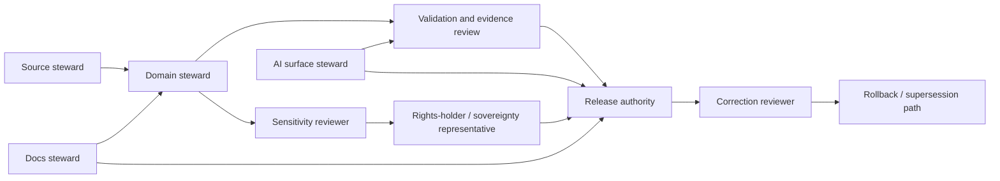

<!-- [KFM_META_BLOCK_V2]
doc_id: kfm://doc/governance/readme
title: KFM Governance — Roles, Review Burden, and Separation of Duties
type: readme
version: v2-draft
status: draft
owners:
  - "@bartytime4life"
owner_status: "Verified CODEOWNERS review route only; no independent StewardshipAssignment, release authority, reviewer quorum, or approval is implied."
created: 2026-05-06
updated: 2026-08-14
policy_label: public
owning_root: docs/
responsibility: "Provide the repository-grounded human landing page for governance roles, review burden, separation of duties, escalation, contradiction handling, deprecation, and their boundaries with contracts, schemas, policy, validation, release, correction, and rollback."
truth_posture: "CONFIRMED repository evidence / PROPOSED governance decisions and role model / UNKNOWN operational enforcement; cite-or-abstain"
evidence_snapshot:
  repository: bartytime4life/Kansas-Frontier-Matrix
  base_ref: main
  base_commit: dc30e1d38f9a4ecf45fd589d388886fc872dd189
  target_prior_blob: 862f85c39f439ae1a8dba18e2700d806d945daf9
  directory_rules_blob: fd49a0b83e55cef52c1124281f093e263526898d
  adr_0029_blob: a4de0d7a96b78da59cfc499d1025e1508afd8dd9
  adr_0024_blob: 57d46867c97a1c8d76ccdfbc12fc012bee3bd2ea
  codeowners_blob: dd2a84aa514d8ecd9208bc347f90f9a2ed37dd61
  root_registry_blob: 024f668b5f0a9239bafa4f8b09e2afd86300ff8c
  active_ruleset_id: 15484585
  active_ruleset_name: Protect
  contracts_governance_readme_blob: 0447534a4478c2887f16f690ae67220a628de05a
  review_authority_binding_contract_blob: f156e100660e9fd97ca95e90092143a3cd6d62ee
  sensitive_release_review_contract_blob: 235ca86dd807c6842ca8c861f995371fe7758f64
  review_authority_binding_workflow_blob: d0dd3ea0900bf5a664bbf3e092735f8889ed6e41
  sensitive_release_review_workflow_blob: cc47e292f20a3a27c97430800f1a0a1c5a8c6a95
related:
  - docs/doctrine/directory-rules.md
  - docs/adr/ADR-0029-adopt-directory-governance-standard-v2.md
  - docs/adr/ADR-0024-steward-separation-of-duties-for-release.md
  - docs/governance/STEWARD_CHARTERS.md
  - docs/governance/REVIEW_DUTIES.md
  - docs/governance/SEPARATION_OF_DUTIES.md
  - docs/governance/ESCALATION.md
  - docs/governance/CONTRADICTION_HANDLING.md
  - docs/governance/DEPRECATION_PROCESS.md
  - docs/governance/DECISION_LOG.md
  - contracts/governance/README.md
  - contracts/governance/ReviewRecord.md
  - contracts/governance/steward_assignment.md
  - contracts/governance/review_authority_binding.md
  - contracts/governance/sensitive_release_review_closure.md
  - schemas/contracts/v1/governance/README.md
  - policy/release/README.md
  - release/README.md
  - .github/CODEOWNERS
  - .github/workflows/review-authority-binding.yml
  - .github/workflows/sensitive-release-review-closure.yml
tags: [kfm, governance, roles, stewardship, review, separation-of-duties, escalation, contradiction, deprecation, release, correction, rollback]
notes:
  - "v2-draft is a same-path, documentation-only reconciliation against current repository evidence."
  - "ADR-0029 is accepted and controls responsibility-root placement. This update does not create, move, rename, or canonize another path."
  - "ADR-0024 is the current numbered decision record for steward separation of duties and remains proposed."
  - "The repository contains substantive deterministic fixture-only governance profiles, but they grant no authority and do not establish operational release separation."
  - "CODEOWNERS routing and pull-request mediation are repository controls, not independent approval or publication authority."
[/KFM_META_BLOCK_V2] -->

<a id="top"></a>

# 🧭 KFM Governance — Roles, Review Burden, and Separation of Duties

> **Repository-grounded governance landing page.** This folder explains the human responsibilities around stewardship, review, escalation, contradiction handling, deprecation, release-significant decisions, correction, and rollback. It does not create evidence, policy, approval, release authority, or publication state.

[](#2-authority-level-and-status)
[](../adr/ADR-0029-adopt-directory-governance-standard-v2.md)
[](../adr/ADR-0024-steward-separation-of-duties-for-release.md)
[](#10-maturity-progression)
[](#3-scope-and-repo-fit)

> [!IMPORTANT]
> **Current evidence is bounded.** At `main@dc30e1d38f9a4ecf45fd589d388886fc872dd189`, the repository contains this eight-file governance-document lane, semantic and machine governance object families, two focused deterministic no-network review profiles, CODEOWNERS routing, and an active default-branch ruleset. It does **not** establish authenticated actor identity, accepted stewardship assignments, independent reviewer capacity, executable release-policy authority, governed release records, or operational separation of duties.

> [!WARNING]
> **A document, schema-valid fixture, workflow pass, pull request, merge, CODEOWNERS match, or GitHub ruleset is not release approval.** KFM publication remains a separate governed transition requiring evidence, policy, review, release, correction, and rollback support appropriate to consequence.

| Field | Current bounded value |
|---|---|
| **Document status** | `draft` landing page |
| **Tracked path** | `docs/governance/README.md` — repository-present, same-path update |
| **Placement authority** | Accepted [`ADR-0029`](../adr/ADR-0029-adopt-directory-governance-standard-v2.md) and adopted [`directory-rules.md`](../doctrine/directory-rules.md) place human explanation under `docs/` |
| **Release SoD decision** | [`ADR-0024`](../adr/ADR-0024-steward-separation-of-duties-for-release.md) is `draft` / effectively `proposed` |
| **Repository review route** | `@bartytime4life` through [CODEOWNERS](../../.github/CODEOWNERS); routing is not independent approval |
| **Current executable support** | Fixture-only `ReviewAuthorityBinding` and `SensitiveReleaseReviewClosure` contracts, schemas, fixtures, validators, tests, and workflows |
| **Platform control** | Active `Protect` ruleset requires pull-request mediation and resolved review threads; it requires zero approving reviews and no code-owner review |
| **Operational release SoD** | `HOLD` — not established |
| **Release / deployment / publication effect** | None |

---

## Contents

- [1. Purpose](#1-purpose)
- [2. Authority level and status](#2-authority-level-and-status)
- [3. Scope and repo fit](#3-scope-and-repo-fit)
- [4. Role topology](#4-role-topology-diagram)
- [5. What belongs here](#5-what-belongs-here)
- [6. What does not belong here](#6-what-does-not-belong-here)
- [7. Current directory layout](#7-directory-layout-proposed)
- [8. The eight roles](#8-the-eight-roles)
- [9. Separation-of-duties matrix](#9-separation-of-duties-matrix)
- [10. Maturity progression](#10-maturity-progression--when-separation-tightens)
- [11. Validation](#11-validation)
- [12. Review burden and CODEOWNERS](#12-review-burden-and-codeowners)
- [13. Anti-patterns](#13-anti-patterns)
- [14. Related folders and docs](#14-related-folders-and-docs)
- [15. Governing ADRs and open decision work](#15-open-adrs-that-affect-this-folder)
- [16. FAQ](#16-faq)
- [17. Last reviewed and rollback](#17-last-reviewed)
- [Appendix A. No-loss modernization ledger](#appendix-a--no-loss-modernization-ledger)
- [Appendix B. Open verification backlog](#appendix-b--open-verification-backlog)

---

## 1. Purpose

This README is the entry point for the repository's human-facing governance lane. It helps maintainers answer four questions without turning prose into enforcement:

1. **Which governance responsibility is involved?**
2. **Which human-facing document carries the detailed guidance?**
3. **Which contract, schema, policy, validator, release, or platform surface owns the executable or state-bearing part?**
4. **What evidence is still missing before a stronger claim can be made?**

The lane exists to keep the human side of the KFM trust membrane inspectable:

```text
source or change candidate
  -> evidence and scope resolution
  -> accountable role and review routing
  -> policy / sensitivity / rights checks
  -> validation and finite outcome
  -> separate promotion / release decision
  -> correction, withdrawal, or rollback when required
```

### What this README can establish

- the repository-present documents and their declared purpose;
- the current authority and status of the relevant ADRs;
- the responsibility split between documentation, contracts, schemas, policy, tests, workflows, and release records;
- the bounded repository controls and fixture profiles verified at the evidence snapshot;
- the open work required before operational governance can be claimed.

### What this README cannot establish

- that a person or team has an accepted stewardship assignment;
- that a reviewer is independent, authenticated, authorized, or conflict-free;
- that policy evaluated a real release;
- that a release record exists or a published artifact is admissible;
- that a workflow result authorizes mutation, promotion, release, deployment, or publication;
- that current public behavior matches a proposed role or matrix.

[Back to top](#top)

---

## 2. Authority level and status

Authority depends on the question. One document does not control every layer.

| Question | Controlling evidence | Current status |
|---|---|---|
| Where may this human document live? | Accepted [`ADR-0029`](../adr/ADR-0029-adopt-directory-governance-standard-v2.md), adopted [`directory-rules.md`](../doctrine/directory-rules.md), and the repository-present path | **CONFIRMED** `docs/` responsibility; same-path update |
| Is the release SoD model accepted? | [`ADR-0024`](../adr/ADR-0024-steward-separation-of-duties-for-release.md) and the canonical ADR index | **PROPOSED**, not accepted |
| What exists now? | Pinned repository files, configuration, ruleset, tests, workflows, and emitted artifacts | **CONFIRMED only where inspected** |
| What do governance objects mean? | [`contracts/governance/`](../../contracts/governance/) | Mixed repository-present semantic contracts; most remain proposed |
| What machine shape is valid? | [`schemas/contracts/v1/governance/`](../../schemas/contracts/v1/governance/) | Mixed maturity; path presence is not adoption |
| What is allowed, denied, held, restricted, or abstained? | Accepted policy source and a digest-bound evaluator | Current release-policy lane is scaffolded; operational authority is not established |
| Who may release? | Accepted assignments, actor identity, applicable policy, review records, and release authority | **UNKNOWN / HOLD** |
| Is something released or published? | State-bearing records under [`release/`](../../release/) plus released carrier state | Not established by this folder or this update |

### Truth labels used here

| Label | Meaning |
|---|---|
| **CONFIRMED** | Verified at the pinned evidence snapshot from repository bytes, configuration, tests, workflows, or accepted decisions. |
| **PROPOSED** | A role model, decision, matrix, contract, or future state not accepted or operationally proven. |
| **UNKNOWN** | Evidence is insufficient to state the current condition. |
| **NEEDS VERIFICATION** | A specific check can resolve the claim but has not been completed strongly enough. |
| **HOLD** | A stronger transition must not proceed because a required decision or control is unresolved. |

> [!NOTE]
> Accepted placement authority does not accept a sibling governance standard. A repository-present draft does not become normative merely because this README links to it.

[Back to top](#top)

---

## 3. Scope and repo fit

`docs/governance/` is a repository-present human-document lane beneath the canonical `docs/` responsibility root. This same-path update does not create a new root, move a file, decide a future documentation taxonomy, or treat the lane as a second doctrine, contract, schema, policy, register, or release authority.

### Responsibility split

| Responsibility | Owning surface | Relationship to this folder |
|---|---|---|
| Human roles, review burden, escalation, contradiction, deprecation | `docs/governance/` | Primary explanatory lane |
| Stable operating and trust law | [`docs/doctrine/`](../doctrine/) | Outranks draft governance guidance |
| Decisions of record | [`docs/adr/`](../adr/) | Accepts, rejects, or supersedes material decisions |
| Human drift and verification tracking | [`docs/registers/`](../registers/) | Tracks unresolved current-state work |
| Semantic object meaning | [`contracts/governance/`](../../contracts/governance/) | Defines what governance objects mean |
| Machine-checkable object shape | [`schemas/contracts/v1/governance/`](../../schemas/contracts/v1/governance/) | Defines fields and constraints |
| Admissibility and release-policy source | [`policy/`](../../policy/) and [`policy/release/`](../../policy/release/) | Decides bounded policy outcomes when accepted and invoked |
| Reusable validators | [`tools/validators/governance/`](../../tools/validators/governance/) | Executes deterministic checks |
| Synthetic and negative evidence | [`fixtures/`](../../fixtures/) and [`tests/`](../../tests/) | Proves bounded behavior |
| Repository review routing and hosted checks | [`.github/`](../../.github/) | Routes and runs checks; does not create KFM authority |
| Release, correction, withdrawal, rollback | [`release/`](../../release/) | Owns state-bearing decisions |
| Receipts and proofs | [`data/receipts/`](../../data/receipts/) and [`data/proofs/`](../../data/proofs/) | Stores accountability and proof instances; neither substitutes for release |

### Lifecycle boundary

Governance review participates in the lifecycle but does not replace it:

```text
RAW -> WORK / QUARANTINE -> PROCESSED -> CATALOG / TRIPLET -> PUBLISHED
```

A review may support a promotion decision. It cannot turn a file move, commit, workflow, badge, or merge into promotion.

[Back to top](#top)

---

## 4. Role topology (diagram)

The role vocabulary below is the repository's current proposed design language. It is not a verified staffing roster.


```mermaid
flowchart LR
    S["Source steward"] --> D["Domain steward"]
    D --> V["Validation and evidence review"]
    D --> SR["Sensitivity reviewer"]
    SR --> RH["Rights-holder / sovereignty representative"]
    V --> RA["Release authority"]
    RH --> RA
    RA --> CR["Correction reviewer"]
    CR --> RB["Rollback / supersession path"]

    AI["AI surface steward"] --> V
    AI --> RA
    DOC["Docs steward"] --> D
    DOC --> RA
```

### Reading the diagram

- Arrows show common handoffs, not automatic approvals.
- A person may be associated with more than one role in a bootstrap repository, but role labels do not prove independence.
- Release-significant independence must be demonstrated through resolved actor identity, current scoped authority, exact subject binding, and state-bearing review evidence.
- `ReviewAuthorityBinding` checks declared structural agreement only.
- `SensitiveReleaseReviewClosure` checks a synthetic T3/T4 closure profile only.
- Neither profile authenticates a human or grants release authority.

The detailed charter and matrix are maintained in [`STEWARD_CHARTERS.md`](./STEWARD_CHARTERS.md), [`REVIEW_DUTIES.md`](./REVIEW_DUTIES.md), and [`SEPARATION_OF_DUTIES.md`](./SEPARATION_OF_DUTIES.md). Their current source status remains draft/proposed.

[Back to top](#top)

---

## 5. What belongs here

This folder may contain human-facing guidance whose primary responsibility is governance participation:

- role and steward charters;
- review-duty and review-burden guidance;
- separation-of-duties explanations;
- escalation triggers and routing;
- contradiction classification and disposition guidance;
- deprecation and planned-retirement process;
- a landing page that routes readers to the correct authority surface;
- migration, supersession, and rollback notes for these documents;
- explicit evidence boundaries and open verification work.

Every document should state:

- its source status and effective authority;
- who owns review routing, without inventing people or teams;
- what it explains and what it cannot enforce;
- which contracts, schemas, policy, fixtures, tests, workflows, release objects, and registers carry adjacent responsibility;
- what evidence is required before implementation or operational claims advance.

[Back to top](#top)

---

## 6. What does NOT belong here

| Content | Owning surface | Why |
|---|---|---|
| Accepted operating law | [`docs/doctrine/`](../doctrine/) | Stable doctrine has a separate authority lane |
| ADR source and canonical status | [`docs/adr/`](../adr/) | Decisions require decision records and an index |
| Live drift and verification registers | [`docs/registers/`](../registers/) | Registers are append-only current-state views |
| Governance object semantics | [`contracts/governance/`](../../contracts/governance/) | Contracts define meaning |
| JSON Schema | [`schemas/contracts/v1/governance/`](../../schemas/contracts/v1/governance/) | Schemas define machine shape |
| Rego or other policy source | [`policy/`](../../policy/) | Policy decides admissibility |
| Review, policy, or release instances | Governed data and [`release/`](../../release/) | State-bearing records are not documentation |
| Validators and workflow implementation | [`tools/`](../../tools/), [`tests/`](../../tests/), [`.github/`](../../.github/) | Executable proof and orchestration live outside docs |
| Real sensitive payloads, private identities, credentials, or restricted reasons | Denied or governed private systems | Public documentation must not expose them |
| Publication claims based only on prose, tests, badges, or merges | Nowhere | Publication requires governed release state |

> [!CAUTION]
> Do not duplicate a contract, schema, policy rule, reviewer registry, release manifest, receipt, proof, or decision record in this folder to make documentation appear complete.

[Back to top](#top)

---

<a id="7-directory-layout-proposed"></a>

## 7. Current directory layout

The direct-child inventory at the evidence snapshot is:

```text
docs/governance/
├── README.md
├── CONTRADICTION_HANDLING.md
├── DECISION_LOG.md
├── DEPRECATION_PROCESS.md
├── ESCALATION.md
├── REVIEW_DUTIES.md
├── SEPARATION_OF_DUTIES.md
└── STEWARD_CHARTERS.md
```

| Document | Repository-present purpose | Safe reading posture |
|---|---|---|
| [`README.md`](./README.md) | Landing page and responsibility map | This file; draft |
| [`STEWARD_CHARTERS.md`](./STEWARD_CHARTERS.md) | Proposed steward roster, charters, owned artifacts, and co-signers | Draft/proposed; no staffing proof |
| [`REVIEW_DUTIES.md`](./REVIEW_DUTIES.md) | Reviewer roles, review flow, `ReviewRecord` guidance, and proposed SoD matrix | Draft/proposed; not access control |
| [`SEPARATION_OF_DUTIES.md`](./SEPARATION_OF_DUTIES.md) | Detailed authorship/approval separation standard and maturity posture | Draft/proposed; operational enforcement unverified |
| [`ESCALATION.md`](./ESCALATION.md) | Escalation triggers, routing, receipts, and closure expectations | Draft guidance; enforcement outside docs |
| [`CONTRADICTION_HANDLING.md`](./CONTRADICTION_HANDLING.md) | Contradiction classification, severity, routing, and anti-smoothing rules | Draft; its own placement/authority claims need reconciliation |
| [`DEPRECATION_PROCESS.md`](./DEPRECATION_PROCESS.md) | Planned retirement, sunset, successor, and audit guidance | Draft; operational wiring needs verification |
| [`DECISION_LOG.md`](./DECISION_LOG.md) | Decision-log design and historical path | Draft/lineage; its own text identifies `docs/registers/DECISION_LOG.md` as a proposed best-fit, so placement remains open |

> [!IMPORTANT]
> Presence is confirmed. Freshness, acceptance, staffing, executable enforcement, and operational use must be evaluated per document. This README does not silently promote a sibling or resolve its path drift.

[Back to top](#top)

---

## 8. The eight roles

The following role vocabulary is carried by the current governance documents and ADR-0024. The role scopes remain **proposed** until accepted and bound to verified assignments.

| Role | Proposed responsibility | Primary detailed document |
|---|---|---|
| **Source steward** | Source identity, role, terms, admission, freshness, and source-specific escalation | [`STEWARD_CHARTERS.md`](./STEWARD_CHARTERS.md) |
| **Domain steward** | Domain meaning, object use, domain evidence, and domain review | [`STEWARD_CHARTERS.md`](./STEWARD_CHARTERS.md) |
| **Sensitivity reviewer** | Sensitivity tier, precision, redaction, generalization, withholding, and escalation | [`REVIEW_DUTIES.md`](./REVIEW_DUTIES.md) |
| **Rights-holder / sovereignty representative** | Rights, consent, sovereignty, cultural authority, and controlled release concerns | [`ESCALATION.md`](./ESCALATION.md) |
| **Release authority** | Accountable release decision, subject scope, obligations, and release-state transition | [`SEPARATION_OF_DUTIES.md`](./SEPARATION_OF_DUTIES.md) |
| **Correction reviewer** | Correction, withdrawal, supersession, and rollback review | [`DEPRECATION_PROCESS.md`](./DEPRECATION_PROCESS.md) and release guidance |
| **AI surface steward** | Evidence-bounded AI behavior, citation posture, finite outcomes, and safe map-action proposals | [`STEWARD_CHARTERS.md`](./STEWARD_CHARTERS.md) |
| **Docs steward** | Doctrine/navigation integrity, decision and drift visibility, metadata, links, and documentation review | [`STEWARD_CHARTERS.md`](./STEWARD_CHARTERS.md) |

### Staffing boundary

- CODEOWNERS identifies one GitHub review route, not eight accepted assignments.
- No private roster is asserted by this public README.
- No role name may be converted into a GitHub team or account without verifying identity, access, assignment, and scope.
- A single account holding every repository route is transparent bootstrap evidence, not independent release review.

[Back to top](#top)

---

## 9. Separation-of-duties matrix

The matrix below distinguishes the proposed governance posture from current proof.

| Action | Proposed separation posture | Current verified evidence | Safe conclusion |
|---|---|---|---|
| Editorial update to one draft governance doc | Risk-scaled review; no release authority implied | CODEOWNERS routes to one account; PR mediation required | Reviewable repository change only |
| Contract or schema change affecting review identity or authority | Author and accountable reviewer should be distinguishable when material | Semantic/schema surfaces exist; accepted assignments are absent | `HOLD` for authority claim |
| Policy change affecting release, rights, sensitivity, or public scope | Policy reviewer must not be inferred from author or workflow | Release-policy lane is scaffolded and inactive | No operational policy approval |
| T3/T4 sensitive release candidate | Independent reviewer outside author role chain; separate policy/release gate | Fixture-only closure profile exercises declared structure | Structural candidate only; no release |
| Promotion or public release | Independent, subject-bound review plus policy and release records | ADR-0024 remains proposed; no operational release flow verified | `HOLD` |
| Correction, withdrawal, or rollback affecting public state | Separate accountable review and explicit target/lineage | Human guidance exists; no executed drill verified here | `NEEDS VERIFICATION` |
| AI-surface change affecting evidence or policy projection | Domain/evidence/policy review separate from generated language | No direct public model authority is established by this folder | Cite-or-abstain; no AI self-approval |
| Emergency containment | Immediate containment may precede full review, but must be bounded and retrospectively recorded | No current operational emergency exception was inspected | Follow accepted incident/release procedure; otherwise `HOLD` |

> [!NOTE]
> `BOUND`, `CLOSED_FOR_SEPARATE_RELEASE_GATE`, or validator `PASS` are local profile outcomes. They are not `PromotionDecision`, `ReleaseManifest`, approval, signature, release, deployment, publication, or public-use permission.

[Back to top](#top)

---

<a id="10-maturity-progression"></a>

## 10. Maturity progression — when separation tightens

| Level | Required capability | Current evidence | Status |
|---|---|---|---|
| **L0 — Human doctrine and routing** | Role vocabulary, review guidance, escalation, contradiction, deprecation, and open decisions | Eight repository-present governance documents; ADR-0024 proposed | **PRESENT / PROPOSED** |
| **L1 — Machine shape and deterministic fixtures** | Closed schemas, synthetic valid/invalid cases, validators, stable outcomes, deterministic identity | `ReviewAuthorityBinding` and `SensitiveReleaseReviewClosure` families exist | **PARTIAL / SUBSTANTIVE** |
| **L2 — Governed identity and authority** | Actor authentication, alias resolution, scoped current assignments, recusal/conflict handling, accepted policy | Not established by inspected evidence | **HOLD** |
| **L3 — Repository/platform enforcement** | Required independent approvals, code-owner or named reviewer rules, protected review evidence, exact-subject binding | PR mediation and thread resolution exist; zero approvals and no code-owner review required | **PARTIAL / INSUFFICIENT FOR SoD** |
| **L4 — Release integration** | Policy evaluation, governed review record, promotion/release decision, correction/rollback drill, observed fail-closed behavior | Not verified | **UNKNOWN / HOLD** |
| **L5 — Operational and public assurance** | Repeated production evidence, independent capacity, audit, incident response, correction propagation | Not inspected | **UNKNOWN** |

### Bounded executable profiles

#### `ReviewAuthorityBinding`

The current semantic contract, schema, fixtures, validator, tests, and workflow check declared agreement among a `ReviewRecord`, a `StewardshipAssignment`, and a reviewed subject. Outcomes are `BOUND`, `HOLD`, or `DENY`.

It explicitly does **not** authenticate actors, resolve policy, emit or execute writes, mutate lifecycle state, promote, release, deploy, publish, or authorize public use.

#### `SensitiveReleaseReviewClosure`

The current T3/T4 fixture profile consumes a review-authority binding and requires declared evidence, policy, correction, rollback, promotion-candidate, and release-manifest-candidate references. Outcomes are `CLOSED_FOR_SEPARATE_RELEASE_GATE`, `HOLD`, or `DENY`.

It explicitly fixes repository, lifecycle, policy, promotion, release, deployment, publication, and public-use permissions to `false`.

### Hosted-check boundary

The dedicated workflows are narrow and path-filtered. They do not run merely because this README changes. Their latest inspected historical runs recorded focused test completion followed by generated-authoring-receipt integrity failure. Current receipt repair and exact-main profile health therefore remain **NEEDS VERIFICATION**; this documentation update does not repair or weaken those checks.

[Back to top](#top)

---

## 11. Validation

### Documentation validation for this README

A valid update should demonstrate:

- one H1 and one closed `KFM_META_BLOCK_V2`;
- repository-history-backed creation and update dates;
- preserved legacy section anchors;
- links only to verified repository targets;
- accurate ADR status and Directory Rules authority;
- an exact direct-child inventory for `docs/governance/`;
- explicit separation of documentation, contract, schema, policy, test, workflow, and release responsibility;
- no invented owner, team, approval, policy pass, release, deployment, or publication claim;
- no raw sensitive payload, private roster, credential, restricted coordinate, or protected reason text;
- a final newline, balanced fences, and no trailing whitespace.

### Governance-profile validation

The repository contains focused commands for the two bounded profiles:

```bash
python -m unittest discover \
  --start-directory tests/validators/governance \
  --pattern 'test_review_authority_binding.py' \
  --verbose
python tools/validators/governance/validate_review_authority_binding.py --fixtures

python -m pytest -q \
  tests/validators/governance/test_sensitive_release_review_closure.py
python tools/validators/governance/validate_sensitive_release_review_closure.py \
  --fixtures
```

Those commands are reference points for their own families. This README-only change does not modify those contracts, schemas, fixtures, validators, tests, workflows, or receipts and does not claim their current execution result.

### Hosted checks

Repository-hosted documentation checks may run on a pull request. A green result is evidence about the bounded check only. A failing inherited check must be classified rather than hidden. No check result changes this document's draft status or creates release authority.

[Back to top](#top)

---

## 12. Review burden and CODEOWNERS

### Current repository controls

| Control | Verified state | What it proves | What it does not prove |
|---|---|---|---|
| [CODEOWNERS](../../.github/CODEOWNERS) | `docs/governance/` and all relevant trust roots route to `@bartytime4life` | One current GitHub review route | StewardshipAssignment, independent review, release approval, or review occurrence |
| Active `Protect` ruleset | Applies to the default branch; deletion and non-fast-forward denied | Main is mediated and history rewrites are constrained | KFM review sufficiency |
| Pull-request rule | Pull request and resolved review threads required | Direct default-branch change path is constrained | Any approving review |
| Approving review count | `0` | Exact platform configuration | Independent human approval |
| Code-owner review | Not required | Exact platform configuration | Governance acceptance |
| Named required reviewers | None | Exact platform configuration | Role coverage |
| Last-push approval | Not required | Exact platform configuration | Post-change independent review |
| Bypass actors | None | Current ruleset has no configured bypass actor | Operational SoD or release authority |

### Review burden for this README

This update is a one-file draft documentation reconciliation. Its repository review route is `@bartytime4life`. The pull request should disclose:

- the exact base commit and prior blob;
- the one-file scope;
- current Directory Rules and ADR status;
- material current-state corrections;
- source-level validation;
- rollback to the prior blob;
- the fact that no independent governance approval, release, deployment, or publication is created.

A later change that accepts ADR-0024, changes role authority, weakens a fail-closed rule, changes release-policy meaning, or modifies platform enforcement is a separate governance or implementation transition with a larger review burden.

[Back to top](#top)

---

## 13. Anti-patterns

- **Treating documentation as enforcement.** Human guidance does not authenticate actors, evaluate policy, or block a release.
- **Treating CODEOWNERS as stewardship.** A review route is not an accepted role assignment or proof of independence.
- **Treating a workflow as approval.** CI evidence is bounded to the checks it performs.
- **Treating a schema-valid record as a true event.** Shape validity does not prove the actor, authority, evidence, or decision.
- **Treating `BOUND` as release permission.** Structural agreement is only an input to later governed decisions.
- **Treating the author as the release authority by default.** Bootstrap capacity must not be disguised as independent review.
- **Inventing teams, queues, owners, or private rosters.** Unverified identities remain `UNKNOWN`.
- **Duplicating contracts, schemas, policy, or release objects in docs.** Parallel authority makes audit and rollback ambiguous.
- **Smoothing contradictions.** Preserve each side, evidence, severity, and disposition; do not silently pick a winner.
- **Publishing because a pull request merged.** Merge is repository history, not KFM promotion or publication.
- **Exposing protected reasons or precise sensitive data in review prose.** Use public-safe codes and governed references.
- **Letting draft sibling docs accept one another.** A draft cannot self-promote or promote another draft.

[Back to top](#top)

---

## 14. Related folders and docs

| Surface | Relationship | Current bounded posture |
|---|---|---|
| [`docs/doctrine/directory-rules.md`](../doctrine/directory-rules.md) | Accepted placement law through ADR-0029 | **ACCEPTED authority** |
| [`docs/adr/ADR-0029-adopt-directory-governance-standard-v2.md`](../adr/ADR-0029-adopt-directory-governance-standard-v2.md) | Adopts exact Directory Rules v2 bytes | **ACCEPTED** |
| [`docs/adr/ADR-0024-steward-separation-of-duties-for-release.md`](../adr/ADR-0024-steward-separation-of-duties-for-release.md) | Current numbered release-SoD decision record | **PROPOSED** |
| [`contracts/governance/`](../../contracts/governance/) | Governance semantic object family | Repository-present; mixed proposed maturity |
| [`schemas/contracts/v1/governance/`](../../schemas/contracts/v1/governance/) | Governance machine-shape family | Repository-present; mixed maturity |
| [`policy/release/`](../../policy/release/) | Release-admissibility policy source | Scaffolds; inactive / no accepted evaluator |
| [`release/`](../../release/) | Promotion, release, correction, withdrawal, rollback, signature decisions | Separate state-bearing authority |
| [`tools/validators/governance/`](../../tools/validators/governance/) | Deterministic governance validators | Repository-present implementation surface |
| [`tests/validators/governance/`](../../tests/validators/governance/) | Focused executable tests | Repository-present bounded evidence |
| [`fixtures/contracts/v1/governance/`](../../fixtures/contracts/v1/governance/) | Synthetic governance fixtures | Repository-present bounded evidence |
| [`.github/workflows/review-authority-binding.yml`](../../.github/workflows/review-authority-binding.yml) | Hosted fixture-profile orchestration | No actor or release authority |
| [`.github/workflows/sensitive-release-review-closure.yml`](../../.github/workflows/sensitive-release-review-closure.yml) | Hosted T3/T4 closure-profile orchestration | No sensitive release authority |
| [`docs/registers/DRIFT_REGISTER.md`](../registers/DRIFT_REGISTER.md) | Current human drift record | Existing register; quality/freshness evaluated separately |
| [`docs/registers/VERIFICATION_BACKLOG.md`](../registers/VERIFICATION_BACKLOG.md) | Checkable unresolved work | Existing register; quality/freshness evaluated separately |

[Back to top](#top)

---

<a id="15-open-adrs-that-affect-this-folder"></a>

## 15. Governing ADRs and open decision work

| Decision | Effective status | Relevance |
|---|---|---|
| [`ADR-0029`](../adr/ADR-0029-adopt-directory-governance-standard-v2.md) | **accepted** | Placement and responsibility-root authority |
| [`ADR-0024`](../adr/ADR-0024-steward-separation-of-duties-for-release.md) | proposed | Actor/authority/subject binding, independent review, T3/T4 closure, release SoD maturity |
| [`ADR-0010`](../adr/ADR-0010-deny-by-default-for-dna-rare-species-archaeology-infrastructure.md) | proposed | Sensitive-lane default-deny posture |
| [`ADR-0011`](../adr/ADR-0011-receipts-vs-proofs-vs-manifests-vs-catalog-separation.md) | proposed | Keeps accountability object families distinct |
| [`ADR-0018`](../adr/ADR-0018-promotion-gate-sequence.md) | proposed | Promotion-gate order and semantics |
| [`ADR-0020`](../adr/ADR-0020-abstain-is-a-first-class-decision.md) | proposed | First-class abstention |
| [`ADR-0025`](../adr/ADR-0025-public-client-never-reads-canonical-internal-stores.md) | proposed | Public-client trust membrane |

### Symbolic backlog correction

Older governance documents refer to **ADR-S-09** as the review-separation threshold question. The current numbered repository record is ADR-0024, whose metadata explicitly says it addresses that atlas backlog relationship. The symbolic label remains lineage; it is not a separate accepted decision or verified current file.

Only ADR-0029 is accepted in the inspected numbered ADR corpus. This README cannot promote any other decision.

[Back to top](#top)

---

## 16. FAQ

<details>
<summary><strong>Does this README enforce governance?</strong></summary>

No. It routes readers and states boundaries. Contracts define meaning, schemas define shape, policy decides admissibility, validators test bounded behavior, and release records carry state.

</details>

<details>
<summary><strong>Are the eight roles staffed?</strong></summary>

Not by evidence inspected for this update. CODEOWNERS identifies one verified GitHub account. Accepted role assignments, independent capacity, private roster governance, and operational availability remain unknown.

</details>

<details>
<summary><strong>Does a green review-binding test mean a release is approved?</strong></summary>

No. A green test can show that synthetic data matches a bounded contract and validator. It cannot authenticate a human, evaluate a live policy, issue a release decision, or publish.

</details>

<details>
<summary><strong>Can one person hold more than one role?</strong></summary>

The draft model permits bootstrap overlap, but material independence is an evidence question, not a label question. Release-significant separation requires resolved identity, assignment, subject binding, and applicable policy/review records. Current operational closure is held.

</details>

<details>
<summary><strong>Does CODEOWNERS satisfy separation of duties?</strong></summary>

No. It routes review requests. The current file itself states that it is not a StewardshipAssignment, ReviewRecord, PolicyDecision, release approval, or proof that review occurred.

</details>

<details>
<summary><strong>Does a pull request or merge publish KFM?</strong></summary>

No. A pull request and merge change repository history. Promotion, release, deployment, and publication are separate governed transitions.

</details>

<details>
<summary><strong>What happens when governance docs conflict?</strong></summary>

Do not silently reconcile them. Apply accepted decisions and current repository evidence to the relevant question, record the contradiction and source statuses, and route material authority changes through an ADR or correction.

</details>

<details>
<summary><strong>Why are detailed role and matrix sections still present if sibling docs exist?</strong></summary>

This landing page retains a compact routing summary and the legacy anchors. Detailed role charters, matrices, escalation tables, and deprecation procedure remain in their focused sibling documents to avoid parallel authority.

</details>

[Back to top](#top)

---

<a id="17-last-reviewed"></a>

## 17. Last reviewed and rollback

| Field | Value |
|---|---|
| **Reviewed** | `2026-08-14` |
| **Evidence base** | `main@dc30e1d38f9a4ecf45fd589d388886fc872dd189` |
| **Prior target blob** | `862f85c39f439ae1a8dba18e2700d806d945daf9` |
| **Directory Rules blob** | `fd49a0b83e55cef52c1124281f093e263526898d` |
| **ADR-0024 blob** | `57d46867c97a1c8d76ccdfbc12fc012bee3bd2ea` |
| **CODEOWNERS blob** | `dd2a84aa514d8ecd9208bc347f90f9a2ed37dd61` |
| **Scope** | One Markdown file; documentation-only |
| **Operational evidence not established** | Authenticated actors, accepted assignments, live policy evaluation, independent reviewer capacity, release integration, published state, production audit |

### Rollback

Restore prior blob `862f85c39f439ae1a8dba18e2700d806d945daf9` or revert the documentation commit. No contract, schema, policy, fixture, validator, workflow, rule, receipt, proof, release, deployment, or published artifact requires restoration.

[Back to top](#top)

---

## Appendix A — No-loss modernization ledger

| Prior README material | Current disposition |
|---|---|
| Purpose and human-governance framing | Retained and grounded in current repository evidence |
| Authority and truth labels | Corrected to accepted ADR-0029, proposed ADR-0024, and current implementation evidence |
| Repo fit | Replaced speculative presence claims with verified responsibility boundaries |
| Eight-role diagram | Retained as a proposed routing map with staffing and authority limits |
| What belongs / does not belong | Retained and aligned to current responsibility roots |
| Proposed lowercase directory tree | Replaced with the exact eight-file current directory inventory |
| Detailed role catalog | Retained compactly; detailed scope routed to steward/review sibling docs |
| Separation matrix | Retained compactly and split into proposed posture, current evidence, and safe conclusion |
| Maturity progression | Reframed as L0–L5 with current evidence and holds |
| Validation | Replaced speculative validator names with the two repository-present focused profiles and docs checks |
| Review burden and CODEOWNERS | Corrected from unknown to current CODEOWNERS and active-ruleset evidence |
| Anti-patterns | Retained and strengthened around authority, workflow, and publication boundaries |
| Related docs | Replaced `NEEDS VERIFICATION` placeholders with verified local targets |
| Symbolic ADR-S-09 | Mapped to current numbered ADR-0024 as lineage/backlog relationship |
| FAQ | Retained and updated for current repository evidence |
| Dates and ownership | Creation recovered from repository history; owner limited to verified review route |
| Stable navigation | Original H1 and numbered section anchors preserved through headings or explicit aliases |

---

## Appendix B — Open verification backlog

| Priority | Verification item | Closure evidence |
|---|---|---|
| P0 | Accept, revise, reject, or supersede ADR-0024 | Canonical ADR/index transition with review evidence |
| P0 | Establish actor identity and alias/conflict resolution | Accepted identity authority, fixtures, negative tests, and audit records |
| P0 | Establish scoped StewardshipAssignment authority | Accepted contract/schema/policy and accountable assignments |
| P0 | Define independent reviewer capacity and recusal | Verified assignments, conflict policy, and subject-bound review records |
| P0 | Bind release policy to an accepted evaluator and bundle | Digest-bound evaluator, native tests, replay, receipts, and fail-closed integration |
| P0 | Integrate review closure with separate promotion and release records | End-to-end fixture and no-publication negative path |
| P1 | Repair or supersede stale generated authoring receipts for the two focused workflows through legitimate producers | Green receipt-integrity verification with preserved lineage |
| P1 | Decide whether platform rules should require approving or code-owner review | Reviewed repository-control decision and enforced ruleset |
| P1 | Reconcile stale placeholder owners, paths, and symbolic ADR references in sibling docs | Focused documentation PRs with link and metadata validation |
| P1 | Resolve `DECISION_LOG.md` and contradiction-handling placement questions | Directory Rules decision, migration note, or explicit retained-path rationale |
| P2 | Run correction, withdrawal, rollback, and reviewer-unavailability drills | Recorded drill artifacts, findings, and remediation |
| P2 | Define governance health indicators without turning metrics into authority | Accepted metric contracts, bounded telemetry, and review cadence |

---

**Truth posture:** CONFIRMED repository evidence / PROPOSED governance decisions and role model / UNKNOWN operational enforcement

[Back to top](#top)
