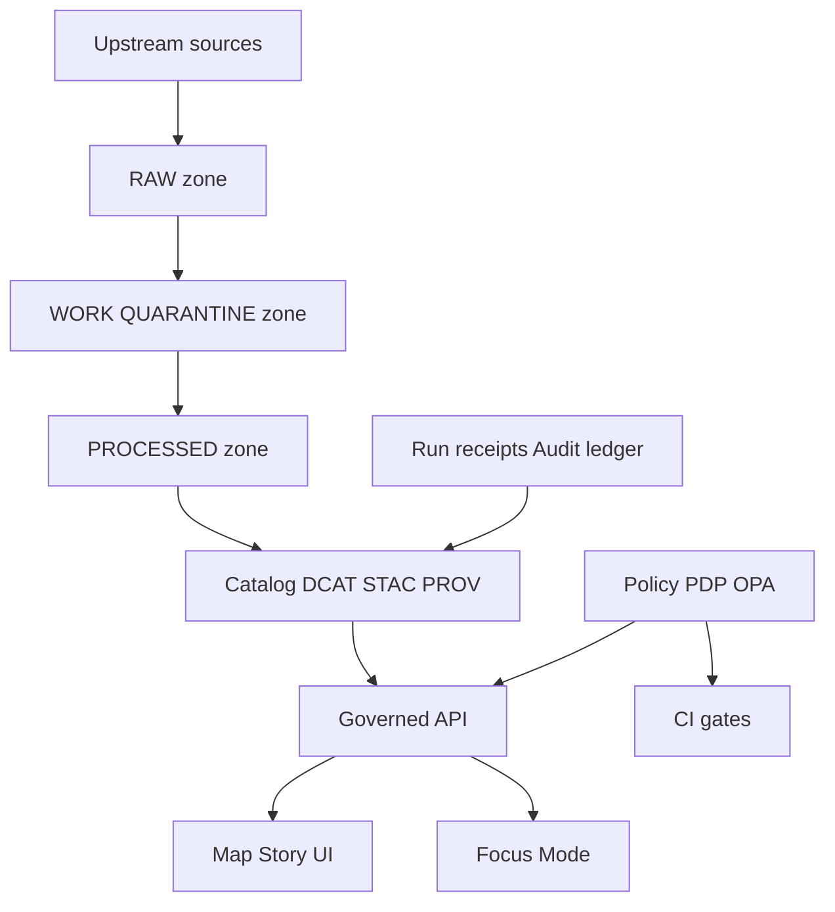

# Governance
Operational governance for Kansas Frontier Matrix (KFM): roles, policy, gates, and review workflows.  
`status:draft` `policy:fail-closed` `posture:default-deny` `focus-mode:cite-or-abstain` `scope:platform-wide`

- **Owners:** `TBD (steward + governance council)`
- **Last reviewed:** 2026-02-22
- **Next review:** 2026-05-22

Quick nav:
- [What this folder contains](#what-this-folder-contains)
- [Non-negotiable invariants](#non-negotiable-invariants)
- [Roles and responsibilities](#roles-and-responsibilities)
- [Governance artifacts](#governance-artifacts)
- [Policy-as-code](#policy-as-code)
- [Sensitivity and rights](#sensitivity-and-rights)
- [Truth path lifecycle and zones](#truth-path-lifecycle-and-zones)
- [Promotion contract](#promotion-contract)
- [Catalogs and provenance](#catalogs-and-provenance)
- [Story publishing governance](#story-publishing-governance)
- [Focus Mode governance](#focus-mode-governance)
- [Threat model checklist](#threat-model-checklist)
- [Change management workflow](#change-management-workflow)
- [Glossary](#glossary)
- [Appendix: templates](#appendix-templates)

<details>
<summary>Document metadata (KFM MetaBlock v2)</summary>

```text
[KFM_META_BLOCK_V2]
doc_kind: governance
doc_id: kfm://doc/governance/README@v1
status: draft
owners: TBD
reviewed_on: 2026-02-22
next_review_on: 2026-05-22
created_on: 2026-02-22
updated_on: 2026-02-22
applies_to:
  - policy/
  - pipelines/
  - api/
  - ui/
  - focus-mode/
sensitivity: public
[/KFM_META_BLOCK_V2]
```
</details>

---

## What this folder contains

This `docs/governance/` area is the operational entrypoint for **enforceable** governance: policy labels, review gates, and workflows that must be implemented in CI and runtime (not “guidelines”). Governance is treated as part of the system contract.

**Expected companion docs (create if missing):**

| Path | Purpose | Notes |
|---|---|---|
| `docs/governance/README.md` | Start here | Overview + pointers + checklists |
| `docs/governance/ROOT_GOVERNANCE.md` | Canonical governance policy | The “source of truth” policy narrative |
| `docs/governance/ETHICS.md` | Ethical review triggers and narrative safety | CARE-aligned constraints |
| `docs/governance/SOVEREIGNTY.md` | Authority-to-control + community stewardship workflow | For culturally sensitive materials |
| `docs/governance/REVIEW_GATES.md` | Promotion + publishing gates | CI + runtime requirements |
| `docs/governance/THREAT_MODEL.md` | Threat model checklist + mitigations | Trust membrane + policy safety |

> NOTE  
> KFM uses **status vocabulary** in design/governance docs: `CONFIRMED`, `PROPOSED`, `UNKNOWN`. Use those words explicitly when you’re unsure.

---

## Non-negotiable invariants

These invariants exist so that KFM can be trusted as a **governed, evidence-first, map-first, time-aware** system. Breaking them breaks enforceability.

### Invariant map (platform contract)

| Invariant | Meaning in practice | Why it matters |
|---|---|---|
| Truth path lifecycle | Upstream → RAW → WORK/QUARANTINE → PROCESSED → CATALOG (DCAT+STAC+PROV + run receipts) → governed API → UI | Reproducibility and auditability |
| Trust membrane | Clients never access storage/DB directly; backend logic uses repository interfaces; access goes through governed APIs applying policy/redaction/logging | Without it, policy and provenance are unenforceable |
| Evidence-first UX | Every layer/story claim opens to an evidence view: dataset version, license/rights holder, policy label + redactions, provenance chain, artifact links + checksums | Trust is a UI feature, not a footer |
| Cite-or-abstain Focus Mode | Focus Mode selects admissible evidence, constructs an evidence bundle, answers with citations or abstains, emits an audit record (run receipt) | Prevents ungrounded claims and policy leaks |
| Canonical vs rebuildable stores | Object storage + catalogs + provenance are canonical; DB/search indexes are projections | Safer ops, easier rollback, better provenance |
| Deterministic identity and hashing | Stable dataset IDs + version IDs; sha256 digests; canonical JSON hashing to avoid “hash drift” | Enables immutability, caching, signature verification |

### System boundary diagram



---

## Roles and responsibilities

### PROPOSED baseline roles (starter model)

- **Public user**: reads public layers/stories; Focus Mode limited to public evidence.
- **Contributor**: proposes datasets/stories; drafts content; cannot publish.
- **Reviewer/Steward**: approves promotions + story publishing; owns policy labels and redaction rules.
- **Operator**: runs pipelines and deployments; cannot override policy gates.
- **Governance council / community stewards**: authority to control culturally sensitive materials; sets rules for restricted collections and public representations.

### RACI (minimum)

| Work item | Responsible | Accountable | Consulted | Informed |
|---|---|---|---|---|
| Dataset onboarding | Contributor (spec + docs), Data engineer (pipeline), GIS engineer (spatial QA) | Steward | Governance council (if culturally sensitive), Legal/compliance (if rights unclear) | Operator |
| Dataset promotion | Operator (run), Data engineer (validate outputs) | Steward | Governance council (sensitive), Security (restricted infrastructure) | Contributor |
| Story publishing | Contributor (draft), Historian/editor (review) | Steward | Governance council (Indigenous/cultural), Legal (image reuse) | Public |
| Policy changes | Steward + Policy engineer | Governance council or designated owner | Operators (runtime impact), Contributors (workflow impact) | Users |

---

## Governance artifacts

To operate governance, KFM must maintain (minimum set):

- **Policy bundle repository** (OPA/Rego or equivalent)
- **Policy test fixtures** (allow/deny + obligations)
- **Licensing classification rubric**
- **Sensitivity rubric + generalization guidelines**
- **Review workflow definition** (Promotion Queue + Story Review Queue)
- **Audit ledger retention + access policy**

**Practical implication:** if any of the above is missing, KFM cannot “fail closed” reliably, and promotion/publishing must remain blocked.

---

## Policy-as-code

KFM requires the **same policy semantics in CI and runtime** (or at minimum: the same fixtures and outcomes). Otherwise CI guarantees are meaningless.

### Recommended architecture (PDP + PEP)

- **Policy Decision Point (PDP):** OPA running in-process or as a sidecar
- **Policy Enforcement Points (PEP):**
  - **CI:** schema validation + policy tests block merges
  - **Runtime API:** policy checks before serving data
  - **Evidence resolver:** policy checks before resolving evidence and rendering bundles
  - **UI:** shows policy badges + notices; **UI never makes policy decisions**

### Outputs must include obligations

Policy is not just allow/deny. Policy must also emit **obligations** (ex: “show_notice: geometry generalized”) so UI and exports can behave correctly.

---

## Sensitivity and rights

### Sensitivity defaults

- **Default deny** for sensitive-location and restricted datasets.
- If any public representation is allowed, produce a separate **public_generalized** dataset version.
- Never leak restricted metadata in 403/404 responses.
- Do not embed precise coordinates in Story Nodes or Focus Mode outputs unless policy explicitly allows.
- Treat redaction/generalization as a **first-class transform** recorded in provenance (PROV).

### Licensing and rights enforcement

Key principle: **online availability does not equal permission to reuse.**

Operational rules:

- Promotion gate requires **license + rights holder** for every distribution.
- “Metadata-only reference” is allowed: catalog an item without mirroring it if rights do not allow reuse.
- Export functions must include **attribution and license text** automatically.
- Story publishing gate blocks if rights are unclear for included media.

> WARNING  
> Licensing is not paperwork. It is a **policy input** and must be enforced in CI/runtime.

---

## Truth path lifecycle and zones

### Zones

| Zone | Purpose | Governance posture |
|---|---|---|
| **Upstream** | External sources and partners | Record source + rights; don’t assume reuse |
| **RAW** | Immutable capture of upstream materials | Keep originals; record checksums |
| **WORK/QUARANTINE** | Staging, QA, validation failures | Not served to public; used for review |
| **PROCESSED** | Derived artifacts ready for serving | Must be immutable by digest |
| **PUBLISHED** | Public-safe products and narratives | Must pass policy + rights + citation gates |

**Rule of thumb:** nothing reaches runtime surfaces until it’s in **PROCESSED + CATALOG + receipts** and has passed promotion gates.

---

## Promotion contract

Promotion moves a dataset version into runtime surfaces and **MUST fail closed** unless required artifacts exist and validate.

### Minimal gates (starter)

| Gate | Fail-closed check |
|---|---|
| Identity and versioning | DatasetVersion ID + deterministic `spec_hash`; promotion manifest exists |
| Artifacts | Processed artifacts exist; each has digest; predictable paths; media types recorded |
| Catalogs | DCAT/STAC/PROV schema-valid under profile |
| Cross-links | All links resolve; asset hrefs exist; EvidenceRefs resolve |
| Policy | `policy_label` assigned; obligations applied; default-deny tests pass |
| QA | Validation reports present; failures quarantined |
| Audit | Run receipt emitted; audit ledger append; approvals captured where required |

### Determinism and hashing requirements

- `sha256` is mandatory for artifacts and bundles
- include algorithm in IDs (`sha256:...`)
- never hash “pretty printed” JSON — canonicalize first
- store canonical spec next to computed `spec_hash`
- unit-test recomputation (prevent “hash drift”)

---

## Catalogs and provenance

KFM treats catalogs not as “nice metadata,” but as **canonical contract surfaces** between pipeline outputs and runtime.

### Catalog triplet responsibilities

- **DCAT** answers: what is this dataset, who published it, what is the license/rights, what are the distributions
- **STAC** answers: what assets exist, spatiotemporal extents, where the files are
- **PROV** answers: how outputs were created, which inputs, tools, parameters

KFM should define strict profiles for each so validation is predictable.

### PROPOSED minimum DCAT profile fields

- `dct:title`
- `dct:description`
- `dct:publisher`
- `dct:license` (or `dct:rights`)
- `dcat:theme` (controlled vocabulary)
- `dct:spatial` and `dct:temporal` coverage
- `dcat:distribution` (one per artifact class)
- `prov:wasGeneratedBy` link to PROV activity bundle
- `kfm:policy_label`
- `kfm:dataset_id` and `kfm:dataset_version_id`

---

## Story publishing governance

Story Nodes are versioned narratives bound to map state and citations.

### Publishing gate (hard requirement)

All citations must resolve through the evidence resolver endpoint (governed) before publishing.

### Map state governance rules

- map state must reference **promoted dataset versions only**
- filters must be policy-safe (no hidden restricted fields)
- map state should be small enough to embed in Story Node sidecar

---

## Focus Mode governance

Focus Mode is not a general chatbot. It is a governed workflow that:

1. selects admissible evidence based on policy
2. constructs an evidence bundle
3. produces an answer that cites that bundle or abstains

Every query produces an audit record (run receipt) that is reproducible.

**Before broad release:** Focus Mode requires an evaluation harness that tests citation resolvability and policy safety (golden queries).

---

## Threat model checklist

Use this checklist when reviewing new features:

- TM-001 Does the frontend ever fetch data directly from object storage or databases? Expected: **NO**
- TM-002 Can a public user infer restricted dataset existence via error behavior? Expected: **NO**
- TM-003 Are all downloads and exports checked against policy labels and rights? Expected: **YES**
- TM-004 Can Focus Mode be prompt-injected by retrieved documents? Expected: mitigations in place (tool allowlist, citation verifier, policy filters)
- TM-005 Are audit logs redacted and access-controlled? Expected: **YES**
- TM-006 Are pipeline credentials scoped per source and rotated? Expected: **YES**
- TM-007 Are processed artifacts immutable by digest? Expected: **YES**
- TM-008 Are policy rules tested in CI with fixtures? Expected: **YES**

---

## Change management workflow

All governance-relevant changes are **PR-first** and **fail-closed by default**.

### Dataset onboarding (minimum)

- Add dataset spec + metadata
- Add/extend pipeline lane
- Produce RAW capture with digests
- Validate into WORK/QUARANTINE (QA report)
- Promote into PROCESSED with promotion manifest + catalogs + receipts
- Steward approval required if policy label is not purely public

### Policy changes (minimum)

- Change policy bundle (rego)
- Add fixtures for both allow/deny and obligations
- Run CI policy tests
- Steward + governance council review for any impact on public outputs

### Story publishing (minimum)

- Draft Story Node + sidecar map state + citations
- Validate citations resolve
- Validate map state references promoted dataset versions only
- Rights check for included media
- Steward approval for publish

---

## Glossary

- **Dataset:** a logical dataset identity (ex: “NOAA Storm Events”)
- **DatasetVersion:** an immutable version of a dataset corresponding to a specific promoted output set
- **Artifact:** a concrete file/object produced by a run (GeoParquet, PMTiles, COG, JSONL, PDF) referenced by catalogs
- **EvidenceRef:** stable reference to evidence using explicit schemes (ex: dcat://, stac://, prov://, doc://)
- **EvidenceBundle:** resolved evidence view returned by the evidence resolver, including policy results

---

## Appendix: templates

<details>
<summary>Run receipt template (example)</summary>

```json
{
  "run_id": "kfm://run/2026-02-20T12:00:00Z.abcd",
  "actor": {"principal": "svc:pipeline", "role": "pipeline"},
  "operation": "ingest+publish",
  "dataset_version_id": "2026-02.abcd1234",
  "inputs": [{"uri": "raw/source.csv", "digest": "sha256:1111"}],
  "outputs": [{"uri": "processed/events.parquet", "digest": "sha256:2222"}],
  "environment": {
    "container_digest": "sha256:img...",
    "git_commit": "deadbeef",
    "params_digest": "sha256:3333"
  },
  "validation": {"status": "pass", "report_digest": "sha256:7777"},
  "policy": {"decision_id": "kfm://policy_decision/xyz"},
  "created_at": "2026-02-20T12:05:00Z"
}
```
</details>

<details>
<summary>Promotion manifest template (example)</summary>

```json
{
  "kfm_promotion_manifest_version": "v1",
  "dataset_slug": "example_dataset",
  "dataset_version_id": "2026-02.abcd1234",
  "spec_hash": "sha256:abcd1234",
  "released_at": "2026-02-20T13:00:00Z",
  "artifacts": [
    {
      "path": "events.parquet",
      "digest": "sha256:2222",
      "media_type": "application/x-parquet"
    }
  ],
  "catalogs": [
    {"path": "dcat.jsonld", "digest": "sha256:4444"},
    {"path": "stac/collection.json", "digest": "sha256:5555"}
  ],
  "qa": {"status": "pass", "report_digest": "sha256:7777"},
  "policy": {"policy_label": "public", "decision_id": "kfm://policy_decision/xyz"},
  "approvals": [
    {"role": "steward", "principal": "<id>", "approved_at": "2026-02-20T12:59:00Z"}
  ]
}
```
</details>

---

[Back to top](#governance)
