# 🛡️ Governance (Kansas-Matrix-System / KFM)

> [!IMPORTANT]
> This folder is the **human-readable entrypoint** for how we make decisions, protect data, and keep outputs trustworthy.  
> The **machine-enforced** side of governance lives in **policy-as-code** (e.g., `policy/`), CI gates, and runtime enforcement.

---

## 🧭 What “Governance” means here

Governance is the set of **rules + roles + review gates** that ensure:

- ✅ **No data / stories / AI outputs bypass provenance**
- ✅ The system remains **auditable**, **reproducible**, and **community-respectful**
- ✅ Risky changes (sensitive data, access rules, AI behavior) are **reviewed and enforced**
- ✅ Policies are **transparent, versioned, and testable** (like code)

---

## 🗺️ Table of Contents

- [Core invariants](#-core-invariants-non-negotiables)
- [Governance layers](#-governance-layers)
- [Roles & responsibilities](#-roles--responsibilities)
- [Decision-making process](#-decision-making-process)
- [Policy as code](#-policy-as-code)
- [Data governance](#-data-governance)
- [Story & narrative governance](#-story--narrative-governance)
- [AI governance](#-ai-governance-focus-mode)
- [Change types & required reviews](#-change-types--required-reviews)
- [How to propose a governance change](#-how-to-propose-a-governance-change)
- [Enforcement & audits](#-enforcement--audits)
- [Related docs](#-related-docs)

---

## 🔒 Core invariants (non-negotiables)

These are “hard rails” — if a proposal breaks one, it must be redesigned (or formally escalated).

### 1) 🧱 Canonical pipeline ordering is absolute
Data and evidence flow through a staged pipeline. No skipping steps.

```mermaid
flowchart LR
  RAW[Raw 🧱] --> PROC[Processed ⚙️]
  PROC --> CAT[Catalog + Provenance 📚🧾]
  CAT --> DB[Databases / Graph 🗄️]
  DB --> API[Governed API 🛡️]
  API --> UI[UI 🗺️]
  UI --> STORY[Story Nodes 📖]
  STORY --> FOCUS[Focus Mode 🤖🔒]
```

### 2) 🛡️ API boundary rule
The **UI must never** query governed stores directly.  
All access goes through the **governed API layer** to enforce validation, access control, redaction, and policy decisions.

### 3) 🧾 Provenance first
Nothing enters “trusted” space without:
- **metadata** (STAC/DCAT profile as applicable)
- **lineage** (PROV artifacts or equivalent)
- **licensing and citation clarity**

### 4) 🧪 Deterministic, idempotent transformations
ETL/pipelines should be repeatable and safe to re-run (same inputs ⇒ same outputs), with run logs.

### 5) 📌 Evidence-first narrative
Stories and AI outputs are not “vibes.” 
Every claim must be traceable to **cataloged sources** (and flagged if AI-assisted).

### 6) 🚫 Fail closed by default
If a check is missing or a policy fails:
- CI blocks merges  
- runtime requests are denied or sanitized  
This keeps the system safe under uncertainty.

---

## 🧩 Governance layers

We treat governance as layered (useful for scaling contributors + data domains):

- **Micro (per change / per artifact)**  
  Rules for a single dataset, story node, policy file, or API endpoint.

- **Meso (project / subsystem)**  
  Rules and contracts for pipelines, schemas, catalogs, API boundaries, and review gates.

- **Macro (community + legal + ethics)**  
  The “why”: community rights, sovereignty, privacy expectations, and external obligations.

> [!NOTE]
> This framing keeps the repo operable for daily work (micro), coherent at scale (meso), and accountable (macro).

---

## 🧑‍🤝‍🧑 Roles & responsibilities

| Role | What they do | Typical authority |
|---|---|---|
| 🧰 **Maintainers** | Merge authority, repo health, enforce gates | Final merge & release decisions |
| 🧾 **Data Stewards** | Approve sensitive datasets, classification, redaction rules | Required approval for sensitive data changes |
| 🏛️ **Subject-Matter Experts (SMEs)** | Validate historical accuracy, narrative quality, citations | Required approval for high-impact story changes |
| 🛡️ **Security/Privacy Reviewer** | Access control logic, policy changes, secrets/supply chain | Required approval for auth/policy/security changes |
| 🤝 **Community Advisory / FAIR+CARE Council** | Handles disputes, sovereignty/takedown requests, ethics escalation | Veto/override on high-risk community-impact decisions |

> [!TIP]
> If you’re unsure which role applies, label the PR with **`governance-review`** and describe the risk.

---

## 🗳️ Decision-making process

### Default path (most changes)
1. Open an issue (optional but recommended for non-trivial changes)
2. Submit PR (with clear scope)
3. CI gates pass ✅
4. Required reviewers approve ✅
5. Maintainer merges ✅

### Escalation path (high-risk changes)
If the change touches any of:
- sensitive locations / vulnerable sites
- access control or policy enforcement
- AI behavior constraints
- licensing or provenance rules
- redaction/sanitization logic

…then it triggers a **governance review**, and may require a **formal RFC**.

---

## ⚙️ Policy as code

Governance is not just “docs.” It must be enforceable.

### Where policy lives
- `policy/` — policy-as-code (OPA/Rego or equivalent)
  - `data_policies.rego` (metadata, licensing, sensitivity checks)
  - `ai_policies.rego` (AI constraints, citation requirements, disallowed outputs)
  - `security.rego` (authz rules and access controls)
  - `compliance.rego` (privacy/sovereignty constraints, restricted releases)

### How policies are enforced
- ✅ **CI policy tests** (e.g., Conftest over repo artifacts)
- ✅ **Runtime decisions** (OPA sidecar or embedded evaluation)
- ✅ **Audit logs** that record policy version/hash for accountability

> [!IMPORTANT]
> Policy changes require the same rigor as code changes: tests, review, and clear rationale.

---

## 🗃️ Data governance

### Data classification
We use data classification to determine access rules and redaction needs.

**Suggested baseline levels**
- **Public** ✅
- **Internal** 🟡
- **Confidential** 🟠
- **Restricted** 🔴 (e.g., sensitive sites, living persons, community-protected knowledge)

### Sovereignty & takedown
Some data may belong to or be controlled by a community group.

**Sovereignty patterns**
- `accessLevel: "Restricted"`
- `ownerGroup: "<community_id>"`
- `status: "withdrawn"` (if removed from circulation)

**Principle**
- Communities can request restrictions, redaction, or withdrawal.
- The system should support hiding or aggregating details rather than leaking sensitive precision.

### Redaction expectations
When a viewer is not authorized:
- deny access, **or**
- return sanitized output (e.g., rounded coordinates, masked fields), depending on policy.

---

## 📖 Story & narrative governance

### Story nodes require provenance metadata
Stories should carry metadata such as:
- title, author/credit, date
- sources list (archives, datasets, books, etc.)
- sensitivity/care label (when applicable)

### Story review expectations
PRs that add or change stories should be reviewed for:
- historical accuracy
- writing quality and clarity
- proper citations
- sensitive content handling (warnings, redaction, restricted routing)

---

## 🤖 AI governance (Focus Mode)

Focus Mode is governed like a production feature, not a “free chatbot.”

### Expected constraints
- AI should only answer using **governed retrieval** (safe tools / governed API)
- Outputs must provide **citations** to sources
- Some queries/outputs are disallowed by policy (privacy, exploitation, restricted details)

### Auditability
When enabled, AI can emit:
- reasoning summaries / traces (when requested)
- intermediate query logs
- provenance links to consulted sources

> [!NOTE]
> The point is not “AI magic.” The point is **transparent assistance** with auditable evidence.

---

## ✅ Change types & required reviews

| Change type | Examples | Required reviewers | Extra gates |
|---|---|---|---|
| 🧱 Data (new/updated) | add dataset, update processed outputs | Maintainer + (Data Steward if sensitive) | metadata + license + PROV required |
| 🧾 Catalog/PROV | STAC/DCAT updates, lineage logs | Maintainer | schema/profile validation |
| 🛡️ Policy | change Rego rules | Maintainer + Security/Privacy | policy tests required |
| 🌐 API | new endpoint, schema change, redaction logic | Maintainer + Security/Privacy | contract tests + redaction review |
| 🗺️ UI | new feature consuming governed data | Maintainer | must use API boundary |
| 📖 Stories | new story node / narrative updates | Maintainer + SME | citations + sensitivity review |
| 🤖 AI | prompt/tool changes, model behavior | Maintainer + Security/Privacy (+ SME as needed) | policy alignment + auditability |

---

## 🧪 How to propose a governance change

1. **Open an issue** describing:
   - what changes
   - why (risk, benefit, stakeholder impact)
   - what invariants it touches (if any)

2. **Draft an RFC** (for high-risk changes):
   - new policy rules
   - new access models
   - new data classifications
   - changes to provenance requirements

3. **Submit PR** with:
   - tests (policy + code as applicable)
   - migration notes (if contracts change)
   - explicit “what could go wrong” section

---

## 📋 Governance checklists (copy/paste)

### ✅ New dataset PR
- [ ] Data placed in correct stage (`raw/` → `processed/` as applicable)
- [ ] Metadata complete (STAC/DCAT as required)
- [ ] PROV/lineage artifact present
- [ ] License field present and valid
- [ ] Sensitivity/classification set (Public/Internal/Confidential/Restricted)
- [ ] If sensitive: redaction/sanitization behavior documented

### ✅ New story PR
- [ ] Story metadata included (author, sources, date)
- [ ] Claims cited (links to cataloged sources where possible)
- [ ] Sensitive content labeled + warnings as needed
- [ ] SME review requested (if high-impact narrative)

### ✅ Policy PR
- [ ] Policy change includes tests
- [ ] CI runs policy checks
- [ ] Rationale documented (why + expected effect)
- [ ] Backwards compatibility considered (or migration documented)

---

## 🧾 Enforcement & audits

### CI enforcement
- Lint + tests
- Policy checks (fail PRs that violate required metadata/provenance/licensing)
- “Fail closed” behavior: missing required fields == no merge

### Runtime enforcement
- Policy engine decides:
  - who can access what
  - when to deny vs sanitize
  - whether AI output is allowed

### Auditing
- Log key decisions with:
  - policy version/hash
  - request context (role, classification)
  - allow/deny/sanitize result

---

## 🔗 Related docs

> These files may exist already or are recommended next additions to complete the governance set.

- 📜 `docs/governance/ROOT_GOVERNANCE.md` — governance constitution (scope, authorities, appeals)
- ⚖️ `docs/governance/ETHICS.md` — ethics, harm minimization, content warnings
- 🪶 `docs/governance/SOVEREIGNTY.md` — CARE/authority to control, takedowns, protected knowledge
- 🧰 `CONTRIBUTING.md` — contributor workflow & coding standards
- 🛡️ `SECURITY.md` — security reporting and secure development expectations
- 🧱 `policy/` — the enforceable ruleset (source of truth)

---

## 🧾 “Definition of Done” for this document ✅

- [x] Defines governance intent and scope
- [x] Lists invariants and non-negotiables
- [x] Documents roles + required reviews
- [x] Explains policy-as-code + enforcement points
- [x] Provides checklists for common contribution types
- [ ] Link check pass (fill in missing docs as they’re added)
- [ ] Reviewed by maintainers + data steward
