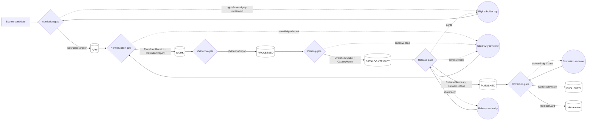

<!-- [KFM_META_BLOCK_V2]
doc_id: kfm://doc/governance/review-duties
title: Review Duties — Reviewer Roles and Separation-of-Duties Matrix
type: standard
version: v1-draft
status: draft
owners: Docs steward; co-reviewed by Release authority
created: 2026-05-12
updated: 2026-05-12
policy_label: public
related:
  - docs/doctrine/directory-rules.md
  - docs/doctrine/authority-ladder.md
  - docs/doctrine/trust-membrane.md
  - docs/doctrine/lifecycle-law.md
  - docs/adr/ADR-S-09-reviewer-separation-threshold.md
  - docs/registers/DRIFT_REGISTER.md
  - release/manifests/
  - schemas/contracts/v1/review/review_record.schema.json
tags: [kfm, governance, review, separation-of-duties, release]
notes:
  - Consolidates Atlas v1.1 Ch. 24.7 (Reviewer Role and Separation-of-Duties Matrix).
  - All role definitions and matrix rows are PROPOSED pending ADR-S-09.
  - Operating-Law Invariant 9 (separation of duties when maturity justifies) is CONFIRMED.
[/KFM_META_BLOCK_V2] -->

# Review Duties — Reviewer Roles and Separation-of-Duties Matrix

> **Who is allowed to author what, who must approve what, and at which lifecycle gate that separation becomes mandatory.** This is the governance face of KFM's release discipline; it is *not* an access-control implementation.


| Field | Value |
|---|---|
| **Doc class** | Governance reference (standard doc) |
| **Authority of these rules** | CONFIRMED for Operating-Law Invariant 9; PROPOSED for the role catalogue and matrix rows (per Atlas v1.1 Ch. 24.7) |
| **Owner** | Docs steward |
| **Reviewers required for change** | Docs steward + Release authority; **ADR required** to amend the matrix in a way that loosens separation for any sensitive-lane row |
| **Supersedes** | None — this is the first consolidated `docs/governance/` review-duty doc |
| **Status** | `draft` |
| **Last updated** | `2026-05-12` |

> [!IMPORTANT]
> This document **describes** the duty model. It does not, by itself, enforce anything.
> Today, enforcement is by custom (PR review, named approvers); tooling enforcement
> (`CODEOWNERS`, branch protection, OPA two-key gate) is the **PROPOSED** target state
> and is gated on **ADR-S-09 — Reviewer separation-of-duties threshold**.

---

## Contents

1. [Purpose & scope](#1-purpose--scope)
2. [Doctrinal basis](#2-doctrinal-basis)
3. [Reviewer roles](#3-reviewer-roles)
4. [Separation-of-Duties matrix](#4-separation-of-duties-matrix)
5. [Review flow at a glance](#5-review-flow-at-a-glance)
6. [The `ReviewRecord` contract](#6-the-reviewrecord-contract)
7. [Sensitivity-tier transitions (cross-reference)](#7-sensitivity-tier-transitions-cross-reference)
8. [Maturity model & the tooling threshold (ADR-S-09)](#8-maturity-model--the-tooling-threshold-adr-s-09)
9. [How to invoke a review](#9-how-to-invoke-a-review)
10. [Drift patterns & anti-patterns](#10-drift-patterns--anti-patterns)
11. [Related docs](#11-related-docs)
12. [Open questions & NEEDS VERIFICATION](#12-open-questions--needs-verification)

---

## 1. Purpose & scope

`docs/governance/REVIEW_DUTIES.md` is the **single human-facing reference** for who reviews what across the KFM lifecycle. It answers four questions that the rest of the doctrine assumes have an answer somewhere:

- **Which roles exist** as reviewers in the KFM system, and what each one *owns*.
- **Which actions** require a reviewer who is *not* the author.
- **Under which conditions** that separation becomes mandatory rather than advisory.
- **Which artifact** (`ReviewRecord`, `ReleaseManifest`, `CorrectionNotice`, `RollbackCard`) records the decision so it remains auditable later.

**In scope.** Role catalogue · separation matrix · review-flow narrative · `ReviewRecord` shape · sensitivity-tier transition reviewers · maturity-vs-tooling threshold · drift patterns.

**Out of scope.**

- Object-family meaning → `contracts/`.
- Field-level shape of receipts → `schemas/contracts/v1/`.
- Policy rules that *evaluate* a decision → `policy/`.
- Code-level identity, auth, RBAC plumbing → `apps/governed-api/` + `infra/`.

> [!NOTE]
> This doc is **doctrine + reference**. It does not assume a mounted repo, and it does not
> claim any of these roles are implemented as named GitHub teams, CODEOWNERS entries, or
> OPA-enforced gates yet. Those mappings live in the repo when they exist, and are
> tracked in `docs/registers/DRIFT_REGISTER.md` until they do.

---

## 2. Doctrinal basis

KFM's separation-of-duties model is grounded in three layered sources.

| Layer | Source | What it gives this doc | Status |
|---|---|---|---|
| Operating Law | KFM Operating Law, Invariant 9 — *"separate policy-significant release duties when maturity justifies it"* | The non-negotiable principle | **CONFIRMED** |
| Doctrine consolidation | Atlas v1.1 **Ch. 24.7** — *Master Reviewer Role and Separation-of-Duties Matrix* | The eight-role catalogue + the action-by-action matrix | Section is **CONFIRMED**; individual rows labelled **PROPOSED** by Atlas v1.1 |
| Placement & change discipline | `docs/doctrine/directory-rules.md` §6.1 and §2.4 | That `docs/governance/` is the home for "roles, review burden, separation of duties," and that material changes to the matrix are ADR-class | **CONFIRMED** |

> [!NOTE]
> The roles and matrix below were **named-only** in Atlas v1.1: the supplement explicitly
> says these are *"PROPOSED reference for ADR discussion"* — primarily **ADR-S-09**. This
> document carries that PROPOSED status forward verbatim. Promoting any row from PROPOSED
> to CONFIRMED happens via ADR, not via README edit.

[⬆ back to top](#contents)

---

## 3. Reviewer roles

The eight roles below are KFM's named reviewer surface. They are **role labels**, not job titles — one person may hold several roles, and tooling enforcement (when it lands) will key on the role, not on the person.

> [!NOTE]
> Role scope is **PROPOSED** (Atlas v1.1 Ch. 24.7.1). Treat the "Scope" column as the
> reviewable boundary, not as a binding charter, until ADR-S-09 closes.

| Role | Owns (PROPOSED) | Acts on (PROPOSED) | Primary receipts produced |
|---|---|---|---|
| **Source steward** | Admission, rights confirmation, and sensitivity tag for a named source family. | `SourceDescriptor` lifecycle; admission gate (— → RAW). | `SourceDescriptor`, `PolicyDecision`. |
| **Domain steward** | Meaning, contracts, and validators of a domain's object families. | Domain contracts and schemas; validator authorship; domain-internal promotions. | `ValidationReport`, `TransformReceipt`. |
| **Sensitivity reviewer** | Redaction, generalization, withholding, and tier decisions for sensitive content. | `RedactionReceipt`; tier transitions for sensitive lanes (Archaeology, Fauna, Flora, People/DNA, sensitive Settlements). | `RedactionReceipt`, `ReviewRecord`. |
| **Rights-holder representative** | Sovereignty, cultural-heritage, or consent-based release decisions. | Archaeology, sovereign data, living-person data, DNA data. | `ReviewRecord` (with `role: rights-holder-rep`). |
| **Release authority** | Issues `ReleaseManifest`s and authorizes PUBLISHED transitions; **distinct from authorship** when materiality applies. | PUBLISHED transitions; rollback authorization. | `ReleaseManifest`, `RollbackCard`. |
| **Correction reviewer** | Reviews `CorrectionNotice` / `RollbackCard` before they amend a PUBLISHED claim. | Post-publication corrections and rollbacks. | `CorrectionNotice` (countersigned), `RollbackCard`. |
| **AI surface steward** | Reviews Focus Mode templates, `AIReceipt`s, and policy bindings; audits AI behaviour against cite-or-abstain doctrine. | Focus Mode; `AIReceipt` sampling; cite-or-abstain audits. | `AIReceipt` audit notes; `ReviewRecord`. |
| **Docs steward** | Governance documentation, ADR index, drift register, and Atlas / supplement integrity. | `docs/` tree; ADR index; `docs/registers/DRIFT_REGISTER.md`. | `ReviewRecord` for doctrine artifacts; supersession entries. |

> [!TIP]
> A useful mental model: **stewards admit and shape; reviewers gate; authorities release.**
> The same person *may* play several of those, but the **receipts they produce must show
> which role they were acting in**, because that field drives both audit and future
> tooling enforcement.

[⬆ back to top](#contents)

---

## 4. Separation-of-Duties matrix

This is the operational core of the document. Each row is a governed action; the second column says whether the author may also approve it; the third column names the separation that must be present when the answer is "No"; the fourth column names the receipt that records the decision.

> [!IMPORTANT]
> Every row below is **PROPOSED** per Atlas v1.1 Ch. 24.7.2. The matrix is **stable
> enough to design against** but is not frozen until ADR-S-09 lands. Loosening any
> sensitive-lane row from "No" to "Yes" is **ADR-class** per Directory Rules §2.4.

| # | Action | May the author also approve? | Required separation (PROPOSED) | Decision recorded in |
|---|---|---|---|---|
| 1 | **Source admission** (— → RAW) | Yes for routine; **No** when source has unresolved rights / sovereignty. | Source steward + rights-holder rep where applicable. | `SourceDescriptor` + `ReviewRecord` (when separation triggers). |
| 2 | **Normalization receipts** (RAW → WORK/QUARANTINE) | Yes for routine; **No** when transforms are sensitivity-relevant. | Domain steward; sensitivity reviewer if sensitivity-relevant. | `TransformReceipt` + `RedactionReceipt` (if applies). |
| 3 | **Validator authorship & run** | Yes — validators are deterministic. | Domain steward; periodic audit by docs steward. | `ValidationReport`. |
| 4 | **Promotion to PROCESSED / CATALOG** | Yes for non-sensitive routine; **No** for sensitive lanes. | Domain steward + sensitivity reviewer (sensitive lanes). | `ValidationReport` + `ReviewRecord` (sensitive lanes). |
| 5 | **Release to PUBLISHED** | **No** when materiality applies. | Author ≠ Release authority; rights-holder rep where applicable. | `ReleaseManifest` + `ReviewRecord`. |
| 6 | **Sensitive-lane release** | **No** — always separate. | Author + sensitivity reviewer + Release authority + rights-holder rep. | `ReleaseManifest` + `ReviewRecord` + `RedactionReceipt`. |
| 7 | **Correction / rollback** | **No** when correction is steward-significant. | Author / detector + correction reviewer + Release authority. | `CorrectionNotice` and/or `RollbackCard` + `ReviewRecord`. |
| 8 | **AI surface change** (template / policy binding) | **No**. | AI surface steward + docs steward (policy binding). | `ReviewRecord`; downstream `AIReceipt` sampling. |
| 9 | **Atlas / supplement publication** | **No**. | Docs steward + at least one subsystem owner (per Directory Rules §0). | `ReviewRecord`; supersession entry in `docs/archive/lineage/`. |

> [!WARNING]
> Rows 5, 6, 8, and 9 are **never** routine: there is no maturity level at which the
> author of a PUBLISHED release, a sensitive-lane release, an AI policy binding, or a
> doctrine publication is allowed to also approve it. The other rows soften with
> maturity; these four do not. See §8.

[⬆ back to top](#contents)

---

## 5. Review flow at a glance

The lifecycle gates already require certain receipts (Atlas v1.1 Ch. 24.6). This diagram overlays the **reviewer who must be present** at each gate when the conditions in §4 trigger.



> [!NOTE]
> The diagram reflects **PROPOSED** reviewer placement per Atlas v1.1 Ch. 24.7. If a
> mounted repo turns out to wire reviewers differently (e.g. via `CODEOWNERS`), file the
> conflict in `docs/registers/DRIFT_REGISTER.md` rather than silently amending the
> diagram.

[⬆ back to top](#contents)

---

## 6. The `ReviewRecord` contract

`ReviewRecord` is the receipt that records a steward, rights-holder, or policy review of a candidate transition. It is the artifact that makes every "No" cell in §4 auditable later. The shape below mirrors Atlas v1.1 Ch. 24.2 (Receipt Catalog).

> [!IMPORTANT]
> **Schema home:** the canonical JSON Schema is **PROPOSED** at
> `schemas/contracts/v1/review/review_record.schema.json` per ADR-0001 (schema home).
> Treat the path as `PROPOSED / NEEDS VERIFICATION` until a mounted-repo inspection
> confirms it.

| Field | Shape (PROPOSED) | Notes |
|---|---|---|
| `reviewer` | identity (string id; may be a team or named person) | The actor; **never** the author when the action is in §4 rows 5, 6, 8, or 9. |
| `role` | enum: one of the eight roles in §3 | Drives audit and future tooling enforcement. |
| `decision` | enum: `ALLOW` \| `RESTRICT` \| `DENY` \| `HOLD` | `HOLD` is a real outcome; it keeps the transition closed without burning the candidate. |
| `evidence_refs[]` | array of `EvidenceRef` | Must resolve to an `EvidenceBundle` for non-trivial decisions. |
| `policy_ref` | id of the `policy/` rule(s) consulted | Pairs with a `PolicyDecision`. |
| `time` | RFC 3339 timestamp | Used by the freshness / staleness layer. |
| `subject_ref` | id of the object under review | Source id, claim id, layer id, release id, etc. |
| `notes` | free text (bounded) | Steward narrative; non-authoritative. |

<details>
<summary><b>Illustrative <code>ReviewRecord</code> for a sensitive-lane release (PROPOSED shape, not from a mounted repo)</b></summary>

```json
{
  "review_record_id": "rr:review:fauna:rare-occurrence:2026-05-12-001",
  "subject_ref": "claim:fauna:occurrence:abc-123",
  "reviewer": "team:sensitivity-reviewers",
  "role": "sensitivity-reviewer",
  "decision": "RESTRICT",
  "evidence_refs": ["evidence:fauna:occurrence:abc-123:bundle:v3"],
  "policy_ref": "policy/sensitivity/fauna.rego#sensitive_occurrence",
  "subject_target_tier": "T1",
  "transforms_required": ["redaction:point_10km_hex_seeded_v1"],
  "time": "2026-05-12T14:33:00Z",
  "notes": "Geometry generalized to 10 km hex; release at T1 conditional on RedactionReceipt presence."
}
```

This example is illustrative; the field set is taken from Atlas v1.1 Ch. 24.2 but the
exact JSON Schema is not verified in this session.
</details>

[⬆ back to top](#contents)

---

## 7. Sensitivity-tier transitions (cross-reference)

Reviewer presence is tier-aware. Atlas v1.1 Ch. 24.5.3 defines who must be present for each **tier transition** (T0 = open, T4 = denied). This table reflects that schedule.

> [!NOTE]
> The **T0–T4** scheme is itself **PROPOSED** pending **ADR-S-05**. The reviewer
> requirements below are the *consequences* of that scheme as it stands in v1.1.

| From → To | Required receipt(s) | Required reviewer(s) | Reversibility |
|---|---|---|---|
| T4 → T3 | `PolicyDecision` + `ReviewRecord` + named agreement | Steward + **rights-holder rep** (where applicable) | Reversible via agreement revocation + `CorrectionNotice`. |
| T4 → T2 | `PolicyDecision` + `ReviewRecord` | Steward | Reversible via review revocation. |
| T4 → T1 | `RedactionReceipt` + `ReviewRecord` | Steward | Reversible; correction may demote a published T1 back to T4. |
| T3 → T2 | `PolicyDecision` + `ReviewRecord` | Steward | Reversible. |
| T2 → T1 | `RedactionReceipt` + `ReviewRecord` | Steward | Reversible. |
| T1 → T0 | `ReleaseManifest` + `ReviewRecord` | **Steward + Release authority** | Reversible via `RollbackCard`. |
| Any → T4 (downgrade) | `CorrectionNotice` + `ReviewRecord` | Steward + rights-holder where applicable | Always permitted; precedes derivative invalidation. |

> [!TIP]
> **Reading shortcut.** *Up* (toward public) always needs a **transform receipt + a review
> record**. *Down* (toward less public) **never** needs both — a `CorrectionNotice` alone
> is sufficient to remove or restrict.

[⬆ back to top](#contents)

---

## 8. Maturity model & the tooling threshold (ADR-S-09)

KFM Operating Law treats separation of duties as **maturity-dependent**, not as a fixed gate. The text in Atlas v1.1 Ch. 24.7.2 is direct:

> *"Early-stage doctrine work may be authored and approved by the same actor when materiality is low. As maturity rises and the public trust surface expands, separation must be enforced through tooling, not custom; the supplement does not pretend the enforcement exists yet."*

That sentence is the entire posture of this document. The matrix in §4 is the **target**; today's enforcement is by **custom** (PR review, named approvers, manual `ReviewRecord` authoring).

### 8.1 Maturity bands (PROPOSED)

| Maturity band | Public trust surface | Posture for §4 rows 1–4 | Posture for §4 rows 5–9 | Enforcement |
|---|---|---|---|---|
| **Doctrine-only** (current) | None (no public release surface live) | Same-actor permitted with documented exceptions for sensitive lanes. | Same-actor **not** permitted, but enforced by review custom. | Custom (PR, manual). |
| **Internal-release** | Stewards + named collaborators only | Same-actor permitted only for non-sensitive routine. | Two-actor required and named in `ReviewRecord`. | Custom + `CODEOWNERS`. |
| **Public-release** | Public governed-API surface live | Same-actor permitted only when row 4 reads "Yes for non-sensitive routine"; otherwise blocked. | Two-actor **mandatory**, enforced by branch protection + OPA gate G (two-key). | Tooling. |
| **High-exposure** (3D, AI surface, archaeology, DNA) | Sensitive content visible | Two-actor mandatory across the board. | Two-actor + rights-holder rep + Release authority, blocked at gate. | Tooling, fail-closed. |

> [!IMPORTANT]
> **ADR-S-09 — Reviewer separation-of-duties threshold** is the open ADR that fixes the
> transitions between these bands. Until it lands, the table above is a **PROPOSED**
> reading. The bands themselves, the matrix, and the role catalogue all derive from
> Atlas v1.1 Ch. 24.7 and are intentionally compatible with the **C5-01 Gate Matrix A–G**
> framing, where Gate **G** = "Reviewability with two-key approval."

### 8.2 What "enforced by tooling" looks like (target, not current)

These are the artefacts that, **once present and wired**, move a duty from "custom" to "tooling-enforced." All entries are **PROPOSED / NEEDS VERIFICATION** until a mounted repo confirms them.

- `CODEOWNERS` entries that bind each `policy/`, `release/`, `data/published/`, and `schemas/contracts/v1/review/` path to the correct role.
- Branch protection that requires **two distinct reviewers** for paths covered by §4 rows 5–9.
- OPA / Conftest fixtures under `policy/promotion/` that **deny** a release when `ReleaseManifest.author == ReviewRecord.reviewer` for sensitive-lane content.
- `tools/validators/review/` that re-runs the `ReviewRecord` schema check and the role-vs-action consistency check in CI.
- The **C14-01 starter pack** (`CODEOWNERS`, `tool-versions.yaml`, `policy-bundle.json`, `sbom.yaml`, `run_receipt.schema.json`, `integrity.yml`, `verify.sh`) present at repo root.

[⬆ back to top](#contents)

---

## 9. How to invoke a review

This section is procedural. It assumes the actor has read §3–§4 and knows which row applies.

1. **Identify the row.** Locate the action in the §4 matrix.
2. **If "Yes" applies and the lane is not sensitive** — proceed; emit the routine receipt (`TransformReceipt`, `ValidationReport`, etc.) and note the actor in the receipt.
3. **If "No" applies** — stop. Open a review request that identifies:
   - the **subject** (source id, claim id, layer id, release id),
   - the **target transition** (e.g. `T2 → T1`, or `CATALOG → PUBLISHED`),
   - the **role** of the reviewer being requested,
   - the **evidence refs** that the reviewer needs.
4. **The reviewer** authors a `ReviewRecord` per §6 with `decision ∈ {ALLOW, RESTRICT, DENY, HOLD}`.
5. **Closure.** The transition's required receipts (per Atlas v1.1 Ch. 24.6) must include the `ReviewRecord` *before* the gate evaluates. A missing or insufficient `ReviewRecord` fails the gate closed with reason code `REVIEW_NEEDED`, `REVIEW_INSUFFICIENT`, or `REVIEW_REJECTED`.
6. **Audit.** Every `ReviewRecord` is preserved; corrections supersede, they do not overwrite.

> [!CAUTION]
> Do **not** retroactively edit a `ReviewRecord` after the gate has closed. If the
> decision was wrong, the correction path is a **new** `ReviewRecord` + a
> `CorrectionNotice` (and, if the release has shipped, a `RollbackCard`). Silent edits
> are an Operating-Law violation.

[⬆ back to top](#contents)

---

## 10. Drift patterns & anti-patterns

These are the failure modes the matrix exists to prevent. They are drawn from Atlas v1.1 Ch. 24.9 (Failure-Mode and Anti-Pattern Register) and Directory Rules §13 — not invented here.

| Drift / anti-pattern | Why it's dangerous | Where it most often shows up |
|---|---|---|
| **Author = Release authority** for a material release | Collapses the trust membrane; turns publication into self-attestation. | §4 row 5, sensitive lanes (§4 row 6). |
| **Same actor admits and releases a sensitive source** | Hides the rights / sovereignty checkpoint. | §4 row 1 + row 6. |
| **Silent `ReviewRecord` edit after closure** | Erases the audit trail Operating Law depends on. | §6, §9. |
| **`AIReceipt` without an AI surface steward audit** | Cite-or-abstain becomes "say it fluently and call it cited." | §4 row 8. |
| **Tier upgrade without `RedactionReceipt`** | Sensitive content reaches public surface without a transform receipt. | §7 (T4→T1 / T2→T1). |
| **`CODEOWNERS`-as-implementation, `ReviewRecord`-not-emitted** | Looks enforced; isn't auditable. The receipt is the truth, not the GitHub approval. | §8.2. |
| **"It's still doctrine-only, so the rule doesn't apply yet"** for §4 rows 5, 6, 8, 9 | Those rows do not soften with maturity. See §8. | §8.1. |

[⬆ back to top](#contents)

---

## 11. Related docs

- [`docs/doctrine/directory-rules.md`](../doctrine/directory-rules.md) — §6.1 places this file; §2.4 governs how the matrix is amended.
- [`docs/doctrine/authority-ladder.md`](../doctrine/authority-ladder.md) — what outranks what when sources conflict.
- [`docs/doctrine/trust-membrane.md`](../doctrine/trust-membrane.md) — the boundary the matrix protects.
- [`docs/doctrine/lifecycle-law.md`](../doctrine/lifecycle-law.md) — RAW → WORK/QUARANTINE → PROCESSED → CATALOG/TRIPLET → PUBLISHED.
- [`docs/architecture/governed-api.md`](../architecture/governed-api.md) — the operational form of the trust membrane.
- [`docs/adr/README.md`](../adr/README.md) — ADR index. **ADR-S-09** (reviewer separation threshold) is the open ADR that closes the maturity-band table in §8.
- [`docs/registers/DRIFT_REGISTER.md`](../registers/DRIFT_REGISTER.md) — file any conflict between this matrix and observed repo behaviour here.
- `release/manifests/`, `release/correction_notices/`, `release/rollback_cards/` — where the release-side artifacts referenced in §4 live (paths CONFIRMED in Directory Rules §19 glossary).
- `schemas/contracts/v1/review/review_record.schema.json` — **PROPOSED / NEEDS VERIFICATION** canonical schema home.

[⬆ back to top](#contents)

---

## 12. Open questions & NEEDS VERIFICATION

These items are intentionally **not** resolved in this document. Track them in `docs/registers/VERIFICATION_BACKLOG.md` and resolve via ADR or per-root README.

- **NEEDS VERIFICATION:** Whether `schemas/contracts/v1/review/review_record.schema.json` is the live schema home, or whether a `<domain>/review/` layout exists (intersects ADR-S-03).
- **NEEDS VERIFICATION:** Whether a `policy/review/` Rego bundle exists today and what its deny rules look like.
- **NEEDS VERIFICATION:** Whether `CODEOWNERS` is present at repo root, and which paths it covers.
- **NEEDS VERIFICATION:** Whether any `ReviewRecord` instances have been emitted to date and where they live (`data/receipts/review/`? `release/review/`?).
- **OPEN (ADR-S-09):** Concrete thresholds that move a duty from "custom" to "tooling-enforced." Maturity bands in §8.1 are PROPOSED placeholders.
- **OPEN (ADR-S-05):** Adoption of the T0–T4 tier scheme as canonical (affects §7).
- **OPEN:** Whether AI surface review (§4 row 8) requires its own dedicated receipt class or whether `AIReceipt` + `ReviewRecord` is sufficient.
- **UNKNOWN:** Whether the team currently in place can staff all eight roles in §3, or whether some are formally combined. This is a staffing question, not a doctrine question.

[⬆ back to top](#contents)

---

<details>
<summary><b>Appendix A — Glossary (placement-relevant terms)</b></summary>

| Term | Short definition |
|---|---|
| **Operating Law / Invariant 9** | The KFM rule that policy-significant release duties are separated when maturity justifies. CONFIRMED. |
| **Role** | A reviewer surface defined in §3. May be held by a team or a named person. |
| **Materiality** | The condition under which a release affects the public trust surface (public release, sensitive lane, AI surface, doctrine publication). Triggers the "No" cells in §4. |
| **Trust membrane** | The boundary that prevents RAW / WORK / QUARANTINE / canonical / internal state from becoming public truth. Operational form: `apps/governed-api/`. |
| **`ReviewRecord`** | The receipt that records a review decision. See §6. |
| **`ReleaseManifest`** | The release decision artifact; lives in `release/manifests/`. |
| **`CorrectionNotice` / `RollbackCard`** | Post-publication correction artifacts; live in `release/correction_notices/` and `release/rollback_cards/`. |
| **Gate G (two-key approval)** | C5-01 framing for the gate enforced when §4 rows 5–9 reach tooling-enforced maturity (§8). |
| **ADR-S-09** | The open ADR that fixes the separation-of-duties threshold. |

</details>

<details>
<summary><b>Appendix B — Quick mapping: action → role → receipt</b></summary>

| Action | Primary role | Adds when sensitive | Primary receipt | Decision receipt |
|---|---|---|---|---|
| Source admission | Source steward | + Rights-holder rep | `SourceDescriptor` | `ReviewRecord` (when triggered) |
| Normalization | Domain steward | + Sensitivity reviewer | `TransformReceipt` | — / `RedactionReceipt` |
| Validation | Domain steward | (audit by docs steward) | `ValidationReport` | — |
| Catalog closure | Domain steward | + Sensitivity reviewer | `CatalogMatrix` entry + `EvidenceBundle` | `ReviewRecord` (sensitive) |
| Release | Release authority (≠ author) | + Sensitivity reviewer + Rights-holder rep | `ReleaseManifest` | `ReviewRecord` |
| Correction | Correction reviewer + Release authority | + Rights-holder rep | `CorrectionNotice` | `ReviewRecord` |
| Rollback | Release authority | — | `RollbackCard` | `ReviewRecord` |
| AI surface change | AI surface steward + Docs steward | — | `ReviewRecord` | downstream `AIReceipt` sampling |
| Atlas publication | Docs steward + subsystem owner | — | supersession entry | `ReviewRecord` |

</details>

---

**Related docs:** [Directory Rules](../doctrine/directory-rules.md) · [Authority Ladder](../doctrine/authority-ladder.md) · [Trust Membrane](../doctrine/trust-membrane.md) · [Lifecycle Law](../doctrine/lifecycle-law.md) · [ADR Index](../adr/README.md) · [Drift Register](../registers/DRIFT_REGISTER.md)

**Last updated:** 2026-05-12 · **Version:** v1-draft · [⬆ Back to top](#review-duties--reviewer-roles-and-separation-of-duties-matrix)
