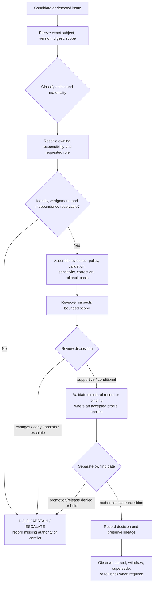

<!-- [KFM_META_BLOCK_V2]
doc_id: kfm://doc/governance/review-duties
title: Review Duties — Roles, Evidence Packets, and Separation Boundaries
type: governance-guide; review-duty-reference; repository-reconciled
authority_class: human-readable-governance-guidance
version: v2-draft
status: draft; repository-grounded; decision-proposed; non-enforcing; non-publisher
owners:
  - "@bartytime4life — verified CODEOWNERS review route only"
  - "UNKNOWN — no accepted independent governance, review, or release stewardship assignment was verified"
owner_status: "Routing is not a StewardshipAssignment, ReviewRecord, reviewer quorum, independent approval, policy authority, release authority, or proof that review occurred."
created: 2026-05-12
updated: 2026-08-23
policy_label: public; governance; review; separation-of-duties; release-adjacent
owning_root: docs/
responsibility: "Explain reviewer responsibilities, evidence handoffs, proposed author/reviewer separation defaults, and current implementation limits without creating actor authority, policy, approval, promotion, release, deployment, or publication state."
truth_posture: "CONFIRMED current repository surfaces / PROPOSED role and duty matrix / CONFLICTED ReviewRecord shape and vocabulary / UNKNOWN operational enforcement; cite-or-abstain"
evidence_snapshot:
  repository: bartytime4life/Kansas-Frontier-Matrix
  base_ref: main
  base_commit: f168b18291462da10b8b8d52459c85a10c225875
  target_prior_blob: 81893e0f6ba03f7b00311722c70d54dd283003b1
  directory_rules_blob: fd49a0b83e55cef52c1124281f093e263526898d
  governance_readme_blob: 500f8bcad3a384160a561f1460617f0a13d42fcc
  adr_0024_blob: 57d46867c97a1c8d76ccdfbc12fc012bee3bd2ea
  codeowners_blob: dd2a84aa514d8ecd9208bc347f90f9a2ed37dd61
  governance_contracts_readme_blob: 0447534a4478c2887f16f690ae67220a628de05a
  review_record_contract_blob: 9641345d1e5d939dc59687a900e60a563d92c4f0
  governance_review_record_schema_blob: fe2f2223af46481e7fb19b0baa94f62ce9c6c855
  alternate_review_record_schema_blob: a053448d68e8379b92b12a16e6528275b975433c
  review_record_fixture_readme_blob: cf55ae8fbc0a79450fea85803eb8a4490e51aabe
  review_record_validator_blob: a26f10fa18edaf7b2d2e3bf499e233c05f3007cd
  stewardship_assignment_contract_blob: 80c6fd4149deeb4172e2401dfaf741226380f085
  stewardship_assignment_schema_blob: bd12f7e5e8eea966306c250d992f2826693815c9
  review_authority_binding_contract_blob: f156e100660e9fd97ca95e90092143a3cd6d62ee
  review_authority_binding_schema_blob: 9407b357120537230aa4ef80a844ecf5149acc70
  review_authority_binding_workflow_blob: d0dd3ea0900bf5a664bbf3e092735f8889ed6e41
  sensitive_release_review_contract_blob: 235ca86dd807c6842ca8c861f995371fe7758f64
  release_reviews_readme_blob: bf3058a5af8fc85aa04a25a36ed03541cd9eb657
related:
  - ./README.md
  - ./SEPARATION_OF_DUTIES.md
  - ./ESCALATION.md
  - ./CONTRADICTION_HANDLING.md
  - ./DEPRECATION_PROCESS.md
  - ./DECISION_LOG.md
  - ../doctrine/directory-rules.md
  - ../doctrine/authority-ladder.md
  - ../doctrine/trust-membrane.md
  - ../doctrine/lifecycle-law.md
  - ../adr/ADR-0024-steward-separation-of-duties-for-release.md
  - ../adr/ADR-0029-adopt-directory-governance-standard-v2.md
  - ../registers/DRIFT_REGISTER.md
  - ../registers/VERIFICATION_BACKLOG.md
  - ../../contracts/governance/ReviewRecord.md
  - ../../contracts/governance/steward_assignment.md
  - ../../contracts/governance/review_authority_binding.md
  - ../../contracts/governance/sensitive_release_review_closure.md
  - ../../contracts/review/README.md
  - ../../schemas/contracts/v1/governance/review_record.schema.json
  - ../../schemas/contracts/v1/review/review_record.schema.json
  - ../../schemas/contracts/v1/governance/steward_assignment.schema.json
  - ../../schemas/contracts/v1/governance/review_authority_binding.schema.json
  - ../../schemas/contracts/v1/governance/sensitive_release_review_closure.schema.json
  - ../../fixtures/contracts/v1/governance/review_record/README.md
  - ../../tools/validators/validate_review_record.py
  - ../../tools/validators/governance/validate_review_authority_binding.py
  - ../../tools/validators/governance/validate_sensitive_release_review_closure.py
  - ../../release/reviews/README.md
  - ../../data/proofs/review/README.md
  - ../../policy/release/README.md
  - ../../.github/CODEOWNERS
  - ../../.github/workflows/review-authority-binding.yml
  - ../../.github/workflows/sensitive-release-review-closure.yml
non_effects:
  - does_not_accept_ADR_0024_or_the_role_matrix
  - does_not_create_or_assign_a_steward_reviewer_or_release_authority
  - does_not_select_a_canonical_ReviewRecord_schema_or_vocabulary
  - does_not_authenticate_actor_identity_or_prove_independence
  - does_not_evaluate_policy_or_close_evidence
  - does_not_create_a_ReviewRecord_PolicyDecision_PromotionDecision_or_ReleaseManifest
  - does_not_merge_promote_release_deploy_publish_or_change_repository_settings
tags: [kfm, governance, review, reviewer-duties, separation-of-duties, evidence, policy, release, correction, rollback, ai]
notes:
  - "v2-draft is a same-path documentation-only reconciliation against current repository evidence."
  - "Accepted ADR-0029 and Directory Rules confirm docs/ as the owning responsibility root; this change creates no path, root, schema home, or parallel authority."
  - "ADR-0024 is the current numbered release-separation decision record and remains proposed. Atlas label ADR-S-09 is retained as source-lineage backlog terminology; no repository ADR file with that name was verified."
  - "The eight core roles and action matrix remain PROPOSED guidance until the applicable decision is accepted."
  - "The repository contains substantive fixture-only review binding and sensitive-release closure profiles, but both declare authority NONE and grant no write, release, deployment, publication, or public-use permission."
  - "ReviewRecord meaning, machine shape, role vocabulary, disposition vocabulary, and schema home remain conflicted across current surfaces."
[/KFM_META_BLOCK_V2] -->

<a id="top"></a>

# Review Duties — Roles, Evidence Packets, and Separation Boundaries

> **Who reviews what, what evidence the reviewer needs, what independence must be demonstrated, and what a completed review still does not authorize.**

[](#status--authority)
[](../adr/ADR-0029-adopt-directory-governance-standard-v2.md)
[](../adr/ADR-0024-steward-separation-of-duties-for-release.md)
[](#7-reviewrecord-and-review-packet-boundary)
[](#4-current-repository-evidence)
[](#10-maturity-model-and-graduation-gates)
[](#status--authority)

> [!IMPORTANT]
> **This page explains review burden; it does not confer review authority.** A role name, CODEOWNERS match, GitHub approval, workflow pass, schema-valid object, fixture result, pull request, or merge cannot establish an accountable reviewer or authorize a release. Governed review requires resolved actor identity, current scoped authority, exact subject binding, review evidence, applicable policy and sensitivity context, and a separate state-bearing decision where promotion or release is involved.

> [!WARNING]
> **Review is not release.** A valid review packet may support a `PromotionDecision`, `ReleaseManifest`, correction, withdrawal, or rollback decision. It is never a substitute for those objects, and it never makes a candidate public by itself.

## Status & authority

| Area | Current bounded result | Consequence |
|---|---|---|
| Tracked path | **CONFIRMED** at `docs/governance/REVIEW_DUTIES.md` | Same-path update under the existing human-governance lane. |
| Placement authority | **CONFIRMED** through accepted ADR-0029 and adopted Directory Rules | Human review guidance belongs under `docs/`; no new root or migration is introduced. |
| Document authority | **DRAFT** governance guidance | Binding force exists only where this page accurately restates accepted higher authority. |
| Release-separation decision | **PROPOSED** in [`ADR-0024`](../adr/ADR-0024-steward-separation-of-duties-for-release.md) | The role model, thresholds, evidence packet, and enforcement maturity are not accepted policy. |
| Atlas `ADR-S-09` label | **SOURCE-LINEAGE / no current ADR file verified** | Use ADR-0024 as the current numbered repository decision record; do not link to an invented ADR-S-09 path. |
| Repository review route | **CONFIRMED**: `@bartytime4life` through [CODEOWNERS](../../.github/CODEOWNERS) | One routing account does not prove independent reviewer capacity, assignment, recusal, or approval. |
| `ReviewRecord` meaning and shape | **CONFLICTED / PARTIAL** | A rich draft semantic contract, a constrained proposed governance schema, and a second empty review-family schema coexist. This page selects none. |
| Bounded executable support | **CONFIRMED fixture-only candidates** | Review binding and T3/T4 sensitive-release closure can be checked synthetically; both grant no authority. |
| Release policy | **SCAFFOLDED / HOLD** | `policy/release/` does not establish an accepted evaluator, bundle, decision receipt, or authenticated release integration. |
| Operational review and release SoD | **UNKNOWN / HOLD** | No accepted actor registry, stewardship assignments, independent reviewer quorum, governed release record, or observed public-release enforcement is established here. |
| Merge, promotion, release, deployment, publication | **None** | Documentation and CI evidence remain separate from governed state transitions. |

**Quick navigation:** [Purpose](#1-purpose--scope) · [Authority](#2-authority-and-evidence-boundary) · [Terms](#3-review-responsibility-model) · [Current evidence](#4-current-repository-evidence) · [Roles](#5-role-catalogue-and-current-machine-coverage) · [Matrix](#6-proposed-review-duty-matrix) · [ReviewRecord](#7-reviewrecord-and-review-packet-boundary) · [Flow](#8-review-flow-and-handoff) · [Sensitivity](#9-sensitive-rights-and-exposure-review) · [Maturity](#10-maturity-model-and-graduation-gates) · [Procedure](#11-how-to-invoke-and-complete-a-review) · [Correction](#12-expiry-recusal-supersession-and-correction) · [AI](#13-ai-ui-api-and-map-review-duties) · [Anti-patterns](#14-anti-patterns) · [Validation](#15-validation-and-review-checklists) · [Related](#16-related-repository-surfaces) · [Open work](#17-open-verification-register) · [History](#18-change-history-and-rollback)

---

## 1. Purpose & scope

KFM review exists to make accountable judgment inspectable before a consequential transition. This document answers five questions:

1. **What is the subject of review?**
2. **Which responsibility and role are in scope?**
3. **What evidence, policy, sensitivity, rights, validation, correction, and rollback context must the reviewer inspect?**
4. **Must the reviewer be independent of the author, producer, detector, or release proposer?**
5. **Which separate decision or lifecycle gate remains after review?**

### 1.1 In scope

- reviewer responsibilities across source admission, transformation, validation, catalog closure, public release, correction, rollback, governed AI, UI/API, and governance changes;
- proposed author/reviewer separation defaults;
- review-request and review-evidence handoff requirements;
- current `ReviewRecord`, `StewardshipAssignment`, binding, fixture, validator, proof-support, and release-review surfaces;
- review expiry, recusal, supersession, escalation, and correction;
- fail-closed behavior where identity, authority, evidence, rights, sensitivity, policy, or independence is unresolved;
- maturity gates between prose, fixture proof, governed identity/policy, release integration, and observed operation.

### 1.2 Out of scope

This document does not:

- define semantic object meaning owned by `contracts/`;
- select machine shape owned by `schemas/`;
- evaluate admissibility owned by accepted `policy/` source and evaluator profiles;
- authenticate actors or administer accounts, teams, credentials, signatures, branch rules, or repository settings;
- create review, proof, receipt, promotion, release, correction, withdrawal, or rollback instances;
- decide legal title, medical, emergency, cultural, sovereignty, or rights questions;
- make a source admissible or a claim true;
- release or publish an artifact.

### 1.3 Lifecycle relationship

Review may be required at several gates, but it does not replace the lifecycle:

```text
RAW -> WORK / QUARANTINE -> PROCESSED -> CATALOG / TRIPLET -> PUBLISHED
```

Promotion remains a governed state transition. A review can support that transition only when its subject, evidence, actor, authority, conditions, policy context, correction path, and rollback target are bound at the level appropriate to consequence.

[Back to top](#top)

---

## 2. Authority and evidence boundary

Authority depends on the claim being made.

| Question | Controlling surface | Current posture |
|---|---|---|
| Where does this human guidance belong? | Accepted ADR-0029, Directory Rules, and the repository-present path | **CONFIRMED** `docs/` responsibility. |
| Is the role/separation model accepted? | ADR-0024 and the canonical ADR index | **PROPOSED**, not accepted. |
| What does a `ReviewRecord` mean? | `contracts/governance/ReviewRecord.md` | Draft semantic contract; richer than current machine schema. |
| What `ReviewRecord` bytes validate? | Accepted schema authority, currently unresolved between two candidates | **CONFLICTED / NEEDS DECISION**. |
| Who is assigned authority? | Accepted `StewardshipAssignment`, authenticated identity, and applicable policy/decision records | **UNKNOWN / HOLD** for operational use. |
| Does declared review/assignment/subject data agree? | Fixture-only `ReviewAuthorityBinding` profile | **BOUNDED STRUCTURAL EVIDENCE** only. |
| Is T3/T4 review structurally closed for a later gate? | Fixture-only `SensitiveReleaseReviewClosure` profile | **BOUNDED STRUCTURAL EVIDENCE** only. |
| May a release proceed? | Accepted policy, accountable review, release decision, manifest, correction and rollback support | Not decided by this page or either fixture profile. |
| Did GitHub route or mediate a review? | CODEOWNERS, pull-request records, workflow/check evidence, and rulesets | Platform evidence only; not KFM review authority. |

### 2.1 Evidence labels

| Label | Meaning here |
|---|---|
| **CONFIRMED** | Verified at the pinned repository snapshot from exact files, configuration, accepted decisions, or executable definitions. |
| **PROPOSED** | A role, matrix row, packet, threshold, or procedure not accepted or operationally proven. |
| **CONFLICTED** | Current repository surfaces disagree or overlap without a verified canonical decision. |
| **UNKNOWN** | Available evidence cannot establish the current state. |
| **NEEDS VERIFICATION** | A concrete check or decision could resolve the claim. |
| **HOLD** | A stronger transition must not proceed because a non-compensable dependency is unresolved. |

### 2.2 Reading lower-tier evidence

- A contract can define intended meaning without proving implementation.
- A schema can validate shape without proving truth, authority, independence, or review occurrence.
- A fixture and validator can prove bounded behavior without creating a governed record.
- A workflow can run a validator without authenticating the human actors represented in synthetic data.
- CODEOWNERS can route a request without establishing accepted stewardship or independent approval.
- A release-review README can describe a lane without containing a governed release review.
- A review-support proof can bind references without making the review or release decision.

[Back to top](#top)

---

## 3. Review responsibility model

Review duties become trustworthy only when five distinct concepts remain separate.

| Concept | Question it answers | Must not collapse into |
|---|---|---|
| **Actor identity** | Who is the human or service actor? | Account display name, role label, or unverified alias. |
| **Stewardship assignment** | What bounded responsibility does the actor hold, during which interval, and on what authority basis? | CODEOWNERS routing or team membership alone. |
| **Review event** | What exact subject and scope did the actor review, against which basis, and with what disposition? | GitHub comment, workflow status, or release decision. |
| **Structural binding** | Do the declared actor, role, assignment, subject, time, and separation fields agree? | Authentication, policy evaluation, or approval authority. |
| **State-bearing decision** | Did policy, promotion, release, correction, withdrawal, or rollback authority change governed state? | Review prose or schema validity. |

### 3.1 Role label is not authority

A role label is useful vocabulary. It does not grant permission. Operational authority requires, at minimum:

```text
resolved actor identity
  + current scoped StewardshipAssignment
  + exact reviewed subject and digest
  + applicable policy and sensitivity context
  + required independence / recusal checks
  + accountable ReviewRecord or equivalent governed review evidence
  + separate promotion or release decision where state changes
```

Missing or contradictory terms in that chain result in `HOLD`, `ABSTAIN`, `DENY`, or `ERROR` according to the owning control. This page does not define a universal automatic mapping.

### 3.2 Review scope is finite

Approval in one scope does not imply approval in another. Examples:

- a schema reviewer can approve machine shape without approving source rights;
- a domain steward can approve meaning without approving public precision;
- a sensitivity reviewer can approve a generalization transform without approving release;
- a release authority can approve a release only within accepted assignment, policy, and evidence boundaries;
- a docs reviewer can approve clarity without accepting an ADR;
- a GitHub reviewer can approve a pull request without issuing a KFM `ReviewRecord`.

[Back to top](#top)

---

## 4. Current repository evidence

The repository has meaningful review infrastructure, but operational closure is not established.

| Surface | CONFIRMED current evidence | Boundary |
|---|---|---|
| Human governance lane | `docs/governance/` contains this page, separation, escalation, contradiction, deprecation, decision-log, charter, and landing guidance. | Documentation explains; it does not enforce. |
| ADR-0024 | Numbered decision record exists, status `draft`, effective decision status `proposed`. | It addresses the Atlas ADR-S-09 backlog but is not accepted. |
| CODEOWNERS | All relevant roots route to `@bartytime4life`, the only verified owner identity in that file. | Single-account routing does not prove independent reviewer capacity or accepted assignments. |
| ReviewRecord semantic contract | `contracts/governance/ReviewRecord.md` defines a rich draft review event. | Draft meaning does not create records or accepted authority. |
| Governance ReviewRecord schema | Fielded, closed proposed schema requires seven fields and small role/decision enums. | It does not match the full semantic contract and contains a casing mismatch in `contract_doc`. |
| Alternate ReviewRecord schema | `schemas/contracts/v1/review/review_record.schema.json` is an empty permissive scaffold. | It is a competing candidate, not canonical authority. |
| ReviewRecord fixtures | One minimal valid and one missing-ID invalid fixture are documented. | Fixture coverage is narrow and shape-only. |
| ReviewRecord validator | `tools/validators/validate_review_record.py` validates a synthetic promotion Gate G projection including self-review, authority interval, scope, subject, freshness, supersession, and digest checks. | It consumes repository-owned fixtures and creates no actor, assignment, review, policy, release, or publication authority. |
| StewardshipAssignment | Draft semantic contract exists; paired schema is a permissive stub requiring only `id`. | No accepted operational assignment registry or authenticated assignment was verified. |
| ReviewAuthorityBinding | Strict proposed-inactive fixture profile reports `BOUND`, `HOLD`, or `DENY`. | `authority: NONE`; all write, promotion, release, deployment, publication, and public-use permissions are fixed false. |
| SensitiveReleaseReviewClosure | Proposed-inactive T3/T4 fixture profile reports structural closure, `HOLD`, or `DENY`. | Closed status only permits consideration by a separate release gate; it is not approval. |
| Release-review lane | `release/reviews/README.md` defines guidance and finite review-readiness outcomes. | The lane reports no parent-level governed release `ReviewRecord`. |
| Review-proof lane | `data/proofs/review/README.md` is a README-only support boundary. | No review-proof payload, producer, validator, governed consumer, or public route is established. |
| Release policy | `policy/release/` documents scaffolded rule source and missing evaluator/bundle/consumer closure. | No operational release-policy authority is established. |

### 4.1 Confirmed conflicts and gaps

1. **Schema-home conflict:** governance and review families both contain `review_record.schema.json` candidates.
2. **Contract-path casing conflict:** governance schema metadata names lowercase `contracts/governance/review_record.md`; the tracked contract is `ReviewRecord.md`.
3. **Field-vocabulary conflict:** the semantic contract is substantially richer than the governance schema.
4. **Role-vocabulary conflict:** human docs name roles not admitted by the current fixture-only binding schema.
5. **Disposition-vocabulary conflict:** semantic contract, governance schema, binding profile, sensitive closure, and release-review guidance use different outcomes.
6. **Authority gap:** no accepted operational actor/assignment source or independent reviewer quorum is verified.
7. **Policy gap:** no accepted release-policy evaluator and receipt path is verified.
8. **Release gap:** structural review evidence is not wired to an accountable operational release transition.

These are not resolved by choosing the file with the most fields, the strictest schema, the newest timestamp, or the most tests. They require the applicable contract/schema/ADR/migration decisions.

[Back to top](#top)

---

## 5. Role catalogue and current machine coverage

The first eight roles preserve the source-lineage reviewer model. Supporting roles reflect current repository contracts and ADR review burden. **All responsibility scopes remain PROPOSED** until accepted assignments and decision authority exist.

| Human-facing role | Proposed review responsibility | Present in current `ReviewAuthorityBinding` role enum? |
|---|---|---:|
| **Source steward** | Source identity, role, rights, terms, cadence, authority limits, and source admission posture. | Yes: `source_steward` |
| **Domain steward** | Domain meaning, object-family scope, domain validation, and domain-internal promotion review. | Yes: `domain_steward` |
| **Sensitivity reviewer** | Redaction, generalization, withholding, harmful precision, and sensitivity posture. | Yes: `sensitivity_reviewer` |
| **Rights-holder / sovereignty representative** | Consent, cultural authority, sovereignty, living-person, genomic, or community-controlled release posture. | **No** |
| **Release authority** | Accountable release decision within accepted assignment, evidence, policy, correction, and rollback bounds. | Yes: `release_authority` |
| **Correction reviewer** | Correction, withdrawal, supersession, invalidation, and rollback review. | **No** |
| **AI surface steward** | Model/template/prompt policy, cite-or-abstain, AI audit, and governed model-adapter boundary. | Yes: `ai_surface_steward` |
| **Docs steward** | Human governance, doctrine references, ADR/index integrity, drift, and review-burden documentation. | **No** |
| **Contract steward** | Semantic meaning, anti-collapse boundaries, versions, and compatibility. | Yes: `contract_steward` |
| **Schema steward** | Machine shape, schema lifecycle, fixtures, compatibility, and `$id`/`$ref` integrity. | Yes: `schema_steward` |
| **Policy steward** | Policy source, finite outcomes, obligations, reason codes, bundle/evaluator binding, and replay. | Yes: `policy_steward` |
| **Validation steward** | Validators, negative fixtures, tests, CI assertions, and diagnostic safety. | Yes: `validation_steward` |
| **UI/API steward** | Governed public delivery boundary, response envelopes, Evidence Drawer, and client non-bypass. | Yes: `ui_api_steward` |
| **Security reviewer** | Actor authentication, signatures, trust roots, permissions, secrets, repository controls, and threat posture. | **No** |

> [!CAUTION]
> Presence in a proposed-inactive schema enum proves only that a string is admitted by that fixture profile. Absence does not delete the human responsibility, and presence does not grant authority. The role vocabularies need an accepted crosswalk before operational use.

### 5.1 Role-combination rule

A person may carry several role labels in a small project. That does not satisfy required independence. When independent review is required, the review packet must establish distinct resolved actors, not merely different role strings or team names.

### 5.2 Recusal and unavailable reviewers

A reviewer should abstain or escalate when:

- they authored or materially produced the subject and independence is required;
- they lack a current scoped assignment;
- the subject falls outside their expertise or delegated authority;
- they have a material conflict of interest;
- rights, sovereignty, cultural authority, consent, or sensitivity requires another accountable party;
- evidence or policy context is incomplete;
- the requested action exceeds the maturity of current enforcement.

Absence of a qualified reviewer does not convert a separated duty into self-approval. The candidate remains held or its scope is narrowed.

[Back to top](#top)

---

## 6. Proposed review-duty matrix

The matrix is a **PROPOSED working default** derived from source lineage and reconciled with current repository evidence. It is not accepted policy, a branch rule, or an executable release gate. ADR-0024 owns the current decision path.

### 6.1 Reading rules

- “May author also review?” addresses review independence only; it never removes evidence, validation, policy, or receipt requirements.
- “No” means the author/producer/detector/release proposer must not be the sole accountable reviewer for that scope.
- Rights, sovereignty, cultural sensitivity, living-person data, DNA/genomic data, rare-species locations, archaeology, infrastructure, private land, and harmful precision fail closed when review authority is unclear.
- A green validator result may be part of the review basis; it is not the reviewer.
- A completed review may support but does not execute the next state transition.

| # | Action or change class | May author also review? — PROPOSED default | Required review responsibilities | Minimum review basis | Separate state-bearing artifact |
|---|---|---|---|---|---|
| 1 | **Source admission** into a governed intake path | Conditional for routine public-safe sources; **No** when rights, sovereignty, consent, sensitivity, source-role, or permitted use is unresolved. | Source steward; rights/sovereignty representative and policy reviewer where applicable. | Exact source identity/version, terms/rights, source role, sensitivity, cadence, intended use, evidence and rollback/withdrawal path. | Source admission/activation decision and applicable policy record. |
| 2 | **Normalization, transformation, redaction, or generalization** | Conditional for low-risk deterministic transforms; **No** when the transform changes public precision, sensitivity, evidentiary meaning, or rights exposure. | Domain + validation; sensitivity/rights review where material. | Input/output digests, transform spec/version, validation report, representation limits, redaction/generalization evidence, reversibility. | Promotion or transform decision in the owning lifecycle lane. |
| 3 | **Validator, schema, or contract change** | Author may implement and run tests; independent review is required when acceptance/rejection behavior, object meaning, compatibility, or a trust gate changes materially. | Contract/schema/validation steward; policy/domain reviewer as affected. | Exact diff, negative fixtures, compatibility impact, consumers, failure codes, generated projections, rollback. | ADR/migration/policy decision where authority or compatibility changes. |
| 4 | **Promotion to PROCESSED or CATALOG/TRIPLET** | Conditional for routine non-sensitive fixture work; **No** for sensitive, rights-constrained, conflicted, or public-trust-bearing claims. | Domain + evidence/validation; sensitivity/policy roles where applicable. | Resolvable evidence, source role, identity/time/space, validation, policy context, contradiction and correction posture. | `PromotionDecision` or accepted lifecycle transition record. |
| 5 | **Release to PUBLISHED** | **No** for a material public release. | Independent release authority plus affected evidence/domain/policy roles. | Exact candidate/release digests, EvidenceBundle refs, validation, policy, reviewer assignment, correction/withdrawal path, rollback target. | `ReleaseManifest` and accountable release decision. |
| 6 | **Sensitive or rights-constrained release** | **No — author must not be sole reviewer.** | Sensitivity reviewer + release authority + rights/sovereignty representative where applicable; security reviewer when exposure creates risk. | Public-safe transformation evidence, rights/consent/sovereignty context, T3/T4 or accepted sensitivity profile, policy result, evidence, correction and rollback. | Separate sensitive release gate and `ReleaseManifest`; fixture closure alone is insufficient. |
| 7 | **Correction, withdrawal, supersession, or rollback** | Detector or original author may propose; **No** for sole approval when released or steward-significant state changes. | Correction reviewer + release authority + affected domain/policy/rights roles. | Impact scope, affected releases/derivatives/caches, new evidence, prior and successor identity, invalidation plan, rollback rehearsal. | `CorrectionNotice`, `WithdrawalNotice`, `SupersessionNotice`, or `RollbackCard` as applicable. |
| 8 | **Governed AI surface, prompt/template, policy binding, or model adapter change** | **No** when public behavior, citation, policy, evidence resolution, or finite outcomes change. | AI surface + domain/evidence + policy + UI/API review as affected. | Retrieval scope, EvidenceBundle closure, citation validation, negative prompts, model/provider non-authority, policy bindings, response envelope, rollback. | Accepted AI/runtime/policy change; downstream `AIReceipt` remains audit evidence, not approval. |
| 9 | **Governance, doctrine, ADR, Atlas, or authority-bearing documentation change** | Independent review required when the change accepts, loosens, supersedes, or relocates trust-bearing duties. Routine clarity fixes may remain ordinary docs review. | Docs + affected subsystem/authority owner; ADR route for decision changes. | Governing source, current repo evidence, consumer/backlink impact, contradiction handling, migration, rollback. | Accepted ADR or governance decision when authority changes. |
| 10 | **Repository control, signing, identity, workflow, or trust-root change** | **No** for changes that can bypass or satisfy a trust gate. | Security + governance + validation + affected release/policy owner. | Exact control diff, permissions, actor model, threat analysis, negative tests, recovery, audit, rollback. | Platform/control decision separate from KFM release decisions. |

### 6.2 Materiality questions

Treat a change as material for review when one or more answers are “yes”:

- Can it expose, suppress, generalize, or alter a consequential public claim?
- Can it move an object across a lifecycle or release boundary?
- Can it change evidence, source role, identity, time, geometry, uncertainty, or citation semantics?
- Can it alter rights, sensitivity, sovereignty, privacy, or harmful precision?
- Can it accept/deny an object, bypass a gate, change a trust root, or expand permissions?
- Can it invalidate published derivatives or require correction/rollback?
- Can it change a public AI, API, map, export, or Evidence Drawer result?
- Can it change a governance decision or compatibility authority?

When materiality is unresolved, classify conservatively and escalate rather than silently self-approve.

[Back to top](#top)

---

## 7. `ReviewRecord` and review-packet boundary

There is no single verified canonical `ReviewRecord` shape at this snapshot. Review duties must therefore describe the **information burden** without pretending that one current schema is accepted.

### 7.1 Current surfaces

| Surface | Current vocabulary | Status and limit |
|---|---|---|
| Semantic contract | `review_record_id`, `reviewed_object_ref`, scope, reviewer/role, author, basis and policy refs, sensitivity context, findings, disposition, conditions, expiry, supersession, release refs, receipts, rollback target | Rich draft meaning; not matched by current schema. |
| Governance schema | `review_id`, `subject_ref`, role=`steward|reviewer|auditor`, decision=`approve|reject|request_changes`, reasons, obligations, reviewed_at | Proposed constrained shape; casing conflict with semantic contract path. |
| Review-family schema | Empty properties, `additionalProperties: true`, no contract doc | Proposed scaffold; competing candidate. |
| Gate G validator projection | Nested record plus author/reviewer identities, authority assignment, scope, validity, supersession, spec/artifact hashes | Bounded synthetic promotion profile only. |
| ReviewAuthorityBinding | Subject, review, assignment, checks, outcome=`BOUND|HOLD|DENY`, permissions all false | Structural agreement only; no actor authentication or authority. |
| SensitiveReleaseReviewClosure | T3/T4 candidate, embedded binding, evidence/policy/correction/rollback refs, outcome including `CLOSED_FOR_SEPARATE_RELEASE_GATE` | Separate release gate still required; no approval. |
| Release-review guidance | Readiness outcomes such as `READY_FOR_DECISION`, evidence/policy holds, repair, superseded, no action | Human lane guidance; no governed parent review record. |

### 7.2 No silent vocabulary mapping

The following words are **not automatic aliases**:

- `approve` in the governance schema;
- `approve_with_conditions` in the semantic contract;
- `BOUND` in the structural binding profile;
- `CLOSED_FOR_SEPARATE_RELEASE_GATE` in the sensitive closure profile;
- `READY_FOR_DECISION` in release-review guidance;
- `ALLOW` in policy;
- `ANSWER` in a runtime envelope;
- `PUBLISHED` in the lifecycle.

Each belongs to a different responsibility and stage. A crosswalk requires an accepted contract or adapter; this page does not invent one.

### 7.3 Portable review-request handoff

Until the object-family conflicts are resolved, a review request should provide at least the following information in the PR, issue, governed review system, or candidate record. This is **PROPOSED human handoff guidance**, not a canonical JSON schema.

| Handoff item | Reviewer need |
|---|---|
| Subject | Stable object/path/release/claim reference, version, and exact digest or commit. |
| Requested action | Bounded action and target transition; corresponding matrix row. |
| Author/producer/detector | Resolved actor reference where independence is material. |
| Requested reviewer role | Role and scope needed; authority basis and assignment interval when available. |
| Materiality | Public, sensitive, rights, policy, evidence, compatibility, security, or correction consequence. |
| Basis | Evidence, source, contract, schema, policy, validation, ADR, fixture, test, workflow, and prior review refs. |
| Conditions and unknowns | Open obligations, expiry, stale state, contradictions, unresolved consumers, or recusal concerns. |
| Release and recovery | Candidate/manifest refs, correction/withdrawal/supersession path, rollback target, invalidation/rebuild obligations. |
| Requested disposition | Review, changes, abstention, denial, escalation, or informational finding; do not pre-label as approval. |
| Non-effects | Explicit statement that review does not itself merge, promote, release, deploy, publish, or activate a source. |

### 7.4 Closure is responsibility-specific

A review is not “closed” merely because a person commented or a schema validated. Closure for a trust-bearing action should establish, where applicable:

1. exact subject and digest binding;
2. resolved review scope;
3. reviewer identity and current scoped assignment;
4. required independence and recusal checks;
5. evidence and source-role support;
6. policy, rights, sensitivity, and audience context;
7. validation and negative-path evidence;
8. conditions, expiry, supersession, and correction status;
9. correction/withdrawal/rollback readiness;
10. the separate decision that may act on the review.

An unresolved item remains visible. It is not converted to approval by omission.

[Back to top](#top)

---

## 8. Review flow and handoff


```mermaid
flowchart TD
    C["Candidate or detected issue"] --> F["Freeze exact subject, version, digest, scope"]
    F --> M{"Classify action and materiality"}
    M --> R["Resolve owning responsibility and requested role"]
    R --> A{"Identity, assignment, and independence resolvable?"}
    A -->|"No"| H["HOLD / ABSTAIN / ESCALATE<br/>record missing authority or conflict"]
    A -->|"Yes"| B["Assemble evidence, policy, validation,<br/>sensitivity, correction, rollback basis"]
    B --> V["Reviewer inspects bounded scope"]
    V --> D{"Review disposition"}
    D -->|"changes / deny / abstain / escalate"| H
    D -->|"supportive / conditional"| S["Validate structural record or binding<br/>where an accepted profile applies"]
    S --> G{"Separate owning gate"}
    G -->|"promotion/release denied or held"| H
    G -->|"authorized state transition"| T["Record decision and preserve lineage"]
    T --> O["Observe, correct, withdraw, supersede,<br/>or roll back when required"]
```

### 8.1 Flow boundaries

- The candidate does not choose its reviewer.
- The reviewer does not manufacture missing evidence or policy.
- The structural validator does not authenticate the reviewer.
- The release gate does not turn a review into evidence truth.
- The public carrier does not become canonical truth.
- Correction does not erase the prior review or release lineage.

### 8.2 Finite outcomes stay in their own layers

| Layer | Illustrative current outcomes | Boundary |
|---|---|---|
| Review semantic draft | approve, conditional approval, changes, abstain, deny, escalate, informational | Scoped human/governance disposition. |
| Review binding fixture | `BOUND`, `HOLD`, `DENY` | Structural agreement only. |
| Sensitive closure fixture | `CLOSED_FOR_SEPARATE_RELEASE_GATE`, `HOLD`, `DENY` | Readiness for another gate only. |
| Policy | Allow/restrict/hold/deny/abstain vocabulary depends on accepted evaluator contract | Admissibility, not release. |
| Runtime | `ANSWER`, `ABSTAIN`, `DENY`, `ERROR` | Outward response, not review or release state. |
| Lifecycle/release | Candidate, promoted, released/published, corrected, withdrawn, superseded, rolled back | State-bearing transition. |

`HOLD` is a governed work/control state in this guide, not a fifth terminal runtime outcome.

[Back to top](#top)

---

## 9. Sensitive, rights, and exposure review

Unknown rights, sovereignty, cultural authority, consent, living-person data, DNA/genomic data, rare-species locations, archaeology, infrastructure, private land, or harmful precision are non-compensable blockers. UI polish, source authority, public interest, a green workflow, or an approaching deadline cannot override them.

### 9.1 Current T3/T4 profile

The repository contains a strict **fixture-only** `SensitiveReleaseReviewClosure` profile for T3/T4 candidates. Its closed result requires, among other things:

- the reviewer to differ from the author and declared author role-chain actors;
- a valid embedded review-authority binding;
- `RELEASE_REVIEW` responsibility in the assignment projection;
- evidence, policy, promotion-decision candidate, release-manifest candidate, correction, and rollback references;
- a separately declared policy outcome;
- every mutation, promotion, release, deployment, publication, and public-use permission to remain false.

This is valuable negative and structural evidence. It does not establish that T0–T4 is accepted as the universal sensitivity model, that a human reviewer is authenticated, that rights are resolved, or that a release is authorized.

### 9.2 Source-lineage tier-transition guidance

The prior document included a T0–T4 reviewer schedule and referenced Atlas label ADR-S-05. Preserve that schedule as **PROPOSED source lineage**, not current policy:

- movement toward broader exposure should carry policy/review evidence and any required agreement or redaction/generalization support;
- movement to public exposure should require accountable release authority and a state-bearing release record;
- movement toward less exposure may be expedited to contain harm, but still requires correction/withdrawal/rollback lineage and later review appropriate to consequence;
- no tier label may substitute for the exact sensitivity, rights, audience, geometry, time, and transform context.

### 9.3 Public-safe reviewer output

Review records and proof support must not leak the sensitive facts they protect. Public summaries should use safe reason codes, generalized scope, and governed references rather than exact restricted locations, personal details, consent terms, cryptographic secrets, or control-defeating transform parameters.

[Back to top](#top)

---

## 10. Maturity model and graduation gates

Review maturity is layered. Progress at one layer does not imply the next.

| Level | Capability | Current bounded state |
|---|---|---|
| **L0 — Guidance and proposed decision** | Human role model, duties, matrix, and ADR candidate exist. | **CONFIRMED present; ADR-0024 proposed.** |
| **L1 — Shape and fixture proof** | Contracts, schemas, fixtures, validators, and negative cases exercise declared structures. | **PARTIAL / CONFLICTED.** Stronger binding profiles exist; core ReviewRecord shape conflicts remain. |
| **L2 — Governed identity, assignment, and policy** | Actors are authenticated; aliases resolved; current scoped assignments and recusal are enforceable; policy is accepted and replayable. | **HOLD / not established.** |
| **L3 — Promotion and release integration** | Accountable review packets bind exact candidates and feed accepted promotion/release gates with correction and rollback. | **HOLD / not established.** |
| **L4 — Operational observation** | Real releases demonstrate independent review, failure handling, retention, correction, rollback, and public non-bypass. | **UNKNOWN / NEEDS VERIFICATION.** |

### 10.1 Graduation gates

Operational review separation should not be claimed until all applicable gates close:

- [ ] ADR-0024 or a successor is accepted.
- [ ] Canonical ReviewRecord semantic contract, schema home, casing, field vocabulary, disposition vocabulary, and compatibility plan are decided.
- [ ] Role vocabulary has an accepted crosswalk across human docs, assignments, binding schemas, policy, and release records.
- [ ] Actor identity and alias resolution are authenticated and privacy-minimized.
- [ ] Stewardship assignments are accepted, scoped, effective-dated, reviewable, and revocable.
- [ ] Independent reviewer capacity exists for the actions that require it.
- [ ] Recusal, conflict-of-interest, unavailable-reviewer, and emergency-containment paths are documented and tested.
- [ ] Review policy is accepted, digest-bound, replayable, and fail-closed.
- [ ] ReviewRecord fixtures include realistic positive, negative, conditional, expired, superseded, self-review, wrong-role, wrong-subject, stale-evidence, and sensitive-output cases.
- [ ] Promotion and release gates consume the accepted review profile without treating structural validity as approval.
- [ ] Correction, withdrawal, supersession, invalidation, and rollback are rehearsed.
- [ ] CODEOWNERS, repository rules, workflows, and KFM review records are reconciled without treating platform controls as semantic authority.
- [ ] Governed API, UI, map, export, and AI surfaces cannot bypass review/release state.

### 10.2 Platform controls

CODEOWNERS and GitHub rules can strengthen repository change control, but they remain a separate evidence layer. Before claiming platform-enforced separation, verify at the exact repository state:

- required approving-review count;
- code-owner-review requirement;
- last-push approval or stale-review dismissal;
- reviewer identity distinctness;
- path coverage and precedence;
- administrator/bypass behavior;
- required check coupling;
- whether GitHub approval is projected into a governed KFM review record or merely retained as platform evidence.

This update does not change repository settings.

[Back to top](#top)

---

## 11. How to invoke and complete a review

### 11.1 Author or detector duties

1. Freeze the exact subject, base, version, digest, and changed scope.
2. Identify the matrix row and materiality.
3. List affected contracts, schemas, policies, evidence, sources, tests, workflows, releases, corrections, consumers, and public surfaces.
4. Resolve or explicitly mark actor, assignment, rights, sensitivity, policy, and evidence gaps.
5. Name the reviewer responsibility needed; do not invent an identity or team.
6. Assemble the portable handoff in §7.3.
7. State non-goals and rollback.
8. Keep the candidate held when required review is unavailable or conflicted.

### 11.2 Reviewer duties

A reviewer should:

1. confirm identity, assignment, scope, effective interval, and independence;
2. confirm the reviewed subject and digest match the request;
3. inspect all material basis references rather than relying on the author’s summary;
4. distinguish source, evidence, model, classification, aggregate, policy, validation, review, and release roles;
5. test negative and fail-closed behavior proportionate to consequence;
6. record conditions, unknowns, expiry, contradictions, and required escalation;
7. choose a bounded disposition rather than implying broader approval;
8. identify the separate decision or gate that remains;
9. preserve the record and correction/supersession lineage.

### 11.3 Gate/operator duties

A promotion or release operator should:

- consume only accepted review/profile inputs;
- re-resolve current subject, actor, assignment, policy, evidence, and freshness;
- reject stale, superseded, wrong-subject, self-reviewed, unauthenticated, out-of-scope, or conditional records where conditions remain open;
- never infer release authority from `BOUND`, a workflow pass, a GitHub approval, or file presence;
- emit the appropriate state-bearing decision and rollback/correction references;
- preserve the prior safe state when checks cannot be trusted.

### 11.4 Reviewer response template

```markdown
## Review scope
- Subject and digest:
- Action / matrix row:
- Reviewer role and authority basis:
- Author/reviewer independence:

## Basis inspected
- Evidence / sources:
- Contracts / schemas:
- Policy / sensitivity / rights:
- Validation / negative cases:
- Release / correction / rollback:

## Findings
- Confirmed:
- Conditions:
- Blockers / unknowns:
- Required escalation:

## Scoped disposition
APPROVE / APPROVE_WITH_CONDITIONS / REQUEST_CHANGES / ABSTAIN / DENY / ESCALATE / INFORMATIONAL

## Boundary
This review does not itself merge, promote, release, deploy, publish, activate a source, or change repository settings.
```

The disposition terms above follow the draft semantic contract for human handoff. They are not a claim that the current machine schema accepts the template.

[Back to top](#top)

---

## 12. Expiry, recusal, supersession, and correction

### 12.1 Expiry and freshness

A review should be refreshed when any material basis changes, including:

- subject bytes, identity, scope, audience, geometry, or time;
- source version, rights, consent, terms, authority role, or freshness;
- evidence support, contradiction, correction, or revocation;
- schema, contract, policy bundle, evaluator, reason-code, or obligation version;
- stewardship assignment or reviewer authority interval;
- release candidate, manifest, public carrier, correction path, or rollback target;
- dependency, security, or repository-control posture.

A stale review cannot be made current by changing its timestamp alone.

### 12.2 Recusal

Record recusal or escalation when independence, competence, authority, or conflict posture is inadequate. Do not hide recusal by substituting another role label for the same unresolved actor.

### 12.3 Supersession and correction

Review records are durable lineage. A later finding should create a successor review and, where public state was affected, the applicable correction, withdrawal, supersession, or rollback object. Silent edit or deletion destroys the audit path.

### 12.4 Emergency containment

Immediate containment may reduce exposure before the full ordinary review packet closes when rights, safety, sensitivity, or integrity requires it. Containment must:

- fail closed toward less exposure;
- preserve the prior state and reason;
- create an accountable incident/correction/withdrawal path;
- avoid expanding access or precision;
- receive retrospective review within the accepted incident process;
- never become a permanent undocumented bypass.

[Back to top](#top)

---

## 13. AI, UI, API, and map review duties

### 13.1 Governed AI

AI is interpretive and cannot serve as reviewer, authority resolver, policy evaluator, release authority, or source of truth. Reviewers of AI-facing changes should verify:

- evidence is retrieved and resolved before generation;
- every consequential claim is bounded by admissible support or the response abstains;
- policy and sensitivity decisions occur outside the model;
- direct public client-to-model paths are denied;
- model/provider changes cannot widen permissions or bypass review;
- prompt/template changes preserve finite outcomes and correction lineage;
- private chain-of-thought is not treated as the audit record;
- citations, retrieval scope, response envelope, applicable AI audit object, and tests form the inspectable record;
- fluent reconciliation does not hide contradictions.

### 13.2 UI and map surfaces

Reviewers should treat maps, tiles, styles, popups, Evidence Drawer payloads, 3D scenes, graphs, search indexes, screenshots, and dashboards as carriers. Verify that they:

- use governed APIs or released public-safe artifacts;
- expose evidence, time, policy, stale, correction, withdrawal, and denial state where appropriate;
- do not use client-only hiding for sensitive data;
- do not imply review or release through color, badges, labels, or visibility alone;
- preserve representation and generalization limits;
- keep inaccessible or low-connectivity users within the same trust boundary;
- provide a correction and rollback path for cached or derived carriers.

### 13.3 API and export surfaces

Reviewers of outward interfaces should verify exact resource identity, versioning, subject binding, finite response outcomes, evidence links, policy obligations, sensitivity transforms, freshness, correction/supersession links, cache invalidation, and public-safe error behavior. API documentation or a successful request does not prove release authority.

[Back to top](#top)

---

## 14. Anti-patterns

| Anti-pattern | Why it fails |
|---|---|
| **Author equals sole release approver** for a material or sensitive release | Collapses independent judgment into self-attestation. |
| **Different role strings, same unresolved actor** | Simulates separation without identity independence. |
| **CODEOWNERS equals StewardshipAssignment** | Routing lacks semantic scope, authority basis, expiry, recusal, and release meaning. |
| **GitHub approval equals ReviewRecord** | Platform approval is not a governed KFM review object. |
| **Schema-valid equals reviewed** | Shape says nothing about who reviewed or whether basis and authority were sufficient. |
| **`BOUND` equals authenticated/approved** | Current profile explicitly grants no authority. |
| **Sensitive closure equals release** | The profile ends at readiness for another separate gate. |
| **Workflow pass equals policy/release decision** | Execution evidence does not own admissibility or state. |
| **Most detailed schema wins** | Canonical authority requires a decision and migration, not intuition. |
| **Newest review wins automatically** | Supersession requires subject/basis/authority binding, not timestamp alone. |
| **Conditional approval treated as unconditional** | Open obligations remain blockers. |
| **Review summary replaces source evidence** | Reviewer prose cannot manufacture evidence closure. |
| **Model output reviews model output** | AI cannot provide independent accountable human authority. |
| **Public badge hides missing review** | Presentation is not release state. |
| **Emergency containment becomes permanent bypass** | Temporary fail-closed action still requires accountable follow-up. |
| **Review record silently edited or deleted** | Destroys correction and audit lineage. |
| **Matrix loosened by ordinary prose edit** | Material duty changes require the applicable accepted decision route. |

[Back to top](#top)

---

## 15. Validation and review checklists

### 15.1 Documentation validation

For this same-path guide:

- [ ] Metadata block parses and identifies `docs/` as the owning root.
- [ ] Relative links resolve.
- [ ] No current repository path is marked proposed when its presence was verified.
- [ ] No current implementation claim exceeds the inspected evidence.
- [ ] ADR-0024 remains proposed.
- [ ] Atlas ADR-S-09 is not represented as a repository file.
- [ ] ReviewRecord conflicts and profile non-effects remain visible.
- [ ] No wording turns review into policy, promotion, release, deployment, or publication.
- [ ] Rollback points to the exact prior blob.

### 15.2 Review-request checklist

- [ ] Exact subject, base, version, and digest are frozen.
- [ ] Matrix row and materiality are stated.
- [ ] Author/producer/detector identity is stated when separation matters.
- [ ] Reviewer role, scope, assignment basis, and independence are resolvable or marked held.
- [ ] Evidence and source roles are independently inspectable.
- [ ] Contract/schema candidates and conflicts are disclosed.
- [ ] Policy, rights, sensitivity, audience, space, time, and precision context are supplied.
- [ ] Validation includes negative cases proportionate to consequence.
- [ ] Conditions, expiry, contradiction, correction, and supersession state are visible.
- [ ] Separate promotion/release/correction/rollback decision is identified.
- [ ] Non-effects are explicit.

### 15.3 Reviewer checklist

- [ ] I am reviewing the exact subject and scope requested.
- [ ] My identity and current scoped authority are resolvable.
- [ ] Required independence and recusal checks pass.
- [ ] I inspected primary basis references, not only the summary.
- [ ] I did not treat schema, fixtures, validation, workflow, or GitHub approval as authority they do not own.
- [ ] I preserved rights, sensitivity, sovereignty, privacy, and harmful-precision safeguards.
- [ ] I recorded conditions, unknowns, expiry, and escalation.
- [ ] I selected a scoped disposition and named the separate gate that remains.
- [ ] I did not imply merge, promotion, release, deployment, or publication.

### 15.4 Operational validation backlog

Repository-native validation should eventually include:

- canonical ReviewRecord schema and semantic-contract parity tests;
- case-sensitive path and duplicate-candidate topology checks;
- role-vocabulary and disposition-vocabulary crosswalk tests;
- actor alias, assignment interval, recusal, and independence negative cases;
- exact subject/digest, evidence, policy, expiry, supersession, and rollback binding;
- sensitive-output diagnostic redaction;
- promotion/release adapter tests that prove review support cannot authorize state alone;
- correction and rollback rehearsals;
- platform-control drift checks;
- governed UI/API/AI non-bypass tests.

[Back to top](#top)

---

## 16. Related repository surfaces

### Governing placement and decisions

- [`docs/doctrine/directory-rules.md`](../doctrine/directory-rules.md) — adopted responsibility-root and placement law.
- [`docs/adr/ADR-0029-adopt-directory-governance-standard-v2.md`](../adr/ADR-0029-adopt-directory-governance-standard-v2.md) — accepted Directory Rules adoption and migration boundary.
- [`docs/adr/ADR-0024-steward-separation-of-duties-for-release.md`](../adr/ADR-0024-steward-separation-of-duties-for-release.md) — current proposed release-separation decision.

### Human governance

- [`docs/governance/README.md`](./README.md)
- [`docs/governance/SEPARATION_OF_DUTIES.md`](./SEPARATION_OF_DUTIES.md)
- [`docs/governance/ESCALATION.md`](./ESCALATION.md)
- [`docs/governance/CONTRADICTION_HANDLING.md`](./CONTRADICTION_HANDLING.md)
- [`docs/governance/DEPRECATION_PROCESS.md`](./DEPRECATION_PROCESS.md)
- [`docs/governance/DECISION_LOG.md`](./DECISION_LOG.md)
- [`docs/registers/DRIFT_REGISTER.md`](../registers/DRIFT_REGISTER.md)
- [`docs/registers/VERIFICATION_BACKLOG.md`](../registers/VERIFICATION_BACKLOG.md)

### Semantic and machine surfaces

- [`contracts/governance/README.md`](../../contracts/governance/README.md)
- [`contracts/governance/ReviewRecord.md`](../../contracts/governance/ReviewRecord.md)
- [`contracts/governance/steward_assignment.md`](../../contracts/governance/steward_assignment.md)
- [`contracts/governance/review_authority_binding.md`](../../contracts/governance/review_authority_binding.md)
- [`contracts/governance/sensitive_release_review_closure.md`](../../contracts/governance/sensitive_release_review_closure.md)
- [`contracts/review/README.md`](../../contracts/review/README.md)
- [`schemas/contracts/v1/governance/review_record.schema.json`](../../schemas/contracts/v1/governance/review_record.schema.json)
- [`schemas/contracts/v1/review/review_record.schema.json`](../../schemas/contracts/v1/review/review_record.schema.json)
- [`schemas/contracts/v1/governance/steward_assignment.schema.json`](../../schemas/contracts/v1/governance/steward_assignment.schema.json)
- [`schemas/contracts/v1/governance/review_authority_binding.schema.json`](../../schemas/contracts/v1/governance/review_authority_binding.schema.json)
- [`schemas/contracts/v1/governance/sensitive_release_review_closure.schema.json`](../../schemas/contracts/v1/governance/sensitive_release_review_closure.schema.json)

### Executable and state-bearing boundaries

- [`fixtures/contracts/v1/governance/review_record/README.md`](../../fixtures/contracts/v1/governance/review_record/README.md)
- [`tools/validators/validate_review_record.py`](../../tools/validators/validate_review_record.py)
- [`tools/validators/governance/validate_review_authority_binding.py`](../../tools/validators/governance/validate_review_authority_binding.py)
- [`tools/validators/governance/validate_sensitive_release_review_closure.py`](../../tools/validators/governance/validate_sensitive_release_review_closure.py)
- [`release/reviews/README.md`](../../release/reviews/README.md)
- [`data/proofs/review/README.md`](../../data/proofs/review/README.md)
- [`policy/release/README.md`](../../policy/release/README.md)
- [`.github/CODEOWNERS`](../../.github/CODEOWNERS)
- [`.github/workflows/review-authority-binding.yml`](../../.github/workflows/review-authority-binding.yml)
- [`.github/workflows/sensitive-release-review-closure.yml`](../../.github/workflows/sensitive-release-review-closure.yml)

[Back to top](#top)

---

## 17. Open verification register

| Item | Current status | Closure evidence needed |
|---|---|---|
| Accept, reject, or supersede ADR-0024 | **PROPOSED** | Authorized decision review and synchronized ADR status/index transition. |
| Resolve Atlas ADR-S-09 lineage | **NEEDS VERIFICATION** | Record whether ADR-0024 fully owns the backlog item and update stale references without inventing an ADR file. |
| Canonical ReviewRecord semantic contract | **CONFLICTED** | Accepted authority decision, contract path/casing, version, and compatibility plan. |
| Canonical ReviewRecord schema home | **CONFLICTED** | Governance-vs-review candidate decision, migration/backlinks, `$id`/`$ref`, fixtures, validators, and rollback. |
| Semantic/schema field parity | **PARTIAL** | Agreed fields and disposition vocabulary with positive/negative compatibility tests. |
| Role vocabulary | **CONFLICTED / PARTIAL** | Accepted crosswalk including docs, rights/sovereignty, correction, and security responsibilities. |
| StewardshipAssignment shape and registry | **STUB / UNKNOWN** | Strict schema, fixtures, validator, accepted assignments, expiry/revocation, alias resolution, and accountable owner. |
| Actor authentication and alias resolution | **UNKNOWN / HOLD** | Governed identity source, privacy controls, signatures where required, replay, and audit. |
| Independent reviewer capacity | **UNKNOWN / HOLD** | Verified qualified actors and conflict/recusal coverage for material duties. |
| Review policy evaluator | **UNKNOWN / HOLD** | Accepted bundle, selector, evaluator, decision schema, reason codes, receipts, negative tests, and consumers. |
| Review-to-promotion adapter | **PARTIAL fixture evidence only** | Accepted adapter that consumes current subject/identity/policy/evidence and still grants no authority itself. |
| Review-to-release integration | **HOLD** | Governed release candidate, accountable decision, manifest, correction/withdrawal, rollback, and observed fail-closed behavior. |
| Platform enforcement | **NEEDS VERIFICATION** | Exact current ruleset, required reviews, code-owner settings, bypasses, identity distinctness, required checks, and drift monitor. |
| Release review records | **GUIDANCE ONLY** | First governed record with accepted schema/contract/policy and release linkage. |
| Review-proof objects | **ABSENT** | Accepted proof profile, producer, validator, retention, correction, and consumer. |
| Public surface non-bypass | **UNKNOWN** | Governed API/UI/map/AI tests showing review/release state cannot be bypassed. |
| Correction and rollback rehearsal | **NEEDS VERIFICATION** | Synthetic end-to-end drill preserving prior review and release lineage. |

[Back to top](#top)

---

## 18. Change history and rollback

### v2-draft — 2026-08-23

- Reconciled the document against current repository evidence instead of preserving the no-mounted-repository posture.
- Confirmed same-path placement under accepted ADR-0029 and Directory Rules.
- Replaced the nonexistent ADR-S-09 file reference with current numbered ADR-0024 while preserving ADR-S-09 as Atlas backlog lineage.
- Reframed the page as draft human governance guidance rather than self-declared doctrine or enforcement.
- Preserved and expanded the eight-role catalogue, separation matrix, lifecycle review flow, sensitive review posture, review procedure, anti-patterns, checklists, and rollback guidance.
- Added supporting contract, schema, policy, validation, UI/API, and security review responsibilities.
- Grounded claims in the current `ReviewRecord`, `StewardshipAssignment`, fixture, validator, binding, sensitive-release, release-review, proof-support, policy, workflow, and CODEOWNERS surfaces.
- Surfaced the two ReviewRecord schema candidates, contract casing conflict, semantic/schema mismatch, role-vocabulary mismatch, and disposition-vocabulary mismatch.
- Distinguished review disposition, structural binding, sensitive closure, policy, runtime, and lifecycle/release outcomes.
- Recorded the authority-none and permissions-false boundaries of fixture-only profiles.
- Added maturity levels, graduation gates, recusal, expiry, supersession, emergency containment, and public-safe reviewer-output requirements.
- Added explicit non-effects and a portable reviewer handoff template without claiming a canonical machine schema.

### Rollback

This is a one-file documentation change. Exact documentation rollback restores prior blob:

```text
81893e0f6ba03f7b00311722c70d54dd283003b1
```

Rollback restores the prior prose only. It does not alter ADR status, contracts, schemas, policy, fixtures, validators, workflows, CODEOWNERS, repository settings, actor assignments, review records, promotion, release, correction, rollback, deployment, or publication state.

[Back to top](#top)
