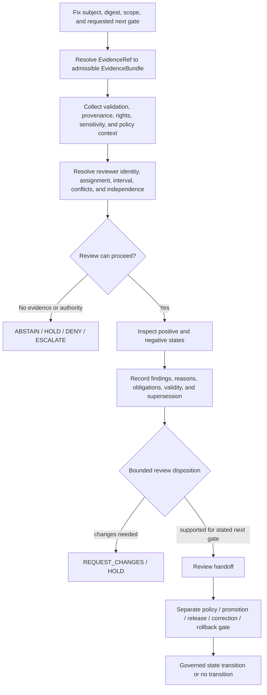

<!-- [KFM_META_BLOCK_V2]
doc_id: kfm://doc/governance/review-duties
title: Review Duties — Reviewer Roles and Separation-of-Duties Matrix
type: governance-guide
version: v2-draft
status: draft; repository-grounded; human-review-guidance; non-authoritative; no-release-effect
owners:
  - "@bartytime4life — verified CODEOWNERS review route only"
owner_status: "No accepted StewardshipAssignment, independent reviewer capacity, release authority, reviewer quorum, or approval is implied."
created: 2026-05-12
updated: 2026-08-23
policy_label: public
owning_root: docs/
responsibility: "Explain reviewer tasks, review evidence, role-separation triggers, ReviewRecord boundaries, and handoff requirements without defining object meaning, machine shape, policy, platform controls, release state, or publication authority."
truth_posture: "CONFIRMED repository evidence and accepted Directory Rules placement / PROPOSED role and separation model / CONFLICTED ReviewRecord schema surfaces / UNKNOWN operational review and release authority / NEEDS VERIFICATION platform enforcement and human assignments; cite-or-abstain"
evidence_snapshot:
  repository: bartytime4life/Kansas-Frontier-Matrix
  base_ref: main
  base_commit: f168b18291462da10b8b8d52459c85a10c225875
  target_prior_blob: 81893e0f6ba03f7b00311722c70d54dd283003b1
  directory_rules_blob: fd49a0b83e55cef52c1124281f093e263526898d
  directory_rules_decision: ADR-0029 accepted
  adr_0024_status: draft source / effective decision proposed
  codeowners_blob: dd2a84aa514d8ecd9208bc347f90f9a2ed37dd61
  review_record_contract_blob: 9641345d1e5d939dc59687a900e60a563d92c4f0
  governance_review_schema_blob: fe2f2223af46481e7fb19b0baa94f62ce9c6c855
  alternate_review_schema_blob: a053448d68e8379b92b12a16e6528275b975433c
  review_record_validator_blob: a26f10fa18edaf7b2d2e3bf499e233c05f3007cd
  review_authority_binding_contract_blob: f156e100660e9fd97ca95e90092143a3cd6d62ee
  sensitive_release_review_contract_blob: 235ca86dd807c6842ca8c861f995371fe7758f64
  release_reviews_readme_blob: bf3058a5af8fc85aa04a25a36ed03541cd9eb657
inspection_boundary: >-
  Current-session GitHub reads of the target, accepted Directory Rules decision and bytes,
  governance landing page, ADR-0024, CODEOWNERS, ReviewRecord and StewardshipAssignment
  contracts, both ReviewRecord schema candidates, fixture-only ReviewRecord validator,
  ReviewAuthorityBinding, SensitiveReleaseReviewClosure, release-review guidance, and
  review-proof guidance. No actor was authenticated, no assignment was accepted, no live
  policy bundle was evaluated, no governed review or release record was issued, and no
  promotion, release, deployment, publication, correction, withdrawal, or rollback was
  exercised.
related:
  - ./README.md
  - ./STEWARD_CHARTERS.md
  - ./SEPARATION_OF_DUTIES.md
  - ./ESCALATION.md
  - ./CONTRADICTION_HANDLING.md
  - ../doctrine/directory-rules.md
  - ../adr/ADR-0029-adopt-directory-governance-standard-v2.md
  - ../adr/ADR-0024-steward-separation-of-duties-for-release.md
  - ../registers/DRIFT_REGISTER.md
  - ../registers/VERIFICATION_BACKLOG.md
  - ../../contracts/governance/ReviewRecord.md
  - ../../contracts/governance/steward_assignment.md
  - ../../contracts/governance/review_authority_binding.md
  - ../../contracts/governance/sensitive_release_review_closure.md
  - ../../schemas/contracts/v1/governance/review_record.schema.json
  - ../../schemas/contracts/v1/review/review_record.schema.json
  - ../../tools/validators/validate_review_record.py
  - ../../tools/validators/governance/validate_review_authority_binding.py
  - ../../tools/validators/governance/validate_sensitive_release_review_closure.py
  - ../../release/reviews/README.md
  - ../../data/proofs/review/README.md
  - ../../.github/CODEOWNERS
tags: [kfm, governance, review, reviewer-duties, separation-of-duties, ReviewRecord, evidence, release, correction, rollback]
notes:
  - "v2-draft is a same-path documentation-only reconciliation against current repository evidence."
  - "ADR-0029 is accepted and confirms the docs/ responsibility root; this update creates no path or authority home."
  - "ADR-S-09 is retained only as historical source-lineage vocabulary. ADR-0024 is the current numbered decision record and remains proposed."
  - "The document records but does not resolve the two ReviewRecord schema candidates, contract/schema vocabulary drift, or schema-to-contract casing mismatch."
  - "No contract, schema, policy, fixture, validator, workflow, platform setting, review record, release record, or published artifact changes."
[/KFM_META_BLOCK_V2] -->

<a id="top"></a>

# Review Duties — Reviewer Roles and Separation-of-Duties Matrix

> **Human review guidance for KFM.** This document explains what a reviewer must inspect, which role separations are proposed for material transitions, what evidence a review handoff should carry, and how review supports—but never replaces—policy, promotion, release, correction, or rollback.

[](#2-doctrinal-basis)
[](../adr/ADR-0029-adopt-directory-governance-standard-v2.md)
[](../adr/ADR-0024-steward-separation-of-duties-for-release.md)
[](#6-the-reviewrecord-contract)
[](#62-bounded-executable-profiles)
[](#8-maturity-model--the-tooling-threshold-adr-0024)
[](#13-maintainer-verification--rollback)

> [!IMPORTANT]
> **Review is support for a later governed decision, not the decision itself.** A document, comment, `ReviewRecord`, schema-valid fixture, validator `PASS`, `BOUND` report, `CLOSED_FOR_SEPARATE_RELEASE_GATE` report, workflow result, CODEOWNERS match, pull request, or merge does not by itself authorize promotion, release, deployment, publication, correction, withdrawal, rollback, or public use.

> [!WARNING]
> **Current authority is bounded.** The repository contains substantive review-related contracts, schema candidates, fixtures, validators, tests, workflows, proof guidance, and release-review guidance. It does not establish an accepted reviewer roster, authenticated actor identity, independent reviewer capacity, executable release-review policy, governed parent-level release `ReviewRecord`, or operational release authority.

> [!CAUTION]
> **Do not choose a ReviewRecord authority by prose.** Two schema candidates are present, their maturity differs, the richer semantic contract does not match either machine vocabulary exactly, and one schema points to the wrong case-sensitive contract path. This document records that conflict and fails closed; it does not select or normalize a canonical profile.

| Field | Current bounded value |
|---|---|
| **Document status** | `draft` human-facing governance guidance |
| **Tracked path** | `docs/governance/REVIEW_DUTIES.md` — **CONFIRMED** repository-present, same-path update |
| **Placement authority** | Accepted [`ADR-0029`](../adr/ADR-0029-adopt-directory-governance-standard-v2.md) and adopted [`directory-rules.md`](../doctrine/directory-rules.md) place human explanation under `docs/` |
| **Detailed release-SoD decision** | [`ADR-0024`](../adr/ADR-0024-steward-separation-of-duties-for-release.md) is source status `draft`, effective decision status `proposed` |
| **Repository review route** | [`@bartytime4life`](../../.github/CODEOWNERS) through CODEOWNERS; routing is not stewardship, independence, approval, or release authority |
| **ReviewRecord meaning** | Draft semantic contract at [`contracts/governance/ReviewRecord.md`](../../contracts/governance/ReviewRecord.md) |
| **ReviewRecord machine shape** | **CONFLICTED:** one concrete proposed governance schema plus one permissive proposed review scaffold |
| **Bounded executable support** | Fixture-only ReviewRecord Gate G validation, `ReviewAuthorityBinding`, and T3/T4 `SensitiveReleaseReviewClosure` |
| **Governed review instances** | Parent release-review and review-proof lanes remain guidance/support surfaces; no operational parent-level review record is established here |
| **Operational review / release authority** | `HOLD` / `UNKNOWN` |
| **Release, deployment, publication effect** | None |
| **Last updated** | 2026-08-23 against `main@f168b18291462da10b8b8d52459c85a10c225875` |

---

## Contents

1. [Purpose & scope](#1-purpose--scope)
2. [Doctrinal basis](#2-doctrinal-basis)
3. [Reviewer roles](#3-reviewer-roles)
4. [Separation-of-Duties matrix](#4-separation-of-duties-matrix)
5. [Review flow at a glance](#5-review-flow-at-a-glance)
6. [The `ReviewRecord` contract](#6-the-reviewrecord-contract)
7. [Sensitivity-tier transitions (cross-reference)](#7-sensitivity-tier-transitions-cross-reference)
8. [Maturity model & the tooling threshold](#8-maturity-model--the-tooling-threshold-adr-0024)
9. [How to invoke a review](#9-how-to-invoke-a-review)
10. [Drift patterns & anti-patterns](#10-drift-patterns--anti-patterns)
11. [Related docs](#11-related-docs)
12. [Open questions & NEEDS VERIFICATION](#12-open-questions--needs-verification)
13. [Maintainer verification & rollback](#13-maintainer-verification--rollback)
14. [Appendix A — no-loss modernization ledger](#appendix-a--no-loss-modernization-ledger)

---

## 1. Purpose & scope

`docs/governance/REVIEW_DUTIES.md` is the human-facing guide for conducting and handing off a KFM review. It answers five questions:

1. **What exact subject and next transition are being reviewed?**
2. **Which evidence, validation, policy, rights, sensitivity, release, correction, and rollback context must be inspected?**
3. **Which reviewer role is acting, and when must the reviewer be independent from the author or producer?**
4. **What finite finding or disposition should be recorded without overclaiming authority?**
5. **Which separate gate owns the next state transition?**

### This document can establish

- the current proposed reviewer-role vocabulary;
- a risk-scaled working matrix for review participation;
- the minimum evidence packet a reviewer should require;
- the current repository relationship among review documentation, contracts, schemas, fixtures, validators, proofs, release records, and platform routing;
- the fail-closed posture when identity, authority, evidence, policy, sensitivity, rights, correction, or rollback is unresolved;
- how a review should be refreshed, superseded, corrected, or invalidated.

### This document cannot establish

- that a person, team, or service has an accepted `StewardshipAssignment`;
- that a GitHub account is an authenticated KFM actor for a governed decision;
- that a reviewer is independent, conflict-free, current, or authorized;
- that one ReviewRecord schema candidate is canonical;
- that policy evaluated a live subject;
- that an approving review permits promotion, release, deployment, publication, correction, withdrawal, rollback, or public use;
- that current platform settings enforce the proposed separation model;
- that a generated explanation, map, tile, graph, model output, or AI response is evidence or review authority.

### Responsibility boundary

| Responsibility | Owning surface | Relationship to this document |
|---|---|---|
| Human reviewer tasks, questions, handoff, and anti-patterns | `docs/governance/` | **Owned here** |
| Object meaning | `contracts/` | Referenced; not redefined |
| Machine shape | `schemas/` | Referenced; conflicts disclosed |
| Admission and release evaluation | `policies/` / `policy/` and release controls | Separate authority |
| Executable validation | `tools/validators/`, `tests/`, workflows | Bounded evidence only |
| Review-support proof objects | `data/proofs/review/` | Separate object family and maturity |
| Release review instances | `release/reviews/` | Separate release-control lane |
| GitHub routing and repository controls | `.github/` and platform settings | Routing/enforcement; not KFM review authority |
| Promotion, release, publication, correction, rollback | Governed state-transition objects and controls | Never conferred by this guide |

[Back to top](#top)

---

## 2. Doctrinal basis

### 2.1 Authority order

| Layer | Current source | Effect here | Status |
|---|---|---|---|
| Operating law | Separate policy-significant release duties when maturity justifies it | Governing trust posture | **CONFIRMED doctrine** |
| Directory authority | [`ADR-0029`](../adr/ADR-0029-adopt-directory-governance-standard-v2.md) and adopted [`directory-rules.md`](../doctrine/directory-rules.md) | Confirms `docs/` responsibility and same-path update | **ACCEPTED** |
| Detailed release-SoD decision | [`ADR-0024`](../adr/ADR-0024-steward-separation-of-duties-for-release.md) | Defines the current proposed decision surface for identity, independence, bindings, and maturity | **PROPOSED** |
| Human guidance | This document, [`STEWARD_CHARTERS.md`](./STEWARD_CHARTERS.md), and [`SEPARATION_OF_DUTIES.md`](./SEPARATION_OF_DUTIES.md) | Review procedure and role design | **DRAFT / PROPOSED** |
| Machine semantics and shape | Review contracts and schema candidates | Inputs to implementation | **DRAFT / PROPOSED / CONFLICTED** |
| Executable profiles | Fixture-only validators and tests | Bounded structural/semantic evidence | **CONFIRMED present; non-authoritative** |
| Operational authority | Accepted assignments, authenticated actors, policy, release control, platform enforcement | Would govern live decisions | **UNKNOWN / HOLD** |

The historical `ADR-S-09` and `ADR-S-05` labels in the prior edition are source-lineage vocabulary, not verified current ADR paths. Use ADR-0024 for the current numbered separation decision. This documentation update does not accept it.

### 2.2 Evidence rules for review

A reviewer must keep these classes distinct:

- **Evidence** supports or limits claims.
- **Validation** establishes bounded conformance to a named profile.
- **Policy** evaluates admissibility, rights, sensitivity, access, or release conditions.
- **Review** records human or governed assessment of a fixed subject and scope.
- **Promotion and release** change lifecycle or exposure state through separate authority.
- **Receipts** record what ran; they are not automatically proof.
- **Proofs** support closure; they are not release decisions.
- **GitHub approval** is repository workflow evidence; it is not automatically a KFM governance approval.

A commit proves that bytes exist at a commit. A merge does not prove architecture, runtime behavior, policy compliance, deployment, release, or publication.

### 2.3 Current repository determination

**CONFIRMED:** review-related documentation, contracts, schemas, validators, fixtures, tests, workflows, proof guidance, release-review guidance, and CODEOWNERS routing exist.

**PROPOSED:** the eight-role catalogue, action-by-action separation matrix, sensitivity participation rules, and maturity threshold.

**CONFLICTED:** ReviewRecord schema home, schema maturity, contract/schema vocabulary, and one case-sensitive contract reference.

**UNKNOWN / HOLD:** authenticated reviewer identity, accepted assignments, reviewer independence, recusal handling, live policy coupling, operational release authority, parent-level governed release review records, and public-safe review projection.

[Back to top](#top)

---

## 3. Reviewer roles

The roles below are **PROPOSED responsibility labels**, not verified teams, jobs, or staffed positions. One person may hold several labels in a small project, but that does not prove independence for a material decision. Every record must state the role being exercised.

| Role | Proposed responsibility | Typical subjects | Cannot establish alone |
|---|---|---|---|
| **Source steward** | Source admission, role, rights intake, cadence, and initial sensitivity posture | `SourceDescriptor`, source-family admission | Unresolved rights, sovereignty, or sensitive-source release |
| **Domain steward** | Domain meaning, contracts, validators, and domain-scoped quality | Domain objects, validation reports, transforms | Public release or policy override |
| **Sensitivity reviewer** | Redaction, generalization, withholding, tier, and harmful-precision review | Sensitive geometry, living-person, archaeology, rare-species, infrastructure, genomic data | Release authority or rights-holder consent |
| **Rights-holder representative** | Sovereignty, cultural heritage, consent, licensed use, and community authority | Archaeology, sovereign/community data, living-person and DNA contexts | Technical validation or release alone |
| **Release authority** | Separate decision for PUBLISHED transition and rollback authorization | Release candidate, manifest, public-safe carrier | Evidence creation, policy substitution, or self-approval where separation triggers |
| **Correction reviewer** | Post-publication correction, withdrawal, supersession, and rollback assessment | `CorrectionNotice`, withdrawal or rollback proposal | Silent rewrite of published state |
| **AI surface steward** | Focus Mode templates, policy bindings, citation behavior, and `AIReceipt` audit | AI/public interpretation surfaces | Truth, evidence, policy, release, or model self-approval |
| **Docs steward** | Governance docs, ADR/index integrity, drift and supersession documentation | `docs/`, indexes, registers, doctrine editions | Contract/schema/policy/release authority by documentation alone |

### 3.1 Eligibility and independence

A reviewer is eligible only when all required facts are verified for the exact subject and interval:

- stable actor identity and relevant aliases;
- current, scoped, accepted assignment or other accepted authority basis;
- role and jurisdiction covering the subject and requested next step;
- effective interval including the review time;
- independence from the author, producer, proposer, or detector where required;
- disclosed conflicts, recusals, delegations, and exceptions;
- access to the evidence and protected context needed to review safely.

Different GitHub usernames are not sufficient proof of independent actors. A CODEOWNERS match is routing evidence, not a `StewardshipAssignment`. Missing identity, assignment, independence, or conflict evidence produces `HOLD`, `ABSTAIN`, or `DENY` according to the governing profile; it does not produce assumed approval.

[Back to top](#top)

---

## 4. Separation-of-Duties matrix

> [!IMPORTANT]
> The matrix is **PROPOSED design guidance** pending an accepted decision and operational authority bindings. It must not be presented as current platform enforcement. Loosening a sensitive or publication-bearing row requires an ADR-class decision and renewed risk review.

| # | Governed action | May author also approve? | Proposed required participation | Minimum review evidence |
|---|---|---|---|---|
| 1 | Source admission (`— → RAW`) | Routine: possibly; unresolved rights/sensitivity: **No** | Source steward; rights-holder representative and sensitivity reviewer when triggered | Source identity, role, terms, rights, sensitivity, intended use, authority basis |
| 2 | Normalization (`RAW → WORK/QUARANTINE`) | Routine: possibly; sensitivity-relevant transform: **No** | Domain steward; sensitivity reviewer when transform affects exposure | Input/output digests, transform spec, validation, withheld fields, rollback/replay path |
| 3 | Validator authorship and run | Yes for deterministic routine profiles | Domain steward; independent audit according to risk | Validator version, fixtures, negative tests, execution receipt, limits |
| 4 | Promotion to `PROCESSED` or `CATALOG/TRIPLET` | Routine non-sensitive: possibly; sensitive lane: **No** | Domain steward plus sensitivity reviewer when triggered | Evidence closure, validation, provenance, policy posture, correction path |
| 5 | Release to `PUBLISHED` | **No when materiality applies** | Author/producer distinct from release authority; rights-holder representative when applicable | Fixed release subject, policy decision, review record, proof/receipt closure, rollback target |
| 6 | Sensitive-lane release | **No — always separate** | Sensitivity reviewer plus release authority; rights-holder representative where applicable | Public-safe transformation, rights/consent, independent review, negative tests, rollback/correction |
| 7 | Correction, withdrawal, or rollback | **No when steward-significant** | Detector/author distinct from correction reviewer; release authority for public-state change | Prior state, defect evidence, blast radius, replacement/rollback target, cache/invalidation plan |
| 8 | AI template or policy-binding change | **No** | AI surface steward plus relevant docs/policy/domain reviewer | Evidence/citation behavior, denied/abstain tests, prompt-injection posture, public-safe output contract |
| 9 | Atlas, doctrine, or governance-standard publication | **No** | Docs steward plus relevant subsystem owner; ADR where authority or duties change | Source ledger, change impact, contradiction check, supersession and rollback plan |

### 4.1 Materiality triggers

Require separate approval when a change can materially affect:

- public exposure, source admission, lifecycle state, or release state;
- evidence meaning, contract/schema interpretation, policy, or authority;
- rights, consent, sovereignty, cultural sensitivity, living-person or genomic data;
- exact or harmful spatial precision, archaeology, rare species, infrastructure, or private land/title information;
- AI/public-surface behavior, citation closure, denial/abstention, or model authority;
- correction, withdrawal, rollback, cache invalidation, or published lineage;
- trust roots, signing, identity, reviewer assignment, platform enforcement, or auditability.

### 4.2 Bootstrap exception posture

When no independent capacity exists, KFM may transparently record a bootstrap limitation only through an accepted, scoped, time-bounded decision. The absence of capacity is not permission to fabricate independence or collapse duties. High-risk transitions remain held unless an accepted exception explicitly authorizes the bounded action and preserves correction and rollback.

[Back to top](#top)

---

## 5. Review flow at a glance


```mermaid
flowchart TD
    A[Fix subject, digest, scope, and requested next gate] --> B[Resolve EvidenceRef to admissible EvidenceBundle]
    B --> C[Collect validation, provenance, rights, sensitivity, and policy context]
    C --> D[Resolve reviewer identity, assignment, interval, conflicts, and independence]
    D --> E{Review can proceed?}
    E -->|No evidence or authority| F[ABSTAIN / HOLD / DENY / ESCALATE]
    E -->|Yes| G[Inspect positive and negative states]
    G --> H[Record findings, reasons, obligations, validity, and supersession]
    H --> I{Bounded review disposition}
    I -->|changes needed| J[REQUEST_CHANGES / HOLD]
    I -->|supported for stated next gate| K[Review handoff]
    K --> L[Separate policy / promotion / release / correction / rollback gate]
    L --> M[Governed state transition or no transition]
```

### 5.1 Minimum review packet

A review request should contain:

- `subject_ref`, stable identity, version, digest, and immutable locator;
- review scope, exclusions, significance, audience, and requested next gate;
- author/producer/proposer identities and roles;
- evidence references and resolved bundle status;
- source role, provenance, time, geography, integrity, and known limitations;
- validation profile, results, negative tests, and execution receipts;
- policy, rights, sensitivity, access, and public-safe transformation status;
- reviewer role required, assignment basis, independence trigger, conflicts, and effective interval;
- correction, withdrawal, supersession, rollback, and invalidation targets;
- open obligations, owners, deadlines, and re-review triggers.

A reviewer must not reconstruct critical context from scattered comments when a stable packet can be supplied.

### 5.2 Finite review finding versus later authority

A review may say that the subject is supported for a named **next gate**. It must not say the subject is published, released, authoritative, policy-compliant, or deployed unless the separate governing artifact proves that state.

[Back to top](#top)

---

## 6. The `ReviewRecord` contract

### 6.1 Semantic meaning

The draft [`ReviewRecord` contract](../../contracts/governance/ReviewRecord.md) describes an append-only, subject-bound review event. Its central anti-collapse rule is sound: a review record is not evidence, policy, promotion, release, correction, rollback, or publication authority.

The semantic contract is richer than either inspected machine candidate. It discusses review subject, scope, reviewer identity and role, disposition, findings, obligations, validity, supersession, and protected details. Those semantics remain draft and must not be treated as accepted machine shape.

### 6.2 Current schema conflict

| Surface | Verified shape | Maturity | Conflict / limitation |
|---|---|---|---|
| [`schemas/contracts/v1/governance/review_record.schema.json`](../../schemas/contracts/v1/governance/review_record.schema.json) | Concrete strict object; required identity, subject, reviewer role, decision, findings, timestamp; closed additional properties | **PROPOSED** | Uses a narrow role/decision vocabulary, does not express the full semantic contract, and points to a lowercase contract path that does not match tracked `ReviewRecord.md` casing |
| [`schemas/contracts/v1/review/review_record.schema.json`](../../schemas/contracts/v1/review/review_record.schema.json) | Empty/permissive scaffold with additional properties allowed | **PROPOSED scaffold** | Does not provide operational ReviewRecord validation and overlaps the governance candidate |
| [`contracts/governance/ReviewRecord.md`](../../contracts/governance/ReviewRecord.md) | Rich semantic and lifecycle guidance | **DRAFT** | Vocabulary and fields are not synchronized with either schema candidate |

**Required posture:** `CONFLICTED / HOLD`. Do not select, merge, alias, or migrate a candidate through this document. Resolution requires a scoped authority decision, compatibility analysis, synchronized contract/schema/index changes, positive and negative fixtures, consumer inventory, migration notes, and rollback.

### 6.3 Bounded executable profiles

The repository contains executable support, but each profile has a narrow claim:

| Profile | What it checks | What it does not prove |
|---|---|---|
| [`validate_review_record.py --fixtures`](../../tools/validators/validate_review_record.py) | Synthetic Gate G binding: exact subject/scope/spec/artifact, identity separation projection, declarations, authority interval, freshness/supersession, approval state, and open obligations | Actor authentication, accepted assignment, live policy, release authority, public release, or publication |
| [`ReviewAuthorityBinding`](../../contracts/governance/review_authority_binding.md) + validator | Deterministic fixture-only agreement among subject identity, reviewer identity, role, scope, authority interval, and separation result | Authority grant, repository write permission, approval, promotion, release, or publication |
| [`SensitiveReleaseReviewClosure`](../../contracts/governance/sensitive_release_review_closure.md) + validator | Fixture-only T3/T4 reviewer-set closure and independence for a named subject | Release decision; its positive outcome is explicitly `CLOSED_FOR_SEPARATE_RELEASE_GATE` |

The current ReviewRecord validator reports finite `PASS`, `ABSTAIN`, `DENY`, or `ERROR` outcomes and marks output non-authoritative. A passing fixture is validation evidence, not a governed review instance.

### 6.4 Record precedence and obligations

Until the schema conflict is resolved:

1. preserve source payloads and reports without lossy conversion;
2. state which exact profile produced each record;
3. never translate a richer disposition into a narrower enum silently;
4. treat open obligations as blocking the named trust-bearing next gate;
5. renew review when subject bytes, support, policy, assignment, scope, or requested transition changes;
6. preserve supersession and correction lineage rather than rewriting history.

[Back to top](#top)

---

## 7. Sensitivity-tier transitions (cross-reference)

The prior edition used a proposed T0–T4 tier schedule. Current repository evidence inspected for this update confirms a **fixture-only T3/T4 sensitive-release closure profile**, not an accepted universal tier model or operational release gate. Therefore:

- retain T0–T4 only as proposal lineage where another current contract explicitly uses it;
- do not infer a tier from a domain name alone;
- do not generalize the T3/T4 fixture profile into live release authority;
- require rights, sovereignty, consent, sensitivity, harmful-precision, and public-safe transformation review whenever those concerns are present, regardless of label;
- fail closed when the tier/profile, reviewer set, authority interval, or public-safe transformation is unresolved.

### 7.1 Sensitive review minimum

A sensitive review packet must additionally identify:

- protected subject and exact sensitivity trigger;
- source terms, consent, sovereignty, cultural/community authority, or rights-holder basis;
- internal versus public geometry or attribute representation;
- redaction, aggregation, generalization, delay, withholding, or denial transform;
- transform receipt and evidence that sensitive values cannot be reconstructed through ordinary public paths;
- authorized reviewer set and independence evidence;
- expiry, re-review, correction, withdrawal, rollback, cache, and downstream invalidation behavior.

Client-side hiding, style filters, obscured labels, or UI-only controls are not adequate protection for sensitive data.

[Back to top](#top)

---

## 8. Maturity model & the tooling threshold (ADR-0024)

This ladder separates documentation maturity from operational authority.

| Level | Evidence required | Allowed claim | Prohibited inference |
|---|---|---|---|
| **L0 — guidance** | Human docs and proposed role matrix | Review design exists | Roles are staffed or enforced |
| **L1 — shape** | Contract/schema candidate, registry/index, fixtures | A candidate machine profile exists | Candidate is canonical or authoritative |
| **L2 — bounded execution** | Deterministic validator, positive/negative fixtures, tests, non-authoritative report | A named fixture profile validates | Live actor, policy, release, or publication authority |
| **L3 — identity and assignment** | Canonical actor identity, accepted scoped assignments, intervals, recusal/conflict handling | Reviewer eligibility can be evaluated | Platform or release enforcement |
| **L4 — platform enforcement** | Verified CODEOWNERS/ruleset/branch/policy coupling, anti-bypass tests, audit trail | Required participation is enforced for named repository operations | KFM release/publication unless release controls are also closed |
| **L5 — governed release integration** | Parent-level review records, policy evaluation, release manifests, signer custody, correction/rollback drills, operations evidence | A reviewed release path is operational for a named profile | Universal authority outside that profile |

### 8.1 Current bounded level

- **CONFIRMED:** L0 documentation and parts of L1/L2 exist.
- **CONFIRMED bounded:** fixture-only ReviewRecord, authority-binding, and sensitive-review closure validators provide L2 evidence for their named profiles.
- **UNKNOWN / HOLD:** L3 authenticated identity, accepted assignments, conflict/recusal handling, and independent capacity.
- **NEEDS VERIFICATION:** current L4 platform settings and exact required-check coupling.
- **UNKNOWN / HOLD:** L5 parent-level release review, operational policy/release authority, signer custody, public release, and rollback drill.

### 8.2 Tooling threshold

ADR-0024 is the current proposed decision record for moving from custom/manual separation toward verifiable identity, authority binding, platform controls, and operational release integration. Until an accepted decision and its dependencies close:

- documentation remains guidance;
- fixture validators remain bounded evidence;
- platform review is not represented as KFM release authority;
- material and sensitive release transitions remain held when independent authority cannot be proven.

[Back to top](#top)

---

## 9. How to invoke a review

### 9.1 Review request template

```yaml
review_request:
  subject_ref: "<stable subject identifier>"
  subject_version: "<version or commit>"
  subject_digest: "sha256:<digest>"
  requested_next_gate: "<validation|promotion|release|correction|rollback|other>"
  scope:
    included: []
    excluded: []
  author_or_producer_refs: []
  evidence_refs: []
  validation_report_refs: []
  policy_decision_refs: []
  rights_and_sensitivity_refs: []
  required_reviewer_roles: []
  independence_triggers: []
  correction_and_rollback_refs: []
  open_obligations: []
  review_profile: "<exact accepted or proposed profile identifier>"
```

The template is human guidance, not a new contract. Use an accepted machine profile when one exists.

### 9.2 Procedure

1. **Freeze the subject.** Record stable identity, exact bytes/version, digest, and immutable locator.
2. **Name the next gate.** Review cannot be unbounded or imply later transitions.
3. **Classify significance.** Identify public exposure, sensitivity, rights, sovereignty, AI/public-surface, correction, rollback, and trust-root impact.
4. **Resolve support.** Inspect evidence, validation, policy, source role, provenance, integrity, correction, and rollback references.
5. **Resolve reviewer eligibility.** Verify canonical identity, current assignment, scope, effective interval, independence, and conflicts.
6. **Review negative states.** Test missing evidence, denied policy, stale review, wrong subject, wrong digest, open obligations, unsafe precision, and absent rollback.
7. **Record findings.** Use stable, public-safe reason codes plus bounded human explanation.
8. **Choose a truthful disposition.** Do not coerce the result into a schema that cannot represent it.
9. **Close or carry obligations.** Conditional approval remains blocked until conditions are independently verified and referenced.
10. **Hand off to the separate gate.** Policy, promotion, release, correction, withdrawal, and rollback remain independently accountable.
11. **Preserve audit and reversal.** Record validity, supersession, correction, and rollback relationships.

### 9.3 Human workflow outcomes

These are guidance outcomes, not a new machine enum. Map them only through an accepted contract/schema/profile.

| Outcome | Use |
|---|---|
| **APPROVE_FOR_STATED_NEXT_GATE** | Bounded review is favorable for the named next step only |
| **APPROVE_WITH_CONDITIONS / HOLD** | Conditions exist; next trust-bearing gate remains blocked |
| **REQUEST_CHANGES** | Defects must be repaired and re-reviewed |
| **ABSTAIN** | Evidence, context, authority, or independence is insufficient |
| **DENY** | Scoped action is unsupported, unsafe, impermissible, or out of policy |
| **ESCALATE** | A different steward, rights-holder, authority, or incident path must decide |
| **INFORMATIONAL** | Context recorded with no approval effect |
| **ERROR** | Input, identity, schema, validator, or system state prevents a reliable review |

### 9.4 Refresh and invalidation triggers

Renew review when any material item changes:

- subject bytes, version, identity, digest, scope, audience, or requested next step;
- evidence, source role, validation, policy, rights, sensitivity, or precision;
- reviewer identity, role, assignment, conflict, or effective interval;
- obligations, release candidate, manifest, correction, withdrawal, or rollback target;
- public carrier, API/UI projection, map layer, AI behavior, or caching/invalidation plan;
- governing ADR, contract, schema, policy, validator, or release gate.

A prior review may remain historical evidence; it must not silently authorize the changed subject.

[Back to top](#top)

---

## 10. Drift patterns & anti-patterns

### 10.1 Current drift and conflict register

| Item | Current evidence | Required posture |
|---|---|---|
| ReviewRecord schema home | Governance and review schema candidates both exist | **CONFLICTED**; select none without ADR/migration |
| Review schema maturity | Governance candidate is concrete; review candidate is empty/permissive | Do not claim equivalent validation |
| Contract/schema casing | Governance schema points to lowercase contract path; tracked contract uses `ReviewRecord.md` | Repair through a scoped compatibility/migration change |
| Disposition vocabulary | Semantic contract and strict schema enums differ | Do not coerce outcomes |
| Historical ADR links | Prior doc linked untracked ADR-S-09 and ADR-S-05 paths | Preserve as lineage only; use current numbered ADRs |
| Steward staffing | CODEOWNERS routes to one verified account; no accepted assignments inspected | Do not infer eight staffed roles or independence |
| Release review lane | Guidance exists; no parent-level governed ReviewRecord established | `HOLD` operational claim |
| Review-proof lane | README-only at its evidence snapshot; no accepted payload/profile producer | Do not treat proof guidance as proof |
| Platform enforcement | Current settings were not independently reverified for this update | `NEEDS VERIFICATION` |
| Sibling governance docs | Several remain older proposal-era editions | Reconcile separately; do not silently rewrite through this file |

### 10.2 Anti-patterns

- **Documentation as enforcement.** A polished duty matrix does not authenticate actors or block a release.
- **CODEOWNERS as stewardship.** Path routing is not a current, scoped, accepted `StewardshipAssignment`.
- **Account inequality as independence.** Two usernames do not prove distinct actors, roles, authority chains, or conflicts.
- **Schema-valid as reviewed.** Shape validity does not prove the event, evidence, reviewer, or finding.
- **Validator `PASS` as approval.** Bounded executable evidence is not authority.
- **`BOUND` as release permission.** Structural agreement is only an input to later gates.
- **`CLOSED_FOR_SEPARATE_RELEASE_GATE` as release closure.** The name explicitly preserves a separate gate.
- **Conditional approval as unconditional.** Open obligations block the next trust-bearing action.
- **Review as policy or evidence.** Reviewer judgment replaces neither `PolicyDecision` nor `EvidenceBundle`.
- **Review as promotion or release.** `ReviewRecord` is not `PromotionDecision` or `ReleaseManifest`.
- **Merge as publication.** Git history does not change KFM release state.
- **Generated language as reviewer.** AI may summarize evidence and propose findings; it may not self-approve.
- **Silent schema selection.** Do not pick the permissive or strict candidate without an authority and migration decision.
- **Stale review reuse.** Changed subject, support, assignment, or policy requires renewed review.
- **Hidden protected reasons.** Public review records must not leak sensitive payloads or control-defeating detail.
- **Invented teams or private rosters.** Unverified identities remain `UNKNOWN`.
- **Comment-only approval.** Platform comments may be basis evidence but do not replace a governed record when one is required.
- **Reviewer shopping.** An abstention, denial, conflict, or expired assignment cannot be bypassed by searching for an easier approver.
- **Smoothing contradictions.** Preserve conflicting findings, evidence, severity, and disposition until governed resolution.

[Back to top](#top)

---

## 11. Related docs

| Surface | Relationship | Current bounded posture |
|---|---|---|
| [`docs/governance/README.md`](./README.md) | Governance landing page and responsibility map | Repository-grounded draft |
| [`docs/doctrine/directory-rules.md`](../doctrine/directory-rules.md) | Human Directory Rules authority adopted by ADR-0029 | Accepted exact bytes |
| [`ADR-0029`](../adr/ADR-0029-adopt-directory-governance-standard-v2.md) | Placement authority | Accepted |
| [`ADR-0024`](../adr/ADR-0024-steward-separation-of-duties-for-release.md) | Proposed release-review identity, independence, and control-maturity decision | Proposed |
| [`STEWARD_CHARTERS.md`](./STEWARD_CHARTERS.md) | Proposed role charters | Older draft; staffing unverified |
| [`SEPARATION_OF_DUTIES.md`](./SEPARATION_OF_DUTIES.md) | Detailed authorship/approval separation guidance | Older draft/proposed; enforcement unverified |
| [`ESCALATION.md`](./ESCALATION.md) | Escalation triggers and closure guidance | Human guidance; not policy |
| [`CONTRADICTION_HANDLING.md`](./CONTRADICTION_HANDLING.md) | Conflicting findings and anti-smoothing posture | Separate current work may update it |
| [`ReviewRecord.md`](../../contracts/governance/ReviewRecord.md) | Review event semantic contract | Draft |
| [`steward_assignment.md`](../../contracts/governance/steward_assignment.md) | Assignment semantic contract | Draft |
| [`review_authority_binding.md`](../../contracts/governance/review_authority_binding.md) | Fixture-only structural binding | Proposed inactive; no authority |
| [`sensitive_release_review_closure.md`](../../contracts/governance/sensitive_release_review_closure.md) | Fixture-only T3/T4 review closure | Proposed inactive; no authority |
| [`governance/review_record.schema.json`](../../schemas/contracts/v1/governance/review_record.schema.json) | Concrete proposed ReviewRecord schema candidate | Partially shaped; conflicted |
| [`review/review_record.schema.json`](../../schemas/contracts/v1/review/review_record.schema.json) | Alternate permissive ReviewRecord scaffold | Proposed empty scaffold |
| [`validate_review_record.py`](../../tools/validators/validate_review_record.py) | Synthetic Gate G validator | Bounded; non-authoritative |
| [`validate_review_authority_binding.py`](../../tools/validators/governance/validate_review_authority_binding.py) | Structural binding validator | Fixture-only |
| [`validate_sensitive_release_review_closure.py`](../../tools/validators/governance/validate_sensitive_release_review_closure.py) | T3/T4 closure validator | Fixture-only |
| [`release/reviews/README.md`](../../release/reviews/README.md) | Release-review record lane guidance | Guidance only; no parent-level governed record established |
| [`data/proofs/review/README.md`](../../data/proofs/review/README.md) | Review-support proof lane | Proposed support; no payload/profile authority |
| [`.github/CODEOWNERS`](../../.github/CODEOWNERS) | GitHub review routing | One verified route; not stewardship or approval |
| [`DRIFT_REGISTER.md`](../registers/DRIFT_REGISTER.md) | Current-state drift tracking | Record material unresolved divergence |
| [`VERIFICATION_BACKLOG.md`](../registers/VERIFICATION_BACKLOG.md) | Checkable open work | Does not authorize implementation or release |

[Back to top](#top)

---

## 12. Open questions & NEEDS VERIFICATION

| Open item | Current status | Completion evidence |
|---|---|---|
| Accept, revise, or reject ADR-0024 | **PROPOSED** | Accepted/rejected ADR with review evidence |
| Choose canonical ReviewRecord schema/profile | **CONFLICTED / HOLD** | ADR or migration decision; synchronized contract/schema/index |
| Repair contract path casing | **NEEDS VERIFICATION** | Case-safe migration, links, tests |
| Reconcile semantic and machine disposition vocabularies | **CONFLICTED** | Closed vocabulary mapping plus positive/negative fixtures |
| Establish canonical actor identity and aliases | **UNKNOWN / HOLD** | Authenticated identity contract, registry, tests |
| Establish accepted scoped assignments | **UNKNOWN / HOLD** | Current `StewardshipAssignment` records with authority basis |
| Establish recusal and conflict handling | **UNKNOWN / HOLD** | Contract/policy, fixtures, audit path |
| Verify independent reviewer capacity | **UNKNOWN / HOLD** | Named current capacity without exposing private data |
| Reverify current platform approval and ruleset controls | **NEEDS VERIFICATION** | Current settings snapshot and exact-head test |
| Bind review to executable policy without collapsing roles | **UNKNOWN / HOLD** | Policy profile, test matrix, no-write dry run |
| Define governed ReviewRecord producer and instance home | **UNKNOWN / HOLD** | Accepted profile, writer, storage, retention, access, audit |
| Integrate review with real promotion/release | **UNKNOWN / HOLD** | Reviewed dry run, negative tests, no publication side effect |
| Define review expiry, invalidation, correction, and rollback propagation | **PROPOSED** | Contract, schema, fixtures, drill receipts |
| Define public-safe review projection | **UNKNOWN / HOLD** | Redaction rules, finite reasons, public-safe fixtures |
| Reconcile sibling governance documents | **NEEDS VERIFICATION** | Separate focused PRs; no authority collision |

No unchecked item is permission to infer the answer. Higher-risk transitions remain held.

[Back to top](#top)

---

## 13. Maintainer verification & rollback

### 13.1 Documentation validation

A valid update to this file should demonstrate:

- one H1 and one closed `KFM_META_BLOCK_V2`;
- repository-history-backed `created` and `updated` dates;
- preserved stable H1 and legacy section anchors;
- accepted ADR-0029 placement and accurate ADR-0024 status;
- links only to verified repository targets;
- explicit conflict rather than silent selection of ReviewRecord schema candidates;
- separation of documentation, contract, schema, policy, fixture, validator, proof, release, platform, and publication responsibility;
- no invented owner, team, assignment, policy pass, reviewer independence, release, deployment, or publication;
- no sensitive payload, private roster, credential, exact restricted location, hidden prompt, or protected reason text;
- balanced fences, valid Mermaid blocks, no trailing whitespace, and a final newline;
- remote diff limited to the intended path unless a direct dependency is explicitly added and justified.

### 13.2 Bounded executable checks

These commands validate their own current fixture profiles; they do not validate this prose as authority:

```bash
python tools/validators/validate_review_record.py --fixtures

python -m unittest discover \
  --start-directory tests/validators/governance \
  --pattern 'test_review_authority_binding.py' \
  --verbose
python tools/validators/governance/validate_review_authority_binding.py --fixtures

python -m pytest -q \
  tests/validators/governance/test_sensitive_release_review_closure.py
python tools/validators/governance/validate_sensitive_release_review_closure.py \
  --fixtures
```

A documentation-only pull request may rely on repository-hosted Markdown and governance checks for exact-head evidence. Green checks remain bounded to the checks they perform.

### 13.3 Review burden for this file

This is a one-file, same-path, reversible documentation reconciliation. Review should confirm:

- evidence snapshot and prior blob;
- preserved useful material from the prior edition;
- correction of stale no-repository and proposed-path claims;
- current ADR status;
- no silent ReviewRecord schema selection;
- no weakening of fail-closed, sensitivity, rights, correction, rollback, or publication boundaries;
- no adjacent contract, schema, policy, platform, release, or public-surface effect.

### 13.4 Rollback

**Documentation rollback target:** blob `81893e0f6ba03f7b00311722c70d54dd283003b1`.

Rollback procedure:

1. Revert the commit that changes `docs/governance/REVIEW_DUTIES.md`.
2. Confirm the prior blob is restored.
3. Re-run Markdown structure, link, metadata, and repository-hosted documentation checks.
4. Preserve the pull request, review findings, and reason for rollback.
5. Do not roll back or mutate contracts, schemas, fixtures, policy, proofs, release records, platform settings, or public state because this change did not alter them.

### 13.5 Non-effects

This update does not:

- accept ADR-0024 or any historical ADR-S proposal;
- create or modify a `ReviewRecord`, `StewardshipAssignment`, `PolicyDecision`, `PromotionDecision`, `ReleaseManifest`, `CorrectionNotice`, `WithdrawalNotice`, or `RollbackCard`;
- choose or migrate a ReviewRecord schema;
- authenticate an actor or prove independence;
- modify CODEOWNERS, branch/ruleset settings, workflows, validators, tests, fixtures, receipts, or proofs;
- activate a source, connector, model, API, UI, map layer, release, deployment, or publication path;
- change lifecycle state or public data.

[Back to top](#top)

---

## Appendix A — no-loss modernization ledger

| Prior material | v2 treatment | Reason |
|---|---|---|
| Stable H1, purpose, and thirteen-section navigation | **RETAINED** | Preserve links and reader orientation |
| Operating-law separation principle | **RETAINED / GROUNDED** | Core doctrine remains applicable |
| Eight reviewer-role catalogue | **RETAINED / RE-LABELED PROPOSED** | Useful design language; no staffing claim |
| Nine-row separation matrix | **RETAINED / NARROWED** | Preserves design intent while tying acceptance to ADR-0024 |
| Review-flow diagram | **REPLACED WITH REPOSITORY-GROUNDED FLOW** | Makes evidence, assignment, and separate gate explicit |
| ReviewRecord field guidance | **EXPANDED / CONFLICT-AWARE** | Current contract, two schemas, validator, and profile boundaries are now visible |
| T0–T4 sensitivity discussion | **RETAINED AS PROPOSAL LINEAGE / NARROWED** | Only T3/T4 fixture-profile scope was verified here |
| Maturity/custom-vs-tooling model | **REPLACED WITH L0–L5 EVIDENCE LADDER** | Separates docs, shape, identity, platform, release, and operations |
| Review invocation procedure | **EXPANDED** | Adds exact subject, evidence, authority, negative states, expiry, and rollback |
| Drift and anti-patterns | **EXPANDED** | Records current schema/casing/vocabulary conflicts and anti-collapse rules |
| Related-doc list | **UPDATED TO VERIFIED PATHS** | Removes nonexistent ADR links and adds current contract/schema/validator surfaces |
| Open questions | **EXPANDED** | Converts generic unknowns into concrete verification gates |
| Maintainer checklist and rollback | **EXPANDED / PINNED** | Provides exact prior blob and non-effects |
| Claims that repo depth was unknown and target path merely proposed | **SUPERSEDED** | Current-session GitHub evidence confirms the path and surrounding surfaces |
| Claim that known enforcement was only custom | **SUPERSEDED / NARROWED** | Bounded executable profiles exist, but operational authority remains held |

<p align="right"><a href="#top">Back to top</a></p>
