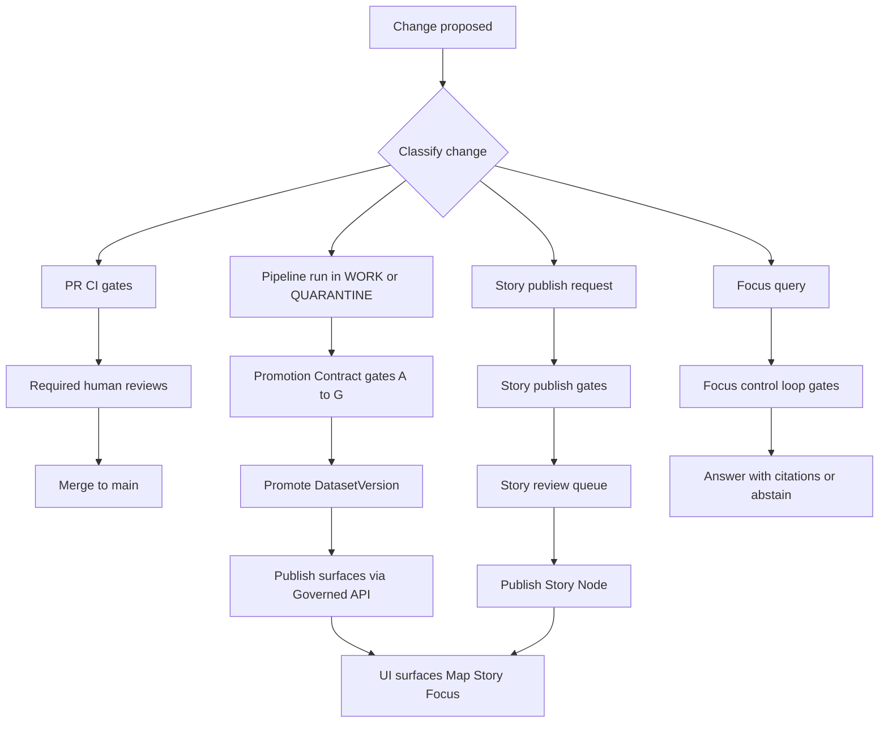

<!-- [KFM_META_BLOCK_V2]
doc_id: kfm://doc/3a1f2dbe-0d89-4bf0-9c5b-4e2e98a2f0f1
title: Review Gates
type: standard
version: v1
status: draft
owners: KFM Governance (Stewards)
created: 2026-03-02
updated: 2026-03-02
policy_label: public
related:
  - docs/governance/POLICY_LABELS.md        # TODO: confirm path
  - docs/governance/PROMOTION_CONTRACT.md  # TODO: confirm path
  - docs/governance/STORY_REVIEW.md        # TODO: confirm path
  - docs/governance/AUDIT_LEDGER.md        # TODO: confirm path
tags: [kfm, governance, review-gates, ci, promotion, evidence]
notes:
  - Fail-closed review gates for code, policy, data promotion, Story publishing, and Focus Mode.
  - Treat this file as a governed spec: changes require review + tests.
[/KFM_META_BLOCK_V2] -->

# Review Gates
**One-line purpose:** Define the *fail-closed* review gates that protect KFM’s truth path, trust membrane, and cite-or-abstain surfaces.

<!-- TODO: replace placeholders with repo-specific badge URLs once CI workflow names are verified. -->

---

## Quick navigation
- [Purpose and scope](#purpose-and-scope)
- [Non-negotiable invariants](#non-negotiable-invariants)
- [Normative language](#normative-language)
- [Gate taxonomy](#gate-taxonomy)
- [Gate registry](#gate-registry)
- [Promotion Contract gates (data)](#promotion-contract-gates-data)
- [Story publishing gates](#story-publishing-gates)
- [Focus Mode gates](#focus-mode-gates)
- [Runtime/API gates](#runtimeapi-gates)
- [Overrides and emergencies](#overrides-and-emergencies)
- [Minimum verification steps](#minimum-verification-steps)
- [Appendix](#appendix)

---

## Purpose and scope
These gates define what MUST be true before KFM may:
- merge changes (code / schemas / policy),
- promote datasets through the truth path (RAW → WORK/QUARANTINE → PROCESSED → CATALOG/TRIPLET → PUBLISHED),
- publish Story Nodes, and
- answer questions via Focus Mode.

**Scope includes:**
- CI merge gates (PR checks + required approvals)
- Data Promotion gates (Promotion Contract v1)
- Story publishing gates (citations, rights, review state)
- Focus Mode gates (hard citation verification + receipts)
- Runtime/API gates (policy-safe responses, audit refs)

**Non-goals:**
- This file does not specify tool choices in stone (e.g., “Conftest vs. something else”) unless a tool is explicitly adopted by the repo.
- This file does not replace dataset-level specs (QA thresholds must live with each dataset spec).

---

## Non-negotiable invariants
These invariants are not “principles” — they are enforcement targets. If an invariant is broken, gates MUST fail.

| Invariant | Meaning in practice | Primary enforcement |
|---|---|---|
| Truth path lifecycle | Artifacts move through immutable zones; promotion is gated and auditable | Promotion Contract + receipts + catalogs |
| Trust membrane | UI/clients never access storage/DB directly; all access flows through governed APIs and policy | Architecture reviews + policy tests + runtime checks |
| Evidence-first UX | Everything opens into evidence (license, version, provenance, checksums) | UI acceptance gates + evidence resolver contract |
| Cite-or-abstain (Focus Mode) | If citations can’t be verified/resolved and policy-allowed, the system abstains | Hard citation verification gate |
| Canonical vs. rebuildable stores | Catalogs/provenance/object store are canonical; DB/search/tiles are projections | Operational + rebuild tests |
| Deterministic identity/hashing | IDs/hashes can be recomputed in CI to detect drift | Spec hashing + CI policy |

---

## Normative language
We use RFC-style keywords:
- **MUST** / **MUST NOT**: hard requirements; gate failures if violated.
- **SHOULD** / **SHOULD NOT**: default expectations; may be waived only with explicit sign-off.
- **MAY**: optional.

---

## Gate taxonomy
A “gate” is a named decision point that produces one of the following outcomes:
- **PASS**: promote/merge/publish allowed.
- **FAIL**: promote/merge/publish blocked.
- **QUARANTINE**: data is held (not promoted) pending fixes or governance review.
- **ABSTAIN**: Focus Mode refuses or reduces scope due to missing/invalid citations.
- **OVERRIDE (exceptional)**: only allowed where explicitly defined, logged, and policy-safe.

Gate types:
- **Hard gate (blocking):** must pass to proceed.
- **Soft gate (non-blocking):** warns, requires acknowledgement.
- **Human review gate:** steward/editor approval required; captured as an auditable event.

---

## Gate registry
This registry is the “index” of gates. Details are below.

| Gate ID | Trigger | Blocks | Automated checks (examples) | Human review | Required output |
|---|---|---|---|---|---|
| PR-00 Change classification | Any PR | Merge | Validate labels, change type, materiality (if used) | Steward if unclear | Change classification record |
| PR-01 Contracts compile | PR touching contracts/schemas | Merge | JSON Schema/OpenAPI compile + examples validate | CODEOWNER (contracts) | CI report artifacts |
| PR-02 Policy tests | PR touching policy | Merge | deny-by-default policy tests; obligation fixtures | Policy owner | CI policy report |
| PR-03 Catalog linkcheck | PR touching catalogs | Merge | DCAT/STAC/PROV validate; cross-links OK | Data steward | Validator output |
| PR-04 Story lint | PR touching stories | Merge | citation refs syntactically valid; rights fields present | Editor/steward | Story lint report |
| DATA-A..G Promotion Contract | Promotion attempt | Promotion | Identity, rights, sensitivity, catalogs, QA, receipt, release manifest | Steward sign-off | Promotion receipt + manifest |
| STORY-01 Publish gate | Story publish attempt | Publish | citations resolve + policy allowed; rights OK | Editor + steward | Story publish receipt |
| FOCUS-01..07 Focus loop gates | Focus query | Answer | policy pre-check, retrieval, bundling, hard citation verify, receipt | n/a (runtime) | Focus run receipt |
| API-01 Policy-safe errors | Release/runtime | Release | 403/404 behavior doesn’t leak restricted existence | Security/steward | Release checklist |

> [!NOTE]
> If your repo uses a single CI “required checks” set, map those checks to these gate IDs (don’t duplicate).

---

## Review flows (diagram)

---

## PR gates (merge blocking)
### PR-00: Change classification (fail closed)
Every PR MUST be classified at minimum as one of:
- `code`
- `contracts`
- `policy`
- `data-spec` (registry/spec)
- `catalog`
- `story`
- `infra`

If a PR cannot be classified, it MUST be blocked until a steward assigns a classification.

**Optional (recommended): materiality label**
If the repo adopts “materiality”, treat it as a typed decision (e.g., `publish_candidate=true/false`) used to decide whether downstream publish/promotion work is required.

### PR-01: Contracts compile and validate
If contracts/schemas/OpenAPI are changed:
- schemas MUST compile
- example fixtures MUST validate
- the CI report MUST be retained as an artifact

### PR-02: Policy pack tests (deny-by-default)
If policy changes:
- policy tests MUST demonstrate deny-by-default for sensitive/restricted situations
- fixtures MUST cover allow/deny + obligations
- CI MUST block regressions

### PR-03: Catalog validators + link checker
If DCAT/STAC/PROV or link maps change:
- validators MUST pass
- cross-links MUST resolve deterministically (no guessing)
- link checker MUST fail on broken links

### PR-04: Story lint (structure + citations + rights)
If Story Nodes (or story templates) change:
- citations MUST be syntactically valid and resolvable at publish time
- rights fields MUST be present for included media
- stories MUST NOT embed restricted precise coordinates unless policy explicitly allows

---

## Promotion Contract gates (data)
Promotion is the act of moving from Raw/Work to Processed + Catalog/Lineage, enabling runtime surfaces.

Promotion MUST be blocked unless all required artifacts exist and validate.

### Gate A: Identity and versioning
**MUST have:**
- deterministic `dataset_id` + `dataset_version_id`
- `spec_hash` and content digests for artifacts

### Gate B: Licensing and rights metadata
**MUST have:**
- license/rights fields
- a snapshot of upstream terms (as an artifact)

### Gate C: Sensitivity classification and redaction plan
**MUST have:**
- `policy_label` and any derived obligations (e.g., generalize geometry, remove fields)
- default-deny behavior when uncertain

### Gate D: Catalog triplet validation (DCAT + STAC + PROV)
**MUST have:**
- DCAT, STAC, PROV all validate against KFM profiles (or repo profiles)
- cross-links are present and correct
- EvidenceRefs resolve without guessing

### Gate E: QA checks and thresholds
**MUST have:**
- dataset-specific QA checks documented in the dataset spec
- QA results demonstrating thresholds met
- failures routed to QUARANTINE

### Gate F: Run receipt and audit record
**MUST have:**
- a run receipt capturing inputs, tooling versions, digests, and policy decisions
- an append-only audit record reference

### Gate G: Release manifest
**MUST have:**
- a release/promotion manifest that references artifacts by digest
- references that match catalogs and receipts

> [!WARNING]
> If **Gate B (rights)** or **Gate C (sensitivity)** is unclear, promotion MUST NOT proceed. QUARANTINE and escalate to governance/legal review.

---

## Story publishing gates
Story Nodes are governed publishes, not “content edits”.

### STORY-01: Citation resolution and policy allow
Publishing MUST be blocked if:
- any citation cannot resolve into an evidence bundle
- any evidence bundle is not policy-allowed for intended audience
- any redaction obligation is not reflected in story content (e.g., coordinates generalized)

### STORY-02: Rights clearance
Publishing MUST be blocked if:
- rights are unclear for included media
- attribution/license text cannot be rendered automatically for exports

### STORY-03: Review state captured
Publishing MUST record:
- reviewer/steward approval state
- timestamp and audit reference
- policy label decision(s)

### STORY-04: Trust membrane compliance
Story rendering MUST NOT bypass the governed API/evidence resolver to fetch restricted artifacts.

---

## Focus Mode gates
Focus Mode is a governed run with a receipt. It MUST behave as cite-or-abstain.

### FOCUS-01: Policy pre-check
Before retrieval:
- determine whether the query is allowed (topic restrictions, role limitations)
- if not allowed, refuse with policy-safe error messaging

### FOCUS-02: Retrieval constrained to admissible evidence
Retrieval MAY use projections (catalog search, text index, graph, PostGIS), but:
- must only return candidates that can be bound to EvidenceRefs
- must never retrieve restricted artifacts without policy allow

### FOCUS-03: Evidence bundling (resolver)
For each EvidenceRef:
- resolve to an EvidenceBundle
- apply redaction obligations
- retain digests + dataset_version IDs for audit

### FOCUS-04: Hard citation verification (primary anti-hallucination gate)
Before returning an answer:
- every citation MUST resolve
- every citation MUST be policy-allowed
- otherwise: drop citations and revise answer, or **ABSTAIN** / reduce scope

### FOCUS-05: Receipt emission
Every Focus response MUST emit a receipt including:
- who/what/when
- evidence bundle digests
- policy decisions (allow/deny + obligations)
- model version + output hash

---

## Runtime/API gates
### API-01: Policy-safe responses (no inference leaks)
Runtime MUST:
- avoid leaking restricted existence through error differences (align 403/404 behavior)
- provide stable error codes + policy-safe messages
- provide `audit_ref` for governed operations

### API-02: Evidence fields present on applicable responses
When applicable, responses SHOULD include:
- `dataset_version_id`
- artifact digests
- policy label (public-safe representation)

---

## Overrides and emergencies
### Kill switch (recommended)
If adopted, a kill-switch mechanism MUST be able to:
- force key gates to FAIL quickly
- be auditable (who flipped it, why, when)
- be reversible (with governance approval)

> [!CAUTION]
> Overrides must never be used to bypass rights/sensitivity gates. Those are “stop-the-line” controls.

---

## Minimum verification steps
This file is a spec. To convert it into “repo-confirmed enforcement,” attach:
- current commit hash + directory tree (root + key subtrees)
- list of required CI checks on `main`
- mapping: CI checks → Gate IDs in this doc
- one pilot dataset promoted end-to-end with receipts and catalogs
- one Story published end-to-end with resolvable citations
- Focus Mode eval harness results (golden queries + diffs)

---

## Appendix

  
<strong>A1. Checklist — Dataset promotion (A to G)</strong>

- [ ] Gate A: dataset_id + dataset_version_id + deterministic spec_hash + artifact digests
- [ ] Gate B: license + rights holder + upstream terms snapshot
- [ ] Gate C: policy_label + obligations + redaction/generalization recorded in lineage
- [ ] Gate D: DCAT/STAC/PROV validate; cross-links pass; EvidenceRefs resolve
- [ ] Gate E: QA report exists; thresholds met; failures quarantined
- [ ] Gate F: run receipt schema-valid; audit record append-only
- [ ] Gate G: release manifest exists; references match digests everywhere

  
<strong>A2. Checklist — Story publishing</strong>

- [ ] All citations resolve to EvidenceBundles (policy allowed)
- [ ] Rights clear for every included media asset; attribution present
- [ ] Review state captured (steward/editor sign-off)
- [ ] No restricted coordinates or sensitive attributes unless policy explicitly allows
- [ ] Story renders evidence drawer links (trust visible)

  
<strong>A3. Checklist — Focus Mode</strong>

- [ ] Policy pre-check executed
- [ ] Evidence retrieved only via admissible sources (catalog/index/db) and bound to EvidenceRefs
- [ ] Evidence resolver applied with redaction obligations
- [ ] Hard citation verification passes (or abstain)
- [ ] Receipt emitted with evidence digests + policy decisions + output hash

