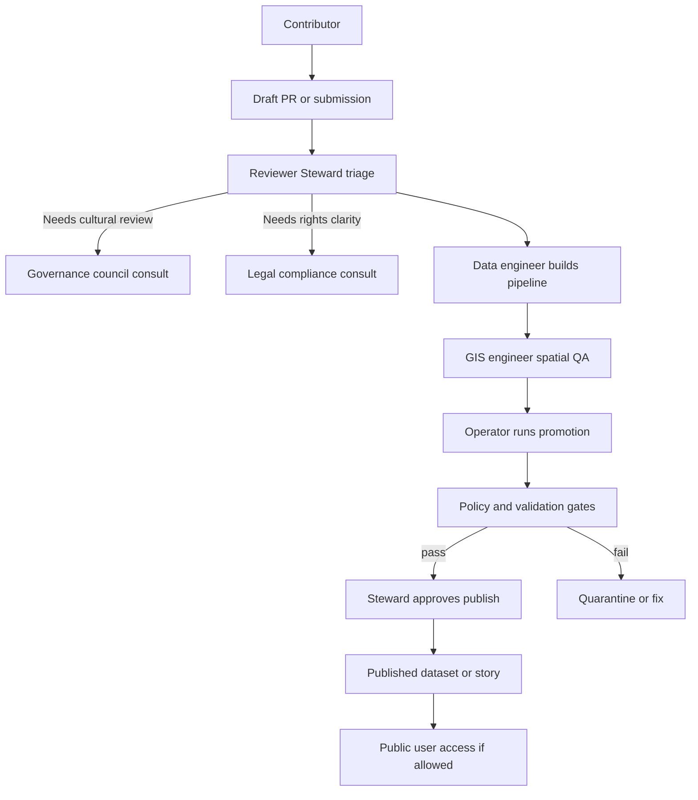

<!-- [KFM_META_BLOCK_V2]
doc_id: kfm://doc/5f4a3bde-9f2e-4f16-9d7b-0b85fcb96e8e
title: Roles and RACI
type: standard
version: v1
status: draft
owners:
  - "@kfm/governance"   # UNKNOWN: replace with real CODEOWNERS/teams
  - "@kfm/stewards"     # UNKNOWN: replace with real CODEOWNERS/teams
created: 2026-03-04
updated: 2026-03-04
policy_label: public
related:
  - docs/governance/ROOT_GOVERNANCE_CHARTER.md  # UNKNOWN: confirm exact file name
  - docs/governance/ETHICS.md                   # UNKNOWN: confirm exists
  - docs/governance/SOVEREIGNTY.md              # UNKNOWN: confirm exists
  - docs/specs/qa/QA__VALIDATION_GATES.md       # UNKNOWN: confirm exists
tags:
  - kfm
  - governance
  - roles
  - raci
notes:
  - Baseline roles + minimum RACI are aligned to the vNext governance guide; this file makes them operational for PRs, promotions, and story publishing.
  - Replace UNKNOWN placeholders (owners, queues, escalation) during first governance setup pass.
[/KFM_META_BLOCK_V2] -->

# Roles and RACI
One source of truth for **who does what** in KFM’s governed lifecycle (data + stories + policy).

---

## Impact
**Status:** `draft`  
**Owners:** `@kfm/governance`, `@kfm/stewards` *(UNKNOWN — set to real teams)*  
**Applies to:** dataset onboarding, dataset promotion, story publishing, policy changes

**Quick jump:** [Scope](#scope) · [Evidence labels](#evidence-labels) · [Role catalog](#role-catalog) · [RACI matrices](#raci-matrices) · [Governance artifacts](#governance-artifacts) · [Definition of done](#definition-of-done)

---

## Scope
- [CONFIRMED] This document defines **roles** and a **minimum RACI** for KFM’s governed workflows.
- [CONFIRMED] It is intended to prevent policy bypass and ambiguity during promotion/publishing.
- [PROPOSED] It may be expanded later into per-team runbooks (Ops, Data, UI), but remains the high-level governance contract.

### Where it fits in the repo
- **Path:** `docs/governance/ROLES_AND_RACI.md`
- **Upstream:** governance charter + ethics/sovereignty policies *(see `related` in MetaBlock; filenames currently UNKNOWN)*
- **Downstream:** promotion workflow, story publishing workflow, policy-as-code CI gates, and runtime policy enforcement

### Acceptable inputs
- PR review decisions about **datasets**, **stories**, and **policy bundles**
- Ownership assignments for governance artifacts (policy bundles, rubrics, review queues)
- Escalation/consultation pathways (e.g., cultural sensitivity, rights uncertainty)

### Exclusions
- Not an HR org chart, hiring plan, or personnel directory.
- Not a replacement for detailed runbooks (those belong in `docs/specs/qa/runbooks/` or team-specific ops docs).
- Not a policy definition itself (policies belong in the policy bundle repo / OPA bundle).

---

## Evidence labels
KFM documentation is “cite-or-abstain.” To keep this file auditable, each key statement is marked:

- **[CONFIRMED]** Present as a requirement or explicit mechanism in KFM governance documentation.
- **[PROPOSED]** Recommended baseline, default, or “minimum model” that should be adopted first and evolved.
- **[UNKNOWN]** Placeholder requiring an explicit governance decision (tracked via issue/ADR/ticket).

---

## Governance workflow map

---

## Role catalog

### Baseline roles
- [PROPOSED] **Public user**
  - Purpose: consume *public* layers and stories; Focus Mode restricted to *public evidence only*.
  - Constraints: no publish permissions; no access to restricted evidence.

- [PROPOSED] **Contributor**
  - Purpose: propose datasets/stories, author drafts, supply specs + documentation.
  - Constraints: **cannot publish**; changes flow through review + gates.

- [PROPOSED] **Reviewer / Steward**
  - Purpose: approve dataset promotions and story publishing; own **policy labels** and **redaction rules**.
  - Constraints: must follow policy-as-code outcomes; approvals require resolvable evidence and rights clarity.

- [PROPOSED] **Operator**
  - Purpose: run pipelines and manage deployments.
  - Constraints: **cannot override policy gates** (no “break-glass publish”).

- [PROPOSED] **Governance council / community stewards**
  - Purpose: authority to control culturally sensitive materials; set rules for restricted collections and public representations.
  - Constraints: decisions should be recorded and traceable (ticket/ADR/policy change record).

### Supporting roles referenced by the minimum RACI
These roles appear in the minimum RACI as “Responsible” or “Consulted.” Treat them as specializations that may be individuals or teams.

- [PROPOSED] **Data engineer**
  - Builds/maintains dataset pipelines, deterministic transforms, and validation outputs.

- [PROPOSED] **GIS engineer**
  - Owns spatial QA, geometry validity, CRS correctness, and map-readiness checks.

- [PROPOSED] **Historian / Editor**
  - Reviews story drafts for narrative integrity, citation quality, and publication standards.

- [PROPOSED] **Policy engineer**
  - Implements policy changes as code (OPA/Rego or equivalent) with tests and fixtures.

- [PROPOSED] **Security**
  - Consulted for restricted infrastructure, threat model impact, and “trust membrane” enforcement.

- [PROPOSED] **Legal / Compliance**
  - Consulted when rights are unclear, especially for image/media reuse and licensing.

---

## RACI matrices
**Legend:**  
- **R** = Responsible (does the work)  
- **A** = Accountable (final decision / sign-off)  
- **C** = Consulted (must be engaged before decision)  
- **I** = Informed (kept in the loop)

### Dataset onboarding
| Activity | R | A | C | I |
|---|---|---|---|---|
| Define dataset spec + docs | Contributor | Steward | Legal/Compliance *(if rights unclear)*; Governance council *(if culturally sensitive)* | Operator |
| Implement ingestion + transforms | Data engineer | Steward | GIS engineer | Contributor |
| Spatial QA + map readiness checks | GIS engineer | Steward | Data engineer | Contributor |

### Dataset promotion
| Activity | R | A | C | I |
|---|---|---|---|---|
| Run promotion workflow (RAW→WORK→PROCESSED→PUBLISHED) | Operator | Steward | Security *(restricted infrastructure)*; Governance council *(sensitive)* | Contributor |
| Validate outputs (schemas, QA reports, catalogs) | Data engineer | Steward | Operator | Contributor |
| Approve publish (or block/quarantine) | Steward | Steward | Governance council *(sensitive)*; Security *(restricted)* | Contributor |

### Story publishing
| Activity | R | A | C | I |
|---|---|---|---|---|
| Draft story node(s) with resolvable citations | Contributor | Steward | Historian/Editor | Public user *(post-publish)* |
| Editorial review (clarity, rigor, citations) | Historian/Editor | Steward | Contributor | Operator |
| Rights review for embedded media | Legal/Compliance | Steward | Contributor | Public user *(post-publish)* |
| Publish story | Steward | Steward | Governance council *(Indigenous/cultural)* | Public user |

### Policy changes
| Activity | R | A | C | I |
|---|---|---|---|---|
| Propose policy change (ticket + rationale) | Steward + Policy engineer | Governance council *(or designated owner)* | Operators *(runtime impact)*; Contributors *(workflow impact)* | Users |
| Implement policy-as-code + fixtures + tests | Policy engineer | Steward | Security *(if access/risk impact)* | Operators |
| Roll out policy bundle to CI + runtime | Operator | Steward | Policy engineer | Users |

---

## Governance artifacts
KFM governance is operational only if specific artifacts exist and are maintained.

### Required artifacts
- [CONFIRMED] Policy bundle repository (OPA/Rego or equivalent)
- [CONFIRMED] Test fixtures for policy decisions (allow/deny + obligations)
- [CONFIRMED] Licensing classification rubric
- [CONFIRMED] Sensitivity rubric and generalization guidelines
- [CONFIRMED] Review workflow definition (Promotion Queue + Story Review Queue)
- [CONFIRMED] Audit ledger retention and access policy

### Ownership mapping
This table is the **operational** “who owns what” view.

| Artifact | Primary owner (A) | Implementer (R) | Mandatory consult (C) |
|---|---|---|---|
| Policy bundle repo | Governance council or designated owner *(PROPOSED)* | Policy engineer *(PROPOSED)* | Steward, Operator |
| Policy fixtures + tests | Steward *(PROPOSED)* | Policy engineer *(PROPOSED)* | Security *(if access impact)* |
| Licensing rubric | Steward *(PROPOSED)* | Steward *(PROPOSED)* | Legal/Compliance |
| Sensitivity rubric + generalization guidance | Steward *(PROPOSED)* | Steward *(PROPOSED)* | Governance council |
| Promotion Queue workflow definition | Steward *(PROPOSED)* | Operator *(PROPOSED)* | Data engineer, Security |
| Story Review Queue workflow definition | Steward *(PROPOSED)* | Historian/Editor *(PROPOSED)* | Governance council, Legal/Compliance |
| Audit ledger retention policy | Steward *(PROPOSED)* | Operator *(PROPOSED)* | Security, Legal/Compliance |

---

## Enforcement boundaries
- [CONFIRMED] KFM requires **the same policy semantics in CI and runtime**; otherwise CI guarantees are meaningless.
- [CONFIRMED] Policy checks must exist at enforcement points (CI, runtime API, evidence resolver); the UI shows policy badges/notices but **does not decide policy**.
- [PROPOSED] Treat “trust membrane” violations (direct DB/storage access bypassing governed APIs) as Sev-High and block merges/releases until corrected.

---

## Definition of done
Use this checklist when adopting or revising this file.

- [ ] [UNKNOWN] Confirm actual governance owners (`CODEOWNERS`, GitHub teams, or named maintainers).
- [ ] [UNKNOWN] Confirm the canonical governance charter filename (ROOT_GOVERNANCE vs ROOT_GOVERNANCE_CHARTER) and update links.
- [ ] [PROPOSED] Create/confirm **Promotion Queue** and **Story Review Queue** workflow and link them here.
- [ ] [PROPOSED] Ensure Operator cannot bypass gates (technical controls + required checks).
- [ ] [PROPOSED] Ensure a consultation pathway exists for culturally sensitive materials and rights-unclear media.
- [ ] [PROPOSED] Add a lightweight “RACI check” to PR templates for dataset/story/policy changes (author states expected R/A/C/I).

---

## Appendix

Expanded guidance for role assignment

- [PROPOSED] Keep the baseline roles small; treat “Data engineer / GIS engineer / Policy engineer” as hats worn by maintainers in small teams.
- [PROPOSED] If one person holds multiple roles (common early), explicitly record it on the PR so “R” and “A” separation is still reviewable.
- [UNKNOWN] Define an escalation/appeals process for disputes (especially on sensitivity and rights).

---

[Back to top](#roles-and-raci)
