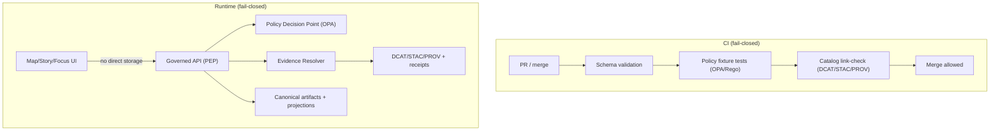

<!-- [KFM_META_BLOCK_V2]
doc_id: kfm://doc/f2a61b2d-a527-4861-aeec-8a029dac6c8b
title: Root Governance
type: standard
version: v1
status: draft
owners: TBD (Steward + Policy Engineer + Operator)
created: 2026-03-02
updated: 2026-03-02
policy_label: public
related:
  - kfm://doc/kfm-gdg-vnext
  - kfm://doc/kfm-tooling-pipeline
tags: [kfm, governance]
notes:
  - Root governance entrypoint for KFM. Keep this file stable and link outward to more detailed governance docs as they are created.
  - Do not add links to files that do not exist; link-checkers must pass.
[/KFM_META_BLOCK_V2] -->

# KFM Root Governance
Evidence-first governance for the Kansas Frontier Matrix (KFM): **policy, promotion, provenance, and audit**.

---

## Navigation
- [Purpose](#purpose)
- [Non-negotiable invariants](#non-negotiable-invariants)
- [Governance model](#governance-model)
- [Policy labels and obligations](#policy-labels-and-obligations)
- [Promotion Contract](#promotion-contract)
- [Catalog and provenance contract](#catalog-and-provenance-contract)
- [Evidence and citations contract](#evidence-and-citations-contract)
- [Audit and receipts](#audit-and-receipts)
- [Change management](#change-management)
- [Minimum verification steps](#minimum-verification-steps)
- [Glossary](#glossary)

---

## Purpose
KFM governance turns intent (“be trustworthy, respect rights, protect sensitive locations”) into enforceable behavior across:

- **Data** (ingestion → validation → publication)
- **Catalogs and provenance** (DCAT/STAC/PROV + receipts)
- **Runtime surfaces** (API, Map/Story UI, Focus Mode)
- **Operations and delivery** (CI gates, policy tests, audits, rollbacks)

This file is the **entrypoint**. It describes the invariants and minimum contracts that every component MUST follow.

> **Normative language**
>
> - **MUST** / **MUST NOT**: non-negotiable requirement.
> - **SHOULD** / **SHOULD NOT**: strong default; exceptions require explicit steward sign-off and a recorded rationale.
> - **MAY**: optional.

---

## Non-negotiable invariants
These invariants are the trust membrane. If you violate them, the platform is no longer governed.

### Truth path lifecycle (zones)
All data and derived artifacts MUST traverse an auditable truth path:

**Upstream → RAW → WORK/QUARANTINE → PROCESSED → CATALOG/TRIPLET → PUBLISHED**

- **RAW**: immutable acquisition artifacts + checksums + terms snapshot (append-only).
- **WORK/QUARANTINE**: intermediate transforms, QA, and candidate redaction/generalization; quarantine blocks promotion.
- **PROCESSED**: publishable standardized artifacts + checksums.
- **CATALOG/TRIPLET**: cross-linked DCAT + STAC + PROV describing what exists and how it was made.
- **PUBLISHED**: governed runtime surfaces served via API/UI; policy enforced.

### Trust membrane (policy boundary)
Clients MUST NOT access storage or databases directly. All access MUST flow through the governed API (PEP) where policy is evaluated and obligations are applied. UI may *display* policy, but UI MUST NOT make policy decisions.

### Evidence-first UX
Every user-facing claim (map feature, story claim, Focus Mode statement) MUST be inspectable:
dataset version, license/rights, policy label, provenance chain, and artifact digests.

### Cite-or-abstain (Focus Mode + Story publishing)
Focus Mode and Story publishing MUST:
- cite resolvable, policy-allowed evidence bundles, or
- abstain / reduce scope until claims are supported.

### Canonical vs rebuildable stores
Canonical: object store artifacts + catalogs + provenance.
Rebuildable: search indexes, tiles, graph projections, PostGIS indices.

### Deterministic identity and hashing
Dataset identity and version identity MUST be deterministic (stable spec hash / canonical JSON hashing) so that promotion and rollback are reliable.

---

## Governance model

### Roles (baseline)
This is a minimal, buildable starting model. Expand later, but do not start with complexity you cannot enforce.

| Role | What they can do | What they cannot do |
|---|---|---|
| **Public user** | Read public datasets/stories; Focus Mode restricted to public evidence | Access restricted datasets or restricted evidence bundles |
| **Contributor** | Propose datasets and stories; draft specs and narratives | Publish or promote to PUBLISHED |
| **Reviewer / Steward** | Approve promotions and story publishing; own policy labels + redaction rules | Bypass gates; publish without artifacts validating |
| **Operator** | Run pipelines; manage deployments; rotate secrets | Override governance/policy decisions |
| **Governance council / community stewards** | Set rules for culturally sensitive materials; define restricted/public representations | Delegate away community constraints without explicit process |

### RACI (minimum)
Governance work MUST be explicit about accountability.

- **Dataset onboarding**
  - Responsible: contributor (spec + docs), data engineer (pipeline), GIS engineer (spatial QA)
  - Accountable: steward
  - Consulted: governance council (if culturally sensitive), legal/compliance (if rights unclear)
  - Informed: operator

- **Dataset promotion**
  - Responsible: operator (run), data engineer (validate outputs)
  - Accountable: steward
  - Consulted: governance council (sensitive), security (restricted infrastructure)
  - Informed: contributor

- **Story publishing**
  - Responsible: contributor (draft), historian/editor (review)
  - Accountable: steward
  - Consulted: governance council (Indigenous/cultural), legal (image reuse)
  - Informed: public

- **Policy changes**
  - Responsible: steward + policy engineer
  - Accountable: governance council or designated owner
  - Consulted: operators (runtime impact), contributors (workflow impact)
  - Informed: users

---

## Policy labels and obligations

### Default posture
- **Default deny** for sensitive-location and restricted datasets.
- If any public representation is allowed, publish a separate **public_generalized** dataset version (distinct artifacts and catalogs).
- **Never leak restricted metadata** in error behavior (403/404 must be policy-safe).
- Do not embed precise coordinates in Story Nodes or Focus Mode outputs unless policy explicitly allows.
- Treat redaction/generalization as a first-class transform recorded in provenance.

### Policy is not just “allow/deny”
A policy decision produces:
1) allow/deny, and
2) **obligations** (required transforms or output constraints), such as:
- remove or hash columns
- generalize geometry
- apply minimum-count thresholds / aggregation
- redact PII from receipts/logs
- require attribution text in exports

### Policy-as-code requirement
Policy semantics MUST match in CI and runtime (or at minimum share fixtures and expected outcomes). If CI and runtime disagree, CI guarantees are meaningless.

---

## Promotion Contract
Promotion is the act of moving a dataset version from RAW/WORK into PROCESSED + CATALOG/TRIPLET, and therefore into PUBLISHED runtime surfaces.

### Rule
A dataset version promotion MUST be **blocked** unless all minimum gates pass (automatable + reviewable).

### Minimum gates (v1)
| Gate | What MUST exist | Typical enforcement |
|---|---|---|
| **A — Identity & versioning** | dataset_id + dataset_version_id; deterministic spec_hash; content digests | Schema + hash tests |
| **B — Licensing & rights** | license/rights fields + snapshot of upstream terms | CI deny if missing/unknown |
| **C — Sensitivity + redaction plan** | policy_label + obligations | Policy tests + redaction checks |
| **D — Catalog triplet validation** | DCAT/STAC/PROV validate + cross-link; EvidenceRefs resolve | Validators + link-check |
| **E — QA thresholds** | dataset QA report + thresholds met; failures quarantined | QA checkers |
| **F — Run receipt + audit record** | run receipt (inputs/outputs/tools/policy decisions) + append-only audit entry | Receipt schema validation |
| **G — Release manifest** | promotion manifest referencing artifacts + digests + approvals | Manifest validation |

### Promotion outcomes
If any gate fails, promotion MUST:
- stop at the current zone (often QUARANTINE),
- record failure in a receipt/audit entry, and
- require steward review for remediation.

---

## Catalog and provenance contract
KFM treats catalogs not as “nice metadata,” but as canonical contract surfaces between pipeline outputs and runtime.

### The catalog triplet responsibilities
- **DCAT** answers: what is this dataset, who published it, license, distributions.
- **STAC** answers: what assets exist, their spatiotemporal extents, where files are.
- **PROV** answers: how outputs were created; which inputs/tools/parameters.

### Cross-linking rules (must be testable)
Cross-links MUST be explicit and deterministic so EvidenceRefs resolve without guessing:
- DCAT dataset → distributions → artifact digests
- DCAT dataset → prov:wasGeneratedBy → PROV activity bundle
- STAC collection → rel="describedby" → DCAT dataset
- STAC item → links to PROV activity and/or run receipt

---

## Evidence and citations contract
In KFM, a “citation” is not a pasted URL. It is an **EvidenceRef** that resolves into an **EvidenceBundle** containing the metadata, artifacts (if allowed), digests, and provenance required to inspect and reproduce the claim.

### Evidence resolver contract
The evidence resolver MUST:
- accept an EvidenceRef (scheme://...) or structured reference (dataset_version + record id + span),
- apply policy and return allow/deny + obligations, and
- return an EvidenceBundle that includes:
  - human view (renderable card)
  - machine metadata (JSON)
  - artifact links (only if allowed)
  - digests + dataset_version ids
  - audit references

### Story Node publishing gate
A Story Node MUST NOT publish unless all citations resolve through the evidence resolver and are policy-allowed.

---

## Audit and receipts

### Audit is required
Every promotion run and every Focus Mode request is treated as a governed run that MUST emit:
- run_id
- inputs/outputs digests
- environment capture (container digest, git commit, params digest)
- policy decision references
- output hash (where applicable)

### Audit log protections
Audit logs can leak sensitive operational details. Therefore:
- logs MUST be append-only,
- logs MUST be redacted for PII and restricted info,
- log access MUST be restricted to stewards/operators,
- retention/deletion policy MUST be defined and enforced.

---

## Change management

### What counts as a governance change?
Any change that affects:
- promotion gates
- policy semantics (allow/deny/obligations)
- evidence resolver behavior
- audit/receipt schemas
- what is considered “publishable”
is a governance change.

### Required process (fail-closed)
1. Add/update the contract (schema / policy / validator).
2. Add fixtures (valid + invalid) and regression tests.
3. Ensure CI blocks merges on violations.
4. Document the change rationale and migration/rollback plan.

> NOTE: prefer additive glue (new schemas, registries, link maps, ADRs, tests) over sweeping rewrites.

---

## Minimum verification steps
Before asserting repo-specific details (paths, module names, endpoints), perform and attach the smallest checks needed to convert **Unknown → Confirmed**:

- [ ] Capture repo commit hash and root directory tree (e.g., `git rev-parse HEAD`, `tree -L 3`).
- [ ] Confirm which governance work packages exist (search for spec_hash, OPA policies, validators, evidence resolver route, dataset registry schema).
- [ ] Extract CI gate list from `.github/workflows` and document which checks are blocking merges.
- [ ] Choose one MVP dataset and verify it can be promoted end-to-end with receipts + catalogs.
- [ ] Validate that UI cannot bypass the PEP (static analysis + network policies) and EvidenceRefs resolve end-to-end.
- [ ] For Focus Mode: run evaluation harness and store golden query outputs/diffs as artifacts.

---

## Glossary
- **Truth path**: the zoned lifecycle (Upstream → RAW → WORK → PROCESSED → CATALOG → PUBLISHED).
- **Trust membrane**: the boundary that prevents bypass of policy/provenance (clients cannot reach storage).
- **PEP**: Policy Enforcement Point (governed API layer).
- **PDP**: Policy Decision Point (OPA/Rego evaluation).
- **EvidenceRef**: structured reference that resolves to evidence (not a URL).
- **EvidenceBundle**: policy-filtered bundle of evidence metadata + digests + provenance + allowed artifacts.
- **Promotion Contract**: fail-closed gate set required to publish.

---

<a href="#kfm-root-governance">Back to top</a>
