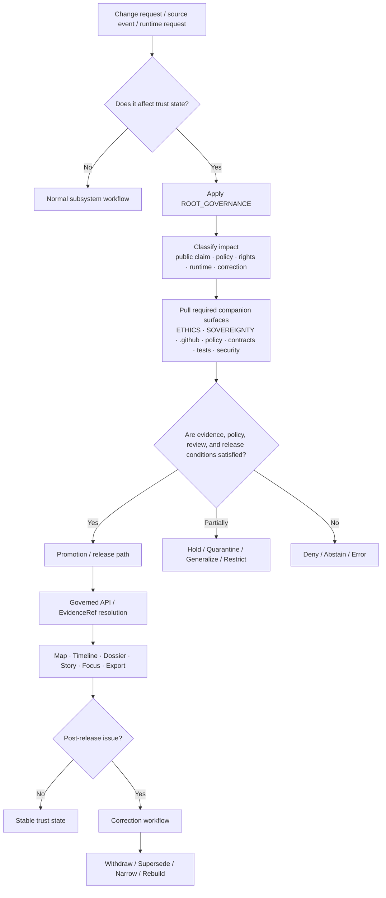

<!-- [KFM_META_BLOCK_V2]
doc_id: kfm://doc/TBD-VERIFY-root-governance-uuid
title: Kansas Frontier Matrix — Root Governance
type: standard
version: v1
status: draft
owners: @bartytime4life
created: TBD-VERIFY-first-commit-date
updated: TBD-VERIFY-last-reviewed-date
policy_label: TBD-VERIFY-public-or-restricted
related: [./README.md, ./ETHICS.md, ./SOVEREIGNTY.md, ../../.github/README.md, ../../.github/CODEOWNERS, ../../.github/PULL_REQUEST_TEMPLATE.md, ../../policy/README.md, ../../contracts/README.md, ../../tests/README.md, ../../CONTRIBUTING.md, ../../SECURITY.md]
tags: [kfm, governance, trust-system, review, publication, correction, policy]
notes: [Current public main confirms this file path, sibling governance docs, broad CODEOWNERS coverage, the .github gatehouse README, and linked README surfaces; current public main also confirms `.github/workflows/README.md` and README-only workflow inventory, but not required checks, rulesets, environment approvals, or non-public platform settings. `doc_id`, `created`, `updated`, and `policy_label` still need direct maintainer verification.]
[/KFM_META_BLOCK_V2] -->

# Kansas Frontier Matrix — Root Governance

Core governance law and review triggers for KFM trust state, publication, runtime behavior, and correction.

> **Status:** draft standard · current public `main` path, sibling governance docs, broad ownership, and linked doc surfaces verified · platform enforcement still needs direct verification  
> **Owners:** `@bartytime4life` *(broad current public `CODEOWNERS` coverage confirmed; narrower governance-only ownership is not exposed on public `main`)*  
>          
> **Quick jump:** [Scope](#scope) · [Verification posture](#verification-posture) · [Authority order](#authority-order-for-this-file) · [Repo fit](#repo-fit) · [Accepted inputs](#accepted-inputs) · [Exclusions](#exclusions) · [Governance law](#governance-law) · [Review triggers](#review-triggers-and-escalation) · [Objects](#governance-objects-and-what-they-protect) · [Outcomes](#allowed-outcomes-and-visible-negative-states) · [Surface obligations](#trust-visible-surface-obligations) · [Diagram](#diagram) · [Adjacent surfaces](#adjacent-surfaces-and-handoffs) · [Quickstart](#quickstart) · [Change matrix](#change-matrix) · [Definition of done](#definition-of-done) · [FAQ](#faq) · [Appendix](#appendix)  
> **Repo fit:** `docs/governance/ROOT_GOVERNANCE.md` · upstream [`./README.md`](./README.md) · sibling docs [`./ETHICS.md`](./ETHICS.md) and [`./SOVEREIGNTY.md`](./SOVEREIGNTY.md) · gatehouse [`../../.github/README.md`](../../.github/README.md)

> [!IMPORTANT]
> This file states **governing law**, not implementation theater. In KFM, a successful build or deployment is not automatically a publishable trust state. Evidence, policy, review, release, and correction all remain in play.

> [!NOTE]
> Current public `main` confirms this directory context, sibling governance docs, the `.github` gatehouse surfaces, and the linked documentation boundaries: `docs/governance/README.md`, `docs/governance/ETHICS.md`, `docs/governance/SOVEREIGNTY.md`, `.github/README.md`, `.github/CODEOWNERS`, `.github/PULL_REQUEST_TEMPLATE.md`, `.github/workflows/README.md`, `contracts/README.md`, `policy/README.md`, `tests/README.md`, `CONTRIBUTING.md`, and `SECURITY.md`. Keep required checks, rulesets, environment approvals, OIDC wiring, and other platform-only controls marked `NEEDS VERIFICATION` until branch-local evidence exists.

| At a glance | Working rule |
|---|---|
| Truth path | `Source edge → RAW → WORK / QUARANTINE → PROCESSED → CATALOG / TRIPLET → PUBLISHED` |
| Trust boundary | Public and ordinary clients stay behind governed APIs, policy checks, and evidence resolution |
| Authority split | Derived layers stay subordinate unless explicitly promoted |
| Runtime rule | Finite outcomes only: `ANSWER`, `ABSTAIN`, `DENY`, or `ERROR` |
| Evidence route | Consequential claims remain one hop away from evidence, with `EvidenceRef → EvidenceBundle` resolution |
| Correction rule | Supersession, withdrawal, narrowing, and replacement preserve visible lineage |
| Surface rule | 2D is the default operating surface; 3D is burden-bearing and conditional |

## Scope

This document is the **root governance law** for Kansas Frontier Matrix.

Use it when a change could alter:

- a public claim or a trust-bearing surface
- publication, review, or release state
- rights, sensitivity, or exact-location exposure
- Focus behavior, runtime outcomes, or evidence visibility
- approval boundaries, stewardship paths, or correction behavior
- the line between authoritative truth and derived convenience layers

This file is intentionally narrower than the full architectural corpus and broader than any one subsystem. It sits above machine-readable policy, contracts, and tests, but below the complete architecture manuals and adjacent governance docs.

> [!WARNING]
> Do not use this document to imply that policy bundles, schemas, workflow gates, runtime emitters, or platform enforcement already exist unless that implementation is directly verified in the working branch.

## Verification posture

| Label | Meaning in this file |
|---|---|
| **CONFIRMED** | Directly supported by March–April 2026 KFM doctrine or by current public repo evidence inspected on `main`. |
| **INFERRED** | Strongly implied by repeated doctrine and adjacent documentation, but not directly re-verified as mounted implementation. |
| **PROPOSED** | Repo-ready realization guidance consistent with doctrine, but not proven as active implementation. |
| **UNKNOWN** | Not verified strongly enough in the current session to present as fact. |
| **NEEDS VERIFICATION** | A specific owner, path, rule, workflow, or runtime detail should be checked before merge or publication. |

> [!NOTE]
> KFM governance gets weaker when uncertainty is flattened. When a fact is not branch-verified, keep the uncertainty visible.

## Authority order for this file

| Priority | Source class | How this file should use it |
|---|---|---|
| **1** | Replacement-grade master doctrine and canonical master reference | Anchor non-negotiable governance law, trust posture, contradiction handling, and fail-closed behavior. |
| **2** | Supporting March–April 2026 overlays | Deepen route families, verification placement, runtime outcomes, Evidence Drawer / Focus obligations, and correction seams without outranking doctrine. |
| **3** | Current public repo evidence on `main` | Confirm local file roles, neighboring governance docs, `CODEOWNERS`, gatehouse surfaces, PR template, and public documentation boundaries. |
| **4** | Official external rechecks | Use only for version-sensitive standards or boundary facts; never let them silently override KFM doctrine. |

If direct branch evidence later conflicts with inferred packaging here, keep the doctrine and downgrade the packaging claim until the branch-local fact is re-verified. Do not force code or docs to mimic placeholder paths just because they appeared in a doctrine-driven draft.

## Repo fit

| Item | Value |
|---|---|
| Path | `docs/governance/ROOT_GOVERNANCE.md` |
| Role | Core governance law and review-trigger document for the governance directory |
| Upstream | [`./README.md`](./README.md) |
| Verified sibling docs | [`./ETHICS.md`](./ETHICS.md) · [`./SOVEREIGNTY.md`](./SOVEREIGNTY.md) |
| Verified gatehouse surfaces | [`../../.github/README.md`](../../.github/README.md) · [`../../.github/CODEOWNERS`](../../.github/CODEOWNERS) · [`../../.github/PULL_REQUEST_TEMPLATE.md`](../../.github/PULL_REQUEST_TEMPLATE.md) |
| Verified downstream documentation surfaces | [`../../policy/README.md`](../../policy/README.md) · [`../../contracts/README.md`](../../contracts/README.md) · [`../../tests/README.md`](../../tests/README.md) |
| Review and contributor surfaces | [`../../CONTRIBUTING.md`](../../CONTRIBUTING.md) · [`../../SECURITY.md`](../../SECURITY.md) |
| This file does **not** replace | policy bundles, schemas, fixtures, workflow YAML, test harnesses, or incident runbooks |

This file should remain the place contributors read first when they need to answer a simple question with large consequences:

**“What has to remain true before KFM is allowed to change trust state?”**

### Current public repo signals

| Surface | What current public `main` confirms | What it does **not** confirm |
|---|---|---|
| `docs/governance/` | `README.md`, `ROOT_GOVERNANCE.md`, `ETHICS.md`, and `SOVEREIGNTY.md` are present | additional governance files beyond the visible set |
| `.github/` gatehouse | `README.md`, `PULL_REQUEST_TEMPLATE.md`, `SECURITY.md`, `CODEOWNERS`, `actions/`, `watchers/`, `workflows/`, `ISSUE_TEMPLATE/`, and `dependabot.yml` are present | platform-only settings, permissions, secrets, rulesets, or non-public automation behavior |
| `.github/workflows/` | `README.md` is present | checked-in workflow YAML gates, required checks, environment approvals, or rulesets |
| `contracts/` | `README.md` is present | populated schema registry, valid/invalid fixtures, or mounted contract files |
| `policy/` | `README.md` is present | mounted `.rego` bundles, runnable policy tests, or verified runtime package boundaries |
| `tests/` | `README.md` is present | active harnesses, end-to-end proof suites, or CI-exercised runs |
| `.github/CODEOWNERS` | broad fallback and explicit top-level coverage point to `@bartytime4life`, including `/.github/`, `/docs/`, `/contracts/`, `/policy/`, and `/tests/` | narrower governance-specific ownership below `/docs/governance/` |

> [!WARNING]
> Current public `SECURITY.md` exists, but that file still marks canonical security-policy path and publication readiness as review-required. Governance changes that depend on final disclosure routing or settled security-surface authority should keep that uncertainty visible rather than treating security closure as already finished.

[Back to top](#kansas-frontier-matrix--root-governance)

## Accepted inputs

This file accepts governance-facing material such as:

- non-negotiable trust and publication rules
- review triggers and escalation conditions
- negative outcome definitions and visibility rules
- separation-of-duty expectations for promotion, denial, and correction
- root governance objects and the trust they protect
- cross-links to adjacent ethics, sovereignty, policy, contract, test, security, and gatehouse surfaces

## Exclusions

This file should **not** become:

- the home of detailed Rego or policy-rule bodies
- an OpenAPI, JSON Schema, or DTO catalog
- a domain-specific publication manual for one lane
- a release note, changelog, or incident log
- a substitute for `SECURITY.md`, `CONTRIBUTING.md`, or test/runbook material
- a place to hide unverified workflow names, settings, or enforcement claims

| If you need to document… | Put it in… |
|---|---|
| policy decision logic, reason codes, obligation codes | `../../policy/` |
| machine-readable trust objects | `../../contracts/` and related schema homes |
| proof burdens, fixtures, and drills | `../../tests/` |
| disclosure, coordinated security handling, trust-boundary failure | `../../SECURITY.md` |
| contributor process and PR expectations | `../../CONTRIBUTING.md` and `../../.github/PULL_REQUEST_TEMPLATE.md` |
| repo-level gatehouse, workflow inventory, watcher scaffolding, ownership boundaries | `../../.github/README.md` and `../../.github/CODEOWNERS` |
| domain-specific publication burdens | lane-specific docs and source-atlas-linked materials |

## Governance law

| Law | What it means in practice | If violated, default response |
|---|---|---|
| **Preserve the truth path** | Material changes trust state through governed transitions, not casual file movement or UI exposure. | Hold, quarantine, or block promotion. |
| **Admissibility before visibility** | A resource is not admitted merely because it exists; identity, support, time semantics, method, validation, provenance, rights posture, and review requirements matter first. | Quarantine, restrict, or reject the resource. |
| **Preserve the trust membrane** | Public and ordinary clients do not bypass governed APIs, policy checks, evidence resolution, or review state. | Reject the path until the bypass is removed. |
| **Evidence stays one hop away** | Consequential claims must retain drill-through to admissible support at the point of use. | Deny, abstain, or revert to draft/review state. |
| **`EvidenceRef` must resolve to `EvidenceBundle`** | Trust-bearing answers, exports, stories, and detail views must resolve to governed evidence with visible rights/sensitivity and audit linkage. | Abstain, deny, error, or withhold the surface. |
| **Keep authoritative and derived layers distinct** | Graphs, search, vector, tile, cache, summary, scene, export, and model layers remain subordinate unless explicitly promoted. | Label, rebuild, restrict, or block publication. |
| **Kansas-first lanes carry burden** | Water, hazards, agriculture, transportation, ecology, land tenure, archives, biodiversity, and service geography are operating burdens, not decorative tags; lane-specific publication rules must stay explicit. | Escalate to the relevant lane-specific review path and keep uncertainty, restriction, or generalization visible. |
| **Publication is a governance event** | Deployment success does not overrule policy, review, release proof, or correction readiness. | Treat the release as incomplete. |
| **No hidden approvals** | Policy-significant publication, review, denial, rollback, and correction actions should emit visible artifacts. | Freeze the change until review artifacts exist. |
| **Finite runtime outcomes only** | Trust-bearing runtime behavior converges on `ANSWER`, `ABSTAIN`, `DENY`, or `ERROR` rather than vague graceful prose. | Fail closed and surface the finite outcome. |
| **Correction remains visible** | Withdrawal, supersession, narrowing, and replacement preserve lineage instead of silently overwriting history. | Publish correction state instead of patching invisibly. |
| **2D is the default operating surface** | 3D must justify its burden and inherit the same evidence, policy, review, and correction law. | Keep or return to 2D until burden is proven. |

> [!IMPORTANT]
> Negative states are not embarrassing edge cases in KFM. They are trust-preserving behavior.

## Review triggers and escalation

| Trigger | Typical examples | Required companions | Default outcome if missing |
|---|---|---|---|
| **Public claim surface changes** | map, timeline, compare, dossier, story, Focus, export, or API output changes meaning | governance review + linked docs/contracts/tests | hold or deny |
| **Rights / sensitivity / exact-location risk** | archaeology, biodiversity, oral history, community-linked knowledge, sensitive coordinates | sovereignty review + policy logic + steward path | generalize, restrict, quarantine, or deny |
| **Machine-readable trust object changes** | `EvidenceBundle`, `RuntimeResponseEnvelope`, `ReleaseManifest`, `CorrectionNotice` | contract updates + fixtures + validation tests | block merge until aligned |
| **Policy or release-gate changes** | new reason codes, obligation codes, promotion criteria, review thresholds | policy update + tests + runbook note | default deny |
| **Runtime or AI behavior changes** | scope widening, citation handling, answer formatting, fallback logic | governance review + runtime fixtures + citation-negative tests | abstain, deny, or freeze rollout |
| **Correction-path changes** | withdrawal, supersession, stale-visible, narrowed replacement | correction object + surface-state update + rollback path | do not publish silently |
| **Gatehouse or review-routing changes** | `CODEOWNERS`, PR template, workflow inventory docs, watcher scaffolding with review consequences | governance review + contributor/control-plane docs + ownership check | hold until routing stays explicit |
| **Kansas operating-lane expansion or burden change** | new archaeology, biodiversity, migration, oral-history, service-geography, or controlled-3D publication surfaces | lane-specific burden note + governance review + ethics/sovereignty companions where relevant | hold until the burden is explicit |
| **Trust-membrane bypass risk** | direct client → store, direct client → model runtime, unreviewed publish shortcut | security review + architecture correction | reject until removed |

### Escalate immediately when…

- a contributor wants a convenience path around governed APIs
- a public-facing surface may show unsupported certainty
- a modeled or summarized layer may be mistaken for authority
- exact coordinates could expose a sensitive place, site, person, or ecology record
- a correction path is missing but publication is still being proposed
- a workflow, ownership, or release change weakens review, proof, or rollback behavior

[Back to top](#kansas-frontier-matrix--root-governance)

## Governance objects and what they protect

| Object family | Minimum purpose | What it protects |
|---|---|---|
| **SourceDescriptor** | Declares what a source is, who stewards it, how it may be used, and what validation or publication posture applies. | source admission discipline |
| **IngestReceipt** | Proves that a fetch and landing event occurred. | acquisition integrity and landing visibility |
| **ValidationReport** | Records what passed, failed, or quarantined during intake or canonical work. | validation visibility and fail-closed routing |
| **DatasetVersion** | Carries an authoritative candidate or promoted subject set. | deterministic identity, support, and time semantics |
| **CatalogClosure** | Publishes outward metadata closure and lineage linkage. | discoverability, identifier coherence, and release linkage |
| **DecisionEnvelope** | Makes a policy result machine-readable. | reviewability of allow / deny / generalize / restrict / hold |
| **ReviewRecord** | Captures human approval, denial, escalation, or note. | separation of duty and no-hidden-approval behavior |
| **ReleaseManifest / ReleaseProofPack** | Assembles public-safe release state and proof. | publication readiness, rollback posture, and explainability |
| **ProjectionBuildReceipt** | Proves a derived layer was built from known released scope. | freshness, release linkage, and derived-layer accountability |
| **EvidenceBundle** | Packages support for a claim, story, export preview, or answer. | evidence drill-through and rights/sensitivity visibility |
| **RuntimeResponseEnvelope** | Makes runtime outcomes accountable. | scoped runtime behavior, citation checks, audit linkage |
| **CorrectionNotice** | Preserves visible lineage under change. | supersession, withdrawal, replacement, and narrowing |

> [!NOTE]
> This file names the governing object families. Their exact machine-readable homes belong in `contracts/`, `policy/`, and `tests/`.

## Allowed outcomes and visible negative states

| Outcome | Use it when | Must remain visible as |
|---|---|---|
| **Publish** | evidence, policy, review, and release conditions are satisfied | promoted / released |
| **Hold** | readiness is incomplete but the work may still become publishable | explicit hold state |
| **Quarantine** | intake, rights, support, or validation remains unresolved | quarantine or restricted review state |
| **Generalize** | exact detail would create unacceptable exposure | generalized / reduced-precision state |
| **Restrict** | public release is not allowed, but a steward-capable path may remain valid | restricted or steward-only state |
| **Deny** | the request, publication, or action exceeds allowed policy or scope | denied |
| **Abstain** | a trust-bearing answer cannot be supported safely with admissible evidence | abstained |
| **Error** | runtime or system behavior cannot complete the governed task safely | errored |
| **Withdraw** | a published object should no longer remain public-safe in its existing form | withdrawn |
| **Supersede** | a later version or correction replaces an earlier public object | superseded with lineage |

## Trust-visible surface obligations

| Surface | Governance must keep visible | Failure-safe fallback |
|---|---|---|
| **Map Explorer** | time scope, layer state, freshness, and route to evidence | label stale / generalized / partial state rather than bluff |
| **Timeline** | valid-time framing, event grain, compare basis, and stale-state cues | keep chronology explicit, not silently flattened |
| **Dossier** | identity, dependencies, service areas, evidence links, and correction state | hold or restrict if trust-critical context is missing |
| **Story surface** | evidence-linked excerpts, dates, perspective labels, review state, and correction state | do not publish persuasive prose without visible support |
| **Evidence Drawer** | bundle members, quote or preview context, transforms, release state, and preview limits | deny preview or show restricted/generalized state explicitly |
| **Focus Mode** | scope echo, citation verification, audit linkage, and finite outcome semantics | `ABSTAIN`, `DENY`, or `ERROR` rather than free-form fallback |
| **Review / Stewardship** | diff, gate results, policy labels, review notes, and receipts with no hidden approvals | block the action until artifacts exist |
| **Compare** | shared geography/time anchor, explicit comparison basis, and uncertainty cues | fall back to a simpler anchored comparison |
| **Export** | release scope, evidence linkage, preview policy, and correction linkage | withhold, generalize, or restrict export |
| **Classroom / Civic variant** | same truth rules, simplified but visible caveats | remain a simplified view, not a separate epistemic system |
| **Controlled 3D** | same Evidence Drawer, audit refs, policy chips, and release/correction state as 2D | degrade to the 2D trust path if parity is not preserved |

## Diagram

## Adjacent surfaces and handoffs

| Surface | Why it matters here |
|---|---|
| [`./README.md`](./README.md) | Directory contract and entry point; use it for navigation, this file for governing law. |
| [`./ETHICS.md`](./ETHICS.md) | Adds public-consequence, persuasive-behavior, and uncertainty-display guardrails. |
| [`./SOVEREIGNTY.md`](./SOVEREIGNTY.md) | Adds rights, sensitivity, CARE-style handling, and exact-location exposure rules. |
| [`../../.github/README.md`](../../.github/README.md) | Repository-side gatehouse; use it when governance changes cross into workflow inventory, watcher scaffolding, or review-routing behavior. |
| [`../../.github/CODEOWNERS`](../../.github/CODEOWNERS) | Current public review-routing boundary and broad ownership baseline. |
| [`../../.github/PULL_REQUEST_TEMPLATE.md`](../../.github/PULL_REQUEST_TEMPLATE.md) | PR-level review expectations and evidence checklist. |
| [`../../policy/README.md`](../../policy/README.md) | Governing policy is expected to become executable there; current public `main` confirms the README boundary surface, not checked-in bundle inventory. |
| [`../../contracts/README.md`](../../contracts/README.md) | Trust objects become machine-checkable there; current public `main` confirms the boundary doc surface, not a populated contract registry. |
| [`../../tests/README.md`](../../tests/README.md) | Proof burdens, negative-path fixtures, and correction drills belong there; current public `main` confirms the README surface, not runnable suite inventory. |
| [`../../CONTRIBUTING.md`](../../CONTRIBUTING.md) | Contributor process, review routing, and change hygiene. |
| [`../../SECURITY.md`](../../SECURITY.md) | Current public security surface exists, but it still carries canonical-path and publication-readiness uncertainty; use it as a live boundary surface, not settled closure. |

## Quickstart

When a proposed change feels “small” but could still weaken trust, use this sequence:

1. Decide whether the change alters **trust state**, not only code or wording.
2. Read this file first.
3. Pull in [`./ETHICS.md`](./ETHICS.md) for public-consequence or persuasive-behavior changes.
4. Pull in [`./SOVEREIGNTY.md`](./SOVEREIGNTY.md) for rights, sensitivity, or exact-location questions.
5. Check gatehouse surfaces — [`../../.github/README.md`](../../.github/README.md), [`../../.github/CODEOWNERS`](../../.github/CODEOWNERS), and [`../../.github/PULL_REQUEST_TEMPLATE.md`](../../.github/PULL_REQUEST_TEMPLATE.md) — if review routing, ownership, or automation-adjacent behavior may change.
6. Check whether contracts, policy bundles, tests, or security surfaces must change with it.
7. Decide the allowed outcome **before** implementation: publish, hold, quarantine, generalize, restrict, deny, abstain, withdraw, supersede, or error.
8. Update docs, contracts, fixtures, tests, and runbooks in the same governed change stream.

## Change matrix

| Change class | Minimum required evidence | Typical review path |
|---|---|---|
| Documentation-only wording with no trust change | checked paths, honest truth labels, no overclaiming | normal docs review |
| Gatehouse / review-routing change | path evidence, ownership impact, PR-template or workflow-doc delta | governance + contributor/control-plane review |
| Public claim or trust-surface change | linked evidence path, visible caveat logic, screenshot or sample payload | governance review |
| Policy-significant change | reason/obligation impact, fixture updates, negative-path coverage | governance + policy review |
| Contract or envelope change | schema delta, example valid/invalid cases, compatibility note | contracts + tests + governance |
| Release / correction behavior | proof-pack or release-manifest impact, rollback/correction note | release + governance |
| Sensitive location or rights handling | publication class, steward handling, generalized-vs-precise comparison | sovereignty + steward review |
| Trust-membrane or runtime path change | bypass analysis, audit impact, denial/abstention behavior | security + governance |

[Back to top](#kansas-frontier-matrix--root-governance)

## Definition of done

A governance-affecting change is ready when:

- [ ] trust posture is stated honestly where needed
- [ ] this file, adjacent governance docs, and linked implementation surfaces agree
- [ ] no public or steward-facing surface outruns evidence, policy, review, or release state
- [ ] new or changed negative outcomes are explicit in contracts, tests, and UX copy where relevant
- [ ] no new client → store or client → model-runtime bypass is introduced
- [ ] correction, supersession, or withdrawal behavior is visible where a change could require it later
- [ ] gatehouse, ownership, and PR-template surfaces stay aligned when review routing changes
- [ ] placeholders and `NEEDS VERIFICATION` markers are retired where direct repo evidence now exists
- [ ] unresolved implementation gaps remain visible instead of being polished away

## FAQ

### Is root governance the same thing as policy?

No. Policy is one executable branch of governance. This file states the law and review triggers that policy, contracts, tests, release proof, and runtime behavior must implement.

### Why treat `DENY` and `ABSTAIN` as healthy outcomes?

Because KFM is designed to fail closed. A visible refusal is more trustworthy than a smooth but unsupported answer or publication.

### Does a successful deployment mean the change is safe to show publicly?

No. Deployment and publication are different trust states. Publication still depends on evidence, policy, review, release proof, and correction readiness.

### When should contributors pull in `ETHICS.md` or `SOVEREIGNTY.md`?

As soon as a change affects people, public consequence, persuasive behavior, uncertainty display, rights, cultural sensitivity, community-held knowledge, or exact-location exposure.

### Why keep this file separate from contracts and tests?

Because governance law should stay readable and stable even while machine-readable enforcement evolves in its own subsystem homes.

## Appendix

<strong>Working vocabulary</strong>

| Term | Working meaning here |
|---|---|
| **Truth path** | `Source edge → RAW → WORK / QUARANTINE → PROCESSED → CATALOG / TRIPLET → PUBLISHED` |
| **Trust membrane** | The governed boundary that keeps normal clients downstream of policy and evidence resolution |
| **Authoritative truth** | Governance-bearing canonical records and promoted subject sets |
| **Derived layer** | A rebuildable convenience surface such as tiles, search, exports, summaries, graphs, scenes, or model outputs |
| **EvidenceRef** | Stable citation token used to refer to support material |
| **EvidenceBundle** | Governed resolution payload for a trust-bearing claim or response |
| **Promotion** | A governed trust-state transition, not just a file move or deploy |
| **Correction** | Visible withdrawal, supersession, narrowing, or replacement with preserved lineage |

<strong>Open verification items before publication</strong>

- confirm created date, last-reviewed date, and final `doc_id`
- confirm the intended `policy_label`
- confirm whether additional governance or gatehouse surfaces should be linked here
- confirm branch protections, rulesets, required checks, environment approvals, and OIDC trust relationships before stating them as fact
- confirm exact schema, policy-bundle, fixture, and runnable test inventories before naming them as mounted implementation
- confirm whether governance-specific ownership narrower than the current broad `CODEOWNERS` baseline is intended
- confirm the canonical public security-policy path before treating security routing as fully settled

<strong>Root-governance watchlist</strong>

Keep this file in the review loop whenever a PR:

- changes public claim wording or visibility
- changes review or promotion authority
- changes gatehouse ownership, review routing, or workflow documentation with governance consequences
- changes runtime answer behavior or citation handling
- changes correction, withdrawal, or supersession logic
- introduces a new public surface or review console path
- widens location precision or public export detail
- creates a new derived layer that might be mistaken for authority

[Back to top](#kansas-frontier-matrix--root-governance)
