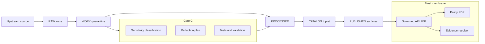

<!-- [KFM_META_BLOCK_V2]
doc_id: kfm://doc/9a4e1b2b-61b7-4f9b-9b6d-1c0b1bb1d2da
title: Sensitive Locations Playbook
type: standard
version: v1
status: draft
owners: [Data Stewards, Policy Engineers, Governance Council]
created: 2026-03-04
updated: 2026-03-04
policy_label: public
related: [
  "kfm://policy/promotion-contract#gate-c",
  "kfm://policy/policy-as-code#pep-pdp",
  "docs/governance/ROOT_GOVERNANCE_CHARTER.md",
  "policy/",
  "data/registry/"
]
tags: [kfm, governance, sensitive-locations, geoprivacy, redaction, policy, opa]
notes: [
  "This playbook contains process and controls, not sensitive coordinates.",
  "All runtime/CI enforcement must fail-closed."
]
[/KFM_META_BLOCK_V2] -->

# SENSITIVE_LOCATIONS_PLAYBOOK
One-line purpose: Prevent location-based harm by enforcing **default-deny**, **generalization/redaction**, and **audited access** for sensitive locations across the KFM truth path.

---

## IMPACT
- **Status:** draft (intended to be enforced)
- **Owners:** Data Stewards + Policy Engineering (consult Governance Council for culturally sensitive materials)
- **Policy label:** `public` (contains no sensitive coordinates; describes controls only)
- **Applies to:** data pipelines, catalogs (DCAT/STAC/PROV), governed APIs, Story Nodes, Focus Mode, logs/receipts
- **Hard rule:** Never embed sensitive coordinates in public surfaces (maps, Story Nodes, chat answers, logs)

**Badges (TODO):**  
  

---

## Quick navigation
- [Legend: evidence labels](#legend-evidence-labels)
- [Scope and non-goals](#scope-and-non-goals)
- [Definitions](#definitions)
- [Non-negotiable invariants](#non-negotiable-invariants)
- [Roles and RACI](#roles-and-raci)
- [Classification workflow](#classification-workflow)
- [Redaction and generalization profiles](#redaction-and-generalization-profiles)
- [Enforcement points](#enforcement-points)
- [Access and unmasking workflow](#access-and-unmasking-workflow)
- [Incident response](#incident-response)
- [CI and test checklist](#ci-and-test-checklist)
- [Appendix](#appendix)

---

## Legend: evidence labels
KFM governance docs require evidence discipline. This playbook uses labels to prevent “policy drift”:

- **CONFIRMED:** Required by existing KFM governance posture / invariants (must implement).
- **PROPOSED:** Recommended implementation guidance (safe default; may be adjusted).
- **UNKNOWN:** Needs an explicit governance decision (do not ship without resolving).

---

## Scope and non-goals

### Scope
- **CONFIRMED:** Applies to *any* dataset or output that can reveal a sensitive location directly or by inference (geometry, address, unique landmark description, photo EXIF, or high-resolution raster).  
- **CONFIRMED:** Applies across the full lifecycle: `RAW → WORK/QUARANTINE → PROCESSED → CATALOG/TRIPLET → PUBLISHED`.

### Non-goals
- **PROPOSED:** This document does *not* define the final numeric geoprivacy radii; it defines the **process** and **controls** to select and enforce them.
- **UNKNOWN:** Final list of “sensitive classes” for Kansas-specific use cases (must be approved by Governance Council).

[Back to top](#sensitive_locations_playbook)

---

## Definitions

### Sensitive location
A location is “sensitive” when revealing it could reasonably increase risk of:
- physical harm or harassment,
- looting, vandalism, or unauthorized excavation,
- illegal collection (flora/fauna),
- privacy violation (home/work address, re-identification),
- security risk (critical infrastructure, controlled facilities),
- culturally sensitive harm (sacred sites, sovereignty-restricted materials).

### Public representation
A *separate* publishable artifact intended for public consumption that:
- removes or generalizes precision,
- includes explicit policy notice,
- cannot be reversed to recover protected coordinates.

### Redaction vs generalization
- **Redaction:** removing or masking sensitive elements (drop fields, remove geometry, replace with coarse centroid).
- **Generalization:** systematically reducing spatial/temporal precision (snap-to-grid, dissolve, aggregate, downsample).

### “Unmasking”
The controlled process of granting an authorized user access to full precision data. This must be:
- permissioned,
- time-bounded,
- fully audited,
- revocable at the access layer.

[Back to top](#sensitive_locations_playbook)

---

## Non-negotiable invariants

### Governance posture
- **CONFIRMED:** **Default-deny** for sensitive-location and restricted datasets.  
- **CONFIRMED:** If any public representation is allowed, publish a separate `public_generalized` dataset version.  
- **CONFIRMED:** Do not embed precise coordinates in Story Nodes or Focus Mode outputs unless policy explicitly allows.  
- **CONFIRMED:** Treat redaction/generalization as a first-class transform recorded in PROV.  

### Trust membrane
- **CONFIRMED:** Clients/UI must not access storage/DB directly. All access crosses the governed API (PEP) and policy evaluation.  
- **CONFIRMED:** UI may display policy badges/notices, but must not make policy decisions.

[Back to top](#sensitive_locations_playbook)

---

## Roles and RACI

### Baseline roles
- **CONFIRMED:** Public user (public-only evidence)
- **CONFIRMED:** Contributor (propose datasets/stories; cannot publish)
- **CONFIRMED:** Reviewer/Steward (owns policy labels and redaction rules; approves promotion/publishing)
- **CONFIRMED:** Operator (runs pipelines; cannot override policy gates)
- **CONFIRMED:** Governance Council / Community Stewards (authority to control culturally sensitive materials)

### RACI for sensitive locations
| Activity | Responsible | Accountable | Consulted | Informed |
|---|---|---|---|---|
| Sensitivity classification | Contributor + Steward | Steward | Governance Council (if culturally sensitive), Security (if infra) | Operator |
| Redaction profile selection | Steward + Policy Engineer | Steward | Domain expert (ecology/archaeology), Legal (if rights) | Contributor |
| Promotion Gate C approval | Operator (run) | Steward | Governance Council (if culturally sensitive) | Contributor |
| Unmask access grant | Steward | Steward + Governance Council (if sovereignty) | Security | Operator |
| Incident response | Operator + Steward | Steward | Security + Governance Council | Affected stakeholders |

[Back to top](#sensitive_locations_playbook)

---

## Classification workflow

### Step 0: detect “location-bearing” data
- **PROPOSED:** Automatically flag datasets containing any of:
  - point coordinates, addresses, parcel IDs, facility IDs,
  - high-resolution geometry (points or small polygons),
  - imagery with metadata likely to include EXIF GPS,
  - rare-event records that can be triangulated.

### Step 1: sensitivity screening questions
Mark as **sensitive by default** if *any* answer is “yes”:
1) Could this identify a private person or household?
2) Could this enable looting/vandalism/illegal collection?
3) Is it culturally sensitive or sovereignty-restricted?
4) Is it critical infrastructure or a controlled facility?
5) Would a reasonable steward hesitate to publish exact coordinates?

### Step 2: assign policy labels
Use the controlled vocabulary `policy_label` (see Appendix for starter list).
- **CONFIRMED:** Sensitive-location material must not be labeled `public`.
- **PROPOSED:** Prefer two artifacts:
  - **restricted precision**: `restricted_sensitive_location` (full fidelity, controlled access)
  - **public representation**: `public_generalized` (safe, generalized)

### Step 3: attach a redaction plan (Gate C)
- **CONFIRMED:** No dataset may be promoted to `PUBLISHED` without:
  - sensitivity classification
  - explicit redaction/generalization profile
  - verification evidence (tests + receipts)

[Back to top](#sensitive_locations_playbook)

---

## Redaction and generalization profiles

### Profile registry
- **PROPOSED:** Maintain a versioned registry of redaction profiles, e.g.:
  - `public_default`
  - `public_generalized`
  - `aggregate_only`
  - `restricted_sensitive_location`
  - `embargoed_then_generalized`

### Recommended minimum behaviors
| Profile | Intended audience | Geometry handling | Time handling | Attribute handling | Allowed surfaces |
|---|---|---|---|---|---|
| `public_default` | Public | Exact (if non-sensitive) | Exact (if non-sensitive) | No PII | Public map + public Story + public Focus |
| `public_generalized` | Public | Generalize or aggregate | Coarsen if needed | Remove quasi-identifiers | Public map + Story + Focus with notice |
| `aggregate_only` | Public | Aggregated counts only | Coarsened | Remove row-level records | Public dashboards only |
| `restricted_sensitive_location` | Authorized | Full fidelity | Full fidelity | Allowed under policy | Restricted API only |
| `embargoed_then_generalized` | Mixed | Block until date, then generalized | Block until date | Block until date | Time-gated |

### Generalization patterns (do not include actual coordinates)
- **PROPOSED (points):** grid aggregation; point-radius masking; replace with admin-area centroid; minimum-count thresholds.
- **PROPOSED (polygons):** dissolve into larger units; snap-to-grid; publish only bounding box at coarse resolution; remove small holes.
- **PROPOSED (rasters):** downsample; blur; publish coarser pixel size; remove tiles around exact targets.
- **PROPOSED (text):** redact place names that uniquely identify a protected site; avoid turn-by-turn directions; remove EXIF.

### Required PROV recording
- **CONFIRMED:** Redaction/generalization must be recorded as a transform in PROV, including:
  - inputs used, tools/versions, parameters, and a receipt/audit reference.

[Back to top](#sensitive_locations_playbook)

---

## Enforcement points

### Policy-as-code must match CI and runtime
- **CONFIRMED:** KFM policy semantics must be consistent in CI and runtime (same fixtures and outcomes), or CI guarantees are meaningless.

### Policy Decision Point and Enforcement Points
- **CONFIRMED:** PDP is OPA (in-process or sidecar).
- **CONFIRMED:** PEPs include:
  - CI (blocks merges)
  - Runtime API (blocks serving)
  - Evidence Resolver (blocks bundle resolution/rendering)
  - UI (shows notices only, never decides)

### Promotion Contract hook
- **CONFIRMED:** Sensitivity classification and redaction plan are required at **Gate C**.
- **CONFIRMED:** Catalog triplet must include `kfm:policy_label` and cross-linked identifiers so evidence resolution respects policy.

### “Never leak via errors”
- **CONFIRMED:** Do not leak restricted metadata in `403/404` (no “existence oracle” for sensitive datasets).

[Back to top](#sensitive_locations_playbook)

---

## Diagram: sensitive-location governance flow



[Back to top](#sensitive_locations_playbook)

---

## Access and unmasking workflow

### Default behavior
- **CONFIRMED:** Public users never receive unmasked coordinates for sensitive locations.
- **PROPOSED:** Even authorized users should prefer “need-to-know” scopes (smallest geometry/time window).

### Unmasking requirements
- **PROPOSED:** Unmasking must require:
  - explicit policy permit (role + purpose + dataset scope),
  - time-bound access,
  - audit event recording (actor, reason, evidence links),
  - explicit terms of use if required.

### “Unmask tokens”
- **PROPOSED:** Implement signed, time-bound tokens tied to `audit_ref` and `dataset_version_id`.

[Back to top](#sensitive_locations_playbook)

---

## Incident response

### If sensitive coordinates leak
- **PROPOSED:** Immediate steps:
  1) Revoke access tokens and disable affected endpoints.
  2) Remove/rewrite leaked artifacts in `PUBLISHED` surfaces (replace with generalized versions).
  3) Publish an internal incident report with scope, timeline, and remediation.
  4) Add/strengthen regression tests so the leak cannot recur.
  5) Review “secondary leakage”: logs, receipts, story exports, cached tiles.

### Post-incident governance
- **PROPOSED:** Governance Council review for culturally sensitive materials; update rubric and approvals.

[Back to top](#sensitive_locations_playbook)

---

## CI and test checklist

### Promotion Gate C checks (minimum)
- **CONFIRMED:** Every promoted dataset must include:
  - `policy_label` and sensitivity class
  - redaction/generalization plan (profile)
  - PROV record of redaction transforms (when applied)
  - policy tests + schema validation must pass

### Runtime checks (minimum)
- **CONFIRMED:** Governed API and Evidence Resolver must enforce:
  - deny by default for sensitive-location
  - obligations for `public_generalized` (UI notice)
  - “no existence oracle” error behavior

### Task list before marking this doc “published”
- [ ] Define controlled vocabulary for `sensitivity_class` (Kansas-specific)
- [ ] Define redaction profile registry location and schema
- [ ] Add OPA fixtures for allow/deny + obligations
- [ ] Add CI jobs that fail-closed on missing Gate C metadata
- [ ] Add Story Node and Focus Mode preflight checks to prevent coordinate leakage

[Back to top](#sensitive_locations_playbook)

---

## Appendix

### A. Controlled vocabulary (starter)
> Keep this list versioned and enforced by schema + policy.

- `public`
- `public_generalized`
- `restricted`
- `restricted_sensitive_location`
- `internal`
- `embargoed`
- `quarantine`

### B. Example dataset registry fields (pseudocode)
```yaml
dataset_id: example_sensitive_sites
dataset_version: 2026-03-01
policy_label: restricted_sensitive_location
sensitivity_class: sensitive_location
redaction_profile: public_generalized

# Public representation (separate artifact/version)
public_representation:
  dataset_id: example_sensitive_sites_public
  policy_label: public_generalized
  redaction_profile: public_generalized
  notes: "Generalized geometry due to policy."
```

### C. Example “no-coordinates-in-story” rule (pseudocode)
- If `story_node.sensitivity != public` then `story_node.redaction_profile != public_default`.

### D. Where this fits
- `docs/governance/` — human governance and review workflows
- `policy/` — OPA/Rego rules + fixtures (enforced in CI and runtime)
- `contracts/` — schemas for registry, catalogs, receipts
- `data/registry/` — dataset onboarding metadata (must include Gate C fields)

[Back to top](#sensitive_locations_playbook)
