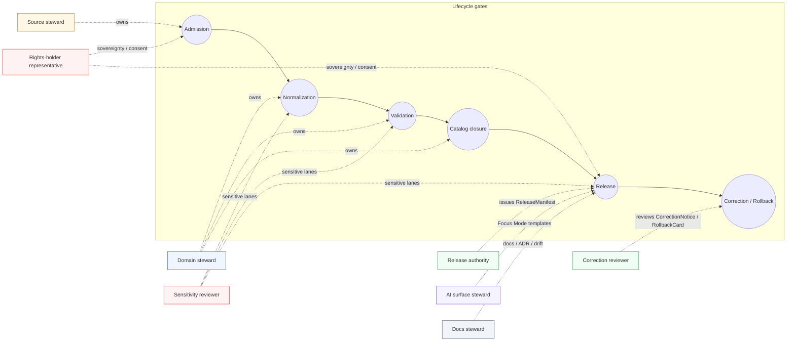
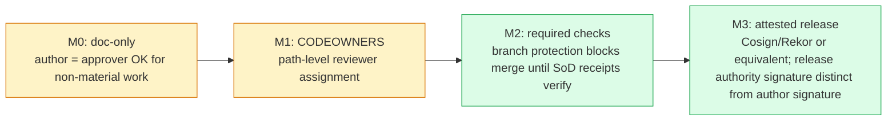

<!-- [KFM_META_BLOCK_V2]
doc_id: kfm://doc/governance/separation-of-duties
title: Separation of Duties
type: standard
version: v0.1
status: draft
owners: Docs steward (placeholder); co-stewards per §3
created: 2026-05-12
updated: 2026-05-12
policy_label: public
related:
  - docs/doctrine/directory-rules.md
  - docs/doctrine/authority-ladder.md
  - docs/doctrine/trust-membrane.md
  - docs/doctrine/lifecycle-law.md
  - docs/adr/README.md
  - docs/registers/DRIFT_REGISTER.md
  - docs/registers/VERIFICATION_BACKLOG.md
tags: [kfm, governance, separation-of-duties, release, review, doctrine]
notes:
  - Doctrinal anchor is Operating-Law Invariant 9 (CONFIRMED).
  - Role definitions and matrix are PROPOSED until ADR-S-09 is accepted.
  - Tooling enforcement is NEEDS VERIFICATION; this document is not enforcement.
[/KFM_META_BLOCK_V2] -->

# Separation of Duties

> **Authorship and approval are different acts.** Kansas Frontier Matrix separates policy-significant release duties when maturity and materiality justify it. This document names the roles, the duties, and the cases where one actor MUST NOT also approve their own work.


| Status | Owners | Last reviewed |
|---|---|---|
| Draft | Docs steward (placeholder) · co-stewards per §3 | TODO (placeholder) |

**Quick jump:**
[§1 Purpose](#1-purpose) · [§2 Doctrinal basis](#2-doctrinal-basis) · [§3 Roles](#3-roles) · [§4 SoD matrix](#4-separation-of-duties-matrix) · [§5 Materiality & maturity](#5-materiality-and-maturity-triggers) · [§6 Receipts](#6-required-receipts-and-artifacts) · [§7 Lifecycle gates](#7-lifecycle-gates-and-required-reviewers) · [§8 Sensitive lanes](#8-sensitive-lane-defaults) · [§9 Enforcement posture](#9-enforcement-posture-custom--tooling) · [§10 Anti-patterns](#10-anti-patterns) · [§11 ADR backlog](#11-open-adr-backlog) · [§12 Review burden](#12-review-burden-for-this-document) · [§13 Related](#13-related-doctrine-and-registers) · [§14 Glossary](#14-glossary)

---

## 0. Status & Authority

| Field | Value |
|---|---|
| **Document type** | Governance standard (operationalizes doctrine) |
| **Doctrinal authority of these rules** | CONFIRMED — anchored in **Operating-Law Invariant 9** (Atlas v1.1 §24.7) |
| **Authority of the specific role names and matrix rows** | PROPOSED — per Atlas v1.1 §24.7.1 and §24.7.2, pending ADR-S-09 |
| **Authority of any path quoted here** | PROPOSED until verified against mounted-repo evidence |
| **Proposed canonical home** | `docs/governance/SEPARATION_OF_DUTIES.md` (per Directory Rules §6.1) |
| **Owner** | Docs steward (placeholder) |
| **Reviewers required for change** | Docs steward **+ at least one subsystem owner**; ADR required for changes to §4 thresholds, §5 maturity rules, or §9 enforcement posture |
| **Supersedes** | None (initial) |
| **Related doctrine** | `docs/doctrine/directory-rules.md` · `docs/doctrine/authority-ladder.md` · `docs/doctrine/trust-membrane.md` · `docs/doctrine/lifecycle-law.md` |
| **Lifecycle invariant** | RAW → WORK / QUARANTINE → PROCESSED → CATALOG / TRIPLET → PUBLISHED. Promotion is a **governed state transition, not a file move.** |

> [!IMPORTANT]
> This document **describes** the duties and their separations. It is **not** the enforcement layer.
> Tooling enforcement (CODEOWNERS, branch protection, OPA/Conftest gates, Checks API rollups, attestation verification) is governed by `policy/`, `.github/`, and CI. Whether any specific enforcement is wired in the mounted repo is **NEEDS VERIFICATION**.

---

## 1. Purpose

Separation of Duties (SoD) in KFM guarantees that the **public trust surface** is never built by a single, unchallenged actor when the stakes warrant another set of eyes. It does four things:

1. **Names the roles** that own distinct governance responsibilities across the lifecycle.
2. **Identifies the actions** where author = approver is acceptable, conditional, or forbidden.
3. **Binds each separated action** to a required artifact (a `ReviewRecord`, `PolicyDecision`, `ReleaseManifest`, `RollbackCard`, `CorrectionNotice`, or domain-specific receipt) so the separation leaves an inspectable trail.
4. **States the maturity rule**: early-stage, low-materiality work MAY be authored and approved by the same actor; as the public trust surface expands, separation MUST be enforced through tooling, not custom.

> [!NOTE]
> SoD does not decide **whether** a release should happen. That is decided by `policy/`, `release/`, and `contracts/`. SoD decides **who must be involved** once the release is otherwise admissible.

### 1.1 What this document is NOT

- It is not `CODEOWNERS`. CODEOWNERS implements path-level reviewer assignment; this document names the roles those owners play.
- It is not the policy bundle. Admissibility deny-rules live in `policy/`, evaluated by OPA/Conftest in CI and (PROPOSED) at runtime.
- It is not the branch-protection configuration. Required checks and merge-blocking rules live in `.github/` and platform settings.
- It is not the AI policy. Focus Mode and AI surface behavior are governed under the AI surface steward and the cite-or-abstain rule; this document only states **who reviews** AI-surface changes.

---

## 2. Doctrinal Basis

### 2.1 Operating-Law Invariant 9 (CONFIRMED)

> "KFM separates policy-significant release duties when maturity justifies it."
> — *KFM Operating Law*, restated in Atlas v1.1 §24.7 (CONFIRMED).

This invariant is the root authority for everything in this document. It connects to three other invariants:

| Invariant | Why it matters for SoD |
|---|---|
| **Lifecycle law** — RAW → WORK / QUARANTINE → PROCESSED → CATALOG / TRIPLET → PUBLISHED | SoD attaches to specific **gates** in this chain, not to the bytes themselves. |
| **Trust membrane** — public clients consume governed APIs and released artifacts, never canonical / internal stores | The membrane is what makes separation meaningful: the release gate is where SoD has teeth. |
| **Cite-or-abstain** — EvidenceBundle outranks generated language | SoD ensures the actors who decide "this is releaseable" are not the same actors who fabricated the language being released. |

### 2.2 Why the matrix is PROPOSED

Atlas v1.1 §24.7 explicitly labels both the role definitions (§24.7.1) and the SoD matrix (§24.7.2) as **PROPOSED — a reference for ADR discussion**. The doctrine that **some** separation is required is CONFIRMED; the **specific** assignment of roles to actions is PROPOSED until **ADR-S-09 — Reviewer role separation: when is separation enforced by tooling vs. custom** is accepted.

> [!CAUTION]
> Until ADR-S-09 is accepted, the matrix in §4 is the **default working contract** for KFM SoD discussions. Treat its rows as binding *defaults*, not as enforced mechanism. Deviations should be opened as drift entries in `docs/registers/DRIFT_REGISTER.md`.

[Back to top ↑](#separation-of-duties)

---

## 3. Roles

> [!NOTE]
> Role names below are **CONFIRMED** as the vocabulary used in Atlas v1.1 §24.7.1. Their **scopes** are **PROPOSED** in the same source and remain so until ADR-S-09 freezes them.

### 3.1 Role diagram



> [!NOTE]
> Diagram reflects the role-to-gate associations stated in Atlas v1.1 §24.7.1 and §24.7.2. Edge labels are illustrative; the binding artifact for each association is named in §6.

### 3.2 Role definitions

| Role | Definition (PROPOSED) | Primary scope (PROPOSED) | Primary artifacts |
|---|---|---|---|
| **Source steward** | Owns admission, rights confirmation, and sensitivity tag for a named source family. | `SourceDescriptor` lifecycle; admission gate. | `SourceDescriptor`, `RawCaptureReceipt` |
| **Domain steward** | Owns the meaning, contracts, and validators of a domain's object families. | Domain `contracts/` and `schemas/`; validator authorship; review of domain-internal promotions. | `ValidationReport`, `TransformReceipt` |
| **Sensitivity reviewer** | Reviews redaction, generalization, withholding, and tier decisions for sensitive content. | `RedactionReceipt`; tier transitions for sensitive lanes (archaeology, fauna, flora, people/DNA, infrastructure detail). | `RedactionReceipt`, `ReviewRecord` |
| **Rights-holder representative** | Confirms sovereignty, cultural-heritage, or consent-based release decisions. | Archaeology, sovereign data, living-person data, DNA data, culturally sensitive content. | `ReviewRecord`, `PolicyDecision` |
| **Release authority** | Issues `ReleaseManifest`s and authorizes PUBLISHED transitions; distinct from authorship when materiality applies. | PUBLISHED transitions; rollback authorization. | `ReleaseManifest`, `RollbackCard` |
| **Correction reviewer** | Reviews `CorrectionNotice` / `RollbackCard` before they amend a PUBLISHED claim. | Post-publication corrections; rollbacks. | `CorrectionNotice`, `ReviewRecord` |
| **AI surface steward** | Reviews Focus Mode templates, `AIReceipt` sampling, and policy bindings; audits AI behavior against doctrine. | Focus Mode; `AIReceipt` audits; cite-or-abstain checks. | `AIReceipt`, `PolicyDecision` |
| **Docs steward** | Owns governance documentation, ADR index, drift register, and Atlas / supplement integrity. | `docs/` tree; ADR index; `docs/registers/DRIFT_REGISTER.md`. | ADR records; drift entries |

> [!TIP]
> A single human MAY hold multiple roles in early-stage / low-materiality work, **except** for the pairings explicitly forbidden in §4 (e.g., author of a sensitive-lane release MUST NOT also serve as the release authority for that release).

[Back to top ↑](#separation-of-duties)

---

## 4. Separation-of-Duties Matrix

The matrix below is **PROPOSED** (Atlas v1.1 §24.7.2) and serves as the default working contract.

| Action | May the author also approve? | Required separation (PROPOSED) | Source |
|---|---|---|---|
| **Source admission** (— → RAW) | **Yes** for routine. **No** when source has unresolved rights / sovereignty. | Source steward + rights-holder representative where applicable. | Atlas v1.1 §24.7.2 |
| **Normalization receipts** (RAW → WORK / QUARANTINE) | **Yes** for routine. **No** when transforms are sensitivity-relevant. | Domain steward; sensitivity reviewer if sensitivity-relevant. | Atlas v1.1 §24.7.2 |
| **Validator authorship and run** | **Yes** (validators are deterministic). | Domain steward; periodic audit by docs steward. | Atlas v1.1 §24.7.2 |
| **Promotion to PROCESSED / CATALOG** | **Yes** for non-sensitive routine. **No** for sensitive lanes. | Domain steward **+ sensitivity reviewer** (sensitive lanes). | Atlas v1.1 §24.7.2 |
| **Release to PUBLISHED** | **No** when materiality applies. | Author ≠ release authority; rights-holder rep where applicable. | Atlas v1.1 §24.7.2 |
| **Sensitive-lane release** | **No.** | Author **+ sensitivity reviewer + release authority + rights-holder rep**. | Atlas v1.1 §24.7.2 |
| **Correction / rollback** | **No** when correction is steward-significant. | Author / detector **+ correction reviewer + release authority**. | Atlas v1.1 §24.7.2 |
| **AI surface change** (template / policy binding) | **No.** | AI surface steward + docs steward (policy binding). | Atlas v1.1 §24.7.2 |
| **Atlas / supplement publication** | **No.** | Docs steward **+ at least one subsystem owner** (per Directory Rules). | Atlas v1.1 §24.7.2; Directory Rules §0 |

> [!WARNING]
> The "Yes for routine, No when material" rows are **not loopholes**. The materiality test in §5 is what decides which side of the row you are on, and the burden of justifying "routine" lies on the actor proposing self-approval — recorded in the corresponding `ReviewRecord` or `PolicyDecision`.

[Back to top ↑](#separation-of-duties)

---

## 5. Materiality and Maturity Triggers

The matrix is **maturity-dependent** (Atlas v1.1 §24.7.2 maturity note, CONFIRMED): *"early-stage doctrine work may be authored and approved by the same actor when materiality is low. As maturity rises and the public trust surface expands, separation must be enforced through tooling, not custom; the supplement does not pretend the enforcement exists yet."*

### 5.1 Materiality triggers (PROPOSED)

A change is **material** — and SoD becomes non-negotiable — if **any** of these apply:

- The change touches a **PUBLISHED** surface (any `ReleaseManifest` update or supersession).
- The change touches a **sensitive lane**: archaeology (T4 default), fauna sensitive-occurrence (T4), flora rare/sensitive locations (T4), people/DNA living-person fields (T4), infrastructure critical detail (T4), or any tier-upgrade transition (e.g., T1 → T0). See §8.
- The change touches **rights or sovereignty** posture (consent revocation, cultural-heritage release, sovereignty review).
- The change touches the **AI surface** (Focus Mode template, policy binding, evidence retrieval scope).
- The change touches **doctrine** (the `docs/doctrine/` tree, the ADR index, the operating-law invariants, or Directory Rules §2.4 items).
- The change opens or modifies a **trust-membrane boundary** (`apps/governed-api/`, layer-manifest resolver, `release/` decisions).

### 5.2 Maturity tiers (PROPOSED)

| Maturity tier | Trust surface | SoD posture |
|---|---|---|
| **M0 — pre-public** | No public release; doctrine-only edits. | Author = approver permitted; record decisions in `docs/registers/`. |
| **M1 — limited release** | Internal / steward-only surfaces; pilot releases. | Matrix applies; sensitive-lane rows MUST be honored; tooling enforcement OPTIONAL. |
| **M2 — public release** | Public clients consume PUBLISHED artifacts via the governed API. | Matrix MUST hold; tooling enforcement is MANDATORY for the rows marked "**No**". |
| **M3 — third-party reliance** | External catalogs (STAC, DCAT), federated partners, downstream republishers depend on KFM. | Matrix + attested release receipts (Cosign/Rekor or equivalent) + correction-and-rollback drills. |

> [!IMPORTANT]
> Whether KFM is currently at M0, M1, M2, or M3 is **UNKNOWN** without mounted-repo evidence. Treat published-surface claims about maturity as **NEEDS VERIFICATION** until the relevant CI workflows, branch-protection rules, and release evidence are inspected.

[Back to top ↑](#separation-of-duties)

---

## 6. Required Receipts and Artifacts

SoD without an auditable trail is just etiquette. Every separated act in KFM produces (or amends) a receipt. The receipts below are CONFIRMED in the canonical object-family catalog (Atlas v1.1 §24.2; KFM Encyclopedia §H "Knowledge systems"); their **field shapes** are PROPOSED until schemas in `schemas/contracts/v1/` are inspected.

| Receipt | What it records | Triggered by | Required content (PROPOSED shape) |
|---|---|---|---|
| **`ReviewRecord`** | A steward, rights-holder, or policy review of a candidate transition. | Promotion gate; sensitive-lane publication; correction acceptance. | `reviewer`, `role`, `decision` (ALLOW / RESTRICT / DENY / HOLD), `evidence_refs[]`, `policy_ref`, `time` |
| **`PolicyDecision`** | A policy evaluation: which rule, against which object, with which outcome. | Every governed gate; rights / sensitivity / release checks. | `policy_id`, `target_object`, `decision`, `reason_code`, `time`, `evidence_refs[]` |
| **`ValidationReport`** | The outcome of a validator run. | WORK promotion; PROCESSED → CATALOG; release closure. | `validator_id`, `target`, `passes[]`, `failures[]`, `time`, `deterministic_inputs` |
| **`RedactionReceipt`** | A redaction / generalization / withholding step. | Sensitive-lane publication; tier downgrade. | `policy_ref`, `redaction_method`, `kept_fields`, `removed_fields`, `geometry_transform`, `reviewer` |
| **`ReleaseManifest`** | The contents, version, signatures, and rollback target for a release. | PUBLISHED transition. | `release_id`, `contents[]`, `digests`, `evidence_refs[]`, `rollback_target`, `time` |
| **`CorrectionNotice`** | A correction to a previously PUBLISHED claim. | Post-publication correction. | `claim_ref`, `prior_release_ref`, `change_summary`, `invalidates[]`, `review_ref`, `time` |
| **`RollbackCard`** | A rollback decision and the targeted prior release. | Failed release; correction. | `release_id`, `rollback_to`, `reason`, `invalidates[]`, `review_ref`, `time` |
| **`AIReceipt`** | A governed AI answer: prompt scope, evidence used, policy decision, outcome class. | Any Focus Mode answer; AI-drafted note or summary. | `prompt_scope`, `evidence_refs[]`, `policy_ref`, `outcome` (ANSWER / ABSTAIN / DENY / ERROR), `reason_code`, `model_id`, `time` |

> [!NOTE]
> Receipts created at earlier lifecycle phases are **referenced** (via `EvidenceRef`), not duplicated, at later phases. A single SoD act may therefore span multiple receipts: the `ReviewRecord` for the human decision; the `PolicyDecision` for the gate; and the `ReleaseManifest` or `CorrectionNotice` for the published consequence.

[Back to top ↑](#separation-of-duties)

---

## 7. Lifecycle Gates and Required Reviewers

This section binds §4 (the matrix) to the **lifecycle gate map** (Atlas v1.1 §24.6.1, CONFIRMED). Each gate fails closed if a required artifact is missing or unresolved.

| Gate (transition) | Required artifacts (PROPOSED) | Required reviewer(s) | Failure-closed outcome |
|---|---|---|---|
| **Admission** (— → RAW) | `SourceDescriptor` (role, authority, rights, sensitivity, cadence); hash of payload or reference. | Source steward; rights-holder rep when rights / sovereignty unresolved. | Source not admitted; candidate awaiting steward. |
| **Normalization** (RAW → WORK / QUARANTINE) | `TransformReceipt`; `ValidationReport` (working set); `PolicyDecision`; QUARANTINE for failures. | Domain steward; sensitivity reviewer if sensitivity-relevant. | Quarantine with reason; **never silently promotes**. |
| **Validation** (WORK → PROCESSED) | `ValidationReport` pass; `RedactionReceipt` if sensitive; `AggregationReceipt` if applicable. | Domain steward; sensitivity reviewer for sensitive lanes. | Stay in WORK; structured FAIL outcome. |
| **Catalog closure** (PROCESSED → CATALOG / TRIPLET) | `CatalogMatrix` entry; `EvidenceBundle`; graph / triplet projections if applicable. | Domain steward. | HOLD at PROCESSED; structured FAIL outcome; **no public edge**. |
| **Release** (CATALOG / TRIPLET → PUBLISHED) | `ReleaseManifest`; rollback target; correction path; `ReviewRecord` (if required). | **Author ≠ release authority** when materiality applies; rights-holder rep where applicable; sensitivity reviewer for sensitive lanes. | HOLD at CATALOG; **no public surface change**. |
| **Correction** (PUBLISHED → PUBLISHED′) | `CorrectionNotice`; `ReviewRecord`; invalidation list; `ReleaseManifest` update or supersession. | Correction reviewer + release authority. | Stale-state announcement; **no silent edit**. |
| **Rollback** (PUBLISHED → prior release) | `RollbackCard`; `CorrectionNotice`; `ReleaseManifest` reverts; downstream derivative invalidation. | Correction reviewer + release authority. | Held at current state until rollback validated. |

> [!CAUTION]
> The release gate is the **only** route by which content reaches PUBLISHED (Atlas v1.1 §24.6.2, CONFIRMED). Bypassing this gate — for example, by directly writing to `data/published/` outside the release flow — is a trust-membrane violation regardless of intent.

[Back to top ↑](#separation-of-duties)

---

## 8. Sensitive-Lane Defaults

For sensitive lanes, the matrix collapses to a single rule: **author MUST NOT approve.** The table below names the default sensitivity tier and the minimum required reviewer set (Atlas v1.1 §24.5 and per-domain dossiers, CONFIRMED).

| Domain / object class | Default tier | Allowed transforms (PROPOSED) | Minimum reviewers |
|---|---|---|---|
| **Archaeology** — site coordinates | T4 | Generalization + `RedactionReceipt` → T1 / T2 only after steward review. | Domain steward **+ sensitivity reviewer + rights-holder rep** |
| **Archaeology** — human remains / sacred sites | T4 | No transform releases this to T0; T3 only under named authorization. | Domain steward **+ sovereignty review + rights-holder rep** |
| **Fauna** — sensitive occurrence | T4 | Geoprivacy generalization + `RedactionReceipt` → T1. | Domain steward **+ sensitivity reviewer** |
| **Flora** — rare or culturally sensitive plant location | T4 | Generalized geometry + steward review → T2 or T1. | Domain steward **+ sensitivity reviewer** |
| **People / DNA** — living-person fields | T4 | Aggregation by tract or county + `AggregationReceipt` → T1. | Domain steward **+ sensitivity reviewer + rights-holder rep** |
| **People / DNA** — raw DNA segment data | T4 | No transform releases this to a public tier; T3 only under explicit research agreement. | Domain steward **+ rights-holder rep + release authority** |
| **People / Land** — private person-parcel join | T4 | Generalized parcel + de-identified person → T2 only. | Domain steward **+ sensitivity reviewer** |
| **Infrastructure** — critical asset detail | T4 | Generalized facility footprint + suppressed dependency → T1. | Domain steward **+ sensitivity reviewer** |
| **Hazards** — KFM as alert authority | **T4 forever** | **None.** KFM is not an emergency-alert authority; the boundary holds. | Policy boundary; deny at runtime. |
| **Planetary / 3D** — sensitive 3D scene content | T4 | Generalization / clipping / withholding + Reality Boundary Note + `RepresentationReceipt` → T1 / T2 where steward review supports. | Domain steward **+ sensitivity reviewer** |

### 8.1 Tier-transition reviewer requirements

| From → To | Required artifact | Required reviewer(s) | Reversibility |
|---|---|---|---|
| T4 → T3 | `PolicyDecision` + `ReviewRecord` + agreement | Steward **+ rights-holder rep** where applicable | Reversible: revocation returns object to T4 with `CorrectionNotice`. |
| T4 → T2 | `PolicyDecision` + `ReviewRecord` | Steward | Reversible: review revocation returns object to T4. |
| T4 → T1 | `RedactionReceipt` + `ReviewRecord` | Steward | Reversible: redaction may be re-evaluated. |
| T3 → T2 | `PolicyDecision` + `ReviewRecord` | Steward | Reversible. |
| T2 → T1 | `RedactionReceipt` + `ReviewRecord` | Steward | Reversible. |
| T1 → T0 | `ReleaseManifest` + `ReviewRecord` | **Steward + release authority** | Reversible via `RollbackCard`. |
| Any tier → T4 (downgrade) | `CorrectionNotice` + `ReviewRecord` | Steward **+ rights-holder rep** where applicable | Always permitted; precedes derivative invalidation. |

> [!TIP]
> Reading rule (Atlas v1.1 §24.5.3, CONFIRMED): a tier **upgrade** (toward more public) always needs both a transform receipt and a review record; a tier **downgrade** (toward less public) never needs both — correction alone is sufficient to remove or restrict.

[Back to top ↑](#separation-of-duties)

---

## 9. Enforcement Posture (Custom → Tooling)

SoD that lives only in documents is fragile. KFM's stated trajectory is: **custom today, tooling tomorrow.**

### 9.1 The maturity progression



> [!NOTE]
> The diagram describes a **PROPOSED progression**. Atlas v1.1 §24.7.2 maturity note is explicit that the supplement *does not pretend the enforcement exists yet*. Whether any specific stage is implemented in the mounted repo is **NEEDS VERIFICATION**.

### 9.2 Enforcement layers (PROPOSED mapping)

| SoD requirement | M1 mechanism | M2 mechanism | M3 mechanism |
|---|---|---|---|
| Author ≠ approver | CODEOWNERS path rules | Required reviews via branch protection | Author signature ≠ release-authority signature (Cosign / Rekor) |
| Required receipts present | PR checklist | OPA/Conftest fail-closed gate over `ReleaseManifest`, `ReviewRecord` | Attested receipt UUIDs recorded in `ReleaseManifest` |
| Sensitive-lane reviewers | CODEOWNERS for sensitive paths | Required `ReviewRecord` for sensitive tiers, enforced by policy | DSSE-signed `ReviewRecord` from rights-holder rep |
| Rollback target exists | PR checklist | Policy denies release when `rollback_target` missing | Rollback drill receipt validated before promotion |
| AI surface change | AI surface steward + docs steward review on the PR | Policy denies Focus Mode template change without dual review | Versioned, signed Focus Mode template manifest |

> [!IMPORTANT]
> The CONFIRMED doctrine (Atlas v1.1 §24.6.2) is: **a transition is closed only when the required artifacts exist, every required artifact resolves the artifacts it depends on, and the policy gate evaluated and recorded its decision.** SoD enforcement is the operational expression of this rule at the release gate.

### 9.3 Related operationalizing concept (PROPOSED)

Outside doctrine sources, KFM planning material (KFM Components Pass 10 §6.5, "Promotion Gate Matrix A–G") describes an operationalizing concept labeled **Gate G — Reviewability with two-key approval**, mapping to "CODEOWNERS-enforced human plus policy approval." The vocabularies are compatible: §4 here defines **who** the two keys are; Gate G defines **how** the two keys are enforced. The full mapping between Atlas v1.1 §24.7 roles and the A–G gate matrix is an open item for **ADR-S-09**.

[Back to top ↑](#separation-of-duties)

---

## 10. Anti-Patterns

Drawn from Atlas v1.1 §24.9 (CONFIRMED anti-patterns). Each is a recognizable failure of SoD.

| Anti-pattern | Counter-rule | Where it fails |
|---|---|---|
| **Approving one's own release on a sensitive lane.** | Author MUST NOT approve sensitive-lane release. See §4 row "Sensitive-lane release". | Release gate; sensitivity reviewer queue. |
| **Documenting a change instead of validating it.** | Docs are part of the working system but never substitute for validators, fixtures, or schema. | Validation gate. |
| **Treating an Atlas summary or matrix as evidence.** | Atlas, supplements, and master matrices are reference views; `EvidenceBundle` remains authoritative. | All gates. |
| **Silent migrations between schema or policy homes.** | ADR required (Directory Rules §2.4); migration plan; supersession entry. | Repository-level governance. |
| **Promotion that "upgrades" a source role** (e.g., modeled → observed). | Source role is fixed at admission; never upgraded by promotion. | Validation / catalog / release gates. |
| **Re-publishing a corrected claim without invalidating derivatives.** | `CorrectionNotice` must list invalidated derivatives; `RollbackCard` if needed. | Correction gate. |
| **AI generation routed through admin shortcut.** | Admin bypass becomes a normal-path public route; trust membrane breached. | Trust-membrane audit; infra. |
| **Release without ReleaseManifest or rollback target.** | Public surface cannot be rolled back; release not auditable. | Release gate; release authority. |

> [!WARNING]
> The most common failure of SoD is not malice but **convenience under deadline pressure**. A solo committer who is "just shipping the obvious fix" through the release queue without a co-approver is the canonical version of this failure. The defensive posture: prefer HOLD over self-approval; record the HOLD; come back when a second reviewer is available.

[Back to top ↑](#separation-of-duties)

---

## 11. Open ADR Backlog

| ADR (PROPOSED) | Question | Why it is ADR-class | Status |
|---|---|---|---|
| **ADR-S-09** | Reviewer role separation: when is separation enforced by tooling vs. custom? | Separation-of-duties affects release authority; needs explicit threshold and tooling commitment. | Open (Atlas v1.1 §24.12) |
| **ADR-S-11** | Story / export receipt scope and retention. | Stories and exports are public carriers; SoD over their `StorySnapshot` / `ExportReceipt` is correction-path-relevant. | Open |
| **ADR-S-13** | Drift register triage: how often, by whom, with what outcome. | SoD between detection and triage of drift entries. | Open |

> [!NOTE]
> ADR-S-09 is the **direct gate** for promoting this document from a working contract to enforced policy. Until ADR-S-09 is accepted, treat §4 row outcomes as defaults under §5's materiality test, not as merge-blocking tooling.

[Back to top ↑](#separation-of-duties)

---

## 12. Review Burden for This Document

This document is itself governance, and changes follow the discipline it imposes.

| Change type | Required reviewer(s) | ADR? |
|---|---|---|
| Typo, link fix, clarification | Docs steward | No |
| Adding or removing a role | Docs steward **+ subsystem owner** for the affected role's scope | Recommended |
| Adding or modifying an SoD matrix row (§4) | Docs steward **+ release authority + subsystem owner** | **Yes — ADR-S-09 class** |
| Changing the materiality triggers (§5) | Docs steward **+ release authority** | **Yes — ADR-S-09 class** |
| Changing the enforcement posture (§9) | Docs steward **+ release authority + AI surface steward** (for AI rows) | **Yes — ADR-S-09 class** |
| Adding or modifying a sensitive-lane row (§8) | Docs steward **+ sensitivity reviewer + rights-holder rep** | **Yes** |

> [!IMPORTANT]
> Every PR that modifies §4, §5, §8, or §9 MUST cite the ADR (or PROPOSED ADR) it answers to and MUST update `docs/registers/DRIFT_REGISTER.md` if it conflicts with current repo state.

<details>
<summary><strong>Appendix A — PR template fields (PROPOSED)</strong></summary>

A PR touching this document SHOULD include the following in its description:

```text
Section(s) touched:
SoD matrix row affected (if any):
Materiality classification (M0 / M1 / M2 / M3):
ADR reference (S-09 or other; or "no ADR required"):
Co-reviewers requested:
  - Role: <role name>     Reviewer: <handle>
  - Role: <role name>     Reviewer: <handle>
Sensitivity check: [ ] no sensitive-lane impact  [ ] sensitivity reviewer added
Rights check: [ ] no rights/sovereignty impact   [ ] rights-holder rep added
Trust-membrane impact: <none | governed-API | release-flow | AI-surface>
Receipts affected: <ReviewRecord | PolicyDecision | ReleaseManifest | ...>
Rollback path: <PR revert | supersede via ADR | both>
```

This template is **PROPOSED**; canonical PR templates live in `.github/PULL_REQUEST_TEMPLATE/` and are governed by the docs steward.
</details>

[Back to top ↑](#separation-of-duties)

---

## 13. Related Doctrine and Registers

| Document | Role |
|---|---|
| `docs/doctrine/directory-rules.md` | Defines `docs/governance/` as the canonical home for this document (§6.1); names the broader review-burden contract per-root README pattern (§15). |
| `docs/doctrine/authority-ladder.md` | Source order for resolving conflicts between SoD doctrine, ADRs, and repo state. *(TODO placeholder — not verified in this session.)* |
| `docs/doctrine/trust-membrane.md` | Defines the public-surface boundary that SoD protects at the release gate. *(TODO placeholder — not verified in this session.)* |
| `docs/doctrine/lifecycle-law.md` | The lifecycle invariant RAW → … → PUBLISHED. *(TODO placeholder — not verified in this session.)* |
| `docs/adr/README.md` and ADR-S-09 | The acceptance path for §4 thresholds and §9 enforcement commitments. *(TODO placeholder — ADR-S-09 is open per Atlas v1.1 §24.12.)* |
| `docs/registers/DRIFT_REGISTER.md` | Where conflicts between this document and the mounted repo are tracked. *(TODO placeholder — not verified in this session.)* |
| `docs/registers/VERIFICATION_BACKLOG.md` | Where NEEDS VERIFICATION items from this document are tracked. *(TODO placeholder — not verified in this session.)* |
| `contracts/governance/review_record/` | The object-family contract for `ReviewRecord`. *(PROPOSED home per Directory Rules §6.3.)* |
| `contracts/release/release_manifest/` | The object-family contract for `ReleaseManifest`. *(PROPOSED home per Directory Rules §6.3.)* |
| `policy/release/` and `policy/sensitivity/` | The policy bundles that operationalize §8 and §9. *(PROPOSED home per Directory Rules.)* |
| Kansas Frontier Matrix Domains Culmination Atlas v1.1, Chapter 24.7 | Doctrinal source: role definitions and SoD matrix (PROPOSED in source). |
| Kansas Frontier Matrix Domain and Capability Encyclopedia §10 (Action Matrix) | Companion view: per-actor allowed / denied actions, required evidence, required gates, outputs. |

[Back to top ↑](#separation-of-duties)

---

## 14. Glossary

| Term | Short definition |
|---|---|
| **Author** | The actor who produces a change candidate (a candidate object, a release candidate, a correction draft, an AI template change). |
| **Approver** | The actor who issues the `ReviewRecord` / `PolicyDecision` / `ReleaseManifest` permitting the change to take effect. |
| **Materiality** | The §5 test for whether SoD is strict ("No") or relaxed ("Yes for routine") on a given matrix row. |
| **Sensitive lane** | A domain or object class whose default tier is T4 and whose tier transitions require named reviewers (see §8). |
| **Release authority** | The role that issues `ReleaseManifest`s and authorizes PUBLISHED transitions, distinct from authorship when materiality applies. |
| **Tier** | The sensitivity classification T0 (public) → T1 / T2 / T3 (graduated restriction) → T4 (default-denied), per Atlas v1.1 §24.5. |
| **Two-key approval** | The operationalizing form of SoD at the merge / release boundary: human reviewer + policy gate, both passing. *(See §9.3.)* |

[Back to top ↑](#separation-of-duties)

---

<sub>**Related docs:** [Directory Rules](../doctrine/directory-rules.md) · [Authority Ladder](../doctrine/authority-ladder.md) *(TODO)* · [Trust Membrane](../doctrine/trust-membrane.md) *(TODO)* · [Lifecycle Law](../doctrine/lifecycle-law.md) *(TODO)* · [ADR Index](../adr/README.md) *(TODO)* · [Drift Register](../registers/DRIFT_REGISTER.md) *(TODO)*</sub>

<sub>**Last reviewed:** TODO (placeholder) · **Doctrinal anchor:** Atlas v1.1 §24.7 (Operating-Law Invariant 9) · **Pending ADR:** S-09</sub>

[Back to top ↑](#separation-of-duties)
