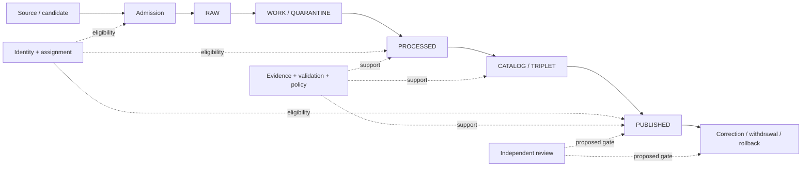
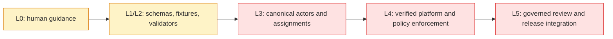

<!-- [KFM_META_BLOCK_V2]
doc_id: kfm://doc/governance/separation-of-duties
title: Separation of Duties — Release-Significant Independence and Authority Boundaries
type: governance-guide
version: v2-draft
status: draft; repository-grounded; proposed decision guidance; non-authoritative; no-release-effect
owners:
  - "@bartytime4life — verified CODEOWNERS review route only"
owner_status: "No accepted StewardshipAssignment, authenticated KFM actor identity, independent reviewer capacity, release authority, reviewer quorum, or approval is implied."
created: 2026-05-12
updated: 2026-08-23
policy_label: public
owning_root: docs/
current_path: docs/governance/SEPARATION_OF_DUTIES.md
responsibility: "Explain when KFM duties must be separated, how independence is established and evidenced, which bounded repository profiles exist, and what remains held before operational release separation can be claimed."
truth_posture: "CONFIRMED repository evidence and accepted Directory Rules placement / PROPOSED roles, matrix, thresholds, and release decision / CONFLICTED ReviewRecord machine surfaces / UNKNOWN operational actor, assignment, policy, release, and platform authority / NEEDS VERIFICATION current ruleset coupling and human capacity; cite-or-abstain"
evidence_snapshot:
  repository: bartytime4life/Kansas-Frontier-Matrix
  base_ref: main
  base_commit: 037acbe51838d166d7da06f9702ba5f1e1ec4b6b
  target_prior_blob: d8f24b5733c93eb867a026201316196e431ee6bc
  governance_readme_blob: 500f8bcad3a384160a561f1460617f0a13d42fcc
  review_duties_blob: df9848c324cbb1b7a3d63b32bd5e2fcf929ff4e9
  directory_rules_blob: fd49a0b83e55cef52c1124281f093e263526898d
  directory_rules_decision: ADR-0029 accepted
  adr_0024_blob: 57d46867c97a1c8d76ccdfbc12fc012bee3bd2ea
  adr_0024_effective_status: proposed
  codeowners_blob: dd2a84aa514d8ecd9208bc347f90f9a2ed37dd61
  review_record_contract_blob: 9641345d1e5d939dc59687a900e60a563d92c4f0
  governance_review_schema_blob: fe2f2223af46481e7fb19b0baa94f62ce9c6c855
  alternate_review_schema_blob: a053448d68e8379b92b12a16e6528275b975433c
  stewardship_assignment_contract_blob: 80c6fd4149deeb4172e2401dfaf741226380f085
  review_authority_binding_contract_blob: f156e100660e9fd97ca95e90092143a3cd6d62ee
  review_authority_binding_workflow_blob: d0dd3ea0900bf5a664bbf3e092735f8889ed6e41
  sensitive_release_review_contract_blob: 235ca86dd807c6842ca8c861f995371fe7758f64
  sensitive_release_review_workflow_blob: cc47e292f20a3a27c97430800f1a0a1c5a8c6a95
  release_policy_readme_blob: 8a6a91e18f29f6f961eac88270b385a95b86281e
  release_reviews_readme_blob: bf3058a5af8fc85aa04a25a36ed03541cd9eb657
  review_proof_readme_blob: 071a507bf1f9e2ff3e94d4a3618341ea004898b3
inspection_boundary: >-
  Current-session GitHub reads of main, the target, accepted Directory Rules decision and
  bytes, the governance landing page, current Review Duties guide, proposed ADR-0024,
  CODEOWNERS, ReviewRecord and StewardshipAssignment contracts, both ReviewRecord schema
  candidates, ReviewAuthorityBinding, SensitiveReleaseReviewClosure, their workflows,
  release-policy guidance, release-review guidance, and review-proof guidance. The active
  repository ruleset was not directly retrievable through the available connector; its prior
  inspected settings are reported only where current repository documents record them and
  remain NEEDS VERIFICATION before operational reliance. No actor was authenticated, no
  assignment was accepted, no live policy or release gate was evaluated, no governed review
  or release record was issued, and no promotion, release, deployment, publication,
  correction, withdrawal, or rollback was exercised.
related:
  - ./README.md
  - ./REVIEW_DUTIES.md
  - ./STEWARD_CHARTERS.md
  - ./ESCALATION.md
  - ./CONTRADICTION_HANDLING.md
  - ./DEPRECATION_PROCESS.md
  - ../doctrine/directory-rules.md
  - ../adr/ADR-0029-adopt-directory-governance-standard-v2.md
  - ../adr/ADR-0024-steward-separation-of-duties-for-release.md
  - ../registers/DRIFT_REGISTER.md
  - ../registers/VERIFICATION_BACKLOG.md
  - ../../contracts/governance/ReviewRecord.md
  - ../../contracts/governance/steward_assignment.md
  - ../../contracts/governance/review_authority_binding.md
  - ../../contracts/governance/sensitive_release_review_closure.md
  - ../../schemas/contracts/v1/governance/review_record.schema.json
  - ../../schemas/contracts/v1/review/review_record.schema.json
  - ../../policy/release/README.md
  - ../../release/reviews/README.md
  - ../../data/proofs/review/README.md
  - ../../.github/CODEOWNERS
  - ../../.github/workflows/review-authority-binding.yml
  - ../../.github/workflows/sensitive-release-review-closure.yml
tags: [kfm, governance, separation-of-duties, review, release, actor-identity, stewardship, sensitivity, correction, rollback]
notes:
  - "v2-draft is a same-path documentation-only reconciliation against current repository evidence."
  - "ADR-0029 is accepted and confirms the docs/ responsibility root; no path is created, moved, renamed, or retired."
  - "ADR-0024 is the current numbered release-separation decision and remains proposed. Historical ADR-S-09 vocabulary is retained only as source lineage."
  - "The repository contains substantive deterministic fixture-only review profiles, but they grant no authority and do not establish operational release separation."
  - "The two ReviewRecord schema candidates remain conflicted; this document does not select, normalize, alias, or migrate either candidate."
  - "No contract, schema, policy, fixture, validator, workflow, repository setting, review record, release record, or published artifact changes."
[/KFM_META_BLOCK_V2] -->

<a id="top"></a>

# Separation of Duties — Release-Significant Independence and Authority Boundaries

> **Authorship, review, policy, and release are different acts.** This guide explains when KFM proposes to require distinct actors, how independence must be bound to an exact subject and interval, which repository controls currently provide bounded support, and why none of those controls yet establishes operational release authority.

[](#0-status--authority)
[](../adr/ADR-0029-adopt-directory-governance-standard-v2.md)
[](../adr/ADR-0024-steward-separation-of-duties-for-release.md)
[](#6-required-receipts-and-artifacts)
[](#9-enforcement-posture-custom--tooling)
[](#15-verification-checklist-and-open-items)
[](#15-verification-checklist-and-open-items)

> [!IMPORTANT]
> **This document does not create duties, actors, assignments, approvals, release authority, or publication state.** The detailed release-separation decision is [`ADR-0024`](../adr/ADR-0024-steward-separation-of-duties-for-release.md), and it is still `proposed`. Operational authority would require accepted identity and assignment semantics, canonical machine profiles, live policy and release integration, independent human capacity, and state-bearing review and release records.

> [!WARNING]
> **Different labels or accounts do not prove independence.** CODEOWNERS currently routes the relevant repository roots to one verified account. A second username, bot, workflow, comment, schema-valid fixture, green check, pull request, or merge does not establish a second independently authorized KFM actor.

> [!CAUTION]
> **A positive fixture result is not approval.** `ReviewAuthorityBinding` can report `BOUND`, and `SensitiveReleaseReviewClosure` can report `CLOSED_FOR_SEPARATE_RELEASE_GATE`, but both are proposed-inactive, no-authority profiles. Their positive outcomes stop before actor authentication, policy evaluation, promotion, release, deployment, publication, or public use.

| Field | Current bounded value |
|---|---|
| **Document status** | `draft` human-facing governance guidance |
| **Tracked path** | `docs/governance/SEPARATION_OF_DUTIES.md` — **CONFIRMED** repository-present, same-path update |
| **Placement authority** | Accepted [`ADR-0029`](../adr/ADR-0029-adopt-directory-governance-standard-v2.md) and adopted [`directory-rules.md`](../doctrine/directory-rules.md) place human explanation under `docs/` |
| **Detailed release-SoD decision** | [`ADR-0024`](../adr/ADR-0024-steward-separation-of-duties-for-release.md) is source status `draft`, effective decision status `proposed` |
| **Repository review route** | [`@bartytime4life`](../../.github/CODEOWNERS) through CODEOWNERS; routing is not independence, approval, or release authority |
| **Review-event meaning** | Draft semantic contract at [`contracts/governance/ReviewRecord.md`](../../contracts/governance/ReviewRecord.md) |
| **Review-event machine shape** | **CONFLICTED:** one strict proposed governance schema and one empty/permissive proposed review scaffold |
| **Assignment meaning** | Draft [`StewardshipAssignment`](../../contracts/governance/steward_assignment.md); no accepted operational assignment roster was verified |
| **Bounded executable support** | Fixture-only `ReviewAuthorityBinding` and T3/T4 `SensitiveReleaseReviewClosure` |
| **Release-policy posture** | `policy/release/` is scaffolded and explicitly not an active release-policy system |
| **Release-review instances** | `release/reviews/` remains guidance/support; no parent-level governed release review was established here |
| **Operational separation** | `UNKNOWN / HOLD` |
| **Release, deployment, publication effect** | None |
| **Evidence snapshot** | `main@037acbe51838d166d7da06f9702ba5f1e1ec4b6b` |

---

## Quick navigation

[§1 Purpose](#1-purpose) ·
[§2 Doctrinal basis](#2-doctrinal-basis) ·
[§3 Roles](#3-roles) ·
[§4 SoD matrix](#4-separation-of-duties-matrix) ·
[§5 Materiality & maturity](#5-materiality-and-maturity-triggers) ·
[§6 Receipts](#6-required-receipts-and-artifacts) ·
[§7 Lifecycle gates](#7-lifecycle-gates-and-required-reviewers) ·
[§8 Sensitive lanes](#8-sensitive-lane-defaults) ·
[§9 Enforcement](#9-enforcement-posture-custom--tooling) ·
[§10 Anti-patterns](#10-anti-patterns) ·
[§11 Decision work](#11-open-adr-backlog) ·
[§12 Review burden](#12-review-burden-for-this-document) ·
[§13 Related](#13-related-doctrine-and-registers) ·
[§14 Glossary](#14-glossary) ·
[§15 Verification & rollback](#15-verification-checklist-and-open-items)

---

## 0. Status & Authority

### 0.1 Authority order

| Question | Controlling surface | Current status |
|---|---|---|
| Where does this human guide belong? | Accepted ADR-0029, adopted Directory Rules, and the repository-present path | **CONFIRMED** under `docs/`; no structural change |
| Is release separation accepted? | ADR-0024 and the canonical ADR index | **PROPOSED**, not accepted |
| What do review and assignment objects mean? | `contracts/governance/` | Draft semantic contracts |
| What machine shape is valid? | Accepted schema authority and reviewed object-family decision | **CONFLICTED / HOLD** for ReviewRecord; proposed for related profiles |
| Who is eligible to review or release? | Accepted actor identity, alias resolution, scoped assignment, interval, conflict/recusal evidence, and policy | **UNKNOWN / HOLD** |
| What is admissible? | Accepted policy source through an accepted evaluator | Release-policy lane remains scaffolded |
| What changed lifecycle or public state? | State-bearing promotion, release, correction, withdrawal, and rollback records | Not established by this guide |
| What does GitHub enforce? | Current platform configuration and exact required-check coupling | **NEEDS VERIFICATION** before operational reliance |

### 0.2 Same-path Directory Rules basis

This file is a human governance guide. Its one authority owner is the `docs/` responsibility root. Updating the tracked path does not create a new root, a parallel decision registry, a schema authority, a policy authority, or a release lane.

| Responsibility | Owning surface | Relationship to this document |
|---|---|---|
| Human explanation of independence and duty separation | `docs/governance/` | **Owned here** |
| Decision to adopt a release-SoD model | `docs/adr/` | ADR-0024; still proposed |
| Review and assignment meaning | `contracts/governance/` | Referenced; not redefined |
| Machine-checkable shape | `schemas/contracts/v1/` | Referenced; conflicts disclosed |
| Admissibility and release restrictions | `policy/` | Separate authority |
| Synthetic cases and deterministic validation | `fixtures/`, `tests/`, `tools/validators/`, workflows | Bounded evidence only |
| Review-support proofs | `data/proofs/review/` | Separate support family |
| Release review and state-bearing decisions | `release/` | Separate release-control family |
| Repository routing and merge controls | `.github/` and platform settings | Platform controls, not KFM release authority |

### 0.3 Current evidence boundary

**CONFIRMED:** KFM has a repository-present governance lane; accepted Directory Rules; a proposed numbered release-SoD ADR; draft review and assignment contracts; two ReviewRecord schema candidates; deterministic fixture-only authority-binding and sensitive-review profiles; CODEOWNERS routing; release-policy guidance; release-review guidance; and review-proof guidance.

**PROPOSED:** the role catalogue, incompatibility rules, action matrix, materiality thresholds, maturity progression, and operational release-separation model.

**CONFLICTED:** ReviewRecord schema home, schema maturity, contract/schema vocabulary, and case-sensitive contract linkage.

**UNKNOWN / HOLD:** authenticated actors, accepted assignments, independent reviewer capacity, live policy, governed release review, release authority, signer custody, operational correction/rollback, and deployed enforcement.

**NEEDS VERIFICATION:** the current active ruleset configuration, required-check coupling, branch-protection significance, external identity systems, and any operational records outside the inspected repository surfaces.

[Back to top](#top)

---

## 1. Purpose

Separation of Duties (SoD) prevents a single actor from producing, validating, authorizing, and exposing a material KFM change without an independently attributable checkpoint. It is especially important where a change affects evidence meaning, rights, sensitivity, public exposure, policy, release, correction, rollback, or trust roots.

This guide answers six questions:

1. **Which duties are incompatible for the same material subject?**
2. **What qualifies a reviewer as independent and eligible?**
3. **Which actions may remain self-reviewed when risk is demonstrably low?**
4. **Which evidence must bind author, reviewer, role, subject, interval, decision, correction, and rollback?**
5. **What repository controls exist now, and what do they actually prove?**
6. **What must remain held until ADR-0024 and operational controls are accepted and graduated?**

### 1.1 Operating rule

> **For a release-significant or sensitive transition, the author or producer must not be the sole actor who validates independence, approves the review, evaluates the release policy, and authorizes public state.**

That rule does not require a second person for every typo or deterministic fixture edit. It does require an explicit risk classification, a bounded next gate, and a truthful record of missing capacity. “The tool did not block me” is not evidence that separation was unnecessary.

### 1.2 What this document can establish

- the proposed role and incompatibility vocabulary;
- a repository-grounded working matrix for review and release participation;
- the minimum evidence needed to assess independence;
- current relationships among documentation, contracts, schemas, policy, fixtures, validators, workflows, proofs, release records, and platform routing;
- fail-closed behavior when identity, authority, evidence, policy, rights, sensitivity, correction, or rollback is unresolved;
- adoption and graduation work still required.

### 1.3 What this document cannot establish

- that a person, team, service, or account has an accepted `StewardshipAssignment`;
- that two accounts represent two independent actors;
- that a reviewer is current, conflict-free, authorized, or within scope;
- that either ReviewRecord schema candidate is canonical;
- that policy evaluated a live release;
- that a review record authorizes promotion, release, deployment, publication, correction, withdrawal, rollback, or public use;
- that current GitHub settings enforce the proposed matrix;
- that an emergency containment action permanently changes policy or release authority;
- that a generated explanation, map, tile, graph, model result, dashboard, or AI output is evidence or approval.

### 1.4 Relationship to Review Duties

[`REVIEW_DUTIES.md`](./REVIEW_DUTIES.md) explains **how a reviewer conducts and hands off a review**. This document explains **when distinct actors or role chains are proposed to be required** and which combinations are incompatible. Neither document creates the underlying object meaning, machine shape, policy, platform enforcement, or release state.

[Back to top](#top)

---

## 2. Doctrinal Basis

### 2.1 Operating-law posture

KFM's governing posture is to separate policy-significant release duties when maturity and consequence justify it. The separation protects the same trust boundaries as:

- `RAW -> WORK / QUARANTINE -> PROCESSED -> CATALOG / TRIPLET -> PUBLISHED`;
- public clients using governed interfaces and released public-safe carriers rather than canonical/internal stores;
- cite-or-abstain and EvidenceRef-to-EvidenceBundle resolution;
- policy-aware, fail-closed treatment of rights, sensitivity, and harmful precision;
- first-class correction, withdrawal, rollback, and supersession;
- AI as an interpretive surface rather than truth, policy, review, or release authority.

### 2.2 Current decision record

The old edition referenced `ADR-S-09` as a pending source-corpus label. Current repository evidence identifies [`ADR-0024 — Steward Separation of Duties for Release`](../adr/ADR-0024-steward-separation-of-duties-for-release.md) as the numbered decision record.

ADR-0024 currently has:

- source status `draft`;
- effective decision status `proposed`;
- no accepted operational authority;
- substantive fixture-only review-binding profiles;
- explicit holds on actor authentication, accepted assignment, live policy, independent capacity, governed release records, and release integration.

This document operationalizes the **proposed** design for human readers. It does not accept ADR-0024.

### 2.3 Independence is more than different names

A separation claim must bind at least:

| Dimension | Required question |
|---|---|
| **Actor** | Which stable person, team, or service identity acted, and which aliases resolve to it? |
| **Assignment** | What accepted authority basis grants the role for this target? |
| **Subject** | Which exact immutable object, digest, release candidate, correction, or transition was reviewed? |
| **Role** | Which role was exercised, and what jurisdiction did it cover? |
| **Time** | Was the assignment active for the review interval? |
| **Independence** | Is the reviewer distinct from the author, producer, proposer, detector, or prohibited role chain? |
| **Conflict** | Were conflicts, recusals, delegations, and relationships disclosed and resolved? |
| **Evidence** | Which evidence, validation, policy, rights, sensitivity, correction, and rollback context was available? |
| **Outcome** | Which bounded finding was recorded, with reasons, obligations, expiry, and supersession? |
| **Next gate** | Which separate policy, promotion, release, correction, or rollback authority acts next? |

A GitHub username or role label satisfies none of these dimensions by itself.

### 2.4 Anti-collapse rule

Keep these facts separate:

```text
repository routing
  != accepted stewardship assignment
  != authenticated KFM actor
  != independent reviewer eligibility
  != ReviewRecord validity
  != policy ALLOW
  != promotion approval
  != release authorization
  != deployment
  != publication
```

A commit proves bytes exist at a commit. A workflow proves only the profile it actually ran. A merge proves neither independent release review nor public state.

[Back to top](#top)

---

## 3. Roles

The roles below are **proposed responsibility labels**, not verified teams, jobs, or staffed positions. The draft [`StewardshipAssignment`](../../contracts/governance/steward_assignment.md) contract contains a broader role vocabulary, but no accepted operational assignment roster was verified.

### 3.1 Proposed role catalogue

| Role | Proposed responsibility | Typical subjects | Cannot establish alone |
|---|---|---|---|
| **Source steward** | Source identity, role, terms, cadence, admission, and initial sensitivity posture | `SourceDescriptor`, source-family admission | Unresolved rights, sovereignty, or public release |
| **Domain steward** | Domain meaning, contracts, transforms, validators, and domain-scoped quality | Domain records, transforms, validation reports | Public release or policy override |
| **Sensitivity reviewer** | Redaction, generalization, withholding, harmful-precision, and exposure review | Archaeology, rare species, living-person, genomic, infrastructure, private-land contexts | Rights-holder consent or release authority |
| **Rights-holder representative** | Sovereignty, cultural/community authority, consent, license, and permitted-use review | Rights-constrained or community-governed subjects | Technical validation or public release alone |
| **Release authority** | Separate decision for a named PUBLISHED transition and rollback authorization | Release candidate, manifest, public-safe carrier | Evidence creation, policy substitution, or prohibited self-approval |
| **Correction reviewer** | Post-publication correction, withdrawal, supersession, and rollback assessment | `CorrectionNotice`, withdrawal, rollback proposal | Silent mutation of published state |
| **AI surface steward** | Focus Mode templates, evidence/citation behavior, policy bindings, and `AIReceipt` audit | AI and public interpretation surfaces | Truth, evidence, policy, or release authority |
| **Docs steward** | Governance docs, ADR/index integrity, source lineage, drift, and supersession documentation | `docs/`, indexes, registers, doctrine editions | Contract, schema, policy, or release authority by prose |

Support roles such as contract steward, schema steward, policy steward, validation/CI steward, security reviewer, and platform administrator may be required by a particular change. Their exact semantics and staffing remain proposed until accepted assignments and role vocabularies are closed.

### 3.2 Eligibility and independence

A reviewer is eligible only when the exact subject and interval support all required facts:

- stable actor identity and alias resolution;
- accepted, current, scoped authority basis;
- role and jurisdiction covering the requested next gate;
- effective interval including the review time;
- independence from prohibited authors, producers, proposers, detectors, or role-chain actors;
- disclosed conflicts, recusals, delegations, and temporary exceptions;
- safe access to the evidence and restricted context needed for review;
- ability to record an abstain, deny, hold, escalation, or requested change without retaliation from the producing role.

Missing identity, assignment, independence, conflict evidence, or safe review access fails closed. It is not repaired by adding a second account name after the fact.

### 3.3 Role-compatibility quick rules

| Pairing for the same material subject | Proposed default | Reason |
|---|---|---|
| Author/producer + release authority | **Forbidden** | The release decision is the public-state boundary |
| Author/producer + sensitivity reviewer | **Forbidden** for sensitive exposure | Exposure review must challenge the producing perspective |
| Author/producer + rights-holder representative | **Forbidden** unless the author is independently authorized to act in that rights role and the decision explicitly permits it | Authorship does not confer sovereignty, consent, or rights authority |
| Detector + correction reviewer | **Separate when steward-significant** | Detection and disposition have different incentives |
| Validator author + validator runner | Conditionally allowed for deterministic routine profiles | A self-run test is implementation evidence, not release approval |
| Contract/schema author + approving authority | Separate when semantics, compatibility, policy, or public behavior changes | The author must not define and ratify the trust boundary alone |
| AI template author + AI surface approval | **Forbidden** for public/policy-binding behavior | Generated behavior and its review must not collapse |
| Platform administrator + release approver | Separate for trust-root or ruleset changes | Control over enforcement is not the same as authority over a release |
| Docs author + docs reviewer | Conditionally allowed for typo/link-only maintenance | This is repository maintenance, not acceptance of governance meaning |
| Bot/workflow + human author | **Not independent by default** | Automation executes declared logic; it is not a second accountable authority |

### 3.4 Recusal and delegation

A role holder must recuse when they:

- authored or materially produced the subject and the matrix requires independence;
- control both the assignment and the review outcome without an accepted bootstrap exception;
- have an undisclosed personal, financial, organizational, source, or rights conflict;
- lack safe access to the evidence needed for review;
- cannot evaluate the subject within their assigned scope;
- are asked to approve a stale, changed, or differently scoped subject.

Delegation must preserve subject, role, interval, evidence access, conflict disclosure, and accountability. An informal “looks good” handoff is not delegation evidence.

[Back to top](#top)

---

## 4. Separation-of-Duties Matrix

> [!IMPORTANT]
> The matrix is **PROPOSED design guidance** pending acceptance of ADR-0024 and operational authority bindings. It is not current platform enforcement. Loosening a sensitive, public, rights-bearing, or trust-root row is ADR-class work.

| # | Governed action | May author/producer also approve? | Proposed distinct participation | Minimum state-bearing support |
|---|---|---|---|---|
| 1 | Source admission (`— -> RAW`) | Routine public source: possibly; unresolved rights, sovereignty, or sensitivity: **No** | Source steward; rights-holder representative and sensitivity reviewer when triggered | Source identity/role/terms, authority basis, intended use, policy posture |
| 2 | Normalization (`RAW -> WORK / QUARANTINE`) | Routine deterministic transform: possibly; sensitivity-relevant transform: **No** | Domain steward; sensitivity reviewer when exposure changes | Input/output identity, transform spec, validation, withheld fields, replay/rollback |
| 3 | Validator, fixture, or test profile | Yes for routine implementation | Independent domain/validation audit according to consequence | Profile identity, positive/negative fixtures, deterministic result, declared limits |
| 4 | Contract, schema, policy, or identity semantics | **No** when authority, compatibility, admissibility, or public behavior changes | Relevant semantic/machine/policy steward plus affected consumer owner | Decision basis, compatibility impact, fixtures/tests, migration, correction, rollback |
| 5 | Promotion to `PROCESSED` or `CATALOG / TRIPLET` | Routine non-sensitive: possibly; sensitive or evidence-significant: **No** | Domain steward plus sensitivity/evidence review when triggered | Evidence closure, validation, provenance, policy posture, correction path |
| 6 | Release to `PUBLISHED` | **No when materiality applies** | Author/producer distinct from release authority; rights-holder and sensitivity review where applicable | Fixed subject, ReviewRecord, policy decision, release manifest/candidate, rollback target |
| 7 | Sensitive or rights-constrained release | **No — always separate** | Sensitivity reviewer plus release authority; rights-holder representative where applicable; reviewer outside author role chain | Public-safe transform, independent binding, evidence, policy, correction, rollback |
| 8 | Correction, withdrawal, supersession, or rollback | **No when steward-significant** | Detector/author distinct from correction reviewer; release authority for public-state change | Prior state, defect evidence, blast radius, replacement/rollback, invalidation plan |
| 9 | AI template, retrieval, citation, or policy-binding change | **No** for public or policy-significant behavior | AI surface steward plus relevant evidence/policy/domain reviewer | Citation and abstain/deny tests, prompt-injection posture, output contract, rollback |
| 10 | Doctrine, ADR, Directory Rules, or governance-standard authority change | **No** | Docs/architecture governance plus affected responsibility owner; accepted ADR where required | Source ledger, contradiction analysis, migration, supersession, rollback |
| 11 | Trust root, signer, repository ruleset, branch protection, secret, or privileged workflow change | **No** | Security/platform reviewer distinct from proposer; affected governance/release owner | Threat model, before/after config, anti-bypass evidence, audit, disable/rollback |
| 12 | Emergency containment that only reduces exposure | A responder may act within a pre-authorized containment scope | Independent post-event review before permanence or re-expansion | Incident record, exact containment, expiry, preserved evidence, correction/rollback |

### 4.1 Applying the matrix

1. Fix the exact subject, digest, scope, requested transition, and audience.
2. Classify the action and materiality under §5.
3. Identify prohibited role combinations.
4. Resolve actor identity, assignment, interval, conflicts, and access.
5. Collect the support packet in §6.
6. Record the bounded review outcome.
7. Hand off to the separate policy, promotion, release, correction, rollback, or platform gate.
8. Re-review when subject bytes, scope, evidence, policy, assignment, role chain, or requested transition changes.

### 4.2 “Routine” is not a loophole

The proposer bears the burden of showing that a self-reviewed action is routine. A routine action must not:

- alter public exposure or lifecycle state;
- change evidence, authority, rights, sensitivity, or policy meaning;
- weaken a validator, negative test, receipt, correction, rollback, or citation requirement;
- change a trust root, privileged workflow, or release path;
- create or resolve a disputed canonical home;
- turn a proposal, fixture, or scaffold into operational authority.

When that showing is absent, classify the action as material or hold it for review.

### 4.3 Bootstrap limitation

A project with one verified account may lack independent reviewer capacity. That condition must be recorded as a limitation, not disguised as completed separation.

A bootstrap exception, if KFM chooses one, must be:

- accepted through the applicable decision process;
- narrow in subject, role, time, and permitted action;
- explicit about the missing independent capacity;
- prohibited for unsafe sensitive or public-state transitions unless the decision specifically addresses them;
- auditable and revocable;
- paired with correction, rollback, and later independent-review triggers.

ADR-0029 records a transparent bootstrap exception for its own accepted directory-governance decision. That does not create a general release-SoD exception.

[Back to top](#top)

---

## 5. Materiality and Maturity Triggers

### 5.1 Materiality triggers

Require separate review or approval when a change can materially affect any of the following:

- PUBLISHED state, public artifacts, governed API behavior, map delivery, exports, or external consumers;
- source admission, source role, evidence meaning, provenance, identity, or temporal/spatial scope;
- contract/schema compatibility, policy outcome, authority assignment, or reviewer eligibility;
- rights, consent, sovereignty, cultural/community authority, living-person or genomic data;
- exact or harmful spatial precision, archaeology, rare species, infrastructure, private land/title, or protected operational details;
- AI retrieval, citation closure, abstention/denial, public interpretation, or model authority;
- correction, withdrawal, supersession, rollback, cache invalidation, or published lineage;
- trust roots, signatures, actor identity, reviewer assignments, repository settings, privileged workflows, or auditability;
- removal or weakening of a validator, negative test, receipt, evidence requirement, correction path, or rollback target.

### 5.2 Review-risk classification

| Risk class | Typical scope | Proposed SoD posture |
|---|---|---|
| **LOW** | Typo, stable-link repair, comment-only clarification, deterministic fixture maintenance with no changed meaning | Self-review may be acceptable as repository maintenance; no governance approval implied |
| **MODERATE** | Shared docs, reusable validator, non-sensitive schema-compatible implementation, workflow orchestration without privilege expansion | At least one affected owner review recommended; separate review when compatibility or trust behavior changes |
| **HIGH** | Contract/schema semantics, policy, source admission, lifecycle promotion, public UI/API behavior, sensitive domain, correction, rollback | Independent role review required under the proposed matrix |
| **CRITICAL** | Active exposure, trust root, identity/authority control, sensitive public release, destructive rollback, emergency access | Fail closed; independent security/governance/release participation and incident-grade evidence required |
| **UNKNOWN** | Scope or impact cannot be classified | `HOLD`; narrow the subject or collect evidence before proceeding |

Risk is about consequence and blast radius, not confidence in the author.

### 5.3 Maturity ladder

| Level | Required evidence | Safe claim | Prohibited inference |
|---|---|---|---|
| **L0 — guidance** | Human docs and proposed matrix | SoD design exists | Roles are accepted, staffed, or enforced |
| **L1 — machine candidate** | Draft contract/schema and deterministic fixtures | A candidate machine profile exists | Candidate is canonical or authoritative |
| **L2 — bounded execution** | Validator, negative cases, tests, no-authority result | A named fixture profile validates | Live actor, policy, release, or publication authority |
| **L3 — identity and assignment** | Canonical actors, aliases, accepted assignments, intervals, conflicts, recusal | Reviewer eligibility can be evaluated | Platform or release enforcement |
| **L4 — platform enforcement** | Verified ruleset/branch/CODEOWNERS/check coupling, anti-bypass tests, audit | Required participation is enforced for named repository operations | KFM release/publication unless release controls also close |
| **L5 — governed release integration** | Governed review records, live policy, release manifests, signer custody, correction/rollback drills, operations evidence | A named reviewed release path is operational | Universal authority outside that profile |

### 5.4 Current bounded maturity

- **CONFIRMED:** L0 guidance exists.
- **CONFIRMED bounded:** parts of L1/L2 exist for ReviewRecord candidate validation, `ReviewAuthorityBinding`, and T3/T4 `SensitiveReleaseReviewClosure`.
- **CONFLICTED:** ReviewRecord machine authority is not closed.
- **UNKNOWN / HOLD:** L3 actor identity, accepted assignments, conflict/recusal handling, and independent capacity.
- **NEEDS VERIFICATION:** current L4 platform settings and exact required-check coupling.
- **UNKNOWN / HOLD:** L5 governed release review, live policy, release authority, signer custody, correction/rollback operation, and public release.

The earlier M0–M3 terminology is retained as source lineage in Appendix A. This edition uses L0–L5 to align with current repository-grounded review guidance.

[Back to top](#top)

---

## 6. Required Receipts and Artifacts

SoD is not demonstrated by prose alone. The exact subject, actor, assignment, role, interval, conflicts, review, policy, release, and rollback must be linked through their owning object families.

### 6.1 Current support surfaces

| Surface | Intended role | Current repository posture | Authority limit |
|---|---|---|---|
| [`StewardshipAssignment`](../../contracts/governance/steward_assignment.md) | Records bounded responsibility, target, role, actor/team, interval, basis, partner roles, and escalation | Draft semantic contract; proposed schema; no accepted operational roster verified | Does not authenticate an actor, prove review, evaluate policy, or authorize release |
| [`ReviewRecord`](../../contracts/governance/ReviewRecord.md) | Records a subject-bound review event, role, basis, findings, disposition, conditions, expiry, and related release/correction context | Draft semantic contract | Not evidence, policy, promotion, release, correction, rollback, or publication authority |
| Governance ReviewRecord schema | Strict proposed shape with required fields and closed additional properties | Proposed; narrow vocabulary; wrong-case contract link | Not canonical while conflict remains |
| Alternate ReviewRecord schema | Empty/permissive scaffold | Proposed scaffold | Provides no operational validation and overlaps the governance candidate |
| [`ReviewAuthorityBinding`](../../contracts/governance/review_authority_binding.md) | Checks declared review, assignment, subject, interval, disposition, and author/reviewer separation | Proposed-inactive, fixture-only, deterministic | `BOUND` is not actor authentication, approval, write authority, or release |
| [`SensitiveReleaseReviewClosure`](../../contracts/governance/sensitive_release_review_closure.md) | Checks T3/T4 candidate, independent reviewer, role-chain separation, evidence/policy/correction/rollback references | Proposed-inactive, fixture-only, deterministic | Positive outcome stops at a separate release gate |
| `PolicyDecision` | Records admissibility outcome and obligations through an accepted policy profile | Release-policy system remains scaffolded | Policy is not release state |
| Promotion/release record | Changes the named lifecycle or public state through accepted authority | Operational closure not established here | Review cannot substitute for it |
| Correction/withdrawal/rollback record | Changes or reverses public state with preserved lineage and invalidation | Operational closure not established here | A comment or file edit is not a correction event |
| Review proof | Binds review basis, evidence, validation, policy, conditions, freshness, and closure | `data/proofs/review/` is guidance/README only | Proof support does not perform review or release |

### 6.2 Review and release evidence packet

A release-significant SoD packet should bind, at minimum:

1. exact subject identity, digest, version, and immutable locator;
2. requested next gate and public/lifecycle effect;
3. author, producer, proposer, and detector identities as applicable;
4. reviewer actor, role, assignment basis, interval, aliases, conflicts, recusal, and independence;
5. evidence references and resolved EvidenceBundle status;
6. validation profile, positive and negative results, and execution receipts;
7. policy, rights, sensitivity, access, sovereignty/community authority, and public-safe transformation;
8. review finding, reasons, obligations, expiry, and supersession;
9. promotion/release candidate or manifest reference;
10. correction, withdrawal, rollback, cache, and downstream invalidation targets.

Missing required context produces a hold, abstention, denial, or error according to the governing profile. It does not produce assumed approval.

### 6.3 ReviewRecord conflict

The two current schema candidates are not interchangeable:

| Candidate | Current shape | Material conflict |
|---|---|---|
| `schemas/contracts/v1/governance/review_record.schema.json` | Strict object with `review_id`, `subject_ref`, narrow role and decision enums, reasons, obligations, and time | Does not express the richer draft contract; metadata points to lowercase `review_record.md`, while the tracked file is `ReviewRecord.md` |
| `schemas/contracts/v1/review/review_record.schema.json` | Empty properties and `additionalProperties: true` | Does not validate operational ReviewRecord semantics and creates a second candidate home |

Required posture: **CONFLICTED / HOLD**. This guide must not choose, merge, alias, translate, or migrate either candidate. Resolution requires a scoped authority decision, contract/schema synchronization, consumer inventory, compatibility and migration analysis, positive and negative fixtures, validation, documentation, and rollback.

### 6.4 Receipt, proof, review, and release anti-collapse

| Object or signal | What it can prove | What it cannot prove |
|---|---|---|
| Workflow run | The named workflow ran with a reported result | Actor authority, policy truth, release, publication |
| Validation report | Conformance to the named profile | Evidence truth or release permission |
| Generated receipt | What a producer claims it generated and hashed | Human review, correctness, policy, release |
| ReviewRecord | A structured review event under its accepted profile | Policy or public state |
| Review proof | Support for audit of review basis and closure | The review event or release decision |
| PolicyDecision | Admissibility under a named policy context | Promotion, release, deployment, publication |
| ReleaseManifest/decision | State-bearing release action under accepted authority | Source truth or evidence support by itself |
| GitHub approval | Platform review evidence | KFM governance approval unless explicitly bound by accepted rules |

[Back to top](#top)

---

## 7. Lifecycle Gates and Required Reviewers

This gate map is **proposed**. It explains where separation belongs without claiming that the repository currently enforces each gate.


```mermaid
flowchart LR
    S[Source / candidate] --> A[Admission]
    A --> R[RAW]
    R --> W[WORK / QUARANTINE]
    W --> P[PROCESSED]
    P --> C[CATALOG / TRIPLET]
    C --> L[PUBLISHED]
    L --> X[Correction / withdrawal / rollback]

    I[Identity + assignment] -. eligibility .-> A
    I -. eligibility .-> P
    I -. eligibility .-> L
    E[Evidence + validation + policy] -. support .-> P
    E -. support .-> C
    E -. support .-> L
    V[Independent review] -. proposed gate .-> L
    V -. proposed gate .-> X
```

| Transition or action | Proposed required participation | Required support | Failure posture |
|---|---|---|---|
| Source admission | Source steward; rights/sensitivity roles when triggered | Source identity, role, terms, intended use, authority basis, policy | Do not admit; quarantine or hold |
| RAW -> WORK / QUARANTINE | Domain steward; sensitivity review if transform changes exposure | Transform identity, input/output digest, validation, replay | Quarantine or error |
| WORK -> PROCESSED | Domain/evidence review; sensitivity review when triggered | Evidence support, validation, provenance, policy, correction path | Stay in WORK or quarantine |
| PROCESSED -> CATALOG / TRIPLET | Domain steward; catalog/evidence closure | Catalog identity, EvidenceBundle, projection lineage | Hold at PROCESSED |
| CATALOG / TRIPLET -> PUBLISHED | Author distinct from release authority when material; rights/sensitivity roles as applicable | Review, policy, release manifest/decision, correction and rollback | Hold; no public-state change |
| PUBLISHED -> corrected/withdrawn/rolled back | Detector/author distinct from correction reviewer when material; release authority for public state | Prior state, defect support, invalidation, replacement or rollback | Preserve current state with visible stale/hold notice until action is valid |
| Governance/trust-root change | Independent governance/security/platform review | Decision basis, threat model, migration, audit, disable and rollback | Hold the authority change |

### 7.1 Gate-closure rule

A transition is not closed until:

- the exact subject is fixed and unchanged;
- every required reference resolves under its accepted profile;
- the applicable policy evaluated and recorded a finite outcome;
- required reviewer identity, assignment, interval, conflict, and independence are established;
- obligations and conditions are closed or explicitly block the next gate;
- release-significant actions have correction, withdrawal, rollback, cache, and invalidation support;
- the state-bearing authority—not this document, workflow, or review prose—records the transition.

### 7.2 Promotion is not a file move

Writing bytes into `data/published/`, `release/`, a catalog, a GitHub release, a branch, or a web host does not make them a governed release. A public client must not infer authority from path, filename, badge, signature presence, or merge status.

[Back to top](#top)

---

## 8. Sensitive-Lane Defaults

For sensitive or rights-constrained subjects, the proposed default is simple:

> **The author or producer must not be the sole sensitivity reviewer or release authority.**

### 8.1 Current tier evidence

The current repository contains a fixture-only `SensitiveReleaseReviewClosure` profile for **T3/T4** candidates. That proves only a bounded synthetic profile exists. It does not establish:

- a universal accepted T0–T4 classification system;
- that a real subject has a particular tier;
- that domain names determine sensitivity automatically;
- that a positive fixture result permits release;
- that rights, consent, sovereignty, or public-safe transformation were resolved for live data.

Use tier labels only when an accepted policy or contract defines them for the exact subject.

### 8.2 Triggers requiring independent sensitive review

Independent sensitive review is proposed when a subject includes or could reveal:

- archaeological sites, sacred/cultural locations, human remains, or community-governed heritage;
- rare species or ecologically harmful precision;
- living-person, household, genealogy, genomic, or health-related data;
- private land/title joins or person-parcel relationships;
- critical infrastructure locations, dependencies, vulnerabilities, or operational details;
- restricted source terms, licensed material, consent conditions, or sovereignty/community authority;
- redaction, aggregation, generalization, delay, clipping, withholding, or denial logic;
- 3D, terrain, imagery, point-cloud, graph, search, or cross-layer combinations that can reconstruct protected detail.

### 8.3 Minimum sensitive-review packet

In addition to §6.2, record:

- the exact sensitivity and rights trigger;
- internal and proposed public representation;
- transform method and receipt;
- reconstruction and side-channel analysis;
- reviewer set and independence from the author role chain;
- consent, sovereignty, community authority, and permitted-use basis where applicable;
- expiry, re-review, correction, withdrawal, rollback, cache, and derivative invalidation;
- a public-safe reason when the outcome is deny, hold, generalize, delay, or abstain.

### 8.4 Protection occurs before delivery

Client-side hiding, style filters, disabled popups, obscured labels, or UI-only access checks are not adequate protection. Redaction, generalization, aggregation, or withholding must occur before ordinary public delivery, with reviewable transformation and release records.

### 8.5 Restricted review evidence

Do not place restricted payloads, exact sensitive geometry, private identities, genomic material, security details, credentials, or control-defeating transformation parameters into ordinary public PR comments, fixtures, workflow logs, or review records. Use governed references and safe summaries; fail closed when the reviewer cannot access the needed context safely.

[Back to top](#top)

---

## 9. Enforcement Posture (Custom → Tooling)

### 9.1 Current repository controls

| Surface | Confirmed repository evidence | What it does not establish |
|---|---|---|
| CODEOWNERS | All inspected trust-bearing roots route to `@bartytime4life` | Independent reviewer capacity, accepted assignment, approval, release authority |
| ReviewRecord validator/profile | Fixture-scoped subject/role/authority/freshness/separation checks | Live actor authentication, accepted assignment, policy, release |
| ReviewAuthorityBinding workflow | Read-only, deterministic, no-network tests and generated-receipt check | Write permission, mutation, promotion, release, deployment, publication |
| SensitiveReleaseReviewClosure workflow | Read-only, fixture-only T3/T4 closure validation | Sensitive release or public-use permission |
| Release-policy lane | Explicitly scaffolded and not an active release-policy system | Live admissibility or release enforcement |
| Release-review lane | Guidance and parent lane; no parent-level governed release review established by the inspected material | State-bearing release decision |
| Review-proof lane | README/guidance and bounded candidate validation references | Operational review-proof producer, review authority, public delivery |

Current repository documents also record an active `Protect` ruleset that requires pull-request mediation and resolved review threads while requiring zero approving reviews and no code-owner review at their evidence snapshots. The available connector could not directly re-fetch the ruleset in this task. Treat those settings as **NEEDS VERIFICATION** before operational reliance.

### 9.2 Tooling progression


```mermaid
flowchart LR
    A[L0: human guidance] --> B[L1/L2: schemas, fixtures, validators]
    B --> C[L3: canonical actors and assignments]
    C --> D[L4: verified platform and policy enforcement]
    D --> E[L5: governed review and release integration]

    style A fill:#fef3c7,stroke:#d97706
    style B fill:#fef3c7,stroke:#d97706
    style C fill:#fee2e2,stroke:#dc2626
    style D fill:#fee2e2,stroke:#dc2626
    style E fill:#fee2e2,stroke:#dc2626
```

KFM is currently at L0 with bounded L1/L2 profiles. Operational release separation remains held.

### 9.3 Required controls before operational claim

An operational SoD claim for a named profile requires at least:

1. accepted ADR-0024 or a successor decision;
2. canonical actor identity and alias handling;
3. accepted, scoped, time-bounded assignments;
4. conflict, recusal, delegation, and bootstrap-exception handling;
5. one canonical ReviewRecord contract/schema/profile and migration path;
6. accepted policy evaluator and digest-bound bundle;
7. exact subject and current-head binding;
8. platform and workflow controls that cannot be bypassed through normal paths;
9. governed review and release records;
10. independent human capacity for the required roles;
11. sensitive and negative-path tests;
12. signer/trust-root custody where signatures matter;
13. correction, withdrawal, rollback, cache, and derivative invalidation drills;
14. auditable operational evidence.

### 9.4 Workflow result interpretation

A workflow may report:

- the fixture profile is internally coherent;
- a declared binding has finite `BOUND`, `HOLD`, or `DENY`;
- a sensitive closure has finite `CLOSED_FOR_SEPARATE_RELEASE_GATE`, `HOLD`, or `DENY`;
- a generated receipt matches current bytes.

It cannot report that a real actor is authorized, policy permitted the live action, a release occurred, or a public artifact is trustworthy unless a separately accepted operational profile explicitly binds those facts.

### 9.5 Break-glass and emergency containment

Emergency action may be allowed only to reduce exposure or preserve evidence under a pre-authorized, auditable scope. It must not become a hidden normal path.

A valid containment procedure should:

- define who may invoke it and for which conditions;
- limit actions to deny, restrict, disable, revoke, quarantine, or preserve;
- record before/after state and exact actor;
- expire automatically or require prompt independent review;
- prohibit permanent policy, assignment, or release ratification by the responder alone;
- preserve correction, rollback, and incident lineage;
- avoid exposing restricted details in public logs.

Re-expansion of access requires the normal independent review and release path.

[Back to top](#top)

---

## 10. Anti-Patterns

| Anti-pattern | Why it fails | Required correction |
|---|---|---|
| **Self-approving a material or sensitive release** | Author and public-state authority collapse | Hold release; resolve an eligible independent reviewer and release authority |
| **Using two accounts owned by one person as two reviewers** | Account count is not actor independence | Resolve canonical actor identity and aliases |
| **Treating CODEOWNERS as StewardshipAssignment** | Routing lacks assignment scope, interval, basis, conflicts, and governance meaning | Create and accept the appropriate assignment profile |
| **Treating a green workflow as release approval** | Validation is bounded evidence, not policy or state | Require governed review, policy, and release records |
| **Treating `BOUND` as authority** | The contract explicitly grants no authority | Hand off to the separate policy/apply/release gate |
| **Treating T3/T4 closure as publication permission** | The positive outcome is explicitly for a separate release gate | Continue through policy and release authority |
| **Picking a ReviewRecord schema by documentation prose** | Two candidates conflict and the contract differs from both | Open a scoped authority/migration decision |
| **Calling missing reviewer capacity “not required”** | Capacity gap does not change consequence | Record bootstrap limitation; hold high-risk action |
| **Allowing a bot to approve its author's change** | Automation is not independent accountable authority | Use automation for validation only; require eligible human/governed authority |
| **Silent sensitive-data protection through map style** | Hidden values may remain retrievable or reconstructable | Transform before delivery and record the transform |
| **Approving correction by editing published bytes** | History, invalidation, and rollback disappear | Issue state-bearing correction/withdrawal/rollback records |
| **Allowing emergency access to become permanent** | Containment bypass turns into normal authority | Expire, review, correct, and route permanence through ordinary governance |
| **Documenting a duty instead of enforcing it** | Prose creates false confidence | Keep claim at guidance level until operational controls graduate |
| **Using AI-generated rationale as review evidence** | Generated language is interpretive and may smooth conflicts | Resolve EvidenceBundle and policy context or abstain |
| **Broadening a review after the subject changed** | The original review no longer binds the current object | Re-run review on the new digest and scope |

[Back to top](#top)

---

## 11. Open ADR Backlog

### 11.1 Current numbered decision

[`ADR-0024`](../adr/ADR-0024-steward-separation-of-duties-for-release.md) is the current numbered decision record for release separation of duties. It remains proposed. Acceptance must be an explicit reviewed transition in the source ADR and canonical index; this guide cannot perform it.

### 11.2 Historical source-lineage labels

The prior edition named `ADR-S-09`, `ADR-S-11`, and `ADR-S-13`. Those identifiers came from source-corpus planning material. They are not verified current repository-wide ADR identities.

| Historical label | Design question retained | Current handling |
|---|---|---|
| `ADR-S-09` | When is reviewer separation manual versus tool-enforced? | Substantively addressed by proposed ADR-0024; not closed |
| `ADR-S-11` | What review and retention applies to stories/exports? | Route through applicable release/public-carrier decision work; no current ADR identity assigned here |
| `ADR-S-13` | Must drift detection and disposition be separated? | Retain as open governance question; no current ADR identity assigned here |

Do not create files using these historical labels without collision search, current template adoption, canonical index update, and normal review.

### 11.3 Decision questions still open

ADR-0024 or successor work must settle:

- canonical actor identity and alias rules;
- assignment semantics, scope, expiry, supersession, and revocation;
- prohibited role chains and conflict/recusal rules;
- one canonical ReviewRecord profile and migration from competing candidates;
- manual versus platform-enforced thresholds;
- required policy, review, release, correction, and rollback objects;
- current-head and subject-digest binding;
- independent reviewer capacity and bootstrap exceptions;
- sensitive and rights-holder participation;
- trust-root and signer custody;
- emergency containment boundaries;
- platform parity, anti-bypass tests, audit, and correction.

[Back to top](#top)

---

## 12. Review Burden for This Document

This document describes proposed governance. Changes must not silently convert guidance into accepted authority.

| Change type | Minimum proposed review | ADR impact |
|---|---|---|
| Typo, stable-link repair, formatting, clearer wording with unchanged meaning | Docs review route | None |
| Repository-grounded status or evidence refresh | Docs review route plus affected evidence owner when a claim changes | None unless authority meaning changes |
| Role description refinement without changed duties | Docs steward plus affected role owner | Consider ADR impact |
| Add/remove role or prohibited pairing | Governance/release owner plus affected subsystem | ADR-0024 amendment or successor likely required |
| Loosen a matrix row, materiality trigger, sensitive default, or fail-closed rule | Independent governance, release, sensitivity/rights, and affected owner review | **ADR required** |
| Add operational enforcement, identity, assignment, signer, ruleset, or privileged workflow behavior | Security/platform plus governance/release review | **ADR and implementation evidence required** |
| Resolve ReviewRecord schema conflict | Contract/schema/governance/release owners plus consumer and migration review | Scoped authority decision required |
| Change correction, withdrawal, rollback, or emergency containment authority | Correction/rollback, release, security, and affected owners | **ADR required** |

### 12.1 Scope of this revision

This revision:

- updates the existing path only;
- replaces stale no-repository language with current repository evidence;
- maps historical ADR-S-09 vocabulary to current proposed ADR-0024;
- preserves the proposed role catalogue and matrix while clearly labeling them;
- records the ReviewRecord schema conflict without resolving it;
- describes current fixture-only profiles and their non-effects;
- separates CODEOWNERS, platform controls, review, policy, release, and publication;
- preserves stable major section anchors;
- changes no executable behavior or authority.

### 12.2 Pull-request handoff

Use the canonical [pull-request template](../../.github/PULL_REQUEST_TEMPLATE.md). For a material SoD change, additionally identify:

- exact sections and matrix rows affected;
- accepted or proposed ADR reference;
- subject and authority boundary;
- role and independence impact;
- identity, assignment, conflict, and recusal impact;
- policy, rights, sensitivity, release, correction, rollback, and platform impact;
- compatibility and migration plan;
- performed and unperformed validation;
- rollback and disable path;
- open `UNKNOWN` and `NEEDS VERIFICATION` items.

A documentation-only PR cannot accept ADR-0024, issue a ReviewRecord, change repository settings, or prove operational enforcement.

[Back to top](#top)

---

## 13. Related Doctrine and Registers

| Surface | Relationship |
|---|---|
| [`docs/governance/README.md`](./README.md) | Governance-lane landing page and current bounded maturity summary |
| [`REVIEW_DUTIES.md`](./REVIEW_DUTIES.md) | Reviewer tasks, handoff packet, ReviewRecord conflict, and review flow |
| [`STEWARD_CHARTERS.md`](./STEWARD_CHARTERS.md) | Proposed role charters and responsibility boundaries |
| [`ESCALATION.md`](./ESCALATION.md) | Escalation when evidence, authority, conflict, capacity, or normal review is insufficient |
| [`CONTRADICTION_HANDLING.md`](./CONTRADICTION_HANDLING.md) | Conflict surfacing; no silent winner selection |
| [`DEPRECATION_PROCESS.md`](./DEPRECATION_PROCESS.md) | Governed retirement, compatibility, correction, and rollback |
| [Directory Rules](../doctrine/directory-rules.md) | Accepted responsibility-root placement and migration discipline |
| [ADR-0029](../adr/ADR-0029-adopt-directory-governance-standard-v2.md) | Accepted Directory Rules decision |
| [ADR-0024](../adr/ADR-0024-steward-separation-of-duties-for-release.md) | Current proposed release-SoD decision |
| [Drift Register](../registers/DRIFT_REGISTER.md) | Repository/doctrine conflicts and convergence work |
| [Verification Backlog](../registers/VERIFICATION_BACKLOG.md) | Checkable unresolved questions |
| [`ReviewRecord`](../../contracts/governance/ReviewRecord.md) | Draft semantic meaning for a review event |
| [`StewardshipAssignment`](../../contracts/governance/steward_assignment.md) | Draft semantic meaning for scoped responsibility |
| [`ReviewAuthorityBinding`](../../contracts/governance/review_authority_binding.md) | Fixture-only declared binding profile |
| [`SensitiveReleaseReviewClosure`](../../contracts/governance/sensitive_release_review_closure.md) | Fixture-only T3/T4 independent-review closure |
| [`policy/release/`](../../policy/release/README.md) | Release-admissibility source lane; currently scaffolded |
| [`release/reviews/`](../../release/reviews/README.md) | Release-review instance lane; guidance/support at inspected state |
| [`data/proofs/review/`](../../data/proofs/review/README.md) | Review-proof support lane; not review or release authority |
| [CODEOWNERS](../../.github/CODEOWNERS) | GitHub routing only |
| Review authority workflow | [Fixture-only validation](../../.github/workflows/review-authority-binding.yml) |
| Sensitive closure workflow | [Fixture-only validation](../../.github/workflows/sensitive-release-review-closure.yml) |

[Back to top](#top)

---

## 14. Glossary

| Term | Meaning in this guide |
|---|---|
| **Actor** | A stable person, team, or service identity after alias resolution |
| **Author / producer** | The actor who creates or materially transforms the subject |
| **Reviewer** | An actor who assesses a fixed subject under a stated role and scope |
| **Approver** | A role-specific actor whose recorded decision supports a named next gate; not automatically release authority |
| **Release authority** | The accepted role that records a state-bearing public release decision for a named subject |
| **Independence** | Verified separation from prohibited actors or role chains, plus assignment, interval, conflict, and subject binding |
| **Role chain** | Actors or delegated roles whose control relationship makes apparent separation insufficient |
| **Assignment** | Accepted, scoped, time-bounded authority for a role and target |
| **Materiality** | Consequence-based test determining whether independent participation is required |
| **Recusal** | Recorded withdrawal from review because of authorship, conflict, scope, access, or independence limits |
| **ReviewRecord** | Structured review-event object; not evidence, policy, or release state |
| **ReviewAuthorityBinding** | Fixture-only report over declared review, assignment, subject, interval, and separation |
| **SensitiveReleaseReviewClosure** | Fixture-only T3/T4 review-closure profile that stops at a separate release gate |
| **PolicyDecision** | Admissibility result under a named policy context; not release state |
| **Bootstrap exception** | Accepted, transparent, narrow, time-bounded exception for missing capacity; never implied |
| **Break-glass / containment** | Pre-authorized emergency action limited to reducing exposure or preserving evidence |
| **State-bearing record** | The accepted object that actually changes promotion, release, correction, withdrawal, or rollback state |
| **HOLD** | Governed work-state block pending evidence, authority, policy, review, or closure |
| **ABSTAIN** | Finite inability to support or decide a claim/action under the named profile |
| **DENY** | Finite refusal because a rule, risk, conflict, or authority condition fails |
| **ERROR** | Malformed, inconsistent, unprocessable, or operationally failed input/result |

[Back to top](#top)

---

## 15. Verification Checklist and Open Items

### 15.1 Verification checklist

Before accepting ADR-0024 or claiming operational separation for a named profile:

- [ ] Confirm the exact ADR-0024 source and canonical-index status transition.
- [ ] Adopt one canonical actor identity and alias-resolution profile.
- [ ] Adopt `StewardshipAssignment` meaning, schema, status, expiry, supersession, and revocation.
- [ ] Resolve the two ReviewRecord schema candidates and case-sensitive contract link.
- [ ] Define prohibited role chains, conflicts, recusals, delegation, and bootstrap exceptions.
- [ ] Verify independent reviewer capacity for required roles.
- [ ] Adopt a digest-bound policy evaluator and release-policy profile.
- [ ] Bind review and release records to the exact subject digest and current head/state.
- [ ] Verify CODEOWNERS, ruleset, branch protection, required reviews, required checks, and anti-bypass behavior.
- [ ] Ensure privileged workflow, signer, key, and trust-root changes require independent review.
- [ ] Create governed parent-level release review records rather than guidance-only files.
- [ ] Integrate review, policy, promotion, release, correction, withdrawal, and rollback without family collapse.
- [ ] Test missing identity, expired assignment, same actor aliases, role-chain overlap, changed subject, stale review, conflict, recusal, conditional approval, and denied policy.
- [ ] Test sensitive transformation, reconstruction risk, restricted logging, and public-path denial.
- [ ] Exercise correction, withdrawal, rollback, cache invalidation, and downstream derivative invalidation.
- [ ] Verify no public client or normal UI path bypasses governed evidence, policy, review, release, and correction state.
- [ ] Record operational observations, not only fixture or documentation results.

### 15.2 Open verification register

| Item | Current status | Blocking effect |
|---|---|---|
| ADR-0024 acceptance | **PROPOSED** | No binding release-SoD decision |
| Actor identity and alias collapse | **UNKNOWN / HOLD** | Independence cannot be authenticated |
| Accepted assignment roster | **UNKNOWN / HOLD** | Reviewer eligibility cannot be established |
| ReviewRecord machine authority | **CONFLICTED** | No canonical governed review-instance profile |
| ReviewAuthorityBinding | **CONFIRMED fixture-only** | Useful bounded support; no authority |
| SensitiveReleaseReviewClosure | **CONFIRMED fixture-only** | Useful T3/T4 support; no release |
| Release-policy evaluator and bundle | **UNKNOWN / scaffolded** | No live admissibility decision |
| Platform ruleset and required-review coupling | **NEEDS VERIFICATION** | No operational platform claim |
| Independent human capacity | **UNKNOWN / HOLD** | Required role separation may be impossible |
| Parent-level governed release reviews | **Not established by inspected evidence** | No operational release-review instance path |
| Signer/trust-root custody | **UNKNOWN** | Attested release independence unproved |
| Correction/withdrawal/rollback operation | **UNKNOWN / HOLD** | Public-state reversibility unproved |
| Public release integration | **UNKNOWN / HOLD** | Operational SoD cannot be claimed |

### 15.3 Validation for this revision

Performed against the authored Markdown before remote delivery:

- one H1 and stable major section anchors;
- balanced fenced code and Mermaid blocks;
- balanced HTML details/anchor structure;
- metadata block closure;
- no trailing whitespace;
- final newline;
- repository-relative links checked against inspected target paths where material;
- one-file scope and exact rollback target recorded.

Repository-native hosted checks remain a separate exact-head evidence set after pull-request creation.

### 15.4 Non-effects

This documentation update does not:

- accept ADR-0024;
- staff or authenticate a role;
- create a `StewardshipAssignment`, `ReviewRecord`, policy decision, promotion decision, release manifest, correction, withdrawal, or rollback card;
- choose a ReviewRecord schema;
- modify a contract, schema, policy, fixture, validator, workflow, ruleset, branch protection, secret, key, or signer;
- change source admission, lifecycle, public API/UI behavior, release, deployment, promotion, or publication;
- expose sensitive material.

### 15.5 Rollback

**Exact prior target blob:** `d8f24b5733c93eb867a026201316196e431ee6bc`.

Before merge, close the draft pull request and leave `main` unchanged. After an authorized merge, use a transparent revert or forward correction. Do not rewrite shared history. No data migration, source rollback, reprocessing, cache invalidation, deployment rollback, or publication rollback is required because this is a one-file documentation change with no state-bearing effect.

[Back to top](#top)

---

## Appendix A — No-Loss Modernization Ledger

| Prior v0.2 material | v2 treatment |
|---|---|
| Operating-law separation principle | Preserved and bounded to current authority order |
| Existing tracked path | Confirmed and updated in place under accepted ADR-0029 |
| Eight-role vocabulary | Preserved as proposed responsibility labels and aligned with Review Duties |
| Role diagram and lifecycle relationship | Replaced with simpler current gate and enforcement diagrams |
| Author/approver incompatibility rules | Preserved, expanded with actor alias, role-chain, conflict, recusal, platform, and emergency boundaries |
| Proposed action matrix | Preserved and expanded; remains explicitly proposed pending ADR-0024 |
| M0–M3 maturity model | Retained as source lineage; replaced operationally by current L0–L5 review maturity |
| Receipt/artifact table | Reconciled to actual draft contracts, schema conflict, fixture-only profiles, release-policy scaffold, and release/proof lanes |
| Lifecycle gate table | Preserved with explicit non-enforcement and state-bearing authority boundaries |
| T0–T4 sensitive-lane schedule | Narrowed: only current T3/T4 fixture profile is confirmed; universal tier policy is not inferred |
| “Custom to tooling” progression | Preserved and grounded in current fixture workflows, CODEOWNERS, platform verification gap, and held release integration |
| ADR-S-09, S-11, S-13 backlog | Reclassified as historical source-lineage labels; ADR-0024 is the current numbered decision |
| PR template appendix | Replaced by canonical repository PR template plus SoD-specific handoff fields |
| Anti-patterns | Preserved and expanded with alias, bot, schema-selection, emergency, and sensitive-delivery failures |
| Verification checklist | Rebuilt around current repository gaps and operational graduation |
| Rollback | Replaced with exact prior blob and transparent revert/forward-correction path |

---

## Appendix B — Evidence Ledger

| Evidence | Current observation | Status used here |
|---|---|---|
| `docs/governance/SEPARATION_OF_DUTIES.md` | Tracked v0.2 draft with stale no-repository assumptions and historical ADR-S labels | **CONFIRMED target; superseded by this draft on branch only** |
| `docs/governance/README.md` | Governance lane exists; ADR-0024 proposed; fixture profiles present; operational SoD held | **CONFIRMED repository guidance** |
| `docs/governance/REVIEW_DUTIES.md` | Current reviewer-role, ReviewRecord-conflict, and maturity reconciliation | **CONFIRMED companion guidance** |
| ADR-0029 + Directory Rules | `docs/` responsibility accepted | **ACCEPTED placement authority** |
| ADR-0024 | Numbered source exists; effective status proposed | **PROPOSED decision** |
| CODEOWNERS | One verified account routes inspected roots | **CONFIRMED routing; not independence** |
| ReviewRecord contract | Rich draft semantic meaning | **DRAFT** |
| Governance ReviewRecord schema | Strict proposed candidate; narrow vocabulary; wrong-case contract link | **PROPOSED / CONFLICTED** |
| Alternate ReviewRecord schema | Empty permissive scaffold | **PROPOSED / CONFLICTED** |
| StewardshipAssignment | Draft semantic meaning | **DRAFT; no accepted roster** |
| ReviewAuthorityBinding | Deterministic no-authority fixture profile | **CONFIRMED bounded implementation** |
| SensitiveReleaseReviewClosure | Deterministic T3/T4 no-authority fixture profile | **CONFIRMED bounded implementation** |
| Review workflows | Read-only fixture validation with explicit non-effects | **CONFIRMED orchestration** |
| `policy/release/README.md` | Release-policy modules are scaffolds, no accepted evaluator/bundle/consumer | **CONFIRMED scaffold posture** |
| `release/reviews/README.md` | Guidance parent lane; no parent-level governed review established by inspected text | **CONFIRMED guidance posture** |
| `data/proofs/review/README.md` | Review-proof support boundary; no operational proof family or public path | **CONFIRMED guidance/bounded support** |
| Active ruleset details | Recorded in current repo docs but not directly retrievable in this task | **NEEDS VERIFICATION** |
| Operational actors, policy, release, correction, rollback | Not established by inspected evidence | **UNKNOWN / HOLD** |

---

<sub>**Last updated:** 2026-08-23 · **Evidence snapshot:** `main@037acbe51838d166d7da06f9702ba5f1e1ec4b6b` · **Decision posture:** ADR-0024 proposed · **Operational SoD:** HOLD · **Publication effect:** none</sub>

[Back to top](#top)
