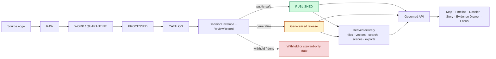

<!-- [KFM_META_BLOCK_V2]
doc_id: kfm://doc/REQUIRES-UUID
title: KFM Sovereignty
type: standard
version: v1
status: draft
owners: REQUIRES VERIFICATION
created: YYYY-MM-DD
updated: YYYY-MM-DD
policy_label: REQUIRES VERIFICATION
related: [REQUIRES VERIFICATION]
tags: [kfm, governance, sovereignty]
notes: [Built from PDF-visible doctrine only; repo-local owners, UUID, adjacent links, and existing file history require verification before merge.]
[/KFM_META_BLOCK_V2] -->

# KFM Sovereignty

A source-bounded governance standard for how Kansas Frontier Matrix preserves authoritative truth, steward obligations, rights posture, precision limits, and public-safe release boundaries.

| Field | Value |
| --- | --- |
| Status | Draft |
| Doctrine basis | **CONFIRMED** from March 2026 KFM manuals |
| Mounted repo evidence | **UNKNOWN** in this session |
| Merge caution | Verify UUID, owners, dates, policy label, and adjacent repo links before commit |

> [!IMPORTANT]
> In KFM, discoverability is **not** the same as admissibility. FAIR-style discoverability helps, but it is not sufficient where care, sovereignty, privacy, exact-location risk, or cultural sensitivity burdens apply.

**Quick jump:** [Purpose](#purpose) · [What sovereignty means in KFM](#what-sovereignty-means-in-kfm) · [Sovereignty dimensions](#sovereignty-dimensions) · [Truth-path implications](#sovereignty-along-the-truth-path) · [Release and surface rules](#release-and-surface-rules) · [Domain-sensitive burdens](#domain-sensitive-burdens) · [Verification and proof](#verification-and-proof) · [Known unknowns](#known-unknowns)

---

## Purpose

This document states how **sovereignty** should be understood and applied in KFM.

In KFM, sovereignty is not a decorative policy word. It is the operational discipline that keeps:

- authoritative truth distinct from derived convenience layers,
- steward and source obligations attached to data and claims,
- public release gated by policy, review, and typed proof objects,
- exact-location and context-sensitive material from leaking through convenience paths,
- correction lineage visible after publication, and
- runtime assistance subordinate to evidence, policy, and release state.

This file is written as a **governance standard**, not as a claim that mounted implementation already proves every mechanism described below.

## Reading rule

Use this document as a doctrine-and-boundary reference.

- Treat **CONFIRMED** statements as doctrine grounded in the attached KFM corpus.
- Treat **INFERRED** statements as conservative completion where the doctrine strongly implies a necessary governance behavior.
- Treat **PROPOSED** statements as recommended next-shape material that still needs repo verification.
- Treat all repo-local paths, owners, IDs, and adjacent links as **NEEDS VERIFICATION** unless directly confirmed in the mounted repository.

## What sovereignty means in KFM

KFM is a **governed spatial evidence system**, not a dashboard-only layer catalog, not a graph-first authority engine, not a free-form chatbot, and not a digital twin by default. Public reading is reconstructed from released scope through governed APIs rather than direct access to canonical or raw storage.

Within that posture, **sovereignty** means five things at once:

1. **Truth sovereignty**  
   Authoritative truth does not silently migrate into graphs, tiles, search indexes, scenes, embeddings, summaries, or model answers.

2. **Stewardship sovereignty**  
   Source obligations, review requirements, rights posture, and sensitivity controls remain attached all the way to the outward surface.

3. **Release sovereignty**  
   Publication is a governed state change, not a successful query, file copy, deployment, or visual rendering.

4. **Precision sovereignty**  
   Exact-location data is released only when the audience, policy posture, and burden of exposure permit it.

5. **Interpretive sovereignty**  
   Narrative, comparison, and AI-assisted explanation remain downstream of evidence and policy rather than replacing them.

---

## Sovereignty dimensions

| Dimension | What it protects | KFM rule | Typical failure if ignored |
| --- | --- | --- | --- |
| Truth sovereignty | Canonical authority | Derived layers remain rebuildable unless explicitly promoted | Search, tiles, vectors, scenes, or summaries drift into de facto truth |
| Source sovereignty | Origin context and declared source role | Source onboarding is a contract, not a download | Unclear provenance, ambiguous freshness, or mirror-as-authority confusion |
| Rights sovereignty | License, redistribution, care, and reuse limits | No public release without explicit rights posture | Public exposure of material with unresolved redistribution or stewardship limits |
| Precision sovereignty | Exact coordinates, vulnerable sites, sensitive subjects | Public-safe, generalized, withheld, or steward-only state must be explicit | Rare-species, archaeology, or oral-history sensitivity leaks through “convenience” outputs |
| Release sovereignty | Governed publication state | Promotion emits typed artifacts and review evidence | Deployment or rendering is mistaken for permission to publish |
| Runtime sovereignty | Trust boundary at point of use | Public surfaces read only through governed APIs and promoted scope | UI, model runtime, or ops tooling bypasses policy and evidence resolution |
| Correction sovereignty | Historical accountability | Supersession, withdrawal, narrowing, and replacement remain visible | Silent overwrite erases public lineage |
| Interpretive sovereignty | Meaning at the surface | Story, dossier, compare, and Focus stay one hop away from evidence | Persuasive narrative strips uncertainty, support, or source context |

## Core sovereignty rules

### 1. No silent sovereignty transfer

No derived surface may quietly inherit authoritative status.

That includes, at minimum:

- search indexes,
- vector and tile products,
- graphs,
- scenes,
- cached summaries,
- exports,
- dashboard views,
- retrieval layers, and
- model outputs.

### 2. No sovereignty without admissibility

A resource is not admitted merely because it exists. It needs explicit identity, meaningful support, declared time semantics, stated method, reconstructable provenance, known rights posture, adequate validation, and review where required.

### 3. No public sovereignty without policy

An outward-facing value is a publication event. Rights, sensitivity, provenance, review, and release state still apply even when the underlying query succeeds technically.

### 4. No precision without burden review

If exact location introduces safety, care, privacy, cultural, or stewardship risk, KFM must generalize, withhold, role-gate, or deny. It must not imply that a suppressed coordinate was never part of the record.

### 5. No runtime sovereignty for AI

Generative assistance may draft, explain, summarize, or help resolve released evidence. It may not become a public truth surface or an uncited interpretation channel.

### 6. No correction erasure

Post-release correction changes trust state visibly. It does not erase history or hide that a release, export, story, or answer has been narrowed, superseded, withdrawn, or rebuilt.

---

## Sovereignty along the truth path

### Operational reading of the diagram

- Sovereignty is strongest at the moment material crosses from **cataloged candidate** into **public-safe release**.
- Derived delivery products may exist only **downstream of promoted scope**.
- Governed APIs reconstruct released scope for trust surfaces.
- A denied or withheld path is still a valid governance result.

---

## Release and surface rules

### Release-state handling matrix

| Requested outcome | Minimum governance requirement | Surface expectation |
| --- | --- | --- |
| Public-safe unchanged | Rights/sensitivity clear, review complete where required, release artifacts emitted | Renderable on public surfaces with evidence drill-through |
| Generalized | Exact representation unsafe, generalized version approved | Public surface shows generalized state visibly |
| Withheld / steward-only | Public release not allowed, steward lane still permitted | Public surface does not render the protected object; steward surface carries review context |
| Denied | Policy explicitly blocks requested action or surface | User-visible denial state, not a silent miss |
| Partial | Coverage, corroboration, or support is incomplete | Surface must disclose incompleteness in place |
| Stale-visible | Release still visible but freshness basis exceeded tolerance | Surface must show stale-state cue and correction path |
| Superseded / withdrawn | Correction or replacement published | Surface retains correction lineage and replacement route |

### Surface obligations

| Surface | Sovereignty-critical requirement |
| --- | --- |
| Map Explorer | Must show release linkage, freshness cues, and route to evidence |
| Timeline | Must keep valid-time and as-of meaning visible |
| Dossier | Must preserve identity, dependencies, service area context, and evidence links |
| Story | Must keep excerpts evidence-linked and correction-aware |
| Evidence Drawer | Must expose bundle members, quote context, transforms, and release state |
| Focus | Must remain scoped, cited, policy-checked, and limited to `ANSWER`, `ABSTAIN`, `DENY`, or `ERROR` |
| Compare | Must preserve a shared geography/time anchor and explicit comparison basis |
| Export | Must never outrun release state, evidence linkage, policy posture, or correction lineage |
| Review / Stewardship | Must emit review and decision artifacts; no hidden approvals |

> [!NOTE]
> In KFM, a calm negative state is more sovereign than a fluent bluff.

---

## Domain-sensitive burdens

Some lanes carry a heavier sovereignty burden than others. The system should preserve those differences rather than flatten them into one publication rule.

| Lane or material family | Sovereignty burden | Minimum public posture |
| --- | --- | --- |
| Archives, newspapers, oral histories, public memory, heritage | Context, reuse constraints, provenance preservation, culturally sensitive handling | Never strip provenance; prefer evidence-linked excerpts over decontextualized fact claims |
| Ecology, biodiversity, flora, pollinators, wildlife, protected areas | Exact-location risk, stewardship obligations, geoprivacy | Generalize, role-gate, or withhold where exact exposure creates harm |
| Archaeology and heritage 2.5D/3D | Site sensitivity, precision control, volumetric overexposure risk | 3D only when 2D is insufficient; inherit the same policy and correction model |
| Land tenure, cadastral history, parcels, plats, deeds | Legal meaning, OCR/geoparsing error risk, time-bound identity | Treat legal descriptions and derived parcel context as review-bearing |
| Service areas, lifeline systems, critical systems | Jurisdiction, service geography, and operational capacity are not identical | Keep service, legal, and operational claims decomposed |
| Hazards and resilience | Composite-score temptation, changing support/time basis | Avoid “composite risk theater”; preserve decomposability and support semantics |
| Atmosphere, air quality, climate, EO | Modeled vs observed distinction, calibration, regulatory vs community-source differences | Make method, time basis, and source mode visible in place |

### Mirror and discovery caution

Discovery mirrors improve findability, but they do not replace origin authorities. A mirror may be a provenance anchor; it is not automatically the sovereign source.

---

## Sovereignty objects and proof

Sovereignty in KFM is carried by typed governance objects, not by prose alone.

| Object family | Why it matters to sovereignty |
| --- | --- |
| `SourceDescriptor` | Declares source identity, access, semantics, validation, rights, and publication intent |
| `IngestReceipt` | Proves fetch and landing occurred under a declared source contract |
| `ValidationReport` | Records whether canonical admission should proceed, quarantine, or fail |
| `DatasetVersion` | Carries authoritative subject scope with support and time semantics |
| `CatalogClosure` | Publishes outward metadata closure and lineage linkage |
| `DecisionEnvelope` | Makes policy results machine-readable and reviewable |
| `ReviewRecord` | Preserves steward action, separation of duty, and review history |
| `ReleaseManifest` / `ReleaseProofPack` | Makes publication state explicit and auditable |
| `ProjectionBuildReceipt` | Proves derived material was built from a known release scope |
| `EvidenceBundle` | Preserves inspectable support at point of use |
| `RuntimeResponseEnvelope` | Makes outward runtime outcomes accountable |
| `CorrectionNotice` | Preserves visible lineage when public meaning changes |

### Runtime sovereignty outcomes

KFM outward runtime surfaces should emit only:

- `ANSWER`
- `ABSTAIN`
- `DENY`
- `ERROR`

Surface states should remain visible enough to test, explain, and audit:

- `promoted`
- `generalized`
- `partial`
- `stale-visible`
- `source-dependent`
- `conflicted`
- `withdrawn`
- `denied`
- `abstained`

---

## Verification and proof

Sovereignty is not complete until it is testable.

### Minimum verification posture

| Plane | Sovereignty question | Proof objects or checks |
| --- | --- | --- |
| Source and intake | Was material admitted under a declared contract? | `SourceDescriptor`, `IngestReceipt`, `ValidationReport` |
| Canonical truth | Is authoritative meaning stable, typed, and support-correct? | `DatasetVersion` plus validation outputs |
| Catalog / policy / review | Did publication pass rights, sensitivity, review, and release gates? | `CatalogClosure`, `DecisionEnvelope`, `ReviewRecord`, `ReleaseManifest`, `CorrectionNotice` |
| Derived delivery | Was the outward projection built from promoted scope only? | `ProjectionBuildReceipt`, export manifests |
| Runtime and trust surfaces | Did the surface resolve admissible evidence and fail closed where needed? | `EvidenceBundle`, `RuntimeResponseEnvelope`, audit linkage |

### Minimum test families

- schema validation, including invalid fixtures,
- catalog-closure integrity,
- policy bundle and reason/obligation consistency,
- deterministic identity and stale-projection tests,
- citation-negative runtime tests,
- surface-state visibility tests,
- correction drills, and
- docs/accessibility gates.

---

## Anti-patterns to reject

- Treating FAIR discoverability as sufficient governance.
- Treating a mirror, cache, tile set, graph, or search index as an origin authority.
- Treating deployment success as publication permission.
- Treating 3D presence as epistemic elevation.
- Treating denial, abstention, generalization, or withholding as UX failures instead of valid outcomes.
- Hiding exact-location suppression behind vague prose.
- Letting ops endpoints or internal review tools become second truth surfaces.
- Letting AI produce uncited interpretive authority over released evidence.
- Quietly replacing correction lineage with silent overwrite.

---

## Implementation status

| Area | Status | Note |
| --- | --- | --- |
| Doctrine | **CONFIRMED** | Strongly repeated across the March 2026 KFM manuals |
| Mounted repo implementation | **UNKNOWN** | Current session exposed PDF corpus only |
| Existing `docs/governance/SOVEREIGNTY.md` | **UNKNOWN** | No mounted repo tree was directly inspectable here |
| Adjacent governance docs / link targets | **UNKNOWN** | Verify before wiring relative links |
| Policy bundles / schemas / fixtures / workflows | **UNKNOWN** | Described doctrinally; not directly proven from mounted repo artifacts |
| Sovereignty-specific proof objects | **PROPOSED / INFERRED** | Strongly implied by contract-first and release-governance doctrine |

---

## Known unknowns

> [!CAUTION]
> The items below are not minor polish gaps. They directly affect whether sovereignty is merely stated or actually enforced.

| Unknown | Why it matters |
| --- | --- |
| Current repo tree and adjacent governance docs | Needed to confirm whether this file is new or a revision and to wire native relative links |
| Existing schema inventory | Needed to prove that contract-first sovereignty is executable rather than documentary |
| Policy bundle implementation | Needed to show rights/sensitivity/generalize/withhold behavior is machine-enforced |
| Workflow and CI inventory | Needed to prove merge-blocking governance and release gates |
| Evidence resolver contracts | Needed to verify outward explanation remains reconstructible |
| Rights/sensitivity workflows | Needed to prove archaeology, biodiversity, oral-history, and exact-location handling operationally exists |

<strong>PROPOSED follow-on artifacts to verify before creating or linking</strong>

These are doctrine-consistent next-shape artifacts, not asserted repo facts:

- `docs/runbooks/publication.md`
- `docs/runbooks/correction.md`
- `docs/runbooks/stale_projection.md`
- `docs/runbooks/rollback.md`
- `ui/trust_states.md`
- `ui/evidence_drawer_payloads.json`
- `policy/reason_codes.json`
- `policy/obligation_codes.json`
- first-wave contract schemas for `SourceDescriptor`, `DatasetVersion`, `DecisionEnvelope`, `ReleaseManifest`, `EvidenceBundle`, `RuntimeResponseEnvelope`, and `CorrectionNotice`

---

## Merge checklist for this file

Before committing this document, verify:

- the target path and whether this is a create vs revise action,
- the real `doc_id`,
- owners,
- created/updated dates,
- policy label,
- adjacent relative links,
- whether the repo already has a governance index or glossary that should link here,
- whether the repo uses a different local convention for callouts, badges, or standard-doc headers.

---

[Back to top](#kfm-sovereignty)
