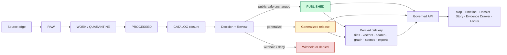

<!-- [KFM_META_BLOCK_V2]
doc_id: kfm://doc/REQUIRES-UUID
title: KFM Sovereignty
type: standard
version: v1
status: draft
owners: REQUIRES VERIFICATION
created: YYYY-MM-DD
updated: YYYY-MM-DD
policy_label: REQUIRES VERIFICATION
related: [REQUIRES VERIFICATION]
tags: [kfm, governance, sovereignty]
notes: [Doctrine-constrained synthesis from the attached March 2026 KFM corpus; repo-local owners, UUID, file history, target path, and adjacent links require verification before merge.]
[/KFM_META_BLOCK_V2] -->

# KFM Sovereignty

A source-bounded governance standard for how Kansas Frontier Matrix preserves authoritative truth, steward obligations, rights posture, precision limits, and public-safe release boundaries.

| Field | Value |
| --- | --- |
| Status | Draft |
| Doctrine basis | **CONFIRMED** from the attached March 2026 KFM canonical and blueprint corpus |
| Workspace evidence | **PDF corpus only** in this session |
| Mounted repo implementation | **UNKNOWN** |
| Merge caution | Verify UUID, owners, dates, policy label, target path, and adjacent repo links before commit |

> [!IMPORTANT]
> In KFM, discoverability is **not** the same as admissibility. FAIR-style discoverability helps, but it is not sufficient where care, sovereignty, privacy, exact-location risk, reuse limits, or cultural sensitivity burdens apply.

> [!NOTE]
> This file is a doctrine-constrained synthesis. The corpus strongly confirms publication law, rights and sensitivity handling, exact-location caution, authoritative-versus-derived separation, fail-closed behavior, and correction visibility. The **named sovereignty dimensions** below package those repeated rules into one operational standard; they should not be read as proof that the mounted repository already exposes the same section names, schemas, or file layout.

**Quick jump:** [Purpose](#purpose) · [Reading posture](#reading-posture) · [Core determination](#core-determination) · [Sovereignty dimensions](#sovereignty-dimensions) · [Truth-path implications](#sovereignty-along-the-truth-path) · [Release and surface rules](#release-and-surface-rules) · [Lane-sensitive burdens](#lane-sensitive-burdens) · [Proof objects](#typed-objects-and-proof) · [Known unknowns](#known-unknowns)

---

## Purpose

This document states how **sovereignty** should be understood in KFM when handling source onboarding, admissibility, publication, public-safe release, runtime explanation, exact-location control, and correction.

In KFM, sovereignty is not a decorative policy label. It is the operational discipline that keeps:

- authoritative truth distinct from faster or more convenient derived layers;
- steward, rights, and sensitivity obligations attached all the way to the outward surface;
- publication gated by policy, review, and typed proof objects rather than by query success;
- exact-location and culturally sensitive material from leaking through convenience paths;
- runtime assistance subordinate to released evidence and policy state; and
- correction lineage visible after publication.

This file is a **governance standard**. It does **not** claim that every proof object, review lane, or release gate described here is already mounted and directly verified in the repository.

## Reading posture

Use this document with the same truth labels the corpus uses:

| Label | Meaning here |
| --- | --- |
| **CONFIRMED** | Directly supported by the attached March 2026 KFM manuals visible in this session |
| **INFERRED** | Conservative structural completion strongly implied by repeated KFM doctrine |
| **PROPOSED** | Recommended next-shape artifact, control, or implementation move |
| **UNKNOWN** | Not verified strongly enough in the current session to present as settled fact |
| **NEEDS VERIFICATION** | Repo-local detail that should be checked before merge |

## Core determination

KFM sovereignty means that every outward-facing claim remains answerable to the same governing chain: source identity, support, time semantics, rights posture, sensitivity handling, review state, release scope, and correction lineage.

Operationally, that produces four non-negotiable consequences:

1. **Authority stays upstream.** Graphs, search indexes, tiles, scenes, summaries, exports, and model outputs may accelerate use, but they do not silently inherit canonical authority.
2. **Release is a governed state change.** A technically successful query, render, or file copy is not publication permission.
3. **Precision is conditional.** Exact coordinates, detailed site descriptions, and sensitive context are released only when policy, role, and exposure burden allow it.
4. **Explanation stays downstream of evidence.** Story, dossier, compare, and Focus surfaces may interpret released material, but they do not replace evidence, policy, or review state.

---

## Sovereignty dimensions

| Dimension | Status | What it protects | KFM rule | Typical failure if ignored |
| --- | --- | --- | --- | --- |
| Truth sovereignty | **CONFIRMED** | Canonical authority | Authoritative truth remains separate from derived projections and accelerators | Graph, search, tile, or summary layers drift into de facto truth |
| Stewardship sovereignty | **INFERRED** | Source and steward obligations | Source onboarding is a contract carrying rights, sensitivity, support, and publication intent | Material moves downstream with unclear obligations or source role |
| Rights sovereignty | **CONFIRMED** | Reuse, redistribution, and care limits | No outward release without explicit rights posture and any required review | Public exposure of material with unresolved reuse or stewardship limits |
| Precision sovereignty | **CONFIRMED** | Exact coordinates and sensitive spatial context | Public-safe, generalized, withheld, or steward-only state must be explicit | Rare-species, archaeology, or oral-history sensitivity leaks through convenience layers |
| Release sovereignty | **CONFIRMED** | Governed publication state | Promotion emits review, decision, and release artifacts; deployment does not equal permission | A build or render is mistaken for a valid publication |
| Runtime sovereignty | **CONFIRMED** | Trust boundary at point of use | Public and normal shell surfaces read through governed APIs and evidence resolution only | UI, model runtime, or ops endpoints bypass policy and evidence controls |
| Correction sovereignty | **CONFIRMED** | Historical accountability | Supersession, narrowing, withdrawal, and replacement remain visible | Silent overwrite erases public lineage |
| Interpretive sovereignty | **CONFIRMED** | Meaning at the surface | Narrative, comparison, and AI-assisted explanation remain bounded by evidence, policy, and release state | Persuasive explanation strips uncertainty, support, or review context |

## Governing rules

### 1. No silent authority transfer

No derived layer may quietly inherit authoritative status. That includes, at minimum, search indexes, graphs, vector stores, tiles, scenes, exports, cached summaries, retrieval layers, and model outputs.

### 2. No sovereignty without admissibility

A resource is not admitted merely because it exists. Admission requires explicit identity, meaningful support, declared time semantics, stated method, reconstructable provenance, known rights posture, adequate validation, and review where required.

### 3. No public sovereignty without policy closure

Every outward-facing value is a publication event. Rights, sensitivity, provenance, review state, release scope, and correction posture still apply even when a query succeeds technically.

### 4. No precision release without burden review

If exact location, detailed description, or reconstruction context creates privacy, care, stewardship, or cultural risk, KFM must generalize, withhold, role-gate, or deny. It must not pretend that suppression means the underlying record never existed.

### 5. No runtime sovereignty for AI

Generative assistance may retrieve, summarize, explain, compare, or draft over released scope. It may not become an uncited truth surface, a direct client path into canonical data, or a substitute for release state.

### 6. No correction erasure

Post-release correction changes trust state visibly. It does not erase that a release, story, export, or answer has been narrowed, withdrawn, rebuilt, or superseded.

---

## Sovereignty along the truth path

The diagram matters for sovereignty because the strongest boundary is not raw storage versus display. It is the transition from candidate material into **catalog closure, decision, review, and release**. That is the point where KFM decides whether material is public-safe, generalized, withheld, or denied.

A valid negative result is still a governed result. In KFM, withholding and denial are not UX mistakes; they are often the most sovereign outcome available.

## Release and surface rules

### Release-state handling matrix

| Requested outcome | Minimum governance requirement | Surface expectation |
| --- | --- | --- |
| Public-safe unchanged | Rights and sensitivity clear; release artifacts emitted; review complete where required | Renderable with evidence drill-through and visible freshness/release state |
| Generalized | Exact representation unsafe but reduced-precision form approved | Surface labels generalization in-place; no silent coordinate downgrade |
| Withheld / steward-only | Public release blocked but steward lane permitted | Public surface does not render protected detail; steward surface carries review context |
| Denied | Policy explicitly blocks the requested action or surface | User sees a denial state, not an unexplained absence |
| Partial | Coverage or corroboration incomplete | Surface discloses incompleteness in place |
| Stale-visible | Release still usable but beyond freshness tolerance | Surface shows stale-state cue and correction path |
| Superseded / withdrawn | Correction or replacement published | Surface preserves lineage and route to replacement |

### Trust-visible surface obligations

| Surface | Sovereignty-critical requirement |
| --- | --- |
| Map / Timeline | Must keep time scope, freshness, and route-to-evidence visible |
| Dossier / Story | Must preserve identity, dates, dependencies, evidence links, and correction state |
| Evidence Drawer | Must expose bundle members, quote or preview context, transforms, and release state |
| Focus Mode | Must stay scoped, cited, policy-checked, and limited to `ANSWER`, `ABSTAIN`, `DENY`, or `ERROR` |
| Export | Must never outrun release scope, policy posture, or correction linkage |
| Review / Stewardship | Must emit review and decision artifacts; no hidden approvals |

> [!NOTE]
> In KFM, a calm negative state is more sovereign than a fluent bluff.

---

## Lane-sensitive burdens

Some KFM lanes carry a materially heavier sovereignty burden than others. The system should preserve those differences rather than flatten them into one publication rule.

| Lane or material family | Main sovereignty burden | Minimum public-safe posture |
| --- | --- | --- |
| Archives, newspapers, oral histories, public memory, and heritage | Context, reuse limits, culturally sensitive material, provenance preservation | Prefer evidence-linked excerpts over decontextualized claims; never strip provenance |
| Ecology, biodiversity, flora, pollinators, wildlife, and protected areas | Rare-species exposure, geoprivacy, conservation sensitivity | Generalize, role-gate, or withhold where exact exposure creates harm |
| Archaeology and heritage 2.5D/3D | Site sensitivity, volumetric overexposure risk, 2D vs 3D burden | Use 3D only when it materially improves reasoning and still inherits the same policy and correction model |
| Land tenure, cadastral history, parcels, plats, and deeds | Legal meaning, OCR/geoparsing error risk, personal detail masking, temporal linking | Treat legal-description and parcel-history work as review-bearing lanes |
| Service areas, lifeline systems, and critical systems | Legal jurisdiction, service geography, and operational capacity are related but not identical | Preserve the distinction; avoid overclaiming service capacity from boundary data alone |
| Atmosphere, air quality, climate, EO, and scientific extension | Modeled vs observed distinction, time basis, calibration and method visibility | Label modeled, assimilated, regulatory, and community-sensor material in place |

### Mirror and discovery caution

Discovery mirrors improve findability, but they do not replace origin authorities. A mirror may act as a provenance anchor; it is not automatically the sovereign source.

---

## Typed objects and proof

Sovereignty in KFM is carried by typed governance and release objects, not by prose alone.

| Object family | Why it matters |
| --- | --- |
| `SourceDescriptor` | Declares source identity, access, rights posture, sensitivity, support, and publication intent |
| `IngestReceipt` / `ValidationReport` | Prove landing and admissibility outcome before canonical trust is claimed |
| `DatasetVersion` | Carries authoritative candidate or promoted subject scope with support and time semantics |
| `CatalogClosure` / `DecisionEnvelope` / `ReviewRecord` | Make publication, rights, and review state machine-readable and auditable |
| `ReleaseManifest` / `ReleaseProofPack` | Make public-safe release explicit and reversible |
| `ProjectionBuildReceipt` | Proves derived delivery artifacts were built from known release scope |
| `EvidenceBundle` | Preserves inspectable support at the point of use |
| `RuntimeResponseEnvelope` | Makes outward runtime outcomes accountable |
| `CorrectionNotice` | Preserves visible lineage when public meaning changes |

### Runtime outcomes and surface states

Outward runtime surfaces should emit only:

- `ANSWER`
- `ABSTAIN`
- `DENY`
- `ERROR`

Trust-visible surface states should remain stable enough to test and explain:

- `promoted`
- `generalized`
- `partial`
- `stale-visible`
- `source-dependent`
- `conflicted`
- `withdrawn`
- `denied`
- `abstained`

---

## Known unknowns

> [!CAUTION]
> The gaps below are governance-significant. They are not minor polish items.

| Unknown / needs verification | Why it matters |
| --- | --- |
| Target repo path and whether this is a create-versus-revise action | Needed to place the file correctly and wire native relative links |
| Real `doc_id`, owners, created/updated dates, and policy label | Required to make the KFM meta block trustworthy |
| Existing governance index, glossary, or adjacent standards | Needed so this standard links into the repo without inventing structure |
| Release proof-pack implementation | Promotion, rollback, and publication proof remain conceptual until one real example is surfaced |
| Runtime response envelope and Focus negative-path behavior | Cite-or-abstain, deny, and error behavior need direct implementation proof |
| Rights and sensitivity workflows for oral history, archaeology, biodiversity, and exact-location cases | These lanes require operational review lanes before outward expansion |
| Mounted schema, fixture, policy-bundle, and workflow inventory | Needed to prove this standard is executable rather than documentary |

---

## Merge checklist for this file

Before commit, verify:

- the target location and whether this file replaces an existing standard;
- the UUID, owners, dates, and policy label in the meta block;
- adjacent relative links, governance index references, and glossary terms;
- whether the repo already has a stronger local convention for standard-doc headers; and
- whether any repo-local contract or policy names should be linked directly from this file.

[Back to top](#kfm-sovereignty)
