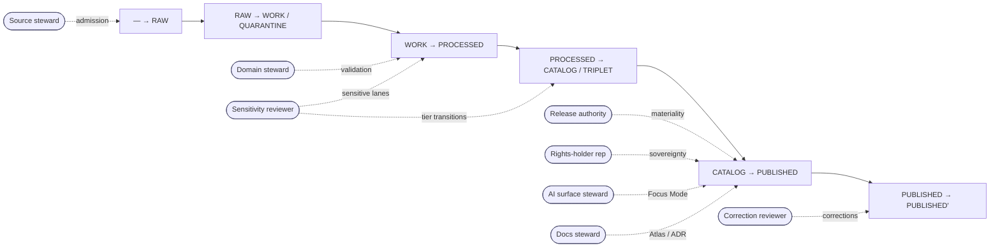

<!-- [KFM_META_BLOCK_V2]
doc_id: kfm://doc/governance/steward-charters
title: Steward Charters
type: standard
version: v0.1
status: draft
owners: Docs steward (PROPOSED)
created: 2026-05-12
updated: 2026-05-12
policy_label: public
related: [docs/doctrine/directory-rules.md, docs/doctrine/authority-ladder.md, docs/doctrine/trust-membrane.md, docs/doctrine/lifecycle-law.md, docs/governance/REVIEW_BURDEN.md, docs/governance/SEPARATION_OF_DUTIES.md, docs/adr/README.md, docs/registers/DRIFT_REGISTER.md, control_plane/policy_gate_register.yaml]
tags: [kfm, governance, stewards, separation-of-duties, charters]
notes: [PROPOSED consolidation per Domains Culmination Atlas v1.1 §24.7; pending ADR-S-09 (reviewer separation tooling threshold)]
[/KFM_META_BLOCK_V2] -->

# Steward Charters

> Named-role charters defining who owns what across the KFM trust membrane — admission, validation, sensitivity, rights, release, correction, AI surface, and docs.

**Status:** draft · **Owners:** Docs steward (PROPOSED) · **Last updated:** 2026-05-12

---

## Contents

1. [Purpose and Scope](#1-purpose-and-scope)
2. [Authority and Doctrinal Basis](#2-authority-and-doctrinal-basis)
3. [Roster of Stewards](#3-roster-of-stewards)
4. [Charter Template](#4-charter-template)
5. [Source steward](#5-source-steward)
6. [Domain steward](#6-domain-steward)
7. [Sensitivity reviewer](#7-sensitivity-reviewer)
8. [Rights-holder representative](#8-rights-holder-representative)
9. [Release authority](#9-release-authority)
10. [Correction reviewer](#10-correction-reviewer)
11. [AI surface steward](#11-ai-surface-steward)
12. [Docs steward](#12-docs-steward)
13. [Separation-of-Duties Matrix](#13-separation-of-duties-matrix)
14. [Maturity Model and Enforcement Posture](#14-maturity-model-and-enforcement-posture)
15. [Onboarding, Review, and Succession](#15-onboarding-review-and-succession)
16. [Open Questions and ADR Linkage](#16-open-questions-and-adr-linkage)
17. [Glossary](#17-glossary)
18. [Related Docs](#18-related-docs)

---

## 1. Purpose and Scope

This document names the **named-role charters** that make KFM's separation of duties operational. Each charter defines: who the steward is, what they own, what artifacts they sign, what they cannot do alone, and when a co-signer is required.

The charters exist because KFM is a governed, evidence-first system. Once a claim crosses the trust membrane into `PUBLISHED`, multiple downstream readers act on it. **A trust membrane without named owners is a membrane no-one can defend.** The charters fix that gap. [ENCY] [DIRRULES]

### 1.1 What this doc does

- Lists the eight named stewards consolidated from KFM doctrine.
- Defines each steward's scope, owned artifacts, gate authority, and required co-signers.
- Restates the separation-of-duties matrix in charter context, with citation back to canonical sources.
- Names the maturity threshold at which tooling — not custom — must enforce separation.

### 1.2 What this doc does *not* do

- It does not change **object meaning** (see `contracts/`).
- It does not define **schema shape** (see `schemas/`).
- It does not decide **admissibility or release outcomes** (see `policy/`, `release/`).
- It does not name individuals or teams — that lives in a separate, repo-private roster.

> [!NOTE]
> The role consolidation in this document is **PROPOSED** per *Domains Culmination Atlas v1.1* §24.7. The doctrine of separation of policy-significant duties is **CONFIRMED**. Specific role scopes are proposals pending ADR-S-09 (reviewer separation tooling threshold). [ENCY] [DIRRULES]

[↑ Back to top](#contents)

---

## 2. Authority and Doctrinal Basis

### 2.1 Where this document sits

| Layer | Artifact | Status |
|---|---|---|
| Doctrine — operating law | KFM operating-law invariant 9: "Separate policy-significant release duties when maturity justifies it." | **CONFIRMED** [ENCY] |
| Doctrine — placement | Directory Rules §6.1 confirms `docs/governance/` is the home for "roles, review burden, separation of duties." | **CONFIRMED** [DIRRULES] |
| Reference — consolidation | Atlas v1.1 §24.7 *Reviewer Role and Separation-of-Duties Matrix*. | **PROPOSED** reference for ADR discussion [ENCY] |
| Open ADR | ADR-S-09 — reviewer separation enforced by tooling vs. custom; threshold to specify. | **OPEN** [ENCY] |
| This document | Per-role charters, scopes, and co-signer requirements. | **PROPOSED v0.1** |

### 2.2 What outranks this doc

In any conflict, authority resolves in this order [DIRRULES]:

1. KFM operating-law invariants (lifecycle, trust membrane, cite-or-abstain, authority ladder).
2. Accepted ADRs that amend governance directly.
3. *Domains Culmination Atlas v1.1* §24.7 (the canonical role roster).
4. This document.
5. Per-domain dossiers and supplementary reports (lineage / proposed only).

### 2.3 Reading the labels

This file uses the standard KFM truth labels [ENCY]:

- **CONFIRMED** — verified in attached doctrine or Atlas v1.1.
- **PROPOSED** — proposed by Atlas v1.1 §24.7 or by this charter file; pending ADR.
- **INFERRED** — derived from CONFIRMED doctrine but not directly stated.
- **NEEDS VERIFICATION** — checkable against mounted-repo evidence; not yet checked.
- **UNKNOWN** — not resolvable without more evidence.

> [!IMPORTANT]
> **Memory is not evidence.** No charter in this document claims that a role is staffed, that a tool enforces separation, or that a repo path is present in production. Those claims are **UNKNOWN** until verified against mounted-repo evidence.

[↑ Back to top](#contents)

---

## 3. Roster of Stewards

CONFIRMED roster of eight named stewards consolidated from Atlas v1.1 §24.7.1 [ENCY]:

| # | Steward | One-line scope | Primary owned artifact(s) |
|---|---|---|---|
| 1 | **Source steward** | Admission, rights, sensitivity tag for a source family. | `SourceDescriptor` |
| 2 | **Domain steward** | Meaning, contracts, validators for a domain's object families. | Domain contracts / schemas; `ValidationReport` |
| 3 | **Sensitivity reviewer** | Redaction, generalization, withholding, tier decisions. | `RedactionReceipt`; tier transitions |
| 4 | **Rights-holder representative** | Sovereignty, cultural-heritage, consent-based release. | Release approval for archaeology, sovereign data, living-person data, DNA data |
| 5 | **Release authority** | Issues `ReleaseManifest`s; authorizes PUBLISHED transitions; rollback. | `ReleaseManifest`; `RollbackCard` |
| 6 | **Correction reviewer** | Reviews corrections and rollback decisions post-publication. | `CorrectionNotice`; `RollbackCard` |
| 7 | **AI surface steward** | Focus Mode templates, `AIReceipt`s, policy bindings, cite-or-abstain audits. | `AIReceipt` sampling; Focus Mode policy bindings |
| 8 | **Docs steward** | Governance docs, ADR index, drift register, Atlas / supplement integrity. | `docs/` tree; ADR index; `DRIFT_REGISTER` |

### 3.1 Role-to-lifecycle map (illustrative)

> [!NOTE]
> The diagram shows **doctrine-level** role engagement at each lifecycle gate. Concrete tooling, queue ownership, and notification flow are **PROPOSED** — see §14 (Maturity Model). The lifecycle invariant itself is **CONFIRMED**. [ENCY] [DIRRULES]

[↑ Back to top](#contents)

---

## 4. Charter Template

Each individual charter (§§5–12) uses this fixed shape so they read in parallel. Field-level shape MAY tighten under ADR-S-09; the field set itself is **PROPOSED stable**.

| Field | Meaning |
|---|---|
| **Role name** | Canonical KFM name from Atlas v1.1 §24.7.1. |
| **Definition** | One-sentence scope statement from Atlas v1.1. CONFIRMED quote where possible. |
| **Charter status** | CONFIRMED definition / PROPOSED scope / NEEDS VERIFICATION staffing. |
| **Owned artifacts** | Object families and receipts this steward signs or authors. |
| **Gate authority** | Which lifecycle gates the steward owns or co-owns. |
| **Cannot be the sole approver of** | Decisions that require a co-signer. |
| **Required collaborators** | Other charters this role typically co-signs with. |
| **Review cadence** | Proposed review window for the steward's own actions and the audit sample. |
| **Onboarding minimum** | Proposed minimum context a new occupant must hold. |
| **Citation** | Atlas / Encyclopedia / Directory Rules cites. |

[↑ Back to top](#contents)

---

## 5. Source steward

| Field | Value |
|---|---|
| **Definition** | "Owns admission, rights confirmation, and sensitivity tag for a named source family." [ENCY] |
| **Charter status** | CONFIRMED definition · PROPOSED scope · NEEDS VERIFICATION staffing |
| **Owned artifacts** | `SourceDescriptor`; ingest-side `RunReceipt`; initial sensitivity tag; admission `PolicyDecision` records. |
| **Gate authority** | Admission gate (— → RAW). |
| **Cannot be the sole approver of** | Admission of any source with unresolved rights or sovereignty. [DIRRULES] [DOM-ARCH] [DOM-PEOPLE] |
| **Required collaborators** | Rights-holder representative (sovereign / consent-sensitive sources); Sensitivity reviewer (T3 / T4 admission). |
| **Review cadence** | **PROPOSED** — every admitted source family receives a freshness review at the cadence declared in its `SourceDescriptor`; backlog tracked in `docs/registers/VERIFICATION_BACKLOG.md`. |
| **Onboarding minimum** | **PROPOSED** — familiarity with the source-role anti-collapse register (Atlas v1.1 §24.1), the Sensitive / Deny-by-Default Register, and the `SourceDescriptor` schema. |
| **Citation** | [ENCY] [DIRRULES] |

### 5.1 Source-role anti-collapse

Source role is fixed at admission. A source steward **MUST NOT** silently upgrade a role (e.g., `modeled → observed`) during admission or later promotion. Source-role upcasts are forbidden by doctrine; corrections must produce a *new* descriptor and a `CorrectionNotice`. [ENCY] Atlas v1.1 §24.1

> [!CAUTION]
> Treating a regulatory layer as observed evidence, an aggregate as a per-place observation, or an administrative compilation as an observed event timeline is a **source-role collapse** and a defined DENY case at the trust membrane. [ENCY] Atlas v1.1 §24.9.2

[↑ Back to top](#contents)

---

## 6. Domain steward

| Field | Value |
|---|---|
| **Definition** | "Owns the meaning, contracts, and validators of a domain's object families." [ENCY] [DDD] |
| **Charter status** | CONFIRMED definition · PROPOSED scope · NEEDS VERIFICATION staffing |
| **Owned artifacts** | Domain `contracts/` files; `schemas/contracts/v1/<domain>/...`; domain validators; `ValidationReport`; domain-internal `TransformReceipt`. |
| **Gate authority** | Normalization gate (RAW → WORK / QUARANTINE); validation gate (WORK → PROCESSED); domain-internal catalog closure. |
| **Cannot be the sole approver of** | Sensitive-lane promotion; cross-lane catalog joins flagged by sensitivity policy; schema or contract changes that affect another domain's invariants (those require ADR). |
| **Required collaborators** | Sensitivity reviewer for any transform with sensitivity implications; Docs steward for ADR coordination on contract changes. |
| **Review cadence** | **PROPOSED** — per-domain quarterly contract review; validator re-run on every release; periodic audit by Docs steward. [ENCY] Atlas v1.1 §24.7.2 |
| **Onboarding minimum** | **PROPOSED** — domain dossier, `contracts/<domain>/`, `schemas/contracts/v1/<domain>/`, the Pipeline Gate Reference (Atlas v1.1 §24.6), and the Cross-Lane Relation Atlas for the owned domain. |
| **Citation** | [ENCY] [DDD] [DIRRULES] |

### 6.1 Validators are deterministic

Validator authorship and run are routinely author-approvable because validators are deterministic; a periodic audit by the Docs steward replaces per-run separation. [ENCY] Atlas v1.1 §24.7.2

[↑ Back to top](#contents)

---

## 7. Sensitivity reviewer

| Field | Value |
|---|---|
| **Definition** | "Reviews redaction, generalization, withholding, and tier decisions for sensitive content." [ENCY] |
| **Charter status** | CONFIRMED definition · PROPOSED scope · NEEDS VERIFICATION staffing |
| **Owned artifacts** | `RedactionReceipt`; tier-transition `ReviewRecord`; `AggregationReceipt` when aggregation is the sensitivity transform. |
| **Gate authority** | Tier transitions T4 → T3 / T2 / T1; sensitivity-relevant transitions at every lifecycle gate where defaults are T1+. |
| **Cannot be the sole approver of** | T1 → T0 release (needs Release authority); release of archaeology / sovereign / living-person / DNA data (needs Rights-holder representative); promotion of a candidate to PUBLISHED. |
| **Required collaborators** | Rights-holder representative for sovereign, cultural-heritage, or consent-bearing material; Release authority for any T1 → T0 motion. |
| **Review cadence** | **PROPOSED** — aged-review badge fires after the per-lane tolerance set by the lane's sensitivity policy; the reviewer is the trigger for tier re-evaluation. [ENCY] Atlas v1.1 §24.8.1 |
| **Onboarding minimum** | **PROPOSED** — Sensitivity / Rights Tier Reference (Atlas v1.1 §24.5); Sensitive / Deny-by-Default Register; domain redaction patterns for archaeology, fauna, flora, people/DNA, settlements/infrastructure. |
| **Citation** | [ENCY] [DOM-ARCH] [DOM-FAUNA] [DOM-FLORA] [DOM-PEOPLE] |

> [!IMPORTANT]
> **Tier-motion asymmetry.** Tier *upgrade* (toward more public) requires both a transform receipt and a `ReviewRecord`. Tier *downgrade* (toward less public) is always permitted via `CorrectionNotice` alone. The sensitivity reviewer's authority is symmetric in direction but asymmetric in burden: downgrade is fast; upgrade is slow. [ENCY] Atlas v1.1 §24.5.3

[↑ Back to top](#contents)

---

## 8. Rights-holder representative

| Field | Value |
|---|---|
| **Definition** | "Confirms sovereignty, cultural-heritage, or consent-based release decisions." [DOM-ARCH] [DOM-PEOPLE] |
| **Charter status** | CONFIRMED definition · PROPOSED scope · NEEDS VERIFICATION staffing |
| **Owned artifacts** | Consent / sovereignty `ReviewRecord`; consultation record; named-party agreement reference (T4 → T3 transitions). |
| **Gate authority** | Sovereignty / consent gates wherever the lane is archaeology, sovereign data, living-person data, or DNA data. |
| **Cannot be the sole approver of** | Schema or validator changes (Domain steward); release manifest issuance (Release authority); routine admission of non-sovereign sources. |
| **Required collaborators** | Sensitivity reviewer; Release authority; Source steward at admission. |
| **Review cadence** | **PROPOSED** — agreement-based; rights-status-changed badge requires immediate re-evaluation. [ENCY] Atlas v1.1 §24.8.1 |
| **Onboarding minimum** | **PROPOSED** — lane-specific cultural protocols, consent terms, and the named-agreement register. Per-lane onboarding is **non-fungible** across communities or domains. |
| **Citation** | [DOM-ARCH] [DOM-PEOPLE] [ENCY] |

> [!WARNING]
> **Sovereignty is not transferable.** A rights-holder representative confirms decisions for the *specific* community, family, descendant group, or data subject the data concerns. A representative for one lane or one community **MUST NOT** be assumed to represent another.

[↑ Back to top](#contents)

---

## 9. Release authority

| Field | Value |
|---|---|
| **Definition** | "Issues `ReleaseManifest`s and authorizes PUBLISHED transitions; distinct from authorship when materiality applies." [ENCY] [DIRRULES] |
| **Charter status** | CONFIRMED definition · PROPOSED scope · NEEDS VERIFICATION staffing |
| **Owned artifacts** | `ReleaseManifest`; rollback target; `RollbackCard` (initiated by Correction reviewer, executed / authorized by Release authority). |
| **Gate authority** | Release gate (CATALOG / TRIPLET → PUBLISHED); rollback authorization; release re-issuance after correction. |
| **Cannot be the sole approver of** | Sensitive-lane release (needs Sensitivity reviewer + Rights-holder representative); AI surface change in a policy binding (needs AI surface steward + Docs steward); the *content* of the release (the author / Domain steward owns content; this role authorizes release). |
| **Required collaborators** | The author / Domain steward; Sensitivity reviewer where T1+; Rights-holder representative for sovereign lanes; Correction reviewer for rollbacks. |
| **Review cadence** | **PROPOSED** — every release sampled by the Docs steward into the audit ladder; release queue tracked in `release/` per Directory Rules §9. [DIRRULES] |
| **Onboarding minimum** | **PROPOSED** — Pipeline Gate Reference (Atlas v1.1 §24.6); `ReleaseManifest` schema; rollback drill in `docs/runbooks/`; `release/manifests/` and `release/rollback_cards/` layout. |
| **Citation** | [ENCY] [DIRRULES] |

### 9.1 The author-≠-release-authority rule

When materiality applies, the author of a claim **MUST NOT** also be the release authority. Materiality includes: sensitivity tier ≥ T1, cross-domain integration, AI-surface bindings, story / export carriers, and any release whose rollback target affects derivatives. [ENCY] Atlas v1.1 §24.7.2

[↑ Back to top](#contents)

---

## 10. Correction reviewer

| Field | Value |
|---|---|
| **Definition** | "Reviews `CorrectionNotice` / `RollbackCard` before they amend a PUBLISHED claim." [ENCY] [DIRRULES] |
| **Charter status** | CONFIRMED definition · PROPOSED scope · NEEDS VERIFICATION staffing |
| **Owned artifacts** | `CorrectionNotice`; rollback decision (paired with Release authority for execution); supersession entry in the source / claim register. |
| **Gate authority** | Correction gate (PUBLISHED → PUBLISHED'); supersession lineage closure; derivative invalidation. |
| **Cannot be the sole approver of** | The rollback execution itself (Release authority co-signs); the new content being substituted (Domain steward / author owns the new content). |
| **Required collaborators** | Author / detector of the error; Release authority; Sensitivity reviewer if the correction crosses a tier boundary; Docs steward for atlas-level supersession entries. |
| **Review cadence** | **PROPOSED** — every correction must close its derivative-invalidation list; periodic audit by Docs steward. [ENCY] Atlas v1.1 §24.9.3 |
| **Onboarding minimum** | **PROPOSED** — Stale-State and Supersession Reference (Atlas v1.1 §24.8); `CorrectionNotice` / `RollbackCard` schemas; the "stale vs. wrong" doctrinal distinction. |
| **Citation** | [ENCY] [DIRRULES] |

### 10.1 Stale ≠ wrong

A *stale* claim has aged past its evidence, source freshness, or supporting-context tolerance. A *wrong* claim is substantively incorrect. Correction reviewers handle the *wrong* path. Stale-state markers (source freshness expired, schema drift, geography version drift, review aged out, policy version changed) trigger a separate evaluation; not every stale marker becomes a correction. [ENCY] Atlas v1.1 §24.8

[↑ Back to top](#contents)

---

## 11. AI surface steward

| Field | Value |
|---|---|
| **Definition** | "Reviews Focus Mode templates, `AIReceipt`s, and policy bindings; audits AI behavior against doctrine." [GAI] [UIAI] |
| **Charter status** | CONFIRMED definition · PROPOSED scope · NEEDS VERIFICATION staffing |
| **Owned artifacts** | Focus Mode prompt templates; AI policy bindings; `AIReceipt` sampling reports; cite-or-abstain audit records. |
| **Gate authority** | AI surface change gate (template / policy binding); Focus Mode admission of new question scopes; AI-surface red-team / abstention sampling. |
| **Cannot be the sole approver of** | Any AI policy binding (Docs steward co-signs); model selection or version pinning if it crosses ADR-class change; an AI answer being treated as evidence (forbidden by doctrine). |
| **Required collaborators** | Docs steward (policy bindings); Release authority for any AI-driven public surface; Domain steward for domain-bounded scopes. |
| **Review cadence** | **PROPOSED** — per-release `AIReceipt` sample; periodic cite-or-abstain audit; `AIReceipt`s are *never* superseded retroactively — old answers stay, new ones become new receipts. [ENCY] Atlas v1.1 §24.8.2 |
| **Onboarding minimum** | **PROPOSED** — Governed AI doctrine; `AIReceipt` schema; Focus Mode boundaries; finite-outcome envelope (`ANSWER` / `ABSTAIN` / `DENY` / `ERROR`); cite-or-abstain rule. |
| **Citation** | [GAI] [UIAI] [ENCY] |

> [!CAUTION]
> AI is **interpretive, not the root truth source.** `EvidenceBundle` outranks generated language; AI answering from `RAW` / `WORK` is forbidden; AI surface change routed through an admin shortcut is a defined anti-pattern. [GAI] [DIRRULES] Atlas v1.1 §24.9.2

[↑ Back to top](#contents)

---

## 12. Docs steward

| Field | Value |
|---|---|
| **Definition** | "Owns governance documentation, ADR index, drift register, and Atlas / supplement integrity." [DIRRULES] |
| **Charter status** | CONFIRMED definition · PROPOSED scope · NEEDS VERIFICATION staffing |
| **Owned artifacts** | The `docs/` tree; the ADR index; `docs/registers/DRIFT_REGISTER.md`; `docs/registers/VERIFICATION_BACKLOG.md`; Atlas / supplement supersession entries; this charters file. |
| **Gate authority** | Atlas / supplement publication; ADR coordination; drift-register triage; periodic audit of every other steward. |
| **Cannot be the sole approver of** | Atlas / supplement publication (needs at least one subsystem owner per Directory Rules §2); AI policy binding (AI surface steward co-signs); domain contract change (Domain steward authors). |
| **Required collaborators** | At least one subsystem owner for any Atlas / supplement publication; the role being audited for any periodic audit. |
| **Review cadence** | **PROPOSED** — drift-register triage at a cadence defined by ADR-S-13; ADR backlog review every release cycle. [ENCY] Atlas v1.1 §24.12 |
| **Onboarding minimum** | **PROPOSED** — Directory Rules; Atlas v1.0 + v1.1; ADR template; drift-register methodology; the four-layer doctrine (`docs/` explains, `control_plane/` indexes, `contracts/` defines meaning, `schemas/` defines shape). |
| **Citation** | [DIRRULES] [ENCY] |

[↑ Back to top](#contents)

---

## 13. Separation-of-Duties Matrix

The canonical separation matrix is **Atlas v1.1 §24.7.2**. This table re-presents it from the charter perspective: which roles must co-sign each gate, and at what materiality threshold. **PROPOSED specifics; CONFIRMED doctrine of "separate when materiality justifies."** [ENCY] [DIRRULES]

| Action | Author may self-approve? | Required separation (PROPOSED) |
|---|---|---|
| Source admission (— → RAW), routine | Yes | — |
| Source admission, unresolved rights / sovereignty | No | Source steward **+** Rights-holder representative |
| Normalization receipts, routine | Yes | — |
| Normalization receipts, sensitivity-relevant | No | Domain steward **+** Sensitivity reviewer |
| Validator authorship and run | Yes (deterministic) | Periodic audit by Docs steward |
| Promotion to PROCESSED / CATALOG, non-sensitive routine | Yes | — |
| Promotion to PROCESSED / CATALOG, sensitive lane | No | Domain steward **+** Sensitivity reviewer |
| Release to PUBLISHED, materiality applies | No | Author **≠** Release authority; Rights-holder representative where applicable |
| Sensitive-lane release | No | Author **+** Sensitivity reviewer **+** Release authority **+** Rights-holder representative |
| Correction / rollback, steward-significant | No | Author / detector **+** Correction reviewer **+** Release authority |
| AI surface change (template / policy binding) | No | AI surface steward **+** Docs steward |
| Atlas / supplement publication | No | Docs steward **+** ≥ 1 subsystem owner |

> [!NOTE]
> This is a reflection of the canonical matrix, not a replacement. Where this file and Atlas v1.1 §24.7.2 disagree, **Atlas v1.1 wins**; treat the disagreement as a `DRIFT_REGISTER` entry. [DIRRULES]

[↑ Back to top](#contents)

---

## 14. Maturity Model and Enforcement Posture

**CONFIRMED doctrine** [ENCY] [DIRRULES]: Separation of duties is **maturity-dependent**. Early-stage doctrine work may be authored and approved by the same actor when materiality is low. As maturity rises and the public trust surface expands, separation MUST be enforced through **tooling**, not custom.

**INFERRED maturity ladder** (PROPOSED naming; pending ADR-S-09):

| Level | Posture | Authoring discipline | Tooling expectation |
|---|---|---|---|
| **M0** Pre-doctrine | No charters; doctrine being authored. | Author = approver. | None. |
| **M1** Early doctrine | Charters CONFIRMED in roster; specific scopes PROPOSED. | Author may self-approve when materiality is low; sensitive lanes require co-signer. | Custom enforcement: PR review, manual queues. |
| **M2** Reviewed doctrine | Separation enforced for every policy-significant gate via review process. | Author **≠** approver on every materiality-applying gate. | Some tooling: gate checks, manifest validation, policy linters. |
| **M3** Mature doctrine | Separation enforced by tooling on all policy-significant gates. | Author cannot self-approve sensitive lanes by construction. | Full tooling: signed `ReviewRecord` + `ReleaseManifest`, separation enforced at PR / release queue / runtime. |

> [!IMPORTANT]
> KFM doctrine **does not pretend** any specific maturity level is reached. The Atlas v1.1 maturity note is explicit: *"the supplement does not pretend the enforcement exists yet."* [ENCY] §24.7.2. Implementation maturity of charters and tooling is **UNKNOWN** without mounted-repo evidence.

### 14.1 Anti-patterns at every maturity level

These remain DENY cases regardless of M-level [ENCY] Atlas v1.1 §24.9:

- Approving one's own release on a sensitive lane.
- Treating an Atlas summary or master matrix as evidence.
- Silent migrations between schema or policy homes (ADR required).
- Promotion that "upgrades" a source role (e.g., `modeled → observed`).
- Re-publishing a corrected claim without invalidating derivatives.
- AI generation routed through an admin shortcut as a normal-path public route.

[↑ Back to top](#contents)

---

## 15. Onboarding, Review, and Succession

> [!NOTE]
> Concrete onboarding artifacts (checklists, training materials, named individuals) are **out of scope** for this doctrinal charter file. They belong in a repo-private steward roster and in `docs/runbooks/`. This section names only the *doctrinal minimums* a new occupant must hold. PROPOSED throughout.

### 15.1 Minimum context for any steward (PROPOSED)

Every steward, regardless of role, should be able to articulate:

1. **The lifecycle invariant** — `RAW → WORK / QUARANTINE → PROCESSED → CATALOG / TRIPLET → PUBLISHED`. Promotion is a governed state transition, not a file move. [ENCY]
2. **The trust membrane** — public clients consume governed APIs and released artifacts, not canonical / internal stores. [ENCY]
3. **The cite-or-abstain default** — `EvidenceBundle` outranks generated language. [GAI]
4. **The four-layer doctrine** — `docs/` explains, `control_plane/` indexes, `contracts/` defines meaning, `schemas/` defines shape — and these MUST NOT collapse. [DIRRULES] §6.1
5. **The Sensitive / Deny-by-Default Register** (T0–T4). [ENCY] §24.5

### 15.2 Succession (PROPOSED)

A steward succession is itself a governance event. Doctrinal expectations:

- Outgoing steward closes any open `ReviewRecord`s or transfers ownership to a named successor.
- Docs steward logs the succession in `docs/registers/AUTHORITY_LADDER.md` (or its successor register).
- Where the role co-signs sensitive lanes, the rights-holder representative is informed before the cutover.

### 15.3 Audit sampling (PROPOSED)

- Docs steward periodically audits a sample of each steward's `ReviewRecord`s.
- `AIReceipt`s are sampled per release by the AI surface steward and re-sampled by the Docs steward (cross-audit).
- Findings flow into `docs/registers/DRIFT_REGISTER.md` and, where doctrine-relevant, an ADR.

[↑ Back to top](#contents)

---

## 16. Open Questions and ADR Linkage

CONFIRMED open ADRs from Atlas v1.1 §24.12 that this charter file depends on [ENCY]:

| ADR | Topic | Why this charter waits on it |
|---|---|---|
| **ADR-S-09** | Reviewer role separation: when enforced by tooling vs. custom. | Locks the M2 → M3 threshold and the tooling requirements per gate. |
| **ADR-S-13** | Drift-register triage: cadence, owner, outcome. | Defines the Docs steward audit cadence concretely. |
| **ADR-S-15** | Atlas / supplement lifecycle: revision cadence, deprecation, supersession. | Defines the Docs steward + subsystem-owner co-sign rule concretely. |

Other open questions (PROPOSED for this charter file):

- Should the **Source steward** role split into "source-family steward" (per source) vs. "source-class steward" (per source class)? Atlas v1.1 §24.7.1 keeps a single role; concrete operations may demand a split. **NEEDS VERIFICATION** against mounted-repo source roster.
- Should the **Sensitivity reviewer** and **Rights-holder representative** be combinable for non-sovereign T4 cases (e.g., critical infrastructure)? Doctrine permits it; this file does not yet propose a rule.
- Where does the **AI surface steward** sit when AI is bounded to steward-only access (per ADR-S-06)? Charter scope is unchanged; gate engagement narrows.
- Whether the Docs steward's drift-register triage should be sampled by an *external* auditor at M3. **UNKNOWN.**

[↑ Back to top](#contents)

---

## 17. Glossary

<strong>Terms used in this document</strong> (click to expand)

| Term | Definition (placement-relevant) |
|---|---|
| **EvidenceBundle / EvidenceRef** | Resolved support package for claims; `EvidenceBundle` lives in `data/proofs/`. References resolve via the evidence resolver. [DIRRULES] |
| **ReleaseManifest** | The release decision artifact; lives in `release/manifests/`. [DIRRULES] |
| **CorrectionNotice** | Public notice of a corrected claim; lives in `release/correction_notices/`. [DIRRULES] |
| **RollbackCard** | Rollback decision artifact; lives in `release/rollback_cards/`. [DIRRULES] |
| **SourceDescriptor** | Source identity, role, authority, rights, sensitivity, cadence. Schema home defaults to `schemas/contracts/v1/source/source-descriptor.json` per ADR-0001. [DIRRULES] |
| **ReviewRecord** | Records a steward, rights-holder, or policy review of a candidate transition. [ENCY] §24.2 |
| **RedactionReceipt** | Records a redaction / generalization / withholding transform on sensitive material. [ENCY] §24.2 |
| **AggregationReceipt** | Records an aggregation step and pins geometry scope. [ENCY] §24.2 |
| **AIReceipt** | Records a governed AI answer: scope, evidence used, policy decision, outcome class, reason. [ENCY] [GAI] |
| **PolicyDecision** | Records a policy evaluation outcome on a target object. [ENCY] §24.2 |
| **ValidationReport** | Records the outcome of a validator run. [ENCY] §24.2 |
| **Trust membrane** | The boundary preventing raw / unreviewed / model-generated / internal state from becoming public truth; operational form: governed API. [DIRRULES] [ENCY] |
| **Tier T0–T4** | Sensitivity / rights tiers from fully public (T0) to default-deny (T4); transitions are receipt- and review-bearing. [ENCY] §24.5 |
| **Materiality** | The condition that requires separation: sensitivity ≥ T1, cross-domain integration, AI bindings, public carriers, derivative-affecting rollback. PROPOSED definition; CONFIRMED concept. [ENCY] |

[↑ Back to top](#contents)

---

## 18. Related Docs

- **Doctrine** — `docs/doctrine/directory-rules.md`, `docs/doctrine/authority-ladder.md`, `docs/doctrine/truth-posture.md`, `docs/doctrine/trust-membrane.md`, `docs/doctrine/lifecycle-law.md` (PROPOSED homes per Directory Rules §6.1).
- **Atlas** — *Kansas Frontier Matrix Domains Culmination Atlas v1.1*, §§24.5–24.12 (sensitivity tiers, pipeline gates, reviewer roles, stale state, anti-patterns, risks, ADR backlog).
- **Encyclopedia** — *KFM Domain and Capability Encyclopedia v0.1*, §§4 (Operating Law), 13 (Sensitive / Deny-by-Default Register).
- **Architecture** — `docs/architecture/contract-schema-policy-split.md` (the four-layer split).
- **Registers** — `docs/registers/DRIFT_REGISTER.md`, `docs/registers/VERIFICATION_BACKLOG.md`, `docs/registers/AUTHORITY_LADDER.md`.
- **Governance siblings (PROPOSED)** — `docs/governance/REVIEW_BURDEN.md`, `docs/governance/SEPARATION_OF_DUTIES.md`.
- **ADRs** — `docs/adr/README.md`; open ADRs: ADR-S-09, ADR-S-13, ADR-S-15 (Atlas v1.1 §24.12).
- **Control plane** — `control_plane/policy_gate_register.yaml`, `control_plane/release_state_register.yaml`.
- **Contracts** — `contracts/governance/review_record/`, `contracts/release/release_manifest/`, `contracts/correction/correction_notice/`.

> [!NOTE]
> Link targets are **PROPOSED** per Directory Rules and may resolve differently in the mounted repo. The Docs steward is responsible for keeping these targets accurate as the doctrinal tree settles into the repo. [DIRRULES]

---

**Last updated:** 2026-05-12 · **Version:** v0.1 (PROPOSED) · **Status:** draft · [↑ Back to top](#contents)
