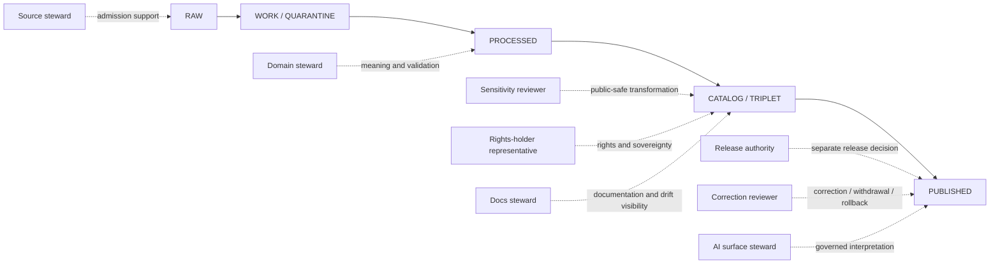

<!-- [KFM_META_BLOCK_V2]
doc_id: kfm://doc/governance/steward-charters
title: Steward Charters — Responsibility, Assignment, and Handoff Boundaries
type: governance-guide
version: v2-draft
status: draft; repository-grounded; proposed role guidance; non-authoritative; no-release-effect
owners:
  - "@bartytime4life — verified CODEOWNERS review route only"
owner_status: "No accepted StewardshipAssignment, authenticated KFM actor identity, independent reviewer capacity, release authority, reviewer quorum, or approval is implied."
created: 2026-05-12
updated: 2026-08-23
policy_label: public
owning_root: docs/
current_path: docs/governance/STEWARD_CHARTERS.md
responsibility: "Explain proposed steward roles, assignment and eligibility requirements, collaboration and handoff boundaries, absence/conflict/succession posture, and their relationship to evidence, policy, review, release, correction, and rollback without creating operational authority."
truth_posture: "CONFIRMED repository evidence and accepted Directory Rules placement / PROPOSED eight-role charter model and separation requirements / CONFLICTED ReviewRecord machine surfaces / UNKNOWN accepted staffing, actor identity, independent capacity, policy, release, and operational enforcement / NEEDS VERIFICATION current platform coupling; cite-or-abstain"
evidence_snapshot:
  repository: bartytime4life/Kansas-Frontier-Matrix
  inspected_main: 565af2021254c27ea3626724106ad6b1eae800df
  target_prior_blob: a42ada278e03e930be590b2182ffdd1fe2ac36e6
  directory_rules_blob: fd49a0b83e55cef52c1124281f093e263526898d
  directory_rules_decision: ADR-0029 accepted
  governance_readme_blob: 500f8bcad3a384160a561f1460617f0a13d42fcc
  review_duties_blob: df9848c324cbb1b7a3d63b32bd5e2fcf929ff4e9
  separation_of_duties_blob: 00f68beeeec7d57cce806e6cdbd710a837bd4f0c
  codeowners_blob: dd2a84aa514d8ecd9208bc347f90f9a2ed37dd61
  stewardship_assignment_contract_blob: 80c6fd4149deeb4172e2401dfaf741226380f085
  stewardship_assignment_schema_blob: bd12f7e5e8eea966306c250d992f2826693815c9
  review_record_contract_blob: 9641345d1e5d939dc59687a900e60a563d92c4f0
  review_authority_binding_contract_blob: f156e100660e9fd97ca95e90092143a3cd6d62ee
  sensitive_release_review_contract_blob: 235ca86dd807c6842ca8c861f995371fe7758f64
  release_policy_readme_blob: 8a6a91e18f29f6f961eac88270b385a95b86281e
  release_reviews_readme_blob: bf3058a5af8fc85aa04a25a36ed03541cd9eb657
inspection_boundary: >-
  Current-session GitHub reads of the target, accepted Directory Rules decision and bytes,
  governance landing page, current Review Duties and Separation of Duties guides, proposed
  ADR-0024, CODEOWNERS, StewardshipAssignment and ReviewRecord contracts, assignment and
  ReviewRecord schema surfaces, ReviewAuthorityBinding, SensitiveReleaseReviewClosure,
  release-policy guidance, release-review guidance, and review-proof guidance. No actor was
  authenticated, no assignment was accepted, no live policy bundle or release gate was
  evaluated, no governed review or release record was issued, and no promotion, release,
  deployment, publication, correction, withdrawal, or rollback was exercised.
related:
  - ./README.md
  - ./REVIEW_DUTIES.md
  - ./SEPARATION_OF_DUTIES.md
  - ./ESCALATION.md
  - ./CONTRADICTION_HANDLING.md
  - ./DEPRECATION_PROCESS.md
  - ../doctrine/directory-rules.md
  - ../adr/ADR-0029-adopt-directory-governance-standard-v2.md
  - ../adr/ADR-0024-steward-separation-of-duties-for-release.md
  - ../registers/DRIFT_REGISTER.md
  - ../registers/VERIFICATION_BACKLOG.md
  - ../../contracts/governance/steward_assignment.md
  - ../../contracts/governance/ReviewRecord.md
  - ../../contracts/governance/review_authority_binding.md
  - ../../contracts/governance/sensitive_release_review_closure.md
  - ../../schemas/contracts/v1/governance/steward_assignment.schema.json
  - ../../schemas/contracts/v1/governance/review_record.schema.json
  - ../../schemas/contracts/v1/review/review_record.schema.json
  - ../../policy/release/README.md
  - ../../release/reviews/README.md
  - ../../data/proofs/review/README.md
  - ../../.github/CODEOWNERS
tags: [kfm, governance, stewardship, assignments, reviewer-roles, separation-of-duties, evidence, release, correction, rollback]
notes:
  - "v2-draft is a same-path documentation-only reconciliation against current repository evidence."
  - "ADR-0029 is accepted and confirms the docs/ responsibility root; this update creates no path or authority home."
  - "Historical ADR-S-09 vocabulary is retained only as source lineage. ADR-0024 is the current numbered release-separation decision and remains proposed."
  - "Role labels do not prove staffing, identity, assignment, independence, approval, policy authority, release authority, or platform enforcement."
  - "The eight-role charter catalogue and the broader draft StewardshipAssignment role vocabulary are not yet a closed accepted enum."
  - "No contract, schema, policy, fixture, validator, workflow, platform setting, review record, release record, or published artifact changes."
[/KFM_META_BLOCK_V2] -->

<a id="top"></a>

# Steward Charters — Responsibility, Assignment, and Handoff Boundaries

> **Human governance guidance for KFM.** This document describes a proposed eight-role stewardship model, the evidence required to bind a role to an eligible actor, the limits of each role, and the handoffs needed before a trust-bearing state transition. It does not staff a role, authenticate an actor, grant authority, approve a review, or release anything.

[](#2-authority-and-doctrinal-basis)
[](../adr/ADR-0029-adopt-directory-governance-standard-v2.md)
[](../adr/ADR-0024-steward-separation-of-duties-for-release.md)
[](#41-role-label--assignment--review--decision)
[](#14-maturity-model-and-enforcement-posture)
[](#192-non-effects)

> [!IMPORTANT]
> **A charter is not an assignment.** A role name, this document, CODEOWNERS routing, a GitHub account, a pull-request review, a fixture, a validator result, or a workflow check does not establish that an actor is eligible to exercise KFM stewardship or release authority. Eligibility requires accepted, scoped, current, conflict-aware authority evidence for the exact subject and action.

> [!WARNING]
> **Current operational stewardship is not established.** The repository contains substantive human guidance, draft semantic contracts, proposed schemas, fixture-only validation profiles, release-review guidance, and CODEOWNERS routing. It does not establish an accepted steward roster, authenticated actor aliases, independent reviewer capacity, executable release policy, a governed parent-level release review, or an operational release authority.

> [!CAUTION]
> **Do not turn prose into an authority shortcut.** The role catalogue below is proposed. The draft `StewardshipAssignment` contract carries a broader role vocabulary than this eight-role guide, its machine schema remains a permissive placeholder, and ReviewRecord has conflicting schema candidates. This document records those boundaries and fails closed; it does not choose a canonical enum or machine profile.

| Field | Current bounded value |
|---|---|
| **Document status** | `draft` human-facing governance guidance |
| **Tracked path** | `docs/governance/STEWARD_CHARTERS.md` — **CONFIRMED** repository-present, same-path update |
| **Placement authority** | Accepted [`ADR-0029`](../adr/ADR-0029-adopt-directory-governance-standard-v2.md) and adopted [`directory-rules.md`](../doctrine/directory-rules.md) place human explanation under `docs/` |
| **Detailed release-SoD decision** | [`ADR-0024`](../adr/ADR-0024-steward-separation-of-duties-for-release.md) is source status `draft`, effective decision status `proposed` |
| **Role catalogue** | Eight proposed cross-gate stewardship labels; not a closed accepted actor-role registry |
| **Repository review route** | [`@bartytime4life`](../../.github/CODEOWNERS) through CODEOWNERS; routing is not assignment, independence, approval, or release authority |
| **Assignment meaning** | Draft [`StewardshipAssignment`](../../contracts/governance/steward_assignment.md) semantic contract |
| **Assignment machine shape** | Proposed permissive placeholder; not sufficient for operational authority |
| **Review machine shape** | **CONFLICTED:** two ReviewRecord schema candidates plus a richer draft semantic contract |
| **Bounded executable support** | Fixture-only `ReviewAuthorityBinding` and T3/T4 `SensitiveReleaseReviewClosure`; both grant no authority |
| **Accepted staffed roster** | `UNKNOWN / HOLD` |
| **Operational review and release authority** | `UNKNOWN / HOLD` |
| **Release, deployment, publication effect** | None |
| **Evidence checkpoint** | Repository reads anchored at `main@565af2021254c27ea3626724106ad6b1eae800df` |

---

## Contents

1. [Purpose and Scope](#1-purpose-and-scope)
2. [Authority and Doctrinal Basis](#2-authority-and-doctrinal-basis)
3. [Roster of Stewards](#3-roster-of-stewards)
4. [Charter Template](#4-charter-template)
5. [Source steward](#5-source-steward)
6. [Domain steward](#6-domain-steward)
7. [Sensitivity reviewer](#7-sensitivity-reviewer)
8. [Rights-holder representative](#8-rights-holder-representative)
9. [Release authority](#9-release-authority)
10. [Correction reviewer](#10-correction-reviewer)
11. [AI surface steward](#11-ai-surface-steward)
12. [Docs steward](#12-docs-steward)
13. [Separation-of-Duties Matrix](#13-separation-of-duties-matrix)
14. [Maturity Model and Enforcement Posture](#14-maturity-model-and-enforcement-posture)
15. [Onboarding, Review, and Succession](#15-onboarding-review-and-succession)
16. [Open Questions and ADR Linkage](#16-open-questions-and-adr-linkage)
17. [Glossary](#17-glossary)
18. [Related Docs](#18-related-docs)
19. [Verification and Rollback](#19-verification-and-rollback)

---

## 1. Purpose and Scope

This guide makes proposed human responsibility boundaries inspectable without treating a responsibility label as current authority. It helps a maintainer answer six questions:

1. **Which stewardship concern is implicated by the exact subject and requested next gate?**
2. **What may the proposed role inspect, recommend, or hand off?**
3. **What may that role never establish alone?**
4. **Which actor identity, assignment, interval, conflict, and independence evidence would make a reviewer eligible?**
5. **Which collaborators and state-bearing artifacts remain required?**
6. **What must happen when the role is absent, conflicted, expired, or unverified?**

The charter model supports KFM's evidence-first, policy-aware trust membrane. It does not replace evidence, policy, review, promotion, release, correction, withdrawal, rollback, platform controls, or operational staffing.

### 1.1 What this document can establish

- a repository-grounded description of the current proposed eight-role catalogue;
- the intended responsibility and anti-collapse boundary of each role;
- the minimum facts needed to bind a role label to an eligible actor;
- proposed collaboration and separation triggers for trust-bearing actions;
- a fail-closed handoff posture when staffing, authority, evidence, policy, rights, sensitivity, correction, or rollback is unresolved;
- current repository gaps and the evidence needed to graduate the model.

### 1.2 What this document cannot establish

- an accepted `StewardshipAssignment` or private roster;
- that a GitHub identity maps to one unique KFM actor;
- that a person, team, service, or model is independent, current, conflict-free, or authorized;
- a canonical role enum or ReviewRecord schema;
- a policy outcome, promotion decision, release decision, correction, withdrawal, or rollback;
- that a release-policy module, evaluator, queue, signer, or public route is active;
- that a workflow pass, pull-request approval, merge, or file placement creates KFM authority;
- that an AI answer, map, tile, graph, summary, or generated report is evidence or sovereign truth.

### 1.3 Safe use sequence

```text
fix subject + digest + requested next gate
  -> identify proposed role and materiality trigger
  -> resolve actor identity + accepted scoped assignment + interval + conflicts
  -> resolve EvidenceRef to EvidenceBundle where claims depend on evidence
  -> collect validation + policy + rights + sensitivity + correction + rollback context
  -> conduct bounded review and record the exact disposition
  -> hand off to the separate promotion, release, correction, or rollback authority
  -> change state only through the governing state-bearing record
```

Any unresolved identity, assignment, independence, evidence, policy, rights, sensitivity, or recovery dependency narrows the action to `HOLD`, `ABSTAIN`, `DENY`, or `ESCALATE` under the applicable accepted profile. This human sequence does not introduce a new machine outcome vocabulary.

[Back to top](#top)

---

## 2. Authority and Doctrinal Basis

### 2.1 Authority order

| Question | Controlling surface | Current status |
|---|---|---|
| Where may this human guide live? | Accepted [`ADR-0029`](../adr/ADR-0029-adopt-directory-governance-standard-v2.md), adopted [`directory-rules.md`](../doctrine/directory-rules.md), and the repository-present path | **CONFIRMED** under `docs/`; same-path update |
| Is the detailed release-SoD model accepted? | [`ADR-0024`](../adr/ADR-0024-steward-separation-of-duties-for-release.md) and the canonical ADR index | **PROPOSED**, not accepted |
| What does a stewardship assignment mean? | [`contracts/governance/steward_assignment.md`](../../contracts/governance/steward_assignment.md) | Draft semantic contract |
| What machine shape is valid? | Accepted schema authority and a reviewed object-family decision | Assignment schema is a permissive placeholder; ReviewRecord schemas conflict |
| Who may act for a role? | Accepted actor identity, aliases, scoped assignment, interval, conflict/recusal status, and applicable policy | **UNKNOWN / HOLD** |
| What is admissible? | Accepted policy source through an accepted, digest-bound evaluator | Release-policy lane is scaffolded/inactive |
| What changes lifecycle or public state? | State-bearing promotion, release, correction, withdrawal, and rollback records | Not established by this guide |
| What does GitHub enforce? | Current platform configuration and exact required-check coupling | **NEEDS VERIFICATION** before operational reliance |

Historical `ADR-S-09`, `ADR-S-13`, and `ADR-S-15` labels in earlier source material are lineage terms, not verified current repository decision paths. `ADR-0024` is the current numbered release-separation decision. It remains proposed, and this update does not accept it.

### 2.2 Same-path Directory Rules basis

This file's one authority owner is the canonical `docs/` responsibility root because its purpose is human explanation. The tracked uppercase path already exists. Updating it in place does not create, move, rename, canonize, mirror, or retire any path.

| Responsibility | Owning surface | Relationship to this guide |
|---|---|---|
| Human role charters, handoffs, and anti-patterns | `docs/governance/` | **Owned here** |
| Stable operating law | `docs/doctrine/` | Outranks this draft guide |
| Material decisions | `docs/adr/` | Accept, reject, or supersede the proposed model |
| Assignment and review-event meaning | `contracts/governance/` | Referenced; not redefined |
| Machine-checkable shape | `schemas/contracts/v1/` | Referenced; maturity/conflicts disclosed |
| Admissibility and release restrictions | `policy/` | Separate policy authority |
| Reusable cases and executable evidence | `fixtures/`, `tests/`, `tools/validators/`, workflows | Bounded evidence only |
| Review-support proofs | `data/proofs/review/` | Separate support family; not review or release authority |
| Release reviews and state-bearing decisions | `release/` | Separate release-control family |
| Repository routing and merge controls | `.github/` and platform settings | Platform controls; not KFM stewardship or release authority |

### 2.3 Truth labels

- **CONFIRMED** — verified in this session from repository bytes, accepted decisions, or directly inspected configuration.
- **PROPOSED** — a role, matrix, threshold, cadence, or implementation design not accepted or operationally proven.
- **UNKNOWN** — the current condition cannot be established from inspected evidence.
- **NEEDS VERIFICATION** — a bounded check can resolve the claim but has not yet done so strongly enough.
- **HOLD** — a stronger trust-bearing transition must not proceed because a required dependency remains unresolved.

### 2.4 Current repository evidence and gaps

| Surface | Confirmed repository state | Safe conclusion |
|---|---|---|
| This target | Existing v0.2 draft at prior blob `a42ada278e03e930be590b2182ffdd1fe2ac36e6` | Same-path modernization is appropriate; prior prose is not accepted staffing evidence |
| Directory authority | ADR-0029 accepted; adopted Directory Rules bytes pinned | `docs/` placement is confirmed; placement grants no governance or release authority |
| ADR-0024 | Numbered release-SoD record remains draft/proposed | Detailed separation model remains proposal work |
| Governance siblings | Current repository-grounded Review Duties and Separation of Duties guides exist | This file should align with their bounded posture rather than older Atlas-only claims |
| CODEOWNERS | Relevant roots route to one verified account | Routing exists; independent actor capacity and assignments are not proven |
| `StewardshipAssignment` | Draft semantic contract exists | Meaning is described; no accepted roster or active assignment is proven |
| Assignment schema | Proposed placeholder requiring only a generic ID and allowing additional properties | Not sufficient for closed role, scope, authority, interval, or conflict validation |
| `ReviewRecord` | Rich draft semantic contract plus two machine candidates | Machine authority is **CONFLICTED / HOLD** |
| `ReviewAuthorityBinding` | Deterministic fixture-only profile with `BOUND`, `HOLD`, and `DENY` | Structural agreement can be tested; actors are not authenticated and authority is not granted |
| `SensitiveReleaseReviewClosure` | Fixture-only T3/T4 profile; positive state stops at a separate release gate | No policy, promotion, release, deployment, or publication authority |
| `policy/release/` | Scaffolded, inactive release-policy lane | No accepted bundle, evaluator, consumer, or operational decision path established |
| `release/reviews/` | Guidance-only parent lane; no governed parent-level review record established | Review-instance and release integration remain held |
| Accepted staffed roster | Not found in inspected public repository surfaces | **UNKNOWN / HOLD**; do not invent people or teams |

[Back to top](#top)

---

## 3. Roster of Stewards

The eight labels below are the current **proposed cross-gate charter catalogue** carried by KFM governance guidance and ADR-0024. They are responsibility labels, not jobs, GitHub teams, identities, accepted assignments, or a closed machine enum.

| # | Proposed role | Primary responsibility | Typical subject families | Current authority posture |
|---|---|---|---|---|
| 1 | **Source steward** | Source identity, role, terms, cadence, admission packet, and source-specific escalation | `SourceDescriptor`, source family, retrieval/intake proposal | Proposed label; no accepted assignment verified |
| 2 | **Domain steward** | Domain meaning, object use, domain evidence expectations, transforms, and domain-scoped validation | Domain contracts, schemas, validators, `ValidationReport`, transforms | Proposed label; no accepted assignment verified |
| 3 | **Sensitivity reviewer** | Precision, redaction, generalization, withholding, sensitivity, and harmful-exposure review | Sensitive geometry/attributes, public-safe derivatives, tier/profile transitions | Proposed label; no accepted assignment verified |
| 4 | **Rights-holder representative** | Rights, consent, sovereignty, cultural authority, licensed use, and community-specific review | Archaeology, sovereign/community data, living-person, DNA, land/title contexts | Proposed label; no accepted assignment verified |
| 5 | **Release authority** | Accountable decision for a bounded release transition and rollback authorization | Release candidate, manifest, public-safe carrier, release-state change | Proposed role; operational authority **HOLD** |
| 6 | **Correction reviewer** | Correction, withdrawal, supersession, derivative impact, and rollback assessment | `CorrectionNotice`, withdrawal, replacement, rollback proposal | Proposed label; no accepted assignment verified |
| 7 | **AI surface steward** | Evidence-bounded AI behavior, templates, policy bindings, citations, finite outcomes, and AI receipt audit | Focus Mode, AI prompts/bindings, `AIReceipt`, public interpretation surface | Proposed label; no accepted assignment verified |
| 8 | **Docs steward** | Human documentation integrity, decision/index visibility, drift disclosure, links, and supersession | `docs/`, ADR/index navigation, governance guides, drift visibility | Proposed label; CODEOWNERS route is not assignment |

### 3.1 Role-vocabulary boundary

The draft `StewardshipAssignment` semantic contract also names `contract_steward`, `schema_steward`, `policy_steward`, `ui_api_steward`, and `validation_steward`. That broader vocabulary is useful design lineage, but neither it nor this eight-role catalogue is an accepted closed enum.

Until an accepted decision harmonizes the vocabularies:

- use the exact profile's declared role label;
- record role and scope explicitly rather than translating by intuition;
- do not silently map one label to another;
- do not infer authority from a role string;
- treat ambiguous, overlapping, or conflicting assignments as `HOLD` and escalate.

### 3.2 Role participation across the lifecycle


```mermaid
flowchart LR
  RAW[RAW] --> WQ[WORK / QUARANTINE]
  WQ --> PROCESSED[PROCESSED]
  PROCESSED --> CATALOG[CATALOG / TRIPLET]
  CATALOG --> PUBLISHED[PUBLISHED]

  SRC[Source steward] -. admission support .-> RAW
  DOM[Domain steward] -. meaning and validation .-> PROCESSED
  SENS[Sensitivity reviewer] -. public-safe transformation .-> CATALOG
  RIGHTS[Rights-holder representative] -. rights and sovereignty .-> CATALOG
  REL[Release authority] -. separate release decision .-> PUBLISHED
  CORR[Correction reviewer] -. correction / withdrawal / rollback .-> PUBLISHED
  AI[AI surface steward] -. governed interpretation .-> PUBLISHED
  DOCS[Docs steward] -. documentation and drift visibility .-> CATALOG
```

The diagram is explanatory. A role's participation does not move an object through the lifecycle. Promotion and publication remain separate governed transitions.

[Back to top](#top)

---

## 4. Charter Template

A usable charter must separate **responsibility**, **eligibility**, **review**, and **state-bearing authority**. The field set below is human guidance and must not be serialized as a new contract while machine authority remains unresolved.

| Field | Required meaning |
|---|---|
| **Role label** | Exact proposed or accepted vocabulary used for the action |
| **Purpose** | One bounded responsibility statement |
| **Subject scope** | Exact object, path family, source family, domain, policy surface, release surface, or workflow covered |
| **In-scope actions** | What the role may inspect, recommend, author, or hand off |
| **Out-of-scope actions** | What the role cannot establish, especially alone |
| **Actor identity** | Stable actor reference and relevant aliases, resolved through an accepted identity mechanism |
| **Assignment basis** | Accepted `StewardshipAssignment`, ADR, governance decision, or other accepted authority basis |
| **Effective interval** | Start, expiry/review time, and current status covering the action time |
| **Required collaborators** | Other roles that must participate for the subject and materiality class |
| **Independence trigger** | Whether author, producer, detector, reviewer, and release authority must be distinct |
| **Conflict and recusal** | Disclosed conflicts, recusals, delegations, and replacement route |
| **Evidence and policy inputs** | Exact evidence, validation, rights, sensitivity, policy, correction, and rollback references |
| **Handoff output** | Bounded review or recommendation and the separate next gate |
| **Absence posture** | `HOLD`, `ABSTAIN`, `DENY`, or `ESCALATE`; never assumed authority |
| **Succession and supersession** | Replacement assignment, open work transfer, prior record links, and effective cutover |
| **Audit and re-review triggers** | Subject change, evidence drift, policy change, assignment expiry, conflict, correction, or incident |

### 4.1 Role label ≠ assignment ≠ review ≠ decision

| Surface | What it can show | What it cannot show by itself |
|---|---|---|
| This charter | Proposed responsibility and handoff boundaries | An eligible actor or approval |
| CODEOWNERS | GitHub review routing for matched paths | KFM actor identity, assignment, independence, or release authority |
| `StewardshipAssignment` | Semantic responsibility over a bounded target when accepted and instantiated | That a review occurred or a release was approved |
| `ReviewRecord` | A subject-bound review event when governed and valid | Policy, promotion, release, correction, or publication by itself |
| `PolicyDecision` | A finite policy result for an exact input and evaluator | Evidence, human review, or release state |
| Promotion/release record | An accountable state-bearing decision for the exact subject | Automatic correctness, immunity from correction, or authority outside scope |

### 4.2 Minimum eligibility evidence

Before treating an actor as eligible for a trust-bearing stewardship action, resolve all of the following:

- stable actor identity and aliases;
- an accepted, active, scoped assignment or other accepted authority basis;
- role and jurisdiction covering the exact subject and action;
- an effective interval covering review or decision time;
- required partner roles and independence from the author/producer/detector where applicable;
- conflicts, recusals, delegations, and bootstrap exceptions;
- evidence and protected context access needed to review safely;
- a correction, withdrawal, escalation, and rollback route.

Missing or contradictory eligibility evidence fails closed. A second username, bot, service account, or model does not prove a second independent actor.

### 4.3 Assignment maturity conflict

The draft assignment contract describes rich fields such as target, role, assigned actor, status, authority basis, interval, partner roles, escalation, supersession, and review references. The current assignment schema is still a permissive placeholder. Therefore:

- contract prose is design meaning, not accepted machine shape;
- schema-validity under the placeholder cannot prove a complete assignment;
- no public roster should be fabricated to fill the gap;
- operational authority remains `HOLD` until contract, schema, fixtures, validator, policy, identity, and assignment instances converge through reviewed decisions.

[Back to top](#top)

---

## 5. Source steward

| Charter field | Proposed boundary |
|---|---|
| **Purpose** | Make source identity, role, terms, cadence, intended use, authority limits, and initial sensitivity posture explicit before downstream use. |
| **Typical subjects** | Source family, `SourceDescriptor`, retrieval proposal, intake record, source-role assignment, freshness review. |
| **May do** | Assemble and review a source-admission packet; identify unresolved terms; recommend admission, quarantine, hold, denial, or escalation for the stated next gate. |
| **Cannot establish alone** | Rights-holder consent, sovereignty clearance, safe public precision, domain truth, policy permission, release approval, or publication. |
| **Required collaborators** | Domain steward for meaning/use; Sensitivity reviewer for exposure; Rights-holder representative when rights, consent, sovereignty, or cultural authority is implicated. |
| **Minimum handoff** | Stable source identity/version, role, terms, authority statement, intended use, cadence, provenance, rights/sensitivity status, known limits, evidence references, and unresolved obligations. |
| **Absence/conflict posture** | `HOLD` source admission or narrow it to quarantine/research-only handling; never infer permission from availability or licensing shorthand. |
| **Re-review triggers** | Terms or endpoint change, cadence lapse, source-role dispute, ownership change, contradiction, correction, rights revocation, or intended-use expansion. |

### 5.1 Source-role anti-collapse

A source steward must not silently reinterpret or upcast a source role. For example, modeled, regulatory, administrative, aggregate, historical, or corroborating material must not be relabeled as observed evidence merely because a downstream use would be easier.

A role change requires a new or superseding descriptor, explicit rationale, review, compatibility impact, and correction of affected derivatives. It does not occur by editing prose or moving a file.

### 5.2 Availability is not admission

A source being public, downloadable, official-looking, technically accessible, or already present in a repository does not prove:

- authority for the intended claim;
- rights for the intended reuse;
- safe precision or sensitivity posture;
- currentness or completeness;
- acceptance into KFM's governed source portfolio;
- release or publication readiness.

[Back to top](#top)

---

## 6. Domain steward

| Charter field | Proposed boundary |
|---|---|
| **Purpose** | Protect domain meaning, anti-collapse rules, accepted use, transformations, domain evidence expectations, and domain-scoped validation. |
| **Typical subjects** | Domain object families, semantic contracts, schema implications, validators, `ValidationReport`, transformations, cross-domain joins. |
| **May do** | Review domain meaning and fitness; identify required validators and negative cases; recommend normalization, quarantine, correction, or handoff. |
| **Cannot establish alone** | Schema authority outside accepted schema decisions, policy permission, sensitivity clearance, rights-holder consent, public release, or cross-domain precedence. |
| **Required collaborators** | Contract/schema/policy/validation stewards or equivalent accepted roles; Sensitivity reviewer for exposure; affected domain stewards for cross-domain joins; Release authority for publication. |
| **Minimum handoff** | Exact object/profile, semantic contract, source role, transform identity, input/output digests, validation results and limits, evidence closure, cross-domain effects, correction and rollback path. |
| **Absence/conflict posture** | `HOLD` meaning-changing promotion or cross-domain use; route routine low-risk validation only where an accepted profile permits it. |
| **Re-review triggers** | Contract/schema/profile change, source-role change, new join, changed geography/time support, validator drift, contradiction, correction, or public-use expansion. |

### 6.1 Determinism does not remove accountability

A deterministic validator may be authored and executed without a different human for every run when an accepted risk profile permits it. That convenience does not allow the validator author to:

- define semantic truth through code alone;
- treat a passing fixture as authority;
- bypass independent review for a material contract, policy, sensitivity, or release change;
- conceal known limits, baseline debt, skipped checks, or untested negative paths.

### 6.2 Cross-domain work

Cross-domain joins must preserve each source role, time support, geography, sensitivity, and correction lineage. No single domain steward may silently resolve a conflict that changes another domain's meaning or public exposure.

[Back to top](#top)

---

## 7. Sensitivity reviewer

| Charter field | Proposed boundary |
|---|---|
| **Purpose** | Review precision, redaction, generalization, aggregation, delay, withholding, audience, reconstruction risk, and harmful-exposure posture. |
| **Typical subjects** | Living-person and genomic data, archaeology, rare species, culturally restricted material, private land/title, infrastructure, exact locations, sensitive joins, public-safe derivatives. |
| **May do** | Require stronger restriction, redaction, generalization, delay, withholding, denial, or re-review; assess whether a proposed public representation is bounded and non-reconstructive. |
| **Cannot establish alone** | Consent, sovereignty, legal rights, domain truth, policy permission, release authority, or publication. |
| **Required collaborators** | Rights-holder representative where consent/sovereignty/cultural authority applies; Domain steward for semantic fitness; Release authority for public exposure. |
| **Minimum handoff** | Exact sensitivity trigger, internal/public representation, transformation and receipt, audience and purpose, reconstruction assessment, residual risk, expiry/re-review, correction/withdrawal/rollback behavior. |
| **Absence/conflict posture** | Fail closed: quarantine, withhold, generalize, delay, deny, or escalate. Client-side hiding is not adequate protection. |
| **Re-review triggers** | Audience/precision change, new join, rights change, improved re-identification capability, source update, incident, correction, or policy version change. |

### 7.1 Tier and profile boundary

Earlier source material uses T0–T4 vocabulary, and the repository contains a fixture-only T3/T4 sensitive-release closure profile. That does not establish one accepted universal tier system or an operational release gate.

Use a tier only when the exact accepted or proposed profile declares it. Regardless of label, unresolved rights, living-person, DNA, archaeology, rare-species, infrastructure, sovereignty, cultural sensitivity, private-land, or harmful-precision concerns require conservative treatment.

### 7.2 Restriction and public release are asymmetric

Protective containment may need to happen quickly. A reviewer may recommend immediate withholding, reduced precision, or access restriction while fuller review proceeds. Making information more public requires stronger support: evidence, transform traceability, rights and sensitivity review, policy, separate release authority, correction path, and rollback target.

[Back to top](#top)

---

## 8. Rights-holder representative

| Charter field | Proposed boundary |
|---|---|
| **Purpose** | Represent the specific rights, consent, sovereignty, cultural authority, community protocol, licensed-use, or data-subject interest implicated by a bounded action. |
| **Typical subjects** | Sovereign/community data, cultural heritage and archaeology, living-person and DNA data, family/descendant material, consent-bearing collections, restricted agreements. |
| **May do** | Confirm, condition, withhold, revoke, narrow, or escalate the rights/consent/sovereignty posture for the represented subject and scope. |
| **Cannot establish alone** | Technical validity, domain meaning, safe public precision, policy evaluation, release manifest issuance, or authority for another community or subject. |
| **Required collaborators** | Sensitivity reviewer; Source steward at admission; Domain steward for meaning; Release authority for public release. |
| **Minimum handoff** | Represented subject/community scope, authority basis, permitted purpose/audience, consent or agreement state, restrictions, expiry/review, revocation and correction behavior, protected reference rather than exposed private detail. |
| **Absence/conflict posture** | `HOLD`, withhold, or deny the affected use. Lack of a representative is not implied consent. |
| **Re-review triggers** | Consent/terms change, revocation, community request, scope/audience expansion, new derivative, incident, correction, or succession of the representative. |

> [!WARNING]
> **Sovereignty and representation are not transferable by analogy.** A representative for one community, family, agreement, collection, or data subject must not be assumed to represent another. Public documentation must not expose private identities, protected terms, culturally restricted reasons, or control-defeating detail.

[Back to top](#top)

---

## 9. Release authority

| Charter field | Proposed boundary |
|---|---|
| **Purpose** | Make the accountable, bounded decision for an exact release transition after evidence, validation, policy, rights, sensitivity, review, integrity, correction, and rollback dependencies are resolved. |
| **Typical subjects** | Release candidate, manifest candidate, public-safe carrier, active-release pointer, rollback target, re-release after correction. |
| **May do** | Issue or authorize the applicable state-bearing release decision only when an accepted scoped assignment and operational release profile establish eligibility. |
| **Cannot establish alone** | Evidence, source authority, domain truth, policy permission, consent, sensitivity clearance, independent review, deployment success, or immutable correctness. |
| **Required collaborators** | Author/producer and Domain steward; policy reviewer/evaluator; Sensitivity reviewer and Rights-holder representative where triggered; Correction reviewer for rollback or corrected release. |
| **Minimum handoff** | Fixed release subject and digest, evidence and validation closure, policy decision, eligible review records, rights/sensitivity status, manifest, integrity/signature posture, correction/withdrawal path, rollback target, public-safe carrier and audience. |
| **Absence/conflict posture** | `HOLD` release. A repository owner, merger, workflow, or role label must not be substituted for operational release authority. |
| **Re-review triggers** | Subject bytes, evidence, policy, assignment, reviewer set, rights, sensitivity, manifest, carrier, correction, rollback, signer, audience, or deployment target changes. |

### 9.1 Current authority boundary

No accepted operational release-authority assignment was verified in the inspected repository surfaces. ADR-0024 remains proposed, the release-policy lane remains scaffolded, and release-review guidance does not establish a parent-level governed review.

Therefore this charter describes intended responsibility only. It does not make `@bartytime4life`, a CODEOWNER, a maintainer, a workflow, a bot, or any named role the KFM release authority.

### 9.2 Author ≠ release authority when materiality applies

For a material subject, the actor who authored or produced the release candidate must not be represented as an independently attributable release authority for that same subject unless an accepted, scoped, time-bounded bootstrap exception explicitly permits the action and preserves correction and rollback. High-risk or sensitive release remains held when independent capacity is unavailable.

[Back to top](#top)

---

## 10. Correction reviewer

| Charter field | Proposed boundary |
|---|---|
| **Purpose** | Assess whether published or release-significant state is wrong, unsafe, revoked, superseded, or materially stale, and define the bounded correction, withdrawal, replacement, invalidation, or rollback response. |
| **Typical subjects** | `CorrectionNotice`, withdrawal notice, supersession chain, rollback proposal, derivative invalidation list, cache/read-model repair. |
| **May do** | Recommend correction, withdrawal, rollback, re-review, re-release, or no action; bind the finding to the prior state and blast radius. |
| **Cannot establish alone** | New domain truth, policy override, release execution, deletion of history, or silent mutation of a published carrier. |
| **Required collaborators** | Error detector/author; Domain steward; Release authority for public-state change; Sensitivity reviewer and Rights-holder representative where exposure or rights change. |
| **Minimum handoff** | Prior state and digest, defect/trigger evidence, affected claims and derivatives, severity, replacement or rollback target, invalidation/cache plan, public notice posture, review and release dependencies. |
| **Absence/conflict posture** | Preserve prior bytes and mark the affected state held, disputed, stale, revoked, or withdrawn according to the accepted profile; escalate rather than silently rewrite. |
| **Re-review triggers** | New evidence, expanded blast radius, failed propagation, rights revocation, incomplete rollback, recurring defect, or replacement release. |

### 10.1 Stale is not automatically wrong

Freshness expiry, policy drift, assignment expiry, geography change, or review aging can make a record stale without proving it false. Conversely, a recent record can still be wrong. The correction reviewer must state which condition is supported and must not use one label to conceal another.

### 10.2 History remains inspectable

Correction must preserve prior state, causal evidence, decision lineage, affected derivatives, replacement/rollback target, and public notice where required. Replacing bytes without traceability is not correction.

[Back to top](#top)

---

## 11. AI surface steward

| Charter field | Proposed boundary |
|---|---|
| **Purpose** | Keep AI interpretation evidence-bounded, policy-aware, finite in outcome, traceable, correctable, and separated from root truth and direct public mutation. |
| **Typical subjects** | Focus Mode templates, model-adapter inputs/outputs, AI policy bindings, citation behavior, `AIReceipt`, prompt-injection controls, map-action proposals. |
| **May do** | Review templates and bindings; test `ANSWER`, `ABSTAIN`, `DENY`, and `ERROR` behavior; audit citation/evidence closure; require narrowing, refusal, correction, or escalation. |
| **Cannot establish alone** | Evidence, source authority, domain truth, policy permission, public release, model self-approval, direct browser-to-model authority, or map/data mutation. |
| **Required collaborators** | Domain steward for subject meaning; evidence/policy reviewers or equivalent accepted roles; Docs steward for human guidance; Release authority for a public release-significant surface. |
| **Minimum handoff** | Exact template/binding/model profile, subject and scope, resolved evidence, policy context, expected finite outcomes, negative tests, citation/abstention behavior, receipt identity, correction and rollback plan. |
| **Absence/conflict posture** | Disable or narrow the affected AI surface, return a bounded non-answer, and escalate. Fluency is never a substitute for missing evidence or authority. |
| **Re-review triggers** | Template, model, adapter, evidence resolver, policy, source, outcome mapping, public route, prompt-injection control, or correction behavior changes. |

> [!CAUTION]
> **EvidenceBundle outranks generated language.** AI is interpretive, not the root truth source. It must not answer from unresolved RAW/WORK material, bypass governed APIs, fabricate citations, convert uncertainty into authority, or approve its own public behavior.

[Back to top](#top)

---

## 12. Docs steward

| Charter field | Proposed boundary |
|---|---|
| **Purpose** | Keep human documentation accurate, navigable, status-aware, source-traceable, contradiction-visible, supersession-aware, and aligned with accepted responsibility boundaries. |
| **Typical subjects** | Governance guides, doctrine references, ADR/index navigation, document metadata, link graph, drift and verification visibility, change history. |
| **May do** | Reconcile documentation against current evidence; identify drift; preserve source lineage; route material decisions to ADRs; improve rollback and review guidance. |
| **Cannot establish alone** | Contract meaning, schema shape, policy behavior, actor assignment, independent review, source admission, evidence closure, release authority, runtime behavior, deployment, or publication. |
| **Required collaborators** | Affected responsibility-root or subsystem owner for material content; decision owner for ADR changes; Domain/AI/Release roles where the document changes those boundaries. |
| **Minimum handoff** | Exact changed paths and preimages, evidence snapshot, truth labels, accepted/proposed decision status, affected interfaces, validation, open verification, review focus, and rollback. |
| **Absence/conflict posture** | Preserve current bytes or make the smallest containment correction; mark unresolved claims and paths `NEEDS VERIFICATION`; do not invent canonical homes or owners. |
| **Re-review triggers** | Accepted decision, directory-rule change, contract/schema/policy drift, moved path, broken link, stale evidence pin, operational implementation, correction, or supersession. |

### 12.1 Documentation authority is bounded

A docs steward can improve human truthfulness and governance visibility. Documentation cannot substitute for:

- a semantic contract or machine schema;
- an accepted policy or evaluator;
- a staffed roster or authenticated actor identity;
- a governed review, promotion, release, correction, withdrawal, or rollback record;
- deployed behavior or public-state evidence.

### 12.2 Public-safe documentation

Do not place private rosters, credentials, signer material, exact protected locations, living-person details, genomic data, culturally restricted reasons, private-land detail, infrastructure vulnerabilities, or control-defeating redaction parameters in public governance prose. Use bounded role labels and governed references.

[Back to top](#top)

---

## 13. Separation-of-Duties Matrix

The matrix below is **proposed human guidance** aligned with the current Review Duties, Separation of Duties, and ADR-0024 source posture. It is not current platform enforcement and does not replace the detailed sibling guides.

| Governed action | Proposed minimum participation | Current verified support | Safe conclusion |
|---|---|---|---|
| Editorial update to one draft governance guide | Author plus risk-scaled repository review | CODEOWNERS routing and PR mediation may apply | Reviewable documentation change only; no governance/release authority |
| Routine source intake with resolved terms and low materiality | Source steward; Domain steward as needed | Role guidance exists; assignments unverified | Recommendation only; admission still follows accepted source process |
| Source intake with unresolved rights, sovereignty, consent, or sensitivity | Source steward plus Rights-holder representative and/or Sensitivity reviewer | Human guidance only | `HOLD`, quarantine, deny, or escalate |
| Routine deterministic domain validation | Domain/validation responsibility; independent audit according to accepted risk profile | Validators and workflows may provide bounded evidence | A pass proves only the named profile |
| Meaning-changing transform or cross-domain join | Domain steward plus affected domain and sensitivity/policy participation | No universal accepted assignment model | `HOLD` stronger claim until dependencies close |
| Sensitive or harmful-precision public projection | Sensitivity reviewer, Rights-holder representative where applicable, Domain steward, separate Release authority | Fixture-only T3/T4 closure profile exists | Structural candidate only; separate policy/release gate required |
| Promotion to `PROCESSED` or `CATALOG/TRIPLET` | Domain steward; additional review when material | Lifecycle and review guidance exist | Review supports but does not perform promotion |
| Release to `PUBLISHED` | Author/producer distinct from eligible Release authority when materiality applies; policy and other roles as triggered | ADR-0024 proposed; operational release SoD held | No release authority established |
| Correction, withdrawal, or rollback affecting public state | Detector/author distinct from Correction reviewer; Release authority for state change | Human and contract guidance exists | State-bearing correction/rollback remains separate |
| AI template, policy-binding, or public behavior change | AI surface steward plus relevant domain/evidence/policy/docs review; Release authority when release-significant | No AI self-authority established | Cite-or-abstain; no public activation by prose |
| Charter, doctrine, or governance-standard authority change | Docs steward plus affected subsystem owner; ADR when duties or authority change | ADR mechanism exists | Draft update cannot accept its own authority |

### 13.1 Materiality triggers

Require stronger, independently attributable participation when the subject can affect:

- source admission, lifecycle state, public exposure, or release state;
- evidence meaning, contract/schema interpretation, policy, or authority;
- rights, consent, sovereignty, cultural sensitivity, living-person or genomic data;
- exact or harmful spatial precision, archaeology, rare species, infrastructure, or private land/title information;
- cross-domain joins, graph edges, aggregates, tiles, stories, exports, or AI/public interpretation;
- correction, withdrawal, rollback, cache invalidation, or published lineage;
- trust roots, signatures, identity, assignments, platform enforcement, or auditability.

### 13.2 Bootstrap limitation

When no independent capacity exists, record the limitation truthfully. Do not fabricate a second actor, treat a bot or model as independent, or relabel the repository owner as two roles. A bootstrap exception must be separately accepted, exact-subject scoped, time-bounded, conflict-aware, and reversible. Sensitive or high-consequence release remains held without sufficient authority.

### 13.3 Handoff packet

A role-to-role handoff should include:

- stable subject reference, version, digest, and immutable locator;
- requested next gate, scope, exclusions, audience, geography, and time;
- author/producer/detector identities and roles;
- proposed reviewer role and accepted assignment basis;
- evidence references and resolved-bundle status;
- source role, provenance, validation, integrity, and known limitations;
- policy, rights, consent, sovereignty, sensitivity, access, and public-safe transformation status;
- conflicts, recusals, independence trigger, effective interval, and expiry;
- open obligations, correction/withdrawal/supersession path, rollback target, and invalidation plan;
- a bounded disposition that names the next gate without claiming later state.

[Back to top](#top)

---

## 14. Maturity Model and Enforcement Posture

Documentation maturity, machine-shape maturity, identity maturity, platform enforcement, and release integration are different layers.

| Level | Required capability | Current repository evidence | Status |
|---|---|---|---|
| **L0 — Human guidance** | Role vocabulary, charter boundaries, review guidance, escalation, contradiction, deprecation, and open decisions | Repository-present governance lane and proposed ADR-0024 | **PRESENT / PROPOSED** |
| **L1 — Semantic and machine candidates** | Stewardship/review contracts, closed schemas, registries, valid/invalid fixtures | Draft contracts exist; assignment schema remains permissive; ReviewRecord schemas conflict | **PARTIAL / HOLD for authority** |
| **L2 — Bounded deterministic validation** | Deterministic validators, negative cases, stable finite outcomes, no-authority reports | `ReviewAuthorityBinding` and `SensitiveReleaseReviewClosure` fixture profiles exist | **SUBSTANTIVE but fixture-only** |
| **L3 — Governed actor identity and assignment** | Actor aliases, accepted scoped assignments, intervals, conflicts/recusals, independent capacity | Not established in inspected evidence | **HOLD** |
| **L4 — Platform and policy enforcement** | Verified required participation, anti-bypass controls, accepted policy/evaluator, audit trail | Current exact coupling not verified here | **NEEDS VERIFICATION / HOLD** |
| **L5 — Governed release integration** | Parent-level review records, release manifests, signer custody, correction/rollback drills, observed fail-closed behavior | Not established | **UNKNOWN / HOLD** |
| **L6 — Operational assurance** | Repeated production evidence, audit sampling, incident response, correction propagation, capacity continuity | Not inspected | **UNKNOWN** |

### 14.1 Bounded executable profiles

#### `ReviewAuthorityBinding`

The proposed-inactive fixture profile checks declared agreement among a review projection, assignment projection, subject identity, effective interval, role, disposition, and author/reviewer separation. A `BOUND` result is structural input to a later gate. It does not authenticate the actor, grant authority, write state, approve release, or publish.

#### `SensitiveReleaseReviewClosure`

The fixture-only T3/T4 profile checks one exact candidate, embedded authority binding, declared author role chain, evidence and policy references, correction path, rollback reference, and reviewer separation. Its positive local outcome explicitly stops at a **separate release gate**. Every mutation, release, deployment, publication, and public-use permission remains false.

### 14.2 Graduation evidence

Do not raise the maturity label through prose. Operational graduation requires, at minimum:

- an accepted decision for the role and separation model;
- a closed role vocabulary or governed alias map;
- accepted actor identity and alias semantics;
- accepted, scoped, current `StewardshipAssignment` instances;
- canonical ReviewRecord meaning and machine shape;
- conflict, recusal, delegation, expiry, revocation, and succession semantics;
- accepted policy bundle, selector, evaluator, and receipt/replay path;
- verified platform coupling and anti-bypass tests;
- independently attributable human capacity for the named profile;
- governed review and release records tied to exact subjects;
- negative-path, correction, withdrawal, rollback, and invalidation evidence;
- observed fail-closed behavior without public-state leakage.

### 14.3 Anti-patterns at every level

- Role name presented as an actor assignment.
- CODEOWNERS or a merge presented as KFM approval.
- One account or model represented as independent actors.
- Permissive-schema validation presented as complete authority binding.
- Fixture `PASS`, `BOUND`, or closure presented as release permission.
- Source, domain, sensitivity, policy, review, and release duties collapsed into one unreviewed path.
- Public release from docs, comments, dashboards, generated summaries, maps, tiles, graphs, or AI output.
- Silent role upcast, rights assumption, sensitivity downgrade, correction rewrite, or assignment substitution.

[Back to top](#top)

---

## 15. Onboarding, Review, and Succession

### 15.1 Minimum context for any proposed steward

An actor considered for stewardship should understand and be able to apply:

- the lifecycle invariant: `RAW -> WORK / QUARANTINE -> PROCESSED -> CATALOG / TRIPLET -> PUBLISHED`;
- promotion as a governed state transition, not a file move;
- the trust membrane and governed public-client boundary;
- cite-or-abstain and `EvidenceBundle` precedence over generated language;
- the split among docs, contracts, schemas, policy, fixtures/tests/validators, receipts/proofs, and release records;
- source-role anti-collapse, time/geography support, and correction lineage;
- rights, consent, sovereignty, cultural sensitivity, living-person, genomic, archaeology, rare-species, infrastructure, and harmful-precision safeguards;
- separation, conflict, recusal, escalation, succession, and rollback duties for the exact assigned scope.

Onboarding material is not an assignment. Completion evidence, identity, scope, authority basis, and effective interval remain separate.

### 15.2 Review cadence

No universal operational cadence was verified. A proposed cadence must be justified by the subject's:

- source freshness and rights terms;
- evidence, policy, schema, and validator change rate;
- sensitivity and public exposure;
- release and rollback significance;
- incident, correction, or contradiction history;
- assignment expiry and available independent capacity.

Cadence belongs in the accepted assignment, policy, runbook, or profile—not only in this guide.

### 15.3 Conflict and recusal

A proposed steward must disclose and resolve conflicts relevant to the exact subject. Where independence is required, the actor must recuse and route to an eligible replacement. Missing replacement capacity produces `HOLD`; it does not authorize self-review.

### 15.4 Absence and vacancy

When a role is unstaffed, expired, disputed, or unavailable:

1. stop the affected trust-bearing transition;
2. preserve current bytes and state;
3. narrow access or exposure where risk requires containment;
4. record the missing role, subject, next gate, and consequence;
5. invoke the accepted escalation path;
6. assign a successor only through accepted authority;
7. re-review open work after the assignment becomes effective.

### 15.5 Succession

A succession is a governance event, not an informal handoff. It should preserve:

- outgoing and incoming assignment identities and intervals;
- authority basis, scope, partner roles, conflicts, and access changes;
- open reviews, obligations, incidents, corrections, rollbacks, and expiry dates;
- supersession and revocation lineage;
- a bounded effective cutover and rollback route.

### 15.6 Emergency containment

Immediate restrictive containment may precede full review when necessary to prevent exposure or preserve integrity. Containment must be narrow, time-bounded, logged, reversible, and retrospectively reviewed. It does not authorize release, deployment, publication, deletion of history, or a permanent exception.

[Back to top](#top)

---

## 16. Open Questions and ADR Linkage

### 16.1 Current decision work

| Item | Current status | Why it matters |
|---|---|---|
| [`ADR-0024`](../adr/ADR-0024-steward-separation-of-duties-for-release.md) | **PROPOSED** | Current numbered decision for release-significant actor identity, assignments, independence, bindings, maturity, and enforcement |
| Historical `ADR-S-09` | Source-lineage vocabulary only | Must not be cited as a current accepted repository decision |
| Accepted role vocabulary | **UNKNOWN / HOLD** | Eight-role charter set and broader draft assignment vocabulary are not harmonized |
| `StewardshipAssignment` schema graduation | **HOLD** | Current placeholder cannot establish complete scope, interval, authority, partner roles, conflicts, or supersession |
| ReviewRecord schema authority | **CONFLICTED / HOLD** | Two candidates overlap and the richer semantic contract does not map cleanly to either |
| Operational reviewer roster | **UNKNOWN / HOLD** | CODEOWNERS does not prove accepted assignments or independence |
| Accepted release policy and evaluator | **UNKNOWN / HOLD** | Scaffolded source is not an active release-policy system |
| Parent-level governed release review | **UNKNOWN / HOLD** | Guidance exists, but no operational review instance was established |
| Platform enforcement | **NEEDS VERIFICATION** | Exact current ruleset, required-review, code-owner, last-push, and workflow coupling must be re-inspected before reliance |
| Independent human capacity | **UNKNOWN / HOLD** | A model cannot claim operational SoD without real eligible actors for the named profile |

### 16.2 Design questions requiring explicit resolution

- Is the eight-role catalogue the canonical cross-gate model, or a human projection over a broader machine role registry?
- Which role aliases are compatible, and which represent materially distinct duties?
- Can one actor hold multiple assignments while remaining ineligible for same-subject independent review?
- What identity and alias resolver establishes that two accounts are or are not the same actor?
- Which assignment statuses and intervals can support review, policy, promotion, release, correction, or rollback?
- How are conflicts, recusals, delegations, emergency exceptions, expiry, revocation, succession, and audit sampling represented?
- Which profile first graduates from fixture-only binding to governed operational review?
- What public-safe information about assignments may be exposed without leaking private rosters or protected authority details?

Each answer that changes duties, authority, public exposure, or compatibility requires the appropriate decision and synchronized contract/schema/policy/test/migration work. This guide must not resolve those questions by assertion.

[Back to top](#top)

---

## 17. Glossary

| Term | Bounded meaning in this guide |
|---|---|
| **Role label** | Proposed or accepted responsibility vocabulary; not an actor or authority grant. |
| **Actor identity** | Stable governed identity plus aliases sufficient to reason about eligibility and independence. |
| **StewardshipAssignment** | A bounded responsibility assignment when accepted and instantiated; not a review or release decision. |
| **Eligibility** | Current fit of actor identity, role, assignment, subject, action, interval, conflicts, and required access. |
| **Independence** | Verified separation from author/producer/detector and prohibited role chains for the exact subject and action. |
| **ReviewRecord** | A governed, subject-bound review event; not policy, promotion, release, correction, rollback, or publication by itself. |
| **ReviewAuthorityBinding** | Fixture-only structural agreement among declared review, assignment, and subject projections; no authority grant. |
| **SensitiveReleaseReviewClosure** | Fixture-only T3/T4 structural closure that stops before a separate release gate. |
| **EvidenceBundle / EvidenceRef** | Resolved support package and reference used for claims; evidence outranks generated language. |
| **PolicyDecision** | Finite result of an accepted policy profile and evaluator over exact inputs; not release state. |
| **Release authority** | Actor eligible under an accepted scoped assignment and operational profile to make a bounded release decision; no such assignment is established here. |
| **Materiality** | Consequence threshold at which self-approval is unsafe and stronger participation is required. |
| **Conflict / recusal** | Condition requiring an actor to abstain from the assigned action and route to an eligible replacement. |
| **Succession** | Governed replacement of one assignment by another with intervals, supersession, open-work transfer, and rollback. |
| **HOLD** | Fail-closed posture preventing a stronger trust-bearing transition until a required dependency resolves. |
| **Trust membrane** | Boundary preventing raw, unreviewed, model-generated, internal, or policy-uncleared state from becoming public truth. |

[Back to top](#top)

---

## 18. Related Docs

### 18.1 Current repository references

- [`README.md`](./README.md) — governance-lane landing page and responsibility map.
- [`REVIEW_DUTIES.md`](./REVIEW_DUTIES.md) — reviewer tasks, evidence packet, ReviewRecord conflict, and bounded review flow.
- [`SEPARATION_OF_DUTIES.md`](./SEPARATION_OF_DUTIES.md) — detailed independence, materiality, enforcement, and release-significant hold posture.
- [`ESCALATION.md`](./ESCALATION.md) — routing when evidence, authority, rights, sensitivity, conflict, or normal review is insufficient.
- [`CONTRADICTION_HANDLING.md`](./CONTRADICTION_HANDLING.md) — preserving conflicting support and avoiding unsupported smoothing.
- [`DEPRECATION_PROCESS.md`](./DEPRECATION_PROCESS.md) — retirement, supersession, consumer, correction, and rollback guidance.
- [`directory-rules.md`](../doctrine/directory-rules.md) and accepted [`ADR-0029`](../adr/ADR-0029-adopt-directory-governance-standard-v2.md) — placement authority.
- Proposed [`ADR-0024`](../adr/ADR-0024-steward-separation-of-duties-for-release.md) — current detailed release-SoD decision work.
- [`steward_assignment.md`](../../contracts/governance/steward_assignment.md) — draft assignment semantics.
- [`ReviewRecord.md`](../../contracts/governance/ReviewRecord.md) — draft review-event semantics.
- [`review_authority_binding.md`](../../contracts/governance/review_authority_binding.md) — fixture-only structural binding profile.
- [`sensitive_release_review_closure.md`](../../contracts/governance/sensitive_release_review_closure.md) — fixture-only T3/T4 closure profile.
- [`steward_assignment.schema.json`](../../schemas/contracts/v1/governance/steward_assignment.schema.json) — current permissive placeholder.
- [`policy/release/README.md`](../../policy/release/README.md) — inactive release-policy boundary.
- [`release/reviews/README.md`](../../release/reviews/README.md) — guidance-only release-review lane.
- [`data/proofs/review/README.md`](../../data/proofs/review/README.md) — review-proof support boundary.
- [`.github/CODEOWNERS`](../../.github/CODEOWNERS) — repository review routing, not stewardship assignment.

### 18.2 Precedence and drift handling

When this guide conflicts with accepted doctrine or a later accepted ADR, the higher authority wins. When it conflicts with current implementation evidence, record the difference as documentation or implementation drift rather than silently rewriting history.

Direct repository links replace the prior source-key shorthand. The older external Atlas, Encyclopedia, domain reports, and manuals remain design lineage, not current repository authority. Preserve source provenance in decision work without using it to overrule accepted repository decisions or verified current state.

[Back to top](#top)

---

## 19. Verification and Rollback

### 19.1 Maintainer verification checklist

Before treating this draft as a reliable current guide, verify:

- [ ] The tracked target remains `docs/governance/STEWARD_CHARTERS.md` and no competing open change owns the same path.
- [ ] One H1 and one closed `KFM_META_BLOCK_V2` are present; links, anchors, tables, fences, and final newline validate.
- [ ] ADR-0029 remains accepted and ADR-0024 remains proposed unless a separate accepted transition proves otherwise.
- [ ] The eight role labels are consistently described as proposed, not staffed or accepted.
- [ ] The broader draft `StewardshipAssignment` vocabulary and schema-placeholder gap remain visible.
- [ ] ReviewRecord schema conflict is not silently resolved through this guide.
- [ ] CODEOWNERS is described only as routing evidence.
- [ ] Fixture-only profiles are not presented as authentication, approval, policy, release, deployment, or publication authority.
- [ ] No private roster, credential, secret, protected identity, culturally restricted reason, genomic data, exact protected location, private-land detail, infrastructure vulnerability, or control-defeating transformation detail is exposed.
- [ ] Every material action preserves evidence, policy, rights, sensitivity, review, correction, withdrawal, rollback, and state-transition boundaries.
- [ ] Current platform settings, independent human capacity, assignment instances, live policy, and release integration remain `NEEDS VERIFICATION`, `UNKNOWN`, or `HOLD` unless separately proven.

Repository-hosted documentation and guardrail checks may provide bounded evidence for this Markdown change. A green check does not accept the charter model, authenticate a steward, issue an assignment, approve a release, or publish anything. A failure must be classified as introduced or inherited rather than hidden.

### 19.2 Non-effects

This update does not:

- create, accept, assign, revoke, or supersede a steward or actor identity;
- accept ADR-0024 or close historical design backlog;
- select a canonical role enum or ReviewRecord schema;
- change a contract, schema, policy, fixture, validator, workflow, ruleset, permission, secret, or key;
- authenticate review, establish independence, grant approval, or satisfy a reviewer quorum;
- create a `ReviewRecord`, `PolicyDecision`, promotion decision, release manifest, correction, withdrawal, or rollback record;
- move an object through RAW, WORK, QUARANTINE, PROCESSED, CATALOG, TRIPLET, or PUBLISHED;
- activate a source, connector, evaluator, API, UI, map, AI surface, release, deployment, or publication path;
- merge, release, deploy, promote, publish, or change repository settings.

### 19.3 Rollback

Before merge, close or abandon the draft pull request and branch. After an authorized merge, revert the implementation commit or apply a reviewed forward correction against the actual merged state.

**Exact documentation preimage:**

- `docs/governance/STEWARD_CHARTERS.md` → blob `a42ada278e03e930be590b2182ffdd1fe2ac36e6`

A forward correction is preferable for wording, link, or evidence-pin defects because restoring v0.2 would reintroduce stale target-home language, historical ADR labels as current decisions, Atlas-only authority claims, and unbounded staffing/tooling statements.

### 19.4 No-loss modernization ledger

| Prior content family | v2 disposition |
|---|---|
| Purpose, scope, and eight-role roster | Retained; role authority narrowed from asserted/confirmed to proposed and assignment-dependent |
| Per-role responsibilities, collaborators, and anti-patterns | Retained and expanded with eligibility, handoff, absence, conflict, and re-review boundaries |
| Source-role anti-collapse | Retained and grounded in current repository responsibility boundaries |
| Sensitivity and rights cautions | Retained; universal tier claims narrowed to profile-specific evidence |
| Author-versus-release-authority rule | Retained as proposed materiality guidance; current operational authority explicitly held |
| Correction, stale-state, and derivative impact | Retained and strengthened with immutable history and invalidation requirements |
| Evidence-before-model and cite-or-abstain | Retained and aligned with governed AI boundaries |
| Separation matrix | Retained as proposed human guidance and reconciled with current sibling documents |
| Maturity model | Expanded from M0–M3 to L0–L6 so docs, machine shape, identity, platform, release, and operations remain distinct |
| Onboarding, cadence, succession, and audit | Retained; cadence and staffing claims narrowed to assignment/profile evidence |
| Historical ADR-S backlog | Preserved as lineage; current decision routing corrected to proposed ADR-0024 |
| Proposed lowercase target home | Replaced with the confirmed tracked uppercase path; no rename or migration claimed |
| Source-key shorthand | Replaced with direct repository links and explicit authority boundaries |
| Verification and rollback | Replaced with exact current evidence gaps, maintainer checks, non-effects, and prior blob |

### 19.5 Revision history

| Version | Date | Change |
|---|---|---|
| v0.2 | 2026-05-16 | Atlas-led role consolidation, proposed charters, matrix, maturity, and source-key map. |
| v2-draft | 2026-08-23 | Same-path repository reconciliation; accepted placement, proposed ADR-0024, assignment/schema gaps, ReviewRecord conflict, fixture-only profiles, CODEOWNERS boundary, operational holds, direct links, and exact rollback. |

[Back to top](#top)
