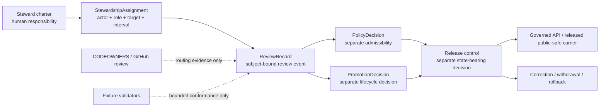

<!-- [KFM_META_BLOCK_V2]
doc_id: kfm://doc/governance/steward-charters
title: Steward Charters — Role Families, Assignment Boundaries, and Governance Handoffs
type: governance-guide
version: v2-draft
status: draft; repository-grounded; proposed role guidance; non-authoritative; no-release-effect
owners:
  - "@bartytime4life — verified CODEOWNERS review route only"
owner_status: "No accepted StewardshipAssignment, authenticated KFM actor identity, independent reviewer capacity, release authority, reviewer quorum, or approval is implied."
created: 2026-05-12
updated: 2026-08-23
policy_label: public
owning_root: docs/
current_path: docs/governance/STEWARD_CHARTERS.md
responsibility: "Explain proposed KFM steward role families, their responsibility and non-authority boundaries, the relationship between a charter and a concrete StewardshipAssignment, required handoffs, absence and succession posture, and the current repository evidence needed before staffing or operational authority may be claimed."
truth_posture: "CONFIRMED repository evidence and accepted Directory Rules placement / PROPOSED role families, charters, partner duties, and assignment procedure / CONFLICTED role vocabularies and ReviewRecord schema candidates / UNKNOWN operational actors, assignments, policy, release, and public-state authority / NEEDS VERIFICATION platform enforcement and independent human capacity; cite-or-abstain"
evidence_snapshot:
  repository: bartytime4life/Kansas-Frontier-Matrix
  base_ref: main
  base_commit: 565af2021254c27ea3626724106ad6b1eae800df
  target_prior_blob: a42ada278e03e930be590b2182ffdd1fe2ac36e6
  governance_readme_blob: 500f8bcad3a384160a561f1460617f0a13d42fcc
  review_duties_blob: df9848c324cbb1b7a3d63b32bd5e2fcf929ff4e9
  separation_of_duties_blob: 00f68beeeec7d57cce806e6cdbd710a837bd4f0c
  directory_rules_blob: fd49a0b83e55cef52c1124281f093e263526898d
  directory_rules_decision: ADR-0029 accepted
  release_sod_decision: ADR-0024 source draft / effective decision proposed
  codeowners_blob: dd2a84aa514d8ecd9208bc347f90f9a2ed37dd61
  stewardship_assignment_contract_blob: 80c6fd4149deeb4172e2401dfaf741226380f085
  stewardship_assignment_schema_blob: bd12f7e5e8eea966306c250d992f2826693815c9
  review_record_contract_blob: 9641345d1e5d939dc59687a900e60a563d92c4f0
  governance_review_schema_blob: fe2f2223af46481e7fb19b0baa94f62ce9c6c855
  alternate_review_schema_blob: a053448d68e8379b92b12a16e6528275b975433c
  review_authority_binding_contract_blob: f156e100660e9fd97ca95e90092143a3cd6d62ee
  sensitive_release_review_contract_blob: 235ca86dd807c6842ca8c861f995371fe7758f64
  release_reviews_readme_blob: bf3058a5af8fc85aa04a25a36ed03541cd9eb657
  release_policy_readme_blob: 8a6a91e18f29f6f961eac88270b385a95b86281e
  review_proof_readme_blob: 071a507bf1f9e2ff3e94d4a3618341ea004898b3
inspection_boundary: >-
  Current-session GitHub reads of the target, governance landing page, current Review Duties
  and Separation of Duties guides, accepted Directory Rules decision and adopted bytes,
  proposed ADR-0024, CODEOWNERS, StewardshipAssignment and ReviewRecord semantic contracts,
  the StewardshipAssignment schema stub, both ReviewRecord schema candidates,
  ReviewAuthorityBinding, SensitiveReleaseReviewClosure, release-policy guidance,
  release-review guidance, and review-proof guidance. No actor was authenticated, no alias
  or conflict registry was resolved, no StewardshipAssignment was accepted, no private roster
  was inspected, no live policy or release gate was evaluated, and no promotion, release,
  deployment, publication, correction, withdrawal, or rollback was exercised.
related:
  - ./README.md
  - ./REVIEW_DUTIES.md
  - ./SEPARATION_OF_DUTIES.md
  - ./ESCALATION.md
  - ./CONTRADICTION_HANDLING.md
  - ./DEPRECATION_PROCESS.md
  - ./DECISION_LOG.md
  - ../doctrine/directory-rules.md
  - ../adr/ADR-0029-adopt-directory-governance-standard-v2.md
  - ../adr/ADR-0024-steward-separation-of-duties-for-release.md
  - ../registers/DRIFT_REGISTER.md
  - ../registers/VERIFICATION_BACKLOG.md
  - ../../contracts/governance/README.md
  - ../../contracts/governance/ReviewRecord.md
  - ../../contracts/governance/steward_assignment.md
  - ../../contracts/governance/review_authority_binding.md
  - ../../contracts/governance/sensitive_release_review_closure.md
  - ../../schemas/contracts/v1/governance/steward_assignment.schema.json
  - ../../schemas/contracts/v1/governance/review_record.schema.json
  - ../../schemas/contracts/v1/review/review_record.schema.json
  - ../../policy/release/README.md
  - ../../release/reviews/README.md
  - ../../data/proofs/review/README.md
  - ../../.github/CODEOWNERS
  - ../../.github/workflows/review-authority-binding.yml
  - ../../.github/workflows/sensitive-release-review-closure.yml
tags: [kfm, governance, stewardship, role-families, assignments, review, separation-of-duties, release, correction, rollback, cite-or-abstain]
notes:
  - "v2-draft is a same-path documentation-only reconciliation against current repository evidence."
  - "ADR-0029 is accepted and confirms the docs/ responsibility root; no path, authority root, schema home, policy home, roster, or release lane is created."
  - "ADR-0024 is the current numbered release-separation decision and remains proposed. Historical ADR-S-09, ADR-S-13, and ADR-S-15 labels are retained only as source-lineage vocabulary."
  - "The eight human-facing role families and the role labels in the draft StewardshipAssignment contract are not a closed, synchronized vocabulary; this document records the conflict and does not normalize it."
  - "No contract, schema, policy, fixture, validator, workflow, repository setting, assignment, review record, release record, or published artifact changes."
[/KFM_META_BLOCK_V2] -->

<a id="top"></a>

# Steward Charters — Role Families, Assignment Boundaries, and Governance Handoffs

> **Human governance guidance for stewardship.** This document explains the proposed KFM role families, the bounded responsibilities each charter carries, the evidence needed to bind a role to a real actor and target, and the handoffs required before a trust-bearing action can advance. It does not staff a role, authenticate an actor, grant authority, approve a review, or release anything.

[](#0-status--authority)
[](../adr/ADR-0029-adopt-directory-governance-standard-v2.md)
[](../adr/ADR-0024-steward-separation-of-duties-for-release.md)
[](#4-role-vocabularies-and-current-drift)
[](#22-current-repository-evidence-ledger)
[](#18-maturity-and-enforcement-posture)
[](#23-verification-non-effects--rollback)

> [!IMPORTANT]
> **A charter is not an assignment.** A role description states what a responsibility should cover. A concrete `StewardshipAssignment`, current actor identity, effective interval, accepted authority basis, subject scope, conflict posture, and required partner roles are separate evidence. None was created or accepted by this update.

> [!WARNING]
> **A role label is not an actor and a GitHub route is not governance authority.** [`CODEOWNERS`](../../.github/CODEOWNERS) currently routes the relevant repository paths to one verified account. That proves review routing only; it does not prove eight staffed roles, independent review, a rights-holder mandate, policy authority, release authority, or separation of duties.

> [!CAUTION]
> **Do not choose or normalize a role vocabulary through prose.** The eight human-facing role families in current governance guidance do not match the eleven labels listed by the draft `StewardshipAssignment` contract. Two human roles have no direct contract label, five contract labels have no direct human charter, and one example uses `governance_steward` even though that label is absent from the contract's role table. Resolution requires an authority decision and synchronized contract, schema, fixture, validator, consumer, migration, and rollback work.

| Field | Current bounded value |
|---|---|
| **Document status** | `draft` human-facing governance guidance |
| **Tracked path** | `docs/governance/STEWARD_CHARTERS.md` — **CONFIRMED** repository-present, same-path update |
| **Placement authority** | Accepted [`ADR-0029`](../adr/ADR-0029-adopt-directory-governance-standard-v2.md) and adopted [`directory-rules.md`](../doctrine/directory-rules.md) place human governance explanation under `docs/` |
| **Detailed release-SoD decision** | [`ADR-0024`](../adr/ADR-0024-steward-separation-of-duties-for-release.md) is source status `draft`, effective decision status `proposed` |
| **Repository review route** | `@bartytime4life` through [`CODEOWNERS`](../../.github/CODEOWNERS); routing is not assignment, independence, approval, or release authority |
| **Human role model** | Eight proposed role families retained from current governance guidance |
| **Assignment meaning** | Draft [`StewardshipAssignment`](../../contracts/governance/steward_assignment.md) semantic contract |
| **Assignment machine shape** | **PROPOSED permissive stub**; it does not enforce the semantic fields or role vocabulary |
| **Review-event meaning** | Draft [`ReviewRecord`](../../contracts/governance/ReviewRecord.md) semantic contract |
| **Review-event machine shape** | **CONFLICTED:** one concrete proposed governance schema and one permissive proposed review scaffold |
| **Bounded executable support** | Fixture-only `ReviewAuthorityBinding` and T3/T4 `SensitiveReleaseReviewClosure`; both grant no authority |
| **Accepted assignments or private roster** | Not verified; operational staffing is `UNKNOWN / HOLD` |
| **Operational policy, review, and release authority** | `UNKNOWN / HOLD` |
| **Release, deployment, publication effect** | None |
| **Evidence snapshot** | `main@565af2021254c27ea3626724106ad6b1eae800df` |

---

## Quick navigation

[§0 Status](#0-status--authority) ·
[§1 Purpose](#1-purpose--scope) ·
[§2 Determination](#2-current-repository-determination) ·
[§3 Charter model](#3-charter-model-and-anti-collapse-rules) ·
[§4 Vocabulary drift](#4-role-vocabularies-and-current-drift) ·
[§5 Roster](#5-the-eight-proposed-human-role-families) ·
[§6 Source](#6-source-steward) ·
[§7 Domain](#7-domain-steward) ·
[§8 Sensitivity](#8-sensitivity-reviewer) ·
[§9 Rights](#9-rights-holder--sovereignty-representative) ·
[§10 Release](#10-release-authority) ·
[§11 Correction](#11-correction-reviewer) ·
[§12 AI](#12-ai-surface-steward) ·
[§13 Docs](#13-docs-steward) ·
[§14 Companion labels](#14-companion-implementation-duty-labels) ·
[§15 Assignment](#15-assignment-eligibility-and-effective-scope) ·
[§16 Handoff](#16-charter-invocation-and-handoff-packet) ·
[§17 Absence](#17-absence-recusal-delegation-and-succession) ·
[§18 Maturity](#18-maturity-and-enforcement-posture) ·
[§19 Sensitive/public-safe](#19-sensitive-and-public-safe-stewardship) ·
[§20 Anti-patterns](#20-anti-patterns) ·
[§21 Responsibility map](#21-related-responsibility-map) ·
[§22 Evidence ledger](#22-current-repository-evidence-ledger) ·
[§23 Verification](#23-verification-non-effects--rollback) ·
[Appendix A](#appendix-a--no-loss-modernization-ledger) ·
[Appendix B](#appendix-b--open-convergence-backlog)

---

## 0. Status & authority

### 0.1 Authority order

Authority depends on the question being asked. No role charter controls every layer.

| Question | Controlling surface | Current status |
|---|---|---|
| Where may this human guide live? | Accepted ADR-0029, adopted Directory Rules, and the repository-present path | **CONFIRMED** under `docs/governance/` |
| Is the release-separation model accepted? | ADR-0024 and the canonical ADR index | **PROPOSED**, not accepted |
| What does a stewardship assignment mean? | `contracts/governance/steward_assignment.md` | **DRAFT semantic contract** |
| What machine shape is accepted? | Accepted schema authority and reviewed object-family decision | Assignment schema is a **stub**; ReviewRecord schemas are **CONFLICTED** |
| Who holds a role now? | Accepted assignment, actor identity, interval, scope, conflict status, and authority basis | **UNKNOWN / HOLD** |
| What is admissible? | Accepted policy source through an accepted evaluator | Release-policy lane remains scaffolded |
| What may advance or be released? | Governed promotion and release controls with applicable evidence, policy, review, correction, and rollback | Not established by this guide |
| What does GitHub enforce? | Current platform settings and exact required-check coupling | **NEEDS VERIFICATION** before operational reliance |

### 0.2 Same-path Directory Rules basis

This file is a human governance guide. Its one authority owner is the `docs/` responsibility root. Updating the tracked path does not create:

- a new root or governance registry;
- a role enum or actor directory;
- a contract or schema authority;
- a policy bundle or evaluator;
- a `ReviewRecord`, `StewardshipAssignment`, release review, or release decision;
- a private roster, team, repository permission, or platform rule;
- a promotion, correction, withdrawal, rollback, release, deployment, or publication transition.

### 0.3 Historical source-lineage boundary

The prior v0.2 document relied heavily on the supplied Atlas and historical `ADR-S-*` labels. Those materials remain useful design lineage. They do not outrank current repository evidence or the numbered ADR inventory.

- `ADR-S-09` is retained as historical vocabulary for reviewer-separation tooling pressure.
- `ADR-0024` is the current numbered separation decision and remains proposed.
- Historical `ADR-S-13` and `ADR-S-15` labels are not treated here as verified current ADR paths.
- Atlas role definitions are retained as proposal lineage, not staffing or enforcement evidence.

[Back to top](#top)

---

## 1. Purpose & scope

A steward charter is a human-readable responsibility boundary. It should let a maintainer determine:

1. which responsibility family is implicated by a candidate action;
2. what the role must inspect or hand off;
3. what the role cannot decide alone;
4. which partner roles are required when materiality applies;
5. what evidence must prove actor eligibility, scope, independence, and timing;
6. which separate gate owns the next state transition;
7. what happens when the role is absent, conflicted, expired, or unable to decide.

### This document can establish

- the current proposed eight-role human vocabulary;
- role responsibility and non-authority boundaries;
- the relationship among a charter, assignment, review, policy, release, correction, rollback, and platform routing;
- a conservative handoff procedure and fail-closed absence posture;
- current repository conflicts, gaps, and graduation evidence requirements;
- documentation-safe guidance for sensitive or sovereignty-bearing stewardship.

### This document cannot establish

- that an actor, team, service, community, family, descendant group, or rights-holder has accepted a role;
- that a role label resolves to a GitHub account or team;
- that a reviewer is independent, eligible, current, conflict-free, or authorized;
- that the eight-role roster is a canonical machine enum;
- that the draft `StewardshipAssignment` semantic fields are accepted or schema-enforced;
- that a review, policy evaluation, promotion decision, release decision, correction, withdrawal, or rollback occurred;
- that a source, claim, layer, AI answer, map, tile, graph, report, or export is admissible or public;
- that current platform controls enforce the proposed model.

### Responsibility boundary

| Responsibility | Owning surface | Relationship to this document |
|---|---|---|
| Human role purpose, boundaries, absence, handoff, and anti-patterns | `docs/governance/` | **Owned here** |
| Decision to adopt release-significant separation | `docs/adr/` | ADR-0024; still proposed |
| Assignment and review-event meaning | `contracts/governance/` | Referenced; not redefined |
| Machine-checkable shape | `schemas/contracts/v1/` | Referenced; gaps and conflicts disclosed |
| Admissibility | `policy/` and accepted evaluator surfaces | Separate authority |
| Synthetic cases and deterministic validation | `fixtures/`, `tests/`, `tools/validators/`, workflows | Bounded evidence only |
| Review-support proof objects | `data/proofs/review/` | Separate support family |
| Release-review instances and state-bearing release objects | `release/` | Separate release-control family |
| GitHub routing and repository controls | `.github/` and platform settings | Routing/enforcement; not KFM governance authority |
| Public delivery | Governed APIs and released public-safe carriers | Never conferred by this guide |

[Back to top](#top)

---

## 2. Current repository determination

### 2.1 Confirmed repository evidence

At the evidence snapshot, KFM contains:

- this repository-present governance-document lane;
- accepted Directory Rules placement through ADR-0029;
- proposed ADR-0024 for release-significant separation of duties;
- one verified CODEOWNERS route for relevant roots;
- draft `StewardshipAssignment` and `ReviewRecord` semantic contracts;
- a permissive proposed StewardshipAssignment schema stub;
- two overlapping ReviewRecord schema candidates;
- fixture-only `ReviewAuthorityBinding` and T3/T4 `SensitiveReleaseReviewClosure` profiles;
- release-policy, release-review, and review-proof guidance surfaces.

### 2.2 Proposed design

The following remain proposed:

- the eight human role families as a stable governance roster;
- the responsibility and partner-role details in §§6–13;
- the charter template in §3;
- assignment eligibility and absence procedure;
- materiality and maturity rules where ADR-0024 would control;
- any mapping from human role families to machine or assignment identifiers.

### 2.3 Conflicted evidence

The current repository presents at least three unresolved conflicts:

1. **Role vocabulary conflict.** The eight human role families do not match the role labels in the StewardshipAssignment semantic contract.
2. **Assignment shape gap.** The StewardshipAssignment schema is a greenfield-style permissive stub and does not enforce the semantic contract.
3. **ReviewRecord schema conflict.** One concrete governance schema and one permissive review scaffold overlap, while the semantic contract is richer than either candidate.

These conflicts are not resolved by this file. Trust-bearing use remains `HOLD` until the relevant authority and compatibility work closes.

### 2.4 Unknown or held operational state

No current-session evidence established:

- authenticated KFM actor identity or alias resolution;
- an accepted, current `StewardshipAssignment` instance;
- a public or private operational steward roster;
- independent human reviewer capacity;
- accepted recusal, delegation, or succession records;
- an active release-policy bundle and evaluator;
- a governed parent-level release review;
- operational release authority, signer custody, or public-state mutation;
- completed correction, withdrawal, or rollback drill;
- deployed or public behavior that relies on this charter.

[Back to top](#top)

---

## 3. Charter model and anti-collapse rules

### 3.1 What a charter contains

Each role-family charter in this document uses the following human guidance fields.

| Field | Human meaning | Machine / authority boundary |
|---|---|---|
| **Role family** | Proposed responsibility label | Not an actor or enum by itself |
| **Purpose** | Why the role exists | Does not grant authority |
| **Typical targets** | Objects, paths, decisions, or surfaces commonly reviewed | Target scope must be bound by an accepted assignment |
| **Responsibilities** | What the role should inspect, maintain, or hand off | Does not prove the action occurred |
| **Cannot establish alone** | Decisions or facts outside the role's authority | Separate gates remain mandatory |
| **Partner roles** | Other role families normally required by materiality | Exact requirements await accepted decision and assignment evidence |
| **Escalation triggers** | Conditions requiring abstention, hold, denial, or higher review | Escalation must follow an accepted path |
| **Refresh triggers** | Conditions that expire or supersede prior role work | Does not define a machine expiry field |
| **Current posture** | Repository-grounded maturity statement | Must remain bounded to inspected evidence |

This table is not a substitute for the `StewardshipAssignment` contract or schema.

### 3.2 Objects that must remain distinct

| Object or control | What it establishes | What it does not establish |
|---|---|---|
| **Role charter** | Human responsibility boundary | Actor, assignment, review, policy, release |
| **StewardshipAssignment** | Proposed semantic record binding a role to a target, actor, interval, and authority basis | Proof that the assigned actor acted or that the assignment is accepted |
| **ReviewRecord** | Proposed semantic record of a review event | Policy, promotion, release, publication |
| **ReviewAuthorityBinding** | Fixture-only structural agreement among declared review, assignment, and subject projections | Actor authentication or authority grant |
| **PolicyDecision** | A bounded policy outcome from an accepted policy execution | Evidence, review, or release decision |
| **PromotionDecision** | A lifecycle transition decision | Publication by itself |
| **ReleaseManifest / release decision** | State-bearing release identity and scope under the accepted release model | Source truth or immunity from correction |
| **Correction / withdrawal / rollback record** | Governed change to prior public or release state | Silent replacement or erased history |
| **CODEOWNERS / GitHub review** | Repository routing and platform review evidence | KFM stewardship, independence, policy, or release authority |
| **Workflow result** | Outcome of a named automated check | Human review, policy approval, promotion, release, publication |

### 3.3 Finite posture when evidence is missing

A role-family guide must not fill evidence gaps with plausible assumptions.

- Use `HOLD` when a required decision, assignment, partner, or safe path is unresolved.
- Use `ABSTAIN` when an eligible reviewer cannot reach a supported conclusion.
- Use `DENY` when a governing profile establishes an impermissible action or unsafe condition.
- Use `NEEDS VERIFICATION` for a concrete unresolved check.
- Use `UNKNOWN` when the condition cannot be resolved from available evidence.

[Back to top](#top)

---

## 4. Role vocabularies and current drift

### 4.1 Eight human role families

Current governance guidance carries these eight proposed families:

1. Source steward
2. Domain steward
3. Sensitivity reviewer
4. Rights-holder / sovereignty representative
5. Release authority
6. Correction reviewer
7. AI surface steward
8. Docs steward

### 4.2 StewardshipAssignment contract labels

The draft semantic contract separately lists these proposed identifiers:

- `docs_steward`
- `contract_steward`
- `schema_steward`
- `policy_steward`
- `domain_steward`
- `source_steward`
- `sensitivity_reviewer`
- `release_authority`
- `ai_surface_steward`
- `ui_api_steward`
- `validation_steward`

One example in that contract also refers to `governance_steward`, which is not included in the listed role table.

### 4.3 Comparison and safe posture

| Human role family | Draft contract label | Current relationship |
|---|---|---|
| Source steward | `source_steward` | Nominal match only; no accepted enum or assignment |
| Domain steward | `domain_steward` | Nominal match only |
| Sensitivity reviewer | `sensitivity_reviewer` | Nominal match only |
| Rights-holder / sovereignty representative | No direct listed label | **GAP / CONFLICTED** |
| Release authority | `release_authority` | Nominal match only |
| Correction reviewer | No direct listed label | **GAP / CONFLICTED** |
| AI surface steward | `ai_surface_steward` | Nominal match only |
| Docs steward | `docs_steward` | Nominal match only |
| No direct eight-role counterpart | `contract_steward`, `schema_steward`, `policy_steward`, `ui_api_steward`, `validation_steward` | **UNMAPPED companion labels** |
| No stable entry in either roster | `governance_steward` appears in an example | **INTERNAL CONTRACT DRIFT** |

> [!IMPORTANT]
> “Nominal match” means the words resemble one another. It does not prove identical scope, accepted casing, enum membership, assignment eligibility, or compatibility.

### 4.4 Convergence requirement

A future vocabulary decision should, at minimum:

1. identify the authority owner for role semantics;
2. decide whether human role families, duty labels, assignment roles, and reviewer roles are one vocabulary or several related vocabularies;
3. preserve rights-holder and correction responsibilities explicitly;
4. decide whether contract, schema, policy, validation, UI/API, and governance stewardship are standalone roles, capabilities, or scoped assignments;
5. synchronize contract meaning, schema enum, fixtures, validators, docs, consumers, indexes, and migration notes;
6. provide aliases or versioned compatibility where needed;
7. define fail-closed behavior for unknown roles;
8. preserve rollback to the pre-convergence vocabulary.

Until then, consumers must record the exact profile and role string they used. Silent translation is prohibited.

[Back to top](#top)

---

## 5. The eight proposed human role families

| # | Role family | Proposed responsibility | Current operational posture |
|---|---|---|---|
| 1 | **Source steward** | Source identity, role, terms, intended use, cadence, and admission handoff | No accepted assignment verified |
| 2 | **Domain steward** | Domain meaning, evidence interpretation, domain quality, and domain-scoped handoff | No accepted assignment verified |
| 3 | **Sensitivity reviewer** | Harmful precision, redaction, generalization, withholding, access, and sensitivity review | No accepted assignment verified |
| 4 | **Rights-holder / sovereignty representative** | Rights, consent, sovereignty, cultural/community authority, and controlled-use review | Identity and mandate must be target-specific; none verified |
| 5 | **Release authority** | Accountable release-state decision and rollback authorization under the accepted release model | ADR-0024 proposed; operational authority held |
| 6 | **Correction reviewer** | Correction, withdrawal, supersession, derivative invalidation, and rollback assessment | No direct assignment-role label; held |
| 7 | **AI surface steward** | Evidence-bounded AI templates, citations, finite outcomes, and public-surface behavior | No accepted assignment verified |
| 8 | **Docs steward** | Human doctrine/navigation integrity, metadata, links, drift, and supersession visibility | CODEOWNERS route exists; assignment and independence not verified |

The charters below define proposal-level responsibility boundaries. They do not create a roster or precedence among roles.

[Back to top](#top)

---

## 6. Source steward

| Charter field | Proposed boundary |
|---|---|
| **Purpose** | Keep source identity, source role, authority limits, terms, intended use, update cadence, and initial risk posture explicit before source material enters a governed lane. |
| **Typical targets** | `SourceDescriptor` candidates, source-family registries, source-role classifications, source refresh or retirement proposals, connector admission packets. |
| **Responsibilities** | Verify source identity and steward; distinguish observed, modeled, forecast, regulatory, aggregate, contextual, synthetic, and other accepted roles; record terms and permitted use; identify rights and sensitivity triggers; hand off unresolved domain meaning, rights, or public-safety questions. |
| **Cannot establish alone** | Rights clearance, sovereignty or community consent, domain truth, policy permission, public-safe transformation, release, publication, or source-role upcast. |
| **Partner roles** | Domain steward for meaning; sensitivity reviewer for exposure risk; rights-holder / sovereignty representative where rights or community authority applies; release authority only at a later release gate. |
| **Escalation triggers** | Unknown terms, unclear authority, role ambiguity, conflicting source versions, living-person or genomic content, archaeology, rare species, infrastructure, land/title, harmful precision, or missing correction path. |
| **Refresh triggers** | Source terms, endpoint, steward, cadence, schema, authority role, license, sensitivity, or correction state changes. |
| **Current posture** | Human role proposed; source-related repository surfaces exist, but no accepted assignment or operational source-steward roster was verified. |

### 6.1 Source-role anti-collapse

A source steward must not silently reinterpret a source to make it more authoritative. In particular:

- regulatory status is not automatically an observed event;
- a model is not a measurement;
- an aggregate is not a per-place observation;
- a discovery service is not necessarily the source of record;
- a map layer is not proof of the claim it depicts;
- a source descriptor is not source admission or release by itself.

A proposed role change requires an explicit descriptor/version/correction path and the applicable domain, policy, and review checks. When the accepted profile is unresolved, hold rather than upcast.

### 6.2 Minimum handoff

A source-steward handoff should identify:

- stable source identity and version or retrieval context;
- declared source role and limitations;
- terms, rights, consent, sensitivity, and intended-use status;
- spatial, temporal, and precision scope;
- update cadence and stale-state trigger;
- source hash or immutable locator where practical;
- unresolved domain, rights, policy, validation, correction, and rollback questions;
- requested next gate, never an implied public-release state.

[Back to top](#top)

---

## 7. Domain steward

| Charter field | Proposed boundary |
|---|---|
| **Purpose** | Protect the meaning of domain concepts and ensure domain evidence is interpreted within the correct bounded context. |
| **Typical targets** | Domain contracts and schema proposals, domain records, validation reports, transforms, catalog relations, cross-domain join proposals, domain-facing map/API/AI behavior. |
| **Responsibilities** | State domain meaning and limitations; preserve source-role distinctions; inspect domain evidence and time/geography context; require appropriate validation and negative cases; identify cross-domain or sensitivity effects; hand off contract, schema, policy, release, and public-delivery work to their owning duties. |
| **Cannot establish alone** | Canonical schema authority, policy override, rights or sovereignty clearance, public-safe exposure, cross-domain authority, release, or publication. |
| **Partner roles** | Source steward, sensitivity reviewer, rights-holder / sovereignty representative, and the applicable contract, schema, policy, validation, UI/API, AI, or release duties. |
| **Escalation triggers** | Domain term collision, source-role collapse, unsupported cross-domain relation, uncertain geography/time, generated inference presented as evidence, unsafe precision, contract/schema mismatch, or public claim without evidence closure. |
| **Refresh triggers** | Domain model, source role, contract, schema, validator, evidence, geography, time basis, policy, or public representation changes. |
| **Current posture** | Human role proposed. Current assignment semantics also list separate contract, schema, policy, validation, and UI/API labels, so domain stewardship must not be assumed to absorb those duties. |

### 7.1 Bounded-context rule

Domain stewardship is not universal subject-matter authority. A domain steward acts only within an exact target and scope. Cross-domain work must preserve the source and domain role of each input rather than flattening all inputs into one “domain truth.”

### 7.2 Contract and schema boundary

The prior v0.2 charter described the domain steward as owning contracts, schemas, and validators. Current repository evidence contains separate proposed `contract_steward`, `schema_steward`, and `validation_steward` labels. This update narrows the safe claim:

- the domain steward is accountable for domain meaning and domain-specific review;
- implementation ownership of contract, schema, and validator artifacts is **CONFLICTED / NEEDS DECISION**;
- no role may amend another responsibility root merely because the change is domain-related.

[Back to top](#top)

---

## 8. Sensitivity reviewer

| Charter field | Proposed boundary |
|---|---|
| **Purpose** | Assess whether content, joins, precision, representation, timing, or access could expose protected or harmful information. |
| **Typical targets** | Redaction, aggregation, generalization, withholding, delayed release, audience restriction, sensitive geometry, public-safe transformations, and sensitivity-related corrections. |
| **Responsibilities** | Identify sensitivity triggers; inspect source and joined-data risk; require transformations before ordinary public delivery; review reconstruction risk; record limitations and expiry; require correction and rollback paths. |
| **Cannot establish alone** | Rights or sovereignty mandate, source truth, domain meaning, policy permission, release authority, publication, or consent. |
| **Partner roles** | Rights-holder / sovereignty representative where applicable; domain and source stewards; policy duty; release authority for public-state decisions. |
| **Escalation triggers** | Unknown sensitivity, exact rare-species or archaeological locations, critical-infrastructure vulnerability, living-person or genomic data, private-land information, culturally restricted material, re-identification risk, or client-side-only hiding. |
| **Refresh triggers** | Audience, precision, join, source, policy, rights, threat model, public interface, correction, or downstream derivative changes. |
| **Current posture** | Human role proposed. A fixture-only T3/T4 closure profile exists, but no accepted universal tier model or operational sensitivity reviewer assignment was established. |

### 8.1 Tier-language boundary

The prior document treated a T0–T4 schedule as generally established. Current evidence supports a narrower statement:

- the `SensitiveReleaseReviewClosure` fixture profile explicitly covers T3/T4 candidates;
- that profile is proposed-inactive and grants no authority;
- a universal T0–T4 taxonomy, its assignment semantics, and its operational policy binding remain `NEEDS VERIFICATION`;
- sensitivity review is required by the actual risk and accepted profile, not by an inferred domain label alone.

### 8.2 Transform-before-delivery rule

Sensitive values must be removed, transformed, generalized, delayed, or denied before ordinary public delivery. A style filter, hidden layer, collapsed panel, obscured label, or client-only check is not a sufficient protection boundary.

[Back to top](#top)

---

## 9. Rights-holder / sovereignty representative

| Charter field | Proposed boundary |
|---|---|
| **Purpose** | Represent the rights, consent, sovereignty, cultural/community authority, or controlled-use interests applicable to one exact subject and mandate. |
| **Typical targets** | Archaeology, Indigenous or community-governed data, cultural heritage, living-person material, genomic data, consent-bearing collections, licensed or agreement-restricted content, and revocation-sensitive release proposals. |
| **Responsibilities** | Confirm the applicable mandate; state permitted and prohibited uses; identify consent, consultation, attribution, access, revocation, and re-review obligations; require protected handling and public-safe representation; escalate unresolved authority. |
| **Cannot establish alone** | Technical validation, source role, domain meaning, policy execution, release manifest, public deployment, or generalized authority for another person, family, community, or dataset. |
| **Partner roles** | Source steward at intake; domain steward for meaning; sensitivity reviewer for exposure; policy duty and release authority for any later release action. |
| **Escalation triggers** | Missing mandate, disputed authority, incomplete consultation, incompatible terms, revoked consent, living-person risk, sacred or culturally restricted material, uncertain descendants or community, or pressure to disclose protected reasons. |
| **Refresh triggers** | Mandate, agreement, consent, representative, community instruction, rights status, public purpose, audience, geography, precision, or use changes. |
| **Current posture** | Human role proposed. No direct role identifier exists in the draft StewardshipAssignment role table, and no target-specific representative identity or mandate was verified. |

> [!WARNING]
> **Representation is target-specific and non-transferable.** A person or body authorized for one family, community, collection, agreement, lane, or purpose must not be assumed to represent another. Public repository prose must not invent, infer, or expose protected identity or mandate details.

### 9.1 Public documentation boundary

This public guide may describe the responsibility family. It should not store:

- private contact information;
- restricted consultation notes;
- protected community reasoning;
- confidential agreement terms;
- sensitive identity or consent evidence;
- precise locations or attributes that the review is meant to protect.

Use governed references and public-safe reason codes. Fail closed when the safe reference path is unresolved.

[Back to top](#top)

---

## 10. Release authority

| Charter field | Proposed boundary |
|---|---|
| **Purpose** | Make the accountable, subject-bound decision for a release-significant transition under the accepted release model. |
| **Typical targets** | Release candidates, manifests, public-safe carriers, corrections, withdrawals, rollback proposals, public aliases, and release re-issuance. |
| **Responsibilities** | Confirm exact subject and release scope; require evidence, validation, policy, rights, sensitivity, review, integrity, correction, and rollback support appropriate to consequence; record the state-bearing outcome through the accepted release family; preserve lineage and obligations. |
| **Cannot establish alone** | Source truth, evidence creation, rights-holder mandate, policy evaluation, technical validation, public-safe transformation, or independent review where separation applies. |
| **Partner roles** | Author or producer, domain/source stewards, sensitivity reviewer, rights-holder representative, policy duty, correction reviewer, and applicable technical stewards. |
| **Escalation triggers** | Self-approval, unresolved assignment or identity, missing evidence/policy/review, unsafe precision, missing correction or rollback, conflicted schema/contract, stale support, or incomplete downstream invalidation. |
| **Refresh triggers** | Subject bytes, manifest, evidence, policy, assignment, review, rights, sensitivity, release scope, correction, rollback, or public carrier changes. |
| **Current posture** | ADR-0024 remains proposed; no accepted release-authority assignment or operational release path was verified. |

### 10.1 Release is a separate state transition

A release authority does not “approve publication” by editing this file, approving a pull request, or observing a green workflow. A state-bearing release action must use the accepted release controls and preserve correction and rollback.

### 10.2 Independence boundary

When materiality applies, the author or producer must not be treated as independently authorized release authority merely because the same account owns the repository or receives CODEOWNERS routing. The exact accepted decision and assignment evidence must establish eligibility and independence.

[Back to top](#top)

---

## 11. Correction reviewer

| Charter field | Proposed boundary |
|---|---|
| **Purpose** | Assess whether a released or public-facing subject must be corrected, withdrawn, superseded, invalidated, or rolled back, and ensure prior state remains auditable. |
| **Typical targets** | `CorrectionNotice`, withdrawal proposal, rollback proposal, supersession chain, stale-versus-wrong determination, derivative invalidation plan, cache and index repair. |
| **Responsibilities** | Freeze prior state; inspect defect evidence and blast radius; distinguish stale, incomplete, contradicted, and wrong; require replacement or rollback target; identify affected carriers, caches, indexes, graphs, tiles, APIs, docs, and AI outputs; preserve public-safe notice and provenance. |
| **Cannot establish alone** | New source truth, replacement content meaning, policy override, rights clearance, release execution, silent deletion, or erased history. |
| **Partner roles** | Detector or author, domain/source stewards, sensitivity and rights roles where applicable, release authority for public-state change, docs steward for visible lineage. |
| **Escalation triggers** | Unknown blast radius, missing prior bytes, no rollback target, protected reason text, conflicting corrections, derivative reconstruction risk, or pressure to rewrite history silently. |
| **Refresh triggers** | New defect evidence, corrected subject, changed derivative inventory, public alias, policy, rights, sensitivity, or rollback outcome. |
| **Current posture** | Human role proposed. No direct `correction_reviewer` label exists in the draft StewardshipAssignment role table; operational assignment and authority remain held. |

### 11.1 Stale, wrong, withdrawn, and superseded are distinct

- **Stale** means support or review has aged beyond the accepted tolerance.
- **Wrong** means the substantive claim or artifact is incorrect.
- **Withdrawn** means continued use or exposure is no longer permitted or supported.
- **Superseded** means a newer governed object replaces the prior one without erasing lineage.

The correction reviewer should not collapse these states into one generic “updated” label.

### 11.2 Downgrade and containment

Immediate containment may reduce exposure before a complete correction review when safety requires it. Containment is not a new release and does not erase the need for retrospective review, correction, lineage, and rollback evidence.

[Back to top](#top)

---

## 12. AI surface steward

| Charter field | Proposed boundary |
|---|---|
| **Purpose** | Keep AI-facing interpretation evidence-bound, policy-aware, finite in outcome, traceable, and subordinate to governed evidence and release state. |
| **Typical targets** | Focus Mode templates, retrieval scope, evidence presentation, citation behavior, abstention/denial logic, model-adapter boundaries, `AIReceipt` sampling, and public map/AI actions. |
| **Responsibilities** | Define bounded question scope; require EvidenceRef resolution; inspect citation closure; test `ANSWER`, `ABSTAIN`, `DENY`, and `ERROR` behavior; review prompt-injection and unsafe-action posture; preserve model/provider non-authority; route domain, policy, sensitivity, rights, release, and UI/API work to their owners. |
| **Cannot establish alone** | Truth, evidence, source authority, policy, rights, sensitivity clearance, release, publication, or model self-approval. |
| **Partner roles** | Domain and source stewards, docs steward, policy duty, sensitivity or rights roles, UI/API duty, release authority for public changes, validation duty for negative tests. |
| **Escalation triggers** | Missing evidence, unsupported citation, direct model-to-public path, generated text treated as evidence, prompt injection, unsafe action request, hidden policy bypass, sensitive context, or unbounded question scope. |
| **Refresh triggers** | Template, retrieval, model, provider, policy, evidence contract, citation validator, UI/API, public scope, correction, or release changes. |
| **Current posture** | Human role proposed; no accepted AI-surface assignment or operational release authority was verified. |

### 12.1 Evidence outranks generated language

The AI surface steward must preserve the ordering:

```text
scope
  -> evidence retrieval and EvidenceRef resolution
  -> policy / rights / sensitivity checks
  -> bounded interpretation
  -> citation validation
  -> finite outcome
  -> separate public-release and correction controls where applicable
```

A fluent answer, summary, map annotation, story, or recommendation is not sovereign truth.

### 12.2 AIReceipt boundary

An `AIReceipt` may make a model interaction inspectable. It does not make the answer correct, admissible, reviewed, released, or published. Current `AIReceipt` object maturity is outside this target's verified scope and must not be inferred from the role charter.

[Back to top](#top)

---

## 13. Docs steward

| Charter field | Proposed boundary |
|---|---|
| **Purpose** | Keep human doctrine, governance guidance, navigation, metadata, decision status, source lineage, drift, supersession, and rollback information accurate and inspectable. |
| **Typical targets** | `docs/` guides, indexes, ADR navigation, governance landing pages, drift and verification references, source maps, migration notes, and documentation-only corrections. |
| **Responsibilities** | Preserve authority labels; verify current paths and links; distinguish proposal from implementation; prevent duplicate authority; record drift and verification backlog; coordinate ADR or migration handoff; keep rollback and non-effects visible. |
| **Cannot establish alone** | Contract meaning, schema shape, policy permission, actor assignment, independent review, source admission, release authority, publication, or public truth. |
| **Partner roles** | Affected subsystem/domain owner; contract/schema/policy/release duties as applicable; AI surface steward for AI policy-facing guidance; correction reviewer for public documentation correction. |
| **Escalation triggers** | Conflicting authority, stale decision status, broken canonical link, duplicate writable home, undocumented migration, overclaimed implementation, sensitive data in public docs, or proposed content presented as accepted. |
| **Refresh triggers** | ADR status, Directory Rules, path, object-family, schema, policy, workflow, release, correction, or public-behavior changes. |
| **Current posture** | `@bartytime4life` is the verified CODEOWNERS route for `docs/`; no accepted Docs-steward assignment, independent reviewer, or publication authority was verified. |

### 13.1 Documentation is part of the system, not a substitute for it

Documentation should accurately expose responsibilities, controls, and gaps. It must not simulate closure by copying contracts, schemas, policy, review records, release manifests, proofs, or private rosters into prose.

### 13.2 ADR and status discipline

The Docs steward may prepare and maintain an ADR record. Acceptance depends on the applicable decision process. A metadata edit, index entry, pull request, or merge does not silently accept a proposed decision.

[Back to top](#top)

---

## 14. Companion implementation duty labels

The draft StewardshipAssignment contract introduces five labels without direct counterparts in the eight human role-family roster:

| Draft label | Proposed concern | Safe relationship to this guide |
|---|---|---|
| `contract_steward` | Semantic meaning, anti-collapse boundaries, versioning, paired schema expectations | Companion duty label; no adopted mapping or assignment verified |
| `schema_steward` | Machine shape, schema lifecycle, fixtures, compatibility | Companion duty label; must remain separate from semantic meaning |
| `policy_steward` | Policy semantics, bundles, allow/deny/restrict/abstain behavior | Companion duty label; does not equal release authority |
| `ui_api_steward` | Governed public delivery and trust-membrane behavior | Companion duty label; public delivery remains downstream of release |
| `validation_steward` | Fixtures, validators, tests, CI assertions, negative-state evidence | Companion duty label; validation is not authority or release |

### 14.1 No implied hierarchy

This document does not decide whether these labels are:

- standalone steward roles;
- capabilities attached to one of the eight human roles;
- temporary duty assignments;
- subsystem-owner responsibilities;
- review roles used only for a named profile;
- implementation labels that should not appear in governance assignments.

### 14.2 `governance_steward` drift

The draft StewardshipAssignment contract uses `governance_steward` in an example but omits it from the role table. Consumers must not infer an enum entry from the example. The conflict should be repaired through the same synchronized convergence process described in §4.4.

### 14.3 Partner-duty rule

A human role charter may require a contract, schema, policy, validation, UI/API, or other technical duty in its handoff. That does not transfer responsibility-root authority to the human role or prove that a named steward exists.

[Back to top](#top)

---

## 15. Assignment, eligibility, and effective scope

### 15.1 Draft assignment semantics

The current semantic contract proposes that a `StewardshipAssignment` identify:

- stable assignment identity;
- exact target and target type;
- role label;
- assigned actor, team, service, placeholder, or governance body;
- assignment status;
- authority-basis references;
- start and optional expiry or review time;
- bounded scope statement;
- required partner roles;
- escalation path;
- supersession and review references.

These are draft semantics. The current schema stub does not enforce them.

### 15.2 Eligibility evidence for one action

Before relying on a steward for a trust-bearing action, verify all applicable facts:

1. **Actor identity** — stable identity and relevant aliases are resolved.
2. **Assignment identity** — a current, accepted assignment exists for the exact role and target.
3. **Scope** — the assignment covers the subject, domain, operation, audience, and requested next gate.
4. **Interval** — the assignment is effective at review or decision time and has not expired or been revoked.
5. **Authority basis** — accepted decision, policy, agreement, or governance record supports the assignment.
6. **Conflict and recusal** — conflicts are disclosed; required independence is established.
7. **Partner roles** — all required roles are eligible for the same subject and interval.
8. **Access** — the steward can inspect necessary protected context without exposing it improperly.
9. **Evidence and policy** — the steward has the relevant evidence, validation, policy, rights, and sensitivity context.
10. **Correction and rollback** — the action has an appropriate reversal and lineage path.

Missing or conflicting evidence fails closed for a trust-bearing action.

### 15.3 Assignment status posture

The semantic contract proposes `active`, `provisional`, `expired`, `superseded`, `revoked`, and `unknown` postures.

| Status | Safe interpretation |
|---|---|
| `active` | Candidate eligibility input only; still requires exact scope, identity, interval, conflict, and partner checks |
| `provisional` | May support bounded preparation or review; cannot be assumed sufficient for material release authority |
| `expired` | Cannot authorize a current trust-bearing action |
| `superseded` | Follow the successor and preserve lineage |
| `revoked` | Cannot authorize; inspect correction and invalidation needs |
| `unknown` | `HOLD` / `ABSTAIN`; never assume authority |

This table explains draft semantics; it is not a machine policy or active registry.

### 15.4 Public and private roster boundary

A future operational roster may need restricted identity, mandate, contact, conflict, or agreement details. This public document does not assert that such a roster exists and must not become a shadow roster. Public guidance should use stable public-safe role and assignment references while protected details remain in an approved governed system.

[Back to top](#top)

---

## 16. Charter invocation and handoff packet

### 16.1 Procedure

1. **Freeze the subject.** Record stable identity, version, digest, and immutable locator where practical.
2. **Name the requested next gate.** A charter handoff must not imply later promotion or release.
3. **Classify the responsibility.** Select the relevant human role family without silently mapping it to an assignment enum.
4. **Resolve assignment and eligibility.** Verify actor, role, target, interval, authority basis, conflicts, and partner duties.
5. **Collect support.** Resolve evidence, validation, source role, provenance, rights, sensitivity, policy, correction, and rollback context.
6. **Review positive and negative states.** Include denial, abstention, error, expiry, revocation, and unsafe-precision cases.
7. **Record the bounded finding.** Use an accepted `ReviewRecord` or other exact profile when one exists; otherwise label the guidance and limitations.
8. **Hand off to the separate gate.** Policy, promotion, release, correction, withdrawal, rollback, or platform action remains separate.

### 16.2 Illustrative human handoff packet

The following is a documentation template, not a new contract or accepted machine schema.

```yaml
steward_handoff:
  subject_ref: "<stable subject identifier>"
  subject_version: "<version or commit>"
  subject_digest: "sha256:<digest>"
  requested_next_gate: "<admission|validation|promotion|release|correction|rollback|other>"
  role_family: "<exact human role-family label>"
  role_profile_ref: "docs/governance/STEWARD_CHARTERS.md#<section>"
  assignment_ref: "<accepted assignment reference or HOLD>"
  actor_ref: "<public-safe stable identity reference or restricted reference>"
  assignment_interval: "<start/end or unresolved>"
  independence_and_conflicts: "<resolved|recused|unresolved>"
  included_scope: []
  excluded_scope: []
  evidence_refs: []
  validation_report_refs: []
  policy_decision_refs: []
  rights_and_sensitivity_refs: []
  required_partner_roles: []
  correction_and_rollback_refs: []
  bounded_finding: "<supported next gate|hold|abstain|deny|escalate>"
  open_obligations: []
  expires_or_refreshes_at: "<time or trigger>"
```

### 16.3 Handoff outcome boundary

A completed handoff may support the next gate. It does not prove that the next gate passed. Use explicit language such as:

- “ready for independent review”;
- “supported for policy evaluation”;
- “held pending rights mandate”;
- “closed for a separate release gate”;
- “abstained because assignment evidence is missing.”

Do not say “released,” “published,” “approved for public use,” or “authority confirmed” unless the separate governing evidence establishes that exact state.

[Back to top](#top)

---

## 17. Absence, recusal, delegation, and succession

### 17.1 Role absence

When a required role is unstaffed or no eligible assignment can be resolved:

- low-risk preparation may continue only within an explicitly bounded non-authoritative scope;
- material, sensitive, rights-bearing, policy-significant, or public-state transitions remain `HOLD`;
- do not assign the missing role to the author by default;
- record the gap in the verification or escalation path without inventing a person or team;
- prefer a narrowed subject or delayed transition over fabricated independence.

### 17.2 Recusal and conflict

A steward should recuse when personal, organizational, authorship, financial, rights, community, or operational conflicts undermine the required independence or mandate.

A public record should disclose the existence and effect of recusal without exposing protected personal or community details. The replacement reviewer must have a separately valid assignment and scope.

### 17.3 Delegation

Delegation is not implied by repository access, team membership, account ownership, or a forwarded request. A valid delegation should be:

- authorized by the applicable governance basis;
- bounded to a target, role, action, and interval;
- accepted by the delegate;
- conflict-checked;
- visible through an inspectable assignment or delegation record;
- revocable and supersession-aware.

No accepted delegation object or procedure was verified for this update.

### 17.4 Succession

A role transition should preserve:

- the prior assignment and effective interval;
- the successor assignment and authority basis;
- open reviews, obligations, escalations, corrections, and rollback duties;
- access removal or change where applicable;
- public-safe continuity notes and protected private details in their proper system;
- supersession and rollback links.

Editing a name in a document or CODEOWNERS file is not sufficient proof of governed succession.

### 17.5 Emergency containment

Emergency containment may reduce exposure or stop an unsafe operation before ordinary review completes. It must be:

- narrowly scoped;
- time-bounded;
- fail-safe;
- logged without leaking protected details;
- followed by retrospective review, correction, and rollback analysis;
- prevented from becoming a normal release shortcut.

[Back to top](#top)

---

## 18. Maturity and enforcement posture

This ladder aligns stewardship guidance with current Review Duties and Separation of Duties documentation.

| Level | Required capability | Current bounded evidence | Status |
|---|---|---|---|
| **L0 — Guidance and routing** | Role vocabulary, charters, handoff, escalation, and non-authority boundaries | Governance documents and CODEOWNERS routing exist | **PRESENT / PROPOSED** |
| **L1 — Semantic and machine candidates** | Contracts, schemas, registries, public-safe fixtures, stable identifiers | Draft contracts exist; assignment schema is a stub; ReviewRecord schemas conflict | **PARTIAL / CONFLICTED** |
| **L2 — Bounded deterministic execution** | Positive/negative fixtures, validators, tests, finite non-authoritative outcomes | ReviewAuthorityBinding and SensitiveReleaseReviewClosure profiles exist | **PARTIAL / FIXTURE-ONLY** |
| **L3 — Governed identity and assignment** | Actor authentication, alias resolution, accepted assignments, intervals, conflict/recusal handling | Not established by inspected evidence | **HOLD** |
| **L4 — Platform and policy enforcement** | Verified required participation, anti-bypass controls, accepted policy/evaluator coupling, audit trail | Current exact platform and policy enforcement not established here | **NEEDS VERIFICATION / HOLD** |
| **L5 — Governed release and operational assurance** | Parent-level review records, release decisions, signer custody, correction/rollback drills, repeated operational evidence | Not verified | **UNKNOWN / HOLD** |

### 18.1 Current safe claim

KFM has substantive human guidance and two bounded fixture-only review profiles. It does not yet have evidence strong enough to claim operationally staffed steward roles or governed release separation.

### 18.2 Tooling does not create mandate

Automation may validate declared assignment fields, compare actor and author identities, check intervals, or enforce platform review. It cannot manufacture:

- a rights-holder mandate;
- community authority;
- domain expertise;
- evidence truth;
- policy legitimacy;
- independent human capacity;
- release authority outside the accepted model.

### 18.3 Graduation evidence

Before claiming an operational charter for one role and target, require evidence such as:

- accepted role and assignment vocabulary;
- closed semantic contract and machine schema;
- valid and invalid public-safe fixtures;
- deterministic validator with stable diagnostics;
- accepted actor identity and alias model;
- current scoped assignment and conflict/recusal handling;
- policy and platform coupling for the exact gate;
- required partner-role capacity;
- parent-level review and release records where relevant;
- correction, withdrawal, rollback, and expiry tests;
- observed fail-closed behavior and audit trail.

[Back to top](#top)

---

## 19. Sensitive and public-safe stewardship

### 19.1 Fail-closed categories

Unknown or unresolved posture should fail closed where the subject involves:

- rights, sovereignty, cultural authority, or consent;
- living-person or genomic data;
- archaeology or sacred/culturally restricted information;
- rare species, habitat, or sensitive ecological locations;
- critical infrastructure or exploitable vulnerabilities;
- private land, title, or protected ownership information;
- precise locations whose exposure could cause harm;
- protected reviewer, source, or rights-holder identity.

### 19.2 Public-safe record content

Public charter and handoff records should prefer:

- stable opaque identifiers;
- public-safe reason and obligation codes;
- generalized scope descriptions;
- links to governed restricted records;
- explicit `RESTRICTED_REF`, `WITHHELD`, `ABSTAIN`, or `HOLD` posture where appropriate;
- dates, versions, and digests that do not disclose protected payloads.

They should exclude:

- credentials and access tokens;
- private contact or identity details beyond governance need;
- exact protected coordinates;
- sensitive source excerpts;
- control-defeating redaction parameters;
- protected conflict or consultation reasons;
- restricted evidence copied merely to make a public packet look complete.

### 19.3 Join-induced sensitivity

A collection of individually public fields can become sensitive when joined. Stewardship review must consider the combined subject, not only each input in isolation. The public-safe transformation and release review must bind to the actual joined output.

[Back to top](#top)

---

## 20. Anti-patterns

The following patterns are prohibited or fail-closed for trust-bearing use:

| Anti-pattern | Why it fails |
|---|---|
| Treating a charter as an assignment | Responsibility prose does not bind an actor, target, interval, or mandate |
| Treating CODEOWNERS as a steward roster | Repository routing lacks assignment semantics, scope, expiry, conflicts, and release authority |
| Treating different usernames as proof of independence | Accounts may alias one actor or lack accepted assignment |
| Treating the eight human roles as a canonical enum | Current contract vocabulary conflicts and the schema does not enforce it |
| Translating role labels silently | Scope and compatibility are unresolved |
| Treating a fixture `BOUND` result as authority | The profile explicitly grants no authority |
| Treating `CLOSED_FOR_SEPARATE_RELEASE_GATE` as release | A separate policy and release authority must still act |
| Treating a green check, PR approval, or merge as KFM release approval | Platform state is not governed release state |
| Letting the author self-assign a missing material role | Absence of capacity is not permission to fabricate independence |
| Using a generic rights-holder representative | Mandate is subject- and community-specific |
| Hiding sensitive values only in the UI | Public clients may still receive or reconstruct the data |
| Letting a domain steward absorb contract/schema/policy/release authority | Responsibility roots and current role vocabularies remain separate |
| Treating documentation as contract, schema, policy, proof, or release state | Each authority belongs to its owning surface |
| Rewriting a corrected record in place | Correction and supersession lineage must remain auditable |
| Allowing AI to approve its own evidence, policy, release, or correction | AI is interpretive and subordinate to governed evidence and authority |
| Publishing a private roster or protected reasons in public docs | Governance visibility does not justify harmful disclosure |

[Back to top](#top)

---

## 21. Related responsibility map

| Concern | Current repository surface | Boundary |
|---|---|---|
| Governance landing page | [`README.md`](./README.md) | Human lane map; no authority grant |
| Reviewer tasks and handoff | [`REVIEW_DUTIES.md`](./REVIEW_DUTIES.md) | Detailed review procedure and ReviewRecord conflict |
| Duty separation | [`SEPARATION_OF_DUTIES.md`](./SEPARATION_OF_DUTIES.md) | Proposed independence model and maturity posture |
| Escalation | [`ESCALATION.md`](./ESCALATION.md) | Human escalation guidance |
| Contradictions | [`CONTRADICTION_HANDLING.md`](./CONTRADICTION_HANDLING.md) | Classification and anti-smoothing guidance |
| Deprecation and retirement | [`DEPRECATION_PROCESS.md`](./DEPRECATION_PROCESS.md) | Planned retirement and successor guidance |
| Decision history | [`DECISION_LOG.md`](./DECISION_LOG.md) and ADRs | Decision documentation; placement/status evaluated separately |
| Directory authority | [`directory-rules.md`](../doctrine/directory-rules.md) + [`ADR-0029`](../adr/ADR-0029-adopt-directory-governance-standard-v2.md) | Accepted placement law |
| Release-SoD decision | [`ADR-0024`](../adr/ADR-0024-steward-separation-of-duties-for-release.md) | Proposed, not accepted |
| Governance contract lane | [`contracts/governance/`](../../contracts/governance/README.md) | Semantic meaning |
| Assignment meaning | [`steward_assignment.md`](../../contracts/governance/steward_assignment.md) | Draft semantic contract |
| Review meaning | [`ReviewRecord.md`](../../contracts/governance/ReviewRecord.md) | Draft semantic contract |
| Assignment shape | [`steward_assignment.schema.json`](../../schemas/contracts/v1/governance/steward_assignment.schema.json) | Proposed permissive stub |
| Review shapes | Governance and review schema candidates | Conflicted; no selection here |
| Bounded authority binding | [`review_authority_binding.md`](../../contracts/governance/review_authority_binding.md) | Fixture-only, no authority |
| Sensitive closure | [`sensitive_release_review_closure.md`](../../contracts/governance/sensitive_release_review_closure.md) | Fixture-only, no release |
| Release policy | [`policy/release/README.md`](../../policy/release/README.md) | Scaffolded/inactive guidance |
| Release reviews | [`release/reviews/README.md`](../../release/reviews/README.md) | Guidance-only lane; no parent governed record verified |
| Review proof | [`data/proofs/review/README.md`](../../data/proofs/review/README.md) | Support lane; README-only inventory at its checkpoint |
| Repository routing | [`CODEOWNERS`](../../.github/CODEOWNERS) | One verified GitHub route; no assignment or independence |
| Drift and open verification | [`DRIFT_REGISTER.md`](../registers/DRIFT_REGISTER.md), [`VERIFICATION_BACKLOG.md`](../registers/VERIFICATION_BACKLOG.md) | Human tracking; not authority or proof |

### 21.1 Dependency direction


```mermaid
flowchart LR
    DOC["Steward charter<br/>human responsibility"] --> ASSIGN["StewardshipAssignment<br/>actor + role + target + interval"]
    ASSIGN --> REVIEW["ReviewRecord<br/>subject-bound review event"]
    REVIEW --> POLICY["PolicyDecision<br/>separate admissibility"]
    REVIEW --> PROMOTE["PromotionDecision<br/>separate lifecycle decision"]
    POLICY --> RELEASE["Release control<br/>separate state-bearing decision"]
    PROMOTE --> RELEASE
    RELEASE --> PUBLIC["Governed API / released public-safe carrier"]
    RELEASE --> CORRECT["Correction / withdrawal / rollback"]

    CODEOWNERS["CODEOWNERS / GitHub review"] -. routing evidence only .-> REVIEW
    FIXTURE["Fixture validators"] -. bounded conformance only .-> REVIEW
```

The diagram shows intended responsibility flow. It does not prove operational integration.

[Back to top](#top)

---

## 22. Current repository evidence ledger

| Surface | Blob at evidence snapshot | Current bounded finding |
|---|---|---|
| `docs/governance/STEWARD_CHARTERS.md` prior version | `a42ada278e03e930be590b2182ffdd1fe2ac36e6` | v0.2 draft based largely on source corpus; stale path, ADR, and repo-depth posture |
| `docs/governance/README.md` | `500f8bcad3a384160a561f1460617f0a13d42fcc` | Repository-grounded landing page; eight roles proposed; no staffing proof |
| `docs/governance/REVIEW_DUTIES.md` | `df9848c324cbb1b7a3d63b32bd5e2fcf929ff4e9` | Current review procedure; role matrix proposed; ReviewRecord schemas conflicted |
| `docs/governance/SEPARATION_OF_DUTIES.md` | `00f68beeeec7d57cce806e6cdbd710a837bd4f0c` | Current SoD guide; operational authority held |
| `docs/doctrine/directory-rules.md` | `fd49a0b83e55cef52c1124281f093e263526898d` | Exact bytes adopted by accepted ADR-0029 |
| `.github/CODEOWNERS` | `dd2a84aa514d8ecd9208bc347f90f9a2ed37dd61` | One verified review route; file itself disclaims assignment/release authority |
| `contracts/governance/steward_assignment.md` | `80c6fd4149deeb4172e2401dfaf741226380f085` | Draft semantic assignment contract; role vocabulary differs from human roster |
| `schemas/contracts/v1/governance/steward_assignment.schema.json` | `bd12f7e5e8eea966306c250d992f2826693815c9` | Proposed stub; requires only `id`, allows additional properties, no role enum |
| `contracts/governance/ReviewRecord.md` | `9641345d1e5d939dc59687a900e60a563d92c4f0` | Draft rich semantic review contract |
| `schemas/contracts/v1/governance/review_record.schema.json` | `fe2f2223af46481e7fb19b0baa94f62ce9c6c855` | Concrete proposed candidate; narrower vocabulary and case-link issue |
| `schemas/contracts/v1/review/review_record.schema.json` | `a053448d68e8379b92b12a16e6528275b975433c` | Overlapping permissive scaffold |
| `contracts/governance/review_authority_binding.md` | `f156e100660e9fd97ca95e90092143a3cd6d62ee` | Proposed-inactive fixture-only binding; `BOUND/HOLD/DENY`; no authority |
| `contracts/governance/sensitive_release_review_closure.md` | `235ca86dd807c6842ca8c861f995371fe7758f64` | Proposed-inactive T3/T4 closure; separate release gate still required |
| `release/reviews/README.md` | `bf3058a5af8fc85aa04a25a36ed03541cd9eb657` | Release-review guidance; no parent governed ReviewRecord established |
| `policy/release/README.md` | `8a6a91e18f29f6f961eac88270b385a95b86281e` | Release-policy lane scaffolded/inactive; no accepted evaluator or authority |
| `data/proofs/review/README.md` | `071a507bf1f9e2ff3e94d4a3618341ea004898b3` | Review-support guidance; operational proof payload/profile not established |

### 22.1 Evidence interpretation

- File presence proves bytes and declared posture at the snapshot.
- A semantic contract does not prove accepted shape or operational use.
- A schema stub does not prove the contract is enforced.
- A fixture validator does not prove actor identity or release authority.
- A human guide does not prove staffing.
- CODEOWNERS does not prove independence.
- A pull request or merge does not prove release, deployment, or publication.

[Back to top](#top)

---

## 23. Verification, non-effects & rollback

### 23.1 Documentation verification checklist

A valid update to this file should demonstrate:

- [ ] one H1 and one closed `KFM_META_BLOCK_V2`;
- [ ] exact tracked path and accepted Directory Rules basis;
- [ ] ADR-0024 described as proposed, not accepted;
- [ ] historical `ADR-S-*` labels identified as lineage only;
- [ ] eight human role families preserved without claiming staffing;
- [ ] role-vocabulary conflicts recorded without silent normalization;
- [ ] `StewardshipAssignment`, `ReviewRecord`, policy, release, CODEOWNERS, and workflow boundaries kept distinct;
- [ ] links limited to verified repository targets;
- [ ] no private roster, credentials, protected identity, restricted reason, or sensitive location;
- [ ] no invented policy result, assignment, approval, release, deployment, or publication state;
- [ ] balanced code fences, no trailing whitespace, and a final newline.

### 23.2 Open operational verification

Before any charter is treated as operational for one target, verify:

- [ ] accepted role vocabulary and mapping or explicitly separate vocabularies;
- [ ] accepted StewardshipAssignment semantic contract and closed schema;
- [ ] actor identity, aliases, assignment, scope, interval, conflict, recusal, and delegation evidence;
- [ ] independent capacity for every required material role;
- [ ] canonical ReviewRecord authority and schema resolution;
- [ ] accepted policy bundle, evaluator, and normalized decision binding;
- [ ] platform controls and exact required-check coupling;
- [ ] governed review and release records for the target profile;
- [ ] correction, withdrawal, rollback, expiry, and downstream invalidation drills;
- [ ] public-safe handling of rights, sovereignty, sensitive identity, and protected reasons;
- [ ] observed fail-closed behavior and auditable operational evidence.

### 23.3 Non-effects

This documentation-only change does not:

- accept ADR-0024 or another decision;
- assign or revoke a steward;
- authenticate an actor or resolve aliases;
- create a team, permission, CODEOWNERS route, ruleset, or required review;
- define or modify a contract, schema, enum, registry, policy, fixture, validator, test, or workflow;
- validate or issue a `StewardshipAssignment` or `ReviewRecord`;
- evaluate evidence, policy, rights, sensitivity, or release readiness;
- create or mutate a source, lifecycle object, receipt, proof, candidate, manifest, correction, withdrawal, or rollback record;
- promote, release, deploy, publish, or expose a public artifact.

### 23.4 Rollback

Rollback is required if a later edit:

- presents a proposed role as staffed or accepted without assignment evidence;
- treats CODEOWNERS, a username, or a workflow as authority;
- silently normalizes the conflicting role vocabularies;
- selects a ReviewRecord schema through prose;
- weakens rights, sensitivity, independence, correction, or rollback boundaries;
- exposes protected identity, mandate, reason, or location details;
- implies release, deployment, publication, or operational enforcement without state-bearing evidence.

**Documentation rollback target:** prior blob `a42ada278e03e930be590b2182ffdd1fe2ac36e6`.

A rollback restores documentation bytes only. It does not reverse any external assignment, review, policy, release, platform, or public-state action; none is created by this change.

[Back to top](#top)

---

## Appendix A — no-loss modernization ledger

| v0.2 material | v2-draft disposition |
|---|---|
| Purpose and scope | Preserved and grounded in current repository authority |
| Authority and doctrinal basis | Replaced stale proposed-path and historical-ADR posture with accepted ADR-0029 and proposed ADR-0024 |
| Eight-role roster | Preserved as proposed human role families; staffing claim narrowed |
| Charter template | Preserved and reframed as human guidance, not machine shape |
| Source steward | Preserved; source-role anti-collapse strengthened |
| Domain steward | Preserved; contract/schema/validator ownership narrowed because current role vocabulary is conflicted |
| Sensitivity reviewer | Preserved; universal tier claim narrowed to exact-profile evidence |
| Rights-holder representative | Preserved; mandate-specific, non-transferable, public-safe boundary strengthened |
| Release authority | Preserved; operational authority and ADR status corrected |
| Correction reviewer | Preserved; role-identifier gap and derivative invalidation made explicit |
| AI surface steward | Preserved; evidence, policy, finite-outcome, and public-surface boundaries strengthened |
| Docs steward | Preserved; CODEOWNERS and ADR-acceptance boundaries grounded |
| Separation matrix | Summary responsibility retained; detailed matrix delegated to current sibling guides |
| Maturity model | Replaced M0–M3 source-derived ladder with repository-aligned L0–L5 evidence ladder |
| Onboarding and succession | Preserved as assignment, absence, recusal, delegation, and succession procedure |
| Open ADR linkage | Historical `ADR-S-*` labels retained as lineage; current ADR-0024 identified |
| Glossary | Replaced with anti-collapse tables and responsibility map tied to current repository evidence |
| Source key map | Replaced with exact repository evidence ledger and verified relative links |
| Verification and rollback | Expanded with target blob, operational checklist, and explicit non-effects |

No substantive role family from v0.2 was silently deleted. Claims that were unsupported or stale were narrowed, relabeled, or redirected to current authority.

[Back to top](#top)

---

## Appendix B — open convergence backlog

| ID | Open item | Current status | Smallest safe next class of work |
|---|---|---|---|
| `STEW-ROLE-001` | Decide whether human role families and assignment role identifiers are one vocabulary or related vocabularies | **CONFLICTED / HOLD** | ADR or accepted governance decision with consumer inventory |
| `STEW-ROLE-002` | Add or deliberately map rights-holder / sovereignty representation | **GAP** | Contract/schema design with rights and sensitivity review |
| `STEW-ROLE-003` | Add or deliberately map correction review | **GAP** | Contract/release/correction design with rollback tests |
| `STEW-ROLE-004` | Resolve `contract_steward`, `schema_steward`, `policy_steward`, `ui_api_steward`, and `validation_steward` relationship | **UNMAPPED** | Bounded context and responsibility decision |
| `STEW-ROLE-005` | Resolve stray `governance_steward` example label | **CONTRACT DRIFT** | Same-authority semantic-contract correction |
| `STEW-SCHEMA-001` | Replace or retire the StewardshipAssignment schema stub | **PROPOSED STUB** | Synchronized contract/schema/fixtures/validator PR after authority decision |
| `STEW-REVIEW-001` | Resolve ReviewRecord schema conflict and case-sensitive contract reference | **CONFLICTED / HOLD** | Compatibility and migration packet |
| `STEW-IDENTITY-001` | Establish accepted actor identity and alias model | **UNKNOWN / HOLD** | Separate governed identity slice |
| `STEW-ASSIGN-001` | Establish one accepted scoped assignment profile with expiry, recusal, and supersession | **UNKNOWN / HOLD** | Fixture-first assignment proof after vocabulary closure |
| `STEW-PLATFORM-001` | Verify current required-review and anti-bypass platform controls | **NEEDS VERIFICATION** | Read-only platform evidence and gap report |
| `STEW-RELEASE-001` | Close one parent-level governed review-to-release path | **UNKNOWN / HOLD** | Separate commissioned proof with policy, correction, and rollback |
| `STEW-PRIVACY-001` | Define public-safe versus restricted roster and mandate references | **UNKNOWN / HOLD** | Rights/privacy architecture and access decision |

Backlog presence does not commission implementation. Each item requires its own owner, dependencies, acceptance criteria, validation, review boundary, and rollback.

[Back to top](#top)
