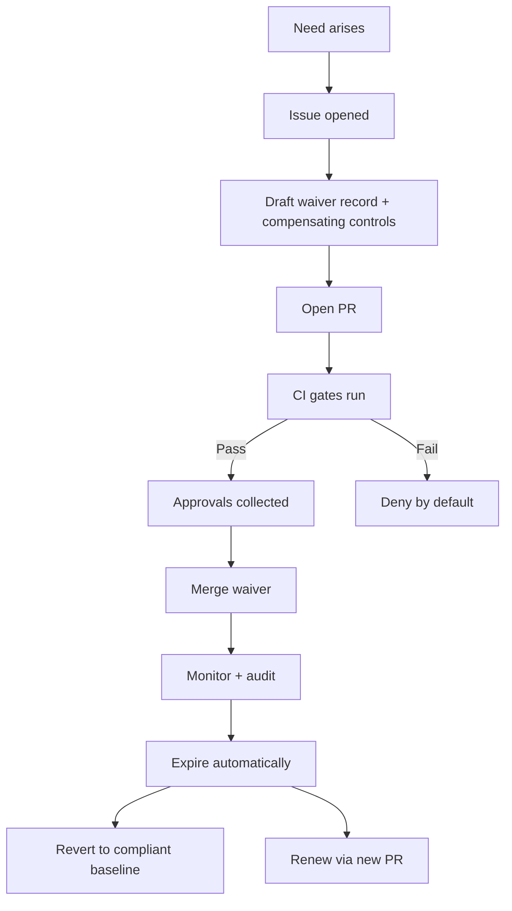

<!-- [KFM_META_BLOCK_V2]
doc_id: kfm://doc/7c89c8b0-0b2a-4d20-9aa4-0e2c4d3c5e5f
title: Waivers and Exceptions
type: standard
version: v1
status: draft
owners: TBD (Governance Council / Security / Data Stewardship)
created: 2026-03-04
updated: 2026-03-04
policy_label: restricted
related:
  - docs/governance/ROOT_GOVERNANCE_CHARTER.md
  - docs/governance/POLICY_AS_CODE.md
  - docs/governance/PROMOTION_CONTRACT.md
  - docs/governance/RISK_REGISTER.md
tags:
  - kfm
  - governance
  - waivers
  - exceptions
notes:
  - "Every deviation from a MUST-level control must be time-boxed, recorded, and auditable."
[/KFM_META_BLOCK_V2] -->

# Waivers and Exceptions
Time-boxed, auditable deviations from KFM governance controls (without bypassing the trust membrane).

---

## Impact
- **Status:** `draft` (PROPOSED: move to `active` after Governance Council approval)
- **Owners:** **UNKNOWN** (TBD: Governance Council / Security Lead / Data Steward Lead)
- **Last reviewed:** **UNKNOWN** (TBD)

**Badges (placeholders)**
- 
- 
- 

**Quick links**
- [Scope](#scope)
- [Non-waivable controls](#non-waivable-controls)
- [How to request a waiver](#how-to-request-a-waiver)
- [Waiver template](#waiver-template)
- [Emergency exceptions](#emergency-exceptions)
- [Registry and audit](#registry-and-audit)

---

## Conventions
This document follows “evidence discipline” tagging:

- **CONFIRMED** = anchored in published KFM governance/design posture.
- **PROPOSED** = recommended policy/process, not yet ratified.
- **UNKNOWN** = not specified; requires governance decision.

**Normative language**
- **MUST / MUST NOT** = hard requirement (non-optional).
- **SHOULD / SHOULD NOT** = strong default; deviations require rationale.
- **MAY** = optional.

> IMPORTANT: A waiver is permission to **deviate from a control**. It is **not** permission to bypass governance, skip evidence, or access restricted data outside policy.

---

## Scope
### What this document covers
- **PROPOSED:** A standard process to request, review, approve, record, monitor, and expire:
  - **Waivers** (time-bounded deviations from a MUST/SHOULD control)
  - **Exceptions** (one-off emergency deviations under incident response)

### What this document does not cover
- **CONFIRMED:** It does **not** redefine KFM architecture invariants or data lifecycle gates.
- **PROPOSED:** It does **not** replace incident response runbooks; it links to them.

---

## Where this fits
- **CONFIRMED (posture):** KFM is governed, evidence-first, and fail-closed.
- **CONFIRMED (architecture invariant):** Clients must not access storage/DBs directly; access crosses governed APIs and policy boundaries.
- **CONFIRMED (lifecycle):** Data promotion follows a strict lifecycle with required catalogs/provenance.

This file lives at:
- `docs/governance/WAIVERS_AND_EXCEPTIONS.md`

Related governance artifacts (paths may be adjusted to match repo reality):
- `docs/governance/ROOT_GOVERNANCE_CHARTER.md` (source of governance authority) — **UNKNOWN** if present
- `docs/governance/PROMOTION_CONTRACT.md` (promotion gates) — **UNKNOWN** if present
- `docs/governance/POLICY_AS_CODE.md` (OPA/Rego gates, policy tests) — **UNKNOWN** if present
- `docs/governance/RISK_REGISTER.md` (risk log) — **UNKNOWN** if present
- `docs/governance/waivers/` (per-waiver records) — **PROPOSED**
- `policy/waivers/` (machine-readable waiver fixtures consumed by CI/runtime) — **PROPOSED**

---

## Acceptable inputs
A waiver/exception request MUST include:
- the **specific control** being waived (link + identifier),
- the **scope** (systems, datasets, endpoints, users/roles),
- the **risk assessment** (impact + likelihood),
- the **compensating controls** (what replaces the waived control),
- the **time box** (start/end) and **review date**,
- the **rollback plan** (how to return to compliant state),
- the **evidence plan** (what receipts/logs/attestations prove compliance with the compensating controls).

---

## Exclusions
Requests MUST be rejected if they attempt to:
- **MUST NOT:** bypass policy enforcement (“trust membrane”), including direct DB/object-store access from UI clients.
- **MUST NOT:** remove or falsify provenance, run receipts, or evidence bundles.
- **MUST NOT:** publish sensitive or sovereignty-restricted information without required masking/redaction obligations.
- **MUST NOT:** waive non-waivable controls (see below).

---

## Definitions
### Waiver
A **time-bounded** approval to deviate from a defined governance control, with documented risk acceptance and compensating controls.

### Exception
A **one-off** deviation, typically under incident response (e.g., production outage), recorded retroactively and time-limited to immediate stabilization.

### Control
A testable requirement enforced by:
- policy-as-code (OPA/Rego),
- CI gates (schema/contract tests),
- runtime enforcement (API middleware),
- operational procedures (runbooks).

### Compensating control
A substitute measure that reduces risk introduced by the waiver (e.g., increased logging + narrower scope + manual approvals).

---

## Non-waivable controls
The following are **MUST NOT be waived**. Any request to waive these is denied by default.

| Control area | Rule | Why it’s non-waivable | Status |
|---|---|---|---|
| Trust membrane | Clients/UI MUST NOT access DB/storage directly; access MUST cross governed APIs + policy boundary | Prevents silent policy bypass; enforces consistent authZ & redaction | CONFIRMED |
| Evidence discipline | User-visible outputs MUST be traceable to evidence (cite-or-abstain); MUST NOT fabricate provenance | Core promise of KFM | CONFIRMED |
| Default-deny | Policy enforcement is fail-closed; missing policy or missing evidence ⇒ deny | Prevents accidental data leakage | CONFIRMED |
| Promotion integrity | PUBLISHED requires catalog triplet + validation + checksums + auditable run record | Prevents publishing unverifiable artifacts | CONFIRMED |
| Secrets hygiene | No secrets in repo; least privilege tokens | Avoids credential compromise | CONFIRMED |
| Safety / sensitivity | MUST apply masking/redaction obligations when required | Protects sensitive locations/people/sovereignty | CONFIRMED |

> NOTE: If a requirement is truly “non-waivable,” the only allowed path is to **change the requirement itself** via governance update (PR + review) — not via waiver.

---

## Waivable controls
The following controls MAY be waived **only** if the request is time-boxed and includes compensating controls.

| Waivable area | Example waiver | Required compensating controls (minimum) | Default max duration | Status |
|---|---|---|---:|---|
| Tooling / CI | Temporarily allow a flaky integration test | Quarantine scope + issue link + retry policy + owner + rollback plan | 14 days | PROPOSED |
| Catalog completeness (non-PUBLISHED zones only) | Allow WORK artifacts without full DCAT until ready | Must remain non-PUBLISHED; add “quarantine” labeling; receipts required | 30 days | PROPOSED |
| Performance SLO | Temporary relaxed latency SLO during migration | Extra telemetry + rollback + stakeholder notification | 30 days | PROPOSED |
| Metadata enrichment | Allow partial optional metadata fields | Must pass required schema; commit follow-up ticket | 60 days | PROPOSED |

---

## Approval authority matrix
**PROPOSED:** Approvals depend on risk level and surface area.

| Risk | Examples | Approver(s) | Additional requirements |
|---|---|---|---|
| Low | Docs-only process tweak; non-prod tooling | Repo Maintainer + Domain Owner | Time box + ticket |
| Medium | CI gate waiver; non-sensitive dataset in WORK/PROCESSED | Domain Owner + Governance Delegate | Compensating controls + review date |
| High | Anything touching authZ/policy enforcement; any sensitive data surface | Governance Council + Security Lead | Written risk acceptance + audit logging + postmortem |

---

## How to request a waiver
**PROPOSED process (PR-based, fail-closed):**

1. **Open an issue** (or ticket) describing the need and deadline.
2. **Create a waiver record** using the template below:
   - `docs/governance/waivers/WAIVER-YYYY-###-short-slug.md`
3. **(If needed)** add a machine-readable waiver fixture:
   - `policy/waivers/WAIVER-YYYY-###.json` (or `.yaml`)
4. **Open a PR** that includes:
   - waiver record,
   - compensating control changes (tests, logging, narrower policy scope),
   - expiration mechanism (date + enforcement).
5. **CI MUST run**:
   - policy checks (OPA/Rego),
   - schema/contract tests,
   - any additional waiver-specific checks.
6. **Required approvals** (per risk matrix).
7. **Merge** only after approvals + CI green.
8. **Track and expire**:
   - on expiration date, the waiver MUST auto-fail CI (or be removed/renewed).

> CAUTION: A waiver without an expiration mechanism is not a waiver; it’s unmanaged drift.

---

## Emergency exceptions
**PROPOSED:** Emergency exceptions are allowed only during an incident with an incident commander (IC).

Rules:
- The exception MUST be time-limited (default: **≤ 72 hours**).
- The exception MUST be recorded within **24 hours** of the emergency action.
- A post-incident review MUST determine:
  - revert to compliant behavior, or
  - convert to a standard waiver (PR + approvals).

---

## Registry and audit
### Waiver registry
**PROPOSED:** Maintain a registry table to keep waivers visible and expiring.

Location:
- `docs/governance/waivers/README.md` — **PROPOSED**

Minimum registry columns:

| Waiver ID | Control | Scope | Start | End | Owner | Approvers | Status | PR |
|---|---|---|---|---|---|---|---|---|

### Audit requirements
- **CONFIRMED (posture):** Every approved waiver MUST be auditable.
- **PROPOSED (implementation):** Record:
  - approver identities,
  - decision rationale,
  - evidence artifacts (receipts, logs, attestations),
  - expiry and review outcomes.

---

## Mermaid diagram


---

## Waiver template
Create a file:
- `docs/governance/waivers/WAIVER-YYYY-###-short-slug.md`

```yaml
---
waiver_id: "WAIVER-2026-###"
status: "proposed|approved|rejected|expired"
requested_by: "TBD"
owners:
  - "TBD"
approvers:
  - "TBD"
created: "YYYY-MM-DD"
updated: "YYYY-MM-DD"

control:
  id: "CTRL-<id-or-path-anchor>"
  title: "<control name>"
  severity: "low|medium|high"
  status_tag: "CONFIRMED|PROPOSED|UNKNOWN"

scope:
  systems: ["api", "ui", "pipelines", "policy", "infra"]
  datasets: ["<dataset_id or slug>"]
  environments: ["dev|staging|prod"]
  time_range: "<if time-bounded data scope applies>"
  geo_scope: "<if geo bounding applies>"

justification:
  summary: "<why waiver is needed>"
  deadline_driver: "<what breaks if not granted>"
  alternatives_considered:
    - "<option A>"
    - "<option B>"

risk_assessment:
  impact: "low|medium|high"
  likelihood: "low|medium|high"
  risk_notes: "<specific failure modes>"
  affected_principles: ["FAIR", "CARE", "default-deny", "evidence-first"]

compensating_controls:
  - "<control 1>"
  - "<control 2>"
  - "<control 3>"
evidence_plan:
  required_artifacts:
    - "<run_receipt path>"
    - "<policy_test output path>"
    - "<checksums/attestation reference>"
  validation_steps:
    - "<how a reviewer verifies>"

timebox:
  start: "YYYY-MM-DD"
  end: "YYYY-MM-DD"
  review_on: "YYYY-MM-DD"
  renewal_allowed: true

rollback_plan:
  steps:
    - "<step 1>"
    - "<step 2>"

enforcement:
  expires_fail_closed: true
  ci_enforcement:
    - "<job that fails after end date>"
  runtime_enforcement:
    - "<policy fixture / allowlist entry, if any>"

links:
  issue: "<issue url or id>"
  pr: "<pr url or id>"
  runbooks:
    - "<runbook path>"
---
```

---

## Approver checklist
Approvers MUST verify:

- [ ] Control is clearly identified (link + id).
- [ ] Scope is minimal (systems, datasets, envs).
- [ ] Waiver is time-boxed with expiry date.
- [ ] Compensating controls reduce risk (not just “we promise”).
- [ ] Evidence plan is concrete and auditable (receipts/logs/attestations).
- [ ] Expiry is enforced (CI/runtime), not “calendar reminder.”
- [ ] Rollback plan exists and is feasible.
- [ ] No non-waivable controls are being waived.

---

## Requester checklist
Requesters MUST include:

- [ ] Why the baseline control cannot be met now.
- [ ] What will be done to return to compliance.
- [ ] How reviewers can verify claims (commands, files, receipts).
- [ ] Who owns the follow-up and when.

---

## FAQ
### Can a waiver allow publishing without provenance?
**NO (CONFIRMED):** Publishing without required provenance/evidence violates the core evidence-first posture.

### Can a waiver be “permanent”?
**NO (PROPOSED hard rule):** If the correct behavior is different, update the control via governance PR. Waivers are time-boxed.

### What happens when a waiver expires?
**PROPOSED:** CI fails closed until:
- the waiver is removed (revert), or
- a renewal PR is approved with updated evidence.

---

## Appendix
<details>
<summary>Example waiver (illustrative only)</summary>

**WAIVER-2026-007 — Temporarily relax a flaky integration test**

- Control: `CTRL-CI-INT-004`
- Scope: `staging` only
- Duration: 14 days
- Compensating controls: additional logs, quarantined job, mandatory reruns before release
- Expiry enforcement: CI job checks date and fails after end date

</details>

---

## Footer
- 🔙 Back to top: [Waivers and Exceptions](#waivers-and-exceptions)
- ⚖️ Governance: `docs/governance/ROOT_GOVERNANCE_CHARTER.md` (if present)
