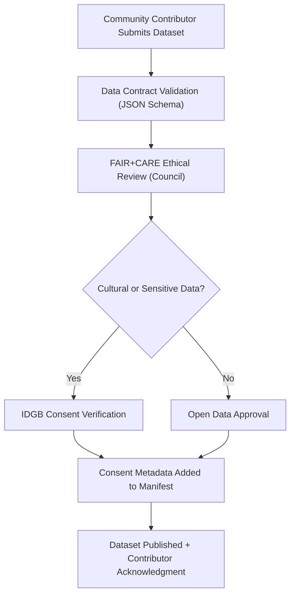
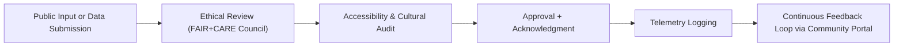

<div align="center">

# 🫱 **Kansas Frontier Matrix — Community Participation & Public Engagement Framework**
`docs/governance/community-participation.md`

**Purpose:**  
Establish a transparent, inclusive, and equitable **community participation structure** for the **Kansas Frontier Matrix (KFM)** — enabling the public, Indigenous nations, researchers, educators, and civic institutions to collaboratively shape data governance and system evolution under **FAIR+CARE** and **Master Coder Protocol v6.3** principles.

[](../README.md)
[](../standards/faircare.md)
[](../../LICENSE)
[](../../releases/v10.0.0/manifest.zip)

</div>

---

## 📘 Overview

Public engagement is a **core ethical and governance pillar** of the Kansas Frontier Matrix (KFM).  
This framework ensures that knowledge production and data governance remain **community-driven**, **transparent**, and **accountable** to Kansas residents, Indigenous nations, and the wider research ecosystem.

Community participation aligns with:
- **FAIR (Findable, Accessible, Interoperable, Reusable)** open data standards  
- **CARE (Collective Benefit, Authority to Control, Responsibility, Ethics)** Indigenous data principles  
- **ISO 26000** for social responsibility and sustainability in information systems  

---

## 🗂️ Directory Context

```
docs/governance/
├── README.md
├── community-participation.md       # This file
├── council-structure.md
├── transparency-reports.md
├── validation-pipelines.md
└── risk-and-ethics.md
```

---

## 🧭 Participation Model

| Role | Description | Representation |
|---|---|---|
| **Public Contributor** | Individuals who engage with KFM datasets, propose features, or contribute open data. | General public |
| **Research Partner** | Academic, governmental, or nonprofit institutions collaborating on specific data or AI research. | Institutions |
| **Indigenous Partner** | Tribal or cultural representatives ensuring CARE-compliant data stewardship. | Indigenous Data Governance Board |
| **Education Partner** | Educators using KFM resources in classrooms and civic programs. | Schools / Universities |
| **Citizen Scientist** | Community volunteers contributing observations, maps, or environmental reports. | Local engagement |
| **Governance Observer** | Public representative attending open FAIR+CARE Council meetings. | Open participation |

All participation channels are governed by **FAIR+CARE ethics**, requiring attribution, consent, and open feedback mechanisms.

---

## 🤝 Engagement Principles

| Principle | Description | Compliance Framework |
|---|---|---|
| **Transparency** | All governance decisions, audits, and council minutes are publicly accessible. | FAIR Principle F1 |
| **Equity** | Diverse stakeholders represented in all decision processes. | CARE Principle E |
| **Consent** | Indigenous and community consent required for cultural or personal data use. | CARE Principle A |
| **Reciprocity** | Contributors receive acknowledgment, attribution, and reuse rights. | MCP v6.3 FAIR+CARE Alignment |
| **Accessibility** | Participation tools meet WCAG 2.1 AA standards for inclusion. | ISO 9241-210 |

---

## 🧩 Participation Pathways

| Channel | Purpose | Access Method |
|---|---|---|
| **Public Forum** | Community Q&A and open discussion on governance issues. | Web portal and GitHub Discussions |
| **Data Submission Portal** | Contribute datasets under KFM data contract templates. | `data-submission.yml` |
| **FAIR+CARE Workshops** | Training sessions on open data ethics and accessibility. | Quarterly public sessions |
| **Indigenous Governance Sessions** | Structured collaboration with tribal governments. | IDGB-led meetings |
| **Youth Education Initiatives** | Integrating KFM into Kansas school curricula. | K–12 outreach and STEM partnerships |
| **Citizen Science Projects** | Environmental monitoring and historical data crowdsourcing. | FAIR+CARE data apps |

---

## ♿ Accessibility & Inclusion

All community participation channels must:
- Meet **WCAG 2.1 AA** accessibility standards.  
- Support multilingual interfaces (English, Spanish, Kansa, Osage, etc.).  
- Provide **alternative feedback modes** (voice, text, or paper-based forms).  
- Avoid elitist or exclusionary gatekeeping — open contribution is default.  
- Include **accessibility statements** in all published materials.  

```json
{
  "accessibility": {
    "standard": "WCAG 2.1 AA",
    "inclusion_languages": ["en", "es", "ksn", "osa"],
    "feedback_modes": ["web_form", "email", "phone", "mail"]
  }
}
```

---

## 🧠 FAIR+CARE Ethical Integration

| FAIR+CARE Principle | Application in Community Participation |
|---|---|
| **Collective Benefit** | All participation directly enhances Kansas’s shared knowledge commons. |
| **Authority to Control** | Contributors decide licensing, visibility, and data governance tiers. |
| **Responsibility** | Governance teams maintain accountability and attribution records. |
| **Ethics** | Discussions, datasets, and imagery moderated to avoid harm or bias. |

All public interactions are recorded in telemetry with anonymized, non-identifiable metadata.

---

## 🧾 Example: Community Contribution Workflow



**Workflow Highlights**
- Validation ensures schema and metadata completeness.  
- Cultural data routed to **Indigenous Data Governance Board (IDGB)**.  
- All actions logged in `focus-telemetry.json`.  

---

## 🧾 Governance Feedback Channels

| Feedback Type | Channel | Responsible Body |
|---|---|---|
| **Ethical or Cultural Concern** | Email: ethics@kansasfrontiermatrix.org | FAIR+CARE Council |
| **Accessibility Issue** | Web accessibility report form | Accessibility Design Council |
| **Data Correction Request** | GitHub issue or web form | Data Standards Committee |
| **Educational Partnership** | Contact portal for teachers and students | KFM Outreach Program |
| **Indigenous Data Consent Update** | IDGB private communication channel | Indigenous Data Governance Board |

---

## 📊 Community Engagement Metrics

| Metric | Target | Validation Source |
|---|---|---|
| **Active Contributors** | ≥ 500 per year | GitHub Analytics |
| **Workshops Conducted** | ≥ 12 per year | Outreach Telemetry |
| **Cultural Collaborations** | ≥ 10 tribes annually | IDGB Reports |
| **Educational Institutions Engaged** | ≥ 25 | KFM Outreach Data |
| **Accessibility Compliance (WCAG)** | 100% | Accessibility Council |
| **FAIR+CARE Ethics Alignment** | ≥ 95% | Governance Telemetry |

---

## 🧮 Community Lifecycle



Community participation is cyclical and iterative — reinforcing long-term relationships and responsible innovation.

---

## 🕰️ Version History

| Version | Date | Author | Summary |
|---|---|---|---|
| v10.0.0 | 2025-11-10 | FAIR+CARE Governance Secretariat & Outreach Council | Established the Kansas Frontier Matrix Community Participation Framework ensuring inclusive, ethical, and transparent engagement across public, academic, and Indigenous partners. |

---

<div align="center">

**© 2025 Kansas Frontier Matrix — CC-BY 4.0**  
Governed under **Master Coder Protocol v6.3** · Certified by **FAIR+CARE Council** · Diamond⁹ Ω / Crown∞Ω Ultimate Certified  
[⬅ Back to Governance Index](README.md) · [Transparency Reports →](transparency-reports.md)

</div>