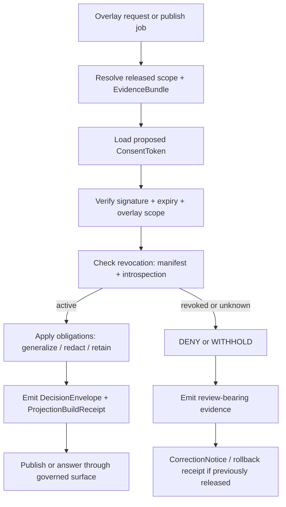

<!-- [KFM_META_BLOCK_V2]
doc_id: kfm://doc/REVIEW_REQUIRED_UUID
title: KFM Overlay Consent Tokens & Revocation Enforcement
type: standard
version: v1
status: draft
owners: @bartytime4life
created: 2026-04-01
updated: 2026-04-03
policy_label: public
related: [docs/governance/README.md, docs/governance/ROOT_GOVERNANCE.md, docs/governance/ETHICS.md, docs/governance/SOVEREIGNTY.md, docs/standards/KFM_MARKDOWN_WORK_PROTOCOL.md, policy/README.md, contracts/README.md, schemas/README.md, tests/README.md]
tags: [kfm, governance, consent, overlays, geoprivacy, revocation, proof-objects]
notes: [doc_id remains review-required; public-main path is confirmed; mounted contracts, policy bundles, KMS wiring, and revocation services remain unverified]
[/KFM_META_BLOCK_V2] -->

# KFM Overlay Consent Tokens & Revocation Enforcement

_Governed consent and revocation rules for sensitive overlays, with KFM doctrine kept separate from realization guidance._

> **Status:** draft standard · public `main` path verified · mounted enforcement depth still unknown  
> **Owners:** `@bartytime4life` *(broad `/docs/` CODEOWNERS fallback confirmed on public `main`; narrower consent-lane ownership still needs verification)*  
> **Repo fit:** `docs/governance/consent/OVERLAY_CONSENT_TOKENS.md` · governance law [`../ROOT_GOVERNANCE.md`](../ROOT_GOVERNANCE.md) · sensitivity [`../SOVEREIGNTY.md`](../SOVEREIGNTY.md) · ethics [`../ETHICS.md`](../ETHICS.md) · authoring protocol [`../../standards/KFM_MARKDOWN_WORK_PROTOCOL.md`](../../standards/KFM_MARKDOWN_WORK_PROTOCOL.md) · machine-check neighbors [`../../../policy/README.md`](../../../policy/README.md), [`../../../contracts/README.md`](../../../contracts/README.md), [`../../../schemas/README.md`](../../../schemas/README.md), [`../../../tests/README.md`](../../../tests/README.md)  
>        
> **Quick jump:** [Scope](#scope) · [Repo fit](#repo-fit) · [Accepted inputs](#accepted-inputs) · [Exclusions](#exclusions) · [Verification posture](#verification-posture) · [Confirmed requirements](#confirmed-governance-requirements) · [Proposed realization](#proposed-tokenized-realization) · [Proof objects](#proof-objects-and-receipts) · [Validation](#validation-and-gates) · [Decision flow](#decision-flow) · [Migration](#migration-and-rollback) · [Definition of done](#definition-of-done) · [Open verification](#open-verification)  
> [!IMPORTANT]
> This file separates **CONFIRMED** KFM governance law from a **PROPOSED** consent-token realization. Sensitive overlays already require governed rights, sensitivity, precision, release, and correction handling. The token, manifest, introspection, and receipt shapes below are one candidate way to make those burdens executable.
>
> [!WARNING]
> Current public `main` confirms the path and directory placement for this standard. It does **not** by itself prove mounted policy bundles, workflow gates, KMS integration, revocation services, or consent-aware runtime contracts for this lane.

## Scope

This standard governs how KFM should handle **overlay-specific consent** when a map, timeline, Story, Dossier, export, or other overlay-bearing surface could expose sensitive location, person, species, site, stewardship, or cultural context.

It applies most strongly to overlays that are:

- precision-sensitive
- rights- or steward-review-bearing
- derived from released evidence but still capable of widening exposure
- visible on public or ordinary steward-facing surfaces

It does **not** govern:

- generic user/session authentication
- purely internal fixtures that cannot map back to real subjects
- non-spatial permissions already owned by a stronger auth or role-control surface
- machine-readable policy bundles or schemas that should live in `policy/`, `contracts/`, `schemas/`, or `tests/`

## Repo fit

| Item | Value |
| --- | --- |
| Path | `docs/governance/consent/OVERLAY_CONSENT_TOKENS.md` |
| Path status | **CONFIRMED** on public `main` |
| Role | Governance standard for overlay-specific consent, revocation, and public-safe precision control |
| Upstream context | [`../README.md`](../README.md) · [`../ROOT_GOVERNANCE.md`](../ROOT_GOVERNANCE.md) · [`../ETHICS.md`](../ETHICS.md) · [`../SOVEREIGNTY.md`](../SOVEREIGNTY.md) |
| Adjacent authoring/control surfaces | [`../../standards/KFM_MARKDOWN_WORK_PROTOCOL.md`](../../standards/KFM_MARKDOWN_WORK_PROTOCOL.md) · [`../../../policy/README.md`](../../../policy/README.md) · [`../../../contracts/README.md`](../../../contracts/README.md) · [`../../../schemas/README.md`](../../../schemas/README.md) · [`../../../tests/README.md`](../../../tests/README.md) |
| Current public signal | The `docs/governance/consent/` lane exists on public `main` and already contains this file; revise here rather than creating a parallel authority document |
| Trust boundary | This file explains the rule set; it does **not** replace machine-checkable policy, contracts, fixtures, or runtime emitters |

## Accepted inputs

The following material belongs in this standard:

- governance law about release, review, exact-location exposure, correction, and negative states
- sovereignty and rights guidance that changes whether an overlay may be public-safe, generalized, withheld, or denied
- proof-object expectations for `EvidenceBundle`, decision, receipt, and correction linkage
- overlay-specific obligations that must survive build, publish, runtime, and rollback
- review-facing guidance for how consent interacts with steward decisions

## Exclusions

This standard should not quietly absorb other authority surfaces.

| Does not belong here | Put it here instead |
| --- | --- |
| Executable Rego / policy bundles | [`../../../policy/`](../../../policy/) |
| JWT/JWS schema files, JSON Schemas, fixtures | [`../../../contracts/`](../../../contracts/) and [`../../../schemas/`](../../../schemas/) |
| Valid / invalid examples and negative-path drills | [`../../../tests/`](../../../tests/) |
| KMS secret material, key-management procedures, or deployment-specific credentials | owning ops / infra surfaces |
| Claims that token services or runtime gates already exist | keep those `UNKNOWN` or `PROPOSED` until branch-verified |

## Verification posture

Use the same truth labels KFM applies elsewhere.

| Label | Meaning in this file |
| --- | --- |
| **CONFIRMED** | Directly supported by current public repo docs or the March–April 2026 KFM doctrine surfaced in this session |
| **INFERRED** | Conservative interpretation strongly implied by repeated KFM governance and sovereignty rules |
| **PROPOSED** | A repo-ready realization shape that fits doctrine but is not yet proven as mounted implementation |
| **UNKNOWN** | Not verified strongly enough to present as live repo, runtime, contract, or service fact |
| **NEEDS VERIFICATION** | Path, owner, UUID, workflow, policy bundle, service endpoint, or contract detail that should be checked before merge |

## Confirmed governance requirements

KFM doctrine already imposes the following burdens on sensitive overlays.

| Governance requirement | Overlay consequence |
| --- | --- |
| **Release is a governed state change** | A successful render, export, or build does **not** by itself authorize overlay publication. |
| **Precision is conditional** | Exact coordinates, detailed geometry, or revealing context may need to be generalized, role-gated, withheld, or denied. |
| **Derived layers stay subordinate** | Tiles, search projections, graph projections, scenes, and overlays do not silently inherit sovereign authority. |
| **Evidence stays one hop away** | A consequential overlay should still route back to released evidence and visible release state. |
| **Negative states are valid** | `generalized`, `withheld`, `denied`, `partial`, `stale-visible`, `withdrawn`, and similar outcomes are legitimate governed outcomes, not UX failures. |
| **Correction remains visible** | If a previously allowed overlay must be narrowed or revoked, the correction path should remain inspectable after the fact. |

### Overlay-specific interpretation

The doctrine above implies a stronger burden for overlay surfaces than for generic browse-only metadata.

| Material family | Minimum public-safe posture | Status |
| --- | --- | --- |
| Rare species, archaeology, culturally sensitive places, oral-history-linked sites | Prefer generalized or withheld publication unless exact exposure is explicitly justified and reviewed | **INFERRED** |
| Person- or household-adjacent points, routes, or descriptive overlays | Do not publish precise location or revealing detail merely because the underlying record exists | **INFERRED** |
| Synthetic, non-linkable fixtures | May be outside this lane if they cannot map back to real subjects and do not widen exposure | **INFERRED** |

> [!NOTE]
> KFM doctrine strongly confirms the **problem** this standard is solving. It does **not** yet prove that the mounted repo already exposes a finished consent-token contract, revocation API, or consent-aware receipt schema.

## Proposed tokenized realization

Everything in this section is **PROPOSED** unless a stronger mounted contract or policy bundle proves otherwise.

### Design overview

A small, machine-checkable consent layer can make overlay release burdens operational without turning consent into a silent bypass.

| Proposed component | Minimal job | Should feed or attach to |
| --- | --- | --- |
| `ConsentToken` | Scope-bounded grant for a specific overlay set, geography bucket, time window, and permitted use | `DecisionEnvelope`, runtime checks |
| `ConsentStewardRecord` | Private steward-side record linking token hash, scope, obligations, and issuance context | review lane / steward tools |
| `ConsentRevocationManifest` | Offline-suitable revocation snapshot for build and publish jobs | publish-time and batch checks |
| `ConsentIntrospectionResult` | Near-real-time status check for revoked / unknown / active state | runtime or publish-time evaluation |
| `OverlayConsentDecision` | Final per-run interpretation of token + obligations + surface scope | `DecisionEnvelope`, `ProjectionBuildReceipt`, `RuntimeResponseEnvelope` |
| `ConsentCorrectionNotice` | Visible correction or rollback trail when a once-allowed overlay becomes narrowed, withdrawn, or denied | `CorrectionNotice` / rollback artifacts |

### Minimal token claims

The token should stay narrow. It is a scope carrier, not a sovereign truth object.

| Claim | Type | Required | Why it exists |
| --- | --- | :---: | --- |
| `iss` | `string` | ✓ | Issuer identity |
| `sub` | `string` | ✓ | Subject or steward-side binding reference |
| `aud` | `string` | ✓ | Overlay consent audience, e.g. `kfm/overlays` |
| `overlay_ids` | `string[]` | ✓ | Explicit overlay identifiers covered by the grant |
| `geobucket` | `object` | ✓ | Coarse spatial scope, not precise geometry |
| `time_window` | `object` | ✓ | Temporal scope for use |
| `permitted_uses` | `string[]` | ✓ | What the token actually allows |
| `obligations` | `object[]` | ✓ | Redaction / generalization / retention duties |
| `iat` | `integer` | ✓ | Issued-at timestamp |
| `exp` | `integer` | ✓ | Short-lived expiry |
| `spec_hash` | `string` | ✓ | Version anchor for the governing spec |
| `consent_token_hash` | `string` | ✓ | Stable receipt / revocation join key |

### Precision and scope rules

The overlay-specific consent token should follow four tight rules.

1. **No precise geometry in the token.** Carry a `geobucket`, not point/line/polygon detail.
2. **Public scope cannot outrun token scope.** A renderer, tiler, or export job should fail closed if the requested precision is finer than the token permits.
3. **Time scope matters.** A token that is valid for one release window, replay range, or study period should not silently widen to another.
4. **Short lifetime beats broad reuse.** Re-issuance is safer than indefinite scope creep.

> [!IMPORTANT]
> Geobucket precision should be **coarser than or equal to** the finest public-safe release precision. A public surface should never recover more detail than the consent scope intended.

### Revocation model

Revocation should support both build-time and near-line checks.

| Check | Purpose | Required reaction |
| --- | --- | --- |
| `ConsentRevocationManifest` | Gives offline or batch jobs a signed revocation snapshot | If the token is present and revoked or unknown, do not publish |
| `ConsentIntrospectionResult` | Gives interactive or near-line jobs a fresher status read | If the token is revoked or unknown, deny or withhold immediately |
| Manifest / introspection disagreement | Signals trust-state conflict | Fail closed, emit review-bearing evidence, and stop outward release |

**Working rule:** if any required revocation check yields `revoked` or `unknown`, the outward result should not become a normal public overlay.

### Obligations mini-schema

An obligation object should remain small enough to test and strict enough to enforce.

| Field | Purpose |
| --- | --- |
| `action` | What must happen: `redact`, `generalize`, `retain-until`, `provenance`, `purge-on-revoke` |
| `target` | What it applies to: `geometry`, `attributes`, `evidence_links`, `run_artifacts` |
| `params` | Narrow parameter set for the action |

<details>
<summary>Illustrative obligation JSON</summary>

```json
{
  "action": "generalize",
  "target": "geometry",
  "params": {
    "generalize_to": "geohash/5"
  }
}
```

</details>

### Decision mapping

Do not collapse release decisions and runtime outcomes into one ambiguous field.

| Condition | Proposed decision result | Public surface state | Runtime outcome when interactive |
| --- | --- | --- | --- |
| Token active, scope fits, obligations satisfied | `allow` or `generalize` | `public-safe` or `generalized` | `ANSWER` |
| Token active but steward review still required | `review-required` | `withheld` pending review | `ABSTAIN` or `DENY` |
| Token expired, revoked, or unknown | `deny` | `denied` or `withdrawn` | `DENY` |
| Policy or evidence service unavailable | `hold` / `error` | `source-dependent` or error state | `ABSTAIN` or `ERROR` |

> [!NOTE]
> KFM’s outward runtime contract stays `ANSWER`, `ABSTAIN`, `DENY`, or `ERROR`. Overlay-specific release language such as `allow`, `generalize`, or `review-required` should sit **under** that runtime envelope, not replace it.

## Proof objects and receipts

KFM already expects typed proof objects. A consent realization should plug into them rather than inventing a parallel trust vocabulary.

| Object family | Why this matters for consent | Status |
| --- | --- | --- |
| `EvidenceBundle` | Keeps the overlay claim one hop from released evidence and visible scope | **CONFIRMED** doctrine |
| `DecisionEnvelope` | Carries allow / generalize / review-required / deny reasoning and obligations | **CONFIRMED** doctrine |
| `ReviewRecord` | Makes steward review explicit where consent or sensitivity requires it | **CONFIRMED** doctrine |
| `ProjectionBuildReceipt` / `ReleaseManifest` | Proves the derived overlay was built from known, released scope | **CONFIRMED** doctrine |
| `RuntimeResponseEnvelope` | Keeps interactive surface outcomes finite and auditable | **CONFIRMED** doctrine |
| Consent-specific binding schema | Connects token hash, revocation state, obligations, and overlay scope into the existing proof lattice | **PROPOSED** |

### Steward-side record

A steward-side record is the private counterpart to a public-safe token hash.

Minimum useful fields:

- `consent_token_hash`
- `issuer`
- `spec_hash`
- `scope`
- `permitted_uses`
- `obligations`
- `issued_at`
- `expires_at`
- `revocation_root_at_issue`
- `review_ref` or equivalent steward decision reference when required

### Illustrative consent-aware run receipt

<details>
<summary>Illustrative JSON receipt</summary>

```json
{
  "run_id": "UUID",
  "audit_ref": "AUDIT-REF",
  "inputs": {
    "evidence_bundle_refs": ["EvidenceBundle:..."],
    "dataset_version_refs": ["DatasetVersion:..."]
  },
  "overlay": {
    "overlay_ids": ["overlay.example"],
    "requested_surface": "map"
  },
  "overlay_consent": {
    "consent_token_hash": "sha256-...",
    "issuer": "kfm-consent",
    "token_status": "active|revoked|unknown",
    "scope": {
      "overlay_ids": ["overlay.example"],
      "geobucket": { "standard": "geohash", "precision": 5 },
      "time_window": { "start": "2026-04-01", "end": "2026-04-30" }
    },
    "permitted_uses": ["research-generalized"],
    "obligations": [
      {
        "action": "generalize",
        "target": "geometry",
        "params": { "generalize_to": "geohash/5" }
      }
    ],
    "revocation_root_checked": "sha256-..."
  },
  "decision": {
    "decision_result": "allow|generalize|review-required|deny",
    "reason_codes": ["rights_missing", "sensitivity_unresolved"],
    "obligation_codes": ["generalize_geometry"],
    "review_required": true
  },
  "surface_state": "public-safe|generalized|withheld|denied",
  "runtime_outcome": "ANSWER|ABSTAIN|DENY|ERROR",
  "correction_ref": "CorrectionNotice:..."
}
```

</details>

## Validation and gates

### Minimum checks

| Gate | What must be proven | Status |
| --- | --- | --- |
| Contract validation | Token, steward record, receipt, and revocation payloads parse and validate | **PROPOSED** |
| Precision rule | Requested output precision does not outrun token scope | **PROPOSED** |
| Revocation rule | `revoked` or `unknown` blocks outward release | **PROPOSED** |
| Evidence rule | Receipt points back to released evidence and visible decision state | **INFERRED** from doctrine |
| Negative-path tests | Generalize / withhold / deny / rollback paths are all tested, not just allow paths | **INFERRED** from verification doctrine |
| Correction drill | Revoked overlays emit visible narrowing / withdrawal lineage | **INFERRED** from governance and correction doctrine |

### Proposed CI and runtime gates

1. **Policy / CI gate**
   - fail when consent blocks are missing for overlays that require them
   - fail when scope is finer than the token allows
   - fail when `token_status` is `revoked` or `unknown`
   - fail when receipt objects omit evidence, decision, or correction linkage

2. **Runtime gate**
   - verify signature, expiry, scope, and revocation before answer or publish
   - preserve no-bypass behavior in publishers, renderers, and outward APIs
   - return finite negative outcomes instead of silently hiding the policy result

3. **Review gate**
   - where consent is unresolved or precision risk is high, require an explicit review-bearing decision rather than a silent default

### Suggested test families

- valid / invalid token fixtures
- over-precision request fixtures
- revoked / unknown manifest fixtures
- missing evidence-link fixtures
- negative-path UI or API fixtures proving `DENY`, `ABSTAIN`, generalized, and withdrawn states remain visible

## Decision flow



## Migration and rollback

Start small and fail closed.

1. **Wrap publishers first.** The publish edge is the narrowest, highest-value place to enforce consent scope before widening to readers or Story surfaces.
2. **Backfill trust state for recent sensitive overlays.** If historic overlays cannot reconstruct consent posture, mark them `UNKNOWN` and move them to steward review, generalized release, or withholding rather than silently treating them as public-safe.
3. **Add proof objects before UX breadth.** A token without receipt, decision, and correction linkage is still too weak to carry merge-gate weight.
4. **Wire revocation to rollback.** A later revocation should not just stop future release; it should emit visible correction or withdrawal lineage for already released derived overlays.
5. **Only then widen to interactive surfaces.** Story, Focus, Compare, and export surfaces should inherit the same checked result instead of bypassing it.

## Related standards

- [`../ROOT_GOVERNANCE.md`](../ROOT_GOVERNANCE.md)
- [`../ETHICS.md`](../ETHICS.md)
- [`../SOVEREIGNTY.md`](../SOVEREIGNTY.md)
- [`../../standards/KFM_MARKDOWN_WORK_PROTOCOL.md`](../../standards/KFM_MARKDOWN_WORK_PROTOCOL.md)
- [`../../../policy/README.md`](../../../policy/README.md)
- [`../../../contracts/README.md`](../../../contracts/README.md)
- [`../../../schemas/README.md`](../../../schemas/README.md)
- [`../../../tests/README.md`](../../../tests/README.md)

## Definition of done

- [ ] The file keeps **CONFIRMED** doctrine separate from **PROPOSED** implementation detail
- [ ] Consent-bearing overlays can be mapped to explicit public-safe, generalized, withheld, denied, or withdrawn states
- [ ] A consent-aware proof path exists from overlay surface back to `EvidenceBundle`, decision, and correction linkage
- [ ] Negative-path tests exist for revoked, unknown, expired, over-precision, and review-required cases
- [ ] Review-bearing or correction-bearing outcomes remain visible after release changes
- [ ] Any mounted service names, policy bundle paths, UUIDs, or schema filenames are verified on the working branch before merge

## Open verification

The following remain intentionally visible:

- real `doc_id` / UUID and any stronger document registry rule
- whether `docs/governance/consent/README.md` is intended to stay placeholder-only or become a substantive lane index
- actual contract filenames and fixture paths for this lane
- mounted policy bundles, workflow gates, and required checks for consent-aware promotion
- actual KMS integration, revocation manifest publication path, and introspection service wiring
- whether any existing release or runtime envelopes already carry a consent block in the active branch

[Back to top](#kfm-overlay-consent-tokens--revocation-enforcement)
