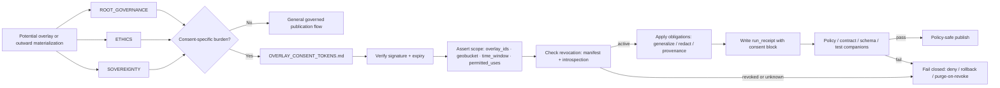

<!-- [KFM_META_BLOCK_V2]
doc_id: kfm://doc/NEEDS_VERIFICATION_UUID
title: Kansas Frontier Matrix — Consent Governance
type: standard
version: v1
status: draft
owners: @bartytime4life
created: YYYY-MM-DD
updated: YYYY-MM-DD
policy_label: public
related: [docs/governance/README.md, docs/governance/ROOT_GOVERNANCE.md, docs/governance/ETHICS.md, docs/governance/SOVEREIGNTY.md, docs/governance/consent/OVERLAY_CONSENT_TOKENS.md, policy/README.md, contracts/README.md, schemas/README.md, tests/README.md, .github/CODEOWNERS, .github/PULL_REQUEST_TEMPLATE.md]
tags: [kfm, governance, consent]
notes: [doc_id_created_updated_need_verification, owners_follow_current_broad_docs_CODEOWNERS_fallback_on_public_main]
[/KFM_META_BLOCK_V2] -->

# Kansas Frontier Matrix — Consent Governance

*Directory contract for consent-scoped governance in KFM: when an outward surface needs bounded permission, revocation checks, and visible receipts before it is allowed to publish.*

> **Status:** experimental directory README · current public consent subtree verified on `main`; deeper runtime, policy, and test wiring still needs verification  
> **Owners:** `@bartytime4life` *(current broad `/docs/` CODEOWNERS fallback on public `main`; consent-specific owner mapping is not separately verified)*  
>        
> **Quick jump:** [Scope](#scope) · [Verification posture](#verification-posture) · [Repo fit](#repo-fit) · [Accepted inputs](#accepted-inputs) · [Exclusions](#exclusions) · [Directory tree](#directory-tree) · [Quickstart](#quickstart) · [Usage](#usage) · [Diagram](#diagram) · [Tables](#tables) · [Task list](#task-list) · [FAQ](#faq) · [Appendix](#appendix)  
> **Repo fit:** `docs/governance/consent/README.md` · upstream [`../README.md`](../README.md) · root law [`../ROOT_GOVERNANCE.md`](../ROOT_GOVERNANCE.md) · current companion [`./OVERLAY_CONSENT_TOKENS.md`](./OVERLAY_CONSENT_TOKENS.md)

> [!IMPORTANT]
> In KFM, consent is not a decorative disclosure banner. If an overlay, tile, frame, export preview, or comparable outward materialization could reveal sensitive location, person, species, site, or cultural information, consent has to survive scope checks, revocation, obligation enforcement, and visible receipt-writing before publication.

> [!NOTE]
> This directory is intentionally narrow. It is currently centered on overlay consent and revocation. It does not replace root governance, ethics, sovereignty, executable policy, contracts, or tests.

## Scope

This directory is the human-facing navigation layer for **consent-specific governance** in KFM.

Use it when a surface needs more than general release posture and ordinary review. In practice, that means a path where a subject, steward, or lane-specific reviewer must be able to say **who approved what, for which place, for which time window, for which use, and how that permission can later be revoked**.

On the current public tree, the consent lane is centered on **overlay publication and revocation enforcement**. That is a meaningful scope, but it is not the whole rights and sensitivity universe. Consent here should stay coupled to the broader KFM law set: truth path before delivery, review before trust, correction before silent replacement, and public-safe release before convenience.

## Verification posture

| Label | Meaning in this README |
|---|---|
| **CONFIRMED** | Directly supported by the current public repo tree or by the March–April 2026 KFM doctrinal corpus. |
| **INFERRED** | Strongly implied by repeated KFM doctrine or by the checked-in consent companion, but not directly proven as mounted implementation behavior. |
| **PROPOSED** | Repo-ready packaging or next-shape machine companion that fits doctrine but is not yet proven as current repo reality. |
| **UNKNOWN** | Not verified strongly enough to present as live implementation fact. |
| **NEEDS VERIFICATION** | A path, owner, date, workflow, rule, or runtime detail that should be checked on the exact working branch before merge. |

### Current evidence boundary

| Observation | Status | Why it changes this README |
|---|---|---|
| `docs/governance/consent/` exists on current public `main` | **CONFIRMED** | This README can describe a real subtree, not a hypothetical one. |
| The current public consent subtree contains `README.md` and `OVERLAY_CONSENT_TOKENS.md` | **CONFIRMED** | The directory contract should stay narrow and align to the one substantive consent companion already checked in. |
| Broad ownership for `/docs/` resolves to `@bartytime4life` in current public `CODEOWNERS` | **CONFIRMED** | Owner text can be grounded, but it should stay explicit that this is a broad fallback rather than a consent-only map. |
| KFM doctrine treats rights, sensitivity, exact-location exposure, review state, and correction lineage as trust-bearing publication burdens | **CONFIRMED** | Consent language in this README should stay tied to governed publication, not casual layer sharing. |
| Consent-specific endpoints, bundles, schemas, fixtures, tests, and runtime enforcement beyond the checked-in overlay doc | **UNKNOWN / NEEDS VERIFICATION** | Do not imply that issuance, revocation services, or policy/test wiring are already mounted just because the standard describes them. |

> [!CAUTION]
> Do not let **consent** become a loose synonym for every rights, privacy, sensitivity, or sovereignty burden in KFM. Consent sits beside those controls, not above them.

## Repo fit

| Field | Value |
|---|---|
| Path | `docs/governance/consent/README.md` |
| Role in repo | Human-facing directory contract for consent-scoped governance, revocation posture, and handoffs to machine-enforced surfaces |
| Upstream neighbors | [`../README.md`](../README.md) · [`../ROOT_GOVERNANCE.md`](../ROOT_GOVERNANCE.md) |
| Primary sibling governance docs | [`../ETHICS.md`](../ETHICS.md) · [`../SOVEREIGNTY.md`](../SOVEREIGNTY.md) |
| Current directory companion | [`./OVERLAY_CONSENT_TOKENS.md`](./OVERLAY_CONSENT_TOKENS.md) |
| Machine companions this README must stay aligned with | [`../../../policy/README.md`](../../../policy/README.md) · [`../../../contracts/README.md`](../../../contracts/README.md) · [`../../../schemas/README.md`](../../../schemas/README.md) · [`../../../tests/README.md`](../../../tests/README.md) |
| Review / control-plane links | [`../../../.github/PULL_REQUEST_TEMPLATE.md`](../../../.github/PULL_REQUEST_TEMPLATE.md) · [`../../../.github/CODEOWNERS`](../../../.github/CODEOWNERS) |
| Trust failure to avoid | A consent README that sounds authoritative while quietly overclaiming live token services, revocation automation, or policy/test enforcement that has not been branch-verified |

This README should do one job well: make it obvious **when** contributors must step into consent-specific governance, **which checked-in companion currently governs that lane**, and **which adjacent surfaces must change with it**.

## Accepted inputs

Content that belongs in this directory includes:

- consent-specific governance standards and directory-level navigation
- bounded-permission rules for overlays and comparable outward surfaces
- token-claim explanations such as overlay scope, geobucket, time window, permitted uses, and obligations
- revocation, purge-on-revoke, rollback, or receipt-writing guidance
- steward verification checklists and review triggers
- links to adjacent policy, contract, schema, test, and PR review surfaces when consent changes imply machine-checkable consequences

## Exclusions

| Does **not** belong here | Route it instead to | Why |
|---|---|---|
| live tokens, KMS key material, revocation manifests, or steward-private linkage | secret manager or operational store | Secret-bearing material must not live in docs. |
| precise geometry, subject PII, or descriptive detail that would itself create the exposure burden this directory is meant to control | restricted stores or generalized public-safe outputs | The docs lane must not leak the thing it is supposed to govern. |
| executable Rego bundles, decision registries, or runtime policy loaders | [`../../../policy/`](../../../policy/) | Machine enforcement belongs in the policy surface. |
| canonical schemas, valid/invalid fixtures, or machine-enforced receipt shapes | [`../../../contracts/`](../../../contracts/) and [`../../../schemas/`](../../../schemas/) | Singular contract authority matters more than convenience copies. |
| runtime publisher, renderer, or introspection code | owning runtime, package, or pipeline surface | Execution glue is adjacent to consent, not the same artifact. |
| lane-specific release manuals for archaeology, biodiversity, oral history, or other high-burden domains | lane docs plus [`../SOVEREIGNTY.md`](../SOVEREIGNTY.md) and [`../ETHICS.md`](../ETHICS.md) | Consent is only one burden inside the wider release law. |
| prose that upgrades **PROPOSED** issuance or revocation flows into “already live” implementation | branch-verified docs or checked-in implementation | Overclaiming weakens KFM trust posture. |

## Directory tree

```text
docs/governance/consent/
├── README.md
└── OVERLAY_CONSENT_TOKENS.md
```

> [!NOTE]
> The current public consent subtree is intentionally small. Link outward to policy, contract, schema, and test surfaces instead of inventing local mirrors unless the working branch explicitly adds them.

## Quickstart

Open these together before changing consent-scoped behavior:

```text
1. ./OVERLAY_CONSENT_TOKENS.md
2. ../ROOT_GOVERNANCE.md
3. ../ETHICS.md
4. ../SOVEREIGNTY.md
5. ../../../policy/README.md
6. ../../../contracts/README.md
7. ../../../schemas/README.md
8. ../../../tests/README.md
9. ../../../.github/PULL_REQUEST_TEMPLATE.md
```

Then use this sequence:

1. Decide whether the surface is merely **governed by general release law** or whether it needs **subject/steward-bounded consent** as well.
2. If consent applies, anchor on [`./OVERLAY_CONSENT_TOKENS.md`](./OVERLAY_CONSENT_TOKENS.md) first.
3. Verify that scope stays explicit: overlay IDs, coarse geography, time window, permitted uses, and obligations.
4. Check fail-closed behavior early: expired, revoked, unknown, or out-of-scope should not degrade into “best effort.”
5. Keep the visible outcome explicit: **publish**, **review-required**, **generalize**, **deny**, **hold**, **rollback**, or **purge-on-revoke**.
6. If token claims, receipt shape, revocation behavior, or obligation semantics change, update the owning policy, contract, schema, and test surfaces in the same change stream.
7. Keep secrets and exact coordinates out of docs, examples, screenshots, and fixture prose.

## Usage

### Start here when…

- a map or timeline overlay could expose a sensitive location, person, species, site, or cultural resource
- a subject or steward needs to approve use for a **specific** place, time window, and purpose
- an output must carry visible consent provenance in a `run_receipt`
- revocation or purge-on-revoke has to remain inspectable after publication
- a renderer or publisher needs to prove generalized vs precise behavior at the policy edge

### Escalate immediately when…

- a proposed token or example includes **precise geometry**
- revocation returns `revoked` or `unknown`
- an obligation cannot be satisfied by the current renderer or publisher
- a contributor tries to use “consent exists somewhere” as a shortcut around root governance, ethics, or sovereignty review
- a policy-significant change is documented here but not reflected in the owning machine surfaces

### Keep consent changes synchronized

When consent behavior changes, re-check these surfaces in the same PR:

- [`../ROOT_GOVERNANCE.md`](../ROOT_GOVERNANCE.md) when the change alters trust state, review burden, publication law, or negative outcomes
- [`../ETHICS.md`](../ETHICS.md) when presentation, withholding, explanation, or public consequence changes
- [`../SOVEREIGNTY.md`](../SOVEREIGNTY.md) when exact-location exposure, culturally sensitive knowledge, stewardship, or restricted precision is involved
- [`../../../policy/README.md`](../../../policy/README.md) when obligations, fail-closed rules, or decision seams change
- [`../../../contracts/README.md`](../../../contracts/README.md), [`../../../schemas/README.md`](../../../schemas/README.md), and [`../../../tests/README.md`](../../../tests/README.md) when receipt shape, token claims, or validation expectations change
- [`../../../.github/PULL_REQUEST_TEMPLATE.md`](../../../.github/PULL_REQUEST_TEMPLATE.md) when reviewers need new evidence, proof-pack, or routing expectations

## Diagram



## Tables

### Current public inventory

| Surface | Current role | Evidence posture |
|---|---|---|
| `./README.md` | Directory contract and navigation surface | **CONFIRMED** path |
| [`./OVERLAY_CONSENT_TOKENS.md`](./OVERLAY_CONSENT_TOKENS.md) | Current checked-in consent-specific standard for overlay tokens, revocation, obligations, run receipts, and policy gates | **CONFIRMED** |
| [`../ROOT_GOVERNANCE.md`](../ROOT_GOVERNANCE.md) | Root law for truth path, review, publication, runtime outcomes, and correction | **CONFIRMED** |
| [`../ETHICS.md`](../ETHICS.md) | Public-consequence, uncertainty, explanation, and presentation guardrails | **CONFIRMED** |
| [`../SOVEREIGNTY.md`](../SOVEREIGNTY.md) | Rights, precision, stewardship, exact-location, and culturally sensitive release boundaries | **CONFIRMED** |
| [`../../../policy/README.md`](../../../policy/README.md) · [`../../../contracts/README.md`](../../../contracts/README.md) · [`../../../schemas/README.md`](../../../schemas/README.md) · [`../../../tests/README.md`](../../../tests/README.md) | Machine companion documentation surfaces this directory should hand off to | **CONFIRMED** as documentation surfaces · deeper consent-specific implementation still **NEEDS VERIFICATION** |

### Consent decision seams

| Seam | What must be proved | Minimum visible object | Default if missing or invalid |
|---|---|---|---|
| **Token validity** | signature, key ID, expiry | consent token + steward record | **deny** |
| **Scope** | overlay IDs, coarse geography, time window, permitted uses | token claims + consent block in `run_receipt` | **deny** or **generalize** |
| **Revocation** | daily manifest and/or realtime introspection show active status | revocation root or checked status in receipt | **deny** |
| **Obligations** | redact, generalize, provenance, retain-until, purge-on-revoke are actually satisfied | policy gate + receipt evidence | **deny** / open remediation |
| **Publish** | `token_status == active` and consent data is present in the output receipt | `run_receipt` + policy decision | **block publish** |
| **Post-release change** | revocation or scope narrowing propagates visibly | rollback receipt / correction or purge artifact | **withdraw**, **rollback**, **generalize**, or **quarantine** |

### Consent vs adjacent surfaces

| Surface | What it decides | Why this README does not replace it |
|---|---|---|
| [`../ROOT_GOVERNANCE.md`](../ROOT_GOVERNANCE.md) | Core trust law, truth path, review triggers, finite outcomes, correction visibility | Consent is one governance burden, not the whole governing system |
| [`../ETHICS.md`](../ETHICS.md) | Public consequence, persuasive framing, uncertainty, scoring, and withholding behavior | Consent alone does not decide whether a surface is ethically fair, legible, or misleading |
| [`../SOVEREIGNTY.md`](../SOVEREIGNTY.md) | Rights posture, exact-location exposure, stewardship, cultural sensitivity, public-safe precision | A valid token is not permission to ignore sovereignty or exact-location burdens |
| [`./OVERLAY_CONSENT_TOKENS.md`](./OVERLAY_CONSENT_TOKENS.md) | Current checked-in consent-specific token and revocation standard | This README is the index; that file is the substantive consent mechanism currently present |
| [`../../../policy/README.md`](../../../policy/README.md) | Executable decision posture and fail-closed policy surface | Consent prose should not quietly replace enforceable policy |
| [`../../../contracts/README.md`](../../../contracts/README.md) + [`../../../schemas/README.md`](../../../schemas/README.md) + [`../../../tests/README.md`](../../../tests/README.md) | Machine shape, validation, and proof expectations | Claims about receipts, claims, or gates need fixtures and tests, not only prose |

[Back to top](#kansas-frontier-matrix--consent-governance)

## Task list

### Definition of done

A consent-directory change is ready when:

- [ ] the directory contract still matches the **current checked-in consent subtree**
- [ ] `OVERLAY_CONSENT_TOKENS.md` remains the primary substantive companion unless the working branch adds more consent docs explicitly
- [ ] no doc, example, or screenshot leaks precise geometry, subject PII, or secret-bearing material
- [ ] revocation, obligation handling, and negative outcomes stay first-class and visible
- [ ] consent-specific changes that affect machine behavior are reflected in policy, contract, schema, and test surfaces where relevant
- [ ] this README does not overclaim live issuance endpoints, revocation services, or automation that the branch has not verified
- [ ] owners, dates, and `doc_id` placeholders are either retired or intentionally left visible before publication

### Open verification items

- [ ] confirm branch-local `created` / `updated` dates for this README
- [ ] replace the placeholder `doc_id`
- [ ] confirm whether consent-specific policy bundles, schemas, fixtures, or tests now exist beyond the checked-in overlay standard
- [ ] confirm whether consent-specific ownership is narrower than the broad `/docs/` fallback
- [ ] confirm whether additional consent docs belong in this subtree or should remain elsewhere

## FAQ

### Is consent the same thing as rights or sovereignty?

No. Consent is one **decision-bearing burden** inside a wider governance system. Rights posture, exact-location exposure, stewardship obligations, cultural sensitivity, and public-safe release boundaries still need their own checks.

### Can a consent token carry precise geometry?

It should not. The checked-in overlay consent standard keeps tokens coarse through a geobucket model and treats precise geometry as a restricted path question, not a default token claim.

### What happens if revocation returns `unknown`?

Fail closed. Unknown is not a soft warning in this lane; it is a governed negative state.

### Does this README prove issuance endpoints or runtime enforcement are already live?

No. This README points to the checked-in consent standard and the adjacent documentation surfaces. Live endpoints, runtime enforcement code, and checked-in policy/test artifacts still need branch verification.

## Appendix

<details>
<summary>Glossary and next-companion map</summary>

### Starter glossary

- **geobucket** — a coarse geography claim used to bound consent scope without carrying precise geometry
- **permitted uses** — the explicit allowed actions attached to a token
- **obligations** — required transforms or handling steps such as `generalize`, `redact`, `provenance`, `retain-until`, or `purge-on-revoke`
- **revocation manifest** — a signed revocation snapshot used for offline or bundled checks
- **introspection** — a near-real-time status check keyed by `consent_token_hash`
- **run_receipt** — the adjacent proof object that records what was checked, what was allowed, and what obligations applied

### Proposed next companions (**PROPOSED / NEEDS VERIFICATION**)

These are useful follow-on artifacts once branch-local evidence exists:

- consent-specific policy fixtures and deny-by-default tests
- schema or contract fragments for the consent block inside `run_receipt`
- rollback and purge-on-revoke runbooks
- reviewer checklists for precision-sensitive or culturally sensitive overlay publication

</details>

[Back to top](#kansas-frontier-matrix--consent-governance)
