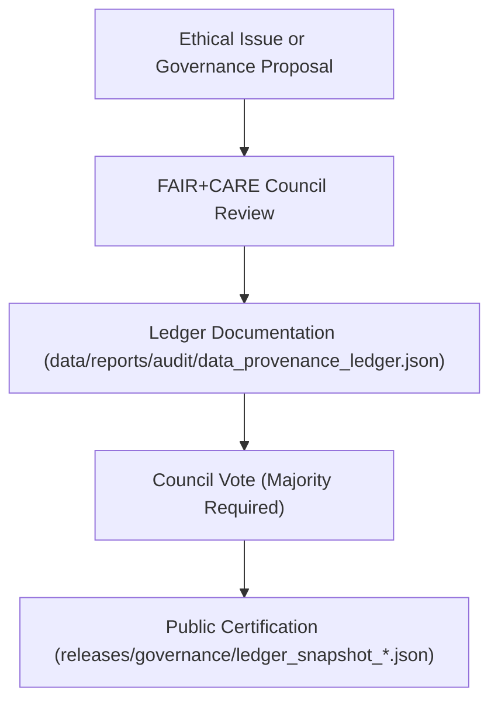

<div align="center">

# 🏛️ Kansas Frontier Matrix — **FAIR+CARE Council Charter & Governance Authority**
`docs/governance/council-charter.md`

**Purpose:**  
Defines the mission, scope, and operating procedures of the **FAIR+CARE Governance Council**, the independent oversight body responsible for ensuring ethical, transparent, and sustainable data stewardship within the Kansas Frontier Matrix (KFM).

[](../../docs/standards/faircare-validation.md)
[]()
[]()
[](../../LICENSE)

</div>

---

## 📜 Preamble

The **FAIR+CARE Council** exists to protect the ethical integrity, provenance, and societal trust of the Kansas Frontier Matrix (KFM).  
It ensures that data systems, AI outputs, and digital archives operate under transparent, equitable, and accountable governance, aligned with:
- **FAIR Principles** (Findable, Accessible, Interoperable, Reusable)
- **CARE Principles** (Collective Benefit, Authority to Control, Responsibility, Ethics)
- **ISO 37000** (Governance of Organizations)
- **ISO 14064** (Environmental Sustainability)
- **MCP-DL v6.3** (Documentation Lifecycle)

---

## 🧭 Council Mission Statement

The FAIR+CARE Council governs the ethical and procedural integrity of KFM through:
- Transparent decision-making and ledger-based accountability.  
- Protection of community interests and cultural heritage sensitivity.  
- Advocacy for sustainable, accessible, and equitable data use.  
- Review and certification of FAIR+CARE-compliant datasets and AI models.  
- Cross-institutional collaboration to align with global open science standards.  

---

## 🗂️ Structure of the Council

| Role | Responsibility | Voting Rights | Review Cycle |
|------|----------------|----------------|---------------|
| **Council Chairperson** | Leads governance sessions, issues certification decrees. | 1 | Quarterly |
| **Vice Chair (Ethics)** | Oversees FAIR+CARE compliance and ethical governance. | 1 | Quarterly |
| **Data Governance Officer** | Maintains provenance ledgers and audit reports. | 1 | Continuous |
| **AI Transparency Officer** | Validates explainability and bias detection in AI workflows. | 1 | Biannual |
| **Accessibility Advocate** | Ensures compliance with WCAG 2.2 AA and ISO 9241-210. | 1 | Continuous |
| **Sustainability Auditor** | Monitors energy efficiency and environmental compliance. | 1 | Annual |
| **Community Liaison** | Engages public stakeholders and Indigenous partnerships. | 1 | Continuous |
| **Technical Reviewer (Non-voting)** | Advises on schema, ETL, and infrastructure governance. | 0 | Continuous |

All council decisions are logged and signed in the **Governance Ledger** for permanent traceability.

---

## ⚙️ Decision-Making Framework



### Voting Requirements
- **Quorum:** Minimum 5 voting members (≥ 50% attendance).  
- **Majority Rule:** Decisions pass with 60% or higher approval.  
- **Ethics Overrides:** Chairperson and Ethics Officer may invoke immediate review if a decision risks harm or inequity.

---

## 🧩 Charter Objectives

| Objective | Description | Standard Alignment |
|------------|-------------|--------------------|
| **Transparency** | Publish all governance events in public ledgers. | FAIR+CARE / ISO 37000 |
| **Accountability** | Ensure clear provenance for decisions and certifications. | ISO 19115 / MCP-DL |
| **Equity** | Prioritize inclusivity and cultural respect in governance. | CARE Principles |
| **Sustainability** | Minimize environmental impact in governance operations. | ISO 14064 |
| **Traceability** | Maintain auditable, verifiable records of governance decisions. | Blockchain Provenance |

---

## 🧠 Ethical Governance Commitments

1. **Non-Exploitation:**  
   All data, models, and archives are managed for the collective benefit of society.

2. **Equitable Inclusion:**  
   Indigenous, rural, and marginalized perspectives are included in decision-making.

3. **Transparency by Default:**  
   Governance actions, when non-sensitive, are public and version-controlled.

4. **AI Accountability:**  
   All machine learning systems must explain decisions and undergo bias review.

5. **Sustainability Leadership:**  
   Operations must minimize energy use and adhere to open environmental reporting.

---

## ⚖️ FAIR+CARE Certification Workflow

| Step | Description | Output |
|------|--------------|--------|
| **1. Submission** | Dataset, AI model, or process proposed for certification. | Governance Proposal Log |
| **2. FAIR+CARE Review** | Council reviews ethical, accessibility, and compliance criteria. | Review Report |
| **3. Validation & Audit** | Automated governance checks executed in CI/CD pipelines. | FAIR+CARE Validation Report |
| **4. Council Decision** | Vote recorded, and certification assigned if approved. | Governance Ledger Record |
| **5. Publication** | Certified dataset included in public index. | `releases/governance/ledger_snapshot_*.json` |

All actions tracked in:  
`data/reports/audit/data_provenance_ledger.json`

---

## 🧮 Governance Ledger Schema (Simplified)

```json
{
  "governance_record_id": "2025Q4-FC-001",
  "proposal_type": "Dataset Certification",
  "submitted_by": "@kfm-data",
  "reviewed_by": ["@kfm-fair", "@kfm-ethics", "@kfm-governance"],
  "decision": "Approved",
  "vote_tally": {
    "approve": 6,
    "reject": 1,
    "abstain": 0
  },
  "certification_level": "Diamond⁹ Ω / Crown∞Ω Ultimate Certified",
  "timestamp": "2025-11-03T20:00:00Z"
}
```

---

## 🌍 Sustainability & Accountability Metrics

| Metric | Description | Target | Verified By |
|---------|--------------|---------|--------------|
| Governance Transparency | % of decisions published within 7 days | ≥ 95% | @kfm-governance |
| FAIR+CARE Certification Rate | % of datasets certified per cycle | ≥ 98% | @faircare-council |
| AI Bias Audit Completion | Frequency of explainability reviews | 100% | @kfm-ai |
| Sustainability Compliance | ISO 14064 verification per quarter | 100% | @kfm-sustainability |

Telemetry recorded in:  
`releases/v9.6.0/focus-telemetry.json`

---

## 🧾 Internal Use Citation

```text
Kansas Frontier Matrix (2025). FAIR+CARE Council Charter & Governance Authority (v9.6.0).
Defines the structure, procedures, and ethical obligations of the Kansas Frontier Matrix FAIR+CARE Council.
Ensures transparency, equity, and accountability in governance under ISO 37000 and FAIR+CARE frameworks.
```

---

## 🧾 Version Notes

| Version | Date | Notes |
|----------|------|--------|
| v9.6.0 | 2025-11-03 | Established comprehensive FAIR+CARE council charter and voting framework. |
| v9.5.0 | 2025-11-02 | Added ISO 37000 and sustainability integration. |
| v9.3.2 | 2025-10-28 | Created governance council charter under MCP-DL v6.3. |

---

<div align="center">

**Kansas Frontier Matrix** · *FAIR+CARE Governance × Ethical Oversight × Sustainable Accountability*  
[🔗 Repository](https://github.com/bartytime4life/Kansas-Frontier-Matrix) • [⚖️ Governance Docs](./README.md) • [🧭 Standards](../standards/governance/DATA-GOVERNANCE.md)

</div>

