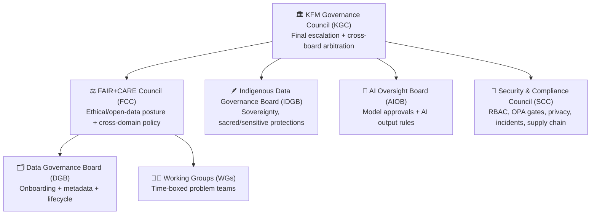

# 🏛️ KFM Council Structure

   

> **KFM governance is both human + automated.**  
> Councils and boards make policy decisions; the platform enforces them **fail‑closed** through validation gates, policy checks, and audit trails.

---

## 🎯 Purpose

This document defines the **multi-tier Governance Council structure** for **Kansas Frontier Matrix (KFM)**—the human oversight system that:
- sets policy for data + AI behavior
- resolves ethical/safety disputes
- approves high-impact changes (datasets, classifications, AI models)
- ensures decisions translate into **policy‑as‑code** and **CI/CD gates**
- keeps KFM aligned with **FAIR + CARE** (open when possible; protective when required)

---

## 🧭 Scope

This council structure applies to:
- 📦 dataset onboarding, lifecycle changes (update/retire/archive)
- 🧾 licensing + provenance requirements
- 🏷️ data classification + redaction/generalization rules
- 🤖 Focus Mode AI model approvals + output rules
- 🔐 security/compliance policy, incident response, and supply chain controls

> Not in scope: day-to-day engineering tasks (handled by maintainers/teams), unless escalated for policy impact.

---

## 🧱 Governance invariants (must not regress)

These are the “hard rails” councils protect because the platform’s trust model depends on them:

1. **Truth Path is mandatory**  
   `Raw ➜ Processed ➜ Catalog ➜ Databases ➜ API ➜ UI/AI`

2. **Provenance-first**  
   Nothing goes downstream without **STAC + DCAT + PROV** coverage.

3. **Fail‑closed by default**  
   If metadata/policy checks are missing or uncertain, **block** and fix.

4. **Classification propagation**  
   Outputs cannot be **less restricted** than inputs.

5. **Deterministic pipelines**  
   Idempotent, config-driven, logged, re-runnable.

---

## 🗺️ Council map (at a glance)



---

## 🏛️ Bodies & charters

### 1) 🏛️ KFM Governance Council (KGC)

**Role:** The top-level governance body. Owns final arbitration and cross-board alignment.

**Primary responsibilities**
- ✅ resolves conflicts between boards (e.g., openness vs. safety)
- ✅ approves governance framework changes (core standards, review gates)
- ✅ ratifies emergency actions after the fact (post-incident)
- ✅ sets annual/quarterly governance priorities (risk areas, audits, policy upgrades)

**Membership (recommended)**
- Chairs from FCC, IDGB, AIOB, SCC
- KFM maintainers (representing implementation reality)
- Optional: community liaison / stakeholder representative (non-voting advisory)

**Authority**
- Final approval on escalations
- Can **freeze releases** for governance reasons (e.g., policy regression)

---

### 2) ⚖️ FAIR+CARE Council (FCC)

**Role:** The normative council ensuring KFM remains:
- **Findable/Accessible/Interoperable/Reusable** (FAIR)
- and governed for **Collective benefit/Authority to control/Responsibility/Ethics** (CARE)

**Primary responsibilities**
- ✅ defines open-by-default posture and exceptions
- ✅ sets redaction/generalization expectations for sensitive geographies
- ✅ maintains ethics alignment (in coordination with AIOB + IDGB)
- ✅ updates governance guidelines that automated gates implement

**Typical decisions**
- “Should this data be public by default or restricted?”
- “What generalization level is acceptable for a public map layer?”
- “What provenance completeness is required for publishable outputs?”

---

### 3) 🗂️ Data Governance Board (DGB)

**Role:** Operational governance board focused on **data lifecycle** and **catalog integrity**.

**Primary responsibilities**
- ✅ approves new datasets into KFM (quality, openness, licensing)
- ✅ defines/maintains metadata requirements (STAC/DCAT/PROV expectations)
- ✅ coordinates with data owners/stewards for updates and corrections
- ✅ manages lifecycle: archive/replace datasets without deleting history

**Membership (recommended)**
- Representatives from major stakeholder agencies + State Chief Data Officer (or equivalent)
- KFM data steward(s) and catalog steward(s)
- GIS steward(s) as needed

**Authority**
- Can block dataset publication if provenance, license, or classification is insufficient.
- Can require “fix-forward” before inclusion (metadata completion, schema mapping, etc.).

---

### 4) 🪶 Indigenous Data Governance Board (IDGB)

**Role:** Sovereignty-first oversight for Indigenous data, cultural sensitivity, and community-controlled labeling/sharing.

**Primary responsibilities**
- ✅ defines Indigenous Data Sovereignty policy enforcement requirements
- ✅ approves labels/classification rules for Indigenous-contributed datasets
- ✅ determines what must be hidden, generalized, or restricted (sacred lands, precise sites, culturally sensitive narratives)
- ✅ ensures CARE principles are honored in UI + AI outputs (not just in storage)

**Authority**
- **Veto power** on releases involving Indigenous community-governed data.
- Can require additional safeguards (aggregation thresholds, coordinate rounding, access constraints).

---

### 5) 🤖 AI Oversight Board (AIOB)

**Role:** Oversees Focus Mode AI behavior, models, prompts, evaluation, and harm prevention.

**Primary responsibilities**
- ✅ approves AI model introductions/changes (including local model policy)
- ✅ enforces “citations required” behavior and disallowed content rules
- ✅ reviews AI incidents (hallucination with impact, disclosure risk, policy bypass attempts)
- ✅ requires auditability: model versioning + retrieved evidence + policy decision logging

**Membership (recommended)**
- KFM maintainers + retrieval/search owner
- Data governance representative (FCC or DGB liaison)
- Security liaison (SCC)
- Optional: domain expert(s) for high-risk topics

**Authority**
- Can pause/disable AI features for safety (“kill switch” posture) until remediations land.

---

### 6) 🔐 Security & Compliance Council (SCC)

**Role:** Cross-cutting security, privacy, and compliance enforcement.

**Primary responsibilities**
- ✅ defines RBAC roles and access policy requirements
- ✅ owns runtime policy enforcement expectations (OPA gating)
- ✅ governs privacy protections (query auditing, inference risk controls, suppression thresholds)
- ✅ sets supply chain security expectations (SBOM, provenance, signing/verification)
- ✅ manages incident response playbooks and post-mortems

**Authority**
- Can block releases if security posture regresses (e.g., missing policy checks, audit gaps).
- Can require reclassification and cache purges during incidents.

---

### 7) 🧑‍🔬 Working Groups (WGs)

**Role:** Temporary teams spun up for specific governance problems.

**Examples**
- “Sensitive coordinates policy WG”
- “Model card + evaluation standards WG”
- “Dataset deprecation + archival protocol WG”

**Rules**
- Must be time-boxed (recommended: 2–6 weeks)
- Must ship an artifact: proposal + decision record + implementation PR(s)

---

## 🧾 Decision types & routing

| Decision Type | Primary Board | Escalation |
|---|---|---|
| Add dataset / retire dataset | 🗂️ DGB | ⚖️ FCC → 🏛️ KGC |
| License exception / restricted terms | 🗂️ DGB + 🔐 SCC | 🏛️ KGC |
| Sensitive location handling (rounding, aggregation, hiding) | ⚖️ FCC + 🔐 SCC | 🏛️ KGC |
| Indigenous governed data rules | 🪶 IDGB | 🏛️ KGC (only for arbitration; IDGB veto stands) |
| New AI model / major AI behavior change | 🤖 AIOB + 🔐 SCC | 🏛️ KGC |
| Policy gates changes (CI or runtime) | 🔐 SCC + relevant board | 🏛️ KGC |
| Emergency incident actions | 🔐 SCC | 🏛️ KGC ratification |

---

## 🧰 Decision workflow (policy‑as‑code)

**Goal:** every governance decision becomes **enforceable** and **auditable**.

1) **Intake** 📨  
   - Open a governance issue (or PR) describing the request and impact
   - Tag the likely board (DGB / FCC / IDGB / AIOB / SCC)

2) **Triage** 🧭  
   - Confirm decision owner board
   - Assign reviewers + set risk level (low/med/high)

3) **Evidence & checks** 🧾  
   - Data proposals must include: source manifest, license, classification, metadata plan
   - AI proposals must include: model card basics, evaluation notes, policy expectations

4) **Deliberation** 🗣️  
   - Async review in GitHub is preferred; meetings for high‑impact decisions

5) **Decision** ✅  
   - Vote/consensus per quorum rules (below)
   - Identify implementation owner(s)

6) **Record** 🧷  
   - Write a **Governance Decision Record** (GDR) stored as **JSON‑LD**
   - Link the decision record to the PR(s) implementing enforcement

7) **Implement** 🛠️  
   - Update policy-as-code (OPA rules / config)
   - Update CI gates (schema checks, metadata validation, content rules)
   - Update docs + runbooks + templates
   - Add/adjust tests to prevent regression

8) **Verify** 🧪  
   - CI must pass; runtime checks must be demonstrably enforced
   - Fail‑closed behavior confirmed (missing policy/metadata blocks)

9) **Communicate** 📣  
   - Post a short public summary (unless sensitive)
   - If sensitive: publish a redacted summary + rationale

---

## 🗳️ Quorum, voting, and veto

**Quorum (recommended)**
- ≥ 50% voting members present **including the Chair** (or delegate)

**Voting (recommended defaults)**
- Standard decisions: simple majority
- High-impact decisions: 2/3 majority or explicit consensus (board-defined)

**Veto / hard-stop rules**
- 🪶 **IDGB** may veto decisions involving Indigenous governed data.
- 🔐 **SCC** may hard-stop releases for security/privacy regressions.
- 🤖 **AIOB** may pause AI features if safety/auditability is compromised.

**Emergency actions**
- SCC (or AIOB for AI issues) may apply temporary blocks/rollbacks
- KGC must ratify with a decision record within a defined window (recommended: 7 days)

---

## 🧑‍🤝‍🧑 RACI cheat‑sheet

| Action | Responsible (R) | Accountable (A) | Consulted (C) | Informed (I) |
|---|---|---|---|---|
| Add a new dataset | Data stewards + pipelines owner | 🗂️ DGB | ⚖️ FCC, 🔐 SCC (if sensitive) | 🏛️ KGC |
| Reclassify a dataset | Data stewards | 🔐 SCC | 🗂️ DGB, ⚖️ FCC | 🏛️ KGC |
| Approve public release of sensitive geography | Implementation owner | ⚖️ FCC | 🔐 SCC, 🪶 IDGB (if relevant) | 🏛️ KGC |
| Approve new AI model | AI owner | 🤖 AIOB | 🔐 SCC, ⚖️ FCC | 🏛️ KGC |
| Change runtime policy gates | Implementation owner | 🔐 SCC | All relevant boards | 🏛️ KGC |
| Incident response | On-call/owners | 🔐 SCC | 🤖 AIOB (if AI), ⚖️ FCC | 🏛️ KGC |

---

## 🗓️ Cadence & artifacts

**Recommended cadence**
- 🏛️ KGC: monthly + ad hoc escalations
- ⚖️ FCC: monthly or biweekly during active policy work
- 🗂️ DGB: biweekly (dataset intake is continuous)
- 🤖 AIOB: monthly + incident-driven
- 🔐 SCC: monthly + incident-driven
- 🪶 IDGB: community-defined cadence (do not impose an external schedule)

**Artifacts produced**
- 📄 governance decision records (JSON‑LD)
- 🧾 meeting notes (public by default; redacted when necessary)
- ✅ updated review gates & checklists
- 🧪 new/updated CI checks and runtime enforcement rules
- 📦 dataset lifecycle decisions (archive/replace notes, never silent deletion)

---

## 📚 Records & transparency

KFM is designed so decisions can be audited:
- **Policies are versioned** and their versions should be included in logs.
- **Governing decisions** (approvals, denials, exceptions) are documented.
- **AI outputs** and policy decisions should be logged in an append-only manner.

### 🧷 Governance Decision Record (JSON‑LD) skeleton

> Store as `docs/governance/decisions/<YYYY>/<YYYY-MM-DD>__<slug>.jsonld` (recommended).

```json
{
  "@context": {
    "schema": "https://schema.org/",
    "prov": "http://www.w3.org/ns/prov#"
  },
  "@type": "schema:Decision",
  "schema:identifier": "KFM-GDR-2026-02-04-0001",
  "schema:name": "Adopt coordinate generalization for sensitive site layer",
  "schema:dateCreated": "2026-02-04",
  "schema:description": "Decision summary in plain language.",
  "schema:decisionOutcome": "approved",
  "schema:accountablePerson": "FCC Chair",
  "schema:contributor": [
    "SCC Liaison",
    "DGB Liaison"
  ],
  "schema:hasPart": [
    {
      "@type": "schema:CreativeWork",
      "schema:name": "Implementation PR",
      "schema:url": "https://github.com/<org>/<repo>/pull/<id>"
    }
  ],
  "prov:wasInformedBy": [
    {
      "@type": "schema:CreativeWork",
      "schema:name": "Dataset STAC Collection",
      "schema:url": "data/catalog/stac/collections/<collection>.json"
    },
    {
      "@type": "schema:CreativeWork",
      "schema:name": "PROV bundle",
      "schema:url": "data/provenance/<run-or-dataset>.json"
    }
  ],
  "schema:comment": [
    "Rationale: why this was chosen.",
    "Risks considered: what could go wrong.",
    "Mitigations: how policy gates enforce it."
  ]
}
```

---

## 🔗 Related governance docs

- 📄 `docs/governance/ROOT_GOVERNANCE.md` — governance overview + principles
- 📄 `docs/governance/ETHICS.md` — ethics policy, harm prevention, community trust
- 📄 `docs/governance/SOVEREIGNTY.md` — sovereignty rules and escalation boundaries
- 📄 `docs/governance/REVIEW_GATES.md` — what triggers review + required checklists
- 📄 `docs/glossary.md` — shared definitions

---

## ✍️ How to change this document

Changes to council structure must be treated as governance-level changes:
- require review by **KGC** and affected boards
- require an accompanying **decision record** (JSON‑LD)
- must include updates to **review gates** and **policy enforcement** if applicable

---

## 🕰️ Version history

- **2026-02-04** — v1.0 (draft): initial multi-tier council structure (KGC + FCC + DGB + IDGB + AIOB + SCC)

