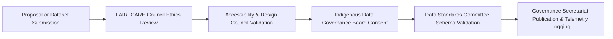
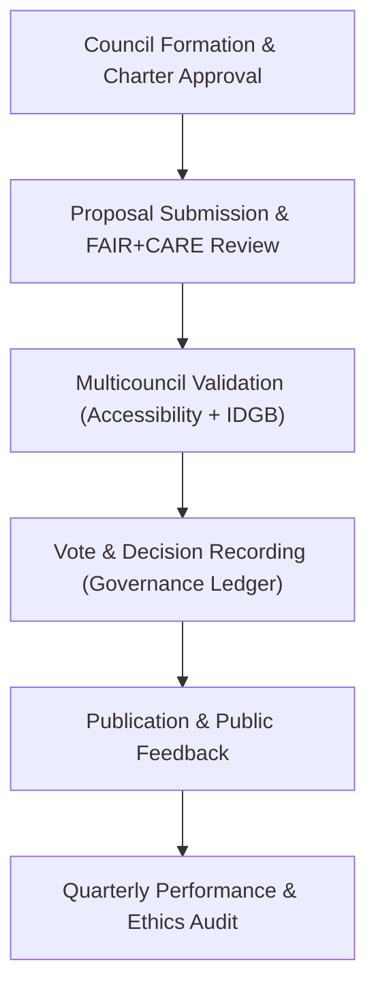

<div align="center">

# 🏛️ **Kansas Frontier Matrix — Governance Council Structure & Decision Framework**
`docs/governance/council-structure.md`

**Purpose:**  
Define the **organizational hierarchy, decision-making procedures, and representation model** for the **Kansas Frontier Matrix (KFM) Governance Councils** under the **FAIR+CARE ethical framework** and **Master Coder Protocol (MCP-DL v6.3)** standards.

[](../README.md)
[](../standards/faircare.md)
[](../../LICENSE)
[](../../releases/v10.0.0/manifest.zip)

</div>

---

## 📘 Overview

The **Kansas Frontier Matrix Governance Council Structure** defines the bodies responsible for **ethical decision-making, technical validation, and public accountability** within the KFM system.  
This framework ensures that leadership and operations uphold **FAIR+CARE**, **ISO 26000**, and **Master Coder Protocol (MCP)** mandates for transparency, equity, and sustainability.

Each council operates autonomously but collaborates through shared governance charters and cross-review procedures to maintain trust and reproducibility across all system layers.

---

## 🗂️ Directory Context

```
docs/governance/
├── README.md
├── council-structure.md              # This file
├── community-participation.md
├── validation-pipelines.md
├── transparency-reports.md
└── risk-and-ethics.md
```

---

## 🧭 Governance Hierarchy

| Council / Committee | Core Function | Oversight Focus | Documentation |
|---|---|---|---|
| **FAIR+CARE Governance Council (FCGC)** | Ethical, cultural, and consent validation for all KFM outputs. | AI & Data Ethics | `docs/data/governance/review-council-minutes.md` |
| **Data Standards Committee (DSC)** | Schema, data contracts, and metadata enforcement. | Provenance & Interoperability | `docs/data/contracts/README.md` |
| **Indigenous Data Governance Board (IDGB)** | Tribal sovereignty, consent validation, and Indigenous representation. | Cultural Stewardship | `docs/data/governance/indigenous-data-protocol.md` |
| **Accessibility & Design Council (ADC)** | UI/UX accessibility, sustainability, and inclusivity reviews. | WCAG 2.1 AA Compliance | `docs/design/README.md` |
| **AI Systems Oversight Board (AIOB)** | AI ethics, model transparency, and explainability auditing. | Focus Mode & ML Pipelines | `docs/ai/governance/README.md` |
| **Governance Secretariat (GSEC)** | Records decisions, manages charters, and publishes transparency reports. | Accountability & Public Access | `docs/data/governance/review-council-minutes.md` |

All councils report to the **FAIR+CARE Governance Secretariat**, which maintains synchronization of governance documentation and public records.

---

## 🧱 Council Composition

| Role | Description | Appointed By | Term |
|---|---|---|---|
| **Chairperson** | Leads council meetings, ratifies decisions, and ensures procedural fairness. | Governance Secretariat | 1 year |
| **Vice Chairperson** | Assists Chair and manages cross-council coordination. | FAIR+CARE Council | 1 year |
| **Technical Lead** | Oversees data, AI, or system-specific governance. | Data Standards Committee | 2 years |
| **Ethics Officer** | Conducts ethical impact and cultural representation reviews. | FAIR+CARE Council | 2 years |
| **Indigenous Representative** | Tribal appointee ensuring cultural and consent compliance. | IDGB | 2 years |
| **Accessibility Advocate** | Ensures equitable UX and A11y standards. | Accessibility & Design Council | 1 year |
| **Public Observer** | Citizen participant representing transparency interests. | Community Portal | Rotating |

Each council must maintain **diversity and equitable representation**, with at least **one Indigenous and one accessibility representative** present at every voting session.

---

## ⚖️ Decision-Making Process

| Step | Action | Responsible Body |
|---|---|---|
| 1️⃣ | Proposal submission (data, AI, or design update). | Originating Team |
| 2️⃣ | FAIR+CARE ethical review and compliance scoring. | FAIR+CARE Council |
| 3️⃣ | Accessibility and inclusivity audit. | Accessibility Council |
| 4️⃣ | Cultural and Indigenous consent validation. | IDGB |
| 5️⃣ | Final approval and publication. | Governance Secretariat |
| 6️⃣ | Logging and telemetry entry in manifest. | FAIR+CARE Secretariat |

---

### 🧩 Voting Procedures

| Parameter | Description |
|---|---|
| **Voting Quorum** | Minimum of 60% attendance required for formal votes. |
| **Majority Rule** | Simple majority (51%) required for general decisions. |
| **Ethical Unanimity** | Cultural and CARE-related approvals require unanimous consent from IDGB members. |
| **Emergency Protocol** | Chair and Ethics Officer may issue provisional decisions subject to retroactive review. |
| **Conflict of Interest** | Members with personal or institutional stake must recuse themselves from voting. |

Votes are logged in JSON-LD format and archived in `docs/data/governance/review-council-minutes.md`.

---

### 🗳️ Example Decision Record (JSON-LD)

```json
{
  "@context": "https://schema.org/",
  "@type": "CreativeWork",
  "identifier": "FCGC-2025-Q4-Decision-05",
  "name": "Approval of Focus Mode v2 Narrative Datasets",
  "author": {
    "name": "FAIR+CARE Governance Council",
    "role": "approver"
  },
  "decision": "approved",
  "datePublished": "2025-11-08",
  "votes": {
    "for": 8,
    "against": 0,
    "abstain": 1
  },
  "ethics": {
    "consent_validated": true,
    "care_principles_passed": true
  },
  "rationale": "AI narratives verified for ethical tone, consent linkage, and provenance completeness."
}
```

---

## 🧠 Council Collaboration Workflow



**Cross-Council Principles**
- All reviews use **shared telemetry schemas**.  
- No decision is final without recorded **consent metadata**.  
- AI and data audits undergo both **technical and ethical scrutiny**.  

---

## 🧾 Council Charter Summary

| Charter | Objective | Reference |
|---|---|---|
| **FAIR+CARE Governance Charter** | Establishes ethical and procedural rules for all governance bodies. | `docs/data/governance/council-charter.md` |
| **Indigenous Protocol Charter** | Defines IDGB review and consent validation rules. | `docs/data/governance/indigenous-data-protocol.md` |
| **Accessibility & Inclusion Charter** | Aligns all UI and UX development with WCAG and ISO accessibility frameworks. | `docs/accessibility/README.md` |
| **AI Oversight Charter** | Manages transparency and accountability of ML systems and Focus Mode AI. | `docs/ai/governance/README.md` |

---

## 📊 Governance Performance Metrics

| Metric | Target | Verified By |
|---|---|---|
| **Council Attendance Rate** | ≥ 75% | Governance Secretariat |
| **Ethical Decision Turnaround** | ≤ 30 days | FAIR+CARE Council |
| **Consent Review Compliance** | 100% (for cultural data) | IDGB |
| **Accessibility Audit Completion** | 100% per release | Accessibility Council |
| **Transparency Index** | ≥ 90% | Public Governance Dashboard |

---

## 🧮 Governance Lifecycle



Governance is a **recursive system** of ethical checks and transparency, continuously improving based on community and institutional feedback.

---

## 🕰️ Version History

| Version | Date | Author | Summary |
|---|---|---|---|
| v10.0.0 | 2025-11-10 | FAIR+CARE Governance Secretariat | Established council hierarchy, roles, voting framework, and ethical collaboration structure for cross-domain decision-making in the Kansas Frontier Matrix. |

---

<div align="center">

**© 2025 Kansas Frontier Matrix — CC-BY 4.0**  
Governed under **Master Coder Protocol v6.3** · Certified by **FAIR+CARE Governance Council** · Diamond⁹ Ω / Crown∞Ω Ultimate Certified  
[⬅ Back to Governance Index](README.md) · [Validation Pipelines →](validation-pipelines.md)

</div>