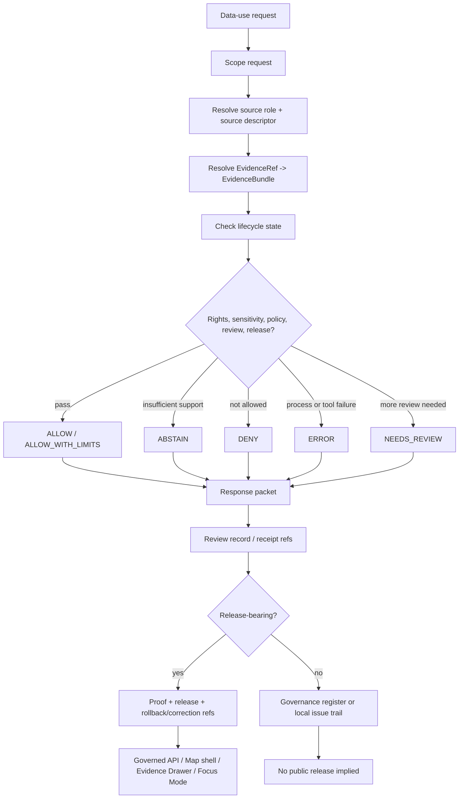

<!-- [KFM_META_BLOCK_V2]
doc_id: kfm://doc/NEEDS-VERIFICATION-data-use-readme
title: Data Use Governance
repo_path: docs/governance/data-use/README.md
type: standard
version: v2-draft-rebuild
status: draft
owners: NEEDS_VERIFICATION
created: 2026-05-02
updated: 2026-05-06
policy_label: NEEDS_VERIFICATION
source_basis:
  - attached:data_use/README.md draft
  - attached:data_use_response/README.md draft
  - repo:docs/governance/data-use/README.md
  - repo:docs/governance/README.md
  - repo:docs/sources/README.md
  - repo:data/registry/README.md
  - repo:data/catalog/README.md
  - repo:data/receipts/README.md
  - repo:contracts/README.md
  - repo:schemas/README.md
  - repo:tools/soilgrids/soilgrids_data_use_response.py
related:
  - ../README.md
  - ../../README.md
  - ../../sources/README.md
  - ../../runbooks/README.md
  - ../../../README.md
  - ../../../data/README.md
  - ../../../data/registry/README.md
  - ../../../data/catalog/README.md
  - ../../../data/receipts/README.md
  - ../../../data/proofs/README.md
  - ../../../contracts/README.md
  - ../../../schemas/README.md
  - ../../../policy/README.md
  - ../../../tests/README.md
  - ../../../release/README.md
  - ../../../tools/soilgrids/soilgrids_data_use_response.py
  - ../../../fixtures/data-use/valid/data_use_spec_example.json
tags:
  - kfm
  - data-use
  - data-use-response
  - governance
  - evidence
  - rights
  - sensitivity
  - publication
  - correction
  - rollback
notes:
  - Rebuilt from the prior data_use README draft and Data Use Response README draft.
  - Current repo placement is docs/governance/data-use/README.md; the older root-level data_use/ and data_use_response/ path targets are superseded by this governance-documentation placement unless an ADR says otherwise.
  - This README is a governance documentation surface. It is not a data lifecycle zone, source registry, executable schema home, policy engine, response cache, receipt store, proof store, release manifest, or runtime API.
  - Owner, policy label, doc_id, optional child directories, response packet schema, generic response packet tests, and cross-lane enforcement remain NEEDS_VERIFICATION.
[/KFM_META_BLOCK_V2] -->

<a id="top"></a>

# Data Use Governance

Governance and response-packet guidance for deciding, documenting, correcting, and withdrawing KFM data-use decisions without bypassing evidence, policy, review, release, or rollback gates.

> [!IMPORTANT]
> **Status:** `draft` / `experimental`  
> **Owners:** `NEEDS_VERIFICATION`  
> **Path:** `docs/governance/data-use/README.md`  
> **Truth posture:** `CONFIRMED repo path + doctrine` / `PROPOSED generic packet conventions` / `NEEDS_VERIFICATION enforcement`  
> **Repo fit:** human-facing governance documentation under `docs/governance/`; not a root-level `data_use/` directory and not a `data_use_response/` response cache.  
>
> 
> 
> 
> 
> 
> 
>
> **Quick jumps:** [Scope](#scope) · [Repo fit](#repo-fit) · [Accepted inputs](#accepted-inputs) · [Exclusions](#exclusions) · [Directory map](#directory-map) · [Operating flow](#operating-flow) · [Decision outcomes](#decision-outcomes) · [Minimum packet](#minimum-data-use-packet) · [Reviewer quickstart](#reviewer-quickstart) · [Policy and AI boundary](#policy-safety-and-ai-boundary) · [Repo-observed signals](#repo-observed-implementation-signals) · [Definition of done](#definition-of-done) · [Rollback](#rollback-correction-and-withdrawal) · [FAQ](#faq)

---

## Scope

This directory defines how KFM reviewers and maintainers decide whether evidence, datasets, layers, exports, screenshots, story text, map popups, Focus Mode answers, API responses, dashboards, or derived artifacts may be used.

It also defines the **human-reviewable response packet** pattern for requests to use, reuse, cite, export, publish, restrict, deny, abstain from, correct, withdraw, or supersede KFM data and derived artifacts.

This README intentionally merges two earlier draft concepts:

| Prior draft concept | Rebuilt placement | Current handling |
|---|---|---|
| `data_use/README.md` | `docs/governance/data-use/README.md` | Retained as data-use decision guidance. |
| `data_use_response/README.md` | `docs/governance/data-use/README.md` plus optional packet templates | Retained as response-packet and disposition guidance. |

The operating law remains:

```text
RAW -> WORK / QUARANTINE -> PROCESSED -> CATALOG / TRIPLET -> PUBLISHED
```

Publication is a governed state transition. A public map layer, API response, Focus Mode answer, story node, export, screenshot, dashboard, or narrative claim is acceptable only when it remains traceable to evidence, policy, review, and release state.

> [!NOTE]
> This README may help a reviewer decide what must be checked. It does not itself approve a source, validate an artifact, satisfy policy, create a release, prove a claim, or authorize public exposure.

[Back to top](#top)

---

## Repo fit

Directory Rules place human-facing governance guidance under `docs/`, while data lifecycle records, schemas, contracts, policy, tests, release objects, and proof artifacts remain in their responsibility roots. For that reason, this rebuild keeps data-use governance under `docs/governance/data-use/` and does **not** create root-level `data_use/` or `data_use_response/` folders.

| Relation | Surface | Role | Status |
|---|---|---|---|
| Current document | `docs/governance/data-use/README.md` | Human-facing data-use and response-packet governance | **CONFIRMED path / draft content** |
| Governance parent | [`../README.md`](../README.md) | Governance index, ethics, sovereignty, consent, and review posture | **CONFIRMED parent lane / verify links** |
| Docs control plane | [`../../README.md`](../../README.md) | Human-facing documentation hub | **NEEDS VERIFICATION for current branch content** |
| Source admission | [`../../sources/README.md`](../../sources/README.md) | Source role, source admission, source refresh, source burden | **CONFIRMED adjacent doctrine** |
| Runbooks | [`../../runbooks/README.md`](../../runbooks/README.md) | Operator playbooks for publication, correction, stale projection, rollback, validation | **CONFIRMED adjacent doctrine** |
| Root orientation | [`../../../README.md`](../../../README.md) | KFM identity, lifecycle law, responsibility roots, trust posture | **CONFIRMED repo orientation** |
| Data lifecycle | [`../../../data/README.md`](../../../data/README.md) | Lifecycle root; currently synthetic-fixture posture needs verification before data-use claims | **CONFIRMED minimal README / NEEDS VERIFICATION depth** |
| Source descriptors | [`../../../data/registry/README.md`](../../../data/registry/README.md) | Source admission metadata, source role, rights, cadence, and registry state | **CONFIRMED adjacent doctrine** |
| Catalog closure | [`../../../data/catalog/README.md`](../../../data/catalog/README.md) | DCAT/STAC/PROV catalog seam; not proof or publication | **CONFIRMED adjacent doctrine** |
| Process memory | [`../../../data/receipts/README.md`](../../../data/receipts/README.md) | Run, validation, ingest, watcher, promotion-process receipts | **CONFIRMED adjacent doctrine** |
| Release proof | [`../../../data/proofs/README.md`](../../../data/proofs/README.md) | Release proof lane; current README says synthetic fixtures only | **CONFIRMED minimal README / NEEDS VERIFICATION depth** |
| Semantic contracts | [`../../../contracts/README.md`](../../../contracts/README.md) | Object meaning, field intent, lifecycle semantics, compatibility | **CONFIRMED adjacent doctrine** |
| Machine schemas | [`../../../schemas/README.md`](../../../schemas/README.md) | Machine-checkable shapes; starter schema maturity | **CONFIRMED minimal README / NEEDS VERIFICATION depth** |
| Policy | [`../../../policy/README.md`](../../../policy/README.md) | Executable or documented deny/allow/abstain obligations | **CONFIRMED minimal README / NEEDS VERIFICATION depth** |
| Tests | [`../../../tests/README.md`](../../../tests/README.md) | Contract, schema, policy, fixture, and runtime-proof checks | **CONFIRMED minimal README / NEEDS VERIFICATION depth** |
| Release operations | [`../../../release/README.md`](../../../release/README.md) | Release manifests, decisions, rollback, correction, withdrawal | **CONFIRMED minimal README / NEEDS VERIFICATION depth** |
| Tool-specific implementation | [`../../../tools/soilgrids/soilgrids_data_use_response.py`](../../../tools/soilgrids/soilgrids_data_use_response.py) | SoilGrids data-use response generator and local artifacts | **CONFIRMED tool surface / domain-specific** |

### Authority statement

This README may be authoritative for:

- data-use triage questions;
- response-packet content expectations;
- citation and EvidenceBundle expectations;
- common deny, abstain, review, withdrawal, and supersession cases;
- reviewer checklists and anti-patterns;
- routing to stronger authority surfaces.

This README is **not** authoritative for:

- raw source meaning;
- source descriptor state;
- machine schema shape;
- executable policy;
- release state;
- source activation;
- dataset licensing;
- sensitive-data clearance;
- route behavior;
- runtime model behavior;
- proof-pack validity.

[Back to top](#top)

---

## Accepted inputs

Only store material here when it is safe for the docs/governance policy posture and does not duplicate stronger lifecycle, proof, schema, policy, or runtime surfaces.

| Accepted input | What it should contain | Notes |
|---|---|---|
| Data-use guidance | How to decide whether a claim, layer, export, screenshot, answer, dashboard, or story can be used | Must preserve cite-or-abstain and fail-closed behavior. |
| Response packet templates | Front matter, required fields, disposition vocabulary, review questions, correction/rollback references | Templates are guidance, not proof objects. |
| Reviewed request summaries | Minimized, public-safe summaries of requests and decision scope | Avoid raw request payloads, secrets, private facts, and sensitive coordinates. |
| Draft response packets | Proposed disposition, evidence refs, policy refs, review notes, blockers, and open questions | Mark as `draft` until issued. |
| Issued response packets | Final disposition and support appropriate to the request significance | Must link to evidence, policy, review, release, and rollback/correction state when relevant. |
| Denial or abstention records | Clear reasons why KFM denied or abstained | Negative outcomes are first-class trust objects. |
| Withdrawal or supersession notes | What changed, what was replaced, why, and what rollback/correction object applies | Do not silently overwrite issued decisions. |
| Domain addenda | Lane-specific use burdens: hydrology, hazards, archaeology, flora/fauna, people/DNA/land, infrastructure, etc. | Domain steward review required when consequence or sensitivity is material. |
| Illustrative examples | Pass, abstain, deny, restricted-use, correction, and withdrawal examples | Mark examples as illustrative unless backed by checked fixtures. |

[Back to top](#top)

---

## Exclusions

Do not store these in `docs/governance/data-use/`.

| Do not place here | Why not | Expected home |
|---|---|---|
| RAW source payloads | Immutable source captures are lifecycle data, not governance docs | `../../../data/raw/` or repo-native source intake |
| WORK or QUARANTINE artifacts | They are not public or normal-use surfaces | `../../../data/work/`, `../../../data/quarantine/` |
| PROCESSED artifacts | They are candidate data assets, not guidance | `../../../data/processed/` |
| Catalog records | Catalog describes metadata and lineage | `../../../data/catalog/` |
| Receipts | Receipts preserve process memory | `../../../data/receipts/` |
| Proof packs, EvidenceBundles, release manifests, attestations | Proof and release objects carry stronger trust burden | `../../../data/proofs/`, `../../../release/`, or repo-native proof lane |
| Source descriptor instances | Registry records govern source admission | `../../../data/registry/` |
| Machine schemas | Schemas enforce machine shape | `../../../schemas/` |
| Semantic contracts | Contracts define object meaning | `../../../contracts/` |
| Executable policy | Policy owns allow/deny/abstain obligations | `../../../policy/` |
| Connector code, watchers, fetch scripts | Guidance must not activate sources | `../../../connectors/`, `../../../pipelines/`, `../../../tools/`, `../../../packages/` |
| Runtime API caches or generated responses | Response caches can become hidden truth surfaces | Governed runtime or receipt/output locations, if approved |
| Secrets, tokens, private URLs, sensitive exact locations | Governance docs must remain review-safe | Secret manager, restricted steward path, quarantine, or redacted mirrors |
| AI-generated summaries without evidence closure | Generated language is interpretive, not root truth | Governed runtime envelopes with citation validation |

> [!CAUTION]
> A source being visible, queryable, or visually compelling does not make it public-safe or claim-ready. Unknown rights, unclear source role, unresolved sensitivity, missing EvidenceBundle, missing review, or missing release state should produce **ABSTAIN**, **DENY**, or **NEEDS_REVIEW**, not polished prose.

[Back to top](#top)

---

## Directory map

### Current confirmed document

```text
docs/governance/data-use/
└── README.md
```

### Optional governance-documentation growth shape

The following child folders are **PROPOSED**. Add them only if maintainers want durable human-reviewable docs in this lane and only after checking adjacent docs, registries, receipts, and proof homes.

```text
docs/governance/data-use/
├── README.md
├── templates/                 # PROPOSED: packet templates, not schemas
├── examples/                  # PROPOSED: illustrative pass / abstain / deny examples
├── response-packets/          # PROPOSED: human-review packets safe for docs
├── registers/                 # PROPOSED: human-readable register summaries only
└── domain-addenda/            # PROPOSED: lane-specific use guidance
```

### Storage boundary

| Material | Preferred placement |
|---|---|
| Human review packet | `docs/governance/data-use/response-packets/` only if safe and approved; otherwise issue/review system |
| Emitted tool response packet | Tool output root or `data/receipts/`-like process-memory surface |
| Response ledger | `data/receipts/`, tool output ledger, or approved data-use response artifact lane |
| EvidenceBundle / ReleaseManifest / ProofPack | Proof/release lanes, not docs |
| Valid / invalid fixtures | `fixtures/` or `tests/fixtures/`, not docs |
| Executable schema | `schemas/` or chosen schema home |
| Policy rule | `policy/` |

[Back to top](#top)

---

## Operating flow



The response packet is a decision record, not the underlying evidence. It should point to stronger objects instead of copying or replacing them.

[Back to top](#top)

---

## Decision outcomes

Use these human-review dispositions for data-use packets.

| Disposition | Meaning | Public posture |
|---|---|---|
| `ALLOW` | The proposed use is supported, policy-safe, reviewed, and release-compatible for the requested scope | May proceed within stated scope and obligations |
| `ALLOW_WITH_LIMITS` | Use is allowed only with conditions such as attribution, generalization, role-limited access, embargo, citation wording, or redaction | Conditions must be visible in the packet |
| `DENY` | Use is not allowed because rights, sensitivity, policy, source role, evidence, review, or release state blocks it | Do not proceed; record reason |
| `ABSTAIN` | KFM cannot answer or support the requested claim with current evidence | Do not fill gap with plausible prose |
| `NEEDS_REVIEW` | A steward, maintainer, domain reviewer, rights reviewer, or policy reviewer must decide before use | No public release implied |
| `ERROR` | A tool, validation, resolution, source, or process failure prevents reliable decision | Fix process before deciding |
| `WITHDRAWN` | A prior response is pulled back | Preserve withdrawal reason and prior response link |
| `SUPERSEDED` | A prior response is replaced by a later response | Preserve successor, reason, and correction lineage |

### Runtime vocabulary bridge

Focus Mode, governed API, and tool-specific runtime surfaces may use finite runtime outcomes such as `ANSWER`, `ABSTAIN`, `DENY`, and `ERROR`. This README’s human dispositions should map to runtime envelopes, not override them.

Tool-specific data-use response implementations may use narrower response types such as `notify_consumer`, `internal_review`, `recommend_policy_change`, `recommend_enforcement_change`, `recommend_trust_status_review`, `plan_only`, and `blocked`. Do not force generic docs and tool-specific schemas to converge silently; reconcile them through schemas, tests, and an ADR or implementation note.

[Back to top](#top)

---

## Minimum data-use packet

Before approving consequential use, reviewers should be able to inspect this packet or a repo-native equivalent.

| Packet item | Purpose | Required before public or semi-public use? |
|---|---|---|
| `response_id` | Stable identifier for the packet | Yes |
| `status` | draft, review, issued, withdrawn, superseded | Yes |
| `disposition` | `ALLOW`, `ALLOW_WITH_LIMITS`, `DENY`, `ABSTAIN`, `NEEDS_REVIEW`, `ERROR`, `WITHDRAWN`, or `SUPERSEDED` | Yes |
| Request summary | Minimized description of proposed use | Yes |
| Requester / audience class | Maintainer, steward, public user, partner, classroom, internal, unknown | Where relevant |
| Use scope | Claim, export, API response, map layer, story, screenshot, AI answer, dashboard, research reuse, correction | Yes |
| Source identity | Source or dataset family involved | Yes |
| Source role summary | Observation, regulatory, modeled, derived, documentary, community, operational, authority crosswalk, etc. | Yes |
| EvidenceRef(s) | Stable evidence pointers | Yes when claim-like |
| EvidenceBundle ref(s) | Resolved support, restrictions, provenance, and citation basis | Yes when claim-like |
| Spatial scope | Place, geometry support, redaction/generalization, uncertainty | Yes when spatial |
| Temporal scope | Observation time, valid time, issue time, retrieval time, release time, modeled period | Yes when temporal |
| Rights basis | License, public-domain basis, terms, attribution, embargo, or UNKNOWN | Yes |
| Sensitivity posture | Public, restricted, generalized, redacted, sensitive-location, cultural, living-person, DNA, archaeological, ecological, infrastructure, or UNKNOWN | Yes |
| Policy decision/ref | Allow/deny/abstain/hold/error reason and obligations | Yes |
| Review state | Reviewer, steward, maintainer, or owner action appropriate to consequence | Yes |
| Release state | Candidate, published, withdrawn, superseded, not release-bearing, or UNKNOWN | Yes |
| Conditions | Required attribution, precision, audience, embargo, redaction, generalization, citation, or access tier | Required for limited use |
| Receipt/proof/catalog refs | Process memory, catalog closure, proof, release, or validation references | Required when applicable |
| Correction/rollback target | How to reverse, withdraw, correct, or supersede | Required for release-bearing use |
| Open items | Verification gaps that prevent stronger disposition | Required when unresolved |

[Back to top](#top)

---

## Illustrative packet front matter

```yaml
---
packet_schema: DataUseResponsePacket.v1-draft
response_id: NEEDS_VERIFICATION
title: "Data-use response for <short request title>"
status: draft
disposition: NEEDS_REVIEW
created: 2026-05-06
updated: 2026-05-06
owner: NEEDS_VERIFICATION
request:
  requester_class: internal_reviewer
  use_scope: map_popup | export | focus_answer | dashboard | story | correction
  summary: "Minimized request summary; no raw sensitive payload."
evidence:
  evidence_refs: []
  evidence_bundle_refs: []
  source_role_summary: NEEDS_VERIFICATION
policy:
  rights_basis: NEEDS_VERIFICATION
  sensitivity_posture: NEEDS_VERIFICATION
  policy_refs: []
  conditions: []
release:
  release_state: NEEDS_VERIFICATION
  release_manifest_ref: null
  rollback_target: NEEDS_VERIFICATION
response:
  reason_codes: []
  reviewer_notes: []
  public_safe_summary: "Visible decision summary."
links:
  receipt_refs: []
  proof_refs: []
  catalog_refs: []
  correction_notice_ref: null
---
```

> [!WARNING]
> The YAML above is illustrative. It is not a confirmed schema. Do not treat it as executable shape until `schemas/`, `contracts/`, fixtures, and validators agree.

[Back to top](#top)

---

## Reviewer quickstart

Use this sequence before a claim, map layer, export, AI answer, dashboard value, or story node leaves private review.

1. **Name the proposed use.** Is it a claim, map render, export, API response, AI answer, citation, screenshot, dashboard, or derived artifact?
2. **Minimize the request.** Remove secrets, living-person details, sensitive coordinates, raw payloads, and unnecessary private context.
3. **Locate the evidence.** Confirm EvidenceRef resolves to EvidenceBundle or mark `ABSTAIN`.
4. **Check lifecycle state.** Public use should be downstream of `PROCESSED` with catalog/proof/release support where applicable.
5. **Check source role.** Do not treat contextual, modeled, community, archival, documentary, or derivative sources as authoritative unless the source registry allows that role.
6. **Check rights.** Unknown license, missing attribution, unclear terms, or missing source terms should force `DENY`, `ABSTAIN`, `QUARANTINE`, or `NEEDS_REVIEW`.
7. **Check sensitivity.** Exact sensitive locations, living-person data, DNA, land/title, cultural, archaeological, ecological, or security-relevant details require fail-closed handling.
8. **Check release state.** Public clients should use governed APIs and released artifacts, not raw, work, quarantine, unpublished, or internal stores.
9. **Choose a disposition.** Use finite outcomes and visible reason codes.
10. **Record the response.** Link to review, receipt, proof, catalog, release, correction, or rollback refs when relevant.
11. **Update docs when behavior changes.** Do not let reviewer folklore become hidden policy.

[Back to top](#top)

---

## Policy, safety, and AI boundary

### Data-use safety rules

| Risk | Default posture |
|---|---|
| Unknown rights or unclear source terms | `DENY`, `ABSTAIN`, `QUARANTINE`, or `NEEDS_REVIEW` |
| Sensitive exact locations | Deny exact public exposure unless steward policy explicitly permits safe release |
| Archaeology, burial, sacred, cultural, or sovereignty-sensitive material | Default restrict, generalize, redact, or deny; require steward review |
| Rare species, nests, dens, roosts, hibernacula, critical habitats | Default generalize or deny exact public disclosure |
| Living-person, DNA/genomic, private land, title, or genealogy outputs | Restrict by default; require consent/rights/sensitivity review |
| Critical infrastructure or security-relevant detail | Restrict, generalize, or deny by default |
| Emergency, medical, legal, financial, title, or life-safety instruction | Refer to official authorities or reviewed runbooks; KFM may provide evidence context only |
| Uncited model or AI synthesis | `ABSTAIN`, `DENY`, or `ERROR`; never publish as truth |

### AI and Focus Mode

AI may help draft summaries, response packets, reviewer questions, or bounded explanations **only after** scope is defined, evidence is resolved, policy and sensitivity checks are applied, and release state is known.

AI must not:

- decide rights, sensitivity, public release, or source authority;
- read RAW, WORK, QUARANTINE, unpublished candidates, secrets, or internal stores as a normal public path;
- invent citations or evidence support;
- turn vector search, tiles, graph projections, summaries, or generated text into sovereign truth;
- persist private chain-of-thought as a KFM truth object;
- collapse `ABSTAIN`, `DENY`, and `ERROR` into fluent uncertainty.

[Back to top](#top)

---

## Response packet handling

### Packet lifecycle

| Packet state | Meaning |
|---|---|
| `draft` | Initial response packet; not issued and not public authority |
| `review` | Waiting for maintainer, steward, rights, policy, or domain review |
| `issued` | Response is complete for stated scope |
| `withdrawn` | Response no longer stands and must not be reused as active guidance |
| `superseded` | Response was replaced by a later packet |
| `archived` | Preserved for lineage only |

### Handling rules

1. Keep negative outcomes first-class; do not delete denials or abstentions simply because they are inconvenient.
2. Keep raw/sensitive request material out of packet prose; use redacted summaries and restricted refs.
3. Link to EvidenceBundles, policy decisions, catalog/proof/release surfaces, receipts, and rollback/correction records rather than copying them.
4. Mark examples and templates clearly.
5. Do not use a response packet as an API response cache.
6. Do not let `issued` mean `published`; publication still belongs to release governance.

[Back to top](#top)

---

## Repo-observed implementation signals

These observations inform this rebuild but do not prove cross-lane enforcement.

| Signal | Status | Consequence for this README |
|---|---|---|
| `docs/governance/data-use/README.md` exists in the repo | **CONFIRMED** | This rebuild targets the existing governance path instead of root-level `data_use/`. |
| Root `README.md` describes KFM as governed, evidence-first, map-first, and time-aware, with cite-or-abstain and lifecycle law | **CONFIRMED** | This README preserves those invariants. |
| `docs/sources/README.md` documents source admission, source roles, refresh, and fail-closed posture | **CONFIRMED** | Data-use decisions should route source questions to source guidance and registry records. |
| `data/registry/README.md` frames registry records as source-admission metadata, not data dumps | **CONFIRMED** | Response packets should cite registry refs, not duplicate source records. |
| `data/catalog/README.md` states `receipt ≠ proof ≠ catalog ≠ publication` | **CONFIRMED** | This README repeats the distinction for data-use review. |
| `data/receipts/README.md` frames receipts as process memory, not proofs | **CONFIRMED** | Data-use response ledgers and tool outputs should not be treated as release proof. |
| `tools/soilgrids/soilgrids_data_use_response.py` exists and emits data-use response artifacts | **CONFIRMED domain/tool-specific implementation** | Generic packet guidance should harmonize with this tool only through schemas/tests/ADR, not by tone. |
| Generic cross-domain `DataUseResponsePacket` schema | **NEEDS VERIFICATION** | The YAML example here remains illustrative. |
| Generic response packet tests for `ALLOW`, `ABSTAIN`, `DENY`, `ERROR` | **NEEDS VERIFICATION** | Add or link tests before promoting this README beyond draft. |

[Back to top](#top)

---

## Definition of done

This README is ready to promote from draft only after the following checks pass.

- [ ] Confirm owner or owner role for `docs/governance/data-use/`.
- [ ] Replace or register `doc_id` if a document registry is active.
- [ ] Confirm policy label for this README.
- [ ] Confirm all relative links from this path.
- [ ] Confirm whether optional child folders are wanted; do not create them by default.
- [ ] Confirm this README is indexed from `docs/governance/README.md`, `docs/README.md`, or the repo documentation register.
- [ ] Confirm no root-level `data_use/` or `data_use_response/` path is needed; if one is proposed, require an ADR.
- [ ] Add or link policy tests for at least one `ALLOW`, one `ABSTAIN`, one `DENY`, and one `ERROR` scenario.
- [ ] Add or link valid/invalid fixtures if generic packet schema exists.
- [ ] Harmonize generic packet vocabulary with tool-specific SoilGrids data-use response artifacts where reuse is intended.
- [ ] Confirm no public path bypasses governed APIs, released artifacts, catalog/proof state, or EvidenceBundle resolution.
- [ ] Confirm rollback and correction paths for release-bearing data use.
- [ ] Re-run repo-native Markdown/link checks.

[Back to top](#top)

---

## Rollback, correction, and withdrawal

Rollback is required if this README or any response packet:

- creates parallel authority beside a stronger existing governance, policy, schema, release, or proof surface;
- routes data-use decisions around policy, source descriptors, evidence resolution, proof objects, review state, or release state;
- implies that RAW, WORK, QUARANTINE, internal stores, graph projections, vector indexes, tiles, scenes, summaries, dashboards, screenshots, or AI language can act as root truth;
- weakens sensitive-location, living-person, DNA, land/title, cultural, archaeological, ecological, or security controls;
- causes maintainers to publish unsupported, uncited, or rights-unclear claims.

Minimum rollback action:

1. Revert the README or response packet change, or move it to the confirmed canonical home.
2. Remove or update inbound links.
3. Mark affected response packets as `withdrawn` or `superseded`; do not silently delete lineage.
4. Add a correction note if the README or packet justified a release, export, UI claim, or public response.
5. Re-run link checks and documentation validation.
6. Record the rollback in the repo-native drift, correction, review, or release register.

[Back to top](#top)

---

## FAQ

### Is this a data folder?

No. It is a governance documentation folder. Data artifacts belong in lifecycle, catalog, proof, receipt, registry, release, or runtime homes confirmed by the repository.

### Can this README approve a public release?

No. It can help reviewers ask the right questions. Public release still requires evidence, rights, sensitivity, validation, provenance, integrity, review, policy, proof, release state, correction path, and rollback support appropriate to the artifact.

### Can a response packet be used as proof?

No. A response packet records a decision and points to support. It should not replace EvidenceBundles, ReleaseManifests, proof packs, catalog closure, receipts, or policy decisions.

### Can a visually correct map layer be used as evidence?

Only as a downstream artifact. A map layer can help communicate a released claim, but it does not replace EvidenceBundle resolution, source role, catalog closure, policy, review, and release state.

### Can Focus Mode answer from this guidance?

Only as an interpretive layer over admissible, released or policy-safe evidence. Missing support should produce `ABSTAIN`; forbidden use should produce `DENY`; process failure should produce `ERROR`.

### What happens when rights or sensitivity are unclear?

Default to `QUARANTINE`, `DENY`, `ABSTAIN`, staged access, redaction, generalization, delayed publication, or `NEEDS_REVIEW`. Record the reason.

[Back to top](#top)

---

## Appendix

<details>
<summary><strong>Truth-label glossary</strong></summary>

| Label | Meaning in this README |
|---|---|
| `CONFIRMED` | Verified from current repo evidence, supplied KFM doctrine, inspected artifacts, or generated outputs. |
| `INFERRED` | Strongly supported by doctrine or nearby repo structure, but not directly proven. |
| `PROPOSED` | Recommended path, process, checklist, packet, directory tree, or placement not verified as implemented. |
| `UNKNOWN` | Not verifiable without further repo, tests, workflows, logs, dashboards, or runtime evidence. |
| `NEEDS_VERIFICATION` | Specific check required before treating a value as current or implemented. |
| `DENY` | Use should not proceed under current evidence or policy conditions. |
| `ABSTAIN` | Claim cannot be answered or published because support is insufficient. |
| `ERROR` | Process failed due to input, tool, validation, or environment failure. |

</details>

<details>
<summary><strong>Common anti-patterns</strong></summary>

- Creating root-level `data_use/` or `data_use_response/` when governance documentation already belongs under `docs/governance/`.
- Treating a response packet as release proof.
- Treating receipts, catalog records, published artifacts, or generated answers as interchangeable.
- Publishing a claim because it is visually convincing on a map.
- Treating a source as authoritative because it is technically reachable.
- Turning model output, search snippets, vector-index results, graph projections, or summaries into root truth.
- Hiding uncertainty behind a polished `ALLOW` response.
- Deleting denials, abstentions, or withdrawn packets instead of preserving lineage.
- Copying sensitive evidence into docs for convenience.
- Letting tool-specific response types become generic governance law without schema, policy, and test review.

</details>

<details>
<summary><strong>First PR acceptance checklist</strong></summary>

A safe PR for this README should be documentation-only unless paired with explicit schema, fixture, test, or policy changes.

- [ ] Replace stale `data_use/README.md` wording with `docs/governance/data-use/README.md`.
- [ ] Preserve prior data-use guidance and data-use-response packet substance.
- [ ] Remove claims that no repo was mounted when the target repo path has now been inspected.
- [ ] Keep implementation enforcement as `NEEDS_VERIFICATION` unless tests or validators are run.
- [ ] Add or update inbound links from the governance/docs index.
- [ ] Do not activate live connectors.
- [ ] Do not move data, receipts, proofs, schemas, or policy files into docs.
- [ ] Run repo-native Markdown/link checks and record results in the PR.

</details>

[Back to top](#top)
