# 🗳️ Governance Decisions (GDRs)

<div align="center">


</div>

> [!NOTE]
> **GDRs are for governance + policy + stewardship decisions.**  
> For technical architecture decisions, use **ADRs** in `docs/architecture/adr/`.

---

## 🎯 Why this folder exists

Kansas Frontier Matrix is built to be **auditable, provenance-first, and “fail-closed” by default**. That means governance choices must be:
- ✅ **explicit** (written down)
- 🔍 **reviewable** (who decided, why, what evidence)
- 🧾 **traceable** (links to policies, datasets, PRs, incidents)
- ♻️ **maintainable** (supersede/retire decisions cleanly)

A **Governance Decision Record (GDR)** is the durable, human-readable record of a governance choice that affects **data access, ethics, sovereignty, policy gates, AI behavior, or operational safety**.

---

## 🧭 What belongs in a GDR

Create a GDR when a decision changes *how KFM is governed* (not just how code is written).

### ✅ Common triggers
- 🔐 **Access policy changes** (RBAC, role permissions, admin-only actions)
- 🧱 **Policy-as-code updates** (OPA “policy pack” rules, validation gates, required metadata)
- 🧾 **Data publishing decisions**  
  - publish / unpublish datasets  
  - change sensitivity classification  
  - change CARE / sovereignty handling requirements  
- 🧠 **AI governance changes**  
  - new model adoption, model deprecation  
  - prompt policy changes that affect citations, refusal rules, redaction rules  
  - changes to AI logging, auditing, or safety filters  
- 🚨 **Incident governance**  
  - reclassification after an incident  
  - removal/purge procedures  
  - post-mortem outcomes that change policy  
- 🧬 **Provenance standards**  
  - changes to required PROV fields / checksums / manifests / logging requirements

> [!TIP]
> If the change would matter to a **data steward**, **ethics board**, **security reviewer**, or **public trust**, it probably deserves a GDR.

---

## 🆚 GDR vs ADR

| Record type | Folder | Use when the decision… |
|---|---|---|
| 🏛️ GDR | `docs/governance/decisions/` | affects governance, ethics, sovereignty, access, policy gates, publishing rules |
| 🏗️ ADR | `docs/architecture/adr/` | affects architecture, tech stack, system design, APIs, storage strategy |

---

## 🗂️ Folder layout & naming

Recommended structure (keep it boring + predictable 😄):

```text
docs/governance/decisions/
├── README.md
├── 📁 records/
│   ├── GDR-0001-short-title.md
│   ├── GDR-0002-another-decision.md
│   └── ...
└── 📁 attachments/               # optional (diagrams, exports, supporting artifacts)
```

### 📌 File naming rules
- **Prefix:** `GDR-####`
- **Slug:** `kebab-case`
- **Example:** `GDR-0007-sensitive-sites-redaction-policy.md`

---

## ♻️ Lifecycle (statuses)

Use a simple status model:

- `draft` → being written, not under review
- `proposed` → ready for review
- `accepted` → approved + binding
- `rejected` → considered but not adopted
- `superseded` → replaced by a newer GDR
- `deprecated` → no longer applicable (no replacement)

```mermaid
flowchart LR
  D[draft 📝] --> P[proposed 👀]
  P --> A[accepted ✅]
  P --> R[rejected ⛔]
  A --> S[superseded 🔁]
  A --> X[deprecated 🧊]
```



---

## ✅ Review & approval expectations

This repo already defines governance structure and review gates in:
- `docs/governance/ROOT_GOVERNANCE.md`
- `docs/governance/REVIEW_GATES.md`
- `docs/governance/ETHICS.md`
- `docs/governance/SOVEREIGNTY.md`

This folder **does not replace** those documents — it **records decisions produced by them**.

### 🔎 Minimal review matrix (rule of thumb)

| Decision category | Minimum reviewers | Notes |
|---|---|---|
| 🟢 Low-risk doc/process (no policy impact) | 1 Maintainer | Still capture rationale if it affects contributors |
| 🟡 Policy gate changes (OPA/validation rules) | 2 Maintainers (incl. policy owner) | Add tests + link to policy pack change |
| 🟠 Dataset publish/unpublish or reclassify | Maintainer + Data Steward | Add sensitivity + licensing + PROV references |
| 🔴 Sovereignty / Indigenous data handling | Maintainer + Indigenous Data Board rep | Ensure CARE label, handling rules, redaction decisions |
| 🧠 AI model/prompt governance | Maintainer + AI Oversight rep | Include evaluation + rollback plan + audit/log impacts |
| 🚨 Incident-driven governance | Maintainer + Admin + relevant council rep | Link post-mortem + containment actions |

> [!IMPORTANT]
> KFM is designed to **fail closed**: if metadata/policy requirements are not met, publication/access should be blocked.  
> A GDR should make the enforcement path explicit (what blocks, where, and how it’s tested).

---

## 🧩 GDR template

<details>
<summary><strong>📄 Copy/paste template (GDR)</strong></summary>

```markdown
---
gdr_id: "GDR-0000"
title: "Decision title"
status: "draft" # draft|proposed|accepted|rejected|superseded|deprecated
created: "YYYY-MM-DD"
last_updated: "YYYY-MM-DD"

owners:
  - "@github-handle-or-team"
reviewers:
  - "@github-handle-or-team"

decision_scope:
  - "governance"     # governance|policy|security|data|ai|sov|ethics|ops
sensitivity: "public" # public|internal|confidential|restricted
care_label: "Public"  # e.g., Public | Restricted · Tribal Sensitive

related:
  issues: []
  pull_requests: []
  adr_refs: []               # e.g., ../../architecture/adr/ADR-00xx-....
  policies: []               # e.g., policy pack paths, review gates docs
  datasets: []               # dataset IDs / catalog entries / DCAT refs
  story_nodes: []            # story slugs or IDs (if relevant)

audit:
  decision_made_by: []       # council/board/role (not personal data if avoidable)
  decision_date: "YYYY-MM-DD"
  effective_date: "YYYY-MM-DD"
  review_by: "YYYY-MM-DD"    # scheduled re-review date (optional)

integrity:
  commit_sha: "<fill-after-merge>"
  checksum_sha256: "<optional>"
---

# {gdr_id}: {title}

## 1) Context 🧭
- What problem are we solving?
- What evidence drove this (links, incidents, requirements)?
- What constraints exist (legal, ethical, sovereignty, security, budget, timelines)?

## 2) Decision ✅
**We will:**  
- (One clear statement of what is being decided.)

## 3) Options considered 🧪
### Option A
- Pros:
- Cons:
- Why not chosen / why chosen:

### Option B
- Pros:
- Cons:

## 4) Governance impact ⚖️
### Data classification & access control 🔐
- Who can access what after this change?
- What is the enforcement mechanism (policy gate, RBAC check, CI validation)?

### Provenance & auditability ⛓️
- What must be logged (PROV, manifests, checksums, decision logs)?
- Where does it live (paths / systems)?
- How do we reproduce the outcome?

### Ethics / Sovereignty / CARE 🪶
- CARE label & handling notes
- Redaction/aggregation rules (if any)
- Stakeholder review notes (if applicable)

### AI behavior (if relevant) 🧠
- Citation/refusal behavior changes?
- Prompt/model versioning changes?
- Output filtering / policy checks?

## 5) Implementation plan 🧰
- Step-by-step changes (code/docs/policy/data)
- Owners
- Timeline milestones (optional)

## 6) Validation & tests ✅
- CI gates to add/update
- Policy tests to add/update
- “Fail-closed” checks (what should be blocked if requirements fail?)

## 7) Rollback / remediation plan 🧯
- How to revert safely
- What data needs reclassification or purge if rollback happens

## 8) References 🔗
- Links to policies, docs, datasets, PRs, meeting notes (where appropriate)

---

## Definition of Done ✅
- [ ] Front-matter complete (status/sensitivity/care_label/references)
- [ ] Enforcement path documented (where + how it’s enforced)
- [ ] Validation/tests described (or linked PR adds them)
- [ ] Rollback plan included (or explicitly “not applicable”)
- [ ] Approved by required reviewers / councils
- [ ] Added to the Decisions Index table in `docs/governance/decisions/README.md`
```

</details>

---

## 🧾 Decisions index

As GDRs are added, maintain this table (sorted by ID):

| GDR | Status | Date | Topic | Links |
|---:|:---:|:---:|---|---|
| GDR-0000 | 📝 draft | YYYY-MM-DD | Placeholder | `records/GDR-0000-placeholder.md` |

> [!TIP]
> Keep the index lightweight — the GDR file itself should hold the detail.

---

## 🤖 Optional automation hooks

If/when we want machines to validate or ingest decisions:
- ✅ Keep YAML front-matter strict and consistent
- ✅ Consider exporting a **machine-readable JSON-LD** version of **accepted** decisions  
- ✅ Wire CI to validate:
  - required front-matter fields
  - status transitions (`accepted` must have reviewers + effective_date)
  - links exist (no broken relative paths)

---

## 🔗 Related governance + standards

- 🧩 Root governance: `../ROOT_GOVERNANCE.md`
- 🧠 Ethics: `../ETHICS.md`
- 🪶 Sovereignty: `../SOVEREIGNTY.md`
- ✅ Review gates: `../REVIEW_GATES.md`
- 📏 PROV profile: `../../standards/KFM_PROV_PROFILE.md`
- 🗺️ DCAT profile: `../../standards/KFM_DCAT_PROFILE.md`
- 🛰️ STAC profile: `../../standards/KFM_STAC_PROFILE.md`
- 🏗️ Architecture ADRs: `../../architecture/adr/`
- 🧰 Doc template: `../../templates/TEMPLATE__KFM_UNIVERSAL_DOC.md`

---

## 🧠 Practical tips (learned the hard way)

- ✅ Write the decision so a new maintainer can understand it **in 6 months**
- ✅ Prefer “**one decision per GDR**” (don’t bundle unrelated policy changes)
- ✅ Always spell out:
  - **what gets blocked** when requirements aren’t met (fail-closed)
  - **who is allowed** to do what (RBAC/policy)
  - **where evidence lives** (PROV/manifests/ledger entries)
- 🚫 Don’t put secrets, personal data, or sensitive coordinates in public GDRs  
  Use redaction + a safe public summary if needed.

---
