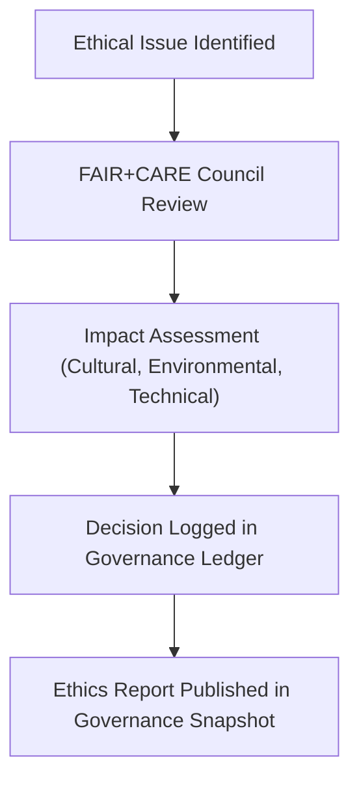

<div align="center">

# 🕊️ Kansas Frontier Matrix — **Ethical Framework & Responsible Data Principles**
`docs/governance/ethical-framework.md`

**Purpose:**  
Outlines the ethical, cultural, and human-centered principles that guide the governance, AI development, and open data practices of the Kansas Frontier Matrix (KFM).  
This document operationalizes the **FAIR+CARE**, **ISO 37000**, and **UNESCO AI Ethics** frameworks within the KFM governance model.

[](../../docs/standards/faircare-validation.md)
[]()
[]()
[](../../LICENSE)

</div>

---

## 📚 Overview

The **Ethical Framework** serves as the moral and procedural foundation of the Kansas Frontier Matrix.  
It defines how data, AI, and digital heritage are governed through the principles of **transparency, accountability, inclusion, and sustainability**.  
All contributors, partners, and AI systems must operate within these ethical guidelines.

---

## 🧭 Ethical Governance Pillars

| Pillar | Description | Alignment |
|---------|--------------|-----------|
| **Transparency** | Every dataset, decision, and algorithm must be explainable, verifiable, and open. | FAIR F4, ISO 37000:2021 |
| **Accountability** | Data and AI actors must maintain traceable provenance through ledger systems. | FAIR R1, CARE R1 |
| **Equity** | Governance prioritizes social inclusion, Indigenous partnerships, and equitable benefit sharing. | CARE Principles |
| **Privacy & Consent** | All human and cultural data require informed consent and anonymization safeguards. | GDPR, CARE A1 |
| **Sustainability** | Ethical use of computing resources and carbon-neutral practices are mandatory. | ISO 14064, FAIR+CARE |
| **Explainability** | AI-driven insights must be interpretable, bias-tested, and culturally respectful. | UNESCO AI Ethics |
| **Justice & Representation** | Narratives and visualizations must preserve the dignity of represented communities. | UNDRIP, CARE E2 |

---

## 🧩 Alignment with Global Frameworks

| Framework | Relevance | Applied In |
|------------|-------------|-------------|
| **FAIR Principles** | Ethical data management emphasizing openness and reuse. | All datasets, metadata, and logs. |
| **CARE Principles** | Ensures ethical governance in data for Indigenous and community contexts. | Historical, cultural, and oral datasets. |
| **ISO 37000** | Governance of organizations, ethics, and leadership. | KFM governance operations. |
| **UNESCO AI Ethics (2021)** | Ensures AI systems are fair, explainable, and sustainable. | Focus Mode AI and predictive models. |
| **ISO 14064** | Greenhouse gas and sustainability audits. | Infrastructure energy reporting. |
| **MCP-DL v6.3** | Documentation lifecycle and reproducibility. | All project documentation. |

---

## ⚙️ Ethical Decision Framework



### Process Summary
1. **Identification:** Concern raised via issue or audit log.  
2. **Review:** FAIR+CARE Council and domain experts conduct ethical review.  
3. **Assessment:** Cultural, environmental, and equity impact scored.  
4. **Resolution:** Action decided and publicly recorded.  
5. **Transparency:** Governance snapshot updated with outcomes.

---

## 🧠 AI Ethics & Governance

| Principle | Implementation | Oversight |
|------------|----------------|------------|
| **Bias Detection** | All models tested for demographic, spatial, and temporal bias. | @kfm-ai / @faircare-council |
| **Explainability** | SHAP and LIME audits accompany every model release. | @kfm-ai / @kfm-governance |
| **Autonomy** | Human-in-the-loop required for all consequential decisions. | @kfm-ethics |
| **Environmental Impact** | Model energy consumption logged via telemetry. | @kfm-sustainability |
| **Transparency** | Models documented under Model Card v2 standard. | @kfm-architecture |
| **Accountability** | Model provenance tracked via AI Ledger. | @kfm-governance |

AI Ethics Audit data stored in:  
`data/reports/audit/ai_ethics_ledger.json`

---

## 🌱 Sustainability & Ecological Justice

KFM commits to ethical computing that minimizes ecological impact while supporting global sustainability goals.

| Metric | Target | Framework |
|---------|---------|------------|
| Carbon Output | ≤ 30 gCO₂e per model run | ISO 14064 |
| Renewable Energy Usage | 100% offset via RE100 programs | MCP-DL |
| Hardware Lifecycle | Devices recycled / replaced under 3-year policy | ISO 14001 |
| Ecological Accountability | Annual environmental ethics audit | FAIR+CARE Council |

Telemetry results tracked in:  
`releases/v9.6.0/focus-telemetry.json`

---

## 📖 Community and Cultural Stewardship

The Kansas Frontier Matrix recognizes that **data is not neutral** — it carries meaning, memory, and power.  
The Ethical Framework mandates:
- Inclusion of Indigenous and local communities in decision-making.  
- Cultural metadata tagging for oral histories, treaties, and archives.  
- Respect for spiritual and environmental custodianship of lands.  
- Long-term preservation of cultural knowledge under ethical access controls.  

---

## 🧮 Example Ethical Audit Record

```json
{
  "audit_id": "ethics-audit-2025Q4-001",
  "domain": "AI / Hazards Modeling",
  "issues_identified": ["Potential regional bias in flood risk model"],
  "corrective_action": "Applied reweighting to ensure geographic equity",
  "audited_by": "@kfm-ethics",
  "verified_by": "@faircare-council",
  "timestamp": "2025-11-03T15:42:00Z"
}
```

Audit data appended to:  
`releases/v9.6.0/governance/ledger_snapshot_2025Q4.json`

---

## ⚖️ FAIR+CARE Ethics Matrix

| Category | Objective | FAIR+CARE Outcome |
|-----------|-------------|-------------------|
| **Findable** | Governance and ethics logs indexed and searchable. | ✅ |
| **Accessible** | Public-facing documentation under MIT license. | ✅ |
| **Interoperable** | Ethics schema linked to ISO, DCAT, and CIDOC CRM vocabularies. | ✅ |
| **Reusable** | Framework reusable across other open science projects. | ✅ |
| **Collective Benefit** | Ensures equitable participation and benefit-sharing. | ✅ |
| **Authority to Control** | FAIR+CARE Council retains final ethical authority. | ✅ |
| **Responsibility** | Contributors document ethical risks during each release. | ✅ |
| **Ethics** | Human dignity, equity, and sustainability embedded into all design. | ✅ |

---

## 🧾 Internal Use Citation

```text
Kansas Frontier Matrix (2025). Ethical Framework & Responsible Data Principles (v9.6.0).
Outlines the FAIR+CARE, ISO, and UNESCO-aligned ethical foundation guiding KFM’s AI, data governance, and cultural stewardship.
Ensures that every dataset, model, and publication aligns with values of transparency, justice, and sustainability.
```

---

## 🧾 Version Notes

| Version | Date | Notes |
|----------|------|--------|
| v9.6.0 | 2025-11-03 | Added UNESCO AI Ethics integration and community data stewardship clauses. |
| v9.5.0 | 2025-11-02 | Introduced ISO 37000 alignment for ethical governance. |
| v9.3.2 | 2025-10-28 | Established FAIR+CARE ethical policy and AI audit framework. |

---

<div align="center">

**Kansas Frontier Matrix** · *Ethical AI × Sustainable Data × FAIR+CARE Governance*  
[🔗 Repository](https://github.com/bartytime4life/Kansas-Frontier-Matrix) • [⚖️ Governance Framework](./README.md) • [🧭 Standards](../standards/governance/DATA-GOVERNANCE.md)

</div>

