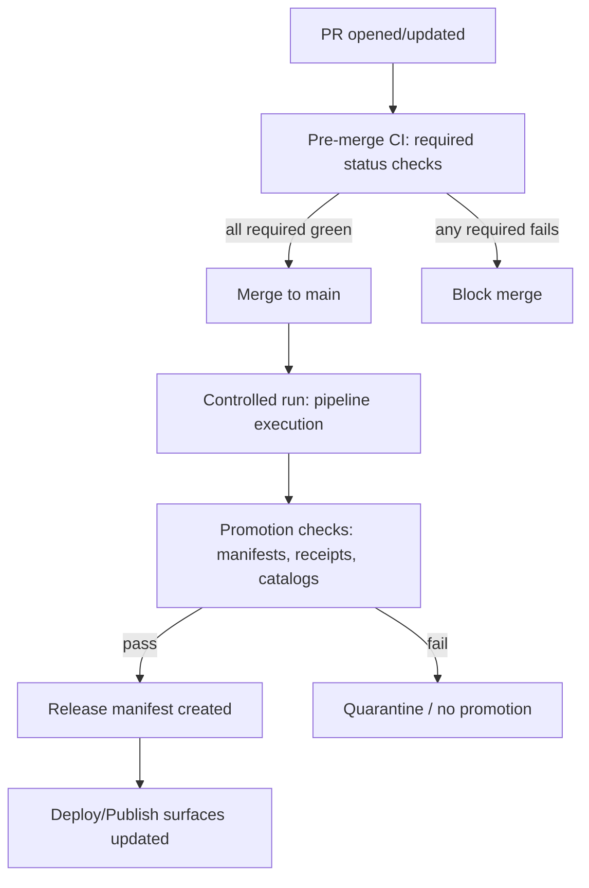

<!-- [KFM_META_BLOCK_V2]
doc_id: kfm://doc/945d88f0-c3cc-459f-900e-99a9f99b3aa4
title: CI Gates
type: standard
version: v1
status: draft
owners: TODO: assign (steward + platform owner)
created: 2026-03-02
updated: 2026-03-02
policy_label: internal
related:
  - docs/governance/ROOT_GOVERNANCE.md
  - docs/governance/gates/PROMOTION_CONTRACT.md
  - policy/
  - contracts/
  - tools/validation/
tags: [kfm, governance, gates, ci, promotion, policy-as-code]
notes:
  - This document defines CI-enforceable gates that protect the KFM trust membrane and Promotion Contract.
  - Paths in `related:` are expected; verify against repo reality and update as needed.
[/KFM_META_BLOCK_V2] -->

# CI Gates
CI-enforceable rules that protect KFM’s **truth path**, **trust membrane**, and **Promotion Contract**.

> **Non-negotiable posture:** CI **fails closed**. If a required gate cannot run or cannot be proven green, the merge/promotion does not happen.

---

## Navigation
- [Purpose](#purpose)
- [Scope](#scope)
- [Definitions](#definitions)
- [CI stages](#ci-stages)
- [Gate registry](#gate-registry)
- [Promotion Contract crosswalk](#promotion-contract-crosswalk)
- [Fail-closed semantics](#fail-closed-semantics)
- [Gate selection rules](#gate-selection-rules)
- [Minimum verification steps](#minimum-verification-steps)
- [Appendix: Templates](#appendix-templates)

---

## Purpose
KFM treats CI as a **governance enforcement surface**, not just a build system:

- CI must prevent **unsafe, unlicensed, or sensitive** artifacts from becoming reachable through governed APIs, the UI, Story publishing, or Focus Mode.
- CI must enforce **policy-as-code parity**: the same semantics (or at minimum fixtures + outcomes) apply in CI and runtime.

---

## Scope
This document defines:
- **What gates must exist** (normative, repo-wide).
- **When gates must block** (merge / release / promotion).
- **What evidence CI must produce** (logs + artifacts + receipts).

This document does *not* define:
- The exact CI provider (GitHub Actions, Buildkite, etc.).
- The exact command lines for each gate (those belong in `tools/` / `scripts/` once verified).
- Dataset-specific QA rules (those belong in the dataset’s spec).

---

## Definitions

### Gate
A deterministic check that answers:
1) **What changed?**  
2) **Is it allowed?**  
3) **Is it reproducible?**  

A gate has:
- an **ID** (stable),
- a **blocking level** (hard/soft/info),
- an **evidence output** (logs + artifacts),
- a **mapping** to the Promotion Contract and/or trust membrane requirements.

### Blocking levels
- **HARD (required status check):** must pass to merge or promote.
- **SOFT (manual review):** may fail but requires explicit steward/operator override workflow (if such a workflow exists).
- **INFO:** advisory; never a merge blocker (avoid “greenwashing”).

### “Fail closed”
If a gate is required and cannot be executed (missing tool, missing secrets, ambiguous policy inputs, broken resolver, etc.), the outcome is **deny**.

---

## CI stages

**Intent:** promotion is both **social + technical**: CI runs automation; stewards/operators perform bounded approvals where required.

---

## Gate registry
> Use the tags **[CONFIRMED]**, **[PROPOSED]**, **[UNKNOWN]** to preserve the trust membrane for this document.

| Gate ID | Name | Level | Purpose | Evidence output (minimum) | Status |
|---|---:|---:|---|---|---|
| CI-00 | Kill switch | HARD | Emergency stop: force fail on all promotions/deploys | CI log line `KILL_SWITCH_ACTIVE` | [PROPOSED] |
| CI-01 | Repo integrity (lint/type/unit) | HARD | Prevent basic regressions | junit + coverage (where applicable), logs | [PROPOSED] |
| CI-02 | Schema validation (repo contracts) | HARD | Ensure schemas compile/validate and examples are valid | schema-validation report | [PROPOSED] |
| CI-03 | Policy pack unit tests (fixtures) | HARD | Prevent silent policy drift; enforce default-deny | conftest/OPA test report | [CONFIRMED] |
| CI-04 | License + rights gate | HARD | Block unknown/forbidden license states; enforce “metadata-only reference” rules | machine-readable license decision + logs | [CONFIRMED] |
| CI-05 | Sensitivity + redaction obligations | HARD | Enforce policy_label + obligations; prevent restricted leakage | policy decision + obligation checks | [CONFIRMED] |
| CI-06 | spec_hash stability | HARD | Ensure deterministic identity across platforms | golden test report for spec_hash | [CONFIRMED] |
| CI-07 | Catalog triplet validation (DCAT/STAC/PROV) | HARD | Ensure catalogs validate and are cross-linked | validator output + linkcheck report | [CONFIRMED] |
| CI-08 | Evidence resolver integration | HARD | Ensure EvidenceRefs resolve and are policy-allowed (no guessing) | evidence-resolve test artifact | [CONFIRMED] |
| CI-09 | API contract validation | HARD | Ensure OpenAPI/contracts are valid and compatible | contract validation output | [CONFIRMED] |
| CI-10 | Run receipt + checksums validation | HARD | Ensure run_receipt exists + inputs/outputs/digests recorded | receipt validation report | [CONFIRMED] |
| CI-11 | Promotion manifest validation | HARD (for promotion lane) | Ensure release is reproducible & references digests | manifest JSON validation report | [CONFIRMED] |
| CI-12 | UI trust-surface smoke tests | SOFT→HARD (prod) | Evidence drawer works; restricted layers denied/generalized; a11y smoke | e2e artifact(s) | [CONFIRMED] |
| CI-13 | Performance smoke tests | SOFT | Detect obvious tile/evidence regressions | perf summary | [CONFIRMED] |
| CI-14 | SBOM + build provenance | SOFT→HARD (prod) | Supply chain integrity for pipeline images + API/UI artifacts | SBOM/provenance artifacts | [CONFIRMED] |

> **Implementation note:** “SOFT→HARD (prod)” means this gate can start non-blocking for early integration, but **must become required** before production posture is claimed.

---

## Promotion Contract crosswalk
The Promotion Contract gates (A–G) are enforced by CI gate(s) above.

| Promotion Gate | Requirement (summary) | CI gates that enforce it |
|---|---|---|
| A — Identity & versioning | Stable dataset identity; version derived from stable spec_hash; content digests | CI-06, CI-10 |
| B — Licensing & rights | Explicit license + rights holder; unclear license stays quarantined | CI-04 |
| C — Sensitivity + redaction plan | policy_label assigned; obligations tested; redaction recorded in PROV when required | CI-05, CI-03, CI-07 |
| D — Catalog triplet validation | DCAT/STAC/PROV validate and cross-link; resolvable references | CI-07, CI-08 |
| E — Run receipt + checksums | Receipt exists, enumerates inputs/outputs; environment recorded | CI-10 |
| F — Policy tests + contract tests | Policy tests pass; Evidence resolver resolves; API/contracts validate | CI-03, CI-08, CI-09 |
| G — Optional recommended | SBOM/provenance; performance + a11y smoke | CI-12, CI-13, CI-14 |

---

## Fail-closed semantics

### HARD fail triggers (examples)
- **Missing/unknown license** for any distribution intended for promotion.
- **Missing policy_label** for a dataset version.
- **Broken cross-links** between DCAT/STAC/PROV.
- **EvidenceRefs cannot be resolved** in CI for at least one representative reference.
- **Policy tests do not run** (tooling missing or misconfigured) → treat as deny.
- **Spec hashing drift** across environments (golden test fails).

### SOFT fail triggers (examples)
- Performance smoke regression without clear threshold breach (until thresholds exist).
- UI smoke tests failing on non-critical browsers (until the a11y baseline is stabilized).

> If an override process exists, it must itself be governed: recorded approvals, audit entry, and an explicit “why”.

---

## Gate selection rules
To keep CI fast but safe, gate selection may be conditional **only if** it cannot reduce safety.

**PROPOSED routing (verify against repo reality):**
- Changes under `policy/` → always run **CI-03** and any policy-dependent gates (CI-04/05/08).
- Changes under `data/registry` or dataset specs → always run **CI-06** + **CI-04/05** as applicable.
- Changes under `data/catalog/` → always run **CI-07** + **CI-08**.
- Changes under `contracts/` → always run **CI-02** + **CI-09**.
- Changes under `apps/ui` → run **CI-12** at least in smoke mode.
- Changes under pipeline code/images → run **CI-10** + (prod) **CI-14**.

---

## Minimum verification steps
This file is **normative**, but must be kept aligned with actual CI implementation.

**To convert UNKNOWN/PROPOSED → CONFIRMED:**
1. Capture repo commit hash + root directory tree.
2. Enumerate workflows under `.github/workflows/` and list:
   - required status checks,
   - what triggers them,
   - which are blocking merges.
3. For each CI gate ID above, point to:
   - the workflow job name(s),
   - the script/tool invoked,
   - the produced artifact path(s).
4. Validate one “golden path” dataset promotion in a PR:
   - schema validation,
   - policy tests,
   - spec_hash stability,
   - catalog triplet validation + linkcheck,
   - evidence resolution test,
   - receipt + manifest validation.

---

## Appendix: Templates

<strong>Template: Gate definition block</strong>

Use this format whenever adding or changing a gate:

- **Gate ID:** CI-XX  
- **Name:**  
- **Level:** HARD / SOFT / INFO  
- **Triggers:** (paths, events)  
- **Inputs:** (files, configs)  
- **Outputs (artifacts):** (where stored)  
- **Fail-closed rule:** (what happens if tool cannot run)  
- **Maps to:** Promotion Gate (A–G) and/or trust membrane item(s)  
- **Owner:** (role/team)  
- **DoD:** (what must be added to consider the gate “real”)  

<strong>Template: PR checklist (contributor)</strong>

- [ ] I understand which CI gates apply to this change.
- [ ] If I touched dataset specs or registry: I updated/verified **spec_hash stability**.
- [ ] If I touched rights/licensing: I provided explicit license + rights holder info.
- [ ] If I touched sensitivity: I assigned/updated `policy_label` and any obligations.
- [ ] If I touched catalogs: I validated DCAT/STAC/PROV and cross-links.
- [ ] If I touched evidence/citations: I verified EvidenceRefs resolve in CI.

---

## Back to top
[↑ Back to top](#ci-gates)
