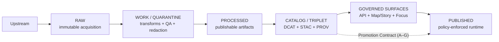

<!-- [KFM_META_BLOCK_V2]
doc_id: kfm://doc/bff81754-404d-4d0e-b217-ef5ed1ec61c7
title: Promotion Contract
type: standard
version: v1
status: draft
owners: KFM Governance
created: 2026-03-02
updated: 2026-03-02
policy_label: public
related: []
tags: [kfm, governance, gates, promotion-contract, truth-path]
notes:
  - Defines minimum, fail-closed gates required to promote data/products into governed runtime surfaces.
  - Designed to be CI-enforceable and reviewable (steward sign-off).
[/KFM_META_BLOCK_V2] -->

# Promotion Contract
**Purpose:** define the minimum *fail-closed* gates required to promote artifacts into **PUBLISHED** (governed runtime surfaces).


> **Non-negotiable rule:** *Promotion to PUBLISHED is blocked unless all required gates pass.*
> When in doubt, KFM **fails closed** (stays in WORK/QUARANTINE).

## Quick navigation
- [Scope](#scope)
- [Truth path and where gates apply](#truth-path-and-where-gates-apply)
- [Roles](#roles)
- [Promotion Contract v1 gates](#promotion-contract-v1-gates)
- [Definition of Done for a dataset integration](#definition-of-done-for-a-dataset-integration)
- [Practical promotion workflow](#practical-promotion-workflow)
- [Enforcement model](#enforcement-model)
- [Appendix: Gate evidence matrix](#appendix-gate-evidence-matrix)

---

## Scope
This contract governs **promotion events** that cause a dataset (and/or its derived artifacts) to become visible through **governed runtime surfaces** (API, Map/Story UI, Focus Mode).

It applies to:
- **Dataset versions** (a stable, immutable identity for a specific spec + inputs + transforms).
- **Artifacts** produced by ingestion and processing (files, tiles, tables, bundles).
- **Catalogs and provenance** (the “catalog triplet”: DCAT + STAC + PROV).
- **Policy enforcement + evidence resolution** required for user-facing claims.

It does **not** prescribe:
- The exact repository folder layout (implementation detail; may differ by domain).
- The exact CI toolchain (GitHub Actions / others) — only required outcomes.

---

## Truth path and where gates apply
KFM’s lifecycle is a *storage + validation + governance* pipeline (not a metaphor). Gates are enforced at transitions, and **promotion is the governed event**.



### Working definition: “PUBLISHED”
A dataset is “published” when a user can discover or query it via KFM’s governed surfaces **and** every user-facing claim can be traced to:
- a **dataset_version_id**,
- a **license/rights record**,
- a **policy label + obligations**,
- a **validated catalog triplet**,
- and **run receipts** that enumerate inputs/outputs with checksums.

---

## Roles
Promotion is **social + technical**. These roles map to responsibilities, not necessarily job titles.

- **Contributor**: adds/updates dataset specs, fixtures, and catalog/prov stubs via PR.
- **Steward (governance)**: reviews **licensing** and **sensitivity/policy labeling**; approves or blocks.
- **Operator (release)**: runs the pipeline in a controlled environment; produces immutable artifacts + receipts; cuts the release manifest.

> No single role should be able to bypass all gates.

---

## Promotion Contract v1 gates
### Overview table
| Gate | Name | Required outcome | Typical failure behavior |
|---:|---|---|---|
| A | Identity and versioning | Stable `dataset_id`; immutable `dataset_version_id` derived from deterministic `spec_hash`; content digests | Block promotion; require spec fixes / re-hash |
| B | Licensing and rights metadata | Explicit license/rights + attribution; upstream terms snapshot if applicable | Quarantine (fail closed) |
| C | Sensitivity classification and redaction plan | `policy_label` assigned + obligations; redaction/generalization plan recorded in provenance when needed | Quarantine; deny access by default |
| D | Catalog triplet validation | DCAT + STAC + PROV validate and cross-link; EvidenceRefs resolve without guessing | Block promotion; fix catalogs/links |
| E | Run receipts, checksums, and QA thresholds | Run receipt exists per producing run; inputs/outputs checksummed; QA report exists and thresholds are met | Quarantine; no publication |
| F | Policy tests and contract tests | Policy tests pass; evidence resolver works; API/schema contracts validate | Block merge/promotion |
| G | Promotion record and production posture | Release/promotion manifest recorded; (recommended) SBOM/provenance + perf/accessibility smoke checks | Block publication if manifest missing; warn/fail on posture gates per policy |

> **Normative language:** “MUST” is a hard gate. “SHOULD” is a default expectation; failing it requires documented exception + steward sign-off.

---

## Gate A: Identity and versioning
### MUST
- A stable, human-meaningful **dataset ID** exists and follows KFM naming conventions.
- A **DatasetVersion ID** is immutable and derived from a stable **spec_hash**.
- The spec hash is computed deterministically from canonicalized inputs (no nondeterministic ordering).
- Every produced artifact referenced for promotion is **digest-addressed** (e.g., `sha256`) and the digest is recorded.

### SHOULD
- Canonical identifiers avoid embedding environment-specific hostnames (hostnames belong in distribution URLs, not IDs).
- ID families follow a consistent URI-like pattern (example: `kfm://dataset/...`, `kfm://artifact/sha256:...`).

### Evidence artifacts (minimum)
- `dataset_id`
- `dataset_version_id`
- `spec_hash`
- artifact digest list (inputs + outputs)

---

## Gate B: Licensing and rights metadata
### MUST
- License is **explicit** and compatible with intended use.
- Rights holder and attribution requirements are captured.
- If license/rights are unclear or unknown, the dataset **stays in QUARANTINE** (fail closed).

### SHOULD
- Capture a **snapshot of upstream terms** (where feasible) alongside RAW acquisition to reduce ambiguity later.

### Evidence artifacts (minimum)
- License + rights fields (machine-readable)
- Attribution text (machine-readable)
- Optional: upstream terms snapshot

---

## Gate C: Sensitivity classification and redaction plan
### MUST
- A `policy_label` is assigned (e.g., `public`, `restricted`, …).
- If a dataset is sensitive (e.g., precise location risk, protected species, archaeology, or other restricted knowledge), a **redaction/generalization plan** exists.
- The redaction/generalization plan is recorded in provenance (PROV), so reviewers can verify what changed and why.

### SHOULD
- Default-deny access to precise or restricted variants; publish generalized derivatives when possible.

### Evidence artifacts (minimum)
- `policy_label`
- obligations / redaction rules (policy inputs)
- provenance record of redaction/generalization (PROV)

---

## Gate D: Catalog triplet validation
### MUST
- A DCAT record exists and validates against the KFM DCAT profile.
- STAC collection/items exist **when applicable** and validate against the KFM STAC profile.
- A PROV bundle exists and validates against the KFM PROV profile.
- Cross-links between DCAT, STAC, and PROV are present and resolvable.
- EvidenceRefs resolve without guessing (no “best-effort” citation resolution).

### SHOULD
- Catalog records include `dataset_version_id` and artifact digests so citations and caching are deterministic.

### Evidence artifacts (minimum)
- DCAT Dataset (+ Distributions)
- STAC Collection (+ Items/Assets if applicable)
- PROV bundle linking RAW→WORK→PROCESSED activities to outputs

---

## Gate E: Run receipts, checksums, and QA thresholds
This gate binds together **reproducibility** and **quality**: if it can be published, it must be auditable *and* meet documented thresholds.

### MUST
- A `run_receipt` exists for each producing run.
- Inputs and outputs are enumerated with **checksums**.
- The producing environment is recorded (e.g., container image digest, parameters).
- Dataset-specific QA checks and thresholds are **documented** (typically in the dataset spec).
- A QA report exists and thresholds are met; otherwise the dataset remains in WORK/QUARANTINE.

### SHOULD
- Store validation reports in a predictable location and link them from PROV and/or catalogs.

### Evidence artifacts (minimum)
- `run_receipt` (typed, schema-valid)
- checksum list (inputs + outputs)
- QA report + thresholds (schema-valid)

#### Minimal run receipt shape (illustrative)
```json
{
  "run_id": "kfm://run/…",
  "dataset_id": "kfm://dataset/…",
  "dataset_version_id": "kfm://dataset/@…",
  "spec_hash": "sha256:…",
  "started_at": "2026-03-02T00:00:00Z",
  "inputs": [{"uri": "…", "sha256": "…"}],
  "outputs": [{"uri": "…", "sha256": "…"}],
  "checks": [{"name": "qa.schema_valid", "status": "pass"}],
  "policy": {"policy_label": "public", "obligations_applied": ["…"]},
  "environment": {"image_digest": "sha256:…", "params": {}}
}
```
*Note:* This is a shape guide — the authoritative schema must live in the repo’s contracts/schemas.

---

## Gate F: Policy tests and contract tests
### MUST
- OPA/Rego (or equivalent) **policy tests** pass for the dataset version (fixtures-driven).
- Evidence resolver can resolve at least one EvidenceRef for the dataset version in CI.
- API contracts and schemas validate (OpenAPI/JSON Schema/etc).
- Runtime responses for the dataset include `dataset_version_id` and digests (so consumers can verify what they received).

### SHOULD
- Contract tests include negative cases (default-deny for restricted data; missing licenses; broken evidence links).

### Evidence artifacts (minimum)
- Policy test results
- Evidence resolver test results
- Contract test results

---

## Gate G: Promotion record and production posture
### MUST
- The promotion event is recorded as a **release/promotion manifest** that references promoted artifacts and digests (append-only).
- The manifest is discoverable for audit/repro (e.g., in a release ledger or immutable log).

### SHOULD (recommended production posture)
- SBOM and build provenance for pipeline images and API/UI artifacts.
- Performance smoke checks (e.g., tile rendering, evidence resolve latency).
- Accessibility smoke checks for UI trust surfaces (e.g., keyboard navigation for evidence drawer).

### Evidence artifacts (minimum)
- Release/promotion manifest (links + digests)
- Optional: SBOMs, perf/a11y smoke reports

---

## Definition of Done for a dataset integration
A dataset integration ticket is **DONE** only when:
- RAW acquisition is reproducible and documented.
- WORK transforms are deterministic (same inputs → same outputs; same spec → same hash).
- PROCESSED artifacts exist in approved formats and are digest-addressed.
- Catalog triplet validates and is cross-linked.
- EvidenceRefs resolve and render in user trust surfaces (evidence drawer / receipt viewer).
- Policy label is assigned, with documented review.
- Changelog entry explains what changed and why.

---

## Practical promotion workflow
**Recommended PR-based workflow (governed + repeatable):**
1. Contributor opens PR adding:
   - source registry entry
   - pipeline spec
   - fixture data (small sample) + expected outputs
2. CI runs:
   - schema validation
   - policy tests
   - spec_hash stability test
   - link check for catalogs
3. Steward review:
   - licensing and sensitivity
   - approve/adjust policy label
4. Operator merges and triggers the pipeline run in a controlled environment.
5. Outputs are written to PROCESSED + CATALOG/TRIPLET along with receipts.
6. Release/promotion manifest is created and tagged.

---

## Enforcement model
### CI/CD expectations
Promotion Contract checks should be:
- **Merge-blocking** for required gates (A–G MUSTs).
- **Artifact-producing** (CI should publish gate outputs: receipts, reports, linkcheck logs).
- **Fail-closed** (missing artifact == failure, not a warning).

### Governance expectations
- Exceptions require a written rationale, linked to the promotion record, and steward sign-off.
- Any change to gate definitions should ship as a PR-sized increment with:
  - schema updates,
  - policy/test updates,
  - and at least one fixture-driven example.

---

## Appendix: Gate evidence matrix
> Use this as a checklist when preparing a promotion PR or auditing a release.

| Gate | Evidence artifact | Who provides | Where it should be linked |
|---:|---|---|---|
| A | dataset_id, dataset_version_id, spec_hash, digests | Contributor + Operator | receipt + catalogs |
| B | license/rights + attribution (+ terms snapshot) | Steward + Contributor | receipt + DCAT |
| C | policy_label + obligations + redaction plan | Steward + Contributor | policy fixtures + PROV |
| D | DCAT/STAC/PROV + linkcheck logs | Contributor | catalogs + CI artifacts |
| E | run_receipt + checksums + QA report | Operator | receipts + PROV + CI artifacts |
| F | policy tests + contract tests + evidence resolve test | CI | CI artifacts + gate dashboard |
| G | release/promotion manifest (+ optional posture reports) | Operator + CI | release ledger |

---

<details>
<summary><strong>Design notes (why this contract is strict)</strong></summary>

- If a dataset can be surfaced in Map/Story/Focus, it can be cited — therefore it must be reproducible, policy-allowed, and backed by resolvable evidence.
- “Fail-closed” is the default because licensing ambiguity and sensitive-location leakage are high-impact failure modes.

</details>
