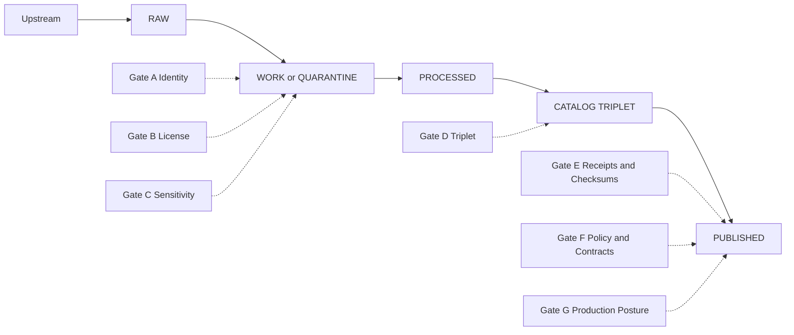

<!-- [KFM_META_BLOCK_V2]
doc_id: kfm://doc/3d4ed4f1-89a4-4d88-b137-baba9fd23311
title: Governance Gates
type: standard
version: v1
status: draft
owners: TBD
created: 2026-03-02
updated: 2026-03-02
policy_label: public
related:
  - docs/governance/README.md
  - docs/governance/promotion-contract/README.md
  - docs/governance/policy-labels/README.md
  - docs/standards/README.md
tags: [kfm, governance, gates, promotion-contract]
notes:
  - This README is a directory index and a normative overview of KFM gate semantics.
  - Links under "related" are placeholders until verified in-repo.
[/KFM_META_BLOCK_V2] -->

# Governance Gates 🧱🔒
**Purpose:** Define the **fail-closed gates** that protect the KFM truth path, trust membrane, and evidence-first UX.


> **Non-negotiable:** A dataset version (or a narrative claim) is **not eligible for user-facing surfaces** unless the relevant gates pass.  
> “Eligible” means: reproducible artifacts + validated catalogs + policy enforced + evidence resolvable.

## Quick navigation
- [What lives in this directory](#what-lives-in-this-directory)
- [Key concepts](#key-concepts)
- [Promotion Contract v1 gates (A–G)](#promotion-contract-v1-gates-ag)
- [How gates run](#how-gates-run)
- [Waivers and exceptions](#waivers-and-exceptions)
- [Adding or changing a gate](#adding-or-changing-a-gate)
- [Definition of Done for dataset onboarding](#definition-of-done-for-dataset-onboarding)
- [Minimum verification steps (maintainers)](#minimum-verification-steps-maintainers)
- [Appendix: terminology](#appendix-terminology)

---

## What lives in this directory
This directory is the **human-readable index** for KFM gate semantics and review procedures.

### Acceptable inputs (belongs here)
- Gate definitions in plain language (MUST/SHOULD rules)
- Checklists for reviewers (Data Steward, Security, Maintainers)
- Templates for recorded decisions (waiver, policy decision, promotion manifest)
- Small diagrams describing gate placement in the system
- ADR links for gate numbering or behavior changes

### Exclusions (must not live here)
- **Executable** policy code (OPA/Rego) and policy fixtures  
- CI workflow code  
- Validators / linters / scripts  
- Secrets or security-sensitive implementation details  
- Dataset-specific QA thresholds (those belong in the dataset spec)

### Proposed directory layout (verify before adding files)
```text
docs/governance/gates/                                   # Governance gates: definitions, required reviews, and artifacts that prove readiness to promote/publish
├── README.md                                            # Gate philosophy + overview, how to run gates, where artifacts live, and how CI/policy enforces outcomes
├── checklists/                                          # Human review checklists used by stewards/security/publishers during gate execution
│   ├── steward_review.md                                # Steward checklist: provenance, licensing, sensitivity, schema correctness, evidence completeness, and acceptance criteria
│   ├── security_review.md                               # Security checklist: access controls, threat considerations, secrets/PII handling, logging/audit, and fail-closed posture
│   └── story_publish_review.md                          # Story publish checklist: narrative claims→citations, map layers/UX obligations, redactions, and release notes
├── templates/                                           # Reusable artifacts (copy → fill) that record gate outcomes, decisions, waivers, and promotion intent
│   ├── gate_waiver.md                                   # Gate Waiver template: time-bounded exception with scope, compensating controls, approvals, and expiry/closure plan
│   ├── policy_decision.md                               # Policy Decision template: records label/gate/policy decisions with rationale, risks, enforcement points, and rollback
│   └── promotion_manifest.md                            # Promotion Manifest template: machine-/human-readable manifest for what is being promoted (inputs, outputs, hashes, receipts)
└── adr/                                                 # Architecture Decision Records specific to gate design and governance mechanics
    └── ADR-0001-gate-numbering.md                        # ADR defining gate numbering scheme (stable IDs), how gates evolve, and compatibility/migration rules
```

---

## Key concepts

### Truth path (zones + promotion)
KFM treats the lifecycle as **enforced storage zones** with promotions between them.



**Core rule:** If a gate is uncertain, it fails (default-deny / fail-closed).

### Zone rules (quick)
- **RAW** is append-only: do not edit; supersede with a new acquisition.
- **WORK/QUARANTINE** is where normalization, QA, and candidate redactions happen; quarantined items are not promoted.
- **PROCESSED** contains publishable artifacts in approved formats with checksums.
- **CATALOG/TRIPLET** contains cross-linked DCAT + STAC + PROV for discovery and lineage.
- **PUBLISHED** surfaces are governed (policy enforced) and only serve promoted versions.

### Trust membrane (policy boundary)
Clients and UIs **MUST NOT** read from storage directly. All access goes through a governed API and policy enforcement point (PEP).  
This is how KFM makes policy enforceable rather than aspirational.

### Evidence-first UX + cite-or-abstain
User-facing surfaces (Map, Story, Focus Mode) treat evidence as first-class:
- users can open the **evidence drawer** from any feature/claim
- claims cite evidence bundles (not “just a URL”)
- Focus Mode and Story publishing **abstain** when citations can’t be verified

---

## Promotion Contract v1 gates (A–G)

> These are the **minimum credible set** of promotion gates for moving a dataset version into governed runtime surfaces.  
> A dataset version promotion **MUST** be blocked unless the required artifacts exist *and* validate.

### Gate registry (normative)
| Gate | Name | MUST enforce | Typical evidence artifacts | Primary failure mode |
|---:|---|---|---|---|
| A | Identity and versioning | Deterministic `dataset_id` + immutable `dataset_version_id` derived from a stable `spec_hash` | Dataset spec + `spec_hash` + digests | “Hash drift” / unstable IDs |
| B | Licensing and rights metadata | Explicit license + rights holder + attribution requirements; unclear license stays quarantined | Terms snapshot, license fields | Licensing ambiguity or incompatibility |
| C | Sensitivity classification and redaction plan | `policy_label` assigned; redaction/generalization plan exists when needed and is recorded in provenance | Policy decision record; redaction plan; PROV activity | Sensitive leakage risk |
| D | Catalog triplet validation | DCAT/STAC/PROV validate against KFM profiles and cross-link deterministically | DCAT dataset, STAC collections/items/assets, PROV bundle | Broken links / non-resolvable EvidenceRefs |
| E | Run receipt and checksums | Each producing run emits `run_receipt`; inputs/outputs enumerated with checksums; environment recorded | Run receipt, artifact digests | Missing receipt / mismatched digests |
| F | Policy tests and contract tests | Policy tests pass; evidence resolver can resolve at least one EvidenceRef in CI; API contracts validate | Policy fixtures; contract test outputs | Policy regression or contract drift |
| G | Optional but recommended (production posture) | Supply-chain + safety posture checks (SBOM/provenance, performance smoke, accessibility smoke) | SBOMs, attestations, perf/a11y reports | Risk posture unacceptable for “published” |

### Notes on Gate naming drift (do not ignore)
Some internal briefs enumerate **QA thresholds** and a **release manifest** as distinct gates.  
Until an ADR resolves numbering, treat:
- dataset-specific QA thresholds as **required spec content** (validated during promotion)
- promotion manifest / release record as a **required release artifact** for publishing events

---

## How gates run

### 1) PR-based promotion workflow (recommended)
KFM promotion is designed to be **social + technical**, not ad hoc.

**Typical flow**
1. Contributor opens a PR with: registry entry + pipeline/spec + small fixture sample + expected outputs.
2. CI runs: schema validation, policy tests, `spec_hash` stability checks, catalog link checks.
3. Data Steward reviews licensing and sensitivity; approves `policy_label`.
4. Operator/maintainer triggers the controlled pipeline run.
5. Outputs are written to PROCESSED + CATALOG.
6. A promotion manifest / release record is created and tagged.

### 2) Runtime gates
Even after promotion, runtime access is still governed:
- all reads pass through the PEP
- policy is evaluated on request context
- evidence resolver applies obligations (redaction/generalization) consistently

### 3) UX gates (Story + Focus Mode)
Publishing and answering are governed events:
- Story publishing requires review state and resolvable citations
- Focus Mode must verify citations; if it cannot, it narrows scope or abstains

---

## Waivers and exceptions

**Default posture:** *no waiver*. Gates exist because the system must fail safely.

If an exception is unavoidable:
- it MUST be recorded (ticket + decision record)
- it MUST include scope (what is waived), duration (time-box), and compensating controls
- it MUST NOT bypass the trust membrane

**Do not use waivers** to ship:
- unclear licensing
- unreviewed sensitive location data
- broken EvidenceRefs / missing provenance

---

## Adding or changing a gate
Gates are part of the “trust membrane.” Treat changes as high-impact.

**Required steps**
- Write an ADR describing the change (behavior, threat model, migration plan).
- Update this README (normative rules + checklists).
- Add/modify automated checks so CI fails closed.
- Add a fixture that demonstrates pass + fail behavior.

**Gate IDs are intended to be stable.** Prefer adding a new gate over reusing an existing label for a different meaning.

---

## Definition of Done for dataset onboarding
A dataset integration ticket is DONE only when:

- [ ] RAW acquisition is reproducible and documented
- [ ] WORK transforms are deterministic (same inputs → same outputs → same hash)
- [ ] PROCESSED artifacts exist in approved formats and are digest-addressed
- [ ] Catalog triplet validates and is cross-linked
- [ ] EvidenceRefs resolve end-to-end and render in the UI evidence drawer
- [ ] `policy_label` is assigned with documented review
- [ ] Changelog entry explains what changed and why

---

## Minimum verification steps (maintainers)
When updating gates or claiming a gate is “enforced,” attach these artifacts to the PR so reviewers can confirm reality:

- [ ] Repo commit hash (`git rev-parse HEAD`) and a root directory tree (`tree -L 3`)
- [ ] List of merge-blocking CI gates extracted from `.github/workflows`
- [ ] Evidence that at least one MVP dataset can be promoted end-to-end with receipts + catalogs
- [ ] Evidence that the UI cannot bypass the PEP (static analysis and/or network policy proof)
- [ ] For Focus Mode: evaluation harness outputs for golden queries, stored as artifacts

---

## Appendix: terminology
- **Gate:** A testable rule that blocks promotion/publishing unless it passes.
- **Promotion Contract:** The minimum set of gates required for a dataset version to be eligible for runtime surfaces.
- **Policy label:** A coarse access/sensitivity label (e.g., public, restricted) used by policy enforcement.
- **EvidenceRef / EvidenceBundle:** Indirection that allows citations to resolve to inspectable, policy-allowed evidence artifacts.
- **Run receipt:** A structured record of a pipeline run (inputs, outputs, environment, hashes, decisions).

---

<details>
<summary>Backlog (TODOs)</summary>

- [ ] Verify actual in-repo paths for: policy packs, validators, gate checklists, promotion manifests.
- [ ] Write ADR: reconcile gate numbering between vNext guide and delivery plan brief.
- [ ] Add templates for waiver, policy decision record, and promotion manifest.
- [ ] Add “minimum verification steps” checklist for maintainers (commit hash, workflow gate list, etc.).

</details>
