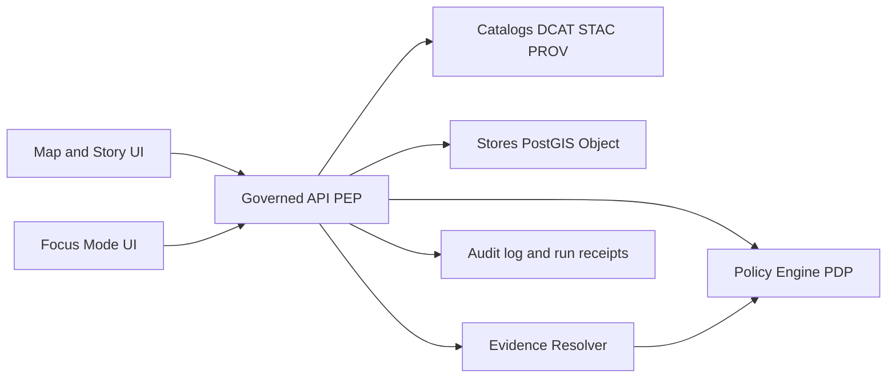

<!-- [KFM_META_BLOCK_V2]
doc_id: kfm://doc/2f2f0b8a-4a25-4d5b-b6f0-4b7f3af1d71d
title: Runtime Gates
type: standard
version: v1
status: draft
owners: TBD
created: 2026-03-02
updated: 2026-03-02
policy_label: internal
related:
  - docs/governance/gates/PROMOTION_CONTRACT.md
  - docs/governance/policy/POLICY_AS_CODE.md
  - docs/governance/audit/AUDIT_MODEL.md
tags: [kfm, governance, gates, runtime, trust-membrane]
notes:
  - Defines fail-closed runtime enforcement gates for all PUBLISHED surfaces (API, evidence resolver, Story publishing, Focus Mode, tiles/downloads).
[/KFM_META_BLOCK_V2] -->

# Runtime Gates
**Fail-closed, policy-consistent enforcement for every PUBLISHED surface** (API/PEP, Evidence Resolver, Story publishing, Focus Mode, tiles/downloads).


<!-- TODO: Replace badges with repo-specific workflow + coverage badges once paths are confirmed. -->

## Quick navigation
- [Purpose](#purpose)
- [Definitions](#definitions)
- [Where runtime gates live](#where-runtime-gates-live)
- [Runtime gate registry](#runtime-gate-registry)
- [Gate details](#gate-details)
- [Failure behavior](#failure-behavior)
- [Testing strategy](#testing-strategy)
- [Operational checklist](#operational-checklist)
- [Minimum verification steps](#minimum-verification-steps)

---

## Purpose

Runtime gates are the **always-on enforcement checks** that protect KFM’s **PUBLISHED** surfaces from:
- policy bypass,
- restricted/sensitive leakage,
- non-resolvable evidence/citations,
- unsafe or unverifiable Focus Mode output,
- inconsistent versioning/digests,
- and audit gaps.

They complement (but do not replace) the **Promotion Contract** gates. Promotion gates ensure *only valid artifacts reach PUBLISHED*; runtime gates ensure *only authorized, policy-safe views of those artifacts are served per request*.

> WARNING  
> If CI and runtime do not share the same policy semantics (or fixtures/outcomes), CI guarantees are meaningless.  
> Runtime gates MUST be implemented so they can be validated in CI and exercised in production.

[Back to top](#runtime-gates)

---

## Definitions

**PDP (Policy Decision Point)**  
The component that evaluates policy (e.g., OPA/Rego) and returns a decision + obligations.

**PEP (Policy Enforcement Point)**  
The component that *enforces* the PDP decision (typically the Governed API) by allowing/denying access and applying obligations.

**Obligations**  
Policy-directed transformations or requirements (e.g., “generalize geometry”, “remove field”, “show notice”, “log extra fields”, “require attribution blob in export”).

**EvidenceRef / EvidenceBundle**  
A “citation” in KFM is a reference that resolves (via the Evidence Resolver) into a bundle containing metadata + provenance + digests and is subject to policy.

**Cite-or-abstain**  
If required citations cannot be resolved and policy-allowed, the system must reduce scope or abstain (not guess, not “best effort”).

---

## Where runtime gates live

Runtime enforcement must be consistent across these surfaces:

1. **Governed API (PEP)**
   - dataset discovery, STAC browsing/query, tiles, downloads/exports, lineage/status, story APIs, Focus Mode APIs.

2. **Evidence Resolver**
   - resolves EvidenceRefs into EvidenceBundles and applies policy + redaction obligations.

3. **Story publishing**
   - publishing is governed: requires review state and resolvable, policy-allowed citations.

4. **Focus Mode**
   - requests are governed runs with receipts, hard citation verification, and policy pre-check.

### Reference flow (trust membrane)



> NOTE  
> UI should display policy badges/notices, but **UI must not be the decision-maker**. Enforcement happens at PEP/Evidence Resolver.

[Back to top](#runtime-gates)

---

## Runtime gate registry

**Legend**
- **Hard gate**: request must fail closed (deny/abstain) if not satisfied
- **Soft gate**: request may succeed but must record warnings and emit telemetry

| Gate ID | Gate name | Class | Enforced at | Hard/Soft | Failure behavior |
|---|---|---:|---|---:|---|
| RG-01 | Principal & context extraction | Security | PEP, Evidence Resolver, Focus Mode | Hard | Deny with policy-safe error |
| RG-02 | Policy decision required before data access | Security | PEP, Evidence Resolver | Hard | Deny; no data fetch if deny |
| RG-03 | Obligation enforcement (redaction/generalization/notice) | Safety | PEP, Evidence Resolver | Hard | Deny or transform; never leak |
| RG-04 | Catalog-backed responses with version + digests | Integrity | PEP | Hard | Fail closed or degrade to metadata-only |
| RG-05 | EvidenceRef resolution (no “URL pasted into text”) | Integrity | Evidence Resolver, Story publish, Focus | Hard | Fail closed; abstain if needed |
| RG-06 | Cite-or-abstain verification | Truth | Story publish, Focus Mode | Hard | Abstain or narrow scope |
| RG-07 | Policy-safe errors (no ghost metadata) | Safety | PEP, Evidence Resolver | Hard | Normalize error behavior; avoid inference |
| RG-08 | Audit logging + audit_ref for governed ops | Audit | PEP, Focus Mode, Story publish | Hard | Fail operation if audit cannot be emitted |
| RG-09 | License/rights enforcement on downloads/exports | Compliance | PEP | Hard | Block export/download; metadata-only allowed |
| RG-10 | Cache separation by auth/policy | Safety | PEP, CDN, Tile serving | Hard | Disable shared caching if unsafe |
| RG-11 | Rate limits & query budgets | Reliability | PEP | Soft→Hard (if exceeded) | Throttle; degrade; deny abusive patterns |
| RG-12 | Runtime freshness and lineage surfacing | Trust UX | PEP (/lineage/status) | Soft | Show stale badges; do not falsify freshness |

> NOTE  
> RG-11 and RG-12 are “operational” gates; implement early enough to prevent performance collapse and “trust UX drift,” but treat them as secondary to policy/evidence gates.

[Back to top](#runtime-gates)

---

## Gate details

### RG-01 — Principal & context extraction (Hard)

**Intent**  
Every request that could touch governed data must be evaluated with the correct caller context.

**Minimum required context**
- `principal` (user/service identity)
- `role` (policy role)
- `action` (read/query/export/publish/resolve)
- `purpose` (if collected; optional but recommended for audit)
- request parameters needed for the policy input (dataset_version_id, policy_label, resource kind)

**Recommended request context shape (example)**

```json
{
  "user": { "principal": "user:123", "role": "public" },
  "action": "read",
  "resource": { "kind": "stac_item", "dataset_version_id": "2026-02.abcd1234", "policy_label": "public" },
  "context": { "purpose": "research", "request_id": "req-..." }
}
```

**Failure behavior**
- If identity is missing/invalid → deny with policy-safe error.
- If role is unknown → default-deny.

---

### RG-02 — Policy decision required before data access (Hard)

**Intent**  
Policy must be applied uniformly at runtime; PEP/Evidence Resolver must evaluate policy **before** serving any protected data.

**Rules**
- Evaluate policy before:
  - dataset discovery results are returned,
  - STAC assets are returned,
  - tiles/download URLs are returned,
  - EvidenceBundles are returned,
  - Story publish is accepted,
  - Focus Mode retrieval runs.

**Failure behavior**
- Deny with a stable, policy-safe error response (see RG-07).

---

### RG-03 — Obligation enforcement (Hard)

**Intent**  
A policy “allow” may still require transformations/constraints. Those obligations must be applied consistently.

**Examples**
- Geometry generalized for `public_generalized`
- Sensitive fields removed (PII / site protection)
- Notices injected (“Geometry generalized due to policy”)
- Export responses must include attribution/license text

**Failure behavior**
- If obligations cannot be applied safely → deny (or abstain for Focus Mode), never silently “skip obligations”.

---

### RG-04 — Catalog-backed responses with version + digests (Hard)

**Intent**  
PUBLISHED runtime is not “whatever the DB returns.” It is **catalog-backed** and must return stable identifiers and digests.

**Rules**
- For any response tied to data artifacts:
  - include `dataset_version_id` where applicable
  - include artifact digests where applicable (tiles bundles, exports, query downloads)
  - include a public-safe `policy_label` (or policy badge key)
- Prefer serving through catalog indirection:
  - STAC/DCAT/PROV are contract surfaces that runtime relies on

**Failure behavior**
- If required catalog links are broken/unavailable:
  - fail closed for data delivery
  - optionally degrade to metadata-only (if policy allows)

---

### RG-05 — EvidenceRef resolution (Hard)

**Intent**  
EvidenceRefs must resolve deterministically (no guessing). Evidence Resolver must enforce policy and return EvidenceBundles.

**Rules**
- Evidence Resolver must:
  - accept refs (doc/stac/dcat/prov kinds as used in KFM)
  - resolve to EvidenceBundle
  - include digests + policy decision + audit_ref
- If any ref cannot be resolved or is not authorized:
  - fail closed
  - return policy-safe explanation and audit_ref

---

### RG-06 — Cite-or-abstain verification (Hard)

**Intent**  
Focus Mode and Story publishing must not output claims unless citations are verifiable and policy-allowed.

**Rules**
- For Focus Mode:
  - policy pre-check
  - retrieval restricted by policy
  - evidence bundling
  - hard citation verification gate
  - emit run receipt + audit_ref
  - if verification fails → abstain or narrow scope
- For Story publishing:
  - publishing requires review state + resolvable citations
  - citations must open evidence drawer (UX contract)

**Failure behavior**
- **Abstain** is a success state when evidence cannot be safely verified.

---

### RG-07 — Policy-safe errors (Hard)

**Intent**  
A public user must not infer restricted dataset existence via error behavior (“ghost metadata”).

**Rules**
- Use a stable error model:
  - `error_code`
  - `message` (policy-safe)
  - `audit_ref`
- Normalize errors so restricted existence cannot be inferred from:
  - 403 vs 404 discrepancies
  - different response bodies/timing where avoidable
- Do not leak restricted metadata in error payloads.

---

### RG-08 — Audit logging + audit_ref (Hard)

**Intent**  
Every governed operation must be traceable.

**Rules**
- Emit an audit record with at least:
  - who (principal, role)
  - what (endpoint, parameters)
  - when
  - why (purpose if declared)
  - inputs/outputs (by digest)
  - policy decisions (allow/deny, obligations, reason codes)
- Logs are sensitive:
  - redact logs
  - control access
  - enforce retention policy

**Failure behavior**
- If audit cannot be emitted for a governed operation → fail the operation (do not perform a “silent” governed action).

---

### RG-09 — License/rights enforcement on downloads/exports (Hard)

**Intent**  
Online availability is not permission. Exports/downloads must be constrained by license/rights metadata.

**Rules**
- If rights are unclear:
  - block download/export
  - allow “metadata-only reference” mode where appropriate
- Exports must include attribution + license text automatically.

---

### RG-10 — Cache separation by auth/policy (Hard)

**Intent**  
A cache must never serve a restricted result to an unauthorized caller.

**Rules**
- Any shared caching layer must vary by:
  - auth principal/role (or token hash)
  - policy label and obligations
  - request parameters
- If you cannot safely vary:
  - disable caching for that route
  - or cache only public-safe variants

---

### RG-11 — Rate limits & query budgets (Soft→Hard)

**Intent**  
Prevent performance collapse and abusive workloads (especially heavy spatial queries and tile floods).

**Proposed defaults**
- Per-route and per-principal quotas
- Query complexity budget (bbox area, time range, requested fields, max features)
- Tile request throttles + precomputed PMTiles preference

**Failure behavior**
- Return `429` (or policy-safe equivalent) with remediation hints; emit audit_ref for sustained abuse.

---

### RG-12 — Runtime freshness and lineage surfacing (Soft)

**Intent**  
Make “trust visible” by exposing data freshness/health without fabricating.

**Rules**
- Provide lineage/status endpoints used for UI badges:
  - freshness, last run time, current dataset_version_id, validation status
- If lineage is stale/unavailable:
  - mark as unknown/stale in UI (do not guess)

[Back to top](#runtime-gates)

---

## Failure behavior

### Fail closed (default)
- Policy unknown → deny
- Evidence unresolved → deny/abstain
- Obligations cannot be applied → deny/abstain
- Audit cannot be emitted → fail governed operation

### Abstain (Focus Mode and Story)
Abstention must be:
- understandable (policy-safe “why”)
- actionable (safe alternatives)
- traceable (audit_ref)

---

## Testing strategy

Runtime gates must be testable and CI-enforced. Recommended test layers:

- **Unit tests**
  - policy input shaping
  - obligation application logic
  - error normalization
  - audit event formatting

- **Integration tests**
  - PEP ↔ PDP behavior matches fixtures
  - Evidence resolver returns bundles and never leaks restricted fields
  - Story publish rejects unresolvable citations

- **E2E tests**
  - public user cannot infer restricted existence
  - Focus Mode cite-or-abstain behavior is stable (“golden queries”)
  - tiles and exports enforce rights/policy correctly

> TIP  
> Treat “policy fixtures” as the shared contract between CI and runtime: the same allow/deny + obligations outcomes must be asserted in both places.

---

## Operational checklist

Use this as a release readiness checklist for runtime:

- [ ] RG-02 enforced before any data access in all governed routes
- [ ] RG-07 error normalization validated (no ghost metadata)
- [ ] RG-05 evidence resolver fails closed on unresolved/unauthorized refs
- [ ] RG-06 Focus Mode cite-or-abstain verified by golden tests
- [ ] RG-08 audit_ref emitted for governed operations (focus, publish, resolve)
- [ ] RG-09 exports/downloads include attribution + license text and enforce rights
- [ ] RG-10 caching varies safely or is disabled for protected routes
- [ ] RG-11 rate limits enabled for query and tiles
- [ ] RG-12 lineage/status endpoint returns “unknown” safely when unavailable

---

## Minimum verification steps

These steps convert “documented intent” into “confirmed in repo”:

- [ ] Locate the **policy pack** and confirm default-deny + obligation fixtures exist
- [ ] Confirm the **Governed API** implements PEP checks on all relevant endpoints
- [ ] Confirm **Evidence Resolver** exists and enforces policy on EvidenceRefs
- [ ] Confirm **Focus Mode** emits receipts and enforces cite-or-abstain
- [ ] Confirm **Story publishing** requires review state + resolvable citations
- [ ] Confirm a stable **error model** is implemented and tested for non-leakage
- [ ] Confirm **audit logs** are redacted and access-controlled

> NOTE  
> Update `related:` links in the MetaBlock once the exact sibling docs/paths are confirmed.

[Back to top](#runtime-gates)
