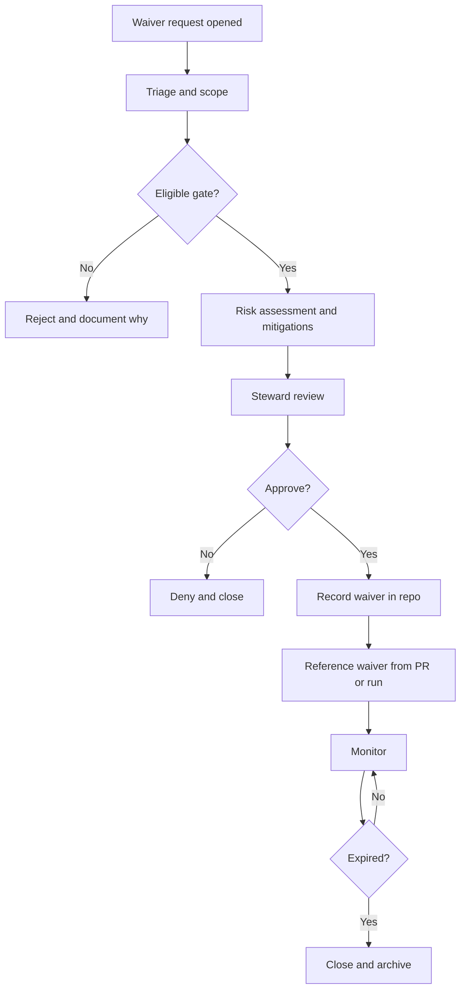

<!-- [KFM_META_BLOCK_V2]
doc_id: kfm://doc/fe0467ec-1454-407c-bc42-2b4415b79bb7
title: Gate Waivers
type: standard
version: v1
status: draft
owners: KFM Governance Stewards
created: 2026-03-02
updated: 2026-03-02
policy_label: public
related:
  - docs/governance/gates/README.md
  - docs/governance/REVIEW_GATES.md
tags: [kfm, governance, gates, waivers]
notes:
  - Waivers are scoped, time-boxed exceptions to automated governance gates.
  - This directory is the canonical record of approved waivers.
[/KFM_META_BLOCK_V2] -->

# Gate Waivers
**Scoped, time-boxed exceptions to governance gates — recorded, reviewable, and auditable.**


---

## Quick navigation
- [Why this exists](#why-this-exists)
- [Where this fits](#where-this-fits)
- [What belongs here](#what-belongs-here)
- [Non-negotiables](#non-negotiables)
- [Waiver eligibility matrix](#waiver-eligibility-matrix)
- [Waiver record format](#waiver-record-format)
- [Process](#process)
- [Enforcement expectations](#enforcement-expectations)
- [Directory layout](#directory-layout)
- [FAQ](#faq)

---

## Why this exists

KFM relies on **automated gates** (CI checks, policy checks, contract validation, promotion rules) to maintain the trust membrane and prevent unsafe promotion/publishing.

A **waiver** is the controlled mechanism for acknowledging a **known, bounded exception** to a gate, without turning the system into “anything goes.”

Waivers exist to support situations like:
- A **time-boxed operational need** (e.g., urgent internal demo) where a non-safety-critical gate cannot be met yet.
- A **temporary tool-chain outage** where a compensating control exists.
- A **planned transition** (e.g., migrating a validator) where both old and new rules briefly conflict.

> **Important:** A waiver does not “make missing information acceptable.”  
> If licensing/sensitivity/citations are unclear, the default posture remains **deny**.

---

## Where this fits

This directory is part of:

- **Governance:** defines how exceptions are reviewed, approved, and expired.
- **Gates:** defines how exceptions are referenced by CI/pipeline/runtime policy.
- **Auditability:** makes every exception traceable to a decision, scope, and mitigation.

Typical lifecycle interaction:
- A gate blocks a PR, run, promotion, or publish action.
- A waiver is proposed *with scope + mitigation + expiry*.
- If approved, the waiver is committed here and referenced by the relevant PR/run/publish operation.
- The waiver expires and is either closed or renewed (with a new decision).

---

## What belongs here

✅ **Acceptable inputs**
- Approved waiver records (YAML or Markdown) with:
  - unique ID
  - explicit scope (what is waived, for which subject, and where it applies)
  - clear reason + risk + mitigations
  - approver(s) and timestamp(s)
  - an expiry (required)
  - links to governance ticket + PR/run/release identifiers (as applicable)

- A lightweight waiver index/registry (optional but recommended) to list active waivers.

✅ **Examples**
- `active/wvr-2026-03-02-catalog-linkcheck.yaml`
- `archive/2026/wvr-2026-01-15-ui-a11y-smokecheck.md`

🚫 **Exclusions (must NOT go here)**
- Secrets, tokens, credentials
- Private or culturally restricted details (e.g., precise site coordinates) not already policy-approved for this repo
- “Permanent waivers” (waivers must expire)
- “Unknown license” or “unknown sensitivity” waivers
- Hand-wavy waivers without mitigations, owners, and rollback plan

---

## Non-negotiables

1. **Fail closed by default**
   - If a waiver is missing, expired, malformed, or out-of-scope, the gate must still block.

2. **Time-boxed**
   - Every waiver has an expiry date/time.
   - Renewals require a *new* review decision.

3. **Scoped**
   - Waivers apply to a specific subject (dataset version, story version, pipeline run, build artifact, etc.)
   - Waivers apply to a specific gate (or gate sub-check), not “all gates.”

4. **Auditable**
   - A waiver must reference a governance ticket and the artifact(s) it affects (PR/run/release), where applicable.

5. **No trust-membrane bypass**
   - Waivers must not enable direct DB/storage access from clients, or bypass policy enforcement boundaries.

---

## Waiver eligibility matrix

Use this matrix as a **default-deny starting point**. If your gate isn’t listed, treat it as **Not waivable** until governance adds a row.

| Gate category | Examples of what it checks | Waivable? | Typical conditions (if allowed) |
|---|---:|---:|---|
| Licensing & rights | license fields present, upstream terms captured | **No** | Never waive “unknown/unclear license.” Use quarantine/metadata-only approaches instead. |
| Sensitivity & redaction | policy_label assigned, redaction obligations defined | **No** | Never waive “unknown sensitivity.” If sensitive, publish generalized derivatives or restrict access. |
| Evidence/citation resolvability | EvidenceRefs resolve; citations are policy-allowed | **Usually no** | Only consider limited internal-only test environments; never for published story/Focus outputs. |
| Identity/versioning determinism | stable IDs, deterministic spec/hash | **Rare** | Only for non-published prototypes; must include migration plan and cutoff date. |
| Catalog validation/linkcheck | DCAT/STAC/PROV validate and cross-link | **Rare** | Allowed only if there’s a compensating control (manual validation) and scope is narrowly bounded. |
| QA thresholds | dataset-specific checks and thresholds | **Sometimes** | Must include risk statement + mitigation, and cannot affect public claims without steward sign-off. |
| Receipts/audit trail | run receipts present; hashes recorded | **Rare** | Prefer “block.” If allowed, waiver must include manual receipt substitute + backfill plan. |
| Performance smoke checks | tile render latency, evidence resolve latency | **Yes** | Short expiry; must not degrade safety; include follow-up ticket. |
| Accessibility smoke checks | keyboard nav, evidence drawer a11y checks | **Yes** | Time-boxed; requires explicit remediation plan and scheduled retest. |
| Supply chain hardening | SBOM, attestations | **Sometimes** | Depends on environment; production publish should require these unless governance decides otherwise. |

---

## Waiver record format

### Canonical fields (YAML)
Waiver files should be small, diff-friendly, and machine-checkable.

**Recommended file naming**
- `wvr-YYYY-MM-DD-<short_slug>.yaml`
- Store in `active/` while valid, then move to `archive/<year>/` when closed/expired.

**Required fields**
- `waiver_id`
- `status` (`proposed` | `approved` | `denied` | `expired` | `revoked`)
- `gate_key` (must match CI/pipeline gate identifier)
- `scope` (explicit subjects + environments)
- `reason`
- `risk` (impact + likelihood)
- `mitigations` (compensating controls)
- `owner` (accountable person/team)
- `approvals` (who approved + when)
- `expires_at` (required)
- `references` (ticket + PR/run/release links/ids as available)

### Template (copy/paste)
```yaml
waiver_id: wvr-2026-03-02-example
status: proposed

gate_key: gate.catalog.triplet_validation  # example; must match enforced gate id/name

scope:
  applies_to:
    - kind: dataset_version
      id: "kfm://dataset/@example_dataset@2026-03.abcd1234"
  environments:
    - "ci"
    - "dev"
  non_goals:
    - "Does not permit promotion to public PUBLISHED surfaces."

reason:
  summary: "Catalog cross-link validator temporarily failing due to validator migration."
  details: >
    Provide a brief explanation of why the gate cannot pass right now and why this is
    time-sensitive.

risk:
  impact: "medium"
  likelihood: "low"
  narrative: >
    Describe user-facing and safety impact. If there is any chance of rights/sensitivity leakage,
    STOP and escalate (do not waiver).

mitigations:
  - "Manual steward review of DCAT/STAC/PROV cross-links before merge."
  - "Run linkcheck locally and attach output to governance ticket."
  - "Limit scope to dev/ci; do not promote to public surfaces."

rollback_plan:
  - "Revert PR introducing waiver."
  - "Block promotions if validator migration not complete by expiry."

owner:
  team: "KFM Governance Stewards"
  primary_contact: "TODO: @handle"

approvals:
  - role: "steward"
    principal: "TODO: @approver"
    approved_at: "2026-03-02T00:00:00Z"
    decision: "approved"
    notes: "Time-boxed to 7 days; must not affect public publish lane."

expires_at: "2026-03-09T00:00:00Z"

references:
  governance_ticket: "TODO: link-or-id"
  pr: "TODO: link-or-id"
  run_ids: []
  releases: []
```

---

## Process

### Flow


### Step-by-step checklist
1. **Open a governance ticket**
   - State the blocked gate and paste the failing logs.
   - Propose a scope and expiry.
2. **Draft the waiver file**
   - Put it under `active/` with `status: proposed`.
3. **Steward review**
   - Confirm it is not a rights/sensitivity/citation bypass.
   - Confirm mitigation + rollback plan are credible.
4. **Approve**
   - Update `status: approved` and add approval metadata.
5. **Use it**
   - Reference `waiver_id` from the PR/run/publish mechanism (implementation-specific).
6. **Expire**
   - On expiry: close and move to archive (or renew via new waiver + decision).

---

## Enforcement expectations

This README does not assume a specific implementation, but governance expectations are:

- CI/pipeline gates should treat waivers as **data**:
  - machine-validated schema
  - checked for expiry
  - checked for scope match
  - checked for required approvals

- Waivers should be visible in audit trails:
  - If a run/publish relied on a waiver, the waiver ID should be recorded alongside the run receipt / release manifest (where applicable).

- Waivers should not be silent:
  - If a waiver is active, surfaces should prefer “yellow” / “exception in effect” UX affordances over “green.”

---

## Directory layout

> This is the intended structure for this directory. Keep it small and auditable.

```text
docs/governance/gates/waivers/
  README.md
  active/
    wvr-YYYY-MM-DD-<slug>.yaml
  archive/
    2026/
      wvr-YYYY-MM-DD-<slug>.yaml
  templates/
    waiver.template.yaml
```

---

## FAQ

### Can I waive an “unknown license” dataset?
No. If licensing is unclear, keep it in quarantine and resolve licensing first.

### Can I waive sensitivity classification?
No. Sensitivity uncertainty is not a paperwork issue — it is a harm risk.

### Are waivers forever?
No. Waivers must expire. If something needs to be permanent, it needs a **policy change** (with review, tests, and documentation), not a waiver.

### What’s the difference between a waiver and a policy change?
- **Waiver:** local, scoped exception for a bounded time; reduces risk while unblocking work.
- **Policy change:** a new steady-state rule; must be encoded in gates and tests.

---

<a id="back-to-top"></a>
**Back to top:** [Quick navigation](#quick-navigation)
