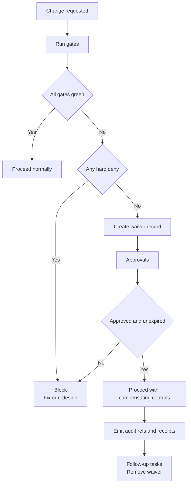

<!-- [KFM_META_BLOCK_V2]
doc_id: kfm://doc/7d7f6b3c-6b5a-4f8b-ae3b-0d3e7a3f3dd2
title: Waiver Policy
type: standard
version: v1
status: draft
owners: TBD (Governance)
created: 2026-03-02
updated: 2026-03-02
policy_label: internal
related:
  - docs/governance/ROOT_GOVERNANCE.md
  - docs/governance/gates/README.md
  - docs/governance/gates/waivers/TEMPLATE__WAIVER_REQUEST.yml
  - policy/ (policy-as-code gates; OPA/Rego)
tags: [kfm, governance, gates, waivers]
notes:
  - This policy defines when and how KFM gate waivers are allowed.
  - Waivers are time-boxed, explicit, and auditable; they must never silently weaken the trust membrane.
[/KFM_META_BLOCK_V2] -->

# Waiver Policy
Evidence-first rules for requesting, approving, recording, and expiring *gate waivers* across KFM.

[](#)
[](#)
[](#)
[](#)
[](#)

**Where this fits:** `docs/governance/gates/waivers/WAIVER_POLICY.md`

---

## Quick navigation
- [Purpose](#purpose)
- [Scope](#scope)
- [Non-goals](#non-goals)
- [Definitions](#definitions)
- [Non-negotiable invariants](#non-negotiable-invariants)
- [Waiver eligibility](#waiver-eligibility)
- [Process](#process)
- [Approval matrix](#approval-matrix)
- [Recording and audit requirements](#recording-and-audit-requirements)
- [Expiry, renewal, and revocation](#expiry-renewal-and-revocation)
- [Implementation guidance](#implementation-guidance)
- [Templates](#templates)
- [FAQs](#faqs)

---

## Purpose
KFM gates exist to enforce the trust membrane and the promotion contract. A **waiver** is a controlled exception that allows a change to proceed *despite a gate failure*, under strict conditions.

This policy ensures waivers are:
- **Rare** (exception, not the norm)
- **Explicit** (never implicit, never “just do it”)
- **Time-boxed** (expires automatically)
- **Auditable** (recorded with enough context to reproduce and review)
- **Reversible** (paired with rollback and follow-up work)

[Back to top](#quick-navigation)

---

## Scope
This policy applies to waivers that would otherwise block:
- **PR merge** (CI / contract / policy gates)
- **Dataset promotion** (RAW → WORK → PROCESSED → CATALOG → PUBLISHED)
- **Story publishing** (review + citation/evidence gates)
- **Governed AI operations** (Focus Mode citation verification and policy checks)

[Back to top](#quick-navigation)

---

## Non-goals
Waivers are **not**:
- A way to bypass policy, licensing, or sensitive-data protections
- A permanent exemption (use policy changes + tests instead)
- A substitute for fixing broken tooling, missing metadata, or missing evidence
- A mechanism for UI/clients to “override” governance (clients never make policy decisions)

[Back to top](#quick-navigation)

---

## Definitions

| Term | Meaning |
|---|---|
| **Gate** | An automated (or automated+manual) check that blocks merge/promotion/publish when requirements are unmet. |
| **Waiver** | A time-limited, approved exception that allows an action to proceed despite specific gate failures. |
| **Waiver record** | A versioned artifact (YAML/JSON/MD) capturing the waiver’s scope, rationale, risk acceptance, approvals, and expiry. |
| **Compensating controls** | Additional safeguards required when approving a waiver (e.g., constrained release scope, manual review, rollback plan). |
| **Fail-closed** | If the system cannot verify a requirement, it denies/blocks by default. |

[Back to top](#quick-navigation)

---

## Non-negotiable invariants

### Confirmed invariants
These are system-level invariants that **waivers must not undermine**:

1) **Fail-closed by default.** Gates are designed to block unsafe or untraceable changes unless explicitly allowed.  
2) **Same policy semantics in CI and runtime.** If CI and runtime don’t agree, CI guarantees are meaningless.  
3) **Default deny for sensitive/restricted content; prevent leakage.** If something is restricted, do not “waive it public.”  
4) **Licensing and rights are enforcement inputs, not paperwork.** Promotion and publishing require clear rights/attribution.  
5) **Evidence-first citations are hard-gated.** Story publishing and Focus Mode require resolvable, policy-allowed citations; otherwise the system must reduce scope or abstain.

### Practical consequence
A waiver may *permit a specific action* (e.g., merge, promotion to WORK, publication of a temporary preview), but it must not create a path where:
- restricted content becomes public,
- rights/permissions are unclear,
- provenance/evidence cannot be reconstructed,
- or policy denies are silently ignored.

[Back to top](#quick-navigation)

---

## Waiver eligibility

### Waiver classes
KFM distinguishes between three categories of gate outcomes:

| Gate class | Default action | Waiver allowed? | Typical examples |
|---|---:|---:|---|
| **Hard deny** | Block | **No** | Sensitive-data restrictions, rights/license unknown, policy deny, signature/attestation invalid, kill-switch active |
| **Waivable deny** | Block | **Yes (rare)** | Non-safety-critical completeness gaps with documented mitigation and time-boxing |
| **Advisory** | Warn | Not needed | Non-blocking lint, informational checks |

> **Rule:** If you’re unsure whether a gate is Hard deny or Waivable deny, treat it as **Hard deny**.

### Non-waivable cases (Hard deny)
A waiver **MUST NOT** be used to bypass any of the following:
- **Policy denies** that protect restricted/sensitive data
- **Rights/license ambiguity** for data or media intended for distribution
- **Signature/attestation verification failures**
- **Missing critical identifiers** (dataset/version IDs) required to trace artifacts
- **Kill-switch** conditions intended to stop shipping
- **Any attempt to downgrade classification** (restricted → public) without a policy-approved transform and review

### Waivable cases (Waivable deny)
A waiver **MAY** be considered when:
- The failure is **operational** (tool outage, transient upstream availability) and does not change the trust posture
- The failure is **bounded** (known impact, constrained scope, explicit rollback)
- There is a **short-lived need** (e.g., to unblock a migration, restore service, or ship a minimal fix)
- There is a clear **follow-up issue** with an owner and deadline

[Back to top](#quick-navigation)

---

## Process

### Overview flow


### Step 1 — Diagnose the gate failure
Before requesting a waiver, identify:
- The exact **gate(s)** failing (gate IDs / rule names)
- Whether the failure is **Hard deny** or **Waivable deny**
- The **blast radius** (which datasets, environments, users, or publish surfaces are affected)

### Step 2 — Create a waiver record
A waiver request must be a **reviewable artifact** committed alongside the change.

**Proposed repo location**
- `docs/governance/gates/waivers/records/<waiver_id>.yml`

**Proposed requirement**
- Waivers are **machine-readable** (YAML/JSON) so CI/runtime can evaluate expiry, scope, and approvals.

### Step 3 — Add compensating controls
A waiver request must include at least:
- **Rollback plan** (what “undo” looks like and how fast it can happen)
- **User-visible labeling** (if the output is externally visible, label it as waived/limited)
- **Scope limits** (e.g., only WORK zone, only internal preview, only a single dataset_version_id)
- **Follow-up issue** with an owner and deadline

### Step 4 — Obtain approvals
Approvals must be explicit and attributable to people/roles (not “LGTM in chat”).

### Step 5 — Record the waiver in audit artifacts
Any governed operation executed under a waiver must record:
- `waiver_id`
- the gate failures being waived
- approval references
- expiry timestamp
- compensating controls applied
- outputs by digest (so rollback and review are possible)

[Back to top](#quick-navigation)

---

## Approval matrix

> **NOTE:** Exact teams/roles may vary. The table below is a **proposed minimum** until mapped to CODEOWNERS / governance roles.

| Waiver scope | Required approvals (minimum) | Additional required approvals (when applicable) |
|---|---|---|
| CI merge waiver (code/doc tooling) | Maintainer (repo) | Security owner if it affects secrets/scans |
| Promotion waiver (RAW→WORK / WORK→PROCESSED) | Data steward + Maintainer | Governance reviewer if it changes public surfaces |
| Publish waiver (CATALOG→PUBLISHED) | Governance reviewer + Maintainer | Legal/rights reviewer if media/data rights are involved |
| Story publish waiver | Story reviewer + Maintainer | Rights reviewer if any media attribution is unclear |

[Back to top](#quick-navigation)

---

## Recording and audit requirements

### Waiver record must include
| Field | Required | Notes |
|---|---:|---|
| `waiver_id` | ✅ | Stable ID (used in receipts, logs, PR references) |
| `requested_by` | ✅ | Person or service principal |
| `scope` | ✅ | PR merge, promotion step, story publish, focus run, etc. |
| `gate_ids` | ✅ | List of gates being waived (rule IDs) |
| `rationale` | ✅ | Why this waiver is needed now |
| `risk_assessment` | ✅ | What can go wrong, and impact |
| `compensating_controls` | ✅ | Specific safeguards (not “be careful”) |
| `expiry` | ✅ | Time-boxed; must not be open-ended |
| `approvals` | ✅ | Names/roles + timestamps + references |
| `follow_up` | ✅ | Issue/ticket + deadline to remove waiver |

### Audit artifacts must reference waiver state
When an operation proceeds under a waiver, the resulting receipt/log/audit record must include:
- **who / what / when / why**
- inputs and outputs **by digest**
- policy decisions (allow/deny + obligations + reason codes)
- `waiver_id` and expiry
- a policy-safe error model (no restricted leakage)

[Back to top](#quick-navigation)

---

## Expiry, renewal, and revocation

### Expiry (required)
- Every waiver has an **expiry timestamp**.
- Expired waivers are treated as **not present**.
- CI/runtime should fail closed if a waiver record is malformed or expired.

### Renewal (discouraged)
Renewals should be rare. If renewal is needed:
- Create a **new waiver record** (do not “extend in place” without a new review trail).
- Escalate approval level (e.g., governance review).

### Revocation (always allowed)
Any approver may revoke a waiver if:
- risk changes,
- new information arises,
- abuse is suspected,
- or the compensating controls are not being followed.

Revocation triggers:
- immediate re-blocking of gates where possible,
- rollback/execution of incident response steps as applicable.

[Back to top](#quick-navigation)

---

## Implementation guidance

### Policy-as-code alignment
Waivers must be evaluated with the **same semantics** wherever gates run:
- CI (PR checks)
- Promotion tooling
- Runtime API enforcement (if applicable)
- Evidence resolver / story publishing

### Recommended evaluation approach (proposed)
- Keep gates strict: `deny[...]` remains `deny[...]`.
- Add a second layer that can convert specific `deny` messages into *allowed-with-waiver* **only when**:
  - a matching waiver record exists,
  - it is in-scope for the current action,
  - it is approved,
  - it is unexpired,
  - and the gate is not classified as Hard deny.

### Directory layout (proposed)
```text
docs/governance/gates/waivers/
  WAIVER_POLICY.md
  TEMPLATE__WAIVER_REQUEST.yml
  records/
    waiver-YYYYMMDD-<slug>.yml
```

[Back to top](#quick-navigation)

---

## Templates

### TEMPLATE__WAIVER_REQUEST.yml (copy/paste)
```yaml
waiver_id: waiver-YYYYMMDD-short-slug
status: requested  # requested|approved|rejected|revoked|expired
requested_by:
  name: ""
  role: ""
  contact: ""
scope:
  kind: pr_merge  # pr_merge|promotion|publish|story_publish|focus_run
  target:
    repo_path: ""
    dataset_id: ""
    dataset_version_id: ""
gate_ids:
  - ""
rationale: ""
risk_assessment:
  summary: ""
  impact: ""
  likelihood: ""
compensating_controls:
  - ""
expiry:
  at: "YYYY-MM-DDTHH:MM:SSZ"
approvals:
  - name: ""
    role: ""
    at: "YYYY-MM-DDTHH:MM:SSZ"
    reference: ""  # PR link, issue ID, etc.
follow_up:
  issue: ""
  owner: ""
  due: "YYYY-MM-DD"
notes: []
```

### Example (approved waiver)
```yaml
waiver_id: waiver-20260302-example-doc-lint
status: approved
requested_by:
  name: "TBD"
  role: "Maintainer"
  contact: "TBD"
scope:
  kind: pr_merge
  target:
    repo_path: "docs/"
    dataset_id: ""
    dataset_version_id: ""
gate_ids:
  - "docs_linkcheck"
rationale: "Link checker is failing due to upstream outage; docs change is otherwise safe."
risk_assessment:
  summary: "Broken links may ship temporarily."
  impact: "Low"
  likelihood: "Medium"
compensating_controls:
  - "Re-run linkcheck within 48h; block subsequent merges if still failing."
  - "Open follow-up issue to re-enable required status check."
expiry:
  at: "2026-03-05T00:00:00Z"
approvals:
  - name: "TBD"
    role: "Repo Maintainer"
    at: "2026-03-02T00:00:00Z"
    reference: "PR#TBD"
follow_up:
  issue: "ISSUE#TBD"
  owner: "TBD"
  due: "2026-03-04"
notes: []
```

[Back to top](#quick-navigation)

---

## FAQs

### Can we waive licensing if it’s “probably OK”?
No. Rights/license ambiguity is a Hard deny.

### Can we waive sensitive-location protections for a research preview?
Not through this mechanism. Use approved generalization/redaction transforms and policy review.

### Can we waive citation verification for a Story or Focus Mode answer?
No. Evidence/citation verification is a hard gate. If citations can’t be verified, reduce scope or abstain.

### Are waivers permanent?
No. Waivers expire and must be removed.

[Back to top](#quick-navigation)
