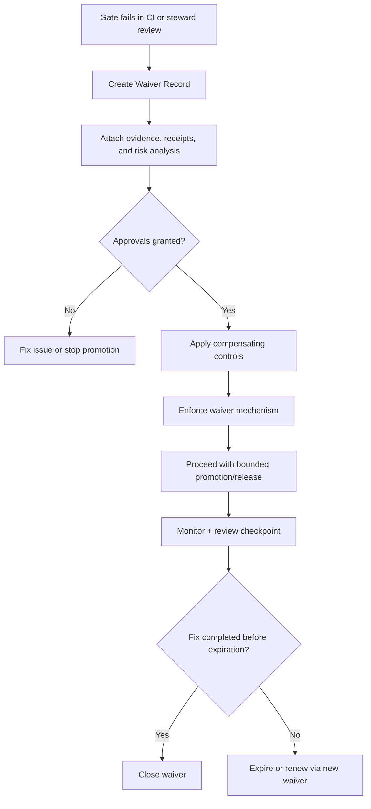

<!-- [KFM_META_BLOCK_V2]
doc_id: kfm://doc/f6f5a7f5-889e-4f59-9ea6-f712d6494058
title: Waiver Record Template
type: standard
version: v1
status: draft
owners: <team-or-names>
created: 2026-03-02
updated: 2026-03-02
policy_label: internal
related:
  - docs/governance/gates/README.md
tags: [kfm, governance, gates, waivers, template]
notes:
  - Template for documenting a time-limited waiver (exception) to a governance gate.
  - This record is an auditable artifact; it should be versioned and reviewed like code.
[/KFM_META_BLOCK_V2] -->

<a id="top"></a>

# Waiver Record (Template)

**Purpose:** a governed, evidence-backed record for a **time-limited exception** to a KFM governance gate (e.g., a Promotion Contract gate, story publishing gate, or operational acceptance gate).

> **WARNING**
> A waiver is **not** a “skip the rules” button. It is a **documented risk acceptance** with explicit scope, approvals, compensating controls, and an expiration date.


<!-- TODO: replace generic badges with repo/CI badges once paths are confirmed. -->

## Quick links

- [When to use](#when-to-use)
- [Non-negotiables](#non-negotiables)
- [Waiver summary](#waiver-summary)
- [Gate(s) and scope](#gates-and-scope)
- [Risk assessment](#risk-assessment)
- [Compensating controls](#compensating-controls)
- [Evidence and attachments](#evidence-and-attachments)
- [Approvals and decision](#approvals-and-decision)
- [Implementation and monitoring](#implementation-and-monitoring)
- [Closeout](#closeout)
- [Appendix: machine-readable waiver record](#appendix-machine-readable-waiver-record)

---

## When to use

Use this record when you need to **ship** despite a known, documented governance failure **and** you have:
- a clear, bounded **scope** (what is affected, and what is not),
- explicit **owners and approvers**,
- **evidence** of the failure and its impact,
- documented **compensating controls**,
- a concrete **fix-forward plan** with dates,
- a hard **expiration** (auto-revoke is preferred).

If you can fix the issue quickly, do that instead.

---

## Non-negotiables

- **Time-limited:** every waiver MUST include an expiration date/time.
- **Scope-limited:** the waiver MUST name exact targets (dataset_version_id, release id, PR, artifacts by digest) rather than a broad “anything in this subsystem”.
- **Evidence-first:** attach receipts, logs, and validation results; avoid “trust me” narratives.
- **Policy-safe:** this record may contain sensitive information; keep it `policy_label: internal` unless explicitly approved otherwise.
- **Reversible:** include rollback/disable steps; favor a kill-switch / revoke mechanism that fails closed.

---

## Waiver summary

> Fill this section first; reviewers should understand the waiver in <2 minutes.

| Field | Value |
|---|---|
| **Waiver ID** | `kfm://waiver/<uuid>` |
| **Title** | `<short, specific title>` |
| **Status** | `proposed` \| `approved` \| `denied` \| `expired` \| `revoked` \| `superseded` |
| **Created (YYYY-MM-DD)** | 2026-03-02 |
| **Last Updated (YYYY-MM-DD)** | 2026-03-02 |
| **Requested by** | `<name + role>` |
| **Owning team** | `<team>` |
| **Primary approver (steward)** | `<name>` |
| **Secondary approvers** | `<security/legal/ops/etc as needed>` |
| **Priority / urgency** | `low` \| `medium` \| `high` \| `emergency` |
| **Expiration (ISO 8601)** | `<YYYY-MM-DDTHH:MM:SSZ>` |
| **Review checkpoint (ISO 8601)** | `<YYYY-MM-DDTHH:MM:SSZ>` |
| **Related ticket(s)** | `<issue ids / links>` |
| **Related PR(s)** | `<PR link(s)>` |
| **Affected runtime surface** | `published` \| `internal only` \| `story` \| `api` \| `ops` \| `other` |

---

## Gates and scope

### 1) What gate(s) are affected?

> Check all that apply; include the exact failing check output in the Evidence section.

**Promotion Contract gate(s) (if applicable):**
- [ ] **Gate A — Identity & versioning**
- [ ] **Gate B — Licensing & rights metadata**
- [ ] **Gate C — Sensitivity classification & redaction plan**
- [ ] **Gate D — Catalog triplet validation (DCAT/STAC/PROV)**
- [ ] **Gate E — QA & thresholds**
- [ ] **Gate F — Run receipt & audit record**
- [ ] **Gate G — Release manifest / promotion manifest**

**Other gate(s) (if applicable):**
- [ ] Story publishing gate
- [ ] Ops acceptance gate
- [ ] Security gate
- [ ] Other: `<name>`

### 2) Exact scope (fail closed outside scope)

> Waivers MUST enumerate explicit identifiers. Prefer by-digest and versioned IDs.

| Scope dimension | Value(s) |
|---|---|
| **dataset_id** | `kfm://dataset/<slug>` |
| **dataset_version_id(s)** | `<e.g., 2026-03.abcd1234>` |
| **run_id(s)** | `kfm://run/<...>` |
| **release/promotion manifest id** | `kfm://release/<...>` |
| **artifact digest(s)** | `sha256:<...>` |
| **artifact zone(s)** | `raw` \| `work` \| `processed` \| `catalog` \| `published` |
| **API endpoints impacted** | `<list>` |
| **UI surfaces impacted** | `<list>` |

### 3) Why is a waiver needed?

- **User-visible outcome if blocked:** `<what users cannot do / what deadlines are missed>`
- **Why this cannot be fixed before ship:** `<constraints>`
- **Why this is acceptable temporarily:** `<bounded risk argument>`

---

## Risk assessment

> Be concrete. If you cannot explain the risk, you cannot responsibly accept it.

### 1) Risk summary (one paragraph)

<Write a short paragraph describing what could go wrong, who is affected, and how we would detect it.>

### 2) Risk matrix

| Risk area | Severity (L/M/H) | Likelihood (L/M/H) | Notes |
|---|---:|---:|---|
| Trust / provenance |  |  |  |
| Safety / sensitive locations |  |  |  |
| Privacy / PII |  |  |  |
| Licensing / rights |  |  |  |
| Security |  |  |  |
| Operational stability |  |  |  |
| User experience / correctness |  |  |  |

### 3) “Blast radius” statement

- **What this waiver can affect:** `<explicit>`
- **What this waiver cannot affect:** `<explicit>`
- **How we enforce the boundary:** `<mechanism>` (e.g., by-digest allow-list, policy decision constraint, environment constraint, etc.)

---

## Compensating controls

> List controls that reduce harm while the waiver is active.

- [ ] **Access restriction:** e.g., keep surface internal-only; require elevated role.
- [ ] **Generalization/redaction:** remove/obfuscate fields or geometry; publish `public_generalized` variant.
- [ ] **Extra validation:** add targeted tests; run manual review; add “golden query” checks.
- [ ] **Monitoring / alerts:** add telemetry; alert on error rate, policy denials, suspicious access.
- [ ] **Kill switch:** ability to revoke/disable quickly (minutes, not days).
- [ ] **User-facing disclosure:** badges/notices in UI describing limitation or generalization.
- [ ] Other: `<control>`

---

## Evidence and attachments

> Attach or link to the exact artifacts that justify the waiver. Prefer immutable (by digest) references.

### 1) Gate failure evidence (required)

- **CI log excerpt / failing check output:**  
  `<paste or link>`

- **Reproduction steps (minimal):**  
  1. `<step>`
  2. `<step>`

### 2) Required evidence pointers (fill all that apply)

- **Run receipt(s):** `kfm://run/<...>` or file path(s): `<...>`
- **Audit reference(s):** `kfm://audit/entry/<...>` (or equivalent)
- **Policy decision id (if any):** `kfm://policy_decision/<...>`
- **Catalog validation report digest(s):** `sha256:<...>`
- **QA report digest(s):** `sha256:<...>`
- **License snapshot / rights evidence:** `<link or digest>`
- **Diff / “what changed” report:** `<link or digest>`
- **Security review notes:** `<link or digest>`

### 3) Attachments checklist

- [ ] Receipt(s) included and schema-valid
- [ ] Evidence is policy-safe (no restricted leakage)
- [ ] Links are stable (prefer digests / immutable refs)
- [ ] Remediation plan ticket(s) created
- [ ] Rollback / revoke steps tested

---

## Approvals and decision

> A waiver is valid only after explicit approval by required roles.

### 1) Required approvers (fill as appropriate)

| Role | Name | Decision | Date | Notes |
|---|---|---|---|---|
| Requestor |  |  |  |  |
| Data Steward / Governor |  | approve / deny |  |  |
| Policy / Security |  | approve / deny |  |  |
| Legal / Rights (if license impacted) |  | approve / deny |  |  |
| Ops / SRE (if runtime impacted) |  | approve / deny |  |  |

### 2) Final decision

- **Decision:** `approved` \| `denied`
- **Decision timestamp:** `<YYYY-MM-DDTHH:MM:SSZ>`
- **Decision rationale:** `<why>`
- **Conditions of approval (if any):**
  - `<condition 1>`
  - `<condition 2>`

---

## Implementation and monitoring

### 1) How the waiver is enforced (mechanism)

> Describe the concrete control that makes the waiver **machine-checkable** and **time-limited**.

- **Mechanism type:** `policy allow-list` \| `CI waiver check` \| `runtime feature flag` \| `manual steward hold` \| `other`
- **Where it lives:** `<path, config, policy package, etc.>`
- **How it is bounded:** `<dataset_version_id / digest / env>`
- **How expiration is enforced:** `<auto-fail in CI / auto-disable flag / scheduled job>`
- **Rollback / revoke steps:**  
  1. `<step>`
  2. `<step>`

### 2) Monitoring plan (while active)

- **Signals to watch:** `<metric/event>`
- **Alert thresholds:** `<thresholds>`
- **On-call / responsible owner:** `<name/team>`
- **Review cadence:** `<daily/weekly>` until resolved

---

## Closeout

### 1) Fix-forward plan (required)

> These are the tasks that remove the need for the waiver.

| Task | Owner | Due date | Status | Link |
|---|---|---:|---|---|
| Root cause fix |  |  |  |  |
| Add/repair tests |  |  |  |  |
| Backfill receipts/catalogs |  |  |  |  |
| Post-incident review (if needed) |  |  |  |  |

### 2) Closeout record

- **Waiver resolved by:** `<name>`
- **Resolved timestamp:** `<YYYY-MM-DDTHH:MM:SSZ>`
- **Resolution outcome:** `fixed` \| `expired` \| `revoked` \| `superseded`
- **Notes:** `<what changed, what we learned>`

---

## Waiver lifecycle



---

## Appendix: machine-readable waiver record

> Optional but recommended: keep a machine-readable block for automation (CI checks, expiry enforcement).

```yaml
waiver_record_v1:
  waiver_id: "kfm://waiver/<uuid>"
  title: "<short title>"
  status: "proposed"  # proposed|approved|denied|expired|revoked|superseded
  created: "2026-03-02"
  updated: "2026-03-02"
  requested_by:
    principal: "<name-or-service>"
    role: "<role>"
  owners: ["<team-or-names>"]
  expires_at: "<YYYY-MM-DDTHH:MM:SSZ>"
  review_at: "<YYYY-MM-DDTHH:MM:SSZ>"
  scope:
    dataset_id: "kfm://dataset/<slug>"
    dataset_version_ids: ["<...>"]
    run_ids: ["kfm://run/<...>"]
    release_ids: ["kfm://release/<...>"]
    artifact_digests: ["sha256:<...>"]
    artifact_zones: ["processed", "catalog", "published"]
  gates:
    promotion_contract: ["A", "D"]   # example
    other: ["story_publish"]
  risk:
    severity: "medium"
    likelihood: "low"
    areas: ["trust", "ops"]
  compensating_controls:
    - type: "access_restriction"
      detail: "internal-only until fixed"
  evidence:
    run_receipts: ["kfm://run/<...>"]
    audit_refs: ["kfm://audit/entry/<...>"]
    policy_decisions: ["kfm://policy_decision/<...>"]
    reports:
      - kind: "qa"
        digest: "sha256:<...>"
      - kind: "catalog_validation"
        digest: "sha256:<...>"
  approvals:
    - role: "data_steward"
      name: "<name>"
      decision: "approve"
      at: "<YYYY-MM-DDTHH:MM:SSZ>"
    - role: "security"
      name: "<name>"
      decision: "approve"
      at: "<YYYY-MM-DDTHH:MM:SSZ>"
  implementation:
    mechanism_type: "ci_waiver_check"
    location: "docs/governance/gates/waivers/<path>"
    bounded_by: ["dataset_version_id", "artifact_digest"]
    expiry_enforced_by: "ci"
  closeout:
    fix_ticket: "<id/link>"
    outcome: "<fixed|expired|revoked|superseded>"
```

---

<a href="#top">Back to top</a>
