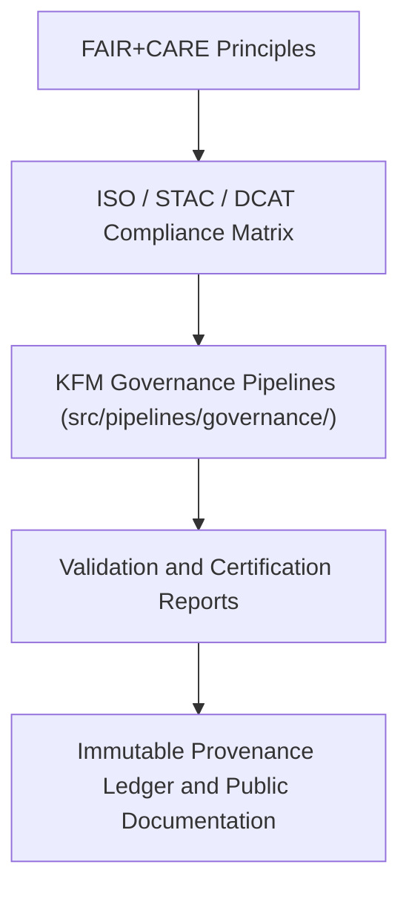

<div align="center">

# 🧩 Kansas Frontier Matrix — **Governance Matrix & Standards Alignment**
`docs/governance/governance-matrix.md`

**Purpose:**  
Provides the unified **crosswalk of FAIR+CARE, ISO, STAC, DCAT, and MCP-DL governance standards** for the Kansas Frontier Matrix (KFM).  
This matrix ensures that all KFM systems, datasets, and AI processes maintain traceable alignment with ethical, legal, and technical frameworks for open science and sustainable digital governance.

[](../../docs/standards/faircare-validation.md)
[]()
[]()
[](../../LICENSE)

</div>

---

## 📚 Overview

The **KFM Governance Matrix** operationalizes the relationship between **FAIR+CARE principles** and technical governance standards such as ISO, DCAT, STAC, and MCP-DL.  
It provides a transparent alignment model for ethics, provenance, and interoperability, ensuring that all workflows are auditable, reusable, and sustainably governed.

This document functions as both:
- A **cross-reference** between ethical and technical governance frameworks.  
- A **compliance map** for audits, certification, and documentation review.  

---

## 🧠 Standards Integration Map

| Governance Framework | Purpose | Domain Application | Managed By |
|-----------------------|----------|--------------------|-------------|
| **FAIR Principles** | Open data ethics and interoperability. | Data architecture, validation, publication. | @kfm-fair |
| **CARE Principles** | Indigenous and community data sovereignty. | Historical archives, oral histories, governance review. | @faircare-council |
| **ISO 19115** | Geospatial metadata and lineage documentation. | Climate, hazards, hydrology layers. | @kfm-data |
| **ISO 37000** | Governance of organizations and ethical management. | Governance Council operations and audits. | @kfm-governance |
| **ISO 14064** | Environmental sustainability and carbon tracking. | Telemetry and energy metrics. | @kfm-sustainability |
| **DCAT 3.0** | Dataset catalog interoperability and metadata schema. | Processed data and open-data publication. | @kfm-data |
| **STAC 1.0.0** | Spatiotemporal dataset cataloging for Earth observation. | Hazard and climate layers. | @kfm-architecture |
| **MCP-DL v6.3** | Documentation lifecycle and reproducible governance. | Entire repository. | @kfm-architecture |

---

## ⚙️ Governance Alignment Matrix

| FAIR+CARE Principle | ISO / STAC / DCAT Alignment | KFM Implementation |
|----------------------|------------------------------|--------------------|
| **Findable** | ISO 19115: Metadata Identification / DCAT Dataset | Indexed datasets with metadata JSON and manifest entries. |
| **Accessible** | ISO 37000: Governance Transparency / DCAT Distribution | Public FAIR+CARE documentation under MIT License. |
| **Interoperable** | STAC 1.0 / DCAT 3.0 Schema / ISO 19115 | Harmonized metadata across all catalogs. |
| **Reusable** | ISO 19115 Lineage / FAIR R1 | Version-controlled datasets with governance lineage. |
| **Collective Benefit** | CARE C1 / ISO 37000 Stakeholder Inclusion | Community engagement and ethical use audits. |
| **Authority to Control** | CARE A1 / ISO 37000 Accountability | Governance Council voting and ledger traceability. |
| **Responsibility** | ISO 37000 Ethical Accountability / ISO 14064 Environmental Duty | Transparent reporting and sustainability review. |
| **Ethics** | ISO 37000 Ethics Clause / MCP-DL Compliance | Ethical oversight via FAIR+CARE Council certification. |

---

## 🧮 Example Governance Alignment Record

```json
{
  "governance_id": "governance_alignment_2025Q4",
  "frameworks": {
    "FAIR": ["F1", "F2", "A1", "I3", "R1"],
    "CARE": ["C1", "A1", "R1", "E1"],
    "ISO": ["19115", "37000", "14064"],
    "DCAT": ["3.0"],
    "STAC": ["1.0.0"]
  },
  "validation_status": "aligned",
  "audited_by": "@kfm-governance",
  "verified_by": "@faircare-council",
  "timestamp": "2025-11-03T18:00:00Z"
}
```

Governance records synchronized with:
`releases/v9.6.0/governance/ledger_snapshot_2025Q4.json`

---

## 🧭 Governance Data Flow Overview



### Data Flow Summary
1. **Principle Mapping:** FAIR+CARE crosswalk established with ISO, DCAT, and STAC standards.  
2. **Compliance Verification:** Automated audits validate standard alignment.  
3. **Ledger Registration:** Certification logs stored in provenance ledgers.  
4. **Publication:** Reports and manifests shared in governance releases.  

---

## ⚖️ Governance Integration Tools

| Tool / Workflow | Function | Standard Aligned |
|------------------|-----------|------------------|
| `src/pipelines/governance/ledger_update.py` | Syncs provenance ledgers with validation reports. | ISO 19115 / FAIR |
| `src/pipelines/validation/schema_validation.py` | Validates schema conformance to DCAT / STAC. | FAIR / DCAT 3.0 |
| `src/pipelines/telemetry/focus_metrics_collector.py` | Tracks governance telemetry and environmental metrics. | ISO 14064 |
| `src/pipelines/governance/checksum_registry.py` | Ensures file-level traceability and cryptographic integrity. | ISO 19115 / MCP-DL |

---

## 🌱 Sustainability Alignment (ISO 14064 + FAIR+CARE)

| Metric | Description | Governance Application |
|---------|--------------|------------------------|
| **Energy Tracking** | Telemetry metrics for each governance workflow. | focus-telemetry.json |
| **Carbon Reporting** | Emissions calculated for all validation pipelines. | sustainability_audit.json |
| **FAIR+CARE Ethics Audits** | Quarterly review for social and environmental equity. | data/reports/fair/data_care_assessment.json |
| **Open Publication** | Governance and ethics reports shared publicly. | releases/governance/ |

---

## 🧠 Governance Compliance Verification

| Checkpoint | Validation Standard | Responsible Party |
|-------------|---------------------|-------------------|
| **Metadata Schema Alignment** | DCAT 3.0 / STAC 1.0.0 | @kfm-data |
| **Provenance Traceability** | ISO 19115 / MCP-DL | @kfm-governance |
| **Ethical Certification** | FAIR+CARE | @faircare-council |
| **Sustainability Verification** | ISO 14064 | @kfm-sustainability |
| **Accessibility Validation** | ISO 9241-210 / WCAG 2.2 | @kfm-accessibility |

All checkpoints automated via `governance_matrix_sync.yml`.

---

## 🧾 Internal Use Citation

```text
Kansas Frontier Matrix (2025). Governance Matrix & Standards Alignment (v9.6.0).
Maps FAIR+CARE, ISO, STAC, DCAT, and MCP-DL frameworks into a unified governance model ensuring transparent, ethical, and sustainable open data stewardship.
Establishes audit-ready alignment between ethical principles and technical compliance systems.
```

---

## 🧾 Version Notes

| Version | Date | Notes |
|----------|------|--------|
| v9.6.0 | 2025-11-03 | Expanded ISO 14064 and ISO 37000 governance mapping with FAIR+CARE integration. |
| v9.5.0 | 2025-11-02 | Added automated compliance crosswalk generation via pipeline sync. |
| v9.3.2 | 2025-10-28 | Established baseline FAIR+CARE to ISO alignment framework. |

---

<div align="center">

**Kansas Frontier Matrix** · *Integrated Governance × FAIR+CARE Ethics × Standards Compliance*  
[🔗 Repository](https://github.com/bartytime4life/Kansas-Frontier-Matrix) • [⚖️ Governance Docs](./README.md) • [🧭 Standards](../standards/governance/DATA-GOVERNANCE.md)

</div>

