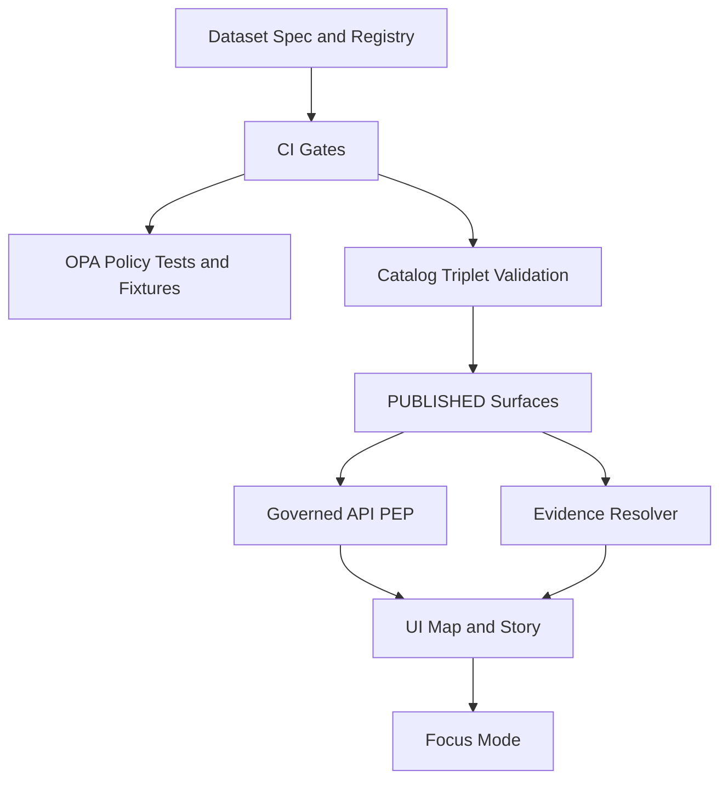

<!-- [KFM_META_BLOCK_V2]
doc_id: kfm://doc/8d8a5d77-75b9-4a10-bdb5-3b8eb6db2b3f
title: Policy Label Taxonomy
type: standard
version: v1
status: draft
owners: KFM Governance Stewards
created: 2026-03-02
updated: 2026-03-02
policy_label: public
related:
  - docs/governance/README.md
  - docs/governance/policy-as-code/README.md
  - docs/governance/labels/OBLIGATIONS_TAXONOMY.md
  - contracts/openapi/
  - policy/
tags: [kfm, governance, policy, labels, controlled-vocabulary]
notes:
  - Defines the controlled vocabulary for `policy_label` and how it is used across catalogs, APIs, EvidenceBundles, Story Nodes, and UI.
  - Treat as contract surface: changes MUST be accompanied by policy pack + fixtures + tests.
[/KFM_META_BLOCK_V2] -->

# Policy Label Taxonomy

<!-- TODO: replace badges with repo-native badge set once established -->

A controlled vocabulary for `policy_label` used to **classify access + sensitivity** and drive **policy enforcement + redaction/generalization obligations** across the KFM “truth path”.

---

## Quick navigation

- [Purpose](#purpose)
- [Non-goals](#non-goals)
- [Where policy_label is used](#where-policy_label-is-used)
- [Controlled vocabulary](#controlled-vocabulary)
- [Label definitions](#label-definitions)
- [Labels vs obligations](#labels-vs-obligations)
- [Sensitive location release pattern](#sensitive-location-release-pattern)
- [Enforcement points](#enforcement-points)
- [Change control](#change-control)
- [Appendix: generalization method vocabulary](#appendix-generalization-method-vocabulary)

---

## Purpose

**CONFIRMED intent:** KFM uses `policy_label` as a first-class governance input to ensure:

- **Default-deny** posture for restricted/sensitive resources.
- **No bypasses:** policy enforcement happens at the API/PEP and evidence resolver (UI shows badges/notices but does not decide).
- **Safe public representations:** when possible, publish a separate `public_generalized` dataset version rather than leaking restricted precision.
- **Auditable redaction/generalization:** recorded as transforms in provenance (PROV) and enforced consistently.

This doc defines the taxonomy and the minimum semantics that downstream contracts and tests should rely on.

---

## Non-goals

This document does **not**:

- Define the full role model (RBAC/ABAC) or identity provider details.
- Define the full obligations schema (see `OBLIGATIONS_TAXONOMY.md`).
- Decide UI copy, exact error messaging, or operational processes beyond what’s required for safety.
- Replace dataset-specific review (licensing and sensitivity still require steward judgement).

---

## Normative language

- **MUST** / **MUST NOT**: required for correctness/safety.
- **SHOULD** / **SHOULD NOT**: strongly recommended unless there is a documented exception.
- **MAY**: optional.

When unsure, the system **fails closed** (deny/abstain/quarantine).

---

## Where policy_label is used

`policy_label` appears (or should appear) in these contract surfaces:

- **Promotion Contract Gate C**: a dataset version is not promotable without an assigned `policy_label` and an accompanying redaction/generalization plan when needed.
- **Catalog triplet**: DCAT/STAC records include the policy label for runtime filtering and for evidence resolution.
- **Evidence resolution**: EvidenceBundle includes `policy.decision`, `policy_label`, and `obligations` so UI/Focus Mode can render “why” and enforce constraints.
- **Story Nodes**: Story Node metadata includes a policy label so publishing/review gating can apply.
- **Layer configs**: map layers carry policy label context so tile delivery and identify calls are policy-safe.

---

## Controlled vocabulary

**CONFIRMED (starter list):** the allowed `policy_label` values are:

- `public`
- `public_generalized`
- `restricted`
- `restricted_sensitive_location`
- `internal`
- `embargoed`
- `quarantine`

> Any value outside this set MUST be treated as invalid and MUST block promotion and/or fail runtime policy checks.

---

## Label definitions

> NOTE: The short definitions below are the **minimum** semantics required for interoperability across CI/runtime. Dataset-specific policy may impose stricter obligations.

### Summary table

| policy_label | Primary intent | Default discoverability | Default data access | Typical use |
|---|---|---:|---:|---|
| `public` | Safe for public viewing/use | Public catalog + UI | Public read allowed | Open public-domain / permissive datasets |
| `public_generalized` | Public derivative of sensitive data | Public catalog + UI | Public read allowed, with obligations | Coarsened locations, reduced precision, redacted attributes |
| `restricted` | Authorization required | Hidden by default (public) | Public denied | Partner data, protected attributes, non-public distributions |
| `restricted_sensitive_location` | Protect precise locations | Hidden by default (public) | Public denied | Archaeology sites, sensitive species, culturally restricted places |
| `internal` | Internal ops/steward use | Hidden by default | Public denied | Pre-release operational layers, internal QA/ops datasets |
| `embargoed` | Time-limited restriction | Typically hidden until release | Public denied until lifted | Data pending a release date/event |
| `quarantine` | Not promotable; unresolved issues | Hidden by default | Public denied | Validation failures, unclear rights, incomplete review |

### `public`

**MUST:**
- Be safe for public access at intended precision and attribute detail.
- Still honor license/rights obligations (attribution, etc.).

**SHOULD:**
- Be discoverable through catalog endpoints for public role.

---

### `public_generalized`

**Intent:** a **separate dataset version** designed for public use when the original data is restricted or sensitive.

**MUST:**
- Be produced via an explicit **generalization/redaction transform** (recorded in provenance).
- Carry at least one **obligation** informing downstream UX (e.g., “geometry generalized due to policy”).
- Be resistant to reverse-engineering (no hidden precise points, no “click-through reveals precise geometry”).

**SHOULD:**
- Include a clear UX notice in UI surfaces and exports (“generalized due to policy”).

---

### `restricted`

**Intent:** data exists and may be used internally/with authorized roles, but **is not public**.

**MUST:**
- Deny public read access.
- Avoid leaking restricted metadata in responses when access is denied (fail closed, minimize disclosure).

**MAY:**
- Support “metadata-only” publication if rights allow (catalog record exists, but distributions are policy-restricted).

---

### `restricted_sensitive_location`

**Intent:** protect **precise coordinates** and any attributes that would enable targeting.

**MUST:**
- Deny public read access.
- Treat redaction/generalization as a first-class, tested safety mechanism.
- Prevent Story Nodes and Focus Mode outputs from embedding precise coordinates unless policy explicitly allows.

**SHOULD:**
- Publish dual outputs when any public representation is allowed:
  - a **restricted precise** dataset version
  - a **public_generalized** dataset version

---

### `internal`

**Intent:** for KFM operations and stewardship workflows.

**MUST:**
- Deny public read access.
- Not appear in public catalog discovery by default.

**SHOULD:**
- Be used for pre-release or ops-only datasets that are not intended for public consumption.

---

### `embargoed`

**Intent:** a dataset (or dataset version) that will become public or less restricted after a specific release condition.

**MUST:**
- Deny public read access until embargo is lifted.

**PROPOSED minimum metadata (not yet confirmed in repo):**
- `embargo.until` (timestamp) and/or `embargo.condition` (string)
- `embargo.review_required` (boolean)

---

### `quarantine`

**Intent:** explicitly indicates “not promotable / not publishable yet”.

**MUST:**
- Deny public read access.
- Prevent promotion to `PUBLISHED` until blocking reasons are resolved (e.g., validation failures or unclear rights).
- Be treated as a **fail-closed** state in pipelines and CI.

**SHOULD:**
- Be used when licensing/rights are unclear or validation thresholds are not met.

---

## Labels vs obligations

`policy_label` is **coarse** classification; **obligations** are **fine-grained requirements** that must be applied during resolution/rendering/export.

### Examples of obligations (starter)

> PROPOSED (use as a checklist; exact schema belongs in `OBLIGATIONS_TAXONOMY.md`)

- `show_notice`: UI must show a notice explaining generalization/redaction.
- `redact_geometry`: geometry must be transformed or suppressed.
- `redact_fields`: remove or mask specific attributes.
- `limit_precision`: reduce coordinate/time precision.
- `no_export`: block exports/downloads even if UI viewing is allowed.
- `attribution_required`: enforce display/export attribution text.

---

## Sensitive location release pattern

For `restricted_sensitive_location` datasets, use a dual-output release pattern:

1. **Classification**: `restricted_sensitive_location`
2. **Dual outputs**:
   - restricted precise dataset version
   - `public_generalized` dataset version (only if explicitly approved)
3. **Generalization method**: choose + document
4. **Testing**: confirm no precise coordinates leak (tiles, API, exports, Story Nodes, Focus Mode)
5. **UX notice**: UI indicates generalization and reason
6. **Governance review**: council/designated authority approves release criteria

---

## Enforcement points

KFM uses policy-as-code semantics with shared CI/runtime meaning.

**Rules of engagement:**
- **CI**: label + tests prevent unsafe promotion.
- **Runtime API**: policy check before returning data/tiles.
- **Evidence resolver**: policy check before bundling evidence (fail closed).
- **UI**: shows badges/notices, but does not make policy decisions.

---

## Change control

Any change to this taxonomy (including adding a label) MUST:

- Update this doc.
- Update the policy pack (OPA/Rego or equivalent).
- Add/adjust fixture-driven tests proving:
  - public can read `public`
  - public cannot read `restricted` / `restricted_sensitive_location`
  - `public_generalized` returns required obligations/notices
- Update any contract schemas that enumerate `policy_label` (OpenAPI, JSON Schema, etc.).

---

## Appendix: generalization method vocabulary

> CONFIRMED as a starter vocabulary concept; exact list may evolve.

Recommended `geometry.generalization_method` values:

- `centroid_only`
- `grid_aggregation_<cell_size>`
- `random_offset_<radius>`
- `dissolve_to_admin_unit`
- `bounding_box_only`
- `none`

---

## Appendix: implementation checklist

- [ ] DatasetVersion spec includes intended `policy_label`.
- [ ] Promotion Gate C satisfied (label + plan in provenance when needed).
- [ ] DCAT/STAC include policy label.
- [ ] Evidence resolver returns decision + obligations.
- [ ] Tile and query endpoints enforce policy and obligations.
- [ ] Story publishing blocks if restricted/sensitive policy would be violated.
- [ ] Focus Mode abstains or narrows scope when citations cannot be resolved or policy denies.
