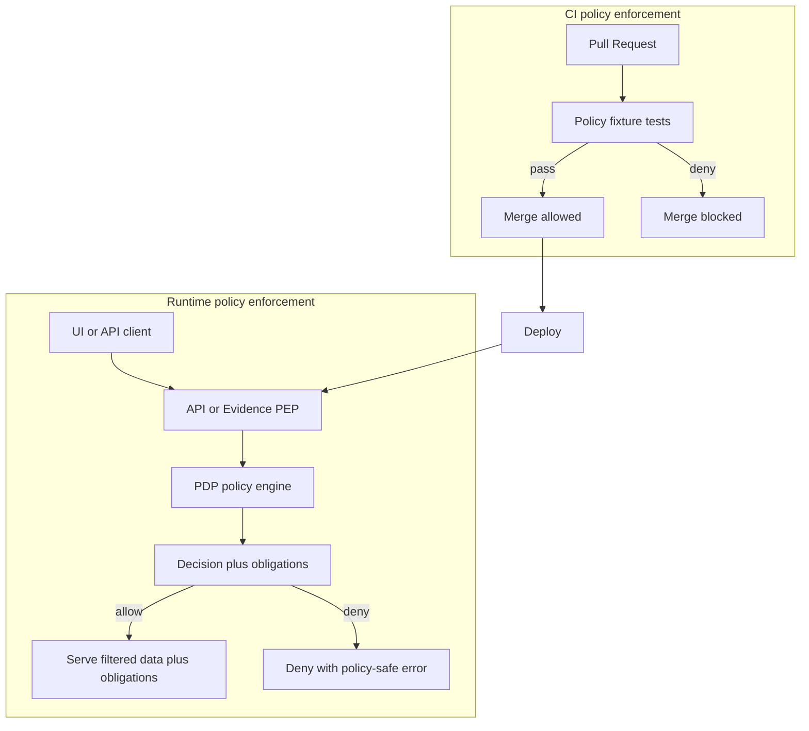

<!-- [KFM_META_BLOCK_V2]
doc_id: kfm://doc/3fef8ffa-e53f-42a1-9ab9-4b6a10b3b5a6
title: Governance Labels
type: standard
version: v1
status: draft
owners: kfm-governance (TBD)
created: 2026-03-02
updated: 2026-03-02
policy_label: public
related:
  - docs/governance/ROOT_GOVERNANCE.md
  - docs/governance/REVIEW_GATES.md
tags: [kfm, governance, policy, labels]
notes:
  - This directory is the canonical definition of KFM policy labels and their obligations.
  - Update this file whenever `policy_label` vocabulary or semantics change.
[/KFM_META_BLOCK_V2] -->

<a id="top"></a>

# KFM Governance Labels
**One-line purpose:** Define the controlled vocabulary for `policy_label` and the required enforcement/UX obligations across KFM.

[](#)
[](#)
[](#)
[](#)
<!-- TODO: replace badges with repo/CI-specific shields once paths are known -->

**Applies to:** catalogs (DCAT/STAC/PROV), governed APIs (PEP), evidence resolver, Story Nodes, Focus Mode, and UI policy badges.

---

## Quick navigation
- [What this directory is for](#what-this-directory-is-for)
- [Where this fits in the repo](#where-this-fits-in-the-repo)
- [Definitions](#definitions)
- [Policy label registry](#policy-label-registry)
- [Obligations](#obligations)
- [Where labels must appear](#where-labels-must-appear)
- [How enforcement works](#how-enforcement-works)
- [Adding or changing a label](#adding-or-changing-a-label)
- [Directory contents](#directory-contents)
- [Appendix](#appendix)

---

## Where this fits in the repo
`docs/governance/labels/` is the **single place** to define what `policy_label` values exist and what they *mean* in enforcement and UX.

Changes here typically imply (or should trigger) coordinated updates in:
- **Policy-as-code bundle** (PDP rules + fixture tests)
- **Catalog profiles** (DCAT/STAC extensions that carry `kfm:policy_label`)
- **Evidence resolver & governed API** (PEPs that enforce decisions and apply obligations)
- **UI policy badges/notices** (display-only; never decide policy)

> TIP: If you change label semantics, treat it like an API change—update fixtures, CI gates, and any user-facing documentation in the same PR.

---

## What this directory is for
KFM uses **policy labels** as the **primary classification input** to policy evaluation. A request is evaluated against the target resource’s `policy_label`, producing a decision (**allow/deny**) plus **obligations** (required redaction/generalization steps and/or UI notices).

**Non-negotiables (trust membrane posture):**
- Clients **must not** access storage directly; access is mediated by governed APIs and policy enforcement.
- Policy must be **fail-closed** (deny-by-default) when classification or permissions are unclear.
- Public outputs must never leak restricted details (including via metadata, error behavior, receipts, or “almost-hidden” geometry).

---

## Definitions

| Term | Meaning in KFM |
|---|---|
| `policy_label` | Controlled vocabulary value assigned to a resource (dataset version, artifact, catalog record, story, evidence card, etc.). |
| PDP (Policy Decision Point) | The policy engine (e.g., OPA) that evaluates inputs and returns allow/deny + obligations. |
| PEP (Policy Enforcement Point) | The component that calls the PDP and enforces outcomes (CI, API, evidence resolver). |
| Obligation | A required action that must occur if the request is allowed (e.g., generalize geometry, remove fields, show a notice). |

> NOTE: The UI can **display** policy badges and obligation notices, but it must **never** be the place where policy is decided.

---

## Policy label registry

### Canonical vocabulary
The following `policy_label` values are the **starter controlled vocabulary** for KFM:

| Label | Intent | Default public access | Typical obligations (examples) |
|---|---|---:|---|
| `public` | Safe for public distribution and display. | ✅ allow | Attribution + license display (UI); standard audit logging. |
| `public_generalized` | Public derivative where sensitive details were generalized/redacted. | ✅ allow | UI must show a “generalized due to policy” notice; geometry/attributes generalized via recorded transforms. |
| `restricted` | Not public; requires privileged role and explicit permission. | ❌ deny | Redaction or “metadata-only” surfacing may be allowed depending on rights/sensitivity. |
| `restricted_sensitive_location` | Restricted because precise location could cause harm (heritage, endangered species, etc.). | ❌ deny | If a public derivative is permitted: create `public_generalized` outputs with irreversible generalization. |
| `internal` | Organization-internal; not public. | ❌ deny | Similar to restricted, but usually available to staff roles. |
| `embargoed` | Temporarily restricted pending a release condition/date. | ❌ deny | Requires an explicit “embargo lift” rule + audit trail. |
| `quarantine` | Transitional “not publishable” state (QA failures, rights unclear, awaiting review). | ❌ deny | Only pipeline/operator roles; must not leak externally. |

> WARNING: Do **not** invent ad-hoc labels in code or data. If you need a new label, follow the workflow in [Adding or changing a label](#adding-or-changing-a-label).

### Decision heuristics (defaults)
These are policy posture defaults that should hold unless an approved policy exception exists:

- **Restricted and sensitive-location datasets are deny-by-default.**
- If any public representation is allowed, it must be produced as a **separate** `public_generalized` dataset version (not “sometimes redacted at query-time”).
- Story Nodes and Focus Mode outputs must not embed precise coordinates unless policy explicitly allows.

---

## Obligations

Policy evaluation can attach obligations. Obligations are not “nice-to-have”; they are required actions that:
1) must be executed (server-side) and/or
2) must be displayed (UI notice) and/or
3) must be recorded (audit/provenance).

### Common obligation types (starter)
| Obligation type | Category | Applied when | Example parameters |
|---|---|---|---|
| `generalize_geometry` | Transform | Sensitive location or reidentification risk | `min_cell_size_m`, `snap_to_grid_m`, `method` |
| `remove_attributes` | Transform | Attribute-level sensitivity | `fields: ["exact_location", "owner_name"]` |
| `show_notice` | UX | Public derivatives that required generalization | `message` |
| `require_attribution` | UX/Legal | Almost all allowed access | `attribution_text`, `license_spdx` |
| `deny_reason_redacted` | Security | When denying, avoid leaking details | (implementation-specific) |

> TIP: Treat redaction/generalization as a first-class transform in provenance (PROV), not as an implicit behavior.

---

## Where labels must appear

### Required surfaces
At minimum, the label must be present on:

1. **Catalogs**
   - DCAT record fields should include a KFM extension like `kfm:policy_label`.
   - STAC Collections/Items should carry policy label (and must keep geometry/bbox policy-consistent).

2. **Policy input**
   - Policy engine input must include the resource label (e.g., `input.resource.policy_label`).

3. **Evidence resolution**
   - Evidence bundles must include the policy decision, label, and obligations to support “trust visible” UX.

4. **Promotion manifests / run receipts**
   - Promotion artifacts must record which label was assigned for the dataset version and which decision ID approved it.

---

## How enforcement works

### Policy-as-code architecture
KFM requires **the same policy semantics in CI and runtime** (or at least the same fixtures and outcomes), otherwise CI guarantees are meaningless.



### Minimum acceptance criteria
- ✅ Deny-by-default policies exist.
- ✅ Every `policy_label` has at least one allow/deny fixture test per role.
- ✅ CI blocks merges on policy regressions.
- ✅ Runtime errors are policy-safe (no inference of restricted existence).
- ✅ Evidence resolver and API both enforce the same label semantics.

---

## Adding or changing a label

### Definition of Done (DoD)
When proposing a new label or changing semantics:

- [ ] Add/update the controlled vocabulary list (and version it).
- [ ] Define the **intent** (what risk it mitigates) and **scope** (what resources can carry it).
- [ ] Define default access by role (public/contributor/steward/operator).
- [ ] Define required obligations (transforms + UX notices).
- [ ] Add policy rules in the policy bundle (deny-by-default unless explicitly allowed).
- [ ] Add fixture-driven policy tests that cover:
  - allow cases
  - deny cases
  - obligations emitted
  - policy-safe errors / no-leak behavior
- [ ] Update catalog/profile docs if the label requires new metadata behavior.
- [ ] Update UI policy badge/notice mappings if user-facing.
- [ ] Add/refresh threat-model checklist items if risk profile changed.

> NOTE: If the new label is about sensitive locations or reidentification risk, include explicit tests that prevent “bbox leakage” and coordinate fields leaking in public outputs.

---

## Directory contents

### Expected contents (may evolve)
The repo should keep the label vocabulary and its policy fixtures close to each other so that changes are reviewable and testable.

> The exact filenames may differ in your repo. The structure below is **recommended** for maintainability.

```text
docs/governance/labels/                                # Policy labels + obligations: controlled vocabularies and reference examples for consistent enforcement
├── README.md                                          # Overview of policy_label + obligations, workflows (assign/evaluate/review), and where enforcement happens (PEP/PDP/CI)
├── policy_label.vocab.yaml                            # Controlled vocabulary for policy_label values (meaning, defaults, allowed actions, review requirements, escalation)
├── obligations.vocab.yaml                             # Controlled vocabulary for obligation types (e.g., redact/generalize/notice/log) with parameters and UI/API handling notes
└── examples/                                          # Worked examples for understanding/testing label and obligation semantics (non-production reference)
    ├── policy_input.example.json                      # Minimal PDP input examples (subject, action, resource, context) for local testing and documentation
    ├── policy_decision.example.json                   # Example PDP decision outputs (allow/deny + emitted obligations + reasons) for consumers (UI/API/CLI)
    └── fixtures/                                      # Fixture cases used by tests/docs to validate expected outcomes
        ├── allow_public_read_public.json              # Fixture: allow when subject/action/resource all align to PUBLIC access constraints
        ├── deny_public_read_restricted.json           # Fixture: deny when subject is public but resource label is RESTRICTED (fail-closed)
        └── allow_public_read_public_generalized_with_notice.json  # Fixture: allow with obligations (generalize + notice) for conditional release scenarios
```

### Acceptable inputs
- Controlled vocabulary files for policy labels and obligation types.
- Human-readable guidance, examples, and governance workflows.
- Policy fixture inputs/outputs for CI enforcement.

### Exclusions
- ❌ Secrets, credentials, or access tokens
- ❌ Raw datasets or restricted payloads
- ❌ Ad-hoc one-off labels embedded in code without vocabulary + tests
- ❌ Precise coordinates for sensitive locations (unless explicitly authorized and stored in restricted-only artifacts)

---

## Appendix

### A. Minimal example: policy input + rule sketch
```json
{
  "user": { "role": "public" },
  "action": "read",
  "resource": { "policy_label": "public" }
}
```

```rego
package kfm.authz
default allow = false

allow {
  input.user.role == "public"
  input.action == "read"
  input.resource.policy_label == "public"
}
```

### B. Minimal example: obligation for public derivatives
```json
{
  "type": "show_notice",
  "message": "Geometry generalized due to policy."
}
```

<a href="#top">Back to top</a>
