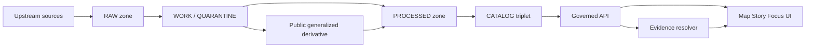

<!-- [KFM_META_BLOCK_V2]
doc_id: kfm://doc/7b30c5d5-6d3c-4b2b-b941-9f0f5c7d1a3d
title: REDACTION_GENERALIZATION
type: standard
version: v1
status: draft
owners: Governance Steward (TODO), Policy Engineer (TODO)
created: 2026-03-02
updated: 2026-03-02
policy_label: public
related:
  - docs/governance/labels/README.md
  - docs/governance/policy/README.md
  - docs/governance/gates/PROMOTION_CONTRACT.md
  - docs/governance/gates/RUNTIME_GATES.md
tags: [kfm, governance, labels, redaction, generalization]
notes:
  - Defines the REDACTION_GENERALIZATION governance label and the minimum obligations/tests for safe public representation.
[/KFM_META_BLOCK_V2] -->

# REDACTION_GENERALIZATION
Governance label defining mandatory redaction/generalization obligations for policy-safe public representation.


## Navigation
- [Purpose](#purpose)
- [Where this fits in KFM](#where-this-fits-in-kfm)
- [Label definition](#label-definition)
- [Obligations](#obligations)
- [Approved generalization techniques](#approved-generalization-techniques)
- [Evidence, provenance, and audit requirements](#evidence-provenance-and-audit-requirements)
- [UI and Focus Mode requirements](#ui-and-focus-mode-requirements)
- [CI and policy-as-code requirements](#ci-and-policy-as-code-requirements)
- [Templates](#templates)
- [Exclusions](#exclusions)
- [Appendix: anti-patterns](#appendix-anti-patterns)

---

## Purpose
`REDACTION_GENERALIZATION` exists to prevent sensitive details from leaking through **public surfaces**
(Map Explorer, Story Nodes, Focus Mode, exports, logs/receipts), while still enabling **useful, evidence-led**
exploration and publication.

This label operationalizes KFM’s posture that:
- policy enforcement happens **before** data/evidence is served, and
- redaction/generalization is treated as a **first-class transform** recorded in provenance (PROV) and reflected in evidence bundles.

> **WARNING**
> This label is *not* a substitute for licensing review, legal review, or community governance review.
> If rights/sensitivity are unclear, default to *deny* and escalate to the steward process.

---

## Where this fits in KFM
KFM’s truth path includes a WORK/QUARANTINE zone where normalization, QA, and redaction/generalization candidates
are produced prior to publishable PROCESSED artifacts.



**Key invariant:** the evidence resolver and governed API are enforcement points; the UI renders policy outcomes and never “decides” policy.

---

## Label definition
### What this label means
`REDACTION_GENERALIZATION` indicates that policy-required obligations MUST be applied to one or more of:
- geometry (location precision),
- time (timestamp precision),
- attributes (direct identifiers, quasi-identifiers),
- text/media (names, addresses, identifying imagery),
- logs/receipts/provenance fields.

### When to apply (trigger conditions)
Apply this label when any consumer-facing representation could enable:
- re-identification of people (PII or quasi-identifiers),
- targeting/looting/harassment of vulnerable locations (e.g., archaeological sites, threatened species locations, shelters),
- exposure of partner-controlled or culturally restricted knowledge,
- inadvertent leakage through “secondary surfaces” (errors, receipts, audit logs, export files).

### Relationship to `policy_label`
KFM policy decisions commonly include a coarse `policy_label` (e.g., public, internal, restricted) plus obligations.
`REDACTION_GENERALIZATION` is a governance label for those obligations and the tests/DoD that prove they were honored.

> **NOTE**
> If a dataset is restricted but a public representation is permitted, produce a *separate* “public generalized” dataset version
> rather than weakening protections on the restricted source.

---

## Obligations
Obligations are typed actions that MUST be applied (and recorded) before any public surface can return data/evidence.

### Mandatory obligations for this label
1. **No precise coordinates in public narrative outputs**
   - Story Nodes and Focus Mode outputs MUST NOT embed precise coordinates unless policy explicitly allows.
2. **Produce a separate public generalized dataset version (when public representation is allowed)**
   - Do not “toggle precision” on the same dataset version for public users.
3. **Prevent metadata leakage**
   - 403/404 (and similar) responses MUST NOT leak restricted metadata (titles, bounding boxes, record counts, etc.).
4. **Record the transform**
   - Redaction/generalization MUST be a first-class provenance activity (captured in PROV and run receipts).
5. **Declare what was applied**
   - Evidence bundles MUST list obligations applied (so downstream systems can display notices and audits can verify).

### Optional obligations (policy-dependent)
- aggregation-only release (publish only summary statistics/tiles at coarse resolution)
- field suppression (remove fields entirely vs masking)
- k-anonymity style thresholds (only show areas with ≥ N records)
- time windowing (release only weekly/monthly bins, not event timestamps)

---

## Approved generalization techniques
Pick the least revealing technique that still supports the intended public use case.

### Geometry
| Data shape | Safer public representation | Notes |
|---|---|---|
| Point | grid/hex cell ID, admin unit, or coarse bounding area | Avoid publishing raw point coords |
| Line | simplify + snap to coarse grid, or aggregate to corridors | Prefer “corridor” generalization |
| Polygon | simplify + coarsen, or aggregate to admin units | Avoid publishing parcel-level boundaries |

**Recommended geometry tiers (policy-controlled):**
- **Tier 0 (deny):** no public geometry output
- **Tier 1 (coarse):** county / region / ≥10km grid
- **Tier 2 (medium):** ≥1km grid / hex bins
- **Tier 3 (fine):** ≥100m grid (only if explicitly allowed)

> **TIP**
> When uncertain, choose the coarser tier and document the decision in the steward review.

### Time
- Round timestamps to day/week/month (policy-defined)
- Replace event time with a window (e.g., `2026-02` rather than `2026-02-19T03:12Z`)
- Suppress time entirely if it meaningfully increases risk

### Attributes and identifiers
- Remove direct identifiers: names, emails, phone numbers, addresses, account IDs
- Bucket quasi-identifiers: age ranges, income bands, small-category collapsing
- Apply cell suppression: do not show counts below a threshold (e.g., `< 5`)

### Text and media
- Redact names/addresses from OCR or transcribed text
- Avoid direct quotes that include identifying details
- For images: crop/blur/redact identifying features (faces, plates, house numbers), or publish lower-resolution derivatives

---

## Evidence, provenance, and audit requirements
### Evidence bundles must reflect policy outcomes
Evidence bundles SHOULD expose (at minimum):
- the policy decision and `policy_label`
- obligations applied
- license/rights info
- artifact digests and audit references

**Non-negotiable:** the evidence resolver MUST fail closed if evidence is unresolvable or unauthorized.

### Provenance must capture redaction/generalization
Every generalization/redaction MUST be recorded as a PROV activity that references:
- input artifact digests
- output artifact digests
- parameters (e.g., grid size, simplification tolerance) *when safe to disclose*
- policy decision reference (audit id)

### Receipts/logs must not leak sensitive data
Run receipts, lineage graphs, and logs are potential exfil paths. Classify and redact them using the same posture as datasets.

---

## UI and Focus Mode requirements
### Required user-facing trust surfaces
Public UI surfaces MUST:
- show a policy badge/notice when generalization is applied (e.g., “geometry generalized due to policy”),
- provide an evidence drawer that can display:
  - dataset version
  - license/rights
  - provenance links
  - redactions applied / obligations applied

### Focus Mode behavior under this label
- If retrieval finds only restricted evidence (or evidence requiring generalization that is not available), Focus Mode MUST:
  - abstain, or
  - narrow scope to the generalized derivative, and
  - clearly state that information is withheld due to policy.

---

## CI and policy-as-code requirements
KFM requires consistent policy semantics in CI and runtime; obligations must be testable.

### Minimum CI gates for this label
- fixture tests: allow/deny + obligations applied
- redaction conformance tests: verify generalized artifacts match required tiers/thresholds
- leakage tests: ensure API errors and evidence bundles do not expose restricted metadata
- promotion gate: block promotion unless sensitivity classification includes `policy_label` plus obligations/redaction plan

### Minimum verification steps (convert Unknown → Confirmed)
- [ ] Add policy fixtures for a representative dataset under this label (allow + obligations).
- [ ] Add a failing fixture proving that raw geometry/PII cannot be published under public roles.
- [ ] Validate evidence bundles include `obligations_applied`.
- [ ] Run an end-to-end UI flow verifying the policy notice appears and evidence drawer lists redactions.

---

## Templates
### 1) Redaction plan (sidecar) — example
```yaml
# redaction_plan.yaml (example)
label: REDACTION_GENERALIZATION
policy_label_target: public_generalized
geometry:
  method: snap_to_grid
  tier: 2
  grid_size_meters: 1000
time:
  method: round
  granularity: day
attributes:
  remove_fields:
    - person_name
    - email
    - phone
    - street_address
  bucket_fields:
    age:
      bins: ["0-17", "18-34", "35-49", "50-64", "65+"]
suppression:
  min_count_threshold: 5
notes:
  - Steward-approved on: 2026-__-__
  - Rationale: protect vulnerable locations and prevent re-identification
```

### 2) Evidence bundle policy section — example
```json
{
  "policy": {
    "decision": "allow",
    "policy_label": "public",
    "obligations_applied": [
      "REDACTION_GENERALIZATION.geometry.tier2",
      "REDACTION_GENERALIZATION.attributes.remove_fields",
      "REDACTION_GENERALIZATION.time.round_day"
    ]
  }
}
```

### 3) UI notice string — example
```md
**Policy notice:** Some details are generalized or withheld to protect sensitive locations and/or personal information.
```

---

## Exclusions
This file and this directory MUST NOT contain:
- any real PII,
- any real vulnerable-site coordinates,
- any restricted dataset extracts,
- “worked examples” that reveal how to reverse-engineer a sensitive location.

---

## Appendix: anti-patterns
- UI-only hiding: masking a layer in the UI while still serving precise data via API
- Same dataset version with “precision toggles”: serving precise data to some clients and generalized to others without distinct, auditable artifacts
- Leaky errors: 403/404 messages revealing dataset existence, bbox, counts, or titles
- Redaction without provenance: not recording parameters/digests/audit refs for transforms
- Receipt leakage: embedding sensitive fields in logs or run receipts

---
Back to top: [Navigation](#navigation)
