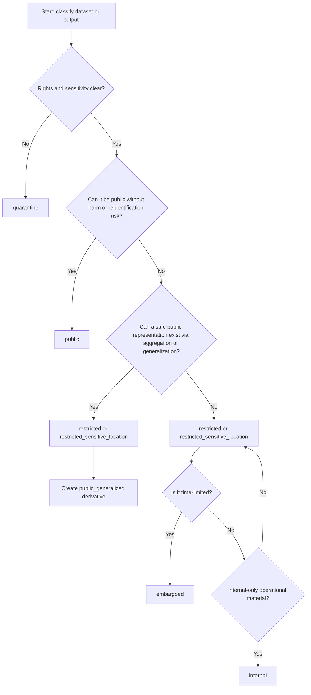
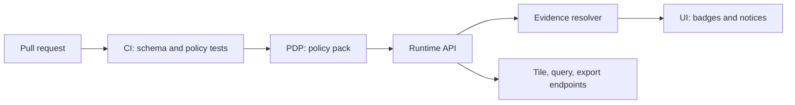

<!-- [KFM_META_BLOCK_V2]
doc_id: kfm://doc/43b2d59d-bd0f-4053-bf4e-a3faee0b7916
title: Sensitivity Guide
type: standard
version: v1
status: draft
owners: TBD
created: 2026-03-02
updated: 2026-03-02
policy_label: public
related:
  - kfm://doc/kfm-gdg-vnext
tags: [kfm, governance, labels, sensitivity, policy_label]
notes:
  - Drafted from the KFM “Definitive Design & Governance Guide (vNext)” (Date: 2026-02-20).
  - This guide defines how to choose and apply kfm:policy_label values and related obligations.
[/KFM_META_BLOCK_V2] -->

# Sensitivity Guide
_Map-first • Time-aware • Governed • Evidence-first • Cite-or-abstain_


## Navigation
- [Purpose](#purpose)
- [Scope](#scope)
- [Roles and approvals](#roles-and-approvals)
- [Core invariants](#core-invariants)
- [Policy labels](#policy-labels)
- [How to choose a label](#how-to-choose-a-label)
- [Where the label lives](#where-the-label-lives)
- [Obligations](#obligations)
- [Sensitive locations](#sensitive-locations)
- [PII and reidentification risk](#pii-and-reidentification-risk)
- [Cultural sensitivity and Indigenous data sovereignty](#cultural-sensitivity-and-indigenous-data-sovereignty)
- [Where enforcement happens](#where-enforcement-happens)
- [CI and review gates](#ci-and-review-gates)
- [Appendix: templates](#appendix-templates)

---

## Purpose

This document defines the **sensitivity labeling scheme** used by KFM (`kfm:policy_label`) and the
**minimum practices** required to prevent sensitive information leakage across:

- **datasets** (raw/work/processed/published artifacts)
- **catalogs** (DCAT/STAC/PROV, evidence bundles)
- **runtime outputs** (API responses, tiles, Story Nodes, Focus Mode)

It is intended to be used by **contributors**, **stewards/reviewers**, and **operators** during dataset onboarding,
promotion, and story publishing.

> [!WARNING]
> This is a **governance control document**, not a legal opinion. If rights, permissions, or sensitivity are unclear,
> **fail closed** and trigger review.

---

## Scope

Included:
- The **controlled vocabulary** for `policy_label` (starter set).
- A decision flow for assigning labels.
- Required “public representation” patterns (**public vs public_generalized**).
- Obligations and UI notices.
- Review triggers for sensitive topics and sensitive locations.

Excluded (by design, keep it buildable):
- Detailed, source-specific redaction recipes (belongs in each source integration playbook).
- Identity provider details, ABAC attribute schemas, or legal templates.

---

## Roles and approvals

At minimum, sensitivity labeling requires:
- **Contributor**: proposes datasets/stories and drafts initial policy label suggestion.
- **Reviewer/Steward**: approves promotions and story publishing; owns policy labels and redaction rules.
- **Governance council / community stewards**: authority to control culturally sensitive materials; sets rules for restricted collections and public representations.

> [!NOTE]
> If content is culturally sensitive or permissions are unclear, governance council/community stewards must be consulted before release.

---

## Core invariants

KFM’s default posture is **fail-closed** for sensitive material.

**Baseline defaults (to be implemented as policy-as-code):**
1. Default deny for sensitive-location and restricted datasets.
2. If any public representation is allowed, produce a separate `public_generalized` dataset version.
3. Never leak restricted metadata via error behavior (403/404 must be policy-safe).
4. Do not embed precise coordinates in Story Nodes or Focus Mode outputs unless policy explicitly allows.
5. Treat redaction/generalization as a first-class transform recorded in provenance (PROV).

---

## Policy labels

`policy_label` is a **controlled vocabulary** that simultaneously expresses:
- access posture (who can read/export),
- sensitivity posture (what must be generalized/redacted),
- operational posture (quarantine/embargo/internal).

### Starter vocabulary

| Label | Meaning | Default audience | Typical outputs |
|---|---|---|---|
| `public` | Safe to show publicly | Public | Full-fidelity public artifacts + tiles |
| `public_generalized` | Public derivative of sensitive data (generalized geometry/attributes) | Public | Generalized artifacts + tiles + required notices |
| `restricted` | Requires authorization; not public | Authorized roles only | Full-fidelity restricted artifacts |
| `restricted_sensitive_location` | Precise locations protected; default deny | Highly limited | Restricted artifacts; public must be generalized/metadata-only |
| `internal` | Visible to operators/stewards only | Internal staff | Operational datasets, logs, drafts |
| `embargoed` | Time-limited restriction pending release | Internal until release | Hidden from public discovery until embargo lift |
| `quarantine` | Not promoted (validation or rights unresolved) | Operators/stewards | Blocked from published/runtime surfaces |

> [!NOTE]
> The vocabulary may be extended, but **must remain versioned and test-validated** as a controlled list.

### Common labeling scenarios

| Scenario | Recommended label(s) | Public output pattern |
|---|---|---|
| Authoritative public-domain/public-licensed dataset | `public` | Publish as-is |
| Archaeology sites / restricted heritage inventories | `restricted_sensitive_location` + derived `public_generalized` | No precise points in public; generalize/aggregate |
| Sensitive ecological locations | `restricted_sensitive_location` + derived `public_generalized` (if allowed) | Generalize/aggregate; require notices |
| Partner-controlled dataset (access-limited) | `restricted` (or `internal`) | Often none; or separate approved `public_generalized` |
| Rights/permission unclear, validation failing, or provenance incomplete | `quarantine` | None |
| Planned future public release (e.g., after review or a date) | `embargoed` → `public`/`public_generalized` | Hidden until release |

---

## How to choose a label

### Decision flow



### Assignment rules (practical)

When assigning a label, document:
- **What is sensitive** (locations, individuals, partner constraints, culturally restricted sites).
- **What the allowed public representation is**, if any.
- **What obligations must be applied** (UI notices, aggregation thresholds, export limits).
- **Who approves** (steward; governance council/community stewards when culturally sensitive).

> [!TIP]
> In dataset onboarding, treat sensitivity classification and label selection as part of the standard source assessment and “policy design” step.
> The steward is the accountable role for approving policy labels and redaction rules.

---

## Where the label lives

`policy_label` must be present and consistent across the trust membrane:

- **DatasetVersion spec / promotion manifest** (what was released)
- **Catalogs**:
  - DCAT datasets/distributions
  - STAC collections/items
  - PROV bundles (where appropriate)
- **Evidence bundles** returned by the Evidence Resolver (what the UI/Focus Mode can show)

### Evidence bundle (policy portion)

The Evidence Resolver returns a policy decision along with any obligations applied:

```json
{
  "policy": {
    "decision": "allow",
    "policy_label": "public",
    "obligations_applied": []
  }
}
```

> [!IMPORTANT]
> UI clients should render policy badges/notices from the Evidence Bundle, but **must never try to “implement policy”** client-side.

---

## Obligations

A policy decision can return **obligations** that must be applied by the system (API, Evidence Resolver, UI).

Examples of obligation types (starter):
- `show_notice` — display an end-user notice such as “Geometry generalized due to policy.”
- `apply_generalization` — enforce generalization rules in query/tiles/export.
- `min_count_threshold` — suppress results when counts are below an approved threshold.

> [!IMPORTANT]
> Obligations are not “UI hints.” They are **runtime requirements** and should be validated in CI and enforced in the API layer.

### Where obligations show up

- In policy decisions (policy-as-code).
- In evidence bundles returned by `/evidence/resolve` (so UI can render notices without deciding policy).
- In promotion manifests / run receipts (so governance is auditable).

---

## Sensitive locations

Sensitive location datasets (e.g., archaeology sites, restricted heritage inventories, sensitive ecological locations) must be protected so that
public artifacts **cannot be reverse-engineered** into precise coordinates.

### Required protection patterns

- Store precise geometries only in **restricted** datasets.
- Produce **public_generalized** derivatives when public representation is allowed.
- Enforce policy at **tile serving** (no bypass via static hosting).
- Add automated tests such as:
  - “no restricted bbox leakage” tests for public tiles
  - “no coordinate fields” tests for public exports when restricted

### Generalization methods

KFM maintains a controlled vocabulary for generalization methods (starter list):

- `centroid_only`
- `grid_aggregation_<cell_size>`
- `random_offset_<distance>`
- `dissolve_to_admin_unit`
- `bounding_box_only`
- `none`

> [!WARNING]
> For sensitive locations, `none` is generally unacceptable for public release unless explicitly approved by policy.

---

## PII and reidentification risk

Some datasets (e.g., property ownership, crime, health) can create re-identification risk even without explicit identifiers.

Minimum guidance:
- Do not publish individual-level records publicly.
- Aggregate to safe geographies and apply minimum count thresholds.
- Document thresholds as policy obligations.
- Keep raw data restricted even if aggregated outputs are public.

> [!DECISION NEEDED]
> KFM should define standard minimum-count thresholds (or a tiered set by topic) and encode them as obligations for public exports.

---

## Cultural sensitivity and Indigenous data sovereignty

When working with Indigenous histories, treaty sites, sacred sites, or restricted cultural knowledge:

Operational guidance:
- Do not publish precise locations for culturally sensitive sites.
- Allow community-controlled policy labels and release criteria.
- Use `public_generalized` derivatives as the default public representation.
- Provide narrative context that respects community perspectives and avoids appropriation.
- If permissions are unclear, fail closed and flag for governance review.

### Review triggers for stories and outputs

Trigger governance review when:
- A story references Indigenous communities, treaty sites, sacred sites, or restricted cultural knowledge.
- A story includes archaeological site locations or sensitive ecological locations.
- A story could enable harm (e.g., looting, harassment, targeting infrastructure).

Operational rule: if uncertain, default to a restricted draft and request review.

---

## Where enforcement happens

Policy must be enforced consistently in **CI and runtime**. The UI displays badges/notices but does not decide policy.



---

## CI and review gates

### Promotion gates (minimum)

Promotion into runtime surfaces must be blocked unless:
- `policy_label` is assigned,
- obligations are applied where required,
- default-deny tests pass,
- and restricted data cannot be inferred via errors or metadata leaks.

### Story publishing gates (minimum)

Before publishing a Story Node:
- all citations resolve through the evidence resolver,
- story contains no restricted coordinates or identifiers,
- rights metadata exists for embedded media,
- map state references promoted dataset versions only,
- `policy_label` and `review_state` are set correctly.

### Focus Mode safety checks (minimum)

For public users:
- All citations must resolve via the Evidence Resolver for the public role.
- Public answers must not include restricted policy labels.
- If asked for restricted sensitive locations, Focus Mode must abstain with a safe explanation.

---

## Appendix: templates

### A. Dataset policy block (illustrative)

```yaml
policy:
  policy_label: restricted_sensitive_location
  obligations:
    - type: show_notice
      message: "Locations generalized due to policy."
    - type: apply_generalization
      method: dissolve_to_admin_unit
```

### B. CI test ideas (starter)

- Policy fixture tests for allow/deny on each policy_label
- “Public cannot infer restricted existence” error-behavior tests
- Public tile/export regression tests:
  - no coordinate fields present
  - bbox not tighter than allowed generalization envelope
