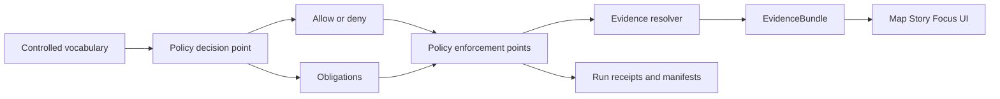

<!-- [KFM_META_BLOCK_V2]
doc_id: kfm://doc/fc936075-abc2-40cd-a4ae-8c0c4fd49be3
title: Governance Labels — Examples
type: standard
version: v1
status: draft
owners: TBD
created: 2026-03-02
updated: 2026-03-02
policy_label: public
related:
  - docs/governance/labels/
tags: [kfm, governance, labels, examples]
notes:
  - This folder contains **examples** (fixtures + snippets) to make governance labels testable and reusable.
  - Treat label semantics and obligations as **policy-as-code**, validated in CI and enforced at runtime.
[/KFM_META_BLOCK_V2] -->

# Governance Labels — Examples
Examples and fixtures for `policy_label` + obligations (default-deny posture).


## Navigate
- [Purpose](#purpose)
- [Where this fits](#where-this-fits)
- [What belongs here](#what-belongs-here)
- [Starter `policy_label` vocabulary](#starter-policy_label-vocabulary)
- [Example decision inputs and outputs](#example-decision-inputs-and-outputs)
- [Where labels show up in KFM artifacts](#where-labels-show-up-in-kfm-artifacts)
- [Adding or changing a label](#adding-or-changing-a-label)
- [Safety notes for sensitive locations](#safety-notes-for-sensitive-locations)
- [Suggested directory layout](#suggested-directory-layout)

---

## Purpose
This directory is a **copy/paste safe** place for:

- Example `policy_label` values (as a controlled vocabulary).
- Example **policy decisions** (allow/deny) and **obligations** (e.g., “show a notice”, “generalize geometry”).
- Example fixture inputs for policy tests (so CI can fail closed on regressions).

> **NOTE**
> The KFM design docs emphasize that policy semantics must match in CI and runtime; tests should block merges when policies drift.

## Where this fits



This is an *examples* subfolder under governance docs:

- `docs/…` contains human-readable governance guidance.
- `policy/…` (or equivalent) contains the **enforced** policy-as-code + tests.
- This `examples/` folder exists to keep small, reviewable fixtures next to the docs.

> **WARNING**
> Do not assume module paths in the live repo unless verified. Keep examples self-contained and reference real paths only after a repo reality check.

## What belongs here
**Acceptable inputs**
- Small YAML/JSON files representing:
  - a resource with `policy_label`
  - a user/principal context (role, org, clearance, etc.)
  - an action (`read`, `download`, `export`, `publish`, …)
- Short Rego snippets illustrating a single rule or obligation pattern
- “Valid vs invalid” pairs for schema/policy gate tests

**Exclusions**
- No real secrets, API keys, or tokens
- No raw restricted datasets or identifying coordinates
- No “policy by documentation” (examples must be testable fixtures)

---

## Starter `policy_label` vocabulary
The KFM vNext governance guide includes the following **starter** `policy_label` controlled vocabulary:

- `public`
- `public_generalized`
- `restricted`
- `restricted_sensitive_location`
- `internal`
- `embargoed`
- `quarantine`

### Suggested meaning patterns (examples, not enforcement)
| policy_label | Common intent (illustrative) | Typical obligations (illustrative) |
|---|---|---|
| `public` | Public can read | none |
| `public_generalized` | Public can read **a generalized representation** | UI notice, geometry generalization recorded in provenance |
| `restricted` | Deny to public; allow to stewards/authorized roles | redact metadata in errors; deny downloads/exports by default |
| `restricted_sensitive_location` | Deny to public; extra protections | never emit precise geometry; require explicit override |
| `internal` | Org-only | watermarking / internal-only banners |
| `embargoed` | Time-gated / approval-gated | deny until release date/approval |
| `quarantine` | Not publishable yet (fails QA, unclear rights, etc.) | hide from discovery; block promotion |

> **TIP**
> Treat the table above as a **documentation lens**. The source of truth is policy-as-code + tests.

---

## Example decision inputs and outputs

### 1) Minimal policy input shape (fixture)
An example policy pack in the vNext guide uses a simple input structure with:

- `user.role`
- `action`
- `resource.policy_label`

Example allow decision (public user reading public resource):

```json
{
  "user": { "role": "public" },
  "action": "read",
  "resource": { "policy_label": "public" }
}
```

Example deny decision (public user reading restricted resource):

```json
{
  "user": { "role": "public" },
  "action": "read",
  "resource": { "policy_label": "restricted" }
}
```

### 2) Obligation pattern (fixture)
A common pattern is: **allow with obligations**.

Example (illustrative): if `policy_label == "public_generalized"` then attach an obligation requiring the UI to show a notice, and ensuring any geometry is generalized upstream (recorded in PROV).

```json
{
  "decision": "allow",
  "policy_label": "public_generalized",
  "obligations": [
    {
      "type": "show_notice",
      "message": "This view is generalized by policy."
    }
  ]
}
```

---

## Where labels show up in KFM artifacts
The vNext documents show `policy_label` appearing as a first-class field across multiple “trust surfaces”:

- **Catalogs**
  - DCAT profile includes a `kfm:policy_label` field (alongside dataset identity/versioning).
  - STAC profile carries policy label and may require generalized geometry depending on label.
- **Run receipts**
  - Every pipeline run receipt records the `policy_label` decision and obligations.
- **Promotion manifests**
  - A promotion manifest includes a `policy` section with `policy_label` and a decision reference.
- **Evidence bundles**
  - Evidence resolution returns allow/deny, the resolved `policy_label`, and obligations applied.
- **Story Nodes**
  - Story metadata includes `policy_label`; publishing is gated by evidence resolution.

---

## Adding or changing a label

### Definition of Done
When introducing a new `policy_label` value (or changing semantics), the “done” bar should be:

- [ ] The controlled vocabulary is updated (and versioned).
- [ ] Policy-as-code is updated (default deny where unclear).
- [ ] Test fixtures cover allow/deny + obligation outputs.
- [ ] Policy tests run in CI and **block merges** on regression.
- [ ] Evidence resolver behavior is updated to reflect the new label/obligations.
- [ ] UI renders policy badges/notices but does not make decisions.

### Minimum verification steps
1. Confirm the live repo locations for:
   - controlled vocab files
   - policy bundle + tests
   - any schema validators and CI wiring
2. Run policy tests locally and in CI with the fixtures in this folder.
3. Ensure errors do not leak restricted dataset existence/metadata.

---

## Safety notes for sensitive locations
The governance guide recommends a conservative posture for sensitive-location data:

- Default deny for `restricted_sensitive_location` (and other restricted data).
- If any public representation is allowed, publish it as a separate `public_generalized` derivative.
- Do not embed precise coordinates in stories or Focus Mode answers unless policy explicitly allows.
- Treat redaction/generalization as a first-class transform recorded in provenance.

---

## Suggested directory layout
> This is a **suggested** layout for this folder. Add or remove files as your policy pack evolves.

```text
docs/governance/labels/examples/                          # Policy-label examples: reference materials (vocab + fixtures + toy rego) for learning/testing label semantics
├─ README.md                                              # How to use examples (learning + tests), disclaimer (non-production), and where real policy lives
├─ policy_label.vocab.yml                                 # Example controlled vocabulary for policy labels (allowed values, meanings, default handling)
├─ fixtures/                                               # Example decision fixtures (inputs/outputs) to validate label behavior in tests
│  ├─ allow_public_read_public.json                        # Fixture: allow access when requester/action/data are PUBLIC-aligned (baseline allow case)
│  ├─ deny_public_read_restricted.json                     # Fixture: deny access when requester is PUBLIC but data is RESTRICTED (baseline deny case)
│  └─ allow_public_generalized_with_notice.json            # Fixture: allow with obligation (generalize + notice) when policy permits conditional release
├─ rego/                                                   # Illustrative Rego snippets showing label evaluation patterns (toy policy only)
│  └─ policy_label_example.rego                            # Example label rules demonstrating allow/deny + obligation emission (not production policy)
└─ notes/                                                  # Supporting notes and patterns for stewards and UI implementers
   └─ obligations_catalog.md                               # Common obligation patterns (redaction/generalization/notice/logging) and suggested UI handling
```

---

### Back to top
[↑ Back to top](#governance-labels--examples)
