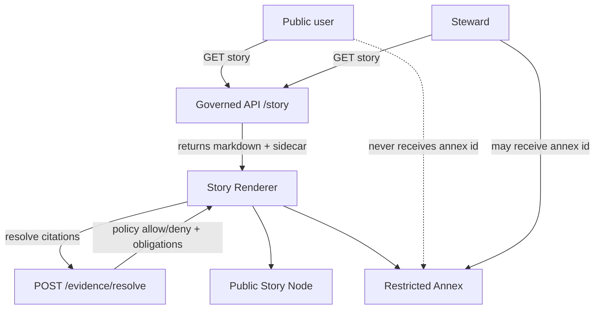

<!-- [KFM_META_BLOCK_V2]
doc_id: kfm://doc/1c9f1fcf-daf4-4813-a50c-2fda17f08fc1
title: Mixed Sensitivity Story Example
type: example
version: v1
status: draft
owners: kfm-governance
created: 2026-03-02
updated: 2026-03-02
policy_label: public
related:
  - TODO: docs/governance/labels/README.md
  - TODO: docs/governance/stories/story_node_v3.md
tags: [kfm, governance, labels, story, example, mixed_sensitivity]
notes:
  - Example IDs/refs below are illustrative. Replace with real dataset_version_id and EvidenceRefs from your catalogs.
  - Demonstrates a public story paired with a steward-only annex to avoid leaking restricted evidence.
[/KFM_META_BLOCK_V2] -->

# Mixed Sensitivity Story Example

> **Purpose:** Demonstrate how to tell one coherent story using **public** evidence plus **restricted/sensitive-location** evidence **without leaking** restricted details.


---

## Quick nav

- [Scenario](#scenario)
- [Labels used](#labels-used)
- [Recommended pattern](#recommended-pattern)
- [Public Story Node (publishable)](#public-story-node-publishable)
- [Steward Annex Story Node (restricted)](#steward-annex-story-node-restricted)
- [Evidence resolution examples](#evidence-resolution-examples)
- [Focus Mode examples](#focus-mode-examples)
- [Do/Don't checklist](#dodont-checklist)
- [Appendix: sample policy fixtures](#appendix-sample-policy-fixtures)

---

## Scenario

We want to publish a Story about **habitat conditions and restoration priorities**. The story relies on:

- **Public** layers for context (e.g., land cover, county boundaries, hydrology).
- **Sensitive-location** observations (e.g., threatened species nesting/lek sites, archaeology site candidates, etc.).

The governance goal:

- **Public users** can read the story and inspect **policy-safe** evidence.
- **Stewards** can additionally access a **restricted annex** that contains precise evidence.

> [!WARNING]
> This file intentionally contains **no real sensitive locations** and uses placeholders like `[[REDACTED]]`.
> Do not put precise sensitive coordinates in public Story Nodes.

---

## Labels used

This example uses the starter `policy_label` vocabulary:

- `public`
- `public_generalized`
- `restricted_sensitive_location`
- `restricted`

> Tip: treat the **generalization** (e.g., grid aggregation, centroid jitter, field removal) as a first-class transform with provenance.

---

## Recommended pattern

Because Story Nodes are published with a single `policy_label`, the safest approach to “mixed sensitivity”
is to publish **two Story Nodes** in a **story family**:

> Note: “story family” is a conceptual grouping (not a confirmed wire contract). Implement as an internal link, shared tag, or server-side association.

1. **Public Story Node** (`policy_label: public`)
   - cites only `public` and `public_generalized` evidence
   - shows generalized layers (aggregated/jittered/coarsened)
2. **Steward Annex Story Node** (`policy_label: restricted`)
   - may cite `restricted_sensitive_location` evidence
   - includes precise layers and restricted citations

In the UI, an authenticated steward can be shown a “View steward annex” affordance.
Public users must not be told whether a restricted annex exists.



---

## Public Story Node (publishable)

### Public narrative markdown (example)

> This is the **only** markdown that should be publishable to the public.

```md
# Prairie Habitat Signals — Spring 2026

## What we can say publicly (safe summary)

Over the last 90 days, habitat indicators improved in the focus area after prescribed burns and
wetland restoration work. The improvements are visible in the vegetation index trend and in
the reduction of standing-water persistence in low-lying parcels.

We are not publishing precise observation locations for sensitive species. Instead, we publish
generalized counts in a 10 km grid and summarize at the watershed level.

## Evidence (public + generalized)

- [CITATION: dcat://ks_landcover@2026-03.abcd1234]
- [CITATION: dcat://ks_habitat_index@2026-03.efgh5678]
- [CITATION: dcat://ks_sensitive_observations_generalized@2026-03.ijkl9012]
- [CITATION: prov://run/2026-03-01T12:00:00Z.qrst3456]
```

### Public Story Node sidecar (map state + citations)

```json
{
  "kfm_story_node_version": "v3",
  "story_id": "kfm://story/11111111-1111-1111-1111-111111111111",
  "version_id": "v1",
  "status": "draft",
  "policy_label": "public",
  "review_state": "needs_review",
  "map_state": {
    "kfm_map_state_version": "v1",
    "bbox": [-102.0, 36.9, -94.6, 40.0],
    "zoom": 6,
    "bearing": 0,
    "pitch": 0,
    "time_window": { "start": "2026-01-01", "end": "2026-03-01" },
    "layers": [
      {
        "layer_id": "ks_landcover",
        "dataset_version_id": "2026-03.abcd1234",
        "opacity": 0.7,
        "filters": []
      },
      {
        "layer_id": "ks_sensitive_observations_generalized",
        "dataset_version_id": "2026-03.ijkl9012",
        "opacity": 0.9,
        "filters": [
          { "field": "grid_km", "op": "=", "value": 10 }
        ]
      }
    ]
  },
  "citations": [
    { "ref": "dcat://ks_landcover@2026-03.abcd1234", "kind": "dcat" },
    { "ref": "dcat://ks_habitat_index@2026-03.efgh5678", "kind": "dcat" },
    { "ref": "dcat://ks_sensitive_observations_generalized@2026-03.ijkl9012", "kind": "dcat" },
    { "ref": "prov://run/2026-03-01T12:00:00Z.qrst3456", "kind": "prov" }
  ]
}
```

---

## Steward Annex Story Node (restricted)

> This annex is a separate Story Node with a restricted policy label. It is **not** public.

### Annex narrative markdown (example)

```md
# Steward Annex — Prairie Habitat Signals — Spring 2026

## Restricted details (for authorized stewards only)

This annex contains precise observation geometry and supporting field notes. Do not export this
story or its evidence bundles without verifying downstream permissions.

## Evidence (includes restricted_sensitive_location)

- [CITATION: dcat://ks_sensitive_observations_precise@2026-03.mnop7890]
- [CITATION: prov://run/2026-03-01T12:00:00Z.qrst3456]
- [CITATION: doc://kfm/governance/labels#restricted_sensitive_location]
```

### Annex sidecar (map state + citations)

```json
{
  "kfm_story_node_version": "v3",
  "story_id": "kfm://story/22222222-2222-2222-2222-222222222222",
  "version_id": "v1",
  "status": "draft",
  "policy_label": "restricted",
  "review_state": "needs_review",
  "map_state": {
    "kfm_map_state_version": "v1",
    "bbox": [-101.5, 37.2, -95.0, 39.8],
    "zoom": 8,
    "bearing": 0,
    "pitch": 0,
    "time_window": { "start": "2026-01-01", "end": "2026-03-01" },
    "layers": [
      {
        "layer_id": "ks_sensitive_observations_precise",
        "dataset_version_id": "2026-03.mnop7890",
        "opacity": 1.0,
        "filters": [
          { "field": "species_code", "op": "=", "value": "[[REDACTED]]" }
        ]
      }
    ]
  },
  "citations": [
    { "ref": "dcat://ks_sensitive_observations_precise@2026-03.mnop7890", "kind": "dcat" },
    { "ref": "prov://run/2026-03-01T12:00:00Z.qrst3456", "kind": "prov" }
  ]
}
```

---

## Evidence resolution examples

### 1) Public user resolves a generalized EvidenceRef

Expected outcome: `decision = allow` and the bundle returns a **notice obligation**.

```json
{
  "bundle_id": "sha256:bundle....",
  "dataset_version_id": "2026-03.ijkl9012",
  "title": "Sensitive observations (generalized 10 km grid)",
  "policy": {
    "decision": "allow",
    "policy_label": "public_generalized",
    "obligations_applied": [
      { "type": "show_notice", "message": "Geometry generalized due to policy." }
    ]
  },
  "license": { "spdx": "CC-BY-4.0", "attribution": "Example agency" },
  "artifacts": [
    {
      "href": "processed/ks_sensitive_observations_generalized_10km.parquet",
      "digest": "sha256:....",
      "media_type": "application/x-parquet"
    }
  ],
  "audit_ref": "kfm://audit/entry/..."
}
```

### 2) Public user resolves a precise sensitive-location EvidenceRef

Expected outcome: `decision = deny` and error messaging must not leak details.

```json
{
  "error_code": "POLICY_DENY",
  "message": "Not authorized.",
  "audit_ref": "kfm://audit/entry/..."
}
```

### 3) Steward resolves the precise EvidenceRef

Expected outcome: `decision = allow` and the bundle returns the restricted artifact pointers.

> Note: `obligations_applied` entries below are illustrative placeholders. Use your repo's controlled obligation vocabulary.

```json
{
  "bundle_id": "sha256:bundle....",
  "dataset_version_id": "2026-03.mnop7890",
  "title": "Sensitive observations (precise geometry)",
  "policy": {
    "decision": "allow",
    "policy_label": "restricted_sensitive_location",
    "obligations_applied": [
      { "type": "no_export", "message": "Export disabled unless additional approval is recorded." },
      { "type": "audit_log", "message": "Access recorded." }
    ]
  },
  "license": { "spdx": "LicenseRef-Internal", "attribution": "Internal" },
  "artifacts": [
    {
      "href": "processed/ks_sensitive_observations_precise.parquet",
      "digest": "sha256:....",
      "media_type": "application/x-parquet"
    }
  ],
  "audit_ref": "kfm://audit/entry/..."
}
```

---

## Focus Mode examples

Focus Mode should behave like a governed run:
- policy pre-check
- retrieval and evidence bundling
- **hard citation verification**
- abstain or reduce scope if citations can’t be verified

### Public user asks a sensitive-location question

**User question:** “Where are the most recent nesting sites?”

**Expected behavior:** return a generalized answer (e.g., watershed/grid summary) and cite only generalized evidence;
if that’s not possible, abstain.

### Steward asks the same question

**Expected behavior:** allow precise evidence, but attach obligations in the evidence drawer and capture an audit receipt.

---

## Do/Don't checklist

### ✅ Do

- Use `public_generalized` dataset versions for any public representation of sensitive-location data.
- Keep **public story citations** limited to `public` / `public_generalized`.
- Encode “generalized due to policy” as an obligation so the UI can display it.
- Ensure map state references **promoted** dataset versions only.

### ❌ Don’t

- Don’t paste precise coordinates into Story markdown.
- Don’t include restricted EvidenceRefs in a `policy_label: public` Story Node.
- Don’t leak existence of restricted datasets/stories via error messages or discovery endpoints.

---

## Appendix: sample policy fixtures

> Illustrative (not confirmed in repo). The key requirement is **default deny** and CI tests for allow/deny + obligations.

```rego
package kfm.authz

default allow = false

allow {
  input.user.role == "steward"
}

allow {
  input.user.role == "public"
  input.action == "read"
  input.resource.policy_label == "public"
}

obligations[o] {
  input.resource.policy_label == "public_generalized"
  o := {"type": "show_notice", "message": "Geometry generalized due to policy."}
}
```

---

_Back to top: [Quick nav](#quick-nav)_
