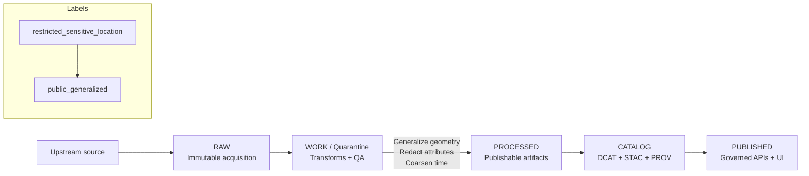

<!-- [KFM_META_BLOCK_V2]
doc_id: kfm://doc/1e7c37aa-ec3b-47f6-a802-7923258273f8
title: "public_generalized — Example (public release with generalized geometry)"
type: standard
version: v1
status: draft
owners: kfm-governance
created: 2026-03-02
updated: 2026-03-02
policy_label: public
related:
  - docs/governance/labels/README.md
  - docs/governance/labels/policy_label.md
tags: [kfm, governance, policy_label, public_generalized, example]
notes:
  - "Example-only. Uses fictitious data. Do not treat as a production policy decision."
[/KFM_META_BLOCK_V2] -->

# `public_generalized` — example (public release with generalized geometry)

**Purpose:** show *one* end-to-end pattern for publishing a dataset/story to the public while **intentionally removing or coarsening sensitive location detail**.


> [!IMPORTANT]
> `public_generalized` is **not** “public with a warning.” It is a distinct *derivative representation* that is safe for public use because precision has been reduced and policy obligations are enforced at runtime.

---

## Quick navigation

- [Definition](#definition)
- [When to use](#when-to-use)
- [What must be true](#what-must-be-true)
- [Generalization playbook](#generalization-playbook)
- [Reference architecture](#reference-architecture)
- [Worked example](#worked-example)
- [Policy + obligations example](#policy--obligations-example)
- [Evidence + UI expectations](#evidence--ui-expectations)
- [Publishing checklist](#publishing-checklist)
- [Appendix](#appendix)

---

## Definition

`public_generalized` is a **policy label for a publishable dataset version (or story output)** where:

1. The **upstream / internal** source may contain precise or sensitive location information, **but**
2. A **governed transform** produces a *public-safe representation* where geometry and/or attributes are generalized,
3. The system **records** the transform as provenance and **enforces** obligations consistently in CI + runtime.

**Typical “generalization” moves:**
- Replace points with **areas** (county, watershed, grid cell)
- Snap/round coordinates to a coarse grid (only when it cannot be reversed)
- Remove location-revealing attributes (addresses, parcel IDs, “directions to site,” etc.)
- Reduce time precision (e.g., month-level instead of day-level)

<a href="#public_generalized--example-public-release-with-generalized-geometry">Back to top</a>

---

## When to use

Use `public_generalized` when you want *some* public visibility but cannot safely publish the original representation.

Examples:
- Culturally sensitive sites (publish **region-level** only)
- Endangered species habitats (publish **generalized polygons** or grids)
- Safety-critical infrastructure (publish **aggregated counts**)
- Any dataset where precise geometry could enable targeting, harm, or unwanted disclosure

> [!WARNING]
> If you cannot clearly articulate *why* the generalized output is safe, **fail closed** (do not publish) and route to governance review.

<a href="#public_generalized--example-public-release-with-generalized-geometry">Back to top</a>

---

## What must be true

| Invariant | Why it matters | “Fail closed” trigger |
|---|---|---|
| A **separate** dataset version is produced for the public representation | Prevents accidental mixing of restricted + public outputs | Same dataset_version_id used for both restricted + public |
| Geometry is **consistent with the label** (generalized when required) | Prevents leakage via STAC/tiles/exports | Any endpoint returns precise coordinates |
| Redaction/generalization is recorded as a **first-class transform** in provenance | Makes the “trust membrane” inspectable | No PROV activity or missing parameters |
| Runtime surfaces show **policy badge + notice** | Users must understand limitations | UI hides label/notice |
| Evidence resolution returns **policy decision + obligations** | “Cite-or-abstain” needs enforceable policy | Evidence resolver cannot express/return obligations |

<a href="#public_generalized--example-public-release-with-generalized-geometry">Back to top</a>

---

## Generalization playbook

### 1) Geometry
Choose one **safe** representation (listed from most common):

- **Administrative aggregation:** county / watershed / region polygon
- **Grid aggregation:** N km grid cell ID + polygon geometry for the cell
- **Buffered/blurred geometry:** publish a buffer polygon (only if still non-identifying)
- **BBox-only:** publish bounding boxes without point geometry (for imagery items)

**Never** publish a point geometry if the original point is sensitive.

### 2) Attributes
A `public_generalized` layer often needs **attribute suppression**, not just geometry changes.

Common removals:
- exact address, owner name
- free-text notes that include directions
- unique identifiers that can be joined externally (parcel IDs, internal case IDs)
- timestamps that would pinpoint a real-world event at a location

### 3) Time
If time itself is identifying, coarsen it:
- day → month, or
- exact timestamp → date range bucket

### 4) QA: “re-identification risk”
Add a dataset-specific QA check (examples):
- Minimum k-anonymity threshold per cell (e.g., do not publish cells with < N observations)
- “Small counts suppression” (e.g., show `1–5` instead of exact `1`)
- Join-risk review (can an attacker re-link using public sources?)

### 5) Provenance
Record generalization as a pipeline step:
- inputs (restricted artifacts)
- parameters (grid size, aggregation key, removed columns list)
- outputs (public artifacts)
- policy decision reference and obligations applied

<a href="#public_generalized--example-public-release-with-generalized-geometry">Back to top</a>

---

## Reference architecture



> [!NOTE]
> In practice you will usually have **two** dataset versions:
> - `…@<restricted_version>` (restricted / sensitive)
> - `…@<public_generalized_version>` (public-safe derivative)

<a href="#public_generalized--example-public-release-with-generalized-geometry">Back to top</a>

---

## Worked example

This example uses **fictitious data**.

### Upstream (restricted) concept
A table of site observations with precise coordinates:

```json
{
  "dataset": "example_sensitive_sites",
  "policy_label": "restricted_sensitive_location",
  "rows": [
    {
      "site_id": "S-001",
      "site_type": "cultural_site",
      "observed_at": "2024-06-18",
      "lat": 39.000123,
      "lon": -96.000456,
      "notes": "Do not publish exact location."
    }
  ]
}
```

### Published (public_generalized) concept
We publish *only* county-level aggregation and suppress small counts:

```json
{
  "dataset": "example_sensitive_sites_public",
  "policy_label": "public_generalized",
  "rows": [
    {
      "county": "Example County",
      "time_bucket": "2024-06",
      "site_count": "1–5",
      "geometry": "MULTIPOLYGON((…county boundary…))"
    }
  ]
}
```

### PROV (what we must be able to explain later)
```yaml
activity: kfm:redaction_generalize_geometry
used:
  - kfm://artifact/raw/example_sensitive_sites@<restricted_version>
generated:
  - kfm://artifact/processed/example_sensitive_sites_public@<public_generalized_version>
parameters:
  geometry_strategy: county_aggregate
  time_strategy: month_bucket
  removed_fields: ["lat", "lon", "notes"]
  small_count_suppression: true
```

<a href="#public_generalized--example-public-release-with-generalized-geometry">Back to top</a>

---

## Policy + obligations example

A minimal pattern is:

1. Policy evaluates `policy_label`
2. Decision returns `allow/deny`
3. Obligations include a UI notice (and any other enforcement hooks)

```rego
# Example (illustrative)
package kfm.authz

default allow = false

allow {
  input.user.role == "public"
  input.action == "read"
  input.resource.policy_label == "public_generalized"
}

# Obligations: for public_generalized, record obligation for UI notice
obligations[o] {
  input.resource.policy_label == "public_generalized"
  o := {"type": "show_notice", "message": "Geometry generalized due to policy."}
}
```

<a href="#public_generalized--example-public-release-with-generalized-geometry">Back to top</a>

---

## Evidence + UI expectations

### Evidence bundle must carry policy + obligations
The evidence resolver response should include:
- `policy_label`
- `decision` (allow/deny)
- `obligations_applied` (including the notice for generalized geometry)

```json
{
  "bundle_id": "sha256:bundle...",
  "dataset_version_id": "<public_generalized_version>",
  "title": "Example county summary: 2024-06",
  "policy": {
    "decision": "allow",
    "policy_label": "public_generalized",
    "obligations_applied": [
      {"type": "show_notice", "message": "Geometry generalized due to policy."}
    ]
  }
}
```

### UI placements (minimum)
- Layer list badge: `public_generalized`
- Evidence drawer: show the obligation notice near the top
- Story Node: include a “Policy & limitations” callout in the narrative

> [!TIP]
> Treat the notice as part of the trust membrane: it should be hard to miss, but not noisy.

<a href="#public_generalized--example-public-release-with-generalized-geometry">Back to top</a>

---

## Publishing checklist

- [ ] Dataset version is separate and labeled `public_generalized`
- [ ] Geometry/attributes/time are generalized per a documented strategy
- [ ] Small-count suppression (or equivalent) is applied when needed
- [ ] Provenance recorded (PROV activity + parameters)
- [ ] Catalogs validate (DCAT/STAC/PROV) and cross-links resolve
- [ ] Evidence resolution returns policy decision + obligations
- [ ] UI displays label badge + obligation notice
- [ ] Story publishing gate blocks if any citation would resolve to restricted evidence

<a href="#public_generalized--example-public-release-with-generalized-geometry">Back to top</a>

---

## Appendix

<details>
<summary><strong>Decision log template (copy/paste)</strong></summary>

```yaml
decision_id: kfm://policy_decision/<uuid>
date: YYYY-MM-DD
dataset_slug: <slug>
from_policy_label: restricted_sensitive_location
to_policy_label: public_generalized
rationale: >
  Why a public representation is acceptable and what risks are mitigated.
generalization_strategy:
  geometry: county_aggregate | grid_10km | bbox_only | other
  time: month_bucket | year_bucket | none
  attributes_removed:
    - lat
    - lon
risk_assessment:
  reidentification_risk: low | medium | high
  notes: >
    Describe join risk, small counts, and any special community constraints.
approvers:
  - role: steward
    principal: <id>
    approved_at: YYYY-MM-DDTHH:MM:SSZ
```

</details>
