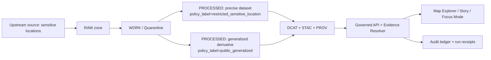

<!-- [KFM_META_BLOCK_V2]
doc_id: kfm://doc/422def86-e797-4583-aaa4-2b8e16b0f88f
title: Restricted Location Label Example
type: standard
version: v1
status: draft
owners: KFM stewards (TBD)
created: 2026-03-02
updated: 2026-03-02
policy_label: public
related:
  - TODO: docs/governance/labels/policy_label.md
  - TODO: docs/governance/policy/README.md
tags: [kfm, governance, labels, examples, restricted_location]
notes:
  - Illustrative example only — MUST NOT contain real restricted coordinates.
[/KFM_META_BLOCK_V2] -->

# Restricted Location Label Example
**One-liner:** How to label sensitive-location geospatial data so KFM can publish safe, generalized representations *without* leaking precise coordinates.


---

## Quick navigation
- [Purpose](#purpose)
- [What counts as a “restricted location” in KFM](#what-counts-as-a-restricted-location-in-kfm)
- [Label semantics](#label-semantics)
- [Recommended pattern](#recommended-pattern)
- [Example artifacts](#example-artifacts)
- [Policy obligations and UX](#policy-obligations-and-ux)
- [Tests and gates](#tests-and-gates)
- [Minimum verification steps](#minimum-verification-steps)
- [Appendix](#appendix)

---

## Purpose
This example demonstrates a **fail-closed** governance pattern for datasets that include **sensitive locations** (e.g., precise archaeological site points, nesting sites, culturally restricted places, etc.).

> **Safety note:** This file intentionally uses **fictional IDs** and **coarse geography only**. Do **not** copy/paste real coordinates into docs, Story Nodes, or Focus Mode prompts.

[Back to top](#quick-navigation)

---

## What counts as a “restricted location” in KFM
Use this pattern when publishing precise location information could enable harm (looting, harassment, targeting infrastructure, ecological harm, etc.) or triggers governance review.

Common examples:
- Archaeological site inventories (precise points/polygons)
- Sensitive ecological locations (nesting/denning sites)
- Restricted cultural knowledge tied to place
- Any partner-controlled layer that forbids public disclosure of precise geometry

[Back to top](#quick-navigation)

---

## Label semantics
KFM’s controlled vocabulary includes labels that support this workflow.

| policy_label | Intended audience | Geometry exposure | Typical use |
|---|---|---:|---|
| `restricted_sensitive_location` | Authorized roles only | **Precise** (may include points) | Canonical “truth” dataset for stewards/researchers |
| `restricted` | Authorized roles only | May be precise or not | Generic restricted data (not necessarily location-sensitive) |
| `public_generalized` | Public | **Generalized** (aggregation / admin unit / bbox-only) | Public-facing derivative (safe-to-show layer) |
| `public` | Public | As stored | Public datasets with no sensitive geometry risk |

> **Rule of thumb:** if it’s sensitive *because of* precise geometry, use `restricted_sensitive_location`, and publish a separate `public_generalized` derivative (if public representation is allowed at all).

[Back to top](#quick-navigation)

---

## Recommended pattern



**Key ideas:**
1. **Store precise geometries only** in a restricted dataset.
2. **Derive a public layer** that is generalized (county-level, grid, centroid-only, bbox-only—whatever the policy allows).
3. Treat generalization as a **first-class transform** recorded in provenance.
4. Enforce policy at every access surface (API, tiles, evidence resolution, exports).

[Back to top](#quick-navigation)

---

## Example artifacts

### 1) Dataset registry entries (illustrative)
> **PROPOSED (example schema):** field names are illustrative; align with the repo’s real registry schema.

```yaml
# data/registry/kfm_sensitive_sites_precise.yaml
dataset_slug: kfm_sensitive_sites_precise
title: "Sensitive Sites Inventory (Precise)"
policy_label: restricted_sensitive_location
sensitivity:
  reason: "Precise locations could enable harm"
  review_required: true
geometry:
  type: point
  contains_precise_coordinates: true
public_representation:
  allowed: true
  derivative_dataset_slug: kfm_sensitive_sites_public_generalized
```

```yaml
# data/registry/kfm_sensitive_sites_public_generalized.yaml
dataset_slug: kfm_sensitive_sites_public_generalized
title: "Sensitive Sites Inventory (Public — Generalized)"
policy_label: public_generalized
derived_from: kfm_sensitive_sites_precise
geometry_generalization:
  method: dissolve_to_admin_unit
  admin_unit: county
  reversibility_risk_notes: "No point geometries included; counts threshold applied"
```

### 2) DCAT record snippet (illustrative)
DCAT is expected to carry a policy label so discovery and exports can be filtered.

```json
{
  "dct:title": "Sensitive Sites Inventory (Public — Generalized)",
  "dct:description": "Generalized representation; precise geometry withheld.",
  "kfm:policy_label": "public_generalized"
}
```

### 3) STAC collection snippet (illustrative)
STAC can carry the policy label at the collection level.

```json
{
  "type": "Collection",
  "id": "kfm_sensitive_sites_public_generalized_2026-03.demo1234",
  "title": "Sensitive Sites (Generalized) — 2026-03.demo1234",
  "extent": {
    "spatial": { "bbox": [[-102.05, 36.99, -94.60, 40.00]] },
    "temporal": { "interval": [["1900-01-01T00:00:00Z", null]] }
  },
  "kfm:policy_label": "public_generalized"
}
```

> **NOTE:** Even “coarse” extents can be sensitive. Use the minimum spatial precision required for the public use case.

### 4) PROV activity snippet (illustrative)
Generalization should be represented as a provenance activity so it’s reviewable and reproducible.

```json
{
  "@type": "prov:Activity",
  "kfm:activity_type": "geometry_generalization",
  "kfm:geometry_generalization_method": "dissolve_to_admin_unit",
  "prov:used": ["kfm://dataset/@kfm_sensitive_sites_precise@2026-03.demo1234"],
  "prov:generated": ["kfm://dataset/@kfm_sensitive_sites_public_generalized@2026-03.demo1234"]
}
```

[Back to top](#quick-navigation)

---

## Policy obligations and UX

### Obligations (machine-readable)
When serving `public_generalized`, policy may attach an obligation such as “show a notice” so the UI must disclose that geometry was generalized.

**Example obligation:**
```json
{
  "type": "show_notice",
  "message": "Geometry generalized due to policy."
}
```

### UX behaviors (expected)
- Show a **policy badge** (`public_generalized`, `restricted_sensitive_location`, etc.) wherever a dataset/version is visible.
- Evidence drawer / citation resolution must be **policy-checked** (no bundle resolution if unauthorized).
- Story Nodes and Focus Mode outputs must not embed **precise coordinates** unless policy explicitly allows.

[Back to top](#quick-navigation)

---

## Tests and gates

### CI / promotion gates (minimum)
A dataset version cannot be promoted unless governance checks pass, including:
- policy label is assigned
- obligations are applied as required
- default-deny tests pass for restricted labels
- catalogs and cross-links resolve (EvidenceRefs resolve)

### “No leakage” tests (examples)
Implement tests that fail closed:
- **No restricted bbox leakage** in public tiles (no tile endpoints returning extents that reveal restricted geometry)
- **No coordinate fields** in public exports when derived from restricted-sensitive-location inputs
- **Policy-safe errors**: public users can’t infer restricted dataset existence from error details

[Back to top](#quick-navigation)

---

## Minimum verification steps
Use this checklist when you add a restricted-location dataset or publish a generalized derivative:

- [ ] Confirm the **precise dataset** is labeled `restricted_sensitive_location`.
- [ ] Confirm a **separate** `public_generalized` derivative exists (if any public representation is allowed).
- [ ] Confirm the **generalization method** is documented (and evaluated for reversibility risk).
- [ ] Confirm **PROV** records the generalization transform.
- [ ] Confirm policy tests include: public **deny** on restricted labels; public **allow** on public/generalized labels.
- [ ] Run “no leakage” tests for tiles/exports/story publishing.

[Back to top](#quick-navigation)

---

## Appendix

<details>
<summary>Example “public request vs steward request” (illustrative)</summary>

### Public user
- Dataset discovery: sees `public` and `public_generalized`.
- Attempts to access `restricted_sensitive_location`: denied, with policy-safe response (no metadata leakage).

### Steward user
- Can access both precise and generalized dataset versions.
- UI may still show obligations (e.g., “do not export”, “restricted use only”).

</details>
