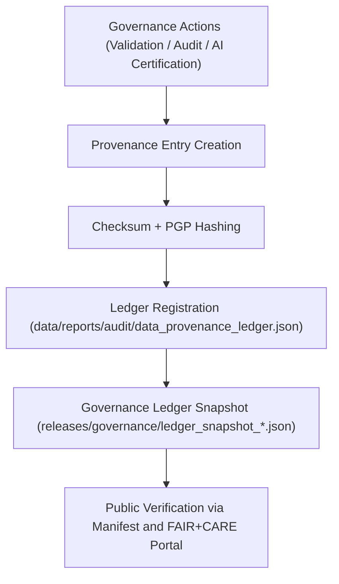

<div align="center">

# 🔗 Kansas Frontier Matrix — **Governance Ledger System & Provenance Architecture**
`docs/governance/ledger-system.md`

**Purpose:**  
Defines the **architecture, validation mechanisms, and ethical foundations** of the Kansas Frontier Matrix (KFM) Governance Ledger System — a blockchain-style, FAIR+CARE-certified provenance engine that secures all data, model, and audit trail records under immutable open governance.

[](../../docs/standards/faircare-validation.md)
[]()
[]()
[](../../LICENSE)

</div>

---

## 📚 Overview

The **KFM Governance Ledger System** functions as the central provenance registry for all operations within the Kansas Frontier Matrix.  
It ensures that every dataset, process, and AI model is **audited, timestamped, checksum-verified, and ethically certified** before publication or archival.

This system merges blockchain-style immutability with open metadata practices — creating a trusted foundation for scientific transparency and cultural accountability.

---

## 🧠 Core Principles

| Principle | Description | Alignment |
|------------|-------------|------------|
| **Immutability** | Every entry in the ledger is cryptographically sealed and append-only. | ISO 19115 / FAIR+CARE |
| **Transparency** | Governance actions and data lineage are public under open access. | FAIR+CARE / ISO 37000 |
| **Accountability** | Each ledger entry identifies validator, checksum, and decision authority. | MCP-DL v6.3 |
| **Reproducibility** | Entries reference validated artifacts and version-controlled manifests. | FAIR R1 / ISO 19115 |
| **Ethics** | All provenance actions comply with FAIR+CARE Council ethical oversight. | CARE E1 / ISO 37000 |
| **Sustainability** | Ledger system designed for low-carbon, open infrastructure. | ISO 14064 |

---

## ⚙️ Ledger Architecture Overview



### System Layers
1. **Entry Layer** – Records validation and audit actions.  
2. **Checksum Layer** – Verifies integrity using SHA-256 + PGP signatures.  
3. **Governance Layer** – Adds ethical context, reviewer identity, and decision metadata.  
4. **Publication Layer** – Syncs immutable ledger snapshots in `releases/governance/`.  

---

## 🧩 Ledger Data Model

| Field | Type | Description |
|--------|------|-------------|
| `ledger_id` | String | Unique identifier for the governance entry. |
| `timestamp` | ISO 8601 | UTC timestamp of record creation. |
| `entity_ref` | String | Path to dataset, model, or process under review. |
| `checksum` | String | SHA-256 hash for artifact integrity. |
| `validator` | String | Person or automated process verifying the entry. |
| `fairstatus` | Enum | FAIR+CARE compliance state (certified, pending, revoked). |
| `ai_audit` | Object | AI explainability or drift audit data (if applicable). |
| `decision_ref` | String | Governance record or council charter citation. |
| `pgp_signature` | String | Optional GPG verification hash. |
| `version_tag` | String | Release or dataset version. |

---

## 🧮 Example Governance Ledger Record

```json
{
  "ledger_id": "gov-ledger-2025Q4-001",
  "entity_ref": "data/work/processed/hazards/hazards_composite_v9.6.0.geojson",
  "checksum": "sha256:ef92a7bc13fa09f50b8dd47192ec68df92884eaf...",
  "validator": "@kfm-data",
  "fairstatus": "certified",
  "ai_audit": {
    "explainability_score": 0.985,
    "bias_detected": false
  },
  "decision_ref": "docs/governance/council-charter.md#section-4.3",
  "pgp_signature": "pgp-sha256:4ab9bcb3ac42fd21705e2cbb3272e99b8c1a4e2b",
  "timestamp": "2025-11-03T15:00:00Z",
  "version_tag": "v9.6.0"
}
```

Ledger entries automatically appended via `governance_sync.yml`.

---

## ⚖️ Governance Ledger Files

| File | Description | Retention |
|------|--------------|------------|
| `data/reports/audit/data_provenance_ledger.json` | Core append-only governance ledger. | Permanent |
| `releases/governance/ledger_snapshot_*.json` | Quarterly snapshot for public review. | 10 years |
| `releases/v9.6.0/manifest.zip` | Manifest cross-referencing checksum registry. | Permanent |
| `docs/governance/ledger-system.md` | Structural documentation and data model. | Continuous |

All governance records validated for consistency via `ledger_validation.yml`.

---

## 🧠 FAIR+CARE Ledger Compliance Matrix

| Principle | Implementation |
|------------|----------------|
| **Findable** | Each ledger entry indexed by unique `ledger_id` and release version. |
| **Accessible** | Public JSON snapshots published in `releases/governance/`. |
| **Interoperable** | Schema aligned with ISO 19115 and DCAT 3.0. |
| **Reusable** | Entries linked to data, models, and validation reports. |
| **Collective Benefit** | Promotes open accountability and ethical transparency. |
| **Authority to Control** | FAIR+CARE Council reviews and signs off all ledger records. |
| **Responsibility** | Validators maintain audit trace and checksum verification. |
| **Ethics** | Governance enforced with inclusive and sustainable oversight. |

---

## 🧩 Cryptographic & Validation Standards

| Standard | Purpose | Applied In |
|-----------|----------|-------------|
| **SHA-256** | Primary checksum algorithm for data and metadata. | Validation layer |
| **PGP Signature** | Authenticates validator identity. | Governance entries |
| **JSON Schema Validation** | Ensures structural integrity of ledger files. | Audit pipeline |
| **ISO 19115 Metadata Record** | Provides traceable lineage and schema. | Provenance mapping |
| **STAC / DCAT Integration** | Interoperability for spatial and catalog data. | Publication stage |

Checksum registry located at:  
`releases/v9.6.0/manifest.zip`

---

## 🌱 Sustainability & Infrastructure Governance

| Metric | Description | Standard | Verified By |
|---------|-------------|-----------|--------------|
| **Energy Use (per ledger sync)** | Total power draw per governance sync operation. | ISO 14064 | @kfm-sustainability |
| **Storage Efficiency** | JSON compression and delta encoding. | MCP-DL | @kfm-data |
| **Transparency Reports** | Quarterly publication of sustainability audits. | FAIR+CARE | @faircare-council |

All sustainability metrics stored in:  
`releases/v9.6.0/focus-telemetry.json`

---

## 🧮 Governance Ledger Telemetry Example

```json
{
  "metric": "governance_sync_energy_usage",
  "unit": "Wh",
  "average": 18.6,
  "timestamp": "2025-11-03T18:30:00Z",
  "verified_by": "@kfm-telemetry",
  "governance_ref": "releases/v9.6.0/focus-telemetry.json"
}
```

---

## 🧾 Internal Use Citation

```text
Kansas Frontier Matrix (2025). Governance Ledger System & Provenance Architecture (v9.6.0).
Documents the FAIR+CARE-certified governance ledger system used to maintain immutable provenance, checksum verification, and ethical oversight across the Kansas Frontier Matrix.
Implements ISO, STAC, and DCAT alignment for sustainable, open, and verifiable digital governance.
```

---

## 🧾 Version Notes

| Version | Date | Notes |
|----------|------|--------|
| v9.6.0 | 2025-11-03 | Added cryptographic PGP integration and sustainability telemetry tracking. |
| v9.5.0 | 2025-11-02 | Implemented FAIR+CARE ledger governance API synchronization. |
| v9.3.2 | 2025-10-28 | Established baseline governance ledger and provenance architecture. |

---

<div align="center">

**Kansas Frontier Matrix** · *Immutable Provenance × FAIR+CARE Governance × Sustainable Data Transparency*  
[🔗 Repository](https://github.com/bartytime4life/Kansas-Frontier-Matrix) • [⚖️ Governance Docs](./README.md) • [🧭 Standards](../standards/governance/DATA-GOVERNANCE.md)

</div>

