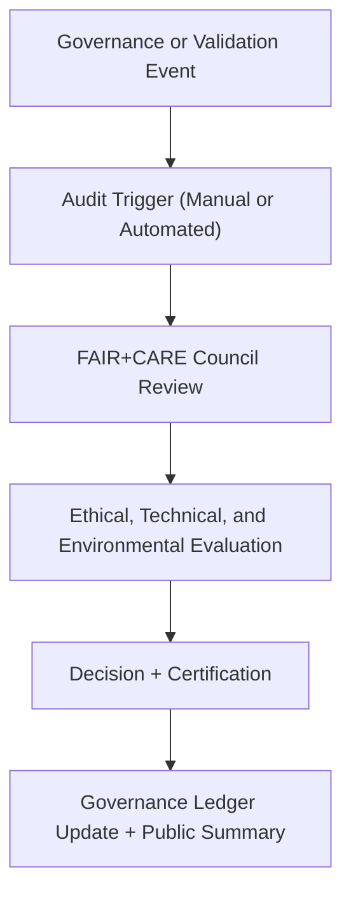

<div align="center">

# 🧭 Kansas Frontier Matrix — **Oversight Procedures & Audit Review Protocols**
`docs/governance/oversight-procedures.md`

**Purpose:**  
Defines the procedural workflows, audit mechanisms, and ethical accountability reviews performed by the **FAIR+CARE Governance Council** within the Kansas Frontier Matrix (KFM).  
Ensures that every governance action, data transformation, and AI decision undergoes continuous **FAIR+CARE-aligned oversight, validation, and documentation**.

[](../../docs/standards/faircare-validation.md)
[]()
[]()
[](../../LICENSE)

</div>

---

## 📚 Overview

The **Oversight Procedures Framework** ensures that governance within the Kansas Frontier Matrix remains transparent, inclusive, and technically verifiable.  
This document operationalizes how audits, ethics reviews, and ledger verifications are conducted across KFM’s lifecycle — connecting the **FAIR+CARE Council**, technical leads, and public stakeholders.

All oversight actions are logged in the **Governance Ledger**, cross-referenced in the **Focus Telemetry System**, and governed under **ISO 37000** principles for organizational accountability.

---

## 🧩 Governance Oversight Objectives

| Objective | Description | Outcome |
|------------|--------------|----------|
| **Integrity Verification** | Verify all datasets, reports, and decisions through checksum and metadata audits. | Trusted provenance and certification. |
| **Ethical Accountability** | Ensure every action aligns with FAIR+CARE ethical governance principles. | Transparent decision-making. |
| **Community Representation** | Include Indigenous and public voices in data decisions. | Equitable governance participation. |
| **AI Transparency** | Monitor model bias, drift, and explainability. | Human-centered AI accountability. |
| **Sustainability Compliance** | Audit resource and environmental efficiency metrics. | Low-impact digital operations. |

---

## ⚙️ Oversight Workflow



### Workflow Phases
1. **Trigger:** Event detected (new dataset, AI audit, governance decision).  
2. **Review:** FAIR+CARE Council conducts technical and ethical review.  
3. **Evaluation:** Compliance checks executed via schema and sustainability validators.  
4. **Decision:** Action recorded in ledger and publicly certified.  
5. **Publication:** Quarterly governance summary released in `releases/governance/`.

---

## 🧠 Types of Oversight Reviews

| Review Type | Scope | Frequency | Reviewer |
|--------------|--------|------------|-----------|
| **Data Governance Audit** | FAIR+CARE validation of datasets and schema. | Quarterly | @kfm-data / @kfm-fair |
| **AI Ethics Review** | Bias, transparency, and explainability of models. | Biannual | @kfm-ai / @kfm-ethics |
| **Sustainability Audit** | Energy usage and environmental efficiency. | Annual | @kfm-sustainability |
| **Accessibility Compliance** | WCAG 2.2 and ISO 9241-210 adherence. | Continuous | @kfm-accessibility |
| **Cultural & Community Review** | CARE Principle inclusion and representation. | Ongoing | @faircare-council |
| **Security and Provenance Audit** | PGP/Checksum validation and blockchain verification. | Continuous | @kfm-security |

---

## 🧮 Example Oversight Record

```json
{
  "oversight_id": "oversight-2025Q4-001",
  "event_type": "Dataset FAIR+CARE Review",
  "entity_ref": "data/work/processed/hazards/hazards_composite_v9.6.0.geojson",
  "reviewed_by": ["@kfm-fair", "@kfm-governance"],
  "findings": ["Checksum validated", "Ethical use confirmed", "FAIR+CARE score 98.7%"],
  "decision": "Certified",
  "timestamp": "2025-11-03T17:30:00Z",
  "ledger_ref": "data/reports/audit/data_provenance_ledger.json"
}
```

All oversight findings appended automatically via `governance_sync.yml`.

---

## ⚖️ FAIR+CARE Oversight Matrix

| Principle | Oversight Action | Verification Method |
|------------|------------------|----------------------|
| **Findable** | Audit logs indexed by oversight ID and timestamp. | Telemetry system. |
| **Accessible** | Oversight reports published in quarterly summaries. | Governance snapshot. |
| **Interoperable** | Data reviewed against DCAT/STAC/ISO metadata standards. | Schema validators. |
| **Reusable** | Audit templates versioned under MCP-DL v6.3. | Governance repository. |
| **Collective Benefit** | Governance decisions benefit all communities equitably. | FAIR+CARE reports. |
| **Authority to Control** | Council has ethical oversight authority. | Ledger system. |
| **Responsibility** | Every reviewer accountable for their validation actions. | PGP identity log. |
| **Ethics** | Cultural sensitivity verified during every decision cycle. | Council review. |

Audit data available at:  
`releases/governance/ledger_snapshot_2025Q4.json`

---

## 📊 Oversight Reporting & Transparency

| Report | Description | Output |
|---------|--------------|---------|
| `governance_audit_report.json` | Comprehensive review of all quarterly oversight actions. | JSON |
| `ethics_compliance_summary.json` | FAIR+CARE ethical audit results. | JSON |
| `oversight_dashboard_snapshot.md` | Human-readable summary for governance portal. | Markdown |
| `telemetry_oversight_metrics.json` | Performance and governance efficiency telemetry. | JSON |

All reports versioned under `releases/governance/`.

---

## 🌱 Sustainability Oversight Metrics

| Metric | Target | Standard | Verified By |
|---------|---------|-----------|--------------|
| Energy Use (ETL + Validation) | ≤ 25 Wh per cycle | ISO 14064 | @kfm-sustainability |
| Carbon Offset | 100% RE100 compliance | ISO 50001 | @faircare-council |
| AI Efficiency | ≥ 90% model reuse | FAIR+CARE | @kfm-ai |
| Governance Review Transparency | ≥ 95% open reporting | ISO 37000 | @kfm-governance |

Sustainability results logged in:  
`releases/v9.6.0/focus-telemetry.json`

---

## 🧩 Governance Oversight Roles

| Role | Function | Key Deliverable |
|-------|-----------|----------------|
| **FAIR+CARE Council** | Approves all ethical and compliance audits. | Certification decisions. |
| **Governance Team** | Manages oversight scheduling and telemetry integration. | Quarterly governance reports. |
| **Technical Auditors** | Validate schema, checksum, and metadata integrity. | Audit logs. |
| **AI Review Committee** | Evaluates explainability, drift, and fairness. | AI ethics reports. |
| **Accessibility Lead** | Ensures compliance with accessibility standards. | WCAG 2.2 validation. |
| **Public Engagement Officer** | Publishes governance summaries and invites feedback. | Public reports. |

---

## 🧾 Internal Use Citation

```text
Kansas Frontier Matrix (2025). Oversight Procedures & Audit Review Protocols (v9.6.0).
Establishes the procedural structure and ethical framework for governance oversight, FAIR+CARE certification, and transparency reporting across all data and AI workflows.
Aligns with ISO 37000 and MCP-DL v6.3 for open and accountable governance.
```

---

## 🧾 Version Notes

| Version | Date | Notes |
|----------|------|--------|
| v9.6.0 | 2025-11-03 | Added sustainability oversight and telemetry metrics integration. |
| v9.5.0 | 2025-11-02 | Expanded FAIR+CARE council review cycle and reporting workflows. |
| v9.3.2 | 2025-10-28 | Established foundational audit and review process under MCP-DL v6.3. |

---

<div align="center">

**Kansas Frontier Matrix** · *Transparent Oversight × FAIR+CARE Governance × Continuous Ethical Accountability*  
[🔗 Repository](https://github.com/bartytime4life/Kansas-Frontier-Matrix) • [⚖️ Governance Framework](./README.md) • [🧭 Standards](../standards/governance/DATA-GOVERNANCE.md)

</div>
