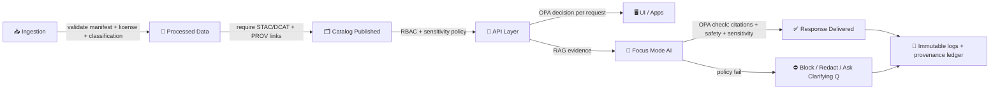

# 🛡️ Governance Policies (KFM)


> **North Star:** We ship *trustworthy* maps, stories, and answers by enforcing **policy at every gate** — and we default to **block** when anything is ungoverned.

This folder is the **human-readable governance hub** for the Kansas Frontier Matrix (KFM).  
It defines **what must be true** before data, content, or AI outputs are allowed to move forward.

---

## 🧭 Quick Links

- [🎯 Purpose](#-purpose)
- [🧱 Non‑negotiable Principles](#-nonnegotiable-principles)
- [🗂️ Policy Map](#️-policy-map)
- [🚦 Enforcement Gates](#-enforcement-gates)
- [👥 Roles & Responsibilities](#-roles--responsibilities)
- [🧾 Data + Metadata Requirements](#-data--metadata-requirements)
- [🧠 AI / Focus Mode Governance](#-ai--focus-mode-governance)
- [🧰 Working With Policies](#-working-with-policies)
- [🧩 Policy Doc Template](#-policy-doc-template)
- [🧯 Exceptions](#-exceptions)
- [📚 Glossary](#-glossary)

---

## 🎯 Purpose

Governance in KFM exists to protect:

- 🔐 **Data integrity** (no untracked changes, no “mystery datasets”)
- 🧑‍⚖️ **User privacy + ethical use**
- 🧭 **Community trust & accountability**
- 🧠 **AI reliability** (answers must be grounded in approved evidence)

This directory is the **policy index + documentation layer**.  
Actual enforcement is implemented through **policy-as-code** (e.g., OPA/Rego) and **CI gates**.

---

## 🧱 Non‑negotiable Principles

### 1) 🔒 Fail Closed (fail-safe defaults)
If **metadata is missing** or **policy is not satisfied**, KFM blocks the operation by default.

> [!IMPORTANT]
> If it’s not governed, it doesn’t ship.

### 2) 🧩 Policy-as-Code (OPA + CI + Runtime)
Policies are enforced:
- ✅ during **CI** (preventing merges/deploys)
- ✅ at **runtime** (per request, per user, per dataset)
- ✅ at **AI output time** (post-generation validation)

### 3) 🪪 Least Privilege (RBAC + sensitivity labels)
Access is scoped by **role** and the **sensitivity classification** of the data/content.
Typical roles include: **Public Viewer**, **Contributor**, **Maintainer**, **Admin**.

### 4) 🧾 Provenance Required (W3C PROV mindset)
Every dataset must have a **lineage record**:
- inputs
- transformations
- outputs
- who/what executed it
- when it ran
- checksums/manifest details

### 5) 🧠 Evidence-first AI
KFM treats the model as **untrusted text generation**:
- It must only use the **provided evidence**
- It must cite sources for **every factual claim**
- Outputs are validated by governance policy before returning to users

### 6) ✅ “No Source, No Answer”
If retrieval finds **no approved evidence**, the AI must refuse rather than guess.

### 7) 🌾 FAIR + CARE (data stewardship)
- **FAIR**: enforce metadata and interoperability as a gate (if not met, data doesn’t enter)
- **CARE**: protect community rights & sensitive Indigenous data (authority to control, collective benefit, responsibility)

### 8) 🫱🏽‍🫲🏾 Respect, Withdrawal, and Takedown
If an owner/community withdraws data or requests takedown:
- it must be **removed or hidden** according to policy
- access becomes **denied** (or the output becomes **aggregated/sanitized**)

---

## 🗂️ Policy Map

Below is the recommended policy structure for this folder (we keep docs **readable**, and we keep enforcement **testable**):

```text
📁 docs/
  📁 governance/
    📁 policies/
      📄 README.md  👈 you are here
      📄 ACCESS_CONTROL.md
      📄 DATA_GOVERNANCE.md
      📄 PROVENANCE_AUDIT.md
      📄 AI_GOVERNANCE.md
      📄 PRIVACY.md
      📄 SECURITY.md
      📄 COMMUNITY_ETHICS.md
      📄 EXCEPTIONS.md
      📁 templates/
        📄 POLICY_TEMPLATE.md
```

### 🧾 Suggested policy domains (what we govern)
| Domain | What it covers | Typical enforcement |
|---|---|---|
| 🔐 Access Control | RBAC/ABAC, dataset sensitivity, group ownership | OPA decisions per request |
| 🧾 Data Governance | required metadata, licensing, formats | CI gate + ingest gate |
| ⛓️ Provenance & Audit | PROV lineage, manifest logs, immutable records | pipeline gate + append-only logs |
| 🧠 AI Governance | citations, disallowed content, sensitivity redaction | AI gateway + OPA check |
| 🕵️ Privacy | PII rules, consent, minimization | ingestion rules + output masking |
| 🛠️ Security | secrets handling, dependency hygiene, hardening | CI checks + runtime controls |
| 🫱🏽‍🫲🏾 Community & Ethics | harm prevention, content warnings, takedowns | policy + maintainer review |

---

## 🚦 Enforcement Gates

KFM governance is enforced as **checkpoints** along the “truth path” (data → catalog → API → UI/AI).



### Gate 1 — 📥 Ingestion
**Required before processing continues:**
- source manifest (publisher info)
- license terms
- sensitivity classification (e.g., public / restricted)

### Gate 2 — 🗂️ Catalog Publication
**Required before data is discoverable:**
- metadata records (e.g., STAC/DCAT patterns)
- PROV lineage reference linked to the dataset

### Gate 3 — 🧩 Runtime Requests (API)
**Required for every request:**
- authenticated role
- policy decision based on dataset sensitivity & ownership
- allow/deny/sanitize behavior

### Gate 4 — 🧠 AI Output Gateway (Focus Mode)
**Required before returning an AI answer:**
- citations present (**No Source, No Answer**)
- no disallowed content
- no restricted info exposed to unauthorized users
- policy can require redaction/aggregation instead of full deny

---

## 👥 Roles & Responsibilities

> [!NOTE]
> Roles are implemented in access policy (RBAC) and enforced by policy-as-code.

- 👀 **Public Viewer**: reads publicly approved datasets/stories only
- ✍️ **Contributor**: drafts story nodes and suggests data; cannot publish directly
- 🧰 **Maintainer**: reviews, approves, manages content; enforces policy
- 🧑‍💻 **Admin**: runs ingestion pipelines, configures policies; still governed by policy checks

**Stewardship add-ons (recommended):**
- 🧾 **Data Steward**: metadata quality, licensing, provenance completeness
- 🔐 **Security Steward**: security posture, incident response alignment
- 🫱🏽‍🫲🏾 **Community Liaison / Ethics Council**: CARE oversight, takedowns, harm prevention

---

## 🧾 Data + Metadata Requirements

### ✅ Minimum required metadata (baseline)
For a dataset/story to be accepted:
- 🏷️ human-readable title + description
- 📌 geographic/temporal scope (where/when)
- 🧾 **license** (explicit, compatible)
- 🧪 sensitivity label (public/internal/confidential/restricted)
- 🔗 source reference(s) (publisher + retrieval path)

### ⛓️ Provenance (lineage)
Every published dataset must have:
- input entity list
- transformation activity description
- output entity pointer
- timestamp(s)
- agent(s) (pipeline script version + operator)

---

## 🧠 AI / Focus Mode Governance

### ✅ Evidence-first RAG
- Retrieval compiles a **numbered source bundle** (high-signal excerpts only)
- The model is instructed to answer **only using those sources**
- The model must cite sources as **[1], [2], ...** for factual claims

### ✅ Policy check after generation (OPA)
Before returning the answer:
- verify citation markers exist
- verify user role is authorized for any referenced sensitive sources
- verify output doesn’t violate safety rules
- optionally redact or sanitize segments

### 🧾 AI audit logging (immutable)
Every interaction should record:
- the question
- source bundle IDs used
- model + prompt version
- the policy decision outcome (allow/deny/redact)
- timestamps (append-only ledger)

---

## 🧰 Working With Policies

### ✅ When you add/change anything that affects trust
You must identify which policy domains apply, then update both:
1) 📄 **Policy docs** (this folder)
2) 🧩 **Policy-as-code + tests** (OPA/CI gates)

### Suggested workflow (PR-ready)
1. 🧭 Pick the policy doc(s) impacted (or create a new one)
2. ✍️ Update the policy statement(s) and enforcement notes
3. 🧪 Update/add OPA rules and CI tests (where applicable)
4. 🔍 Run checks locally (if configured)
5. ✅ Submit PR for maintainer review (and council review if CARE-sensitive)

---

## 🧩 Policy Doc Template

Use this format for every policy file in this folder:

```markdown
---
policy_id: GOV-000
status: draft  # draft | active | deprecated
owner: Governance WG
last_reviewed: 2026-02-04
enforcement:
  - ci
  - runtime
  - ai_gateway
---

# ✳️ Policy Title

## 🎯 Purpose
Why this policy exists.

## 📌 Scope
What it applies to (data types, endpoints, pipelines, users).

## ✅ Policy Statements
- MUST / MUST NOT / SHOULD rules (clear, testable).

## 🔧 Enforcement
- Where enforced (OPA, CI, pipeline gate, UI constraint)
- What happens on failure (block / sanitize / warn / require approval)

## 🧯 Exceptions
- Who can approve
- How to document
- Expiration / review

## 🧾 Auditability
- What gets logged
- Where provenance is stored
- How to reproduce decisions
```

---

## 🧯 Exceptions

Exceptions are allowed only when:
- they are **time-boxed**
- they are **documented**
- they are **approved by the right owners**
- they are **auditable** (decision + rationale + expiry)

> [!WARNING]
> “Temporary exception” without expiry becomes “forever vulnerability.” Don’t do that.

---

## 📚 Glossary

- **OPA**: Open Policy Agent (policy engine)
- **Rego**: policy language used by OPA
- **CI Gate**: automated checks that block merges/deploys on violations
- **RBAC**: role-based access control
- **Sensitivity label**: classification used to control disclosure (public → restricted)
- **PROV**: provenance / lineage record (W3C PROV-inspired)
- **STAC/DCAT**: metadata patterns used for dataset discoverability & interoperability
- **Focus Mode**: KFM’s evidence-first AI interface that returns cited answers

---

## ✅ Definition of Done (Governance)

A feature/data release is not “done” until:
- ✅ policy docs are updated
- ✅ enforcement exists (CI/runtime/AI gate as applicable)
- ✅ provenance is captured
- ✅ audit logging is in place
- ✅ sensitive cases have an owner + escalation path
