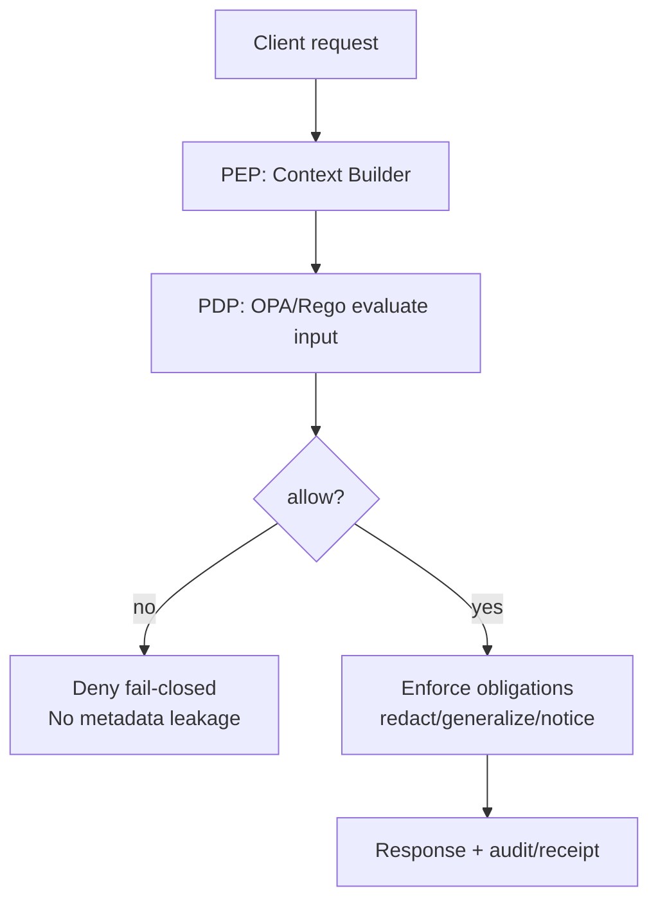

<!-- [KFM_META_BLOCK_V2]
doc_id: kfm://doc/5ef0c6ad-6b1d-4c0b-a7cf-79e2c8b76c8a
title: Policy Input Context
type: standard
version: v1
status: draft
owners: TBD
created: 2026-03-02
updated: 2026-03-02
policy_label: public
related:
  - docs/governance/policy/README.md
  - policy/
  - contracts/
tags: [kfm, governance, policy, opa, rego]
notes:
  - Defines the canonical "input" shape passed to the Policy Decision Point (PDP) for CI + runtime.
  - Anything marked PROPOSED must be validated against the live repo implementation before enforcement.
[/KFM_META_BLOCK_V2] -->

# Policy Input Context
**One-line purpose:** Canonical, testable `input` shape for evaluating KFM policies (CI + runtime) without guesswork.


---

## Navigate
- [Why this exists](#why-this-exists)
- [Non-negotiable invariants](#non-negotiable-invariants)
- [Contract overview](#contract-overview)
- [Field-by-field schema](#field-by-field-schema)
- [How context is built](#how-context-is-built)
- [Decision + obligations handling](#decision--obligations-handling)
- [Examples](#examples)
- [Testing requirements](#testing-requirements)
- [Change management](#change-management)

---

## Why this exists

KFM’s governance model requires **the same policy semantics in CI and runtime**, otherwise CI guarantees are meaningless. This doc defines the canonical `input` context that:
- CI policy tests (fixtures) evaluate
- Runtime API Policy Enforcement Points (PEPs) evaluate
- Evidence resolver evaluates before bundling evidence

> **Goal:** If a policy rule says “deny,” every enforcement point denies the same way, and every decision is auditable.

---

## Non-negotiable invariants

### I1. Default deny (MUST)
Policies MUST default to deny (`allow = false`) and require explicit allow rules.  
This is the baseline for sensitive-location and restricted datasets.

### I2. CI + runtime equivalence (MUST)
At minimum, fixtures and outcomes MUST match between CI and runtime evaluation.

### I3. PEPs enforce; UI displays (MUST)
- Runtime APIs and evidence resolver are PEPs and MUST enforce.
- UI MUST NOT make policy decisions; it may only display badges/notices.

### I4. No restricted leakage (MUST)
If a request is denied, responses MUST NOT leak restricted metadata (including in error messages).

### I5. Obligations are first-class (MUST)
If policy returns obligations (e.g., generalize geometry, remove fields, show notices), PEPs MUST:
- enforce them, and
- record them in receipts/audit artifacts.

---

## Contract overview

### Context versioning
This contract is versioned to allow safe, explicit evolution.

- `input.kfm.policy_input_version`: `"kfm.policy_input.v1"`

### Minimum required shape (CONFIRMED)
These are the **minimum confirmed fields** that appear in the vNext policy template.

- `input.user.role`
- `input.resource.policy_label`
- `input.action`

Everything else in this doc is either:
- **CONFIRMED** (supported by the vNext snapshots), or
- **PROPOSED** (recommended to support real-world enforcement/audit, but must be verified in repo before hard-coding).

---

## Field-by-field schema

> Types shown are JSON types unless noted.

### Top-level
| Field | Type | Required | Status | Notes |
|---|---:|:---:|:---:|---|
| `kfm` | object | ✅ | **PROPOSED** | Namespace for KFM-only fields. |
| `user` | object | ✅ | **CONFIRMED (min)** | Must include `role`. |
| `action` | string | ✅ | **CONFIRMED** | e.g. `"read"`, `"publish"`, `"resolve_evidence"`. |
| `resource` | object | ✅ | **CONFIRMED (min)** | Must include `policy_label`. |
| `request` | object | ⛔ | **PROPOSED** | Request metadata for audit/correlation. |
| `environment` | object | ⛔ | **PROPOSED** | Runtime environment metadata. |
| `time` | object | ⛔ | **PROPOSED** | Time-aware policy decisions. |
| `purpose` | object | ⛔ | **PROPOSED** | Intent-based controls (e.g., export vs view). |

### `user`
| Field | Type | Required | Status | Notes |
|---|---:|:---:|:---:|---|
| `role` | string | ✅ | **CONFIRMED** | Examples: `public`, `steward` (illustrative). |
| `subject` | string | ⛔ | **PROPOSED** | Stable user id (opaque). |
| `org` | object | ⛔ | **PROPOSED** | Org/tenant context if applicable. |
| `attributes` | object | ⛔ | **PROPOSED** | ABAC attributes only if needed. |
| `session` | object | ⛔ | **PROPOSED** | Session id, authn method, etc. |

### `resource`
| Field | Type | Required | Status | Notes |
|---|---:|:---:|:---:|---|
| `policy_label` | string | ✅ | **CONFIRMED** | Canonical label used by OPA. |
| `kind` | string | ⛔ | **PROPOSED** | e.g., `dataset`, `stac_item`, `story_node`, `evidence_bundle`. |
| `ids` | object | ⛔ | **PROPOSED** | `dataset_id`, `dataset_version_id`, `stac_id`, etc. |
| `license` | object | ⛔ | **PROPOSED** | Helpful for rights-based policy decisions. |
| `sensitivity` | object | ⛔ | **PROPOSED** | Optional mirror of classification rubric. |
| `location_risk` | object | ⛔ | **PROPOSED** | Flags for “sensitive locations” pattern. |

### `action`
Actions SHOULD be normalized to a small set so policy stays stable:
- `read`
- `query`
- `export`
- `publish`
- `resolve_evidence`
- `focus_ask`
- `admin`

> If you add a new action, you MUST add fixtures + tests for it.

### `kfm` (namespace)
| Field | Type | Required | Status | Notes |
|---|---:|:---:|:---:|---|
| `policy_input_version` | string | ✅ | **PROPOSED** | `"kfm.policy_input.v1"` |
| `correlation_id` | string | ⛔ | **PROPOSED** | Shared id across API logs/receipts. |
| `request_id` | string | ⛔ | **PROPOSED** | Idempotency/debugging. |
| `zone` | string | ⛔ | **PROPOSED** | e.g. `PUBLISHED`, `CATALOG`, `CI`. |

---

## How context is built

> This section is intentionally implementation-agnostic (it defines responsibilities, not code).

### Context builder responsibilities (PEP-side)
1. **Normalize action** (`read`, `resolve_evidence`, etc.).
2. **Extract user context**
   - Map identity → `user.role` (and optionally `user.subject`).
3. **Load resource metadata**
   - At minimum `resource.policy_label` must come from the authoritative catalog/registry.
4. **Call PDP** (OPA/Rego) with `input`.
5. **Enforce decision + obligations**
   - Deny → fail closed (no leakage).
   - Allow → enforce obligations (field removal, geometry generalization, notices).
6. **Emit audit record / receipt**
   - Include decision id and obligation list.

---

## Decision + obligations handling

### Expected PDP outputs (recommended)
The exact OPA output shape is implementation-specific, but PEPs MUST be able to obtain:
- `allow` boolean
- `obligations[]` (optional)
- `decision_id` (recommended for auditability)

**Obligations** are not “FYI.” They are enforcement instructions.

Examples of obligation types (illustrative):
- `{"type":"generalize_geometry","level":"county"}`
- `{"type":"remove_fields","fields":["owner_name","precise_location"]}`
- `{"type":"show_notice","message":"Geometry generalized due to policy."}`

---

## Examples

### Example 1 — Minimal “public reads public” (CONFIRMED MINIMUM SHAPE)
```json
{
  "user": { "role": "public" },
  "action": "read",
  "resource": { "policy_label": "public" }
}
```

### Example 2 — Minimal “public reads restricted” (should deny)
```json
{
  "user": { "role": "public" },
  "action": "read",
  "resource": { "policy_label": "restricted" }
}
```

### Example 3 — Public generalized dataset with a UI notice (obligations)
```json
{
  "user": { "role": "public" },
  "action": "read",
  "resource": {
    "policy_label": "public_generalized",
    "kind": "dataset",
    "ids": { "dataset_version_id": "kfm://dataset/example@2026-02.abcd1234" }
  },
  "kfm": { "policy_input_version": "kfm.policy_input.v1" }
}
```

### Example 4 — Evidence resolution (PROPOSED: action name; CONFIRMED: evidence must be policy-allowed)
```json
{
  "user": { "role": "public" },
  "action": "resolve_evidence",
  "resource": {
    "policy_label": "public",
    "kind": "evidence_ref",
    "ids": { "ref": "dcat://noaa_ncei_storm_events@2026-02.abcd1234" }
  }
}
```

---

## Testing requirements

### Policy pack must include (minimum)
- Fixtures for representative users and resources
- Tests that assert allow/deny outcomes for each action + label combo
- CI gate that runs policy tests and blocks merges on regression

> Do not ship policy changes without fixture updates.

### Required fixture matrix (starter)
| User role | Resource policy_label | Action | Expected |
|---|---|---|---|
| public | public | read | allow |
| public | restricted | read | deny |
| steward | restricted | read | allow (illustrative) |
| public | public_generalized | read | allow + obligation |

---

## Change management

### When to bump `policy_input_version`
Bump the version if you:
- rename core fields (`user.role`, `resource.policy_label`, `action`)
- change meaning of a field
- change action taxonomy in a breaking way

### Safe evolution rules
- Additive changes are OK without bump (new optional fields).
- Removing/renaming required fields requires bump + migration plan.
- CI + runtime MUST be upgraded together (or feature-gated) to avoid drift.

---

## Appendix: Reference flow (PDP/PEP)



---

_Back to top: [Policy Input Context](#policy-input-context)_
